--- 
title: "Introduction to R for Population dynamics"
author: "Anthony Davidson"
date: "Build from Ben Statons R book with contributions by Henry Hershey"
site: bookdown::bookdown_site
output: bookdown::gitbook
documentclass: book
bibliography: [book.bib, packages.bib]
biblio-style: apalike
link-citations: true
linkcolor: "blue"
urlcolor: "blue"
github-repo: bstaton1/au-r-workshop
description: "This is a first course in R programming for natural resource scientists. It was developed and has been primarily instructed at Auburn University."
---

# Overview{-#overview}

To begin with this model defines the life cycle of a species, then extendes this to estimate population size and growth rate over a projected time frame and then analysis the elasticity and sensistivity of the matrix population model. I have done this with southern right whales as an example.

## What is Covered? {-}

The book is composed of six chapters intended to cover a suite of topics in introductory R programming. In general, the material builds in complexity from chapter to chapter and earlier chapters can be seen as prerequisites for later chapters. 

*  **Chapter \@ref(ch1)** covers the basics of working in R through RStudio, including the basics of the R coding language and environment.
*  **Chapter \@ref(ch2)** covers the basics of plotting using the base R graphics functionality. 
*  **Chapter \@ref(ch3)** covers the basics of fitting statistical models using built-in functionality for generalized linear models as well as non-linear models.   
*  **Chapter \@ref(ch4)** covers the basics of simulation modeling in R. 
*  **Chapter \@ref(ch5)** covers the basics of the `{dplyr}` and `{reshape2}` packages for manipulating and summarizing large data sets using highly readable code.
*  **Chapter \@ref(ch6)** covers the basics of producing maps and performing spatial analysis in R. _This chapter was contributed by Henry Hershey_

## External Resources

`r if(knitr::is_html_output()) '<a href="https://github.com/bstaton1/au-r-workshop/"></a>' `This book is an extention of several gitbooks that are intended to be a first course in R programming for a range of different professionals. It is by no means comprehensive (no book about R ever could be), but instead attempts to introduce the main topics and develop the skills needed to get a beginner up and running with applying R to their own work in the context of population dynamics. Some of the courses were intended to be a companion to in-person workshop sessions. Although the examples shown have a natural resource/ecological theme, the general skills presented are general to R users across all scientific disciplines. 

## Based on following amazing course

**Instructor:** Kevin Shoemaker   
**Teaching Assistant** Ben Sedinger   
**Instructor's Office**: FA 220E			 		 
**Phone**: (775) 682-7449			  		
**Email**: kshoemaker_at_cabnr.unr.edu	
 
**Website**: [naes.unr.edu/shoemaker/teaching/NRES-470](http://naes.unr.edu/shoemaker/teaching/NRES-470/index.html)  

### Course Meeting Times
**Lecture & Discussion**: M, W at 10am (50 mins) (NOTE: please bring your laptop to class!)   
**Lab**: F at 10am (3 hours) 
**Office hours**:    
- Shoemaker: Wed from 11 to noon (FA 220E)    
- Sedinger: TBD 
  
- Lectures and Labs will be held in **FA 301**    
- Labs may occasionally be held in the NRES computer lab (**FA 234**)    

### Texts       
- [Gotelli, N. J. (1995). A primer of ecology](https://www.amazon.com/Primer-Ecology-Fourth-Nicholas-Gotelli/dp/0878933182)      
- [Beyond Connecting the Dots](http://beyondconnectingthedots.com/) (free download)   
•	Additional readings from the primary literature will be assigned for discussion periodically.    

### Software
- [InsightMaker- free web-based systems modeling tool](https://insightmaker.com/)(no installation needed)    
- [R- free statistical programming language](https://cran.r-project.org/)  
- [Program MARK](http://warnercnr.colostate.edu/~gwhite/mark/mark.htm)  
- MS Excel (hopefully you already have this or equivalent spreadsheet software on your laptop!)

### Prerequisites    
- BIOL 314 or NRES 217 (Ecology)  
- NRES 310 (Wildlife Ecology and Management)  

### Class description  
This class will explore how concepts of population ecology (e.g., covered in BIOL 314) can be used to inform the conservation and management of natural populations and ecosystems. We will emphasize practical approaches to problem-solving in ecology, conservation, and wildlife management via creative application of population ecology theory using simulation models and statistics. Topics will include population viability analysis (PVA), occupancy models, habitat-suitability models, metapopulation models, species co-occurrence models, projecting population response to climate change and more. Laboratory exercises will provide students with hands-on experience with ecological models and their practical applications in the conservation and management of wild populations.

### Learning outcomes
1.	Identify the major classes of models used by ecologists (e.g., statistical vs mechanistic, quantitative vs heuristic, stochastic vs deterministic) and explain how and why ecologists use these models.   
2.	Apply tools such as population viability analysis (PVA), occupancy models, and metapopulation models to address the conservation and management of natural populations.   
3.	Perform basic statistics, data visualization, simulation modeling and model validation with Excel, the statistical computing language “R”, and the web-based software, InsightMaker.  
4.	Critically evaluate the strength of inferences drawn from ecological simulation models using tools such as cross-validation and sensitivity analysis.  
5.	Explain how species interactions can influence population dynamics (e.g., predictions of species range shifts), and formulate strategies for accounting for species interactions in ecological models.    
6.	Communicate original research in applied population and community ecology via a professional-style oral presentation.   

### Grading: 
The course grade will be based on the following components:

Lab exercises (8 total)	         20%  (80 points)     
Quizzes and participation        10%  (40 points)     
Group project                    25%  (100 points)      
Midterm exam # 1 (date TBD)	     10%  (40 points)    
Midterm exam # 2 (date TBD)   	 10%  (40 points)    
Final exam (5/11/2018)   	       25%  (100 points)    

NOTE: Graduate students enrolled in NRES 670 will have an additional 50 pts used to calculate their grade (see below) of a total of 370 points. 
Grading scale: A (100 to 93), A- (92 to 90), B+ (89 to 87), B (86 to 83), B- (82 to 80), C+ (79 to 77), C (76 to 73), C- (72 to 70), D+ (69 to 67), D (66 to 63), D- (62 to 60), F (below 60). 

### Exams:
There will be two midterm exams and a comprehensive final exam. These will consist of multiple-choice, short-answer questions, and essay questions requiring synthesis of ideas and critical thinking. The midterm exam will be cumulative, and based on all information presented up through the week prior to the exam.

### Lectures
Lecture grades will be based primarily on participation and occasional short quizzes. Participation is essential to the learning process (and to our mutual enjoyment of this class). Learning is not a passive process; students are expected to engage with the material in class rather than simply listen and take notes. You should be prepared in class to ask questions, to answer questions posed by other students, and to engage in frequent problem-solving activities (in class). 

### Labs  
Lab exercises will focus on applying concepts and methods introduced in lectures, and will involve real data and problems in wildlife conservation and management wherever possible. Graded lab assignments will involve figures, tables, InsightMaker models and R code (when applicable) and responses to questions in short-answer format. Laboratory write-ups will be due the following lab period, unless otherwise specified. 

### Final group project 
Students will work in groups of ~2-3 to perform a population viability analysis (PVA) to rank conservation or management actions for a species of conservation concern (species of your choice!). Grading will be based on finished products (written and oral presentations) as well as participation and peer evaluations. 

### Graduate credit (for students enrolled in NRES 670) 
Graduate students will be subject to additional expectations in order to receive graduate credit for this course. In particular, graduate students will be expected to develop an original lecture and lead an original lab activity. Graduate students will also be expected to achieve a deeper understanding of the course material, and therefore will be assigned additional readings from the scientific literature and will be expected to participate as leaders in discussions and lab activities.

### Make-up policy and late work:
Missed exams and labs cannot be made up, except in the case of emergencies. If you miss a class meeting, it is your responsibility to talk to one of your classmates about what you missed. If you miss a lab meeting, you are still responsible for completing the lab activities and write-up on your own time. You do not need to let me know in advance that you are going to miss class or lab.

### Students with Disabilities
Any student with a disability needing academic adjustments or accommodations is requested to speak with the Disability Resource Center (Thompson Building, Suite 101) as soon as possible to arrange for appropriate accommodations.

### Statement on Academic Dishonesty
Cheating, plagiarism or otherwise obtaining grades under false pretenses constitute academic dishonesty according to the code of this university. Plagiarism is using the ideas or words of another person without giving credit to the original source; this includes copying another student in class. Always cite the source of your information. This includes copying or paraphrasing from a book, journal, or unpublished material without giving credit to the author(s), and submitting a term paper that was used in another course. Academic dishonesty will not be tolerated and penalties can include filing a final grade of "F"; reducing the student's final course grade one or two full grade points; awarding a failing mark on the coursework in question; or requiring the student to retake or resubmit the coursework. For more details, see the [University of Nevada, Reno General Catalog](http://catalog.unr.edu/).

### Statement on Audio and Video Recording
Surreptitious or covert video-taping of class or unauthorized audio recording of class is prohibited by law and by Board of Regents policy. This class may be videotaped or audio recorded only with the written permission of the instructor. In order to accommodate students with disabilities, some students may have been given permission to record class lectures and discussions. Therefore, students should understand that their comments during class may be recorded.

### Statement for Academic Success Services
Your student fees cover usage of the University Math Center [(775) 784-4433], University Tutoring Center [(775) 784-6801], and [University Writing Center (775) 784-6030]. These centers support your classroom learning; it is your responsibility to take advantage of their services.

### This is a safe space
The University of Nevada, Reno is committed to providing a safe learning and work environment for all. If you believe you have experienced discrimination, sexual harassment, sexual assault, domestic/dating violence, or stalking, whether on or off campus, or need information related to immigration concerns, please contact the University’s Equal Opportunity & Title IX Office at 775-784-1547. Resources and interim measures are available to assist you. For more information, please visit: http://www.unr.edu/equal-opportunity-title-ix .”

### Class protocol
All mobile electronic devices are to be turned off during class unless the instructor gives advance permission (but laptop computers will be used in class regularly).


```{r echo=FALSE, eval=FALSE}
rmarkdown::render('index.Rmd', 'word_document')
rmarkdown::render('schedule.Rmd', 'word_document')
rmarkdown::render('LAB1.Rmd', 'word_document')
rmarkdown::render('LAB2.Rmd', 'word_document')
rmarkdown::render('LAB3.Rmd', 'word_document')
rmarkdown::render('LAB4.Rmd', 'word_document')
rmarkdown::render('LAB5.Rmd', 'word_document')
rmarkdown::render('LAB6.Rmd', 'word_document')
rmarkdown::render('LAB7.Rmd', 'word_document')


## [Quiz #1](https://unr.instructure.com/courses/15896/quizzes/21572)
## [Quiz #2](https://unr.instructure.com/courses/15896/quizzes/24149)

### Field Trips
# We will be taking 1-2 field trips to collect wildlife population data. One field trip will be full-day, on a weekend: bring breakfast, lunch, and plenty of water. Bring any appropriate gear for spending the day in the field including: binoculars, spotting scopes, and field guides, and wear appropriate clothing for hiking. Be prepared for inclement weather.


## UPCOMING

- metapopulations
- source sink


```


<!--chapter:end:index.Rmd-->

# Getting started {#setup}

This chapter (\@ref, ch1) starts starts with the program setup (installing R) assuming no prior knowledge of programming in R or in any other language. In the later chapters, e.g., Chapters \@ref(ch2) and \@ref(ch3), an understanding of statistics at the introductory undergraduate level would be helpful but not strictly essential.

There are, however, some tasks you'll need to complete before using this book, which are described in the two sections that follow.

## Prepare Your Computer {-#comp-prep}

### Installation {-#install}

First off, you will need to get R and RStudio^[While it is possible to run R on its own, it is clunky. You are strongly advised to use the RStudio IDE (integrated development environment) given its compactness, neat features, code tools (like syntax and parentheses highlighting). This workshop will assume you are using RStudio] onto your computer. Go to:

*  <https://cran.rstudio.com/> to get R and
*  <https://www.rstudio.com/products/rstudio/download/> to get RStudio Desktop.

Download the appropriate installation file for your operating system and run that file. All default settings should be fine. 

### Optional Configuration {-}

As a matter of personal preference, you are recommended to configure a few settings. Open up RStudio and go to _Tools > Global Options_, and in the section listed "General":

*  Make sure _Restore .RData into workspace at startup_ is **unchecked**
*  Make sure _Save workspace to .RData on exit_ is set to **Never**
*  Make sure _Always save history (even when not saving .RData)_ is **unchecked**.

These settings will prevent you from getting a bunch of useless files and dialog boxes every time you open and close R.

### Create a Book Directory {-}

You should create a devoted folder on your computer for this book. All examples will assume this folder is located here: `C:/Users/YOU/Documents/R-Book`. Change `YOU` to be specific for your computer.

### Data Sets {-#data-sets}

The data sets^[Many of the data sets used in this book were simulated by the author. Cases in which the data set used was not simulated are noted and a citation to the data source is provided. More details on the individual data sets can be found on the GitHub repository.]
 used in this book are hosted on a GitHub repository maintained by the author. It is located here: <https://github.com/bstaton1/au-r-workshop-data>.

To acquire the data for this book, you should:

  1.  Navigate to the GitHub repository
  2.  click the green _Clone or download_ button at the top right,
  3.  click _Download ZIP_
  4.  unzip the contents of this folder into the location: `C:/Users/YOU/Documents/R-Book/Data`

File organization will be very important for your success in learning to use R. This book will assume your `R-Book` directory is organized as shown below. Notice that there is a separate folder for the data downloaded from GitHub as well as one for each chapter that will house the R code for that chapter. Do not worry about making all of these folders now, you will do this at the appropriate time as you work your way through this book. For now, just make sure there is a `Data` folder that contains all of the unzipped contents from the GitHub repository your main `R-Book` directory. This is the current status:

```{r, echo = F}
path = c(
  "R-Book/Data/asl.csv",
  "R-Book/Data/...",
  "R-Book/Data/Ch6",
  "R-Book/Chapter1/Ch1.R",
  "R-Book/Chapter1/Ex1A.R",
  "R-Book/Chapter1/Ex1B.R",
  "R-Book/Chapter2/Ch2.R",
  "R-Book/Chapter2/Ex2.R",
  "R-Book/Chapter3",
  "R-Book/Chapter4",
  "R-Book/Chapter5",
  "R-Book/Chapter6"
)

data.tree::as.Node(data.frame(pathString = path))
```

## Exercises {-}

Following each chapter, there are a collection of different exercises adapted from my own collaborations and the books I have merged to create this one. :) You should attempt and complete them, as they give you an opportunity to practice what you learned while reading and typing along. Solutions are provided at the end of this book, however you are **strongly** recommended to attempt to figure the problems out on your own before looking to how the author would solve them.

Some exercises have bonus questions. These are intended to challenge you with some of the more difficult tasks shown in the chapter or ask you to extend what you learned to a completely different problem. If you can get all of the non-bonus questions without looking at the solutions too much, you can consider yourself to have good understanding of that chapter's material. If you can complete the bonus questions with little or no help, that means you have mastered that chapter's material!

## Text Conventions {-#notation}

*  Regular text: a description of what you you should do, how some code works, or a general narrative of something.
*  `monospace`: references something in R
    *  `this()` references some function
    *  `this` references some other object
    *  `{this}` references an R package
    *  `C:/This` is a file path
*  **Bold** is intended to provide more emphasis to a word or topic. In general, new topics are introduced this way.
*  [Links](#notation): this is a link to some other location in this book. External links are provided with a full URL.
*  $Equations$: it is sometimes useful to describe concepts mathematically before showing how to do it in R.
*  ^[This is a footnote. If you're viewing this on GitHub Pages, click the arrow to the right to return to the text]: a footnote containing more information.

## Keyboard Shortcuts {-}

Several parts of this book in this book make reference to keyboard shortcuts. They are never necessary, but can help you be more efficient if you commit them to muscle memory. This book assumes you are using a PC for the keyboard shortcuts. If you are using a Mac, they will be different^[For some keyboard shortcuts, you may just need to swap out the **CTRL** keystroke for the **CMD** keystroke for a Mac computer]. For a complete list of RStudio's keyboard shortcuts specific to your operating system, go to _Help > Keyboard Shortcuts Help_.

## Development of this Book {-}

This book represents the first draft of a population dynamics text. It also combines the third reincarnation of the Auburn R Workshop Series, the pirateeeeR book and other R-books.

The book is hosted on [GitHub Pages](https://pages.github.com/), and was last built on `r format(Sys.time(), format = "%m-%d-%Y")`.

## About the orginal Author (Ben Staton) {-}

Ben Staton is a PhD candidate in the School of Fisheries at Auburn University. He studies quantitative methods for assessing fish populations for use in harvest management, with a focus on Pacific salmon in western Alaska. His interests are in population dynamics, Bayesian methods, Monte Carlo methods, and reproducible research. Ben has been using R on a daily basis since the beginning of his graduate work in 2014, and is enthusiastic about helping others learn to use R for their own work. 

<!--chapter:end:00-setting-up.Rmd-->

# The R Environment {#ch1}

```{r, echo = F, warning = F, message = F}
library(dplyr)
library(kableExtra)
library(knitr)
```

## Chapter Overview{-}

In this first chapter, you will get familiar with the basics of using R. You will learn:

*  how to use R as a basic calculator
*  some basic object types
*  some basic data classes
*  some basic data structures
*  how to read in data
*  how to produce basic data summaries
*  how to write out data
*  how to write your own functions

## Before You Begin {-}

Before you start this chapter, you should make sure you have read and done everything in the [Overview](#overview) pertaining to [preparing your computer](#comp-prep) for working through this book.

## The R Studio Interface

When you open up RStudio for the first time, you will see three panes: the left-hand side is the **console** where results from executed commands are printed, and the two panes on the right are for additional information to help you code more efficiently - don't worry too much about what these are at the moment. For now, focus your attention on the console.

### Write Some Simple Code

To start off, you will use R as a simple calculator. Type these commands (not the lines with `##`, those are output^[The formatting used here includes `##` on output to denote code and output separately. You won't see the `##` show up in your console.]) one at a time and hit **CTRL + ENTER** to run it. The spaces don't matter at all, they are used here for clarity and for styling. To learn more about standard R code styling, check out the section in @adv-r-cite on it^[Hadley Wickham's R code style guide: <http://adv-r.had.co.nz/Style.html>].

```{r Calculator1}
3 + 3
12/4
```

Notice that when you run each line, it prints the command and the output to the console. 

R is an **object oriented language**, which means that you fill objects with data and do things with them. Make an object called `x` that stores the result of the calculation `3 + 3` (type this and run using **CTRL + ENTER**):

```{r}
x = 3 + 3
```

Notice that running this line did not return a value as before. This is because in that line you are **assigning** a value to the object `x`. You can view the contents of `x` by typing its name alone and running just that:

```{r}
x
```

When used this way, the `=` sign denotes assignment of the value on the right-hand side to an object with the name on the left-hand side. The `<-` serves this same purpose so in this context the two are interchangeable:

```{r}
y <- 2 + 5
```

You can highlight smaller sections of a line to run as well. For example after creating `y` above, press the **up arrow** to see the line you just ran, highlight just the `y`, and press **CTRL + ENTER**. From this point forward, the verb "run" means execute some code using **CTRL + ENTER**.

You can use your objects together to make a new object:

```{r}
z = y - x
```

**Here are some things to note about object names:**

*  Object names can contain any of the following:
    - letters
    - numbers
    - the `.` or `_` symbols
*  Object names must start with a letter, not a number or symbol and cannot contain spaces
*  As a general rule, avoid naming your objects things that already have names in R, e.g., `data()`, `mean()`, `sum()`, `sd()`, etc.
*  Capitalization matters: `A` and `a` are two different objects
*  Keep your names short with abbreviations or shorthand

## Saving Your Code: Scripts {#scripts}

If you closed R at this moment, your work would be lost. Running code in the console like you have just done **does not save a record of your work**. To save R code, you must use what is called a **script**, which is a plain-text file with the extension `.R`. To create a new script file, go to _File > New File > R Script_, or use the keyboard shortcut **CTRL + SHIFT + N**. A new pane will open called the **source** pane - this is where you will edit your code and save your progress. R Scripts are a key feature of reproducible research with R, given that if they are well-written they can present a complete road map of your statistical analysis and workflow.

## The Working Directory {#working-dir}

Keeping things organized is essential to efficient use of R. For this book, you should have a separate subfolder for your scripts in each chapter. Create a subfolder called `C:/Users/YOU/Documents/R-Book/Chapter1` and save your `Ch1.R` script there. 

Part of keeping your work organized in R is making sure you know where R is looking for your files. One way to facilitate this is to use a **working directory**. This is the location (i.e., folder) on your computer that your current R session will "talk to" by default. R will read files from and write files to the working directory by default. Because you'll likely be visiting it often, it should probably be somewhere that is easy to remember and not too deeply buried in your computer's file system. 

To set the working directory to `C:/Users/YOU/Documents/R-Book/Chapter1`, you have three options:

1.  **Go to Session > Set Working Directory > Source File Location**. This will set the working directory to the location of the file that is currently open in your source pane.

2. **Go to Session > Set Working Directory > Choose Directory**. This will open an interactive file selection window to allow you to navigate to the desired directory.

3. **Use code**. In the console, you can type `setwd("C:/Users/YOU/Documents/R-Book/Chapter1")`. If at any point you want to know where your current working directory is set to, you can either look at the top of the console pane, which shows the full path or by running `getwd()` in the console. Note the use of `/` rather than `\` for file paths in R. If you are using a Mac, omit  `C:` from your directory name.

**The main benefits of using a working directory are**:

*  Files are read from and written to a consistent and predictable place every time
*  Everything for your analysis is organized into one place on your computer
*  You don't have to continuously type file paths to your work. If `file.txt` is a file in your current working directory, you can reference it your R session using `"file.txt"` rather than with `"C:/Users/YOU/Documents/R-Book/Chapter1/file.txt"` each time.

Note that while it is generally good practice to keep your data in the working directory, this is not recommended for this book. You will be using the same data files in multiple chapters, so it will help if they are all stored in one location. More details on this later (Section \@ref(read)).

## R Object Types

R has a variety of object types that you will need to become familiar with.

### Functions

Much of your work in R will involve functions. A function is called using the syntax:

```{r, eval = F}
fun(arg1 = value1, arg2 = value2)
```

Here, `fun()` is the **function name** and `arg1` and `arg2` are called **arguments**. Functions take input in the form of the arguments, do some task with them, then return some output. The parentheses are a sure sign that `fun()` is a function.

The syntax above passes the function two arguments by name: all functions have arguments, all arguments have names, and there is always a default order to the arguments. If you memorize the argument order of functions you use frequently, you don't have to specify the argument names:

```{r, eval = F}
fun(value1, value2)
```

would give the same result as the command above in which the argument names were specified.

Here's a real example:

```{r}
print(x = z)
```

The function is `print()`, the argument is `x`, and the value you have supplied the argument is the object `z`. The task that `print()` does is to print the value of `z` to the console.

R has a ton of built-in documentation to help you learn how to use a function. Take a look at the help file for the `mean()` function. Run `?mean` in the console: a window on the right-hand side of the R Studio interface should open. The help file tells you what goes into a function and what comes out. For more complex functions it also tells you what all of the options (i.e., arguments) can do. Help files can be a bit intimidating to interpret at first, but they are all organized the same and once you learn their layout you will know where to go to find the information you're looking for.

### Vectors

Vectors are one of the most common data structures. A vector is a set of numbers going in only one dimension. Each position in a vector is called an **element**, and the number of elements is called the **length** of the vector. Here are some ways to make some vectors with different elements, all of length five:

```{r}
# this is a comment. R will ignore all text on a line after a #
# the ; means run everything after it on a new line

# count up by 1
month = 2:6; month

# count up by 2
day = seq(from = 1, to = 9, by = 2); day

# repeat the same number (repeat 2018 5 times)
year = rep(2018, 5); year
```

The `[1]` that shows up is an element position, more on this later (see Section \@ref(sub)). If you wish to know how many elements are in a vector, use `length()`:

```{r}
length(year)
```

You can also create a vector "by-hand" using the `c()` function^[The `c` stands for **concatenate**, which basically means combine many smaller objects into one larger object]:

```{r}
# a numeric vector
number = c(4, 7, 8, 10, 15); number

# a character vector
pond = c("F11", "S28", "S30", "S8", 'S11'); pond
```

Note the difference between the numeric and character vectors. The terms "numeric" and "character"" represent **data classes**, which specify the type of data the vector is holding:

*  A **numeric vector** stores numbers. You can do math with numeric vectors
*  A **character vector** stores what are essentially letters. You can't do math with letters. A character vector is easy to spot because the elements will be wrapped with quotes^[`" "` or `' '` both work as long as you use the same on the front and end of the element]. 

A vector can only hold one data class at a time:

```{r}
v = c(1,2,3,"a"); v
```

Notice how all the elements now have quotes around them. The numbers have been **coerced** to characters^[The coercion works this way because numbers can be expressed as characters, but a letter cannot be unambiguously expressed as a number.]. If you attempt to calculate the sum of your vector:

```{r, error=T}
sum(v)
```

you would find that it is impossible in its current form.

### Matrices {#matrices}

Matrices act just like vectors, but they have two dimensions, i.e., they have both rows and columns. An easy way to make a matrix is by combining vectors you have already made:

```{r}
# combine vectors by column (each vector will become a column)
m1 = cbind(month, day, year, number); m1

# combine vectors by row (each vector will become a row)
m2 = rbind(month, day, year, number); m2
```

Just like vectors, matrices can hold only one data class (note the coercion of numbers to characters):

```{r}
cbind(m1, pond)
```

Each vector should have the same length.

### Data Frames {#data-frames}

Many data sets you will work with require storing different data classes in different columns, which would rule out the use of a matrix. This is where **data frames** come in:

```{r}
df1 = data.frame(month, day, year, number, pond); df1
```

Notice the lack of quotation marks which indicates that all variables (i.e., columns) are stored as their original data class. 

It is important to know what kind of object type you are using, since R treats them differently. For example, some functions can only use a certain object type. The same holds true for data classes (numeric vs. character). You can quickly determine what kind of object you are dealing with by using the `class()` function:

```{r}
class(day); class(pond); class(m1); class(df1)
```

## Factors {#factors}

At this point, it is worthwhile to introduce an additional data class: factors. Notice the data class of the `pond` variable in `df1`:

```{r}
class(df1$pond)
```

The character vector `pond` was coerced to a factor when you placed it in the data frame. A vector with a **factor** class is like a character vector in that you see letters and that you can't do math on it. However, a factor has additional properties: in particular, it is a grouping variable. See what happens when you print the `pond` variable:

```{r}
df1$pond
```

A factor has levels, with each level being a subcategory of the factor. You can see the unique levels of your factor by running:

```{r}
levels(df1$pond)
```

Additionally, factor levels have an assigned order (even if the levels are totally nominal), which will become important in Chapter \@ref(ch3) when you learn how to fit linear models to groups of data, in which one level is the "reference" group that all other groups are compared to (see Section \@ref(anova) for more details). 

If you run into errors about R expecting character vectors, it may be because they are actually stored as factors. When you make a data frame, you'll often have the option to turn off the automatic factor coercion. For example:

```{r, eval = F}
data.frame(month, day, year, number, pond, stringsAsFactors = F)
read.csv("streams.csv", stringsAsFactors = F)  # see below for details on read.csv
```

will result in character vectors remaining that way as opposed to being coerced to factors. This can be preferable if you are doing many string manipulations, as character vectors are often easier to work with than factors. 

## Vector Math {#vector-math}

R does vectorized calculations. This means that if supplied with two numeric vectors of equal length and a mathematical operator, R will perform the calculation on each pair of elements. For example, if you wanted to add the two vectors `day` and `month`, then you would just run:

```{r}
dm = day + month; dm
```

Look at the contents of both `day` and `month` again to make sure you see what R did. You typically should ensure that the vectors you are doing math with are of equal lengths. 

You could do the same calculation to each element of a vector (e.g., divide each element by 2) with:

```{r}
dm/2
```

## Data Subsets/Queries {#sub}

This is perhaps the most important and versatile skill to know in R. Say you have an object with data in it and you want to use it for analysis, but you don't want the whole data set: just a few rows or just a few columns, or perhaps you need just a single element from a vector. This section is devoted to ways you can extract certain parts of data objects (the terms **query** and **subset** are often used interchangeably to describe this task). There are three main methods:

1.  **By Index** -- This method allows you to pull out specific rows/columns by their location in an object. However, you must know exactly where in the object the desired data are. An **index** is a location of an element in a data object, like the element position or the position of a specific row or column. The syntax for subsetting a vector by index is `vector[element]` and for a matrix it is `matrix[row,column]`. Here are some examples:

```{r}
# show all of day, then subset the third element
day; day[3]

# show all of m1, then subset the cell in row 1 col 4 
m1; m1[1,4]

# show all of df1, then subset the entire first column
df1; df1[,1]
```

Note this last line: the `[,1]` says "keep all the rows, but take only the first column".

Here is another example: 
```{r}
# show m1, then subset the 1st, 2nd, and 4th rows and every column
m1; m1[c(1,2,4),]
```

Notice how you can pass a vector of row indices here to exclude the 3^rd^ and 5^th^ rows.

**2. By name** -- This method allows you to pull out a specific column of data based on what the column name is. Of course, the column must have a name first. The name method uses the `$` operator:

```{r}
df1$month
```

You can combine these two methods:

```{r}
df1$month[3]

# or
df1[,c("year", "month")]
```

The `$` method is useful because it can be used to add columns to a data frame:

```{r}
df1$dm = df1$day + df1$month; df1
```

3.  **Logical Subsetting** -- This is perhaps the most flexible method, but requires more explaining. It is described in Section \@ref(logsub). 

---

## Exercise 1A {-}

Take a break to apply what you've learned so far to enter the data found in Table `r if(is_html_output()) "\\@ref(tab:ex-1-table-htmlp)" else "\\@ref(tab:ex-1-table-pdfp)"` into R by hand and do some basic data subsets.

_The solutions to this exercise are found at the end of this book ([here](#ex1a-answers)). You are **strongly recommended** to make a good attempt at completing this exercise on your own and only look at the solutions when you are truly stumped._

```{r, echo = F}
Lake = c("Big", "Small", "Square", "Circle")
Area = c(100, 25, 45, 30)
Time = c(1000, 1200, 1400, 1600)
Fish = c(643, 203, 109, 15)
```

```{r ex-1-table-htmlp, echo = F, eval = is_html_output()}
kable(data.frame(Lake, Area, Time, Fish), 
      caption = "The table you should enter in to R by hand for Exercise 1A") %>%
  kable_styling(full_width = F) %>%
  column_spec(1:4, width = "5em")
```

```{r ex-1-table-pdfp, echo = F, eval = is_latex_output()}
kable(data.frame(Lake, Area, Time, Fish), "latex",
      caption = "The table you should enter in to R by hand for Exercise 1A")
```

1.	Create a new file in your working directory called `Ex_1A.R`.
2.	Enter these data into vectors. Call the vectors whatever you would like. Should you enter the data as vectors by rows, or by columns? (_Hint: remember the properties of vectors_).
3.	Combine your vectors into a data frame. Why should you use a data frame instead of a matrix?
4.	Subset all of the data from Small Lake.
5.	Subset the area for all of the lakes.
6.	Subset the number of fish for Big and Square lakes.
7.	You realize that you sampled 209 fish at Square Lake, not 109. Fix the mistake. There are two ways to do this, can you think of them both? Which do you think is better?
8.	Save your script. Close R and re-open your script to see that it was saved.

---

## Read External Data Files {#read}

It is rare that you will enter data by hand as you did in Exercise 1A. Often, you have a data set that you wish to analyze or manipulate that is stored in a spreadsheet. R has several ways to read information from data files and in this book, you will be using a common and simple method: reading in `.csv` files. `.csv` files are data files that separate columns with commas^[Note that if your computer is configured for a Spanish-speaking country, Microsoft Excel might convert decimals to commas. This can really mess with reading in data - I would suggest changing the language of Excel if you find this to be the case.]. If your data are in a Microsoft Excel spreadsheet, you can save your spreadsheet file as a `.csv` file (_File > Save As > Save as Type> CSV (Comma Delimited)_). Several dialog boxes will open asking if you are sure you want to save it as a `.csv` file. 

The syntax for reading in a `.csv` file is:

```{r, eval = F}
dat = read.csv("Path/To/FileName.csv")
```

Make sure your working directory is set to the location of your current file, which should be in the location `C:/Users/YOU/Documents/R-Book/Chapter 1`. According to the [instructions](#data-sets) on acquiring the data, you should have placed all of the data files for this book (downloaded from the [GitHub repository]()) in the location `C:/Users/YOU/Documents/R-Book/Data`. If you have done this already and your working directory is set to the location of the `Ch1.R` script, you can simply run:

```{r, eval = F}
dat = read.csv("../Data/streams.csv")
```

The `../` tells R to look up one directory from the working directory for a folder called `Data`, then within that, look for a file called `streams.csv`.

If you do not get an error, congratulations! However, if you get an error that looks like this:

```{r, echo = F, error = T}
dat = read.csv("streams.csv")
```

then fear not. This must be among the most common errors encountered by R users world-wide. It simply means the file you told R to look for doesn't exist where you told R to find it. Here is a trouble-shooting guide to this error:

1.  The exact case and spelling matters, as do the quotes and `.csv` at the end. Ensure the file name is typed correctly.
2.  Check what files are in the path you are specifying: run `dir("../Data")`. This will return a vector with the names of the files located in the `Data` directory (which is one folder up from your working directory). Is the file you told R was there truly in there? Is your working directory set to where you thought it was?

A simpler method is to put the data file in your working directory, in which case it can be read into R using `dat = read.csv("streams.csv")`. This method is not recommended for this book, because you will be using the same data files in multiple chapters, and it will help if they are all located in the same location.

If you did not get any errors, then the data are in the object you named (`dat`) and that object is a data frame. Do not proceed until you are able to get `read.csv` to run successfully.

**A few things to note about reading in `.csv` files**: 

*  R will assume the first row are column headers by default.
*  If there is a space in one of the header cells, a `"."` will be inserted. For example, the column header `Total Length` would become `Total.Length`. 
*  R brings in `.csv` files in as data frames by default.
*  If a record (i.e., cell) is truly missing and you want R to treat it that way (i.e., as an `NA`), you have three options:
    - Hard code an `NA` into that cell in your `.csv` file
    - Leave that cell completely empty in your `.csv` file
    - Enter in some other character (e.g., `"."`) alone in all cells that are meant to be coded as `NA` in R and use the `na.strings = "."` argument of `read.csv()`.
*  If at some point you did "Clear Contents" in Microsoft Excel to delete rows or columns from your `.csv` file, these "deleted" rows/columns will be read in as all `NAs`, which can be annoying. To remove this problem, open the `.csv` file in Excel, then highlight and **delete** the rows/columns in question and save the file. Read it back into R again using `read.csv()`.
*  If even a single character is found in a numeric column in `FileName.csv`, the _entire column_ will be coerced to a character/factor data class after it is read in (i.e., no more math with data on that column until you remove the character). A common error is to have a `#VALUE!` record left over from an invalid Excel function result. You must remove all of these occurrences in order to use that column as numeric. Characters include anything other than a number ([0-9]) and a period when used as a decimal. None of these characters: `!?[]\/@#$%^&*()<>_-+=[a-z];[A-Z]` should never be found in a column you wish to do math with (e.g., take the mean of that column). **This is an incredibly common problem!**

## Explore the Data Set {#data-summaries}

```{r, echo = F}
dat = read.csv("Data/streams.csv")
```

Have a look at the data. You could just run `dat` to view the contents of the object, but it will show the whole thing, which may be undesirable if the data set is large. To view the first handful of rows, run `head(dat)` or the last handful of rows with `tail(dat)`.

You will now use some basic functions to explore the simulated streams data before any analysis. The `summary()` function is very useful for getting a coarse look at how R has interpreted the data frame: 

```{r}
summary(dat)
```

You can see the spread of the numeric data and see the different levels of the factor (`state`) as well as how many records belong to each level. Note that there is one `NA` in the variable called `flow`.

To count the number of elements in a variable (or any vector), remember the `length()` function:

```{r}
length(dat$stream_width)
```

Note that R counts missing values as elements as well:

```{r}
length(dat$flow)
```

To get the dimensions of an object with more than one dimension (i.e., a data frame or matrix) you can use the `dim()` function. This returns a vector with two elements: the first number is the number of rows and the second is the number of columns. If you only want one of these, use the `nrow()` or `ncol()` functions (but remember, only for objects with more than one dimension; vectors don't have rows or columns!).

```{r}
dim(dat); nrow(dat); ncol(dat)
```

You can extract the names of the variables (i.e., columns) in the data frame using `colnames()`:

```{r}
colnames(dat)
```

Calculate the mean of all the `stream_width` records:

```{r}
mean(dat$stream_width)
```

Calculate the mean of all of the `flow` records:

```{r}
mean(dat$flow)
```

`mean()` returned an `NA` because there is an `NA` in the data for this variable. The way to tell R to ignore this `NA` is by including the argument `na.rm = TRUE` in the `mean()` function (separate arguments are always separated by commas). This is a **logical** argument, meaning that it asks a question. It says "do you want to remove `NAs` before calculating the mean?" `TRUE` means "yes" and `FALSE` means "no." `TRUE` and `FALSE` can be abbreviated as `T` and `F`, respectively. Many of R's functions have the `na.rm` argument (e.g. `mean()`, `sd()`, `var()`, `min()`, `max()`, `sum()`, etc. - most anything that collapses a vector into one number).  

```{r}
mean(dat$flow, na.rm = T)
```

which is the same as (i.e., the definition of the mean with the `NA` removed):

```{r}
sum(dat$flow, na.rm = T)/(nrow(dat) - 1)
```

What if you need to apply a function to more than one variable at a time? One of the easiest ways to do this (though as with most things in R, there are many) is by using the `apply()` function. This function applies the same summary function to individual subsets of a data object at a time then returns the individual summaries all at once:

```{r}
apply(dat[,c("stream_width", "flow")], 2, FUN = var, na.rm = T)
```

The first argument is the data object to which you want to apply the function. The second argument (the number `2`) specifies that you want to apply the function to columns, `1` would tell R to apply it to rows. The `FUN` argument specifies what function you wish to apply to each of the columns; here you are calculating the variance which takes the `na.rm = T` argument. This use of `apply()` alone is very powerful and can help you get around having to write the dreaded `for()` loop (introduced in Chapter \@ref(ch4)).

There is a whole family of `-apply()` functions, the base `apply()` is the most basic but a more sophisticated one is `tapply()`, which applies a function based on some grouping variable (a factor). Calculate the mean stream width **separated by state**:

```{r}
tapply(dat$stream_width, dat$state, mean)
```

The first argument is the variable to which you want to apply the `mean` function, the second is the grouping variable, and the third is what function you wish to apply. Try to commit this command to memory given this is a pretty common task.

If you want a data frame as output, you can use the `aggregate` function to do the same thing:

```{r}
aggregate(dat$stream_width, by = list(state = dat$state), mean)
```

## Logical/Boolean Operators

To be an efficient and capable programmer in any language, you will need to become familiar with how to implement numerical logic, i.e., the Boolean operators.  These are very useful because they always return a `TRUE` or a `FALSE`, off of which program-based decisions can be made (e.g., whether to operate a given subroutine, whether to keep certain rows, whether to print the output, etc.).

Define a simple object: `x = 5` `r x = 5`. Note that this will write over what was previously stored in the object `x`. Suppose you want to ask some questions of the new object `x` and have the answer printed to the console as a `TRUE` for "yes" and a `FALSE` for "no". Below are the common Boolean operators and their usage in R.

#### Equality {-}

To ask if `x` is exactly equal to 5, you run:

```{r}
x == 5
```

Note the use of the double `==` to denote equality as opposed to the single `=` as used in assignment (e.g., `x = 5`) or in argument specification (e.g., `mean(dat$flow, na.rm = T)`). 

#### Inequalities {-}

To ask if `x` is not equal to 5, you run:

```{r}
x != 5
```

The `!` is the logical **not** in R, and can be used to flip the direction of any `T` to a `F` or _vice versa_.

To ask if `x` is less than 5, you run:

```{r}
x < 5
```

To ask if `x` is less than _or equal to_ 5, you run:

```{r}
x <= 5
```

Greater than works the same way, though with the `>` symbol replaced.

#### In {-}

Suppose you want to ask which elements of one vector are also found within another vector:

```{r}
y = c(1,2,3)
x %in% y
# or
y = c(4,5,6)
x %in% y
# or
y %in% x
```

`%in%` is a very useful operator in R that is not one of the traditional Boolean operators.

#### And {-}

Suppose you have two conditions, and you want to know if **both are met**. For this you would use **and** by running:

```{r}
x > 4 & x < 6
```

which asks if `x` is between 4 and 6. 

#### Or {-}

Suppose you have two conditions, and you want to know if **either are met**. For this you would use **or** by running:

```{r}
x <= 5 | x > 5
```

which asks if `x` is less than or equal to 5 **or** greater than 5 - you would be hard-pressed to find a real number that did not meet these conditions!

## Logical Subsetting {#logsub}

A critical use of logical/Boolean operators is in the subsetting of data objects. You can use a logical vector (i.e., one made of only `TRUE` and `FALSE` elements) to tell R to extract only those elements corresponding to the `TRUE` records. For example:

```{r}
# here's logical vector: TRUE everywhere condition met
dat$stream_width > 60

# insert it to see only the flows for the TRUE elmements
dat$flow[dat$stream_width > 60]
```

gives all of the `flow` values for which `stream_width` is greater than 60.

To extract all of the data from Alabama, you would run:

```{r}
dat[dat$state == "Alabama",]
```

To exclude all of the data from Alabama, you would run:

```{r, eval = F}
dat[dat$state != "Alabama",]
```

You will be frequently revisiting this skill throughout the workshop.

## `if()`, `else`, and `ifelse()`

You can tell R to do something if the result of a question is `TRUE`. This is a typical if-then statement:

```{r}
if (x == 5) print("x is equal to 5")
```

This says "if `x` equals 5, then print the phrase 'x is equal to 5' to the console". If the logical returns a `FALSE`, then this command does nothing. To see this, change the `==` to a `!=` and re-run:

```{r}
if (x != 5) print("x is equal to 5")
```

Notice that because `x` does equal 5, running this line has no effect.

You can tell R to do multiple things if the logical is `TRUE` by using curly braces:

```{r}
if (x == 5) {
  print("x is equal to 5")
  print("you dummy, x is supposed to be 6")
}
```

You can always use curly braces to extend code across multiple lines whereas it may have been intended to go on one line.
 
If you want R to do something if the logical is `FALSE`, you would use the `else` command:

```{r}
if (x > 5) print("x is greater than 5") else print("x is not greater than 5")
```

Or extend this same thing to multiple lines:

```{r, eval = F}
if (x > 5) {
  print("x is greater than 5")
} else {
  print("x is not greater than 5")
} 
```

The `if()` function is useful, but it can only respond to one question at a time. If you supply it with a vector of length greater than 1, it will give a warning:

```{r}
# vector from -5 to 5, excluding zero
xs = c(-5:-1, 1:5)

# attempt a logical decision
if (xs < 0) print("negative") else print("positive")
```

Warnings are different than errors in that something still happens, but it tells you that it might not be what you wanted, whereas an error stops R altogether. In short, this warning is telling you that you passed `if()` a logical vector with more than 1 element, and that it can only use one element so it's picking the first one. Because the first element of `xs` is -5, `xs < 0` evaluated to `TRUE`, and you got a `"negative"` printed along with the warning.

To respond to multiple questions at once, you must use `ifelse()`. This function is similar, but it combines the `if()` and `else` syntax into one useful function function:

```{r}
ifelse(xs > 0, "positive", "negative")
```

The syntax is `ifelse(condition, do_if_TRUE, do_if_FALSE)`. You can `cbind()` the output with `xs` to verify it worked:

```{r}
cbind(
  xs,
  ifelse(xs > 0, "positive", "negative")
)
```

Use `ifelse()` to create a new variable in `dat` that indicates whether a stream is big or small depending on whether `stream_width` is greater or less than 50:

```{r}
dat$size_cat = ifelse(dat$stream_width > 50, "big", "small"); head(dat)
```

This says "make a new variable in the data frame `dat` called `size_cat` and assign each row a 'big' if `stream_width` is greater than 50 and a 'small' if less than 50". 

One neat thing about `ifelse()` is that you can nest multiple statements inside another^[You can nest **ALL** R functions, by the way.]. What if you wanted three categories: 'small', 'medium', and 'large'?

```{r}
dat$size_cat_fine = ifelse(dat$stream_width <= 40, "small",
                           ifelse(dat$stream_width > 40 & dat$stream_width <= 70, "medium", "big")); head(dat)
```

If the first condition is `TRUE`, then it will give that row a "small". If not, it will start another `ifelse()` to ask if the `stream_width` is greater than 40 _and_ less than or equal to 70. If so, it will give it a "medium", if not it will get a "big". Not all function nesting examples are this complex, but this is a neat example.  Without `ifelse()`, you would have to use as many `if()` statements as there are elements in `dat$stream_width`.

## Writing Output Files

### `.csv` Files
Now that you have made some new variables in your data frame, you may want to save this work in the form of a new `.csv` file. To do this, you can use the `write.csv` function:

```{r, eval = F}
write.csv(dat, "updated_streams.csv", row.names = F)
```

The first argument is the data frame (or matrix) to write, the second is what you want to call it (don't forget the `.csv`!), and `row.names = F` tells R to not include the row names (because they are just numbers in this case). R puts the file in your working directory unless you tell it otherwise. To put it somewhere else, type in the path with the new file name at the end (e.g., `C:/Users/YOU/Documents/R-Book/Data/updated_streams.csv`. 

### Saving R Objects

If all you care about is the data frame `dat` as interpreted by R (not a share-able file like the `.csv` method), then you can save the object `dat` (in its current state) then load it in to a future R session. You can save the new data frame using:

```{r, eval = F}
save(dat, file = "updated_streams")
```

Then try removing the `dat` object from your current session (`rm(dat)`) and loading it back in using:

```{r, eval = F}
rm(dat); head(dat)  # should give error
load(file = "updated_streams")
head(dat) # should show first 6 rows
```

## User-Defined Functions {#user-funcs}

Sometimes you may want R to carry out a specific task, but there is no built-in function to do it. In these cases, you can write your own functions. Function writing makes R incredibly flexible, though you will only get a small taste of this topic here. You will see more examples in later Chapters, particularly in Chapter \@ref(ch4).

First, you must think of a name for your function (e.g., `myfun`). Then, you specify that you want the object `myfun()` to be a function by using using the `function()` function. Then, in parentheses, you specify any arguments that you want to use within the function to carry out the specific task. Open and closed curly braces specify the start and end of your function body, i.e., the code that specifies how it uses the arguments to do its job.

Here's the general syntax for specifying your own function:

```{r}
myfun = function(arg1) {
  # function body goes here
    # use arg1 to do something
  
  # return something as last step
}
```

As an example, write a general function to take any number `x` to any power `y`:

```{r}
power = function(x, y){
  x^y
}

```

After typing and running the function code (`power()` is an object that must be assigned), try using it:

```{r}
power(x = 5, y = 3)
```

Remember, you can nest or embed functions:
```{r}
power(power(5,2),2)
```

This is the equivalent of $(5^2)^2$.

---

## Exercise 1B {-#ex1b}

In this exercise, you will be using what you learned in Chapter 1 to summarize data from a hypothetical pond experiment. 

Pretend that you added nutrients to mesocosoms and counted the densities of four different zooplankton taxa. In this experiment, there were two ponds, two treatments per pond, and five replicates of each treatment. The data are located in the data file `ponds.csv` (see the [instructions](#data-sets) on acquiring and organizing the data files for this book. There is one error in the data set. After you download the data and place it in the appropriate directory, make sure you open this file and fix it _before_ you bring it into R. Refer back to the information about reading in data (Section \@ref(read)) to make sure you find the error.

Create a new R script in your working directory for this chapter called `Ex1B.R` and use that script to complete this exercise.

_The solutions to this exercise are found at the end of this book ([here](#ex1b-answers)). You are **strongly recommended** to make a good attempt at completing this exercise on your own and only look at the solutions when you are truly stumped._

1.  Read in the data to R and assign it to an object.
2.	Calculate some basic summary statistics of your data using the `summary()` function.
3.	Calculate the mean chlorophyll _a_ for each pond (_Hint: pond is a grouping variable_)
4.	Calculate the mean number of _Chaoborus_ for each treatment in each pond using `tapply()`. (_Hint: You can group by two variables with:_ `tapply(dat$var, list(dat$grp1, dat$grp2), fun)`.
5.	Use the more general `apply()` function to calculate the variance for each zooplankton taxa found only in pond S-28.
6.	Create a new variable called `prod` in the data frame that represents the quantity of chlorophyll _a_ in each replicate. If the chlorophyll _a_ in the replicate is greater than 30 give it a "high", otherwise give it a "low". (_Hint: are you asking R to respond to one question or multiple questions? How should this change the strategy you use?_)

### Exercise 1B Bonus {-}
1.  Use `?table` to figure out how you can use `table()` to count how many observations of high and low there were in each treatment (_Hint: `table` will have only two arguments._).
2.	Create a new function called `product()` that multiplies any two numbers you specify.
3.	Modify your function to print a message to the console and return the value `if()` it meets a condition and to print another message and not return the value if it doesn't.

<!--chapter:end:01-intro-to-R.Rmd-->

# Base R Plotting Basics {#ch2}

```{r include = F}
rm(list = ls(all = T))
knitr::opts_chunk$set(fig.align = "center",
                      global.par = T)

op = par(no.readonly = T)
par(mar = c(4,4,2,1))
sp = par(no.readonly = T)
```

```{r, echo = F, warning = F, message = F}
library(dplyr)
library(kableExtra)
library(knitr)
```

## Chapter Overview{-}

In this chapter, you will get familiar with the basics of using R for making plots and figures. You will learn:

*  how to make various plots including:
    *  scatterplots
    *  line plots
    *  bar plots
    *  box-and-whisker plots
    *  histograms
*  the basics of how to change plot features like:
    *  the text displayed on axes labels
    *  the size and type of point symbols
    *  the color of features
*  the basics of multi-panel plotting
*  the basics of the `par()` function
*  how to save your plot to an external file

R's base `{graphics}` plotting package is incredibly versatile, and as you will see, it doesn't take much to get started making professional-looking graphs. It is worth mentioning that there are other R packages^[An **R package** is a bunch of code that somebody has written and placed on the web for you to install, their use is first introduced in Chapter \@ref(ch5)] for plotting that have nice features. The R packages `{ggplot2}` [@R-ggplot2] and `{lattice}` [@R-lattice] are good examples. However, they can be more complex to learn at first than the base R plotting capabilities and look a bit different.

**IMPORTANT NOTE**: If you did not attend the sessions corresponding to Chapter \@ref(ch1), you are recommended to walk through the material found in that chapter before proceeding to this material. Also note that if you are confused about a topic, you can use **CTRL + F** to find previous cases where that topic has been discussed in this book. 

## Before You Begin {-}

You should create a new directory and R script for your work in this Chapter. Create a new R script called `Ch2.R` and save it in the directory `C:/Users/YOU/Documents/R-Book/Chapter2`. Set your working directory to that location. Revisit Sections \@ref(scripts) and \@ref(working-dir) for more details on these steps.  

## R Plotting Lingo

Learning some terminology will help you get used to the base R graphics system:

*  A **high-level plotting function** is one that is used to make a new graph. Examples of higher level plotting functions are the general `plot()` and the `barplot()` functions. When-a high level plotting function is executed, the currently-displayed plot (if any) is written over.
*  A **low-level plotting function** is one that is used to modify a plot that has already been created. You must already have made a plot using a high-level plotting function before you use low-level plotting functions. Examples include `text()`, `points()`, and `lines()`. When a low-level plotting function is executed, the output is simply added to an existing plot. 
*  The **graphics device** is the area in which a plot is displayed. RStudio has a built in graphics device in its interface (lower right by default in the "Plots" tab), or you can create a new device. R will plot on the active device, which is the most recently created device. There can only be one active device at a time.

Here is an example of a basic R plot:

```{r, echo = F}
par(sp)
x = 0:10
y = x^2
plot(x = x, y = y,
     xlab = "x-axis label goes here",
     ylab = "y-axis label goes here",
     main = "Main Plot Title Goes Here")
```

There are a few components: 

*  The **plotting region**: all data information is displayed here.
*  The **margin**: where axis labels, tick marks, and main plot titles are located
*  The **outer margin**: by default, there is no outer margin. You can add one if you want to add text here or make more room around the edges.

You can change just about everything there is about this plot to suit your tastes. Duplicate this plot, but make the x-axis, y-axis, and main titles something other than the placeholders shown here:

```{r, eval = F}
# plot dummy data
x = 0:10
y = x^2
plot(x = x, y = y,
     xlab = "x-axis label goes here", 
     ylab = "y-axis label goes here",
     main = "Main Plot Title Goes Here")
```

Note that the first two arguments, `x` and `y`, specify the coordinates of the points (i.e., the first point is placed at coordinates `x[1]`,`y[1]`). `plot()` has _tons_ of arguments (or _graphical parameters_ as the help file found using `?plot` or `?par` calls them) that change how the plot looks. Note that when you want something displayed verbatim on the plotting device, you must wrap that code in `" "`, i.e., the arguments `xlab`, `ylab`, and `main` all receive a character vector of length 1 as input. 

Table `r if(is_html_output()) "\\@ref(tab:plot-arg-table-htmlp)" else "\\@ref(tab:plot-arg-table-pdfp)"` shows information on just a handful of the plotting settings to get you started.

```{r plot-arg-table-htmlp, echo = F, results = "asis", eval = is_html_output()}
pars = c("`xlab`", "`ylab`", "`main`", "`cex`", "`pch`", "`xlim`", "`ylim`", "`type`",
         "`lty`", "`lwd`", "`col`")

usage = c("`xlab = 'X-AXIS'`", "`ylab = 'Y-AXIS'`",
          "`main = 'TITLE'`", '`cex = 1.5`', '`pch = 17`', 
          "`xlim = range(x)`", '`ylim = c(0,1)`',
          "`type = 'l'`", '`lty = 2`', '`lwd = 2`', "`col = 'blue'`")

desc = c("changes the x-axis label text",
         "changes the y-axis label text",
         "changes the main title text",
         "changes the size of symbols in the plotting region^[`cex` is a multiplier: `cex = 1.5` says make the points 1.5 times as large as they would be by default.]",
         "changes the symbol type^[There are approximately 20 different `pch` settings: `pch = 1` is empty circles, `pch = 16` is filled circles, etc.]",
         "changes the endpoints (limits) of the x-axis^[`xlim` and `ylim` both require a numeric vector of length 2 where neither of the elements may be an `NA`.]",
         "same as `xlim`, but for the y-axis",
         "changes the way points are connected by lines^[The default is points only, `type = 'l'` is for lines only, `type = 'o'` is for points connected with lines, and `type = 'b'` is for points and lines but with a small amount of separation between them.]",
         "changes the line type^[`lty = 1` is solid, `lty = 2` is dashed, `lty = 3` is dotted, etc. You can also specific it like `lty = 'solid'`, `lty = 'dotted'`, or `lty = 'dotdash'`.]", 
         "changes the line width^[works just like `cex`: `lwd = 3` codes for a line that is 3 times as thick as it would normally be]",
         "changes the color of plotted objects^[there is a whole host of colors you can pass R by name, run `colors()` to see for yourself]")
df = data.frame(Arg. = pars, Usage = usage, Description = desc)
# pander::pandoc.table(df, justify = "lll", split.cells = c("10%", "30%", "60%"))
knitr::kable(df,
             caption = "Several of the key arguments to high- and low-level plotting functions")
```

```{r plot-arg-table-pdfp, echo = F, eval = is_latex_output()}
pars = c("xlab", "ylab", "main", "cex", "pch", "xlim", "ylim", "type",
         "lty", "lwd", "col")

usage = c('xlab = "X-AXIS"', 'ylab = "Y-AXIS"',
          'main = "TITLE"', 'cex = 1.5', 'pch = 17', 
          'xlim = range(x)', 'ylim = c(0,1)',
          'type = "l"', 'lty = 2', 'lwd = 2', 'col = "blue"')

desc = c("changes the x-axis label text",
         "changes the y-axis label text",
         "changes the main title text",
         "changes the size of symbols in the plotting region",
         "changes the symbol type",
         "changes the endpoints (limits) of the x-axis",
         "same as xlim, but for the y-axis",
         "changes the way points are connected by lines",
         'changes the line type', 
         "changes the line width",
         "changes the color of plotted objects")
df = data.frame(Argument = pars, Usage = usage, Description = desc)
# pander::pandoc.table(df, justify = "lll", split.cells = c("10%", "30%", "60%"))

kable(
  df, "latex", booktabs = T,
  caption = "Several of the key arguments to high- and low-level plotting functions",
  escape = F) %>%
  footnote(
    alphabet = c(
      "cex is a multiplier: cex = 1.5 says make the points 1.5 times as large as they would be by default.",
      "There are approximately 20 different pch settings: pch = 1 is empty circles, pch = 16 is filled circles, etc.",
      "xlim and ylim both require a numeric vector of length 2 where neither of the elements may be an NA.",
      'The default is points only, type = "l" is for lines only, type = "o" is for points connected with lines, and type = "b" is for points and lines but with a small amount of separation between them.',
      'lty = 1 is solid, lty = 2 is dashed, lty = 3 is dotted, etc. You can also specific it like lty = "solid", lty = "dotted", or lty = "dotdash".',
      "works just like cex: lwd = 3 codes for a line that is 3 times as thick as it would normally be",
      "there is a whole host of colors you can pass R by name, run colors() to see for yourself"
    ),
    footnote_as_chunk = F, threeparttable = T
  ) %>%
  kable_styling(full_width = F) %>%
  column_spec(3, width = "25em") %>%
  column_spec(1:2, monospace = T)
```

You are advised to try at least some of the arguments in Table `r if(is_html_output()) "\\@ref(tab:plot-arg-table-htmlpp)" else "\\@ref(tab:plot-arg-table-pdfp)"` out for yourself with your `plot(x, y)` code from above - notice how every time you run `plot()`, a whole new plot is created, not just the thing you changed. There are definitely other options: check out `?plot` or `?par` for more details. 

## Lower Level Plotting Functions

Now that you have a base plot designed to your liking, you might want to add some additional "layers" to it to represent more data or other kind of information like an additional label or text. Add some more points to your plot by putting this line right beneath your `plot(x,y)` code and run just the `points()` line (make sure your device is showing a plot first): 

```{r, eval = F}
# rev() reverses a vector: so the old x[1] is x[11] now
points(x = rev(x), y = y, col = "blue", pch = 16)
```

```{r, echo = F}
par(sp)
plot(x = x, y = y, xlab = "x-axis label goes here", ylab = "y-axis label goes here",
      main = "Main Plot Title Goes Here")
points(x = rev(x), y = y, col = "blue", pch = 16)
```

Here, `points()` acted like a low-level plotting function because it added points to a plot you already made. Many of the arguments shown in Table `r if(is_html_output()) "\\@ref(tab:plot-arg-table-htmlp)" else "\\@ref(tab:plot-arg-table-pdfp)"` can be used in both high-level and low-level plotting functions (notice how `col` and `pch` were used in `points()`). Just like `points()`, there is also `lines()`:

```{r, eval = F}
lines(x = x, y = x, lty = 2, col = "red")
```

```{r, eval = T, echo = F}
par(sp)
plot(x = x, y = y, xlab = "x-axis label goes here",
     ylab = "y-axis label goes here", main = "Main Plot Title Goes Here")
points(x = rev(x), y = y, col = "blue", pch = 16)
lines(x = x, y = y, lty = 2, col = "red")
```

You can add text to the plotting region:

```{r, eval = F}
text(x = 5, y = 80, "This is Text", cex = 1.5, col = "grey", font = 4)
```

```{r, eval = T, echo = F}
par(sp)
plot(x = x, y = y, xlab = "x-axis label goes here", ylab = "y-axis label goes here",
      main = "Main Plot Title Goes Here")
points(x = rev(x), y = y, col = "blue", pch = 16)
lines(x = x, y = y, lty = 2, col = "red")
text(x = 5, y = 80, "This is Text", cex = 1.5, col = "grey", font = 4)
```

The text is centered on the coordinates you provide. You can also provide vectors of coordinates and text to write different things at once.

The easiest way to add a straight line to a plot is with `abline()`. By default it takes two arguments: `a` and `b` which are the y-intercept and slope, respectively, e.g., `abline(0,1)` will draw a 1:1 line, as will `abline(c(0,1))`. You can also do `abline(h = 5)` to draw a horizontal line at 5 or `abline(v = 5)` to draw a vertical line at `5`.

You can see that the text is centered on the coordinates `x = 5` and `y = 80` using `abline()`:

```{r, eval = F}
abline(h = 80, col = "grey")
abline(v = 5, col = "grey")
```

```{r, eval = T, echo = F}
par(sp)
plot(x = x, y = y, xlab = "x-axis label goes here", ylab = "y-axis label goes here",
      main = "Main Plot Title Goes Here")
points(x = rev(x), y = y, col = "blue", pch = 16)
lines(x = x, y = y, lty = 2, col = "red")
text(x = 5, y = 80, "This is Text", cex = 1.5, col = "grey", font = 4)
abline(h = 80, col = "grey"); abline(v = 5, col = "grey")
```

If you accidentally add a plot element that you don't want using a low-level plotting function, the only way to remove it is by re-running the high-level plotting function to start a new plot and adding only the objects you want. Try removing the "This is Text" text and the straight lines you drew with `abline()` from the plot displayed in your device.

## Other High-Level Plotting Functions

You have just seen the basics of making two-dimensional scatter plots and line plots. You will now explore other types of graphs you can make. 

### The Bar Graph
Another very common graph is a bar graph.  R has a `barplot()` function, and again, it has lots of arguments. Here you will just make two common variations: single bars per group and multiple bars per group. Create a vector and plot it:

```{r, eval = F}
x1 = c(2,4,6)
barplot(x1)
```

```{r, echo = F}
par(sp)
x1 = c(2,4,6)
barplot(x1)
```

Notice that there are no group names on the bars (if `x1` had names, there would be). You can add names by using the argument `names.arg`:

```{r, eval = F}
barplot(x1, names.arg = c("a", "b", "c"))
```

Add some more information by including two bars per group. Create another vector and combine it with the old data:

```{r, eval = F}
x2 = c(3,5,7)
x3 = rbind(x1, x2)
barplot(x3, names.arg = c("a", "b", "c"), beside = T)
```

```{r, echo = F}
par(sp)
x2 = c(3,5,7)
x3 = rbind(x1, x2)
barplot(x3, names.arg = c("a", "b", "c"), beside = T)
```

To add multiple bars per group, R needs a matrix like you just made.  The **columns** store the heights of the bars that will be placed together in a group. Including the `beside = T` argument tells R to plot all groups as different bars as opposed to using a stacked bar graph.

Oftentimes, you will want to add error bars to a bar graph like this. To avoid digressing too much here, creating error bars is covered as a bonus topic (Section \@ref(error-bars)).

## Box-and-Whisker Plots {#box-whisker}

Box-and-whisker plots are a great way to visualize the spread of your data. All you need to make a box-and-whisker plot is a grouping variable (a factor, revisit Section \@ref(factors) if you don't remember what these are) and some continuous (i.e., numeric) data for each level of the factor. You will be using the `creel.csv` data set (see the [instructions](#data-sets) on acquiring and placing the data files in the appropriate location).

Read the data in and print a summary:

```{r, eval = F}
dat = read.csv("../Data/creel.csv")
summary(dat)
```

```{r, echo = F}
dat = read.csv("Data/creel.csv")
summary(dat)
```

This data set contains some simulated (i.e., fake) continuous and categorical data that represent 300 anglers who were creel surveyed^[A creel survey is a sampling program where fishers are asked questions about their fishing behavior in order to estimate effort and harvest.]. In the data set, there are three categories (levels to the factor `fishery`) and the continuous variable is how many hours each angler fished this year. If you supply the generic `plot()` function with a continuous response (`y`) variable and a categorical predictor (`x`) variable, it will automatically assume you want to make a box-and-whisker plot:

```{r, eval = F}
plot(x = dat$fishery, y = dat$hours)
```

```{r, echo = F}
par(sp)
plot(x = dat$fishery, y = dat$hours)
```

In the box-and-whisker plot above, the heavy line is the median, the ends of the boxes are the 25^th^ and 75^th^ percentiles and the "whiskers" are the 2.5^th^ and 97.5^th^ percentiles. Any points that are outliers (i.e., fall outside of the whiskers) will be shown as points^[Outliers can be turned off using the `outline = F` argument to the `plot()` function].

It is worth introducing a shorthand syntax of typing the same command:

```{r, eval = F}
plot(hours ~ fishery, data = dat)
```

Instead of saying `plot(x = x.var, y = y.var)`, this expression says `plot(y.var ~ x.var)`. The `~` reads "as a function of". By specifying the `data` argument, you no longer need to indicate where the variables `hours` and `fishery` are found. Many R functions have a `data` argument that works this same way. It is sometimes preferable to plot variables with this syntax because it is often less code and is also the format of R's statistical equations^[Which allows you to easily copy and paste the code between the model and plot functions, see Chapter \@ref(ch3)]. 

## Histograms

Another way to show the distribution of a variable is with histograms. These figures show the relative frequencies of observations in different discrete bins. Make a histogram for the hours the surveyed tournament anglers fished this year:

```{r, eval = F}
hist(dat$hours[dat$fishery == "Tournament"])
```

```{r, echo = F}
par(sp)
hist(dat$hours[dat$fishery == "Tournament"])
```

Notice the subset that extracts hours fished for tournament anglers only before plotting.

`hist()` automatically selects the number of bins based on the range and resolution of the data. You can specify how many evenly-sized bins you want to plot:

```{r, eval = F}
# extract the hours for tournament anglers
t_hrs = dat$hours[dat$fishery == "Tournament"]

# create the bin endpoints
nbins = 20
breaks = seq(from = min(t_hrs), to = max(t_hrs), length = nbins + 1)
hist(t_hrs, breaks = breaks, main = "Tournament", col = "grey")
```

```{r, echo = F}
# extract the hours for tournament anglers
t_hrs = dat$hours[dat$fishery == "Tournament"]

# create the bin endpoints
nbins = 20
breaks = seq(from = min(t_hrs), to = max(t_hrs), length = nbins + 1)
par(sp)
hist(t_hrs, breaks = breaks, main = "Tournament", col = "grey")
```

## The `par()` Function

If it bothers you that the axes are "floating", you can fix this using this command:

```{r}
par(xaxs = "i", yaxs = "i", mar = c(4,4,2,1))
hist(t_hrs, breaks = breaks, main = "Tournament", col = "grey")
```

Here, you changed the graphical parameters of the graphics device by using the `par()` function. Once you change the settings in `par()`, they will remain that way until you start a new device.

The `par()` function is central to fine-tuning your graphics. Here, the `xaxs = "i"` and `yaxs = "i"` arguments essentially removed the buffer between the data and the axes. `par()` has options to change the size of the margins, add outer margins, change colors, etc. Some of the graphical parameters that can be passed to high- and low-level plotting functions (like those in Table `r if(is_html_output()) "\\@ref(tab:plot-arg-table-htmlp)" else "\\@ref(tab:plot-arg-table-pdfp)"`) can also be passed `par()`. Check out the help file (`?par`) to see everything it can do. If you want to start over with fresh `par()` settings, start a new device.

The `mar` argument controls how many lines of margin text are on each side of the plotting region: `mar[1]` is the bottom margin, `mar[2]` is left, `mar[3]` is top, and `mar[4]` is right. There is also `par(oma = c())` for outer margins. You can specify these in inch units instead of margin lines using the `mai` or `omi` arguments.

## New Temporary Devices

If you are using RStudio, then likely all of the plots you have made thus far have shown up in the lower right-hand corner or your RStudio window. You have been using RStudio's built-in plotting device. If you want to open a new plotting device (maybe to put it on a separate monitor), you can use the following commands, depending on your operating system:

*  **Windows Users** -- just run `windows()` to open up a new plotting device. It will become the active device.
*  **Mac Users** -- similarly, you can run `quartz()` to open a new device.
*  **Linux Users** -- similarly, just run `x11()`. 

## Multi-panel Plots 

Sometimes you want to display more than one plot at a time. You can make a multi-panel plot which allows for multiple plotting regions to show up simultaneously within the same plotting device. First, you need to change the layout of the plotting region. The easiest way to set up the device for multi-panel plotting is by using the `mfrow` argument in the `par()` function.

Below, the code says "set up the graphical parameters so that there is 1 row and 3 columns of plotting regions within the device". Every time you make a new plot, it will go in the next available plotting region (regions fill from left to right, and from top to bottom; use `mfcol` if you wish to fill columns before rows). Make 3 histograms, each that represents a different sector of the fishery:

```{r, eval = T, fig.height = 3, results = "hide"}
par(mfrow = c(1,3), mar = c(4,1,2,1), oma = c(0,3,0,0))
sapply(levels(dat$fishery), function(f) {
  hist(dat$hours[dat$fishery == f], main = f, xlab = "")
})
mtext(side = 2, outer = T, line = 1.5, "Frequency", cex = 0.8)
```

Here, `sapply()` applied a user-defined function that plots a histogram for a given fishery type to each of the fishery types separately^[`sapply()` works like `apply()`, except on vectors only so you don't need to supply it with a `1` or `2` for rows or columns], which allowed you to only need to type the `hist()` code once. Notice the `par(oma)` setting to add outer margins on the left and the `mtext()` function to add a common y-axis label to all the figures.

There are other ways to make multi-panel plots, however, they are beyond the scope of this introductory material. See `?layout` for details. With this function you can change the size of certain plots and make them have different shapes (i.e., some squares, some rectangles, etc.), but it takes some pretty involved (though not impossible, by any means) specification of how you want the device to be split up into regions.

## Legends

Oftentimes you will want to add a legend to a plot to help people interpret what it is showing. You can add legends to R plots using the low-level plotting function `legend()`. Add a legend to the bar plot you made earlier with two groups. First, re-make the plot by running the high-level `barplot()` function, but change the colors of the bars to be shades of blue and red. Once you have the plot made, add the legend:

```{r}
par(mar = c(4,4,2,1))
barplot(x3, beside = T, 
        names.arg = c("a", "b", "c"),
        col = c("skyblue2", "tomato2"))
legend("topleft", legend = c("Group 1", "Group 2"),
       fill = c("skyblue2", "tomato2"))
```

The box can be removed using the `bty = "n"` argument and the size can be changed using `cex`. The position can be specified either with words (like above) or by using x-y coordinates.

Here is a more complex example:

```{r}
# 1) extract and sort the hours for two fisheries from fewest to most hours fished
t_hrs = sort(dat$hours[dat$fishery == "Tournament"])
n_hrs = sort(dat$hours[dat$fishery == "Non.Tournament"])

# 2) make the plot: plot for t_hrs only, but ensure xlim covers both groups
# set the margins: 
  # 4 lines of margin space on bottom and left,
  # 1 on top and right
par(mar = c(4,4,1,1))  
plot(x = t_hrs, y = 1:length(t_hrs),
     type = "o", lty = 2, xlim = range(c(t_hrs, n_hrs)),
     xlab = "Hours Fished/Year", ylab = "Rank within Fishery Samples",
     las = 1)  # las = 1 says "turn the y-axis tick labels to be horizontal"
# 3) add info for the other fishery
points(x = n_hrs, y = 1:length(n_hrs), type = "o", lty = 1, pch = 16)
# 4) add the legend
legend("topleft", legend = c("Tournament", "Non-Tournament"), 
       lty = c(2,1), pch = c(1, 16), bty = "n")
```

Notice that you need to be careful about the order of how you specify which `lty` and `pch` settings match up with the elements of the `legend` argument. In the `plot()` code, you specified that the `lty = 2` but didn't specify what `pch` should be (it defaults to `1`). So when you put the "Tournament" group first in the `legend` argument vector, you must be sure to use the corresponding plotting codes. The first element of the `lty` argument matches up with the first element of `legend`, and so on. Note the other new plotting trick used in the code above: the rotation of y-axis tick mark labels using `las = 1`.

## Exporting Plots

There are two main ways to save static permanent copies of your R plots.  The first is a quick-and-dirty point-and-click method that saves the plots in low-resolution. Because you have to point and click, this cannot be automated. The second method produces cleaner-looking high-resolution plots with code that can be embedded in your script, ensuring the same exact plot will be created each time the code is executed.

### Click Save

*  If your plot is in the RStudio built-in graphics device: Right above the plot, click _Export > Save as Image_.  Change the name, dimensions and file type.
*  If your plot is in a plotting device window (opened with `windows()` or `quartz()`: Simply go to _File > Save_. 

All plots will be saved in the working directory by default. You can also just copy the plot to your clipboard (_File > Copy to the clipboard > bitmap_) and paste it where you want. You should save one of the plots you made in this Chapter using this approach.

### Use a function to place plot in a new file {#file-devices}

If you are producing plots for a final report or publication, you want the output to be as clean-looking as possible and you want them to be fully reproducible so when something changes with your data or analysis in review, you can reproduce the same figure with the new results. You can save high-resolution plots using the following steps:

```{r, eval = F}
# step 1: Make a pixels per inch object
ppi = 600

# step 2: Call the figure file creation function
png("TestFigure.png", h = 8 * ppi, w = 8 * ppi, res = ppi)

# step 3: Run the plot 
# put all of your plotting code here (without windows())

# step 4: Close the device
dev.off()
```

A file will be saved in your working directory containing the plot made by the code in step 3 above. The `ppi` object is pixels-per-inch. When you specify `h = 8 * ppi`, you are saying "make a plot with height equal to 8 inches". There are similar functions to make PDFs, tiff files, jpegs, etc. If you use `pdf()`, simply specify `h` and `w` without the `ppi` and no `res` argument. You should save one of the plots you made in this Chapter using this approach. 

## Bonus Topic: Error Bars {#error-bars}

Rarely should you ever present estimates without some measure of uncertainty. The most common way for visualizing the uncertainty in an estimate is by using error bars, which can be added to an R plot using the lower-level function `arrows()`. To use `arrows()`, you need:

*  Vectors of the `x` and `y` coordinates of the lower bound of the error bars
*  Vectors of the `x` and `y` coordinates of the upper bound of the error bars

The syntax for `arrows()` is as follows: `arrows(x0, y0, x1, y1, ...)`, where `x0` and `y0` are the coordinates you are drawing "from" (e.g., lower limits) and the `x1` and `y1` are the coordinates you are drawing "to" (e.g., upper limits). The `...` represents other arguments to change how the error bars look. Calculate the means of the hours fished in each fishery sector and plot them. (If you don't remember how `tapply()` works, revisit Section \@ref(data-summaries)). 

```{r}
x_bar = tapply(dat$hours, dat$fishery, mean)
par(mar = c(4,4,1,1))
barplot(x_bar)
```

Say you want to add error bars that represent 95% confidence intervals on the mean. You can create a 95% confidence interval using this basic formula:

\begin{equation}
  \bar{x} \pm 1.96 * SE(\bar{x}),
(\#eq:ci)
\end{equation}

where

\begin{equation}
  \bar{x}=\frac{1}{n}\sum_i^n{x_i},
(\#eq:ci-mean)
\end{equation}

and

\begin{equation}
  SE(\bar{x})=\frac{\sqrt{\frac{\sum_i^n{(x_i - \bar{x})^2}}{n-1}}}{\sqrt{n}}
(\#eq:ci-se)
\end{equation}

Begin by creating a function to calculate the standard error ($SE(\bar{x})$):

```{r}
calc_se = function(x) {
  sqrt(sum((x - mean(x))^2)/(length(x)-1))/sqrt(length(x))
}
```

Then calculate the standard errors for each fishery sector:

```{r}
se = tapply(dat$hours, dat$fishery, calc_se)
```

Then calculate the lower and upper limits of your error bars:

```{r}
lwr = x_bar - 1.96 * se
upr = x_bar + 1.96 * se
```

Then draw them on using the `arrows()` function:

```{r}
par(mar = c(4,4,1,1))
mp = barplot(x_bar, ylim = range(c(0, upr)))
arrows(x0 = mp, y0 = lwr, x1 = mp, y1 = upr, length = 0.1, angle = 90, code = 3)
```

Notice four things:

1.  The use of `mp` to specify the `x` coordinates. If you do `mp = barplot(...)`, `mp` will contain the `x` coordinates of the midpoint of each bar.
2.  `x0` and `x1` are the same: you want to have vertical bars, so these must be the same while `y1` and `y2` differ.
3.  The use of `ylim = range(c(0, upr))`: you want the y-axis to show the full range of all the error bars.
4.  The three arguments at the end of `arrows()`:
    - `length = 0.1`: the length of the arrow heads, fiddle with this until you like it.
    - `angle = 90`: the angle of the arrow heads, you want 90 here for the error bars.
    - `code = 3`: indicates that arrow heads should be drawn on both ends of the arrow.

---

## Exercise 2 {-#ex2}

For this exercise, you will be making a few plots and changing how they look to suit your taste. You will use a real data set (`sockeye.csv`, see the [instructions](#data-sets) on how to acquire the data files) from a sockeye salmon (_Oncorhynchus nerka_) population from the Columbia/Snake River system, obtained from @sockeye-cite. This population spawns in Redfish Lake in Idaho, which feeds into the Salmon River, which is a tributary of the Snake River. In order to reach the lake, the sockeye salmon must successfully pass through a total of eight dams that have fish passage mechanisms in place. The Redfish Lake population is one of the most endangered sockeye populations in the U.S. and travels farther (1,448 km), higher (1,996 m), and is the southernmost breeding population of all sockeye populations in the world [@sockeye-cite]. Given this uniqueness, a captive breeding program was initiated in 1991 to conserve the genes from this population. These data came from both hatchery-raised and wild fish and include average female spawner weight (g), fecundity (number of eggs), egg size (eggs/g), and % survival to the eyed-egg stage.

_The solutions to this exercise are found at the end of this book ([here](#ex2-answers)). You are **strongly recommended** to make a good attempt at completing this exercise on your own and only look at the solutions when you are truly stumped._

1.  Create a new R script called `Ex2.R` and save it in the `Chapter2` directory. Read in the data set `sockeye.csv`. Produce a basic summary of the data and take note of the data classes, missing values (`NA`), and the relative ranges for each variable.
2.	Make a histogram of fish weights for only hatchery-origin fish. Set `breaks = 10` so you can see the distribution more clearly.
3.	Make a scatter plot of the fecundity of females as a function of their body weight for wild fish only. Use whichever plotting character (`pch`) and color (`col`) you want. Change the main title and axes labels to reflect what they mean. Change the x-axis limits to be 600 to 3000 and the y-axis limits to be 0 to 3500. (_Hint: The `NAs` will not cause a problem. R will only use points where there are paired records for both `x` and `y` and ignore otherwise_).
4.	Add points for the same variables, but from hatchery fish. Use a different plotting character and a different color.
5.	Add a legend to the plot to differentiate between the two types of fish.  
6.	Make a multi-panel plot in a new window with box-and-whisker plots that compare (1) spawner weight, (2) fecundity, and (3) egg size between hatchery and wild fish. (_Hint: each comparison will be on its own panel_). Change the titles of each plot to reflect what you are comparing.
7.	Save the plot as a `.png` file in your working directory with a file name of your choosing.

### EXERCISE 2 BONUS {-}

1.  Make a bar plot comparing the mean survival to eyed-egg stage for each type of fish (hatchery and wild). Add error bars that represent 95% confidence intervals.
2.  Change the names of each bar, the main plot title, and the y-axis title.  
3.  Adjust the margins so there are 2 lines on the bottom, 5 on the left, 2 on the top, and 1 on the right.

<!--chapter:end:02-plotting-basics.Rmd-->

---
output: html_document
editor_options: 
  chunk_output_type: console
---
# Basic Statistics {#ch3}

```{r, include = F}
rm(list = ls(all = T))
knitr::opts_chunk$set(fig.align = "center")

op = par(no.readonly = T)
par(mar = c(4,4,2,1))
sp = par(no.readonly = T)
```

```{r, echo = F, warning = F, message = F}
library(dplyr)
library(kableExtra)
library(knitr)
```

## Chapter Overview{-}

In this chapter, you will get familiar with the basics of using R for the purpose it was designed: statistical analysis. You will learn how to:

*  fit and interpret the output from various general linear models:
    - simple linear regression models
    - ANOVA (same as $t$-test but with more than two groups)
    - ANCOVA models
    - Interactions
*  conduct basic model selection
*  fit basic GLMs: the logistic regression model
*  Bonus topic: fitting non-linear regression models using `nls()`

R has gained popularity as a statistics software and is commonly used both in academia and governmental resource agencies. This popularity is likely a result of its power, flexibility, intuitive nature, and price (free!). For many students, this chapter may be the one that is most immediately useful for applying R to their own work. 

**IMPORTANT NOTE**: If you did not attend the sessions corresponding to Chapters \@ref(ch1) or \@ref(ch2), you are recommended to walk through the material found in those chapters before proceeding to this material. Also note that if you are confused about a topic, you can use **CTRL + F** to find previous cases where that topic has been discussed in this book. 

## Before You Begin {-}

You should create a new directory and R script for your work in this Chapter. Create a new R script called `Ch3.R` and save it in the directory `C:/Users/YOU/Documents/R-Book/Chapter3`. Set your working directory to that location. Revisit the material in Sections \@ref(scripts) and \@ref(working-dir) for more details on these steps. 

## The General Linear Model {#lm}

Much of this chapter will focus on the general linear model, so it is important to become familiar with it. The general linear model is a family of models that allows you to determine the relationship (if any) between some continuous response variable ($y$) and some predictor variable(s) ($x_n$) and is often written as:

\begin{equation}
  y_i=\beta_0 + \beta_1 x_{i1} + ... + \beta_j x_{ij}+ ... + \beta_n x_{in} + \varepsilon_i, \varepsilon_i \sim N(0,\sigma),
(\#eq:lin-mod)
\end{equation}

where the subscript $i$ represents an individual observation. The predictor variable(s) can be either categorical (i.e., grouping variables used in ANOVA, $t$-test, etc.), continuous (regression), or a combination of categorical and continuous (ANCOVA). The main purpose of fitting a linear model is to estimate the coefficients ($\beta$), and in some cases to determine if their values are "significantly" different from the value assumed by some null hypothesis.

The model makes several assumptions about the residuals^[The residuals ($\varepsilon_i$) are the difference between the data point $y_i$ and the model prediction $\hat{y}_i$: $\varepsilon_i=y_i-\hat{y}_i$] to obtain estimates of the coefficients. For reliable inference, the residuals must:

  * be independent
  * be normally-distributed
  * have constant variance across the range that $x_n$ was observed

In R, the general linear model is fitted using the `lm()` function. The basic syntax is `lm(y ~ x, data = dat)`^[This should look familiar from Section \@ref(box-whisker)]; it says: "fit a model with `y` as the response variable and `x` as the sole predictor variable, and look for those variables  in a data frame called `dat`". 

### Simple Linear Regression {#regression}

Read the data found in `sockeye.csv` (see in the [instructions](#data-sets) for help with acquiring the data) into R. This is the same data set you used in [Exercise 2](#ex2) - revisit this section for more details on the meaning of the variables. These are real data and are presented in @sockeye-cite.

```{r, eval = F}
dat = read.csv("../Data/sockeye.csv")
head(dat)
```

```{r, echo = F}
dat = read.csv("Data/sockeye.csv")
head(dat)
```

To fit a regression model using `lm()`, both `x` and `y` must be continuous (numeric) variables. In the data set `dat`, two such variables are called `weight` and `fecund`. Fit a regression model where you link the average fecundity (number of eggs) of fish sampled in an individual year to the average weight (in grams) for that year. Ignore for now that the fish come from two sources: hatchery and wild origin. 

```{r}
fit1 = lm(fecund ~ weight, data = dat)
```

If you run just the `fit1` object, you will see the model you ran along with the coefficient estimates of the intercept ($\beta_0$) and the slope ($\beta_1$):

```{r}
fit1
```

The mathematical formula for this model looks like this:

\begin{equation}
  y_i=\beta_0 + \beta_1 x_{i1} + \varepsilon_i, \varepsilon_i \sim N(0,\sigma),
(\#eq:lin-reg)
\end{equation}

where $x_{i1}$ is `weight`. The coefficients are interpreted as:

*  $\beta_0$: the y-intercept (mean `fecund` at zero `weight`)
*  $\beta_1$: the slope (change in `fecund` for one unit increase in `weight`)

For more information about the model fit, you can use the `summary()` function:

```{r}
summary(fit1)
```

Again the coefficient estimates are shown, but now you see the uncertainty on the parameter estimates (standard errors), the test statistic, and the p-value testing the null hypothesis that each coefficient has a zero value. Here you can see that the p-value does not support rejection of the null hypothesis that the slope is zero. You can see the residual standard error (variability of data around the fitted line and the estimate of $\sigma$), the $R^2$ value (the proportion of variation in `fecund` explained by variation in `weight`), and the p-value of the overall model.

You can easily see the model fit by using the `abline()` function. Make a new plot and add the fitted regression line:

```{r, eval = F}
plot(fecund ~ weight, data = dat, col = "grey", pch = 16, cex = 1.5)
abline(fit1)
```

```{r, echo = F}
par(sp)
plot(fecund ~ weight, data = dat, col = "grey", pch = 16, cex = 1.5)
abline(fit1)
```

It fits, but not very well. It seems there are two groups: one with data points mostly above the line and one with data points mostly below the line. You'll now run a new model to test whether those clusters of points are random or due to actual differences between groups.

### ANOVA: Categorical predictors {#anova}

ANOVA models attempt to determine if the means of different groups are different. You can fit them in the same basic `lm()` framework. But first, notice that:

```{r}
class(dat$type); levels(dat$type)
```

tells you the `type` variable is a factor. It has levels of `"hatch"` and `"wild"` which indicate the origin of the adult spawning fish sampled each year. If you pass `lm()` a predictor variable with a factor class, R will automatically fit it as an ANOVA model. See Section \@ref(factors) for more details on factors. Factors have levels that are explicitly ordered. By default, this ordering happens alphabetically: if your factor has levels `"a"`, `"b"`, and `"c"`, they will be assigned the order of `1`, `2` and `3`, respectively. You can always see how R is ordering your factor by doing something similar to this:

```{r}
pairs = cbind(
  as.character(dat$type),
  as.numeric(dat$type)
)

head(pairs); tail(pairs)
```

The functions `as.character()` and `as.numeric()` are coercion functions: they attempt to change the way something is interpreted. Notice that the level `"hatch"` is assigned the order `1` because it comes before `"wild"` alphabetically. The first level is termed the **reference level** because it is the group that all other levels are compared to when fitting a model. You can change the reference level using `dat$type_rlvl = relevel(dat$type, ref = "wild")`.

You are now ready to fit the ANOVA model, which will measure the size of the difference in the mean `fecund` between different levels of the factor `type`: 

```{r}
fit2 = lm(fecund ~ type, data = dat)
```

Think of this model as being written as:

\begin{equation}
  y_i=\beta_0 + \beta_1 x_{i1} + \varepsilon_i
(\#eq:anova)
\end{equation}

and assume that $x_{i1} = 0$ if observation $i$ is a fish from the `"hatch"` level and $x_{i1} = 1$ if observation $i$ is a fish from the `"wild"` level. Note that Equations \@ref(eq:lin-reg) and  \@ref(eq:anova) are the same, the only thing that differs is the coding of the variable $x_{i1}$. In the ANOVA case:

*  $\beta_0$ (the intercept) is the mean `fecund` for the `"hatch"` level and
*  $\beta_1$ is the difference in mean `fecund`: `"wild"` - `"hatch"`. 

So when you run `coef(fit2)` to extract the coefficient estimates and get:

```{r, echo = F}
coef(fit2)
```

you see that the mean fecundity of hatchery fish is about `r round(coef(fit2)[1], 0)` eggs and that the average wild fish has about `r round(coef(fit2)[2], 0)` more eggs than the average hatchery fish across all years. The fact that the p-value associated with the `typewild` coefficient when you run `summary(fit2)` is less than 0.05 indicates that there is statistical evidence that the difference in means is not zero.

Verify your interpretation of the coefficients:

```{r}
m = tapply(dat$fecund, dat$type, mean, na.rm = T)

# b0:
m[1]

# b1:
m[2] - m[1]
```

### ANCOVA: Continuous and categorical predictors

Now that you have seen that hatchery and wild fish tend to separate along the fecundity axis (as evidenced by the ANOVA results above), you would like to include this in your original regression model. You will fit two regression lines within the same model: one for hatchery fish and one for wild fish. This model is called an ANCOVA model and looks like this:

\begin{equation}
  y_i=\beta_0 + \beta_1 x_{i1} + \beta_2 x_{i2} + \varepsilon_i
(\#eq:ancova)
\end{equation}

If $x_{i1}$ is `type` coded with 0's and 1's as in Section \@ref(anova) and $x_{i2}$ is `weight`, then the coefficients are interpreted as:

*  $\beta_0$: the y-intercept of the `"hatch"` level (the reference level)
*  $\beta_1$: the difference in mean `fecund` at the same weight: `"wild"` - `"hatch"`
*  $\beta_2$: the slope of the `fecund` _versus_ `weight` relationship (this model assumes the lines have common slopes, i.e., that the lines are parallel)

You can fit this model and extract the coefficients table from the summary:

```{r}
fit3 = lm(fecund ~ type + weight, data = dat)
summary(fit3)$coef
```

And you can plot the fit:

```{r, eval = F}
plot(fecund ~ weight, data = dat, col = "grey",
     pch = ifelse(dat$type == "hatch", 1, 16), cex = 1.5)
abline(coef(fit3)[c(1,3)], lty = 2)
abline(sum(coef(fit3)[c(1,2)]), coef(fit3)[3])
legend("bottom", legend = c("Hatchery", "Wild"), pch = c(1,16), lty = c(2,1),
       col = "grey", pt.cex = 1.5, bty = "n", horiz = T)
```

```{r, echo = F}
par(sp)
plot(fecund ~ weight, data = dat, col = "grey",
     pch = ifelse(dat$type == "hatch", 1, 16), cex = 1.5)
abline(coef(fit3)[c(1,3)], lty = 2)
abline(sum(coef(fit3)[c(1,2)]), coef(fit3)[3])
legend("bottom", legend = c("Hatchery", "Wild"), pch = c(1,16), lty = c(2,1),
       col = "grey", pt.cex = 1.5, bty = "n", horiz = T)
```

Study this code to make sure you know what each line is doing. Use what you know about the meanings of the three coefficients to decipher the two `abline()` commands. Remember that `abline()` takes takes two arguments: `a` is the intercept and `b` is the slope.

### Interactions

Above, you have included an additional predictor variable (and parameter) in your model to help explain variation in the `fecund` variable. However, you have assumed that the effect of weight on fecundity is common between hatchery and wild fish (note the parallel lines in the figure above). You may have reason to believe that the effect of weight depends on the origin of the fish, e.g., wild fish may tend to accumulate more eggs than hatchery fish for the same increase in weight. Cases where the magnitude of the effect depends on the value of another predictor variable are known as "interactions". You can write the interactive ANCOVA model like this:

\begin{equation}
  y_i=\beta_0 + \beta_1 x_{i1} + \beta_2 x_{i2} + \beta_3 x_{i1} x_{i2} + \varepsilon_i
(\#eq:ancova-interact)
\end{equation}

If $x_{i1}$ is `type` coded with 0's and 1's as in Section \@ref(anova) and $x_{i2}$ is `weight`, then the coefficients are interpreted as:

*  $\beta_0$: the y-intercept of the `"hatch"` level (the reference level)
*  $\beta_1$: the difference in y-intercept between the `"wild"` level and the `"hatch"` level. 
*  $\beta_2$: the slope of the `"hatch"` level
*  $\beta_3$: the difference in slope between the `"wild"` level and the `"hatch"` level.

You can fit this model:

```{r}
fit4 = lm(fecund ~ type + weight + type:weight, data = dat)

# or
# fit4 = lm(fecund ~ type * weight, data = dat)
```

The first option above is more clear in its statement, but both do the same thing. 

Plot the fit. Study these lines to make sure you know what each is doing. Use what you know about the meanings of the four coefficients to decipher the two `abline()` commands.

```{r, eval = F}
plot(fecund ~ weight, data = dat, col = "grey",
     pch = ifelse(dat$type == "hatch", 1, 16), cex = 1.5)
abline(coef(fit4)[c(1,3)], lty = 2)
abline(sum(coef(fit4)[c(1,2)]), sum(coef(fit4)[c(3,4)]))
legend("bottom", legend = c("Hatchery", "Wild"), pch = c(1,16), lty = c(2,1),
       col = "grey", pt.cex = 1.5, bty = "n", horiz = T)
```

```{r, echo = F}
par(sp)
plot(fecund ~ weight, data = dat, col = "grey",
     pch = ifelse(dat$type == "hatch", 1, 16), cex = 1.5)
abline(coef(fit4)[c(1,3)], lty = 2)
abline(sum(coef(fit4)[c(1,2)]), sum(coef(fit4)[c(3,4)]))
legend("bottom", legend = c("Hatchery", "Wild"), pch = c(1,16), lty = c(2,1),
       col = "grey", pt.cex = 1.5, bty = "n", horiz = T)
```

Based on the coefficients table:

```{r}
summary(fit4)$coef
```

It seems that fish of the different origins have approximately the same intercept, but that their slopes are quite different. 

### AIC Model Selection

You have now fitted four different models, each that makes different claims about how you can predict the fecundity of a given sockeye salmon at Redfish Lake. If you are interested in determining _which_ of these models you should use for prediction, you need to use **model selection**. Model selection attempts to find the model that is likely to have the smallest out-of-sample prediction error (i.e., future predictions will be close to what actually happens). One model selection metric is Akaike's Information Criterion (AIC), which is excellently described with ecological examples in @aic-cite. Lower AIC values mean the model should have better predictive performance. Obtain a simple AIC table from your fitted model objects and sort the table by increasing values of AIC:

```{r}
tab = AIC(fit1, fit2, fit3, fit4)
tab[order(tab$AIC),]
```

In general, AIC values that are different by more than 2 units are interpreted as having importantly different predictive performance [@aic-cite]. Based on this very quick-and-dirty analysis, it seems that in predicting future fecundity, you would want to use the interactive ANCOVA model.

## The Generalized Linear Model {#glms}

The models you fitted above are called "general linear models". They all make the assumption that the residuals ($\varepsilon_i$) are normally-distributed and that the response variable and the predictor variables are linearly-related. Oftentimes data and analyses do not follow this assumption. For such cases you should use the broader family of statistical models known as **generalized linear models**^[General linear models are a member of this family].

### Logistic Regression {#logis-regression}

One example is in the case of **binary** data. Binary data have two opposite outcomes, e.g., success/failure, lived/died, male/female, spawned/gravid, happy/sad, etc. If you want to predict how the probability of one outcome over its opposite changes depending on some other variable, then you need to use the **logistic regression model**, which is written as:

\begin{equation}
  logit(p_i)=\beta_0 + \beta_1 x_{i1} + ... + \beta_j x_{ij}+ ... + \beta_n x_{in}, y_i \sim Bernoulli(p_i)
(\#eq:logis-reg)
\end{equation}

Where $p_i$ is the probability of success for trial $i$ ($y_i = 1$) at the values of the predictor variables $x_{ij}$. The $logit(p_i)$ is the **link function** that links the linear parameter scale to the data scale. It constrains the value of $p_i$ to be between 0 and 1 regardless of the values of the $\beta$ coefficients. The logit link function can be expressed as:

\begin{equation}
  logit(p_i) = log\left(\frac{p_i}{1-p_i}\right)
(\#eq:logit)
\end{equation}

which is the **log odds** - the natural logarithm of the **odds**, which is a measure of how likely the event is to happen relative to it not happening^[Odds are commonly expressed as a ratio. For example, if there is a 75% chance of rain, the odds of it raining are 3 to 1. In other words, the outcome of rain is three times as likely as its opposite: not raining]. Make an R function to calculate the transformation performed by the link function:

```{r}
logit = function(p) {
  log(p/(1 - p))
}
```

The generalized linear model calculates the log odds of an outcome: `logit(p[i])` (which is given by the $\beta$ coefficients and the $x_{ij}$ data in Equation \@ref(eq:logis-reg)), so if you want to know the odds ratio of the outcome, you can simply take the inverse log. But, if you want to know the probability of the outcome `p[i]`, you have to apply the inverse logit function:

\begin{equation}
  expit(\eta_i)=\frac{e^{\eta_i}}{1 + e^{\eta_i}}
(\#eq:expit)
\end{equation}

where $\eta_i = logit(p_i)$. Make an R function to perform the inverse logit transformation to the probability scale:

```{r}
expit = function(eta) {  # lp stands for logit(p)
  exp(eta)/(1 + exp(eta))
}
```

Because all of the fitted $\beta$ coefficients are on the log scale, you cannot make easy interpretations about the relationships between the predictor variables and the observed outcomes without making these transformations. The following example will take you through the steps to fit a logistic regression model and how to interpret the model outputs using these functions.

Fit a logistic regression model to the sockeye salmon data. None of the variables of interest are binary, but you can create one. Look at the variable `dat$survival`. This is the average % survival of all eggs laid that make it to the "eyed-egg" stage. Suppose any year with over 70% egg survival is considered a successful year, so create a new variable `binary` which takes on a 0 if `dat$survival` is less than 70% and a 1 otherwise. 

```{r}
dat$binary = ifelse(dat$survival < 70, 0, 1)
```

This will be your response variable ($y$) and your model will estimate how the probability ($p$) of `binary` being a `1` changes (or doesn't) depending on the value of other variables ($x_{n}$). 

Analogous to the simple linear regression model (Section \@ref(regression)), estimate how $p$ changes with `weight`: (How does the probability of having a successful clutch relate to the weight of the fish?) 

```{r}
fit1 = glm(binary ~ weight, data = dat, family = binomial)
summary(fit1)$coef
```

The coefficients are interpreted as (remember, "success" is defined as having at least 70% egg survival to the stage of interest):

*  $\beta_0$: the log odds of success for a year in which average fish weight was 0 (which is not all that important, let alone difficult to interpret). It can be transformed into more interpretable quantities: 
    *  $e^{\beta_0}$ is the odds of success for a year in which average fish weight was 0 and 
    *  $expit(e^{\beta_0})$ is the probability of success for a year in which average fish weight was 0. 
*  $\beta_1$: the additive effect of fish weight on the log odds of success. More interpretable expressions are:
    *  $e^{\beta_1}$ is the ratio of the odds of success at two consective weights (e.g., 1500 and 1501) and Claims about $e^{\beta_1}$ are made as "for every one gram increase in average weight, success became $e^{\beta_1}$ times as likely to happen".
*  You can predict the probability of success at any weight using $expit(\beta_0 + \beta_1 weight)$:

```{r}
# create a sequence of weights to predict at
wt_seq = seq(min(dat$weight, na.rm = T),
             max(dat$weight, na.rm = t),
             length = 100)

# extract the coefficients and get p
p = expit(coef(fit1)[1] + coef(fit1)[2] * wt_seq)

```

You can plot the fitted model:

```{r, eval = F}
plot(p ~ wt_seq, type = "l", lwd = 3, ylim = c(0,1), las = 1)
```

```{r, echo = F}
par(sp)
plot(p ~ wt_seq, type = "l", lwd = 3, ylim = c(0,1), las = 1)
```

Fit another model comparing the probability of success between hatchery and wild fish (analogous to the ANOVA model in Section \@ref(anova)):

```{r}
fit2 = glm(binary ~ type, data = dat, family = binomial)
summary(fit2)$coef
```

An easier way to obtain the predicted probability is by using the `predict` function:

```{r}
predict(fit2,
        newdata = data.frame(type = c("hatch", "wild")),
        type = "response")
```

This plugs in the two possible values of the predictor variable and asks for the fitted probabilities.

Incorporate the origin type into your original model:

```{r}
fit3 = glm(binary ~ type + weight, data = dat, family = binomial)
```

and obtain the fitted probabilities for each group at each weight:

```{r}
p_hatch = predict(
  fit3, newdata = data.frame(type = "hatch", weight = wt_seq),
  type = "response"
)
p_wild = predict(
  fit3, newdata = data.frame(type = "wild", weight = wt_seq),
  type = "response"
)
```

and plot them:

```{r, eval = F}
plot(p_wild ~ wt_seq, type = "l", lwd = 3, lty = 1,
     ylim = c(0,1), las =1,
     xlab = "Weight (g)", ylab = "Pr(>70% Egg Survival)"
     )
lines(p_hatch ~ wt_seq, lwd = 3, lty = 2)
legend("topright", legend = c("Hatchery", "Wild"),
       lty = c(2,1), lwd = 3, bty = "n")
```

```{r, echo = F}
par(sp)
plot(p_wild ~ wt_seq, type = "l", lwd = 3, lty = 1,
     ylim = c(0,1), las =1,
     xlab = "Weight (g)", ylab = "Pr(>70% Egg Survival)"
     )
lines(p_hatch ~ wt_seq, lwd = 3, lty = 2)
legend("topright", legend = c("Hatchery", "Wild"),
       lty = c(2,1), lwd = 3, bty = "n")
```

Look for an interaction (all the code is the same except use `glm(binary ~ type * weight)` instead of `glm(binary ~ type + weight)` and change everything to `fit4` instead of `fit3`). 

```{r, echo = F}
fit4 = glm(binary ~ type * weight, data = dat, family = binomial)
p_hatch = predict(
  fit4, newdata = data.frame(type = "hatch", weight = wt_seq),
  type = "response"
)
p_wild = predict(
  fit4, newdata = data.frame(type = "wild", weight = wt_seq),
  type = "response"
)
```

```{r, eval = F}
plot(p_wild ~ wt_seq, type = "l", lwd = 3, lty = 1,
     ylim = c(0,1), las =1,
     xlab = "Weight (g)", ylab = "Pr(>70% Egg Survival)"
     )
lines(p_hatch ~ wt_seq, lwd = 3, lty = 2)
legend("topright", legend = c("Hatchery", "Wild"),
       lty = c(2,1), lwd = 3, bty = "n")
```

```{r, echo = F}
par(sp)
plot(p_wild ~ wt_seq, type = "l", lwd = 3, lty = 1,
     ylim = c(0,1), las =1,
     xlab = "Weight (g)", ylab = "Pr(>70% Egg Survival)"
     )
lines(p_hatch ~ wt_seq, lwd = 3, lty = 2)
legend("topright", legend = c("Hatchery", "Wild"),
       lty = c(2,1), lwd = 3, bty = "n")
```

### AIC Model Selection

You may have noticed that you just did the same analysis with `binary` as the response instead of `fecund`. Perform an AIC analysis to determine which model is likely to be best for prediction:

```{r}
tab = AIC(fit1, fit2, fit3, fit4)
tab[order(tab$AIC),]
```

The best model includes `weight` only, although there is not much confidence in this conclusion (based on how similar the AIC values are).  

## Probability Distributions {#dists}

A probability distribution is a way of representing the probability of an event or value of a parameter and they are central to statistical theory. Some of the most commonly used distributions are summarized in Table `r if(is_html_output()) "\\@ref(tab:dist-table-htmlp)" else "\\@ref(tab:dist-table-pdfp)"`, along with the suffixes of the functions in R that correspond to each distribution. For an excellent and ecologically-focused description of probability distributions, checkout Chapter 4 in @emdbook-cite on them^[There is a free proof version online: <https://ms.mcmaster.ca/~bolker/emdbook/book.pdf>]. 

```{r dist-table-htmlp, results = "asis", echo = F, eval = is_html_output()}

tab = data.frame(
  type = c(rep("Continuous", 4), rep("Discrete", 3)),
  dist = c("Normal", "Lognormal", "Uniform", "Beta", "Binomial", "Multinomial", "Poisson"),
  desc = c("Models the relative frequency of outcomes that are symmetric around a mean, can be negative",
           "Models the relative frequency of outcomes that are normally-distributed on the log-scale",
           "Models values that are between two endpoints and that all occur with the same frequency",
           "Models values that are between 0 and 1",
           "Models the number of successes from a given number of trials when there are only two possible outcomes and all trials have the same probability of success",
           "The same as the binomial distribution, but when there are more than two possible outcomes",
           "Used for count data in cases where the variance and mean are roughly equal"),
  suffix = c("`-norm()`", "`-lnorm()`", "`-unif()`", "`-beta()`", "`-binom()`", "`-multinom()`", "`-pois()`")
)

colnames(tab) = c("Type", "Distribution", "Common Uses", "R Suffix")

kable(tab, align = "lll", caption = "A brief description of probability distributions commonly used in ecological problems, including the function suffix in R.") %>%
  kable_styling(full_width = F) %>%
  column_spec(1, bold = T) %>%
  collapse_rows(columns = 1, valign = "middle")

```

```{r dist-table-pdfp, echo = F, eval = is_latex_output()}
tab = data.frame(
  dist = c("Normal", "Lognormal", "Uniform", "Beta", "Binomial", "Multinomial", "Poisson"),
  desc = c("Models the relative frequency of outcomes that are symmetric around a mean, can be negative",
           "Models the relative frequency of outcomes that are normally-distributed on the log-scale",
           "Models values that are between two endpoints and that all occur with the same frequency",
           "Models values that are between 0 and 1",
           "Models the number of successes from a given number of trials when there are only two possible outcomes and all trials have the same probability of success",
           "The same as the binomial distribution, but when there are more than two possible outcomes",
           "Used for count data in cases where the variance and mean are roughly equal"),
  suffix = c("-norm()", "-lnorm()", "-unif()", "-beta()", "-binom()", "-multinom()", "-pois()")
)

colnames(tab) = c("Distribution", "Description", "R Suffix")

kable(tab, "latex", booktabs = T,
      caption = "A brief description of probability distributions commonly used in ecological problems, including the function suffix in R.") %>%
  kable_styling(full_width = F) %>%
  row_spec(0, bold = T) %>%
  column_spec(2, width = "20em") %>%
  column_spec(3, monospace = T) %>%
  group_rows("Continuous", 1,4, hline_after = T) %>%
  group_rows("Discrete", 5, 7, hline_before = F, hline_after = T)

```

In R, there are four different ways to use each of these distribution functions (each has a separate prefix):

* **The probability density (or mass) function** (`d-`): the height of the probability distribution function at some given value of the random variable. 
* **The cumulative density function** (`p-`): what is the sum of the probability densities for all random variables below the input argument `q`.
*  **The quantile function** (`-q`): what value of the random variable do `p`% fall below?
*  **The random deviates function** (`-r`): generates random variables from the distribution in proportion to their probability density. 

Suppose that $x$ represents the length of individual age 6 largemouth bass in your private fishing pond. Assume that $x \sim N(\mu=500, \sigma=50)$^[English: $x$ is a normal random variable with mean equal to 500 and standard deviation equal to 50]. Here is the usage of each of the distribution functions and a plot illustrating them:

```{r norm-plotsp, fig.height = 6.5, fig.width = 6.5, fig.cap="The four `-norm` functions with input (x-axis) and output (y-axis) displayed."}
# parameters
mu = 500; sig = 50
# a sequence of possible random variables (fish lengths)
lengths = seq(200, 700, length = 100)
# a sequence of possible cumulative probabilities
cprobs = seq(0, 1, length = 100)
# use the four functions
densty = dnorm(x = lengths, mean = mu, sd = sig)  # takes specific lengths
cuprob = pnorm(q = lengths, mean = mu, sd = sig)  # takes specific lengths
quants = qnorm(p = cprobs, mean = mu, sd = sig)   # takes specific probabilities
random = rnorm(n = 1e4, mean = mu, sd = sig)      # takes a number of random deviates to make

# set up plotting region: see ?par for more details
# notice the tricks to clean up the plot
par(
  mfrow = c(2,2),    # set up 2x2 regions
  mar = c(3,3,3,1),  # set narrower margins
  xaxs = "i",        # remove "x-buffer"
  yaxs = "i",        # remove "y-buffer"
  mgp = c(2,0.4,0),  # bring in axis titles ([1]) and tick labels ([2])
  tcl = -0.25        # shorten tick marks
)
plot(densty ~ lengths, type = "l", lwd = 3, main = "dnorm()",
     xlab = "Fish Length (mm)", ylab = "Density", las = 1,
     yaxt = "n") # turns off y-axis
axis(side = 2, at = c(0.002, 0.006), labels = c(0.002, 0.006), las = 2)
plot(cuprob ~ lengths, type = "l", lwd = 3, main = "pnorm()",
     xlab = "Fish Length (mm)", ylab = "Cumulative Probability", las = 1)
plot(quants ~ cprobs, type = "l", lwd = 3, main = "qnorm()",
     xlab = "P", ylab = "P Quantile Length (mm)", las = 1)
hist(random, breaks = 50, col = "grey", main = "rnorm()",
     xlab = "Fish Length (mm)", ylab = "Frequency", las = 1)
box() # add borders to the histogram
```

Notice that `pnorm()` and `qnorm()` are inverses of one another: if you put the output of one into the input of the other, you get the original input back:

```{r}
qnorm(pnorm(0))
```

`pnorm(0)` asks R to find the probability that $x$ is less than zero for the standard normal distribution ($N(0,1)$ - this is the default if you don't specify `mean` and `sd`). `qnorm(pnorm(0))` asks R to find the value of $x$ that `pnorm(0)` * 100% of the possible values fall below. If the nesting is confusing, this line is the same as:

```{r, eval = F}
p = pnorm(0)
qnorm(p)
```

## Bonus Topic: Non-linear Regression {#nls}

You fitted linear and logistic regression models in Sections \@ref(regression) and \@ref(logis-regression), however, R allows you to fit non-linear regression models as well.

First, read the data into R: 

```{r, eval = F}
dat = read.csv("../Data/feeding.csv"); summary(dat)
```

```{r, echo = F}
dat = read.csv("Data/feeding.csv")
summary(dat)
```

These are hypothetical data from an experiment in which you were interested in quantifying the functional feeding response^[A functional response is the number of prey consumed by a predator at various prey densities] of a fish predator on zooplankton in an aquarium. You experimentally manipulated the prey density (`prey`) and counted how many prey items were consumed (`cons`).

Plot the data:

```{r, eval = F}
plot(cons ~ prey, data = dat, cex = 1.5, pch = 16, col = "grey")
```

```{r, echo = F}
par(sp)
plot(cons ~ prey, data = dat, cex = 1.5, pch = 16, col = "grey")
```

You can see a distinct non-linearity to the relationship. The Holling Type II functional response^[This function rises quickly at low prey densities, but saturates at high densities] has this functional form:

\begin{equation}
  y_i=\frac{ax_i}{1+ahx_i} + \varepsilon_i, \varepsilon_i \sim N(0, \sigma)
(\#eq:func-resp)
\end{equation}

where $x_i$ is `prey` and $y_i$ is `cons`. 

You can fit this model in R using the `nls()` function: 

```{r}
fit = nls(cons ~ (a * prey)/(1 + a * h * prey), data = dat,
          start = c(a = 3, h = 0.1))
```

In general, it behaves very similarly to the `lm()` function, however there are a few differences:

*  You need to specify the functional form of the curve you are attempting to fit. In using `lm()`, the terms are all additive (e.g., `type + weight`), but in using `nls()`, this is not the case. For example, note the use of division. 
*  You may need to provide starting values for the parameters (coefficients) you are estimating. This is because `nls()` will use a search algorithm to find the parameters of the best fit line, and it may need to have a reasonable idea of where to start looking for it to work properly.
*  You cannot plot the fit using `abline()` anymore, because you have more parameters than just a slope and intercept, and the relationship between $x$ and $y$ is no longer linear.

Despite these differences, you can obtain similar output as from `lm()` by using the `summary()`, `coef()`, and `predict()` functions. 

```{r}
prey_seq = seq(min(dat$prey), max(dat$prey), length = 100)
cons_seq = predict(fit, newdata = data.frame(prey = prey_seq))
```

Draw the fitted line over top of the data:

```{r, eval = F}
plot(cons ~ prey, data = dat, cex = 1.5, pch = 16, col = "grey")
lines(cons_seq ~ prey_seq, lwd = 3)
```

```{r, echo = F}
par(sp)
plot(cons ~ prey, data = dat, cex = 1.5, pch = 16, col = "grey")
lines(cons_seq ~ prey_seq, lwd = 3)
```


---

## Exercise 3 {-}

You should create a new R script called `Ex3.R` in your working directory for this chapter. You will again be using the `sockeye.csv` data found in @sockeye-cite. 

_The solutions to this exercise are found at the end of this book ([here](#ex3-answers)). You are **strongly recommended** to make a good attempt at completing this exercise on your own and only look at the solutions when you are truly stumped._

1.  Perform the same analyses as conducted in Section \@ref(lm) (simple linear regression, ANOVA, ANCOVA, ANCOVA with interaction), using `egg_size` as the response variable. The predictor variables you should use are `type` (categorical) and `year`. You should plot the fit for each model separately and perform an AIC analysis. Practice interpreting the coefficient estimates.
2.  Perform the same analyses as conducted in Section \@ref(glms), this time using a success threshold of 80% survival to the eyed-egg stage (instead of 70%). Use `egg_size` and `type` as the predictor variables. You should plot the fitted lines for each model separately and perform an AIC analysis. Practice interpreting the coefficient estimates.
3.  Make the same graphic as in Figure \@ref(fig:norm-plotsp) with at least one of the other distributions listed in Table `r if(is_html_output()) "\\@ref(tab:dist-table-htmlp)" else "\\@ref(tab:dist-table-pdfp)"` (other than the multinomial - being a multivariate distribution, it wouldn't work well with this code). Try thinking of a variable from your work that meets the uses of each distribution in Table `r if(is_html_output()) "\\@ref(tab:dist-table-htmlp)" else "\\@ref(tab:dist-table-pdfp)"` (or one that's not listed). If you run into trouble, check out the help file for that distribution^[Executing `?rnorm` or any other of the `-norm()` functions will take you to a page with info on all four function types for that distribution]. 

### Exercise 3 Bonus {-}

1.  Fit a von Bertalanffy growth model to the data found in the `growth.csv` data file. Visit Section \@ref(boot-test-ex) (particularly Equation \@ref(eq:vonB)) for details on this model. Use the initial values: `linf = 600`, `k = 0.3`, `t0 = -0.2`. Plot the fitted line over top of the data. 

<!--chapter:end:03-basic-statistics.Rmd-->

# Monte Carlo Methods {#ch4}

```{r, include = F}
rm(list = ls(all = T))
knitr::opts_chunk$set(fig.align = "center")

op = par(no.readonly = T)
par(mar = c(4,4,2,1))
sp = par(no.readonly = T)
```

```{r, echo = F, warning = F, message = F}
library(dplyr)
library(kableExtra)
library(knitr)
I_power = 500
sra_n_rep = 2000
# I_power = 10
# sra_n_rep = 100
```

## Chapter Overview{-}

Simulation modeling is one of the primary reasons to move away from `spreadsheet-type` programs (like Microsoft Excel) and into a program like `R`. R allows you to replicate the same (possibly complex and detailed) calculations over and over with different random values. You can then summarize and plot the results of these replicated calculations all within the same program. Analyses of this type are called **Monte Carlo methods**: they randomly sample from a set of quantities for the purpose of generating and summarizing a distribution of some statistic related to the sampled quantities. If this concept is confusing, hopefully this chapter will clarify. 

In this chapter, you will learn the basic skills needed for simulation (i.e., Monte Carlo) modeling in R including:

*  introduce randomness to a model
*  repeat calculations many times with `replicate()` and `for()` loops
*  summarization of many values from a distribution
*  more advanced function writing
*  applying population dynamics *added by Anthony*

**IMPORTANT NOTE**: If you did not attend the sessions corresponding to Chapters \@ref(ch1) or \@ref(ch2) or \@ref(ch3), you are recommended to walk through the material found in those chapters before proceeding to this material. Remember that if you are confused about a topic, you can use **CTRL + F** to find previous cases where that topic has been discussed in this book.

## Before You Begin {-}

You should create a new directory and R script for your work in this Chapter. Create a new R script called `Ch4.R` and save it in the directory `C:/Users/YOU/Documents/R-Book/Chapter4`. Set your working directory to that location. Revisit the material in Sections \@ref(scripts) and \@ref(working-dir) for more details on these steps.

## Layout of This Chapter {-}

This chapter is divided into three main sections:

*  **Required Material** (Sections \@ref(randomness) - \@ref(mc-summaries)) which is necessary to understand the examples in this chapter and the subsequent chapters

*  **Example Cases** (Sections \@ref(sim-examples) and \@ref(resample-examples)) which apply the skills learned in the required material. In the workshop session, you will walkthrough 2-3 of these example cases at the choice of the group of the participants. If you are interested in simulation modeling, you are suggested to work through all of the example cases, as slightly different tricks will be shown in the different examples. 

* **Population dynamics** (Sections ...) - this is an extention of simulation and MCMC methods to estimate the viability of populations (PVA).

## Introducing Randomness {#randomness}

A critical part of simulation modeling is the use of random processes. A **random process** is one that generates a different outcome according to some rules each time it is executed. They are tightly linked to the concept of **uncertainty**: you are unsure about the outcome the next time the process is executed. There are two basic ways to introduce randomness in R: **random deviates** and **resampling**.

### Random deviates

In Section \@ref(dists), you learned about using probability distributions in R. One of the uses was the `r-` family of distribution functions. These functions create random numbers following a random process specified by a probability distribution. 

Consider animal survival as an example.  At the end of each year, each individual alive at the start can either live or die. There are two outcomes here, and suppose each animal has an 80% chance of surviving. The number of individuals that survive is the result of a **binomial random process** in which there were $n$ individuals alive at the start of this year and $p$ is the probability that any one individual survives to the next year. You can execute one binomial random process where $p = 0.8$ and $n = 100$ like this:

```{r}
rbinom(n = 1, size = 100, prob = 0.8)
```

The result you get will almost certainly be different from the one printed here. That is the random component.

You can execute many such binomial processes by changing the `n` argument. Plot the distribution of expected surviving individuals:

```{r, eval = F}
survivors = rbinom(1000, 100, 0.8)
hist(survivors, col = "skyblue")
```

```{r, echo = F}
par(sp)
survivors = rbinom(1000, 100, 0.8)
hist(survivors, col = "skyblue")
```

Another random process is the **lognormal process**: it generates random numbers such that the log of the values are normally-distributed with mean equal to `logmean` and standard deviation equal to `logsd`:

```{r, eval = F}
hist(rlnorm(1000, 0, 0.1), col = "skyblue")
```

```{r, echo = F}
par(sp)
hist(rlnorm(1000, 0, 0.1), col = "skyblue")
```

There are many random processes you can use in R. Checkout Table `r if(is_html_output()) "\\@ref(tab:dist-table-html)" else "\\@ref(tab:dist-table-pdf)"` for more examples as well as the help files for each individual function for more details.

### Resampling

Using random deviates works great for creating new random numbers, but what if you already have a set of numbers that you wish to introduce randomness to? For this, you can use **resampling techniques**. In R, the `sample()` function is used to sample `size` elements from the vector `x`:

```{r}
sample(x = 1:10, size = 5)
```

You can sample with replacement (where it is possible to sample the same element two or more times):

```{r}
sample(x = c("a", "b", "c"), size = 10, replace = T)
```

You can set probabilities on the sampling of different elements^[If `prob` doesn't sum to 1, then it will be rescaled: `prob = prob/sum(prob)`]:

```{r}
sample(x = c("live", "die"), size = 10, replace = T,
       prob = c(0.8, 0.2))
```

Notice that this is the same as the binomial random process above, but with only 10 trials and the printing of the outcomes rather than the number of successes.

## Reproducing Randomness 

For reproducibility purposes, you may wish to get the same exact random numbers each time you run your script. To do this, you need to set the **random seed**, which is the starting point of the random number generator your computer uses. If you run these two lines of code, you should get the same result as printed here:

```{r}
set.seed(1234)
rnorm(1)
```

## Replication

To use Monte Carlo methods, you need to be able to replicate some random process many times. There are two main ways this is commonly done: either with`replicate()` or with `for()` loops.

### `replicate()`

The `replicate()` function executes some expression many times and returns the output from each execution. Say we have a vector `x`, which represents 30 observations of fish length (mm):

```{r}
x = rnorm(30, 500, 30)
```

We wish to build the sampling distribution of the mean length "by hand". We can sample randomly from it, calculate the mean, then repeat this process many times:

```{r}
means = replicate(n = 1000, expr = {
  x_i = sample(x, length(x), replace = T)
  mean(x_i)
})
```

If we take `mean(means)` and `sd(means)`, that should be very similar to `mean(x)` and `se(x)`. Create the `se()` function (also shown in Section \@ref(error-bars)) and prove this to yourself:

```{r}
se = function(x) sd(x)/sqrt(length(x))
mean(means); mean(x)
sd(means); se(x)
```

### The `for()` loop {#for-loops}

In programming, a *loop* is a command that does something over and over until it reaches some point that you specify. R has a few types of loops: `repeat()`, `while()`, and `for()`, to name a few. `for()` loops are among the most common in simulation modeling. A `for()` loop repeats some action for however many times you tell it **for** each value in some vector. The syntax is:

```{r eval = F}
for (var in seq) {
  expression(var)
}
```

The loop calculates the expression for values of `var` for each element in the vector `seq`. For example:

```{r}
for (i in 1:5) {
  print(i^2)
}
```

The `print()` command will be executed 5 times: once for each value of `i`. It is the same as:

```{r, eval = F}
i = 1; print(i^2); i = 2; print(i^2); i = 3; print(i^2); i = 4; print(i^2); i = 5; print(i^2)
```

If you remove the `print()` function, see what happens:

```{r}
for (i in 1:5) {
  i^2
}
```

Nothing is printed to the console. R did the calculation, but did not show you or store the result. Often, you'll need to store the results of the calculation in a **container object**:

```{r}
results = numeric(5)
```

This makes an empty numeric vector of length 5 that are all 0's. You can store the output of your loop calculations in `results`:

```{r}
for (i in 1:5) {
  results[i] = i^2
}
results
```

When `i^2` is calculated, it will be placed in the element `results[i]`. This was a trivial example, because you would never use a `for()` loop to do things as simple as vectorized calculation. The expression `(1:5)^2` would give the same result with significantly less code (see Section \@ref(vector-math)). 

However, there are times where it is advantageous to use a loop. Particularly in cases where:

1.  the calculations in one element are determined from the value in previous elements, such as in time series models
2.  the calculations have multiple steps 
3.  you wish to store multiple results
4.  you wish to track the progress of your calculations

As an illustration for item (1) above, build a (very) basic population model. At the start of the first year, the population abundance is 1000 individuals and grows by an average factor of 1.1 per year (reproduction and death processes result in a growth rate of 10%) before harvest. The growth rate varies randomly, however. Each year, the 1.1 growth factor has variability introduced by small changes in survival and reproductive process. Model these variations as lognormal random variables. After production, 8% of the population is harvested. Simulate the abundance at the end of the year for 100 years:

```{r}
nt = 100       # number of years
N = NULL       # container for abundance
N[1] = 1000    # first end-of-year abundance

for (t in 2:nt) {
  # N this year is N last year * growth *
    # randomness * fraction that survive harvest
  N[t] = (N[t-1] * 1.1 * rlnorm(1, 0, 0.1)) * (1 - 0.08)
}
```

Plot the abundance time series:

```{r, eval = F}
plot(N, type = "l", pch = 15, xlab = "Year", ylab = "Abundance")
```

```{r, echo = F}
par(sp)
plot(N, type = "l", pch = 15, xlab = "Year", ylab = "Abundance")
```

Examples of the other three utilities of using `for()` loops over replicate are shown in the example cases and exercises.

## Function Writing {#adv-funcs}
In Monte Carlo analyses, it is often useful to wrap code into functions. This allows for easy replication and setting adjustment (e.g., if you wanted to compare the growth trajectories of two populations with differing growth rates). As an example, turn the population model shown above into a function:

```{r}
pop_sim = function(nt, grow, sd_grow, U, plot = F) {
  N = NULL # empty flexible vector container
  N[1] = 1000
  for (t in 2:nt) {
    N[t] = (N[t-1] * grow * rlnorm(1, 0, sd_grow)) * (1 - U)
  }
  
  if (plot) {
    plot(N, type = "l", pch = 15, xlab = "Year", ylab = "Abundance")
  }
  
  N
}
```

This function takes five inputs: 

*  `nt`: the number of years,
*  `grow`: the population growth rate,
*  `sd_grow`: the amount of annual variability in the growth rate
*  `U`: the annual exploitation rate
*  `plot`: whether you wish to have a plot created. It has a default setting of `FALSE`: if you don't specify `plot = T` when you call `pop_sim()`, you won't see a plot made.

It returns one output: the vector of population abundance.

Execute your simulation function once using the same settings as before:

```{r, results = "hide"}
pop_sim(100, 1.1, 0.1, 0.08, T)
```

Now, you wish to replicate this simulation 1000 times. Use the `replicate()` function to do this:

```{r}
out = replicate(n = 1000, expr = pop_sim(100, 1.1, 0.1, 0.08, F))
```

If you do `dim(out)`, you'll see that years are stored as rows (there are `r nrow(out)` of them) and replicates are stored as columns (there are `r ncol(out)` of them). Notice how wrapping the code in the function made the `replicate()` call easy. 

**Here are some advantages of wrapping code like this into a function**:

*  If you do the same task at multiple places in your script, you don't need to type all of the code to perform the task, just the function call. 
*  If you need to change the way the function behaves (i.e., the function body), you only need to change it in one place: in the function definition.
*  You can easily change the settings of the code (e.g., whether or not you want to see the plot) in one place
*  Function writing can lead to shorter scripts
*  Function writing can lead to more readable code (if it is easy for readers to interpret what your functions do - informative function and argument names, as well as documentation can help here)

## Summarization {#mc-summaries}

After replicating a calculation many times, you will need to summarize the results. Here are several examples using the `out` matrix from Section \@ref(adv-funcs).

### Central Tendency

You can calculate the mean abundance each year across your iterations using the `apply()` function (Section \@ref(data-summaries)):

```{r}
N_mean = apply(out, 1, mean)
N_mean[1:10]
```

You could do the same thing using `median` rather than `mean`. The mode is more difficult to calculate in R, if you need to get the mode, try to Google it^[Google is an R programmer's best friend. There is a massive online community for R, and if you have a question on something, it has almost certainly been asked somewhere on the web.].

### Variability

One of the primary reasons to conduct a Monte Carlo analysis is to obtain estimates of variability. You can summarize the variability easily using the `quantile()` function:

```{r}
# obtain the 10% and 90% quantiles each year across iterations
N_quants = apply(out, 1, function(x) quantile(x, c(0.1, 0.9)))
```

Notice how a user-defined function was passed to `apply()`. Now plot the summary of the randomized abundances as a time series like before:

```{r, eval = F}
plot(N_mean, type = "l", ylim = c(0, 10000))
lines(N_quants[1,], lty = 2)
lines(N_quants[2,], lty = 2)
```

```{r, echo = F}
par(sp)
plot(N_mean, type = "l", ylim = c(0, 10000))
lines(N_quants[1,], lty = 2)
lines(N_quants[2,], lty = 2)
```

The range within the two dashed lines represents the range that encompassed the central 80% of the random abundances each year.

### Frequencies

Often you will want to count how many times something happened. In some cases, the fraction of times something happened can be interpreted as a probability of that event occuring.

The `table()` function is useful for counting occurrences of discrete events. Suppose you are interested in how many of your iterations resulted in fewer than 1000 individuals at year 10:

```{r}
out10 = ifelse(out[10,] < 1000, "less10", "greater10")
table(out10)
```

Suppose you are also interested in how many of your iterations resulted in fewer than 1100 individuals at year 20:

```{r}
out20 = ifelse(out[20,] < 1100, "less20", "greater20")
table(out20)
```

Now suppose you are interested in how these two metrics are related:

```{r}
table(out10, out20)
```

One example of an interpretation of this output might be that populations that were greater than 1000 at year 10 were commonly greater than 1100 at year 20. Also, if a population was less than 1000 at year 10, it was more likely to be less than 1100 at year 20 than to be greater than it.

You can turn these into probabilities (if you believe your model represents reality) by dividing each cell by the total number of iterations:

```{r}
round(table(out10, out20)/1000, 2)
```

## Simulation-Based Examples {#sim-examples}

### Test `rnorm` {#rnorm-ex}

In this example, you will verify that the function `rnorm()` works the same way that `qnorm()` and `pnorm()` indicate that it should work. That is, you will verify that random deviates generated using `rnorm()` have the same properties as the true normal distribution given by `qnorm()` and `pnorm()`. Hopefully it will also reinforce the way the random, quantile, and cumulative distribution functions work in R.

First, specify the mean and standard deviation for this example:

```{r}
mu = 500; sig = 30
```

Now make up `n` (any number of your choosing, something greater than 10) random deviates from this normal distribution:

```{r}
random = rnorm(100, mu, sig)
```

Test the quantiles (obtain the values that `p` * 100% of the quantities fall below, both for random numbers and from the `qnorm()` function):

```{r, eval = F}
p = seq(0.01, 0.99, 0.01)
random_q = quantile(random, p)
normal_q = qnorm(p, mu, sig)
plot(normal_q ~ random_q); abline(c(0,1))
```

```{r, echo = F}
par(sp)
p = seq(0.01, 0.99, 0.01)
random_q = quantile(random, p)
normal_q = qnorm(p, mu, sig)
plot(normal_q ~ random_q); abline(c(0,1))
```

The fact that all the quantiles fall around the 1:1 line suggests the `n` random samples are indeed from a normal distribution. Any deviations you see are due to sampling errors. If you increase `n` to `n = 1e6` (one million), you'll see no deviations.  This is called a **q-q plot**, and is frequently used to assess the fit of data to a distribution.

Now test the random values in their agreement with the `pnorm()` function. Plot the cumulative density functions for the truly normal curve and the one approximated by the random deviates:

```{r, eval = F}
q = seq(400, 600, 10)
random_cdf = ecdf(random)
random_p = random_cdf(q)
normal_p = pnorm(q, mu, sig)
plot(normal_p ~ q, type = "l", col = "blue")
points(random_p ~ q, col = "red")
```

```{r, echo = F}
par(sp)
q = seq(400, 600, 10)
random_cdf = ecdf(random)
random_p = random_cdf(q)
normal_p = pnorm(q, mu, sig)
plot(normal_p ~ q, type = "l", col = "blue")
points(random_p ~ q, col = "red")
```

The `ecdf()` function obtains the empirical cumulative density function (which is just `pnorm()` for a sample). It allows you to plug in any random variable and obtain the probability of having one less than it.

### Stochastic Power Analysis {#power-ex}

A **power analysis** is one where the analyst wishes to determine how much power they will have to detect an effect. Power is inversely related to the probability of making a Type II Error: failing to reject a false null hypothesis^[English: concluding there is no effect when there truly is one]. In other words, having high power means that you have a high chance of detecting an effect if an effect truly exists. Power is a function of the effect size, the sample size `n`, and the variability in the data. Strong effects are easier to detect than weak ones, more samples increase the test's sensitivity (the ability to detect weak effects), and lower variability results in more power.

You can conduct a power analysis using stochastic simulation (i.e., a Monte Carlo analysis). Here, you will write a power analysis to determine how likely are you to be able to correctly identify what you deem to be a biologically-meaningful difference in survival between two tagging procedures. 

You know one tagging procedure has approximately a 10% mortality rate (10% of tagged fish die within the first 12 hours as result of the tagging process). Another cheaper, and less labor-intensive method has been proposed, but before implementing it, your agency wishes to determine if it will have a meaningful impact on the reliability of the study or on the ability of the crew to tag enough individuals that will survive long enough to be useful. You and your colleagues determine that if the mortality rate of the new tagging method reaches 25%, then gains in time and cost-efficiency would be offset by needing to tag more fish (because more will die). You have decided to perform a small-scale study to determine if using the new method could result in 25% or more mortality. The study will tag `n` individuals using both methods (new and old) and track the fraction that survived after 12 hours. Before performing the study however, you deem it important to determine how large `n` needs to be to answer this question. You decide to use a stochastic power analysis to help your research group. The small-scale study can tag a total of at most 100 fish with the currently available resources. Could you tag fewer than 100 total individuals and still have a high probability of detecting a statistically significant difference in mortality?

The stochastic power analysis approach works like this (this is called **psuedocode**):

1.  Simulate data under the reality that the difference is real with `n` observations per treatment, where `n < 100/2` 
2.  Fit the model that will be used when the real data are collected to the simulated data
3.  Determine if the difference was detected with a significant p-value
4.  Replicate steps 1 - 3 many times
5.  Replicate step 4 while varying `n` over the interval from 10 to 50
6.  Determine what fraction of the p-values were deemed significant at each `n`

Step 2 will require fitting a generalized linear model; for a review, revisit Section \@ref(glms) (specifically Section \@ref(logis-regression) on logistic regression).

First, create a function that will generate data, fit the model, and determine if the p-value is significant (steps 1-3 above):

```{r}
sim_fit = function(n, p_old = 0.10, p_new = 0.25) {
  
  ### step 1: create the data ###
  # generate random response data
  dead_old = rbinom(n, size = 1, prob = p_old)
  dead_new = rbinom(n, size = 1, prob = p_new)
  # create the predictor variable
  method = rep(c("old", "new"), each = n)
  # create a data.frame to pass to glm
  df = data.frame(dead = c(dead_old, dead_new), method = method)
  # relevel so old is the reference
  df$method = relevel(df$method, ref = "old")
  
  ### step 2: fit the model ###
  fit = glm(dead ~ method, data = df, family = binomial)
  
  ### step 3: determine if a sig. p-value was found ###
  # extract the p-value
  pval = summary(fit)$coef[2,4]
  # determine if it was found to be significant
  pval < 0.05
}
```

Next, for steps 4 and 5, set up a **nested `for` loop**. This will have two loops: one that loops over sample sizes (step 5) and one that loops over replicates of each sample size (step 4). First, create the looping objects and containers:

```{r, eval = F}
I = 500  # the number of replicates at each sample size
n_try = seq(10, 50, 10)  # the test sample sizes
N = length(n_try)        # count them
# container: 
out = matrix(NA, I, N) # matrix with I rows and N columns
```

```{r, echo = F}
I = I_power
n_try = seq(10, 50, 10)  # the test sample sizes
N = length(n_try)     
out = matrix(NA, I, N) # matrix with I rows and N columns
```

Now perform the nested loop. The inner-loop iterations will be completed for each element of `n` in the sequence `1:N`. The output (which is one element: `TRUE` or `FALSE` based on the significance of the p-value) is stored in the corresponding row and column for that iteration of that sample size.

```{r}
for (n in 1:N) {
  for (i in 1:I) {
    out[i,n] = sim_fit(n = n_try[n])
  }
}
```

You now have a matrix of `TRUE` and `FALSE` elements that indicates whether a significant difference was found at the $\alpha = 0.05$ level if the effect was truly as large as you care about. You can obtain the proportion of all the replicates at each sample size that resulted in a significant difference using the `mean()` function with `apply()`:

```{r, eval = F}
plot(apply(out, 2, mean) ~ n_try, type = "l",
     xlab = "Tagged Fish per Treatment",
     ylab = "Probability of Finding Effect (Power)")
```

```{r, echo = F}
par(sp)
plot(apply(out, 2, mean) ~ n_try, type = "l",
     xlab = "Tagged Fish per Treatment",
     ylab = "Probability of Finding Effect (Power)")
```

Even if you tagged `r n_try[N] * 2` fish total, you would only have a `r round(mean(out[,N]),2) * 100`% chance of saying the effect (which truly is there!) is present under the null hypothesis testing framework.

Suppose you and your colleagues aren't relying on p-values in this case, and are purely interested in how precisely the **effect size** would be estimated. Adapt your function to determine how frequently you would be able to estimate the true mortality of the new method within +/- 5% based on the point estimate only (the estimate for the tagging mortality of the new method must be between 0.2 and 0.3 for a successful study). Change your function to calculate this additional metric and re-run the analysis:

```{r, fig.height = 4}
sim_fit = function(n, p_old = 0.10, p_new = 0.25) {
  # create the data
  dead_old = rbinom(n, size = 1, prob = p_old)
  dead_new = rbinom(n, size = 1, prob = p_new)
  # create the predictor variable
  method = rep(c("old", "new"), each = n)
  # create a data.frame to pass to glm
  df = data.frame(dead = c(dead_old, dead_new), method = method)
  # relevel so old is the reference
  df$method = relevel(df$method, ref = "old")
  # fit the model
  fit = glm(dead ~ method, data = df, family = binomial)
  # extract the p-value
  pval = summary(fit)$coef[2,4]
  # determine if it was found to be significant
  sig_pval = pval < 0.05
  # obtain the estimated mortality rate for the new method
  p_new_est = predict(fit, data.frame(method = c("new")),
                      type = "response")
  
  # determine if it is +/- 5% from the true value
  prc_est = p_new_est >= (p_new - 0.05) & p_new_est <= (p_new + 0.05)
  # return a vector with these two elements
  c(sig_pval = sig_pval, prc_est = unname(prc_est))
}

# containers: 
out_sig = matrix(NA, I, N) # matrix with I rows and N columns
out_prc = matrix(NA, I, N) # matrix with I rows and N columns
for (n in 1:N) {
  for (i in 1:I) {
    tmp = sim_fit(n = n_try[n])     # run sim
    out_sig[i,n] = tmp["sig_pval"]  # extract and store significance metric
    out_prc[i,n] = tmp["prc_est"]   # extract and store precision metric
  }
}

par(mfrow = c(1,2), mar = c(4,4,1,0))
plot(apply(out_sig, 2, mean) ~ n_try, type = "l",
     xlab = "Tagged Fish per Treatment",
     ylab = "Probability of Finding Effect (Power)")
plot(apply(out_prc, 2, mean) ~ n_try, type = "l",
     xlab = "Tagged Fish per Treatment",
     ylab = "Probability of a Precise Estimate")
```

It seems that even if you tagged `r n_try[N]` fish per treatment, you would have a `r round(mean(out_prc[,N]),2) * 100`% chance of estimating that the mortality rate is between 0.2 and 0.3 if it was truly 0.25.

You and your colleagues consider these results and determine that you will need to somehow acquire more funds to tag more fish in the small-scale study in order to have a high level of confidence in the results.

### Harvest Policy Analysis {#harv-ex}

In this example, you will simulate population dynamics under a more realistic model than in Sections \@ref(for-loops) and \@ref(adv-funcs) for the purpose of evaluating different harvest policies. 

Suppose you are a fisheries research biologist, and a commercial fishery for pink salmon (_Oncorhynchus gorbuscha_) takes place in your district. For the past 10 years, it has been fished with an exploitation rate of 40% (40% of the fish that return each year have been harvested, exploitation rate is abbreviated by $U$), resulting in an average annual harvest of 8.5 million fish. The management plan is up for evaluation this year, and your supervisor has asked you to prepare an analysis that determines if more harvest could be sustained if a different exploitation rate were to be used in the future.

Based on historical data, your best understanding implies that the stock is driven by Ricker spawner-recruit dynamics. That is, the total number of fish that return this year (recruits) is a function of the total number of fish that spawned (spawners) in the year of their birth. The Ricker model can be written this way:

\begin{equation}
  R_t = \alpha S_{t-1} e^{-\beta S_{t-1} + \varepsilon_t} ,\varepsilon_t \sim N(0,\sigma)
(\#eq:ricker-ch4)
\end{equation}

where $\alpha$ is a parameter representing the maximum recruits per spawner (obtained at very low spawner abundances) and $\beta$ is a measure of the strength of density-dependent mortality. Notice that the error term is in the exponent, which makes $e^{\varepsilon_t}$ lognormal.

You have estimates of the parameters^[In reality, these estimates would have substantial uncertainty that you would need to propagate through your harvest policy analysis. In this example, you will ignore this complication]:

*  $\alpha = 6$
*  $\beta = 1 \times 10^{-7}$
*  $\sigma = 0.4$

You decide that you can build a policy analysis by simulating the stock forward through time under different exploitation rates. With enough iterations of the simulation, you will be able to see whether a different exploitation rate can provide more harvest than what is currently being extracted.

First, write a function for your population model. Your function must:

1.  take the parameters, dimensions (number of years), and the policy variable ($U$) as input arguments
2.  simulate the population using Ricker dynamics
3.  calculate and return the average harvest and escapement over the number of future years you simulated.

```{r}
# Step #1: name the function and give it some arguments
ricker_sim = function(ny, params, U) {
  # extract the parameters out by name:
  alpha = params["alpha"]
  beta = params["beta"]
  sigma = params["sigma"]
  # create containers
       # this is a neat trick to condense your code:
  R = S = H = NULL
  # initialize the population in the first year
    # start the population at being fished at 40%
    # with lognormal error
  R[1] = log(alpha * (1 - 0.4))/(beta * (1 - 0.4)) * exp(rnorm(1, 0, sigma))
  S[1] = R[1] * (1 - U)
  H[1] = R[1] * U
  
  # carry simulation forward through time
  for (y in 2:ny) {
    # use the ricker function with random lognormal noise
    R[y] = S[y-1] * alpha * exp(-beta * S[y-1] + rnorm(1, 0, sigma))
    #harvest and spawners are the same as before
    S[y] = R[y] * (1 - U)
    H[y] = R[y] * U
  }
  # wrap output in a list object
  list(
    mean_H = mean(H),
    mean_S = mean(S)
    )
}
```

Use the function once:

```{r}
params = c(alpha = 6, beta = 1e-7, sigma = 0.4)
out = ricker_sim(U = 0.4, ny = 20, params = params)
#average annual harvest (in millions)
round(out$mean_H/1e6, digits = 2)
```

If you completed the stochastic power analysis example (Section \@ref(power-ex)), you might see where this is going. You are going to replicate applying a fixed policy many times to a random system. This is the Monte Carlo part of the analysis. The policy part is that you will compare the output from several candidate exploitation rates to inform a decision about which is best. This time, set up your analysis using `sapply()` (to iterate over different values of $U$) and `replicate()` (to iterate over different random populations fished at each $U$) instead of performing a nested `for()` loop as in previous examples:

```{r, eval = F}
U_try = seq(0.4, 0.6, 0.01)
n_rep = 2000
H_out = sapply(U_try, function(u) {
  replicate(n = n_rep, expr = {
    ricker_sim(U = u, ny = 20, params = params)$mean_H/1e6
  })
})
```

```{r, echo = F}
U_try = seq(0.4, 0.6, 0.01)
n_rep = sra_n_rep
H_out = sapply(U_try, function(u) {
  replicate(n = n_rep, expr = {
    ricker_sim(U = u, ny = 20, params = params)$mean_H/1e6
  })
})
```

The nested `replicate()` and `sapply()` method is a bit cleaner than a nested `for()` loop, but you have less control over the format of the output.

Plot the output of your simulations using a boxplot. To make things easier, give `H_out` column names representing the exploitation rate:

```{r, eval = F}
colnames(H_out) = U_try
boxplot(H_out, outline = F,
        xlab = "U", ylab = "Harvest (Millions of Fish)",
        col = "tomato", las = 1)
```

```{r, echo = F}
par(sp)
colnames(H_out) = U_try
boxplot(H_out, outline = F,
        xlab = "U", ylab = "Harvest (Millions of Fish)",
        col = "tomato", las = 1)
```

It appears the stock could produce more harvest than its current 8.5 million fish per year if it was fished harder. However, your supervisors also do not want to see the escapement drop below three-quarters of what it has been in recent history (75% of approximately 13 million fish). They ask you to obtain the expected average annual escapement as well as harvest. You can simply re-run the code above, but extracting `S_mean` rather than `H_mean`. Call this output `S_out` and plot it just like harvest (if you're curious, this blue color is `col = "skyblue"`):

```{r, echo = F}
S_out = sapply(U_try, function(u) {
  replicate(n = n_rep, expr = {
    ricker_sim(U = u, ny = 20, params = params)$mean_S/1e6
  })
})

par(sp)
colnames(S_out) = U_try
boxplot(S_out, outline = F,
        xlab = "U", ylab = "Escapement (Millions of Fish)",
        col = "skyblue", las = 1)
```

After seeing this information, your supervisor realizes they are faced with a trade-off: the stock could produce more with high exploitation rates, but they are concerned about pushing the stock too low would be unsustainable. They tell you to determine the probability that the average escapement would not be pushed below 75% of 13 million at each exploitation rate, as well as the probability that the average annual harvests will be at least 20% greater than they are currently (approximately 8.5 million fish). Given your output, this is easy:

```{r}
# determine if each element meets escapement criterion
Smeet = S_out > (0.75 * 13)
# determine if each element meets harvest criterion
Hmeet = H_out > (1.2 * 8.5)
# calculate the probability of each occuring at a given exploitation rate
  # remember, mean of a logical vector calculate the proportion of TRUEs
p_Smeet = apply(Smeet, 2, mean)
p_Hmeet = apply(Hmeet, 2, mean)
```

You plot this for your supervisor as follows:

```{r, fig.height = 4, fig.width = 5}
# the U levels to highlight on plot
plot_U = seq(0.4, 0.6, 0.05)
# create an empty plot
par(mar = c(4,4,1,1))
plot(p_Smeet ~ p_Hmeet, type = "n",
     xlab = "Probability of Meeting Harvest Criterion",
     ylab = "Probability of Meeting Escapement Criterion")
# add gridlines
abline(v = seq(0, 1, 0.1), col = "grey")
abline(h = seq(0, 1, 0.1), col = "grey")
#draw on the tradeoff curve
lines(p_Smeet ~ p_Hmeet, type = "l", lwd = 2)
# add points and text for particular U policies
points(p_Smeet[U_try %in% plot_U] ~ p_Hmeet[U_try %in% plot_U],
       pch = 16, cex = 1.5)
text(p_Smeet[U_try %in% plot_U] ~ p_Hmeet[U_try %in% plot_U],
     labels = U_try[U_try %in% plot_U], pos = c(1,1,1,2,2))
```

Equipped with this analysis, your supervisor plans to go to the policy-makers with the recommendation of adjusting the exploitation rate policy to use $U = 0.5$, because they think it balances the trade-off. Notice how if the status quo was maintained, your model suggests you would have complete certainty of staying where you are now: escapement will remain above 75% of its current level with a 100% chance, but you would have no chance of improving harvests to greater than 20% of their current level. Small increases in the exploitation rate (e.g., from 0.4 to 0.45) have a reasonably large gain in harvest performance, but hardly any losses for the escapement criterion. Your supervisor is willing to live with a 90% chance that the escapement will stay where they desire in order to gain a >80% chance of obtaining the desired amount of increases in harvest.

The utility of using Monte Carlo methods in this example is the ability to calculate the probability of some event you are interested in. There are analytical (i.e., not simulation-based) solutions to predict the annual harvest and escapement from a fixed $U$ from a population with parameters $\alpha$ and $\beta$, but by incorporating randomness, you were able to obtain the relative weights of outcomes other than the expectation under the deterministic Ricker model, thereby allowing the assignment of probabilities to meeting the two criteria.

## Resampling-Based Examples {#resample-examples}

### The Bootstrap {#boot-test-ex}

Say you have a fitted model from which you want to propagate the uncertainty in some derived quantity. Consider the case of the **von Bertalanffy growth model**. This is a non-linear model used to predict the size of an organism (weight or length) based on its age. The model can be written for a non-linear regression model (see Section \@ref(nls)) as:

\begin{equation}
  L_i = L_{\infty}\left(1 - e^{-k(age_i-t_0)}\right) + \varepsilon_i, \varepsilon_i \sim N(0, \sigma)
(\#eq:vonB)
\end{equation}

where $L_i$ and $age_i$ are the observed length and age of individual $i$, respectively, and $L_{\infty}$, $k$, and $t_0$ are parameters to be estimated. The interpretations of the parameters are as follows:

*  $L_{\infty}$: the maximum average length achieved
*  $k$: a growth coefficient linked to metabolic rate. It specifies the rate of increase in length as the fish ages early in life
*  $t_0$: the theoretical age when length equals zero (the x-intercept).

Use the data set `growth.csv` for this example (see the [instructions](#data-sets) on acquiring data files). Read in and plot the data:

```{r, eval = F}
dat = read.csv("../Data/growth.csv")
plot(length ~ age, data = dat, pch = 16, col = "grey")
```

```{r, echo = F}
dat = read.csv("Data/growth.csv")
par(sp)
plot(length ~ age, data = dat, pch = 16, col = "grey")
```

Due to a large amount of variability in individual growth rates, the relationship looks pretty noisy. Notice how you have mostly young fish in your sample: this is characteristic of "random" sampling of fish populations. 

Suppose you would like to obtain the probability that an average-sized fish of each age is sexually mature. You know that fish of this species mature at approximately 450 mm, and you simply need to determine the fraction of all fish at each age that are greater than 450 mm. However, you don't have any observations for some ages (e.g., age 8), so you cannot simply calculate this fraction based on your raw data. You need to fit the von Bertalanffy growth model, then carry the statistical uncertainty from the fitted model forward to the predicted length-at-age. This would be difficult to obtain using only the coefficient estimates and their standard errors, because of the non-linear relationship between the $x$ and $y$ variables.

Enter the **bootstrap**, which is a Monte Carlo analysis using an observed data set and a model. The **pseudocode** for a bootstrap analysis is:

1.  Resample from the original data (with replacement)
2.  Fit a model of interest 
3.  Derive some quantity of interest from the fitted model
4.  Repeat steps 1 - 3 many times
5.  Summarize the randomized quantities from step 4

In this example, you will apply a bootstrap approach to obtain the distribution of expected fish lengths at each age, then use these distributions to quantify the probability that an averaged-sized fish of each age is mature (i.e., greater than 450 mm).

You will write a function for each of steps 1 - 3 above. The first is to resample the data:

```{r}
randomize = function(dat) {
  # number of observed pairs
  n = nrow(dat)
  # sample the rows to determine which will be kept
  keep = sample(x = 1:n, size = n, replace = T)
  # retreive these rows from the data
  dat[keep,]
}
```

Notice the use of `replace = T` here: without this, there would be no bootstrap. You would just sample the same observations over and over, their order in the rows would just be shuffled. Next, write a function to fit the model (revisit Section \@ref(nls) for more details on `nls()`):

```{r}
fit_vonB = function(dat) {
  nls(length ~ linf * (1 - exp(-k * (age - t0))),
      data = dat,
      start = c(linf = 600, k = 0.3, t0 = -0.2)
      )
}
```

This function will return a fitted model object when executed. Next, write a function to predict mean length-at-age:

```{r}
# create a vector of ages
ages = min(dat$age):max(dat$age)
pred_vonB = function(fit) {
  # extract the coefficients
  ests = coef(fit)
  # predict length-at-age
  ests["linf"] * (1 - exp(-ests["k"] * (ages - ests["t0"])))
}
```

Notice your function will use the object `ages` even though it was not defined in the function. This has to do with **lexical scoping** and **environments**, which are beyond the scope of this introductory material. If you'd like more details, see the section in @adv-r-cite on it^[The section on **lexical scoping** is found here: <http://adv-r.had.co.nz/Functions.html#lexical-scoping>]. Basically, if an object with the same name as one defined in the function exists outside of the function, the function will use the one that is defined within the function. If there is no object defined in the function with that name, it will look outside of the function for that object. 

Now, use these three functions to perform one iteration:

```{r, eval = F}
pred_vonB(fit = fit_vonB(dat = randomize(dat = dat)))
```

You can wrap this inside of a `replicate()` call to perform step 4 above:

```{r}
set.seed(2)
out = replicate(n = 100, expr = {
  pred_vonB(fit = fit_vonB(dat = randomize(dat = dat)))
})

dim(out)
```

It appears the rows are different ages and the columns are different bootstrapped iterations. Summarize the random lengths at each age:

```{r}
summ = apply(out, 1, function(x) c(mean = mean(x), quantile(x, c(0.025, 0.975))))
```

Plot the data, the summarized ranges of mean lengths, and the length at which all fish are assumed to be mature (450 mm)

```{r, eval = F}
plot(length ~ age, data = dat, col = "grey", pch = 16,
     ylim = c(0, max(dat$length, summ["97.5%",])),
     ylab = "Length (mm)", xlab = "Age (years)")
lines(summ["mean",] ~ ages, lwd = 2)
lines(summ["2.5%",] ~ ages, col = "grey")
lines(summ["97.5%",] ~ ages, col = "grey")
abline(h = 450, col = "blue")
```

```{r, echo = F}
par(sp)
plot(length ~ age, data = dat, col = "grey", pch = 16,
     ylim = c(0, max(dat$length, summ["97.5%",])),
     ylab = "Length (mm)", xlab = "Age (years)")
lines(summ["mean",] ~ ages, lwd = 2)
lines(summ["2.5%",] ~ ages, col = "grey")
lines(summ["97.5%",] ~ ages, col = "grey")
abline(h = 450, col = "blue")
```

Obtain the fraction of iterations that resulted in the mean length-at-age being greater than 450 mm. This is interpreted as the probability that the average-sized fish of each age is mature:

```{r, eval = F}
p_mat = apply(out, 1, function(x) mean(x > 450))
plot(p_mat ~ ages, type = "b", pch = 17,
     xlab = "Age (years)", ylab = "Probability of Average Fish Mature")
```

```{r, echo = F}
par(sp)
p_mat = apply(out, 1, function(x) mean(x > 450))
plot(p_mat ~ ages, type = "b", pch = 17,
     xlab = "Age (years)", ylab = "Probability of Average Fish Mature")
```

This **maturity schedule** can be used by fishery managers in attempting to decide which ages should be allowed to be harvested and which should be allowed to grow more^[possibly in a **yield-per-recruit** analysis]. Because each age has an associated expected length, managers can use what they know about the size selectivity of various gear types to set policies that attempt to target some ages more than others.

### Permutation Test {#perm-test-ex}

In the previous example (Section \@ref(boot-test-ex)), you learned about the bootstrap. A related Monte Carlo analysis is the **permutation test**. This is a non-parametric statistical test used to determine if there is a statistically-significant difference in the mean of some quantity between two populations. It is used in cases where the assumptions of a generalized linear model may not be met, but a p-value is still required.

The **pseudocode** for the permutation test is:

1.  Calculate the difference between means based on the original data set
2.  Shuffle the group assignments randomly among the observations
3.  Calculate the difference between the randomly-assigned groups
4.  Repeat steps 2 - 3 many times. This builds the **null distribution**: the distribution of the test statistic (the difference) assuming the null hypothesis (that there is no difference) in means is true
5.  Determine what fraction of the absolute differences were larger than the original difference. This constitutes a **two-tailed** p-value. One-tailed tests can also be derived using the same steps 1 - 4, which is left as an exercise.

Use the data set `ponds.csv` for this example (see the [instructions](#data-sets) on acquiring data files). This is the same data set used for [Exercise 1B](#ex1b), revisit that exercise for details on this hypothetical data set. Read in and plot the data:

```{r, eval = F}
dat = read.csv("ponds.csv")
plot(chl.a ~ treatment, data = dat)
```

```{r, echo = F}
dat = read.csv("Data/ponds.csv")
par(sp)
plot(chl.a ~ treatment, data = dat)
```

It appears as though there is a relatively strong signal indicating a difference. Use the permutation test to determine if it is statistically significant. Step 1 from the pseudocode is to calculate the observed difference between groups:

```{r}
Dobs = mean(dat$chl.a[dat$treatment == "Add"]) - mean(dat$chl.a[dat$treatment == "Control"])
Dobs
```

Write a function to perform one iteration of steps 2 - 3 from the pseudocode:

```{r}
# x is the group: Add or Control
# y is chl.a
perm = function(x, y) {
  # turn x to a character, easier to deal with
  x = as.character(x)
  # shuffle the x values:
  x_shuff = sample(x)
  # calculate the mean of each group:
  x_bar_add = mean(y[x_shuff == "Add"])
  x_bar_ctl = mean(y[x_shuff == "Control"])
  # calculate the difference:
  x_bar_add - x_bar_ctl
}
```

Use your function once:

```{r}
perm(x = dat$treatment, y = dat$chl.a)
```

Perform step 4 from the pseudocode by replicating your `perm()` function many times:

```{r}
Dnull = replicate(n = 5000, expr = perm(x = dat$treatment, y = dat$chl.a))
```

Plot the distribution of the null test statistic and draw a line where the originally-observed difference falls:

```{r, eval = F}
hist(Dnull, col = "grey")
abline(v = Dobs, col = "blue", lwd = 3, lty = 2)
```

```{r, echo = F}
par(sp)
hist(Dnull, col = "grey")
abline(v = Dobs, col = "blue", lwd = 3, lty = 2)
```

Notice the null distribution is centered on zero: this is because the null hypothesis is that there is no difference. The observation (blue line) falls way in the upper tail of the null distribution, indicating it is unlikely that an effect that large was observed by random chance. The two-tailed p-value can be calculated as:

```{r}
mean(abs(Dnull) >= Dobs)
```

Very few (or zero) of the random data sets resulted in a difference greater than what was observed, indicating there is statistical support to the hypothesis that there is a non-zero difference between the two nutrient treatments.

## Population dynamics

```{r}
source("./R/Rcode/Final_report_Davidson2017.R", echo = TRUE)

```

### Plot steps

```{r}
## ----raw graph, echo=FALSE, message=FALSE, warning=FALSE-----------------
#plot data
ggplot(sum.dat, aes(y = mY, x = year)) +
  geom_point() +
  geom_line() +
  geom_errorbar(aes(ymin = low.qt, ymax = high.qt), width = 0.1) +
  theme_bw()


# ## ----raw graph 2, echo=FALSE, fig.height=6, fig.width=6, message=FALSE, warning=FALSE----
# 
# #PLOTS
# par(mfrow=c(2,2))
# 
# plot(factor(year2010),xlim=c(0,6),ylim=c(0,40))
# title(main="a)",sub="Sample size 3", ylab="Frequency",xlab="Calving interval",
#       cex.main = 1.5,   font.main= 4, col.main= "blue",
#       cex.sub = 1, font.sub = 3, col.sub = "red")
# box()
# 
# plot(factor(year2011),xlim=c(0,6),ylim=c(0,40))
# title(main="b)",sub="Sample size 15", ylab="Frequency",xlab="Calving interval",col.main=4,cex.main = 1.5,   font.main= 4, col.main= "blue",
#       cex.sub = 1, font.sub = 3, col.sub = "red")
# box()
# 
# plot(factor(year2012),xlim=c(0,6),ylim=c(0,40))
# title(main="c)",sub="Sample size 25", ylab="Frequency",xlab="Calving interval",col.main=4,cex.main = 1.5,   font.main= 4, col.main= "blue",
#       cex.sub = 1, font.sub = 3, col.sub = "red")
# box()
# 
# plot(factor(year2013),xlim=c(0,6),ylim=c(0,40))
# title(main="d)",sub="Sample size 45", ylab="Frequency",xlab="Calving interval",col.main=4,cex.main = 1.5,   font.main= 4, col.main= "blue",
#       cex.sub = 1, font.sub = 3, col.sub = "red")
# box()
# 
# 
# 
# ## ----raw graph 3, echo=FALSE, fig.height=6, fig.width=6, message=TRUE, warning=TRUE----
# library(qpcR)
# #data in one way for plot
# rawdata <- qpcR:::cbind.na(year2010,year2011,year2012,year2013)
# rawdata <- as.data.frame(rawdata)
# 
# #in correct format for ggplot2
# year2010 <- data.frame(year2010,year = c("2010"))
# year2010 <- rename(year2010, interval = year2010, year = year )
# year2011 <- data.frame(year2011,year = c("2011"))
# year2011 <- rename(year2011, interval = year2011, year = year )
# year2012 <- data.frame(year2012,year = c("2012"))
# year2012 <- rename(year2012, interval = year2012, year = year )
# year2013 <- data.frame(year2013,year = c("2013"))
# year2013 <- rename(year2013, interval = year2013, year = year )
# ggplotraw <- rbind(year2010,year2011,year2012, year2013)
# ggplotraw$interval <- as.numeric(as.character(ggplotraw$interval))
# 
# #sort(year2013$interval) - sort(sample.true)
# 
# 
# ggplot(year2013,aes(x = interval)) +
#     geom_bar(alpha = 1, width = 0.9,fill = "black") +
#     xlab(expression("Calving"~"interval"~(italic("years")))) +
#     ylab(expression("Total"~"number"~"of"~"observations"~(italic("n")))) +
#     scale_y_continuous(breaks = c(0,5,10,15,20,25,30), limits = c(0,30)) +
#     theme(axis.line = element_line(colour = 'black', size = 0.65),
#           axis.ticks = element_line(colour = "black", size = 0.65),
#           panel.border = element_blank(),
#           panel.grid.major = element_blank(),
#           panel.grid.minor = element_blank(),
#           legend.key = element_blank(),
#           strip.background = element_rect(fill = "white", colour = "black", size = 1),
#           panel.background = element_rect(fill = "white",
#             colour = NA),
#           axis.text = element_text(size = rel(0.8),
#             colour = "black"))
# #PLOTS
# #code to store figure
# # png("Figure_2_NZSRW_calving_interval_2017_highres.png", width = 12, height = 14.8, units = 'cm', res = 1200)
# # dev.off()
# 
# 
# ## ----missing intervals, echo=FALSE, fig.height=10, message=FALSE, warning=FALSE----
# #################################Missing calving intervals################
# #Intervals modified by accounting for missed intervals
# #Bradford et al. 2008
# 
# #Raw Data
# RealCI <- as.numeric(year2013$interval)
# 
# #Confidence interval
# xlong <- RealCI
# meanlong<-sum(xlong)/length(xlong)
# slong<-sd(xlong)
# SElong<-slong/(sqrt(length(xlong)))
# nlong<-(length(xlong))
# #Standard error and confidence intervals
# #2 sided t value at the 95% level = 2.093
# lowqtlong <- meanlong-(qt(0.975,nlong)*SElong)
# highqtlong <- meanlong+(qt(0.975,nlong)*SElong)
# 
# ####################MED CI########################################
# # 2x 6's and 1x 5 replaced with 3threes
# MedCI <- c(RealCI[RealCI < 5],3,3,3,3,2,3)
# #sort(MedCI)
# xmed<-MedCI
# meanmed<-sum(xmed)/length(xmed)
# smed<-sd(xmed)
# SEmed<-smed/(sqrt(length(xmed)))
# nmed<-(length(xmed))
# 
# #Standard error and confidence intervals
# lowqtmed <- meanmed-(qt(0.975,length(xmed))*SEmed)
# highqtmed <- meanmed+(qt(0.975,length(xmed))*SEmed)
# 
# 
# ############################SHORT CI##################################
# #6,5 replaced with 2 year intervals
# 
# LowCI <- c(RealCI[RealCI < 4],3,3,3,3,3,2,2,2,2,2,2,2,2,2,2,2,2,2,2,2,2,2,2,2,2,2)
# xshort<-LowCI
# meanshort<-mean(xshort)
# sshort<-sd(xshort)
# SEshort<-sshort/(sqrt(length(xshort)))
# 
# #Standard error and confidence intervals
# lowqtshort <- meanshort-(qt(0.975,length(xshort))*SEshort)
# highqtshort <- meanshort+(qt(0.975,length(xshort))*SEshort)
# 
# bdata <-qpcR:::cbind.na(RealCI,MedCI,LowCI)
# bdata <- as.data.frame(bdata)
# 
# #Structure of data set
# #str(bdata)
# 
# 
# ## ----missing intervals plot, echo=FALSE, fig.height=3.5, fig.width=5.5, message=FALSE, warning=FALSE----
# #Basic plots
# par(mfrow=c(1,3))
# plot(factor(bdata$LowCI),main="Lowest possible interval")
# plot(factor(bdata$MedCI), main="Medium possible interval")
# plot(factor(bdata$RealCI),main="Observed interval")
# 
# 
# ## ----missing intervals plot2, fig.height=5.5, fig.width=4.5, message=FALSE, warning=FALSE, include=FALSE----
# #Density basic plots
# par(mfrow=c(3,1))
# plot(density(as.numeric(as.character(LowCI)),bw=.5), main="Lowest possible interval")
# plot(density(as.numeric(as.character(MedCI)),bw= 0.5), main="Medium possible interval")
# plot(density(as.numeric(as.character(RealCI)),bw = 0.5),main="Observed interval")
# 
# 
# ## ----missing intervals table, fig.height=8, message=FALSE, warning=FALSE, include=FALSE----
# 
# ###################################SUMMARY############################
# #Pull out important information
# Sumtable<-data.frame(variable = c("low.qt","mean","high.qt","sd", "SE"),                 short=c(lowqtshort,meanshort,highqtshort,sshort,SEshort),
#                      medium=c(lowqtmed,meanmed,highqtmed,smed,SEmed),
#                      real=c(lowqtlong,meanlong,highqtlong,slong,SElong))
# 
# #Make dataframe to plot
# n <- c(length(LowCI),length(MedCI),length(year2013$interval))
# mY <- c(mean(LowCI),mean(MedCI),mean(year2013$interval))
# interval <-c("Low", "Medium","Observed")
# low.qt <- c(lowqtshort,lowqtmed,low.qt2013)
# high.qt <- c(highqtshort,highqtmed,high.qt2013)
# sd <- c(sshort,smed,s2013)
# Sumtable <- cbind(interval,n,mY,low.qt,high.qt,sd)
# Sumtable <-  as.data.frame(Sumtable)
# 
#  Sumtable$n <- as.numeric(as.character(Sumtable$n))
#  Sumtable$mY <- as.numeric(as.character(Sumtable$mY))
#  Sumtable$low.qt <- as.numeric(as.character(Sumtable$low.qt))
#  Sumtable$high.qt <- as.numeric(as.character(Sumtable$high.qt))
#  Sumtable$sd <- as.numeric(as.character(Sumtable$sd))
#  Sumtable$interval <- as.character(Sumtable$interval)
# 
# 
# ## ----missing intervals plot3, echo=FALSE, fig.height=4, message=FALSE, warning=FALSE----
# ggplot(Sumtable, aes(y = mY, x = interval)) +
#   geom_point(size = 5) +
#   geom_errorbar(aes(ymin = low.qt, ymax = high.qt), width = 0.05,size = 1, alpha = 0.5) +
#   scale_y_continuous(breaks = round(seq(2.3, 3.6, by = 0.2),1)) +
#   labs(y = "Mean calving interval",x = "Calving interval modification" ) +
#   geom_point(size = 3) +
#   theme_classic() +
#   theme_hc() +
#   theme(legend.position="none")
# 
# 
# ## ----missing_data_table, echo=FALSE--------------------------------------
# library(knitr)
# 
# kable(Sumtable, format = "markdown",col.names = c("Interval","Sample size", "Mean", "Lower limit", "Higher limit", "SD"))
# 
# 
# 
# ## ----srw_data_table, echo=FALSE------------------------------------------
# library(knitr)
# setwd("C:/Users/s435389/R_packages/Davidson_2017_SRWrepro/Data")
# srwdat <- read.csv(file = "srw_data.csv")
# 
# #str(srwdat)
# kable(srwdat, format = "markdown",col.names = c("Sample size","Mean", "Lower limit", "Higher limit", "SE","Author", "Location"))
# 
# 
# 
# ## ----bootstrap single, echo=FALSE, fig.height=5--------------------------
# ############################NZ Simple sample##############################
# #WITH replacement
# 
# # to try and match number of intervals observed in other populations
# # find references
# SAreps <- 1500
# ARreps <- 800
# Aussiereps <- 2000
# low <- 1000
# verylow <- 100
# lowest <- 10
# 
# #Very raw plots
# par(mfrow=c(2,3))
# plot(factor(sample(year2013$interval,lowest,replace=T)),main = "3 intervals")
# plot(factor(sample(year2013$interval,verylow,replace=T)),main = "10 intervals")
# plot(factor(sample(year2013$interval,low,replace=T)),main = "30 intervals")
# plot(factor(sample(year2013$interval,Aussiereps,replace=T)),main = "500 intervals")
# plot(factor(sample(year2013$interval,ARreps,replace=T)),main = "800 intervals")
# plot(factor(sample(year2013$interval,SAreps,replace=T)),main = "1500 intervals")
# 
# 
# ## ----bootstrap_multiple, echo=FALSE--------------------------------------
# #do each one 1000 times
# boots <- 1000
# n <- c(1:1000)
# 
# 
# ###########################n10
# var10 <- paste0("n_", 1:10)
# sample10 <-matrix(data = NA, ncol = lowest, nrow = boots)
# colnames(sample10) <- as.list(var10)
# 
# for (i in 1:boots) {
#                     sample10 [i, ] <- sample(year2013$interval,lowest,replace=T)
#                         }  #i
# 
# sample10 <- as.data.frame(sample10)
# sample10 <- sample10 %>%
#             mutate(mean10 = rowMeans(sample10))
# 
# sample10t <- as.matrix(sample10)
# sample10t <-t(sample10t)
# 
# #########################verylow sample size
# #set up variable names
# var100 <- paste0("n_", 1:100)
# 
# sample100 <-matrix(data = NA, ncol = verylow, nrow = boots)
# colnames(sample100) <- as.list(var100)
# 
# for (i in 1:boots) {
#                     sample100 [i, ] <- sample(year2013$interval,verylow,replace=T)
#                         }  #i
# 
# sample100 <- as.data.frame(sample100)
# sample100 <- sample100 %>%
#             mutate(mean100 = rowMeans(sample100))
# 
# #########################middle one
# #set up variable names
# var500 <- paste0("n_", 1:500)
# 
# sample500 <-matrix(data = NA, ncol = 500, nrow = boots)
# colnames(sample500) <- as.list(var500)
# 
# for (i in 1:boots) {
#                     sample500 [i, ] <- sample(year2013$interval,500,replace=T)
#                         }  #i
# 
# sample500 <- as.data.frame(sample500)
# sample500 <- sample500 %>%
#             mutate(mean500 = rowMeans(sample500))
# 
# 
# #########################low sample size
# #set up variable names
# var1000 <- paste0("n_", 1:1000)
# 
# sample1000 <-matrix(data = NA, ncol = low, nrow = boots)
# colnames(sample1000) <- as.list(var1000)
# 
# for (i in 1:boots) {
#                     sample1000 [i, ] <- sample(year2013$interval,low,replace=T)
#                         }  #i
# 
# sample1000 <- as.data.frame(sample1000)
# sample1000 <- sample1000 %>%
#             mutate(mean1000 = rowMeans(sample1000))
# 
# #########################AUS sample size
# #set up variable names
# varA <- paste0("n_", 1:2000)
# 
# sampleA <-matrix(data = NA, ncol = Aussiereps, nrow =  boots)
# colnames(sampleA) <- as.list(varA)
# 
# for (i in 1:boots) {
#                     sampleA [i, ] <- sample(year2013$interval,Aussiereps,replace=T)
#                         }  #i
# 
# sampleA <- as.data.frame(sampleA)
# sampleA <- sampleA %>%
#             mutate(meanA = rowMeans(sampleA))
# 
# sampleAt <- t(sampleA)
# 
# for(i in c(1:ncol(sampleA))) {
#     sampleA[,i] <- as.numeric(as.character(sampleA[,i]))
# }
# 
# 
# 
# 
# #COnfidence intervals
# 
# ab <- sort(sampleA$meanA)
# nab <- length(ab)
# #low = 25/1000
# ab2.5 <- ab[25]
# #high = 975/1000
# ab0.97.5 <- ab[975]
# 
# ab <- sort(sampleA$meanA)
# nab <- length(ab)
# #low = 25/1000
# ab2.5 <- ab[25]
# #high = 975/1000
# ab0.97.5 <- ab[975]
# 
# 
# 
# ## ----bootstrap plot2, fig.height=5, message=FALSE, warning=FALSE, include=FALSE----
# #plot the data over each other to look at change in density
# par(mfrow=c(1,1))
# #plot(density(sample3$mean3,bw = .15),lwd = 3,lyt = 5, main = "", xlab = "Calving interval", box = FALSE,axis = FALSE)
# 
# plot(density(sample10$mean10,bw = .05),col ="black", lty = 1, main = "", lwd = 5,ylim = c(0,8),xlim = c(2,4.5), axes=FALSE,xlab = "Calving interval")
# lines(density(sample100$mean100,bw = .05),col ="black", lty = 2, lwd = 4)
# lines(density(sample500$mean500,bw = .05),col ="black", lty = 3, lwd = 3)
# lines(density(sample1000$mean1000,bw = .05),col ="black", lty = 4, lwd = 2)
# lines(density(sampleA$meanA,bw = .05),col ="black", lty = 5, lwd = 1)
# legend('topright',title = "Legend", c("n=10, cv=8.12 ", "n=100, cv=2.43", "n=500, c.v=1.15", "n=1000, cv=0.79", "n=2000, cv=0.56"),bty = "n",
#   lty = c(1,2,3,4,5), lwd = c(5,4,3,2,1), cex=.75)
# axis(1,lwd=2)
# axis(2,lwd=2)
# 
# 
# 
# ## ----final plot for publication1, echo=FALSE-----------------------------
# #final [plot]
# #size defined by NZJFMR
# #  195 mm (h) ? 148 mm (w).
# #ylab(expression("Total"~"number"~"of"~"observations"~(italic("n")))) +
# 
# plot(density(sample10$mean10,bw = .05),col ="black", lty = 3, main = "", lwd = 1,ylim = c(0,8),xlim = c(2.5,4.5), axes=FALSE, xlab = expression("Calving"~"interval"~(italic("years"))))
# lines(density(sample100$mean100,bw = .05),col ="black", lty = 4, lwd = 1)
# lines(density(sample500$mean500,bw = .05),col ="black", lty = 5, lwd = 1)
# lines(density(sample1000$mean1000,bw = .05),col ="black", lty = 2, lwd = 1)
# lines(density(sampleA$meanA,bw = .05),col ="black", lty = 1, lwd = 2)
# legend(y = 8, x = 3.9,title = expression(bold("Sample size (n)")), c(expression(italic("n")~"="~"10"), expression(italic("n")~"="~"100"), expression(italic("n")~"="~"500"), expression(italic("n")~"="~"1000"), expression(italic("n")~"="~"2000")),bty = "n",
#   lty = c(3,4,5,2,1), lwd = c(1,1,1,1,2), cex=1)
#  axis(1,lwd=2)
# axis(2,lwd=2)
# 
# # PLOT CODE FOR PUBLICATION
# # png("C:/Users/s435389/R_packages/Davidson_2017_SRWrepro/Figures/Figure_3_NZSRW_calving_interval_2017_lowres.png", width = 14.8, height = 14.8, units = 'cm', res = 400)
# # dev.off()
# #
# #
# # png("C:/Users/s435389/R_packages/Davidson_2017_SRWrepro/Figures/Figure_3_NZSRW_calving_interval_2017_highres.png", width = 14.8, height = 14.8, units = 'cm', res = 1200)
# #
# # plot(density(sample10$mean10,bw = .05),col ="black", lty = 3, main = "", lwd = 1,ylim = c(0,8),xlim = c(2.5,4.5), axes=FALSE,xlab = expression("Calving"~"interval"~(italic("years"))))
# # lines(density(sample100$mean100,bw = .05),col ="black", lty = 4, lwd = 1)
# # lines(density(sample500$mean500,bw = .05),col ="black", lty = 2, lwd = 1)
# # lines(density(sample1000$mean1000,bw = .05),col ="black", lty = 5, lwd = 1)
# # lines(density(sampleA$meanA,bw = .05),col ="black", lty = 1, lwd = 2)
# # legend(y = 8, x = 3.9,title = expression(bold("Sample size (n)")), c(expression(italic("n")~"="~"10"), expression(italic("n")~"="~"100"), expression(italic("n")~"="~"500"), expression(italic("n")~"="~"1000"), expression(italic("n")~"="~"2000")),bty = "n",
# #   lty = c(3,4,2,5,1), lwd = c(1,1,1,1,2), cex=1)
# # axis(1,lwd=2)
# # axis(2,lwd=2)
# #
# # dev.off()
# 
# 
# ## ----referee_comment_1, echo=TRUE----------------------------------------
# #observed sample
# rev.one <- bdata$RealCI[1:45]
# 
# #sample 45 times
# sample.true <- year2013$interval
# 
# #power analysis
# pwr.test.results <- power.t.test(n = 45,# sample size
#              delta = seq(0,0.99,0.001),  #difference between means
#              sd = sd(sample.true),      #observed variation
#              alternative = "one.sided", #observed test type
#              sig.level = 0.05)          #significance level
# 
# #additional packages are avaliable for more complex analysis
# #but have not done this as don't think it is needed
# 
# 
# 
# ## ----referee_comment_1_plot, echo=FALSE, message=FALSE, warning=FALSE----
# #sort data into ggplot format
# pwr.analysis <- as.data.frame(cbind(
#                               pwr.test.results$power,
#                               pwr.test.results$delta))
# 
# colnames(pwr.analysis) <- c("Power","Mean.difference")
# 
# #sort data into ggplot format
# pwr.analysis.1 <- pwr.analysis %>%
#   mutate(Alpha = 1- Power,
#          Mean.estimate = 3.31 + Mean.difference)
# # %>%
# #   select(Alpha,Mean.estimate)
# 
# #work out where the cut-off is
# a <- filter(pwr.analysis.1, Alpha < 0.05)
# a[1,]
# 
# #plot data
# ggplot(data = pwr.analysis.1, aes(x = Mean.estimate, y = Alpha)) +
#   geom_line(size = 1.5) +
#   geom_vline(xintercept = 3.903, col = "blue") +
#   geom_hline(yintercept = 0.05) +
#   theme(axis.line = element_line(colour = 'black', size = 0.65),
#           axis.ticks = element_line(colour = "black", size = 0.65),
#           panel.border = element_blank(),
#           panel.grid.major = element_blank(),
#           panel.grid.minor = element_blank(),
#           legend.key = element_blank(),
#           strip.background = element_rect(fill = "white", colour = "black", size = 1),
#           panel.background = element_rect(fill = "white",
#             colour = NA),
#           axis.text = element_text(size = rel(0.8),
#             colour = "black")) +
#   ggtitle("Raw data result plot (n = 45)")
# 
# 
# 
# 
# 
# ## ----referee_comment_2_plot, echo=FALSE, message=FALSE, warning=FALSE----
# #observed sample
# rev.one <- bdata$RealCI[1:45]
# 
# #sample 45 times
# sample.true <- year2013$interval
# 
# #difference
# diff <- 3.63-3.31  #observed mean of australian population
# 
# #power analysis
# pwr.test.results <- power.t.test(n = seq(1,200,1),# sample size
#              delta = diff,  #difference between means
#              sd = sd(sample.true),      #observed variation
#              alternative = "one.sided", #observed test type
#              sig.level = 0.05)          #significance level
# 
# #additional packages are avaliable for more complex analysis
# #but have not done this as don't think it is needed
# 
# #sort data into ggplot format
# pwr.analysis <- as.data.frame(cbind(
#                               pwr.test.results$power,
#                               pwr.test.results$n))
# 
# colnames(pwr.analysis) <- c("Power","Sample.size")
# 
# #sort data into ggplot format
# pwr.analysis.1 <- pwr.analysis %>%
#   mutate(Alpha = 1- Power)
# # %>%
# #   select(Alpha,Mean.estimate)
# 
# #work out where the cut-off is
# a <- filter(pwr.analysis.1, Alpha < 0.05)
# a[1,]
# 
# #plot data
# ggplot(data = pwr.analysis.1, aes(x = Sample.size, y = Alpha)) +
#   geom_line(size = 1.5) +
#   geom_vline(xintercept = 45, col = "red") +
#   geom_vline(xintercept = 153, col = "blue") +
#   geom_hline(yintercept = 0.05) +
#   scale_y_continuous(limits = c(0,1)) +
#   theme(axis.line = element_line(colour = 'black', size = 0.65),
#           axis.ticks = element_line(colour = "black", size = 0.65),
#           panel.border = element_blank(),
#           panel.grid.major = element_blank(),
#           panel.grid.minor = element_blank(),
#           legend.key = element_blank(),
#           strip.background = element_rect(fill = "white", colour = "black", size = 1),
#           panel.background = element_rect(fill = "white",
#             colour = NA),
#           axis.text = element_text(size = rel(0.8),
#             colour = "black")) +
#    ggtitle("Observed difference between Australian and NZ mean")
# 
# 
# 
# ## ----missed individuals 1, echo=FALSE------------------------------------
# dat <- read.csv("C:/Users/s435389/R_packages/Davidson_2017_SRWrepro/Data/raw_observations_2012.csv")
# #data structure
# glimpse(dat)
# head(dat)
# #And the second dataset
# dat1<- read.csv("C:/Users/s435389/R_packages/Davidson_2017_SRWrepro/Data/RawCI.csv", header=T, quote="\"")
# #data structure
# glimpse(dat1)
# 
# 
# ## ----missed individuals 2, echo=FALSE, message=FALSE, warning=FALSE------
# ##I can then modify this data to
# #restructure dataset of capture to long dataset
# dat3 <- dplyr::select(dat, ID, X2006:X2012)%>%
#                gather(year, count,X2006:X2012)
# 
# #add data on calves
# dat4 <- full_join(dat3,dat1, by = "ID")
# dat5 <- dplyr::select(dat4,ID,year,count,Yr.first.seen,Calves,Calves.1,Calves.2)
# 
# dat6 <- filter(dat5,count >0)
# glimpse(dat6)
# 
# dat7 <- mutate(dat6, year = ifelse(year == "X2006","2006", year),
#             year = ifelse(year == "X2007","2007", year),
#             year = ifelse(year == "X2008","2008", year),
#             year = ifelse(year == "X2009","2009", year),
#             year = ifelse(year == "X2010","2010", year),
#             year = ifelse(year == "X2011","2011", year),
#             year = ifelse(year == "X2012","2012", year))
# 
# a <- group_by(dat7, ID, Yr.first.seen) %>%
#   mutate(mother = ifelse(Yr.first.seen > 0, 1, 0)) %>%
#   filter(mother == 1) %>%
#   ungroup() %>%
#   dplyr::select(ID,year,Calves,Calves.1) %>%
#   filter(Calves.1<2013) %>%
#   filter(!year == Calves) %>%
# filter(!year ==Calves.1)
# 
# a
# 
# 
# ## ----referee_comment3, echo=TRUE, message=FALSE, warning=FALSE-----------
# greater.than.2 <- sample.true[sample.true>2]
# 
# #greater.than.2
# mean.2<-sum(greater.than.2)/length(greater.than.2)
# s.2<-sd(greater.than.2)
# SE.2<-s2013/(sqrt(length(greater.than.2)))
# n.2<-length(greater.than.2)
# low.qt.2<- mean.2-(qt(0.975,length(greater.than.2))*SE.2)
# high.qt.2 <- mean.2+(qt(0.975,length(greater.than.2))*SE.2)
# 
# #add it to the table from bradford data
# Sumtable[4,] <- c("miss2year",n.2,mean.2,low.qt.2,
#                   high.qt.2,sd(greater.than.2))
# 
# 
# 
# ## ----different missing intervals 1, echo=TRUE----------------------------
# ########################### 2.2%
# #parameters
# boots <- 1000
# n <- c(1:1000)
# 
# ###round all percentages upwards
# detect1 <- 44  # (45*1.02) - 45 = 0.9
# detect2 <- 42   #  (45*1.05) - 45 = 2.25
# detect3 <- 40  # (45*1.10) - 45 = 4.5
# 
# sample2 <-rep(NA, 1000)
# sample5 <-rep(NA, 1000)
# sample10 <-rep(NA, 1000)
# 
# for (i in 1:boots) {
#                     sample2[i]<-mean(sample(year2013$interval,detect1,replace=T))
#                     sample5[i]<-mean(sample(year2013$interval,detect2,replace=T))
#                     sample10[i]<-mean(sample(year2013$interval,detect3,replace=T))
#                         }  #i
# 
# ######################estimates##############
# sample2 <- sort(sample2)
# #low = 25/1000
# sample2.2.5 <- sample2[25]
# #median
# sample2.50 <- sample2[500]
# #high = 975/1000
# sample2.975 <- sample2[975]
# 
# sample5 <- sort(sample5)
# #low = 25/1000
# sample5.2.5 <- sample5[25]
# #median
# sample5.50 <- sample5[500]
# #high = 975/1000
# sample5.975 <- sample5[975]
# 
# sample10 <- sort(sample10)
# #low = 25/1000
# sample10.2.5 <- sample10[25]
# #median
# sample10.50 <- sample10[500]
# #high = 975/1000
# sample10.975 <- sample10[975]
# 
# 
# #add it to the table from bradford data
# Sumtable[5,] <- c("detect1",detect1,sample2.50,sample2.2.5,sample2.975,NA)
# Sumtable[6,] <- c("detect2",detect2,sample5.50,sample5.2.5,sample5.975,NA)
# Sumtable[7,] <- c("detect5",detect3,sample10.50,sample10.2.5,sample10.975,NA)
# 
# 
# ## ----detection sim.2-----------------------------------------------------
# 
# #be very careful as Dat is just IDS and no id of females with calves
# #BUT Data is identified females...
# length(Data$ID)
# length(dat$ID)
# 
# 
# 
# glimpse(Data)
# dat.detect <- dplyr::select(Data,ID,Calves,Calves.1, Calves.2) %>%
#                   mutate(Calves = factor(Calves),
#                          Calves.1 = factor(Calves.1),
#                          Calves.2 = factor(Calves.2))
# 
# a <- as.data.frame.matrix(table(Data$ID,Data$Calves))
# head(a)
# a[,7] <-row.names(a)
# colnames(a)[1] <- "y2006"
# colnames(a)[2] <- "y2007"
# colnames(a)[3] <- "y2008"
# colnames(a)[4] <- "y2009"
# colnames(a)[5] <- "y2010"
# colnames(a)[6] <- "y2011"
# colnames(a)[7] <- "ID"
# a[,8] <- 0
# colnames(a)[8] <- "y2012"
# a[,9] <- 0
# colnames(a)[9] <- "y2013"
# a <- dplyr::select(a,ID,y2006,y2007,y2008, y2009, y2010, y2011, y2012, y2013)
# 
# 
# b <- as.data.frame.matrix(table(Data$ID,Data$Calves.1))
# head(b)
# b[,5] <-row.names(b)
# colnames(b)[5] <- "ID"
# b[,6] <- 0
# colnames(b)[6] <- "y2006"
# b[,7] <- 0
# colnames(b)[7] <- "y2007"
# b[,8] <- 0
# colnames(b)[8] <- "y2008"
# b[,9] <- 0
# colnames(b)[9] <- "y2009"
# colnames(b)[1] <- "y2010"
# colnames(b)[2] <- "y2011"
# colnames(b)[3] <- "y2012"
# colnames(b)[4] <- "y2013"
# b <- dplyr::select(b,ID,y2006,y2007,y2008, y2009, y2010, y2011, y2012, y2013)
# 
# 
# c <- as.data.frame.matrix(table(Data$ID,Data$Calves.2))
# head(c)
# colnames(c)[1] <- "y2013"
# c[,2] <-row.names(c)
# colnames(c)[2] <- "ID"
# c[,3] <- 0
# colnames(c)[3] <- "y2006"
# c[,4] <- 0
# colnames(c)[4] <- "y2007"
# c[,5] <- 0
# colnames(c)[5] <- "y2008"
# c[,6] <- 0
# colnames(c)[6] <- "y2009"
# c[,7] <- 0
# colnames(c)[7] <- "y2010"
# c[,8] <- 0
# colnames(c)[8] <- "y2011"
# c[,9] <- 0
# colnames(c)[9] <- "y2012"
# 
# c <- dplyr::select(c,ID,y2006,y2007,y2008, y2009, y2010, y2011, y2012,y2013)
# 
# countdat <- rbind(a,b,c)
# glimpse(countdat)
# head(full.dat)
# 
# full.dat <- group_by(countdat, ID) %>%
#   summarise(y2006 = sum(y2006),
#             y2007 = sum(y2007),
#             y2008 = sum(y2008),
#             y2009 = sum(y2009),
#             y2010 = sum(y2010),
#             y2011 = sum(y2011),
#             y2012 = sum(y2012),
#             y2013 = sum(y2013))
# 
# 2012-2006
# 
# ##checking....
# 
# sort(Data$ID)
# filter(Data, ID == "AI06022")
# filter(Data, ID == "AI08340")
# filter(Data, ID == "AI08343")
# 
# head(Data)
# 
# 
# # glimpse(c)
# # Data$Calves.1,
# # # Spread and gather are complements
# # df <- data.frame(x = c("a", "b"), y = c(3, 4), z = c(5, 6))
# # df %>% spread(x, y) %>% gather(x, y, a:b, na.rm = TRUE)
# 
# 
# 
# 
# ## ----different missing intervals 2---------------------------------------
# longer5.6 <- c(sample.true,5,6,6)
# 
# #greater.than.2
# mean.56<-sum(longer5.6)/length(longer5.6)
# s.56<-sd(longer5.6)
# SE.56<-s.56/(sqrt(length(longer5.6)))
# n.56<-(length(longer5.6))
# low.qt.56<- mean.56-(qt(0.975,length(longer5.6))*SE.56)
# high.qt.56 <- mean.56+(qt(0.975,length(longer5.6))*SE.56)
# 
# #add it to the table from bradford data
# Sumtable[8,] <- c("longer.56",n.56,mean.56,low.qt.56,high.qt.56,sd(longer5.6))
# 
# ###sort out numbering in dataframe
# Sumtable <-  as.data.frame(Sumtable)
# 
#  Sumtable$n <- as.numeric(as.character(Sumtable$n))
#  Sumtable$mY <- as.numeric(as.character(Sumtable$mY))
#  Sumtable$low.qt <- as.numeric(as.character(Sumtable$low.qt))
#  Sumtable$high.qt <- as.numeric(as.character(Sumtable$high.qt))
#  Sumtable$sd <- as.numeric(as.character(Sumtable$sd))
#  Sumtable$interval <- as.character(Sumtable$interval)
# 
# 
# ## ----missing_data_table 2, echo=FALSE------------------------------------
# library(knitr)
# 
# kable(Sumtable, format = "markdown",col.names = c("Interval","Sample size", "Mean", "Lower limit", "Higher limit", "SD"))
# 
# 
# 
# ## ----referee_comment3_plot, echo=FALSE-----------------------------------
# ggplot(Sumtable, aes(y = mY, x = interval)) +
#   geom_point(size = 5) +
#   geom_errorbar(aes(ymin = low.qt, ymax = high.qt), width = 0.05,size = 1, alpha = 0.5) +
#   scale_y_continuous(breaks = round(seq(2.3, 5, by = 0.2),1)) +
#   labs(y = "Mean calving interval",x = "Calving interval modification" ) +
#   geom_point(size = 3) +
#   theme_classic() +
#   theme_hc() +
#   theme(legend.position="none")


```

---

## Exercise 4

In these exercises, you will be adapting the code written in this chapter to investigate slightly different questions. You should create a new R script `Ex4.R` in your working directory for these exercises so your chapter code is left unchanged. Exercise 4A is based solely on the required material and Exercises 4B - 4F are based on the example cases. You should work through each example before attempting each of the later exercises.

_The solutions to this exercise are found at the end of this book ([here](#ex4a-answers)). You are **strongly recommended** to make a good attempt at completing this exercise on your own and only look at the solutions when you are truly stumped._

### Exercise 4A: Required Material Only {-}

These questions are based on the material in Sections \@ref(randomness) - \@ref(mc-summaries) only.

1.  Simulate flipping an unfair coin (probability of heads = 0.6) 100 times using `rbinom()`. Count the number of heads and tails.
2.  Simulate flipping the same unfair coin 100 times, but using `sample()` instead. Determine what fraction of the flips resulted in heads.
3.  Simulate rolling a fair 6-sided die 100 times using `sample()`. Determine what fraction of the rolls resulted in an even number.
4.  Simulate rolling the same die 100 times, but use the function `rmultinom()` instead. Look at the help file for details on how to use this function. Determine what fraction of the rolls resulted in an odd number.

[Solutions](#ex4a-answers)

### Exercise 4B: Test `rnorm` {-}

These questions will require you to adapt the code written in Section \@ref(rnorm-ex)

1.  Adapt this example to investigate another univariate probability distribution, like `-lnorm()`, `-pois()`, or `-beta()`. See the help files (e.g., `?rpois`) for details on how to use each function.

[Solutions](#ex4b-answers)

### Exercise 4C: Stochastic Power Analysis {-}

These questions will require you to adapt the code written in Section \@ref(power-ex)

1.  What sample size `n` do you need to have a power of 0.8 of detecting a significant difference between the two tagging methods?
2.  How do the inferences from the power analysis change if you are interested in `p_new = 0.4` instead of `p_new = 0.25`? Do you need to tag more or fewer fish in this case?
3.  Your analysis takes a bit of time to run so you are interested in tracking its progress. Add a progress message to your nested `for()` loop that will print the sample size currently being analyzed: 

```{r, eval = F}
for (n in 1:N) {
  cat("\r", "Sample Size = ", n_try[n])
  for (i in 1:I) {
    ...
  }
}
```

[Solutions](#ex4c-answers)

### Exercise 4D: Harvest Policy Analysis {-}

These questions will require you to adapt the code written in Section \@ref(harv-ex)

1.  Add an argument to `ricker_sim()` that will give the user an option to create a plot that shows the time series of recruitment, harvest, and escapement all on the same plot. Set the default to be to not plot the result, in case you forget to turn it off before performing the Monte Carlo analysis. 
2.  Add an _error handler_ to `ricker_sim()` that will cause the function to return an error `if()` the names of the vector passed to the `param` argument aren't what the function is expecting. You can use `stop("Error Message Goes Here")` to have your function stop and return an error.
3.  How do the results of the trade-off analysis differ if the process error was larger (a larger value of $\sigma$)?
4.  Add implementation error to the harvest policy. That is, if the target exploitation rate is $U$, make the real exploitation rate in year $y$ be: $U_y \sim Beta(a,b)$, where $a = 100U$ and $b = 100(1-U)$. You can make there be more implementation error by inserting a smaller number other than 100 here. How does this affect the trade-off analysis?

[Solutions](#ex4d-answers)

### Exercise 4E: The Bootstrap {-}

These questions will require you to adapt the code written in Section \@ref(boot-test-ex)

1.  Replicate the bootstrap analysis, but adapt it for the linear regression example in Section \@ref(regression). Stop at the step where you summarize the 95% interval range.
2.  Compare the 95% bootstrap confidence intervals to the intervals you get by running the `predict()` function on the original data set with the argument `interval = "confidence"`.

[Solutions](#ex4e-answers)

### Exercise 4F: Permutation Tests {-}

These questions will require you to adapt the code written in Section \@ref(perm-test-ex)

1.  Adapt the code to perform a permutation test for the difference in each of the zooplankton densities between treatments. Don't forget to fix the missing value in the `chao` variable. See [Exercise 2](#ex1b) for more details on this.
2.  Adapt the code to perform a permutation test for another data set used in this book where there are observations of both a categorical variable and a continuous variable. The data sets `sockeye.csv`, `growth.csv`, or `creel.csv` should be good starting points.
3.  Add a calculation of the p-value for a one-tailed test (i.e., that the difference in means is greater or less than zero). Steps 1 - 4 are the same: all you need is `Dnull` and `Dobs`. Don't be afraid to Google this if you are confused. 

[Solutions](#ex4f-answers)

<!--chapter:end:04-simulation.Rmd-->

# Large Data Manipulation {#ch5}

```{r, include = F}
rm(list = ls(all = T))
knitr::opts_chunk$set(fig.align = "center")

op = par(no.readonly = T)
par(mar = c(4,4,2,1))
sp = par(no.readonly = T)
```

```{r, echo = F, warning = F, message = F}
library(kableExtra)
library(knitr)
```

## Chapter Overview{-}

Any data analyst will tell you that oftentimes the most difficult part of an analysis is simply getting the data in the proper format. Real data sets are messy: they have missing values, variables are often stored in multiple columns that would be better stored as rows, the same factor level may be coded as two or more different types^[E.g., `"hatch"`, "`Hatch`", and `"HATCH"` are all treated as different factor levels in R], or the required data are in several separate files. You get the point: sometimes significant data-wrangling may be required before you perform an analysis.

In this chapter, you will learn tricks to do more advanced data manipulation in R using two **R packages**:

*  `{reshape2}` [@R-reshape2]: used for changing data between formats (wide and long)
*  `{dplyr}` [@R-dplyr]: used for large data manipulations with a consistent and readable format.

You will be turning daily observations of harvest and escapement (fish that are not harvested) into annual totals for the purpose of fitting a **spawner-recruit analysis** on a hypothetical pink salmon (_Oncorhynchus gorbuscha_) data set. More details and context on these terms and topics will be provided later. 

**IMPORTANT NOTE**: If you did not attend the sessions corresponding to Chapters \@ref(ch1) or \@ref(ch2), you are recommended to walk through the material found in those chapters before proceeding to this material. Additionally, you will find the material in Section \@ref(nls) helpful for the end of this chapter. Remember that if you are confused about a topic, you can use **CTRL + F** to find previous cases where that topic has been discussed in this book.

## Before You Begin {-}

You should create a new directory and R script for your work in this Chapter. Create a new R script called `Ch5.R` and save it in the directory `C:/Users/YOU/Documents/R-Book/Chapter5`. Set your working directory to that location. Revisit the material in Sections \@ref(scripts) and \@ref(working-dir) for more details on these steps.

## Aquiring and Loading Packages

An **R package** is a bunch of code, documentation, and data that someone has written and bundled into a consistent format for other R users to install and use in their R sessions. Packages make R incredibly flexible and extensible. If you are trying to do a specialized analysis that is not included in the base R distribution, it is likely that someone has already written a package that will allow you to do it!

In this chapter, you will be using some new packages that you likely don't already have on your computer, so you will need to install them first:

```{r, eval = F}
install.packages("dplyr")
install.packages("reshape2")
```

This requires an internet connection. You will see some text display in the console telling you the packages are being installed. Once the packages are installed, you need not re-install them in future sessions. However, if you install a new version of R, you will likely need to update your packages (i.e., re-install them).

Now that the packages are on your computer, you will need to load them into the current session:

```{r}
library(dplyr)
library(reshape2)
```

These messages are telling you that there are functions in the `{dplyr}` package that have the same names as those already being used in the `{stats}` and `{base}` R packages. This is fine so long as you don't want to use the original functions. If you wish to use the `{base}` version of the `filter()` function rather than the `{dplyr}` version, use it like this: `base::filter()`. Each time you close and reopen R, you will need to load any packages you want to use using `library()` again.

## The Data

You have daily observations of catch and escapement for every other year between 1917 and 2015. Pink salmon have a simple life history where fish that spawned in an odd year return as adults to spawn in the next odd year. There is a commercial fishery in this system located at the river mouth which harvests fish as they enter the river. A counting tower is located upstream of the fishing grounds that counts the number of fish that escaped the fishery and will have a chance to spawn (this number is termed "escapement"). The ultimate goal is to obtain annual totals of spawners and total run (catch + escapement) for the purpose of fitting a spawner recruit analysis. You will perform some other analyses along the way directed at quantifying patterns in run timing.

Read in the two data sets for this chapter (see the [instructions](#data-sets) for details on acquiring data files):

```{r, eval = F}
catch = read.csv("../Data/daily_catch.csv")
esc = read.csv("../Data/daily_escape.csv")
```

```{r, echo = F}
catch = read.csv("Data/daily_catch.csv")
esc = read.csv("Data/daily_escape.csv")
```

Look at the first 6 rows and columns of the `catch` data:

```{r}
catch[1:6,1:6]
```

The column `doy` is the day of the year that each record corresponds to, and each column represents a different year. Notice the format of the `esc` data is the same:

```{r}
esc[1:6,1:6]
```

But notice the first `doy` is one day later for `esc` than for `catch`. This is because of the time lag for fish to make it from the fishery grounds to the counting tower (a one day swim: fish that were in the fishing grounds on day `d` passed the counting tower on day `d+1` if they were not harvested).

## Change format using `melt()`

These data are in what is called **wide** format: different levels of the `year` variable are stored as columns. A **long** format would have three columns: one for `doy`, `year`, and `catch` or `esc`. Turn the `catch` data frame into long format using the `melt()` function from `{reshape2}`:

```{r}
long.catch = melt(catch, id.var = "doy",
                  variable.name = "year",
                  value.name = "catch")
head(long.catch)
```

The first argument is the data frame to reformat, the second argument (`id.var`) is the variable that identifies one observation from another, here it is the `doy` that the count occurred on. In this case, it is actually all we need to run `melt` properly. The optional `variable.name` and `value.name` arguments specify the names of the other two columns.  These default to "variable" and "value" if not specified. Do the same thing for escapement:

```{r}
long.esc = melt(esc, id.var = "doy",
                variable.name = "year",
                value.name = "esc")
head(long.esc)
```

Anytime you do a large data manipulation like this, you should compare the new data set with the original to verify that it worked properly. Ask if `all` of the daily catches for a given year in the original data set match up to the new data set:

```{r}
all(catch$y_2015 == long.catch[long.catch$year == "y_2015", "catch"])
```

The single `TRUE` indicates that every element matches up for 2015 in the catch data, just like they should.

To reverse this action (i.e., to go from long format to wide format), you would use the `dcast()` function from `{reshape2}`: 

```{r, eval = F}
dcast(long.catch, doy ~ year, value.var = "catch")
```

The formula specifies which variables are ID variables on the left-hand side, and which variable should get expanded to multiple columns. The `value.var` argument indicates which variable will be placed into the columns.

## Join Data Sets with `merge()`

You now have two long format data sets. You can turn them into one data set with the `merge()` function (which is actually in the `{base}` package). `merge()` takes two data frames and joins them based on certain grouping variables. Here, you want to combine the data frames `long.catch` and `long.esc` into one data frame, and match the rows by the `doy` and `year` for each unique pair:

```{r}
dat = merge(x = long.esc, y = long.catch,
            by = c("doy", "year"), all = T)
head(dat)
```

The `all = T` argument is important to specify here. It says that you wish to keep **all** of the unique records in the columns passed to `by` from both data frames. The `doy` in the catch data ranges from day `r min(long.catch$doy)` to day `r max(long.catch$doy)`, whereas for escapement it ranges from day `r min(long.esc$doy)` to day `r max(long.esc$doy)`. In this system, the fishery opens on the 160^th^ day of every year, and the counting tower starts the 161^st^ day. If you didn't use `all = T`, you would drop all the rows in each data set that do not have a match in the other data set (you would lose day `r min(long.catch$doy)` and day `r max(long.esc$doy)` from every year). Notice that because no escapement observations were ever made on `doy` `r min(long.catch$doy)`, the `esc` value on this day is `NA`.

Notice how the data set is now ordered by `doy` instead of `year`. This is not a problem, but if you want to reorder the data frame by `year`, you can use the `arrange()` function from `{dplyr}`:

```{r}
head(arrange(dat, year))
```

## Lagged vectors

The present task is to the calculate daily cumulative run proportion^[This is the fraction of all fish that came back each year that did so on or before a given day] in 2015 for comparison to the other years. Given the information you have, this task would be very cumbersome if not for the flexibility allowed by `{dplyr}`. 

Remember the counting tower is an average one day swim for the salmon from the fishing grounds. This means that the escapement counts are **lagged** relative to the catch counts. If you want the daily run (defined as the number of fish in the fishing grounds each day), you need to account for this lag. An easy way to think about the lag is to show it graphically. First, pull out one year of data using the `filter()` function in `{dplyr}`:

```{r}
y15 = filter(dat, year == "y_2015")
head(y15)
```

The `{base}` analog to the `filter()` function is:

```{r, eval = F}
y15 = dat[dat$year == "y_2015", ]
# or
y15 = subset(dat, year == "y_2015")
```

They take about the same amount of code to write, but `filter()` has some advantages when used with other `{dplyr}` functions that will be discussed later. Now plot the daily catch and escapement (not cumulative yet) for 2015:

```{r, eval = F}
plot(catch ~ doy, data = y15, type = "b", pch = 16, col = "blue",
     xlab = "DOY", ylab = "Count", main = "Raw Data")
lines(esc ~ doy, data = y15, type = "b", pch = 16, col = "red")
legend("topright", legend = c("Catch", "Escapement"), 
       col = c("blue", "red"), pch = 16, lty = 1, bty = "n", cex = 0.8)
```

```{r, echo = F}
par(sp)
plot(catch ~ doy, data = y15, type = "b", pch = 16, col = "blue",
     xlab = "DOY", ylab = "Count", main = "Raw Data")
lines(esc ~ doy, data = y15, type = "b", pch = 16, col = "red")
legend("topright", legend = c("Catch", "Escapement"), 
       col = c("blue", "red"), pch = 16, lty = 1, bty = "n", cex = 0.8)
```

Notice how the escapement counts are shifted to the right by one day. This is the lag. To account for it, you can use the `lag()` function from `{dplyr}`. `lag()` works by lagging some vector by `n` elements (it shifts every element in the vector `n` places to the right by putting `n` `NAs` at the front and removing the last `n` elements from the original vector). One way to fix the lag problem would be to use `lag()` on `catch` to make the days match up with `esc` (don't lag `esc` because that would just lag it by `n` additional days):

```{r, eval = F}
plot(lag(catch, n = 1) ~ doy, data = y15, type = "b", pch = 16, col = "blue",
     xlab = "DOY", ylab = "Count", main = "With lag(catch)")
lines(esc ~ doy, data = y15, type = "b", pch = 16, col = "red")
legend("topright", legend = c("Catch", "Escapement"),
       col = c("blue", "red"), pch = 16, lty = 1, bty = "n", cex = 0.8)
```

```{r, echo = F}
par(sp)
plot(lag(catch, n = 1) ~ doy, data = y15, type = "b", pch = 16, col = "blue",
     xlab = "DOY", ylab = "Count", main = "With lag(catch)")
lines(esc ~ doy, data = y15, type = "b", pch = 16, col = "red")
legend("topright", legend = c("Catch", "Escapement"),
       col = c("blue", "red"), pch = 16, lty = 1, bty = "n", cex = 0.8)
```

Notice how the two curves line up better now.

## Adding columns with `mutate()`

Apply this same idea to get the total daily run (what was harvested plus what was not). Make a function to take the two vectors (catch and escapement), lag one, and then sum them. Howevery, you don't want to move catch forward a day; you need to move escapement back a day. The opposite of `lag()` is `lead()`. The way to think of this is that `lag()` lags a vector, and `lead()` unlags a vector. `lead()` shifts every element to the left by `n` elements by removing the first `n` elements of the original vector and adding `n` `NAs` to the end. This is what your function should look like:

```{r}
lag_sum = function(x, y, n = 1){
  # x is lagged from y by n days
  rowSums(cbind(lead(x, n), y), na.rm = T)
}
```

Note the use of `na.rm = T` to specify that summing a number with an `NA` should still return a number. If two `NAs` are summed, the result will be a zero.

Try out the `lag_sum()` function:

```{r, eval = F}
lag_sum(y15$esc, y15$catch)
```

Add this column to your data set. You add columns in `{dplyr}` using `mutate()`:

```{r}
y15 = mutate(y15, run = lag_sum(esc, catch))
```

The `{base}` equivalent to `mutate()` is:

```{r, eval = F}
y15$run = lag_sum(y15$esc, y15$catch)
```

`mutate()` has advantages when used with other `{dplyr}` functions that will be shown soon. Use the new variable `run` to calculate two new variables: the cumulative run by day (`crun`) and cumulative run proportion by day (`cprun`). Cumulative means that each new element is the value that occurred on that day plus all of the values that happened on days before it. You can use R's `cumsum()` for this:

```{r}
y15 = mutate(y15, crun = cumsum(run), cprun = crun/sum(run, na.rm = T))
```

Here is one advantage of `mutate()`: you can refer to a variable you just created to make a new variable within the same function. You would have to split this into two lines to do it in `{base}`. Indeed, you could have made `run`, `crun`, and `cprun` all in the same `mutate()` call.  Plot `cprun`^[It doesn't look like much, but this information is incredibly important for fishery managers. It provides information on how much of the annual run has passed on each day. You can see that the rate of change is the fastest in the middle of the run, this corresponds to the major hump in the plots you made earlier (which were raw numbers by day). Of course during the run, the managers don't know what proportion of the total run has passed because they don't know the total number of fish that will come that season, but by characterizing the mean and variability of the different run completion proportions on each day in the past, they can have some idea of how much of the run to expect yet to come on any given day.]:

```{r, eval = F}
plot(cprun ~ doy, data = y15, type = "l", ylim = c(0, 1),
     xlab = "DOY", ylab = "Cumulative Run Proportion", lwd = 2)
```

```{r, echo = F}
par(sp)
plot(cprun ~ doy, data = y15, type = "l", ylim = c(0, 1),
     xlab = "DOY", ylab = "Cumulative Run Proportion", lwd = 2)
```

## Apply to all years

You have just obtained the daily and cumulative run for one year (2015), but `{dplyr}` makes it easy to apply these same manipulations to all years. To really see the advantage of `{dplyr}`, you'll need to learn to use piping. A code **pipe** is one that takes the result of one function and inserts it into the input of another function. Here is a basic example of a pipe:

```{r}
rnorm(10) %>% length
```

The pipe took the result of `rnorm(10)` and passed it as the first argument to the `length` function. This allows you to string together commands so you aren't continuously making intermediate objects or nesting a ton of functions together. The pipe essentially does this:

```{r}
x = rnorm(10); length(x); rm(x)
```

The reason piping works so well with `{dplyr}` is because its functions are designed to take a data frame as input as the first argument and return another data frame as output. This allows you to string them together with pipes. Do a more complex pipe: take your main data frame (`dat`), group it by `year`, and pass it to a `mutate()` call that will add the new three columns to the entire data set:

```{r}
dat = dat %>%
  group_by(year) %>%
  mutate(run = lag_sum(esc, catch), 
         crun = cumsum(run), 
         cprun = crun/sum(run, na.rm = T))

arrange(dat, year)
```
 
The `group_by()` function is spectacular: you grouped the data frame by `year`, which tells the rest of the functions in the pipe to apply its commands to each year independently. With this function, you can group your data in any way you please and calculate statistics on a group-by-group basis. Note that in this example, it doesn't do much for you, because the data are so neat (all years have the same number of days, and `NAs` in all of the same places, etc.), but for data that are messier, this trick is very handy. Also note that the `dat` object looks a little different. When you print it, it only shows the first 10 rows. This is a `{dplyr}` feature that prevents you from printing a huge data set to the console.

Now plot the cumulative run proportion by day for each year, highlighting 2015:

```{r, echo = F}
# make an empty plot
plot(x = 0, y = 0, type = "n", xlim = range(dat$doy), ylim = c(0,1),
     xlab = "DOY", ylab = "Cumulative Run Proportion")

years = levels(dat$year)

# use sapply to "loop" through years, drawing lines for each
tmp = sapply(years, function(x) {
  lines(cprun ~ doy, data = filter(dat, year == x),
        col = ifelse(x == "y_2015", "blue", "grey"))
})
```

```{r, eval = F}
par(sp)
# make an empty plot
plot(x = 0, y = 0, type = "n", xlim = range(dat$doy), ylim = c(0,1),
     xlab = "DOY", ylab = "Cumulative Run Proportion")

years = levels(dat$year)

# use sapply to "loop" through years, drawing lines for each
tmp = sapply(years, function(x) {
  lines(cprun ~ doy, data = filter(dat, year == x),
        col = ifelse(x == "y_2015", "blue", "grey"))
})
```

## Calculate Daily Means with `summarize()`

Oftentimes, you want to calculate a statistic for a value across grouping variables, like year or site or day. Remember the `tapply()` function does this in `{base}`. Here you want to calculate the mean cumulative run proportion for each day averaged across years. For this, you can make use of the `summarize()` function in `{dplyr}`. Begin by ungrouping the data to remove the `year` groups and grouping the data by `doy`. This will allow you to calculate the mean proportion by day. You then pass this grouped data frame to `summarize()` which will apply the `mean()` function to the cumulative run proportions across all years on a particular day. It will do this for all days: 

```{r}
mean_cprun = dat %>% 
  ungroup %>% 
  group_by(doy) %>%
  summarize(cprun = mean(cprun))
head(mean_cprun)
```

The way to do this in `{base}` is with `tapply()`:

```{r}
tapply(dat$cprun, dat$doy, mean)[1:6]
```

Note that you get the same result, only the output from `tapply()` is a vector, and the output of `summarize()` is a data frame. 

One disadvantage of the `summarize()` function, however, is that it can only be used to apply functions that give one number as output (e.g., `mean()`, `max()`, `sd()`, `length()`, etc.). These are called **aggregate** functions: they take a bunch of numbers and aggregate them into one number. `tapply()` does not have this constraint. Illustrate this by trying to use the `range()` function (which combines the minimum and maximum values of some vector into another vector of length 2). 

```{r, eval = F, error = T}
# with summarise
dat %>% 
  ungroup %>%
  group_by(doy) %>% 
  summarize(range = range(cprun))

# with tapply
tapply(dat$cprun, dat$doy, range)[1:5]
```

You can see that `tapply()` allows you to do this (but gives a list), whereas `summarize()` returns a short and informative error. You could very easily fix the problem by making minimum and maximum columns in the same `summarize()` call:

```{r, eval = F}
dat %>%
  ungroup %>%
  group_by(jday) %>%
  summarize(min = min(cprun), max = max(cprun))
```

Add the mean cumulative run proportion to our plot (use `lines()` just like before, add it after the `sapply()` call):

```{r, eval = F}
lines(cprun ~ doy, data = mean_cprun, lwd = 3)
```

```{r, echo = F}
par(sp)
# make an empty plot
plot(x = 0, y = 0, type = "n", xlim = range(dat$doy), ylim = c(0,1),
     xlab = "DOY", ylab = "Cumulative Run Proportion")

years = levels(dat$year)

# use sapply to "loop" through years, drawing lines for each
tmp = sapply(years, function(x) {
  lines(cprun ~ doy, data = filter(dat, year == x),
        col = ifelse(x == "y_2015", "blue", "grey"))
})
lines(cprun ~ doy, data = mean_cprun, lwd = 3)
```

It looks like 2015 started like an average year but the peak of the run happened a couple days earlier than average. 

## More `summarize()`

Your colleagues have been talking lately about how the run has been getting earlier and earlier in recent years. To determine if their claims are correct, you decide to develop a method to find the day on which 50% of the run has passed (the median run date) and plot it over time. If there is a downward trend, then the run has been getting earlier. First, you need to define another function to find the day that corresponds to 50% of the run. If there were days when the cumulative run on that day equaled exactly 0.5, we could simply use `which()`:

```{r, eval = F}
ind = which(dat$cprun == 0.5)
dat$jday[ind]
```

The `which()` function is useful: it returns the indices (element places) _for which_ the condition is `TRUE`. However, you need to do a workaround here, since the median day is likely not exactly 0.5, and it must be .5 in order for `==` to return a `TRUE`). You will give the function two vectors and it will look for a value that is closest to 0.5 in one vector and pull out the corresponding value in the second vector:

```{r}
find_median_doy = function(p,doy) {
  ind = which.min(abs(p - 0.5))
  doy[ind]
}
```

This function will take every element of `p`, subtract 0.5, take the absolute value of the results (make it positive, even if it is negative), and find the element number that is smallest. This will be the element with the value closest to 0.5. Note that you could find the first quartile (0.25) or third quartile (0.75) of the run by inserting these in for 0.5 above^[This is the perfect kind of thing to make an argument for in your function!]. Try your function on the 2015 data only:

```{r}
# use function
med_doy15 = find_median_doy(p = y15$cprun, doy = y15$doy)

# pull out the day it called the median to verify it works
filter(y15, doy == med_doy15) %>% select(cprun)
```

The `select()` function in `{dplyr}` extracts the variables requested from the data frame. If there is a grouping variable set using `group_by()`, it will be returned as well. It looks like the function works. Now combine it with `summarize()` to calculate the median day for every year:

```{r}
med_doy = 
  dat %>% 
  group_by(year) %>% 
  summarize(doy = find_median_doy(cprun, doy))
head(med_doy)
```

Now, use your `{dplyr}` skills to turn the year column into a numeric variable:

```{r}
# get years as a number
med_doy$year = 
  ungroup(med_doy) %>%
  # extract only the year column
  select(year) %>%
  # turn it to a vector and extract unique values
  unlist %>% unname %>% unique %>%
  # replace "y_" with nothing
  gsub(pattern = "y_", replacement = "") %>%
  # turn to a integer vector
  as.integer
```

Now plot the median run dates as a time series:

```{r, eval = F}
plot(doy ~ year, data = med_doy, pch = 16)
```

```{r, echo = F}
par(sp)
plot(doy ~ year, data = med_doy, pch = 16)
```

It doesn't appear that there is a trend in either direction, but fit a regression line because you can (Section \@ref(regression)):

```{r, eval = F}
fit = lm(doy ~ year, data = med_doy)
summary(fit)$coef

plot(doy ~ year, data = med_doy, pch = 16)
abline(fit, lty = 2)
```

```{r, echo = F}
fit = lm(doy ~ year, data = med_doy)
summary(fit)$coef

par(sp)
plot(doy ~ year, data = med_doy, pch = 16)
abline(fit, lty = 2)
```

The results tell you that there is a `r abs(round(coef(summary(fit))[2,1], 3))` day decrease in median run date for every 1 year that has gone by and that it is not significantly different from a zero day decrease per year. The statistical evidence does not support your colleagues' speculations.

## Fit the Model

You have done some neat data exploration exercises (and hopefully learned `{dplyr}` and piping along the way!), but your ultimate task with this data set is to run a spawner-recruit analysis on all the data. A **spawner-recruit analysis** is one that links the number of total fish produced in a year (the recruits) to the total number of fish that produced them (the spawners). This is done in an attempt to describe the productivity and carrying capacity of the population and to obtain **biological reference points** off of which harvest policies can be set. You will need to summarize the daily data into annual totals of escapement and total run:

```{r}
sr_dat = 
  dat %>%
  summarize(S = sum(esc, na.rm = T),
            R = sum(run, na.rm = T))

head(sr_dat)
```

You didn't need to use `group_by()` here because the data were still grouped from an earlier task. But, there is no harm in putting it in, and it would help make your code more readable if you were to include it.

That is the main data manipulation you need to do in order to run the spawner-recruit analysis. You can fit the model using `nls()` (Section \@ref(nls)). The model you will fit is called a **Ricker spawner-recruit model** and has the form:

\begin{equation}
  R_t = \alpha S_{t-1} e^{-\beta S_{t-1} + \varepsilon_t} ,\varepsilon_t \sim N(0,\sigma)
(\#eq:ricker-ch5)
\end{equation}

where $\alpha$ is a parameter representing the maximum recruits per spawner (obtained at very low spawner abundances) and $\beta$ is a measure of the strength of **density-dependent mortality**. Notice that the error term is in the exponent, which makes $e^{\varepsilon_t}$ lognormal. To get `nls()` to fit this properly, we will need to fit to $log(R_t)$ as the response variable. Write a function that will predict log recruitment from spawners given the two parameters (ignore the error term):

```{r}
ricker = function(S, alpha, beta) {
  log(alpha * S * exp(-beta * S))
}
```

Fit the model to the data using `nls()`. Before you fit it, however, you'll need to do another lag. This is because the run that comes back in one year was spawned by the escapement the previous odd year (you only have odd years in the data). This time extract the appropriate years "by-hand" rather than using the `lag()` or `lead()` functions as before:

```{r}
# the number of years
nyrs = nrow(sr_dat)
# the spawners to fit to:
S_fit = sr_dat$S[1:(nyrs - 1)]
# the recruits to fit to:
R_fit = sr_dat$R[2:nyrs]
```

Fit the model:

```{r}
fit = nls(log(R_fit) ~ ricker(S_fit, alpha, beta),
          start = c(alpha = 6, beta = 0))
coef(fit); summary(fit)$sigma
```

Given that the true values for these data were: $\alpha = 6$, $\beta = 8\times10^{-6}$, and $\sigma = 0.4$, these estimates look pretty good.

Plot the recruits versus spawners and the fitted line:

```{r, eval = F}
# plot the S-R pairs
plot(R_fit ~ S_fit, pch = 16, col = "grey", cex = 1.5,
     xlim = c(0, max(S_fit)), ylim = c(0, max(R_fit)))
# extract the estimates
ests = coef(fit)
# obtain and draw on a fitted line
S_line = seq(0, max(S_fit), length = 100)
R_line = exp(ricker(S = S_line,
                alpha = ests["alpha"],
                beta = ests["beta"]))
lines(R_line ~ S_line, lwd =3)
# draw the 1:1 line
abline(0, 1, lty = 2)
```

```{r, echo = F}
par(sp)
# plot the S-R pairs
plot(R_fit ~ S_fit, pch = 16, col = "grey", cex = 1.5,
     xlim = c(0, max(S_fit)), ylim = c(0, max(R_fit)))
# extract the estimates
ests = coef(fit)
# obtain and draw on a fitted line
S_line = seq(0, max(S_fit), length = 100)
R_line = exp(ricker(S = S_line,
                alpha = ests["alpha"],
                beta = ests["beta"]))
lines(R_line ~ S_line, lwd =3)
# draw the 1:1 line
abline(0, 1, lty = 2)
```

The diagonal line is the **1:1 replacement line**: where 1 spawner would produce 1 recruit. The distance between this line and the curve is the theoretical **harvestable surplus** available at each spawner abundance that would keep the stock at a fixed abundance. The biological reference points that might be used in harvest management are:

\begin{eqnarray*}
&& S_{MAX}=\frac{1}{\beta},\\
&& S_{eq}=log(\alpha) S_{MAX},\\
&& S_{MSY}=S_{eq} \left(0.5-0.07*log(\alpha)\right)
(\#eq:ricker-brps)
\end{eqnarray*}

Where $S_{MAX}$ is the spawner abundance expected to produce the maximum recruits, $S_{eq}$ is the spawner abundance that should produce exactly replacement recruits, and $S_{MSY}$ is the spawner abundance that is expected to produce the maximum surplus (all under the assumption of no environmental variability). You can calculate the reference points given in Equation \@ref(eq:ricker-brps) from your parameter estimates:

```{r}
Smax = 1/ests["beta"]
Seq = log(ests["alpha"]) * Smax
Smsy = Seq * (0.5 - 0.07 * log(ests["alpha"]))
brps = round(c(Smax = unname(Smax),
               Seq = unname(Seq),
               Smsy = unname(Smsy)), -3)
```

Draw these reference points onto your plot and label them:

```{r, eval = F}
abline(v = brps, col = "blue")
text(x = brps, y = max(R_fit) * 1.08, 
     labels = names(brps), xpd = T, col = "blue")
```

```{r, echo = F}
par(sp)
plot(R_fit ~ S_fit, pch = 16, col = "grey", cex = 1.5,
     xlim = c(0, max(S_fit)), ylim = c(0, max(R_fit)))
lines(R_line ~ S_line, lwd =3)
abline(0,1, lty = 2)
abline(v = brps, col = "blue")
text(x = brps, y = max(R_fit) * 1.08, 
     labels = names(brps), xpd = T, col = "blue")
```

---

## Exercise 5 {-}

In this exercise, you will be working with another simulated salmon data set (from an age-structured population this time, like Chinook salmon _Oncorhynchus tshawytscha_). You have information on individual fish passing a **weir**. A weir is a blockade in a stream that biologists use to count fish as they pass through. Most of the day, the weir is closed and fish stack up waiting to pass. Then a couple times a day, biologists open a gate in the weir and count fish as they swim through. Each year, the biologists sample a subset of fish that pass to get age, sex, and length. There are concerns that by using large mesh gill nets, the fishery is selectively taking the larger fish and that this is causing a shift in the size-at-age, age composition, and sex composition. If this is the case, it could potentially mean a reduction in productivity since smaller fish have fewer eggs. You are tasked with analyzing these data to determine if these quantities have changed overtime. Note that documenting directional changes in these quantities over time and the co-occurrence of the use of large mesh gill nets does not imply causation.

_The solutions to this exercise are found at the end of this book ([here](#ex5-answers)). You are **strongly recommended** to make a good attempt at completing this exercise on your own and only look at the solutions when you are truly stumped._

Use the data found in `asl.csv` (**a**ge, **s**ex, **l**ength) (see the [instructions](#data-sets) for details on acquiring the data files for this book). Create a new R script `Ex5.R` in your working directory. Open this script and read the data file into R. If this is a new session, load the `{dplyr}` package.

1.  Count the number of females that were sampled each year using the `{dplyr}` function `n()` within a `summarize()` call (_Hint: `n()` works just like length - it counts the number of records_).
2. Calculate the proportion of females by year.
3. Plot percent females over time. Does it look like the sex composition has changed over time?
4. Calculate mean length by age, sex, and year.
5. Come up with a way to plot a time series of mean length-at-age for both sexes. Does it look like mean length-at-age has changed over time for either sex?

---

### Exercise 5 Bonus {-}

1. Calculate the age composition by sex and year (what proportion of all the males in a year were age 4, age 5, age 6, age 7, and same for females).
2. Plot the time series of age composition by sex and year. Does it look like age composition has changed over time?

<!--chapter:end:05-large-data.Rmd-->

# Matrix population models {#ch6}


<!--chapter:end:06-matrix-pop-model.Rmd-->

# Mapping and Spatial Analysis {#ch6}

_This chapter was contributed by Henry Hershey_

```{r, echo = F}
rm(list = ls(all = T))
knitr::opts_chunk$set(fig.align = "center", 
                      fig.width = 5, fig.height = 5,
                      message = F, warning = F)
```

## Chapter Overview {#ch6overview} 

R is a relatively under-used tool for creating Geographic Information Systems (GIS). Most people use ArcGIS, QGIS, or Google Earth to display and analyze spatial data. However, R can do much of what you might want to do in those programs, with the added benefit of allowing you to create a reproducible script file to share. Workflows can be difficult to replicate in ArcGIS because of the point-click user interface. With R, anyone can replicate your geospatial analysis with your script file and data.

In this chapter, you will learn the basics of:
  
*  creating a GIS in R
*  mapping parts of your GIS
*  "selecting by attribute" (A.K.A.`subset()` or `dplyr::filter()` in R)
*  manipulating spatial objects

You will map and analyze data from a brown bear (_Ursus arctos_) tracking study [@bears-cite]. In Slovenia, a railroad connects the capitol Ljubljana with the coastal city of Koper, and passes right through brown bear country. You will use R to assess potential sites to build a hypothetical wildlife overpass so that bears can safely cross the railroad.

It is worth mentioning that if you are left wanting more information about geospatial analysis in R after this brief introduction, a thorough description of more advanced techniques is presented for free in @geospatR-cite.

## Before You Begin {#ch6beforeyoubegin} 

You should create a new directory and R script for your work in this chapter called `Ch6.R` and save it in the directory `C:/Users/YOU/Documents/R-Book/Chapter6`. Set your working directory to that location. Revisit the material in Sections \@ref(scripts) and \@ref(working-dir) for more details on these steps.

For this chapter, it will be helpful to have the data in your working directory. In the `Data/Ch6` folder (see the [instructions](#data-sets) on acquiring the data files), you'll find: 
  
  1.  a file named `bear.csv`,
  2.  folders named `railways`, `states`, and `SVN_adm`, and
  3.  an R script called `points_to_line.R` [@points-line-cite]. 
  
Copy (or cut if you'd like) all of these files/folders from `Data/Ch6` into your working directory. 
        
Mapping in R requires many packages. Install **all** of the following packages:
        
```{r,eval = F}
install.packages(
  c("sp","rgdal","maptools",
  "rgeos","raster","scales",
  "adehabitatHR","dismo", "prettymapr")
)
```
        
You will need `{dplyr}` [@R-dplyr] as well, if you did not install it already for Chapter \@ref(ch5). 

Rather than load all the packages at the top of the script (as is typically customary), this chapter will load and briefly describe each package immediately prior to using it for the first time.

## Geospatial Data {#intro}

There are two types of geospatial data: **vector**^[this term should not be confused with the vector data type in R] and **raster** data. R is able to handle both, but for the sake of simplicity, this chapter will mostly deal with vector data. There are three types of vector data that you should be familiar with (Figure \@ref(fig:vector-types2)): 

*  A **point** is a pair of coordinates (`x` = longitude, `y` = latitude) that represent the location of some observed object or event
*  A **line** is a path between two or more ordered points. The endpoints of a line are called **vertices**.
*  A **polygon** is an area bounded by vertices that are connected in order. In a polygon, the first and last vertex are the same. 

In this first section, you will learn how to load these different types of data and create spatial objects that you can manipulate and visualize in R.

```{r vector-types2, echo = F, fig.height = 3, fig.width = 9, fig.cap = "The three basic types of GIS vector data"}
par(xaxs = "i", yaxs = "i", mfrow=c(1,3) ,mar = c(2,2,2,2),
    oma = c(2,2,0,0), cex.axis = 1.4, cex.main = 2)
plot(c(2,4)~c(2,1),pch = 16, cex = 2.5, col = "grey",
     main="Points",xlim=c(0,5),ylim=c(0,5),xlab="x",ylab="y",las=1)
points(c(2,4)~c(2,1), cex = 2.5)
plot(c(4,1,2,3)~c(1,2,3.5,4),pch = 16, col = "grey", cex = 2.5, xlim=c(0,5),ylim=c(0,5),
     main="Line",xlab="x",ylab="y",las=1)
points(c(4,1,2,3)~c(1,2,3.5,4), cex = 2.5)
lines(c(4,1,2,3)~c(1,2,3.5,4))
plot(NULL,xlim=c(0,5),ylim=c(0,5),xlab="x",ylab="y",
     main="Polygon",las=1)
polygon(c(4,1,2,3.5),c(1,2,3,4),xlim=c(0,5),ylim=c(0,5),col = "grey90")
points(c(4,1,2,3.5),c(1,2,3,4), col = "grey", pch = 16, cex = 2.5)
points(c(4,1,2,3.5),c(1,2,3,4), cex = 2.5)
lines(c(4,1,2,3.5),c(1,2,3,4))

mtext(side = 1, "x (Longitude)", outer = T, line = 0.9)
mtext(side = 2, "y (Latitude)", outer = T, line = 0.9)
```

## Importing Geospatial Data {#Import}

### `.csv` files

Begin by loading in coordinate data from `bear.csv` and creating a points layer from them. The points are from a telemetry study that tracked brown bear movements in south western Slovenia for a period of about 10 years [@bears-cite]. Each observation in this data set represents what is called a **relocation event** -  meaning a bear was detected again after it was initially tagged. The variables measured at each relocation event include a location, a time, and several other variables.

```{r, eval = F}
bear = read.csv("bear.csv",stringsAsFactors = F)
colnames(bear)
```

```{r, echo = F}
bear = read.csv("Data/Ch6/bear.csv", stringsAsFactors = F)
colnames(bear)
```

There are quite a few variables in these data that are extraneous, so just keep the bare necessities: the date and time a bear was relocated, the name of the observed bear, and the x and y coordinates of its relocation. Also, omit the observations that have an `NA` value for any of those variables with `na.omit()`:

```{r}
bear = na.omit(bear[,c("timestamp","tag.local.identifier",
                        "location.long","location.lat")])
colnames(bear) = c("timestamp","ID","x","y")
head(bear)

```

Notice that the bears have names: `unique(bear$ID)`. Do some more simple data wrangling:

```{r}
# how many records of each bear are there?
table(bear$ID)

# bears that were relocated fewer than 5 times 
# cannot be used in future analysis so filter them out
library(dplyr)
bear = bear %>%
  group_by(ID) %>%
  filter(n() >= 5)

# now how many bears are there?
unique(bear$ID)
```

Now, use the `{sp}` package [@R-sp] to create a spatial object out of your standard R data frame. You can think of this object like a **layer** in GIS. `{sp}` lets you create layers with or without attribute tables, but if your spatial data have other attributes like an ID or a timestamp variable, you should always create an object with class `SpatialPointsDataFrame` to make sure those variables/attributes are stored.

In order to convert a data frame into a `SpatialPointsDataFrame`, you need to specify four arguments: 

*  `data`: the data frame being converted, 
*  `coords`: the coordinates in that dataframe, 
*  `coords.nrs`: the indices for those coordinate vectors in the `data` data.frame, and 
*  `proj4string`: the projected coordinate system of the data. You will use the WGS84 coordinate reference system. More on coordinate reference systems later in Section \@ref(crs)^[For more information on projected coordinate systems, follow this link: http://desktop.arcgis.com/en/arcmap/10.3/guide-books/map-projections/about-projected-coordinate-systems.htm].

```{r, message = F, warning = F}
library(sp)
bear = SpatialPointsDataFrame(
  data = bear,
  coords = bear[,c("x","y")],
  coords.nrs = c(3,4),
  proj4string = CRS("+init=epsg:4326")
  )

```

Without any reference data these points are essentially useless. You will need to load some more spatial data to get your bearings. You have more spatial data, but they are in a different format.

### `.shp` files

The `{rgdal}` package [@R-rgdal] facilitates loading spatial data files (i.e., shapefiles) into R. The function `readOGR()` takes a standard shapefile (`.shp`), and converts it into a spatial object of the appropriate class (e.g., points or polygons). It takes two arguments: the data source name (`dsn`, the directory), and the layer name (`layer`). When you download a shapefile from an open-source web portal, it will often have accompanying files that store the attribute data. Store all of these files in a folder with the same name as the shapefile. Now load in the shapefile that contains a polygon for the boundary of Slovenia [@svn-cite] from the directory, so you can see where in the country the brown bears were detected:

```{r,results="hide", eval = F}
#load all the shapefiles for the background map. 
#you'll learn how to add a basemap later
library(rgdal)
#border of slovenia
slovenia = readOGR(dsn = "./SVN_adm",layer = "SVN_adm0")
```

```{r,results="hide", echo = F}
library(rgdal)
slovenia = readOGR(dsn="./Data/Ch6/SVN_adm",layer="SVN_adm0")
```

There are two important differences between `readOGR()` and `read.csv()`:

1.  The directory shortening syntax is not the same. Notice the period in the data source names. This indicates your working directory.
2.  When calling the layer name, the file extension `.shp` is not required.

Notice the feature class of `slovenia` is a polygon:

```{r}
class(slovenia)
```

Now read in two other shapefiles:

*  one showing the statistical regions (aka states) of Slovenia [@svn-cite]
*  one showing the railways in Slovenia [@rail-cite]

```{r, eval = F}
#major railroads in slovenia
railways = readOGR(dsn = "./railways",
                   layer = "railways") 
#statistical areas (states)
stats = readOGR(dsn = "./SVN_adm",
                layer = "SVN_adm1", stringsAsFactors = F)  
```

```{r,results="hide", echo = F}
#major railroads in slovenia
railways = readOGR(dsn="./Data/Ch6/railways",layer="railways") 
#statistical regions (states)
stats = readOGR(dsn="./Data/Ch6/SVN_adm",layer="SVN_adm1",stringsAsFactors = F) 
```

## Plotting {#SpatPlot} 
Plotting spatial objects in R is a breeze. See what happens if you just plot the `bear` object:

```{r, eval = F}
plot(bear)
```

You can clean up your map a bit with standard `{graphics}` arguments:

```{r, fig.height = 5, fig.width = 5}
library(scales)
par(mar = c(2,2,1,1))
plot(bear, col = alpha("blue", 0.5), pch = 16, axes = T)
```

The `alpha()` function from the `{scales}` package [@R-scales] allows you to plot with transparent colors, which is helpful for seeing the high- versus low-density clusters. Now, plot your reference layers to get your bearings:

```{r, fig.width = 5, fig.height = 5}
#make a map of all the bear relocations and railways in slovenia
par(mar = c(2,2,1,1))
plot(stats, border = "grey", axes = T)
plot(slovenia, lwd = 3, add = T)     # you can draw multiple plots on top
points(bear, pch = 16, cex = 0.5,    # or use a low lvl plot function
       col = alpha("blue", 0.5))
lines(railways, col = "red", lwd = 3) 
```

### Zooming {#zoom}

You may want to zoom in on the part of Slovenia where the bears are. Spatial objects in R have a slot^[slots are components of S4 class objects. more on that here https://stackoverflow.com/questions/4713968/r-what-are-slots/4714080#4714080] called `bbox` which is the "boundary box" of the data in that object. You can use the `bbox` to specify what the `xlim` and `ylim` of your map should be:

```{r, eval = F}
plot(stats, border = "grey", axes = T,
     xlim = bear@bbox[1,],  # access the boundary box using @
     ylim = bear@bbox[2,])
plot(slovenia, lwd = 3, add = T)
points(bear, pch = 16, cex = 0.5, col = alpha("blue", 0.5))
plot(railways, add = T, col = "red", lwd = 3)
```

```{r, echo = F, fig.width = 5, fig.height = 5}
par(mar = c(2,2,1,1))
plot(stats, border = "grey", axes = T,
     xlim = bear@bbox[1,],  # access the boundary box using @
     ylim = bear@bbox[2,])
plot(slovenia, lwd = 3, add = T)
points(bear, pch = 16, cex = 0.5, col = alpha("blue", 0.5))
plot(railways, add = T, col = "red", lwd = 3)
```

### Plotting Selections {#plot-selections}

In GIS, a subset is often called a **selection**; it is a smaller subset of a larger data layer. Say you want to see the relocation events for each individual bear at a time. Use `sapply()` to apply a function to plot each bear's track on a separate map. Wrap your code inside of a new PDF device (described in Section \@ref(file-devices)) so you can scroll through the plots separately:

```{r, results = "hide", eval = F}
pdf("Relocations.pdf", h = 5, w = 5)
sapply(unique(bear$ID), function(id) {
  par(mar = c(2,2,1,1))
  plot(stats, border = "grey", axes = T,
       xlim = bear@bbox[1,],  # access the boundary box using @
       ylim = bear@bbox[2,], main = paste("Bear:", id))
  plot(slovenia, lwd = 3, add = T)
  points(bear[bear$ID == id,], type = "o", pch = 16, cex = 0.5, col = alpha("blue", 0.5))
  plot(railways, add = T, col = "red", lwd = 3)
})
dev.off()
```

When you run this code, it will look like nothing happened. Go to your working directory and open the newly created file `Relocations.pdf` to see the output. Note that if you want to make changes to the PDF file by running `pdf(...); plot(...); dev.off()`, you'll need to close the file in your PDF viewer beforehand^[This is not true of files created with `png()` or `jpeg()`].

## Manipulating Spatial Data {#ManipSpat} 

Now that you have some data and you've taken a look at it, it's time to learn a few tricks for manipulating them. Looking at your map, see that some of the bears were detected outside of Slovenia. (Bonus points if you can name the country they're in). Suppose the Slovenian government can't build wildlife crossings in other countries, so you have to clip the bear data to the boundary of Slovenia.

### Changing the CRS {#crs}

Before you can manipulate any two related layers (e.g., clipping), you have to ensure that the two layers have identical coordinate systems. This can be done easily with the `spTransform()` function in the `{sp}` package. In order to obtain the coordinate reference system of a spatial object like `bear`, all you have to do is call `proj4string(bear)`. You can pass this directly to `spTransform()` like this:

```{r}
slovenia = spTransform(slovenia, CRS(proj4string(bear))) 
```

### Clipping {#clip}

Clipping is as simple as a standard subset in R. You can select the relocations that occured only in Slovenia using:

```{r}
bear = bear[slovenia,]
```

Make the same plot as you did in Section \@ref(zoom) with the clipped bear points.

```{r, echo = F, fig.width = 5, fig.height = 5}
par(mar = c(2,2,1,1))
plot(stats, border = "grey", axes = T,
     xlim = bear@bbox[1,],  # access the boundary box using @
     ylim = bear@bbox[2,])
plot(slovenia, lwd = 3, add = T)
points(bear, pch = 16, cex = 0.5, col = alpha("blue", 0.5))
plot(railways, add = T, col = "red", lwd = 3) 
```

### Adding Attributes{#add-attr}

What if you wanted to add an attribute to a points object, like the name of the polygon it occurs in? You can find this by extracting the attribute values of one layer (a **target**) at locations of another layer (a **source**) with the `over()` function from the `{sp}` package. For example, say you wanted to know what statistical region each bear relocation happened in. In this case, the target is the `stats` layer, and the source is `bear` layer. These two layers will need to be in the same projection, and the result will be stored in the column `bearstats$NAME_1`:

```{r}
# get in same projection
stats = spTransform(stats, proj4string(bear))
# determine which polygon of stat each bear relocation occured in
bearstats = over(bear,stats)
head(bearstats)
```

Extract just the column you care about and see how many relocations occurred in each state:

```{r}
bearstats = data.frame(stat = bearstats$NAME_1)
table(bearstats$stat) 
```

Then, you can recombine your extracted attribute values (in `bearstats`) to your original layer (`bear`) with `spCbind()` from the `{maptools}` package [@R-maptools]:

```{r, error = T}
library(maptools)
bear = spCbind(bear, bearstats$stat)
head(bear@data)
```

Now determine how many times each bear was relocated in each state:

```{r, eval = F}
table(bear$ID, bear$bearstats.stat)
```

## Analysis {#Anal} 

Now that you know how to import, plot, and manipulate your data, it's time to do some analysis. The `{rgeos}` package [@R-rgeos] has a few tools for simple geometric calculations like finding the distance between two points, or the area of a polygon. However, more specialized analyses are often only available in other packages. Two common analytical tasks in animial tracking are:

*  Calculating the **home range** of an animal, i.e., defining the area where most of the relocations occurred.
*  Finding **intersections** between tracks and some other line (e.g., river, state boundary, or railroad). 

In this section, you will use the `{rgeos}` package and another specialized package to do these tasks.

### Home Range Analysis {#hr-Anal}

If you look at the plots in Section \@ref(plot-selections), it looks like some bears live very close to the railroad, but do not cross it, some live very far away, and others may have crossed it multiple times. Which bears' home ranges are intersected by the railroad? In order to determine this, you will have to calculate the home range of each animal with the `mcp` function in the `{adehabitatHR}` package [@R-adehabitatHR]. 

```{r}
library(adehabitatHR) 
#the mcp function requires coordinates 
#be in the Universal Transverse Mercator system
bear = spTransform(bear,CRS("+proj=utm +north +zone=33 +ellps=WGS84"))
# calculate the home range. mcp is one of 5 functions to do this
cp = mcp(xy=bear[,2], percent=95,unin="m",unout="km2") 
```

`mcp` calculates the minimum convex polygon bounded by the extent of the points which are within some percentile of closeness to the centroid of a group. Points that are very far away from the center are excluded. The standard percentile is 95%. `mcp` requires three other arguments:

*  `xy`: the grouping variable of the spatial points data frame (the ID of each bear),
*  `unin`: the units of the input (meters is the default), and 
*  `unout`: the units of the output.

If you run `cp`, you'll see that the areas of each polygon are stored in the object in square kilometers.

Now, plot the homeranges of each bear, label them using the `{rgeos}` package, and overlay the railroad on a map.

```{r, results = "hide", fig.width = 5, fig.height = 5}
library(rgeos) 
#match the coordinate system of the home ranges object with the railways layer 
cp = spTransform(cp, CRS(proj4string(slovenia)))
railways = spTransform(railways, CRS(proj4string(slovenia)))
#keep only the homeranges that include some part of the railway
cp = cp[railways,] 

# plot the polygons
par(mar = c(2,2,1,1))
plot(cp,col=alpha("blue", 0.5), axes = T)
#rgeos has a bunch of neat functions like this one
polygonsLabel(cp, labels = cp$id, method = "buffer",
              col = "white", doPlot=T) 
lines(railways, lwd = 3,col = "red")
```

### Finding Intersections Between Two Layers

Now that you know which bears crossed the railroad, find out where. You'll need a user-defined function called `points_to_line()`, which is stored as a script file in your working directory [@points-line-cite]. If you ever write a function, you can store it in a script file, and then bring it into your current session using the `source()` function. This prevents you from needing to paste all the function code every time you want to use it in a new script. Save as many functions as you want in a single script, and they will all be added to your Global Environment when you `source()` the file^[For projects with many user-defined functions, you may be better off creating a `./Functions` directory and housing multiple scripts there. Better yet, you can create your own package for personal use.].

```{r, eval = F}
source("points_to_line.R")
```

```{r, echo = T}
source("Data/Ch6/points_to_line.R")
```

`source()` essentially highlights all the code in a script and runs it, without you ever having to open the script. 

```{r}
# {maptools} is needed by points_to_line()
library(maptools) 
# change CRS
bear = spTransform(bear, CRS(proj4string(slovenia)))
#turn the bear relocations into tracks
bearlines = points_to_line(
  as.data.frame(bear),
  long="x",lat="y",
  id_field="ID", sort_field = "timestamp")
```

Now that your points have been turned into tracks for each bear, see where they intersect the railroad using the `gIntersection()` function from the `{rgeos}` package. Hang on though, this will take your computer a while to run (between 5 and 20 minutes). Optionally, you can start a timer and have the `{beepr}` package [@R-beepr] make a sound when the geoprocessing calculations are completed:

```{r, eval = F}
library(beepr)
start = Sys.time()
crossings = gIntersection(bearlines, railways) 
Sys.time() - start; beep(10)
```

```{r, echo = F}
# load in the object that takes forever to calculate
if(exists("crossings")) {
  save(crossings, file = "Objects/crossings")
} else {
  load(file = "Objects/crossings")
}
```

## Creating a Presentable Map {#base-maps}

Now that you have a points object with the crossings stored, make a map that you can present to policy makers.

First, you should get a nicer basemap than R's blank slate. Use the `{dismo}` [@R-dismo] and `{raster}` [@R-raster] packages to get one:

```{r, eval = F}
library(dismo); library(raster)
base = gmap(bear, type = "terrain", lonlat = T)
plot(base)
```

Now, put the rest of the layers in the same projection as the basemap:

```{r, eval = F}
# put the other layers in the same crs as the basemap
bear = spTransform(bear, basemap@crs) #note that the method for getting the crs is different for raster objects
railways = spTransform(railways, base@crs)
slovenia = spTransform(slovenia, base@crs)
proj4string(crossings) = base@crs
```

Now, plot the crossings in blue on top of the basemap with the railroad in red. You can add a scale bar and north arrow using the `{prettymapr}` [@R-prettymapr] package!

```{r, eval = F}
# plot the basemap
plot(base)

# draw on the railways and crossing events
lines(railways, lwd = 10, col = "red")
points(crossings, col = alpha("blue", 0.5), cex = 5, pch = 16)

# draw on a legend
legend("bottom", legend = c("Railway", "Crossing Events"),
       lty = c(1,NA), col = c("red", alpha("blue", 0.5)),
       pch = c(NA, 16), lwd = 10, cex = 5, horiz = T, bty = "n")

# draw on other map components: scale bar and north arrow
look at maptools
addscalebar(plotunit = "latlon", htin = 0.5,
            label.cex = 5, padin = c(0.5,0.5))
addnortharrow(pos = "topleft", scale = 5, padin = c(2, 2.5))
```

```{r, echo = F, fig.height = 5, fig.width = 5}
knitr::include_graphics("img/FinalMap.png")
```

Where are the bears crossing the railroad? It looks like there are two areas of the railroad that get the most bear activity. One in the hairpin turn, and one that's more spread out between Logatec and Unec. Perhaps there should be wildlife crossings in those areas to protect the more "adventurous" bears.

## Other R Mapping Packages

This chapter has covered many of R's basic mapping capabilities using the built-in `plot()` functionality, but there are certainly other frameworks in R. Here are a few examples, and a quick Google search should provide you with plenty of information to get up and running.

### `{ggmap}`

Just like for `{ggplot2}` [@R-ggplot2], many R users find the `{ggmap}` [@R-ggmap] package more intuitive than creating maps with `plot()` like you have done in this chapter. If you have messed around with `{ggplot2}` or would like a slightly different plotting workflow, look into it more. 

### `{leaflet}` {#leaflet}

The `{leaflet}` package [@R-leaflet] allows you to make interactive maps. This will only work if your output is HTML-based^[If you're viewing this in PDF format, go to: <https://bstaton1.github.io/au-r-workshop/ch6.html#leaflet> to view the interactive version. Better yet, install `{leaflet}`, and try it yourself!]

```{r, eval = knitr::is_html_output()}
library(leaflet)
leaflet() %>%
  #add a basemap
  addProviderTiles(providers$Esri.WorldGrayCanvas, group = "Grey") %>%
  # change the initial zoom
  fitBounds(slovenia@bbox["x","min"], slovenia@bbox["y","min"],
            slovenia@bbox["x","max"], slovenia@bbox["y","max"]) %>%
  # fill in slovenia
  addPolygons(data = slovenia, color = "grey") %>%
  # draw the railroad
  addPolylines(data = railways,opacity = 1, color = "red") %>%
  # draw the relocations
  addCircleMarkers(data = bear, color = "blue", clusterOptions = markerClusterOptions()) %>%
  # draw the crossing events
  addCircleMarkers(data = crossings, color = "yellow", clusterOptions = markerClusterOptions())
```

## Exercise 6 {-#ex6} 

1.  Load the `caves.shp` shapefile [@caves-cite] from your working directory. Add the data to one of the maps of Slovenia you created in this chapter.
2.  How many caves are there?
3.  How many caves are in each statistical area?
4.  Which bear has the most caves in its homerange?

## Exercise 6 Bonus {-}

1.  Find some data online for a system you are interested in and do similar activities as shown in this chapter. Good examples for obtaining open access spatial data are: 

*  **Administrative boundaries:** <https://gadm.org/>
*  **Animal tracking data sets:** <https://www.movebank.org/>
*  **US Geological Survey:** <https://www.usgs.gov/products/maps/gis-data>
   

<!--chapter:end:06-spatial-analysis.Rmd-->

# Exercise Solutions {-}

```{r, echo = F, message = F, warning = F}
rm(list = ls(all = T))
library(dplyr)
library(knitr)
library(kableExtra)
knitr::opts_chunk$set(fig.align = "center")
set.seed(1)
I_power = 500
sr_n_rep = 2000

sdiff = c("sdiff", "I_power", "sr_n_rep")
```

## Exercise 1 Solutions {-#ex2-answers}
### Exercise 1A Solutions {-#ex1a-answers}

**1.  Create a new file in your working directory called `Ex1A.R`.**

Go to _File > New File > R Script_. This will create an untitled R script. Go the _File > Save_, give it the appropriate name and click _Save_. If your working directory is already set to `C:/Users/YOU/Documents/R-Book/Chapter1`, then the file will be saved there by default.

You can create a new script using **CTRL + SHIFT + N** as well.

**2.  Enter these data (found in Table `r if(is_html_output()) "\\@ref(tab:ex-1-table-html)" else "\\@ref(tab:ex-1-table-pdf)"`) into vectors. Call the vectors whatever you would like. Should you enter the data as vectors by rows, or by columns? (Hint: remember the properties of vectors).**

Because you have both numeric and character data classes for a single row, you should enter them by columns:

```{r}
Lake = c("Big", "Small", "Square", "Circle")
Area = c(100, 25, 45, 30)
Time = c(1000, 1200, 1400, 1600)
Fish = c(643, 203, 109, 15)
```

**3.  Combine your vectors into a data frame. Why should you use a data frame instead of a matrix?**

You should use a data frame because, unlike matrices, they can store multiple data classes in the different columns. Refer back the sections on matrices (Section \@ref(matrices)) and data frames (Section \@ref(data-frames)) for more details.

```{r}
df = data.frame(Lake, Area, Time, Fish)
```

**4.  Subset all of the data from Small Lake.**

Refer back to Section \@ref(sub) for details on subsetting using indices and by column names, see Section \@ref(logsub) for details on logical subsetting.

```{r, eval = F}
df[df$Lake == "Small",]
# or
df[3,]
```

**5.  Subset the area for all of the lakes.**

Refer to the suggestions for question 4 for more details. 

```{r, eval = F}
df$Area
# or
df[,2]
```

**6.  Subset the number of fish for Big and Square Lakes only.**

Refer to the suggestions for question 4 for more details. 

```{r, eval = F}
df[df$Lake == "Big" | df$Lake == "Square","Fish"]
# or
df$Fish[c(1,3)]
```

**7.  You realize that you sampled 209 fish at Square Lake, not 109. Fix the mistake. There are two ways to do this, can you think of them both? Which do you think is better?**

The two methods are:

*  Fix the mistake in the first place it appears: when you made the `Fish` vector. If you change it there, all other instances in your code where you use the `Fish` object will be fixed after you re-run everything.

```{r, eval = F}
Fish = c(643, 203, 209, 15)
# re-run the rest of your code and see the error was fixed
```

*  Fix the cell in the data frame only:

```{r, eval = F}
df[df$Lake == "Square","Fish"] = 209
```

The second method would only fix the data frame, so if you wanted to use the vector `Fish` outside of the data frame, the error would still be present. For this reason, the first method is likely better.

**8.  Save your script. Close RStudio and re-open your script to see that it was saved**. 

_File > Save_ or **CTRL + S**

### Exercise 1B Solutions {-#ex1b-answers}

```{r, echo = F}
rm(list = setdiff(ls(), sdiff))
```

First, did you find the error? It is the `#VALUE!` entry in the `chao` column. You should have R treat this as an `NA`. The two easiest ways to do this are to either enter `NA` in that cell or delete its contents. You can do this easily by opening `ponds.csv` in Microsoft Excel or some other spreadsheet editor.

**1.  Read in the data to R and assign it to an object.**

After placing `ponds.csv` (and all of the other data files) in the location `C:/Users/YOU/Documents/R-Book/Data` and creating `Ex1B.R` in your working directory: 

```{r, echo = F}
dat = read.csv("Data/ponds.csv")
```

```{r, eval = F}
dat = read.csv("../Data/ponds.csv")
```

**2.	Calculate some basic summary statistics of your data using the `summary()` function.**

```{r, eval = F}
summary(dat)
```

**3.	Calculate the mean chlorophyll _a_ for each pond (_Hint: pond is a grouping variable_).**

Remember the `tapply()` function. The first argument is the variable you wish to calculate a statistic for (chlorophyll), the second argument is the grouping variable (pond), and the third argument is the function you wish to apply.

```{r, eval = F}
tapply(dat$chl.a, dat$pond, mean)
```

**4.	Calculate the mean number of _Chaoborus_ for each treatment in each pond using `tapply()`. (_Hint: You can group by two variables with:_ `tapply(dat$var, list(dat$grp1, dat$grp2), fun)`.**

The hint pretty much gives this one away:

```{r, eval = F}
tapply(dat$chao, list(dat$pond, dat$treatment), mean)
```

**5.	Use the more general `apply()` function to calculate the variance for each zooplankton taxa found only in pond S-28.**

First, subset only the correct pond and the zooplankton counts. Then, specify you want the `var()` function applied to the second dimension (columns). Finally, because `chao` has an `NA`, you'll need to include the `na.rm = T` argument.

```{r, eval = F}
apply(dat[dat$pond == "S.28",c("daph", "bosm", "cope", "chao")], 2, var, na.rm = T)
```

**6.	Create a new variable called `prod` in the data frame that represents the quantity of chlorophyll _a_ in each replicate. If the chlorophyll _a_ in the replicate is greater than 30 give it a "high", otherwise give it a "low". (_Hint: are you asking R to respond to one question or multiple questions? How should this change the strategy you use?_)**

Remember, you can add a new column to a data set using the `df$new_column = something()`. If the column `new_column` doesn't exist, it will be added. If it exists already, it will be written over. You can use `ifelse()` (not `if()`!) to ask if each chlorophyll measurement was greater or less than 30, and to do something differently based on the result:

```{r}
dat$prod = ifelse(dat$chl.a > 30, "high", "low")
```

**Bonus 1.  Use `?table` to figure out how you can use `table()` to count how many observations of high and low there were in each treatment (_Hint: `table()` will have only two arguments._).**

After looking through the help file, you should have seen that `table()` has a `...` as its first argument. After reading about what it takes there, you would see it is expecting:

> one or more objects which can be interpretted as factors (including character strings)...

So if you ran:

```{r}
table(dat$prod, dat$treatment)
```

You would get a table showing how many high and low chlorophyll observations were made for each treatment.

**Bonus 2.	Create a new function called `product()` that multiplies any two numbers you specify.**

See Section \@ref(user-funcs) for more details on user-defined functions. Your function might look like this:

```{r}
product = function(a,b) {
  a * b
}
product(4,5)
```

**Bonus 3.	Modify your function to print a message to the console and return the value `if()` it meets a condition and to print another message and not return the value if it doesn't.**

```{r}
product = function(a,b,z) {
  result = a * b
  
  if (result <= z) {
    cat("The result of a * b is less than", z, "so you don't care what it is")
  } else {
    cat("The result of a * b is", result, "\n")
    result
  }
}

product(4, 5, 19)

product(4, 5, 30)
```

The use of `cat()` here is similar to `print()`, but it is better for printing messages to the console.

## Exercise 2 Solutions {-#ex2-answers}

```{r, echo = F}
rm(list = setdiff(ls(), sdiff))
```

**1.  Create a new R script called `Ex2.R` and save it in the `Chapter2` directory. Read in the data set `sockeye.csv`. Produce a basic summary of the data and take note of the data classes, missing values (`NA`), and the relative ranges for each variable.**

_File > New File > R Script_, then _File > Save > call it Ex2.R > Save_. Then:

```{r, eval = F}
dat = read.csv("../Data/sockeye.csv")
summary(dat)
```

**2.	Make a histogram of fish weights for only hatchery-origin fish. Set `breaks = 10` so you can see the distribution more clearly.**

```{r, eval = F}
hist(dat[dat$type == "hatch","weight"], breaks = 10)
```

**3.	Make a scatter plot of the fecundity of females as a function of their body weight for wild fish only. Use whichever plotting character (`pch`) and color (`col`) you wish. Change the main title and axes labels to reflect what they mean. Change the x-axis limits to be 600 to 3000 and the y-axis limits to be 0 to 3500. (_Hint: The `NAs` will not cause a problem. R will only use points where there are paired records for both `x` and `y` and ignore otherwise_).**

```{r, eval = F}
plot(fecund ~ weight, data = dat[dat$type == "wild",],
     main = "Fecundity vs. Weight",
     pch = 17, col = "red", cex = 1.5,
     xlab = "Weight (g)", xlim = c(600, 3000),
     ylab = "Fecundity (#eggs)", ylim = c(0, 3500))
```

All of these arguments are found in Table `r if(is_html_output()) "\\@ref(tab:plot-arg-table-html)" else "\\@ref(tab:plot-arg-table-pdf)"`.

**4.	Add points that do the same thing but for hatchery fish. Use a different plotting character and a different color.**

```{r, eval = F}
points(fecund ~ weight, data = dat[dat$type == "wild",],
       pch = 15, col = "blue", cex = 1.5)
```

**5.	Add a legend to the plot to differentiate between the two types of fish.**

```{r, eval = F}
legend("bottomright",
       legend = c("Wild", "Hatchery"),
       col = c("blue", "red"),
       pch = c(15, 17),
       bty = "n",
       pt.cex = 1.5
)
```

Make sure the correct elements of the `legend`, `col`, and `pch` arguments match the way they were specified in the `plot()` and `lines()` calls!

**6.	Make a multi-panel plot in a new window with box-and-whisker plots that compare (1) spawner weight, (2) fecundity, and (3) egg size between hatchery and wild fish. (_Hint: each comparison will be on its own panel_). Change the titles of each plot to reflect what you are comparing.**

```{r, eval = F}
vars = c("weight", "fecund", "egg_size")
par(mfrow = c(1,3))
sapply(vars, function(v) {
  plot(dat[,v] ~ dat[,"type"], xlab = "", ylab = v)
})
```

**7.	Save the plot as a .png file in your working directory with a file name of your choosing.**

One way to do this:

```{r, eval = F}
ppi = 600
png("SockeyeComparisons.png", h = 5 * ppi, w = 7 * ppi, res = ppi)
par(mfrow = c(1,3))
sapply(vars, function(v) {
  plot(dat[,v] ~ dat[,"type"], xlab = "", ylab = v)
})
dev.off()
```

**Bonus 1.  Make a bar plot comparing the mean survival to eyed-egg stage for each type of fish (hatchery and wild). Add error bars that represent 95% confidence intervals.**

First, adapt the `calc_se()` function to be able to cope with `NAs`:

```{r, eval = F}
calc_se = function(x, na.rm = F) {
  # include a option to remove NAs before calculating SE
  if (na.rm) x = x[!is.na(x)]
  
  sqrt(sum((x - mean(x))^2)/(length(x)-1))/sqrt(length(x))
}
```

Then, calculate the mean and standard error for the % survival to the eyed-egg stage:

```{r, eval = F}
mean_surv = tapply(dat$survival, dat$type, mean, na.rm = T)
se_surv = tapply(dat$survival, dat$type, calc_se, na.rm = T)
```

Then, get the 95% confidence interval:

```{r, eval = F}
lwr_ci_surv = mean_surv - 1.96 * se_surv
upr_ci_surv = mean_surv + 1.96 * se_surv
```

Finally, plot the means and intervals:

```{r, eval = F}
mp = barplot(mean_surv, ylim = c(0, max(upr_ci_surv)))
arrows(mp, lwr_ci_surv, mp, upr_ci_surv, length = 0.1, code = 3, angle = 90)
```

**Bonus 2.  Change the names of each bar, the main plot title, and the y-axis title. ** 

```{r, eval = F}
mp = barplot(mean_surv, ylim = c(0, max(upr_ci_surv)),
             main = "% Survival to Eyed-Egg Stage by Origin",
             ylab = "% Survival to Eyed-Egg Stage",
             names.arg = c("Hatchery", "Wild"))
arrows(mp, lwr_ci_surv, mp, upr_ci_surv, length = 0.1, code = 3, angle = 90)

```

**Bonus 3.  Adjust the margins so there are 2 lines on the bottom, 5 on the left, 2 on the top, and 1 on the right.**

Place this line above your `barplot(...)` code:

```{r, eval = F}
par(mar = c(2,5,2,1))
```

## Exercise 3 Solutions {-#ex3-answers}

```{r, echo = F}
rm(list = setdiff(ls(), sdiff))
```

**1.  Perform the same analyses as conducted in Section \@ref(lm) (simple linear regression, ANOVA, ANCOVA, ANCOVA with interaction), using `egg_size` as the response variable. The predictor variables you should use are `type` (categorical) and `year`. You should plot the fit for each model separately and perform an AIC analysis. Practice interpretting the coefficient estimates.**

First, read in the data:

```{r, eval = F}
dat = read.csv("../Data/sockeye.csv")
```

```{r, echo = F}
dat = read.csv("Data/sockeye.csv")
```

```{r}
# regression
fit1 = lm(egg_size ~ year, data = dat)
# anova
fit2 = lm(egg_size ~ type, data = dat)
# ancova
fit3 = lm(egg_size ~ year + type, data = dat)
# ancova with interaction
fit4 = lm(egg_size ~ year * type, data = dat)
```

**2.  Perform the same analyses as conducted in Section \@ref(glms), this time using a success being having greater than 80% survival to the eyed-egg stage. Use `egg_size` and `type` as the predictor variables. You should plot the fitted lines for each model separately and perform an AIC analysis. Practice interpretting the coefficient estimates.**

```{r}
dat$binary = ifelse(dat$survival < 80, 0, 1)

fit1 = glm(binary ~ egg_size, data = dat, family = binomial)
fit2 = glm(binary ~ type, data = dat, family = binomial)
fit3 = glm(binary ~ egg_size + type, data = dat, family = binomial)
fit4 = glm(binary ~ egg_size * type, data = dat, family = binomial)
```

**3.  Make the same graphic as in Figure \@ref(fig:norm-plots) with at least one of the other distributions listed in Table `r if(is_html_output()) "\\@ref(tab:dist-table-html)" else "\\@ref(tab:dist-table-pdf)"` (other than the multinomial - being a multivariate distribution, it wouldn't work well with this code). Try thinking of a variable from your work that meets the uses of each distribution in Table `r if(is_html_output()) "\\@ref(tab:dist-table-html)" else "\\@ref(tab:dist-table-pdf)"` (or one that's not listed). If you run into trouble, check out the help file for that distribution.**

This example uses the lognormal distribution, with `meanlog = 10` and `sdlog = 0.25`:

```{r}
# parameters
meanlog = 10; sdlog = 0.25

# a sequence of possible random variables (fish lengths)
lengths = seq(0, 8e4, length = 100)

# a sequence of possible cumulative probabilities
cprobs = seq(0, 1, length = 100)

densty = dlnorm(x = lengths, meanlog, sdlog)  # takes specific lengths
cuprob = plnorm(q = lengths, meanlog, sdlog)  # takes specific lengths
quants = qlnorm(p = cprobs, meanlog, sdlog)   # takes specific probabilities
random = rlnorm(n = 1e4, meanlog, sdlog)      # takes a number of random deviates to make

# set up plotting region: see ?par for more details
# notice the tricks to clean up the plot
par(
  mfrow = c(2,2),    # set up 2x2 regions
  mar = c(3,3,3,1),  # set narrower margins
  xaxs = "i",        # remove "x-buffer"
  yaxs = "i",        # remove "y-buffer"
  mgp = c(2,0.4,0),  # bring in axis titles ([1]) and tick labels ([2])
  tcl = -0.25        # shorten tick marks
)

plot(densty ~ lengths, type = "l", lwd = 3, main = "dlnorm()",
     xlab = "Random Variable", ylab = "Density", las = 1)
plot(cuprob ~ lengths, type = "l", lwd = 3, main = "plnorm()",
     xlab = "Random Variable", ylab = "Cumulative Probability", las = 1)
plot(quants ~ cprobs, type = "l", lwd = 3, main = "qlnorm()",
     xlab = "P", ylab = "P Quantile Random Variable", las = 1)
hist(random, breaks = 50, col = "grey", main = "rlnorm()",
     xlab = "Fish Length (mm)", ylab = "Frequency", las = 1)
box() # add borders to the histogram
```

**Bonus 1.  Fit a von Bertalannfy growth model to the data found in the `growth.csv` data file. Visit Section \@ref(boot-test-ex) (particularly Equation \@ref(eq:vonB)) for details on this model. Use the initial values: `linf = 600`, `k = 0.3`, `t0 = -0.2`. Plot the fitted line over top of the data.** 

Read in the data:

```{r, eval = F}
dat = read.csv("../Data/growth.csv")
```

```{r, echo = F}
dat = read.csv("Data/growth.csv")
```

Fit the model:

```{r}
fit = nls(length ~ linf * (1 - exp(-k * (age - t0))),
          data = dat, start = c(linf = 600, k = 0.3, t0 = -0.2))
```

Plot the fit:

```{r}
ages = seq(min(dat$age), max(dat$age), length = 100)
pred_length = predict(fit, newdata = data.frame(age = ages))

plot(length ~ age, data = dat)
lines(pred_length ~ ages, lwd = 3)
```

## Exercise 4 Solutions {-#ex4-answers}
### Exercise 4A Solutions {-#ex4a-answers}

```{r, echo = F}
rm(list = setdiff(ls(), sdiff))
```

**1.  Simulate flipping an unfair coin (probability of heads = 0.6) 100 times using `rbinom()`. Count the number of heads and tails.**

```{r, eval = F}
flips = rbinom(n = 100, size = 1, prob = 0.6)
flips = ifelse(flips == 1, "heads", "tails")
table(flips)
```

**2.  Simulate flipping the same unfair coin 100 times, but using `sample()` instead. Determine what fraction of the flips resulted in heads.**

```{r, eval = F}
flips = sample(x = c("heads", "tails"), size = 100, replace = T, prob = c(0.6, 0.4))
table(flips)["heads"]/length(flips)
```

**3.  Simulate rolling a fair 6-sided die 100 times using `sample()`. Determine what fraction of the rolls resulted in an even number.**

```{r, eval = F}
rolls = sample(x = 1:6, size = 100, replace = T)
mean(rolls %in% c(2,4,6))

```

**4.  Simulate rolling the same die 100 times, but use the function `rmultinom()` instead. Look at the help file for details on how to use this function. Determine what fraction of the rolls resulted in an odd number.**

```{r, eval = F}
rolls = rmultinom(n = 100, size = 1, prob = rep(1, 6))
dim(rolls) #  rows are different outcomes, columns are iterations

# get the fraction of odd numbered outcomes
sum(rolls[c(1,3,5),])/sum(rolls)
```

### Exercise 4B Solutions {-#ex4b-answers}

```{r, echo = F}
rm(list = setdiff(ls(), sdiff))
```

**1.  Adapt this example to investigate another univariate probability distribution, like `-lnorm()`, `-pois()`, or `-beta()`. See the help files (e.g., `?rpois`) for details on how to use each function.**

This solution uses the `rbeta()`, `qbeta()`, and `pbeta()` functions. These are for the beta distribution, which has random variables that are between zero and one.

First, create the parameters of the distribution of interest:

```{r}
mean_p = 0.6  # the mean of the random variable
B_sum = 100   # controls the variance: bigger values are lower variance

# get the shape parameters of the beta dist
beta_shape = c(mean_p * B_sum, (1 - mean_p) * B_sum)
```

Then, generate random samples from this distribution:

```{r}
random = rbeta(100, beta_shape[1], beta_shape[2])
```

Then, test the `qbeta()` function:

```{r}
p = seq(0.01, 0.99, 0.01)
random_q = quantile(random, p)
beta_q = qbeta(p, beta_shape[1], beta_shape[2])
plot(beta_q ~ random_q); abline(c(0,1))
```

Then, test the `pbeta() function:

```{r}
q = seq(0, 1, 0.05)
random_cdf = ecdf(random)
random_p = random_cdf(q)
beta_p = pbeta(q, beta_shape[1], beta_shape[2])
plot(beta_p ~ q, type = "l", col = "blue")
points(random_p ~ q, col = "red")
```

### Exercise 4C Solutions {-#ex4c-answers}

```{r, echo = F}
rm(list = setdiff(ls(), sdiff))
```

**1.  What sample size `n` do you need to have a power of 0.8 of detecting a significant difference between the two tagging methods?**

Simply increase the maximum sample size considered and re-run the whole analysis:

```{r, eval = F}
n_try = seq(20, 200, 20)
```

```{r, echo = F}
sim_fit = function(n, p_old = 0.10, p_new = 0.25) {
  # create the data
  dead_old = rbinom(n, size = 1, prob = p_old)
  dead_new = rbinom(n, size = 1, prob = p_new)
  # create the predictor variable
  method = rep(c("old", "new"), each = n)
  # create a data.frame to pass to glm
  df = data.frame(dead = c(dead_old, dead_new), method = method)
  # relevel so old is the reference
  df$method = relevel(df$method, ref = "old")
  # fit the model
  fit = glm(dead ~ method, data = df, family = binomial)
  # extract the p-value
  pval = summary(fit)$coef[2,4]
  # determine if it was found to be significant
  sig_pval = pval < 0.05
  # obtain the estimated mortality rate for the new method
  p_new_est = predict(fit, data.frame(method = c("new")),
                      type = "response")
  
  # determine if it is +/- 5% from the true value
  prc_est = p_new_est >= (p_new - 0.05) & p_new_est <= (p_new + 0.05)
  # return a vector with these two elements
  c(sig_pval = sig_pval, prc_est = unname(prc_est))
}

# run the analysis
I = I_power  # the number of replicates at each sample size
n_try = seq(20, 200, 20)  # the test sample sizes
N = length(n_try)      # count them

# containers: 
out_sig = matrix(NA, I, N) # matrix with I rows and N columns
out_prc = matrix(NA, I, N) # matrix with I rows and N columns
for (n in 1:N) {
  for (i in 1:I) {
    tmp = sim_fit(n = n_try[n])     # run sim
    out_sig[i,n] = tmp["sig_pval"]  # extract and store significance metric
    out_prc[i,n] = tmp["prc_est"]   # extract and store precision metric
  }
}

par(mfrow = c(1,2))
plot(apply(out_sig, 2, mean) ~ n_try, type = "l",
     xlab = "Tagged Fish per Treatment",
     ylab = "Probability of Finding Effect (Power)")
plot(apply(out_prc, 2, mean) ~ n_try, type = "l",
     xlab = "Tagged Fish per Treatment",
     ylab = "Probability of A Precise Estimate")
```

It appears you need about 100 fish per treatment to be able to detect an effect of this size.

**2.  How do the inferences from the power analysis change if you are interested in `p_new = 0.4` instead of `p_new = 0.25`? Do you need to tag more or fewer fish in this case?**

This is a argument to your function, so simply change its setting when you execute the analysis:

```{r, eval = F}
#...more code above this
tmp = sim_fit(n = n_try[n], p_new = 0.4)
#more code after this...
```

```{r, echo = F}

# run the analysis
I = I_power  # the number of replicates at each sample size
n_try = seq(20, 200, 20)  # the test sample sizes
N = length(n_try)      # count them

# containers: 
out_sig = matrix(NA, I, N) # matrix with I rows and N columns
out_prc = matrix(NA, I, N) # matrix with I rows and N columns
for (n in 1:N) {
  for (i in 1:I) {
    tmp = sim_fit(n = n_try[n], p_new = 0.4)     # run sim
    out_sig[i,n] = tmp["sig_pval"]  # extract and store significance metric
    out_prc[i,n] = tmp["prc_est"]   # extract and store precision metric
  }
}

par(mfrow = c(1,2))
plot(apply(out_sig, 2, mean) ~ n_try, type = "l",
     xlab = "Tagged Fish per Treatment",
     ylab = "Probability of Finding Effect (Power)")
plot(apply(out_prc, 2, mean) ~ n_try, type = "l",
     xlab = "Tagged Fish per Treatment",
     ylab = "Probability of A Precise Estimate")
```

Because the effect is larger, it is easier to detect with fewer observations.

**3.  Your analysis takes a bit of time to run so you are interested in tracking its progress. Add a progress message to your nested `for()` loop that will print the sample size currently being analyzed.** 

Simply insert the `cat()` line in the appropriate place in your loop. This is a handy trick for long-running simulations.

```{r, eval = F}
for (n in 1:N) {
  cat("\r", "Sample Size = ", n_try[n])
  for (i in 1:I) {
    ...
  }
}
```

### Exercise 4D Solutions {-#ex4d-answers}

```{r, echo = F}
rm(list = setdiff(ls(), sdiff))
```

**1.  Add an argument to `ricker_sim()` that will give the user an option to create a plot that shows the time series of recruitment, harvest, and escapement all on the same plot. Set the default to be to not plot the result, in case you forget to turn it off before performing the Monte Carlo analysis.**

Change your function to look something like this:

```{r}
ricker_sim = function(ny, params, U, plot = F) {
  # extract the parameters out by name:
  alpha = params["alpha"]
  beta = params["beta"]
  sigma = params["sigma"]
  # create containers:
  # yep, you can do this
  R = S = H = NULL
  # initialize the population in the first year
    # start the population at being fished at 40%
    # with lognormal error
  R[1] = log(alpha * (1 - 0.4))/(beta * (1 - 0.4)) * exp(rnorm(1, 0, sigma))
  S[1] = R[1] * (1 - U)
  H[1] = R[1] * U
  
  # carry simulation forward through time
  for (y in 2:ny) {
    # use the ricker function with random lognormal white noise
    R[y] = S[y-1] * alpha * exp(-beta * S[y-1] + rnorm(1, 0, sigma))
    #harvest and spawners are the same as before
    S[y] = R[y] * (1 - U)
    H[y] = R[y] * U
  }
  
  if (plot) {
    # the I() lets you calculate a quantity within the plot call
    plot(I(R/1e6) ~ seq(1,ny), type = "l", col = "black",
         xlab = "Year", ylab = "State (millions of fish)",
         ylim = range(c(R, S, H)/1e6) + c(0,0.2))
    lines(I(S/1e6) ~ seq(1,ny), col = "blue")
    lines(I(H/1e6) ~ seq(1,ny), col = "red")
    legend("top", legend = c("R", "S", "H"), lty = 1, bty = "n",
           col = c("black", "blue", "red"), horiz = T)
  }
  
  # wrap output in a list object
  list(
    mean_H = mean(H),
    mean_S = mean(S)
    )
}
```

Then use the function:

```{r}
ricker_sim(ny = 20, 
           params = c(alpha = 6,
                      beta = 1e-7,
                      sigma = 0.4),
           U = 0.4, plot = T)
```

**2.  Add an _error handler_ to `ricker_sim()` that will cause the function to return an error `if()` the names of the vector passed to the `param` argument aren't what the function is expecting. You can use stop("Error Message Goes Here") to have your function stop and return an error.**

Error handlers are useful: they catch common errors that someone might make when using your function and return and informative error. Insert this at the top of your function:

```{r, eval = F}
if (!all(names(params) %in% c("alpha", "beta", "sigma"))) {
  stop("the `params` argument must take a named vector
       with three elements: 'alpha', 'beta', and 'sigma'")
}
```

This says, if not all of the names of the `params` argument are in the specified vector, then stop the execution of the function and return the error message.

**3.  How do the results of the trade-off analysis differ if the process error was larger (a larger value of $\sigma$)?**

Simply increase the process error variance term (the `sigma` element of `params`) to be 0.6 and re-run the analysis:

```{r, echo = F}
U_try = seq(0.4, 0.6, 0.01)
params1 = c(alpha = 6, beta = 1e-7, sigma = 0.4)
params2 = c(alpha = 6, beta = 1e-7, sigma = 0.6)

H_out1 = H_out2 = S_out1 = S_out2 = matrix(NA, sr_n_rep, length(U_try))

for (u in 1:length(U_try)) {
  for (i in 1:sr_n_rep) {
    sim1 = ricker_sim(ny = 20, params = params1, U = U_try[u])
    sim2 = ricker_sim(ny = 20, params = params2, U = U_try[u])
    H_out1[i,u] = sim1$mean_H/1e6
    H_out2[i,u] = sim2$mean_H/1e6
    S_out1[i,u] = sim1$mean_S/1e6
    S_out2[i,u] = sim2$mean_S/1e6
  }
}

Smeet1 = S_out1 > (0.75 * 13)
Smeet2 = S_out2 > (0.75 * 13)
Hmeet1 = H_out1 > (1.2 * 8.5)
Hmeet2 = H_out2 > (1.2 * 8.5)
p_Smeet1 = apply(Smeet1, 2, mean)
p_Smeet2 = apply(Smeet2, 2, mean)
p_Hmeet1 = apply(Hmeet1, 2, mean)
p_Hmeet2 = apply(Hmeet2, 2, mean)

# the U levels to highlight on plot
plot_U = seq(0.4, 0.6, 0.05)
# create an empty plot
par(mar = c(4,5,1,1))
plot(p_Smeet1 ~ p_Hmeet1, type = "n",
     xlab = "Probability of Meeting Harvest Criterion",
     ylab = "Probability of Meeting Escapement Criterion")
# add gridlines
abline(v = seq(0, 1, 0.1), col = "grey")
abline(h = seq(0, 1, 0.1), col = "grey")
#draw on the tradeoff curve
lines(p_Smeet1 ~ p_Hmeet1, type = "l", lwd = 2)
lines(p_Smeet2 ~ p_Hmeet2, type = "l", lwd = 2, col = "blue")
# add points and text for particular U policies
points(p_Smeet1[U_try %in% plot_U] ~ p_Hmeet1[U_try %in% plot_U],
       pch = 16, cex = 1.5)
text(p_Smeet1[U_try %in% plot_U] ~ p_Hmeet1[U_try %in% plot_U],
     labels = U_try[U_try %in% plot_U], pos = c(1,1,1,2,2))
points(p_Smeet2[U_try %in% plot_U] ~ p_Hmeet2[U_try %in% plot_U],
       pch = 16, cex = 1.5, col = "blue")
text(p_Smeet2[U_try %in% plot_U] ~ p_Hmeet2[U_try %in% plot_U],
     labels = U_try[U_try %in% plot_U], pos = c(1,1,1,2,2), col = "blue")
```

The blue line is the higher process error scenario. It seems that if the process error was higher, you would need to sacrifice more in the escapement objective to obtain the same level of the harvest objective than in the case with lower process error. This makes sense: more variability means more iterations will have escapement less than the criterion. 

**4.  Add implementation error to the harvest policy. That is, if the target exploitation rate is $U$, make the real exploitation rate in year $y$ be: $U_y \sim Beta(a,b)$, where $a = 50U$ and $b = 50(1-U)$. You can make there be more implementation error by inserting a smaller number other than 50 here. How does this affect the trade-off analysis?**

For this, add a `B_sum` argument to your function (this represents the 50 value in the question) and use a different randomly generated exploitation rate each year according to the directions:

```{r, eval = F}
# ... more code above
U_real = rbeta(ny, Bsum * U, Bsum * (1 - U))
# more code below...
```

You can use this instead of a fixed exploitation rate each year, for example:

```{r, eval = F}
# ...inside a loop
S[y] = R[y] * (1 - U_real[y])
H[y] = R[y] * U_real[y]
# end of a loop...
```

```{r, echo = F}
ricker_sim = function(ny, params, U, B_sum, plot = F) {
  
  if (!all(names(params) %in% c("alpha", "beta", "sigma"))) {
    stop("the `params` argument must take a named 
         vector with three elements: 'alpha', 'beta', and 'sigma'")
  }
  
  # obtain the actual exploitation rates each year
  # managers shoot for U, but because of imperfect implementation
  # and errors in abundance estimation, it varies
  U_real = rbeta(ny, B_sum * U, B_sum * (1 - U))
  
  # extract the parameters out by name:
  alpha = params["alpha"]
  beta = params["beta"]
  sigma = params["sigma"]
  # create containers:
  # yep, you can do this
  R = S = H = NULL
  # initialize the population in the first year
    # start the population at being fished at 40%
    # with lognormal error
  R[1] = log(alpha * (1 - 0.4))/(beta * (1 - 0.4)) * exp(rnorm(1, 0, sigma))
  S[1] = R[1] * (1 - U_real[1])
  H[1] = R[1] * U_real[1]
  
  # carry simulation forward through time
  for (y in 2:ny) {
    # use the ricker function with random lognormal white noise
    R[y] = S[y-1] * alpha * exp(-beta * S[y-1] + rnorm(1, 0, sigma))
    #harvest and spawners are the same as before
    S[y] = R[y] * (1 - U_real[y])
    H[y] = R[y] * U_real[y]
  }
  
  if (plot) {
    plot(I(R/1e6) ~ seq(1,ny), type = "l", col = "black",
         xlab = "Year", ylab = "State (millions of fish)",
         ylim = range(c(R, S, H)/1e6) + c(0,0.2))
    lines(I(S/1e6) ~ seq(1,ny), col = "blue")
    lines(I(H/1e6) ~ seq(1,ny), col = "red")
    legend("top", legend = c("R", "S", "H"), lty = 1, bty = "n",
           col = c("black", "blue", "red"), horiz = T)
  }
  
  # wrap output in a list object
  list(
    mean_H = mean(H),
    mean_S = mean(S)
    )
}
```

```{r, echo = F}
U_try = seq(0.4, 0.6, 0.01)
params = c(alpha = 6, beta = 1e-7, sigma = 0.4)
H_out1 = H_out2 = S_out1 = S_out2 = matrix(NA, sr_n_rep, length(U_try))

for (u in 1:length(U_try)) {
  for (i in 1:sr_n_rep) {
    sim1 = ricker_sim(ny = 20, B_sum = 1e6, params = params, U = U_try[u])
    sim2 = ricker_sim(ny = 20, B_sum = 50, params = params, U = U_try[u])
    H_out1[i,u] = sim1$mean_H/1e6
    H_out2[i,u] = sim2$mean_H/1e6
    S_out1[i,u] = sim1$mean_S/1e6
    S_out2[i,u] = sim2$mean_S/1e6
  }
}

Smeet1 = S_out1 > (0.75 * 13)
Smeet2 = S_out2 > (0.75 * 13)
Hmeet1 = H_out1 > (1.2 * 8.5)
Hmeet2 = H_out2 > (1.2 * 8.5)
p_Smeet1 = apply(Smeet1, 2, mean)
p_Smeet2 = apply(Smeet2, 2, mean)
p_Hmeet1 = apply(Hmeet1, 2, mean)
p_Hmeet2 = apply(Hmeet2, 2, mean)

# the U levels to highlight on plot
plot_U = seq(0.4, 0.6, 0.05)
# create an empty plot
par(mar = c(4,5,1,1))
plot(p_Smeet1 ~ p_Hmeet1, type = "n",
     xlab = "Probability of Meeting Harvest Criterion",
     ylab = "Probability of Meeting Escapement Criterion")
# add gridlines
abline(v = seq(0, 1, 0.1), col = "grey")
abline(h = seq(0, 1, 0.1), col = "grey")
#draw on the tradeoff curve
lines(p_Smeet1 ~ p_Hmeet1, type = "l", lwd = 2)
lines(p_Smeet2 ~ p_Hmeet2, type = "l", lwd = 2, col = "red")
# add points and text for particular U policies
points(p_Smeet1[U_try %in% plot_U] ~ p_Hmeet1[U_try %in% plot_U],
       pch = 16, cex = 1.5)
text(p_Smeet1[U_try %in% plot_U] ~ p_Hmeet1[U_try %in% plot_U],
     labels = U_try[U_try %in% plot_U], pos = c(1,1,1,2,2))
points(p_Smeet2[U_try %in% plot_U] ~ p_Hmeet2[U_try %in% plot_U],
       pch = 16, cex = 1.5, col = "red")
text(p_Smeet2[U_try %in% plot_U] ~ p_Hmeet2[U_try %in% plot_U],
     labels = U_try[U_try %in% plot_U], pos = c(1,1,1,2,2), col = "red")
```

The red line has `B_sum = 50` and the black line has `B_sum = 1e6` (really large `B_sum` reduces the variance of `U_real` around `U`). It appears that introducing random implementation errors has a similar effect as increasing the process variance. To acheive the same harvest utility as the case with no implementation error, you need to be willing to sacrifice more in terms of escapement utility.

See what happens if you increase or decrease the amount of implementation error the management system has in acheiving a target exploitation rate.

**5. Visually show how variable beta random variable is with `B_sum = 50`.**

Here are two ways that come to mind:

```{r}
# boxplots at various levels of U target
B_sum = 50
out = sapply(U_try, function(x) {
  rbeta(n = 1000, x * B_sum, B_sum * (1 - x))
})
colnames(out) = U_try
boxplot(out, outline = F, col = "goldenrod1")

# a time series at one level of U target
U = 0.50
plot(rbeta(20, U * B_sum, B_sum * (1 - U)), type = "b", col = "red", pch = 15)
abline(h = U, col = "blue", lty = 2, lwd = 2)
```

### Exercise 4E Solutions {-#ex4e-answers}

```{r, echo = F}
rm(list = setdiff(ls(), sdiff))
```

**1.  Replicate the bootstrap analysis but adapted for the linear regression example in Section \@ref(regression). Stop at the step where you summarize the 95% interval range.**

First, read in the `sockeye.csv` data set:

```{r, eval = F}
dat = read.csv("../Data/sockeye.csv")
```

```{r, echo = F}
dat = read.csv("Data/sockeye.csv")
```

Then, copy the three functions and change the model to be a linear regression for these data:

```{r}
randomize = function(dat) {
  # number of observed pairs
  n = nrow(dat)
  # sample the rows to determine which will be kept
  keep = sample(x = 1:n, size = n, replace = T)
  # retreive these rows from the data
  dat[keep,]
}

fit_lm = function(dat) {
  lm(fecund ~ weight, data = dat)
}

# create a vector of weights
weights = seq(min(dat$weight, na.rm = T),
              max(dat$weight, na.rm = T),
              length = 100)
pred_lm = function(fit) {
  # extract the coefficients
  ests = coef(fit)
  # predict length-at-age
  ests["(Intercept)"] + ests["weight"] * weights
}
```

Then perform the bootstrap by replicating these functions many times:

```{r}
out = replicate(n = 5000, expr = {
  pred_lm(fit = fit_lm(dat = randomize(dat = dat)))
})
```

Finally, summarize and plot them:
```{r, eval = F}
summ = apply(out, 1, function(x) c(mean = mean(x), quantile(x, c(0.025, 0.975))))

plot(summ["mean",] ~ weights, type = "l", ylim = range(summ))
lines(summ["2.5%",] ~ weights, col = "grey")
lines(summ["97.5%",] ~ weights, col = "grey")
```

**2.  Compare the 95% bootstrap confidence intervals to the intervals you get by running the `predict` function on the original data set with the argument `interval = "confidence"` set.**

You can obtain these same intervals using the `predict()` function:

```{r, eval = F}
pred = predict(lm(fecund ~ weight, data = dat),
               newdata = data.frame(weight = weights),
               interval = "confidence")
```

Plot them over top of the bootstrap intervals to verify the bootstrap worked right:

```{r, echo = F, eval = F}
plot(summ["mean",] ~ weights, type = "l", ylim = range(summ))
lines(summ["2.5%",] ~ weights, col = "grey")
lines(summ["97.5%",] ~ weights, col = "grey")
lines(pred[,"lwr"] ~ weights, col = "red")
lines(pred[,"upr"] ~ weights, col = "red")
```

The intervals should look approximately correct.

### Exercise 4F Solutions {-#ex4f-answers}

```{r, echo = F}
rm(list = setdiff(ls(), sdiff))
```

**1.  Adapt the code to perform a permutation test for the difference in each of the zooplankton densities between treatments. Don't forget to fix the missing value in the `chao` variable. See [Exercise 2](#ex1b) for more details on this.**

Read in the data:

```{r, eval = F}
dat = read.csv("../Data/ponds.csv")
```

```{r, echo = F}
dat = read.csv("Data/ponds.csv")
```

Calculate the difference in means between the treatments for each zooplankton taxon:

```{r}
Dobs_daph = mean(dat$daph[dat$treatment == "Add"]) - 
  mean(dat$daph[dat$treatment == "Control"])
Dobs_bosm = mean(dat$bosm[dat$treatment == "Add"]) - 
  mean(dat$bosm[dat$treatment == "Control"])
Dobs_cope = mean(dat$cope[dat$treatment == "Add"]) - 
  mean(dat$cope[dat$treatment == "Control"])
Dobs_chao = mean(dat$chao[dat$treatment == "Add"], na.rm = T) - 
  mean(dat$chao[dat$treatment == "Control"], na.rm = T)
```

You can use the same `perm()` function from the chapter to perform this analysis, except you should add an `na.rm` argument. All you need to change is the variables you pass to `y`:

```{r}
perm = function(x, y, na.rm = T) {
  # turn x to a character, easier to deal with
  x = as.character(x)
  # shuffle the x values:
  x_shuff = sample(x)
  # calculate the mean of each group:
  x_bar_add = mean(y[x_shuff == "Add"], na.rm = na.rm)
  x_bar_ctl = mean(y[x_shuff == "Control"], na.rm = na.rm)
  # calculate the difference:
  x_bar_add - x_bar_ctl
}
```

Then, run the permutation test on each taxon separately:

```{r}
Dnull_daph = replicate(n = 5000, expr = perm(x = dat$treatment, y = dat$daph))
Dnull_bosm = replicate(n = 5000, expr = perm(x = dat$treatment, y = dat$bosm))
Dnull_cope = replicate(n = 5000, expr = perm(x = dat$treatment, y = dat$cope))
Dnull_chao = replicate(n = 5000, expr = perm(x = dat$treatment, y = dat$chao, na.rm = T))
```

Then, create the histograms for each species showing the null distribution and the observed difference:

```{r}
par(mfrow = c(1,4), mar = c(2,0,2,0))
hist(Dnull_daph, col = "skyblue", main = "DAPH", yaxt = "n")
abline(v = Dobs_daph, col = "red", lwd = 3)

hist(Dnull_bosm, col = "skyblue", main = "BOSM", yaxt = "n")
abline(v = Dobs_bosm, col = "red", lwd = 3)

hist(Dnull_cope, col = "skyblue", main = "COPE", yaxt = "n")
abline(v = Dobs_cope, col = "red", lwd = 3)

hist(Dnull_chao, col = "skyblue", main = "CHAO", yaxt = "n")
abline(v = Dobs_chao, col = "red", lwd = 3)
```

Finally, calculate the two-tailed hypothesis tests:

```{r}
mean(abs(Dnull_daph) >= Dobs_daph)
mean(abs(Dnull_bosm) >= Dobs_bosm)
mean(abs(Dnull_cope) >= Dobs_cope)
mean(abs(Dnull_chao) >= Dobs_chao)
```

It appears that the zooplankton densities differed significantly between treatments for each taxon.

**2.  Adapt the code to perform a permutation test for another data set used in this book where there are observations of both a categorical variable and a continuous variable. The data sets `sockeye.csv`, `growth.csv`, or `creel.csv` should be good starting points.**

This example will test the difference in mean length between age 3 and 4 fish in the `growth.csv` data set.

Read in the data and extract only age 3 and 4 fish:

```{r, eval = F}
dat = read.csv("../Data/growth.csv")
dat = dat[dat$age %in% c(3,4),]
```

```{r, echo = F}
dat = read.csv("Data/growth.csv")
dat = dat[dat$age %in% c(3,4),]
```

Calculate the observed difference in means (age 4 - age 3):

```{r}
Dobs = mean(dat$length[dat$age == 4]) - mean(dat$length[dat$age == 3])
```

Adapt the `perm()` function for this example (no `na.rm` argument is needed):

```{r}
perm = function(x, y) {
  # shuffle the x values:
  x_shuff = sample(x)
  # calculate the mean of each group:
  x_bar_3 = mean(y[x_shuff == 3])
  x_bar_4 = mean(y[x_shuff == 4])
  # calculate the difference:
  x_bar_4 - x_bar_3
}

```

Then, use the function:

```{r}
Dnull = replicate(n = 5000, expr = perm(x = dat$age, y = dat$length))
```

Plot the null distribution:

```{r}
hist(Dnull, col = "skyblue")
abline(v = Dobs, col = "red", lwd = 3)
```

Obtain the two-tailed p-value:

```{r}
mean(abs(Dnull) >= Dobs)
```

Based on this, it appears there is no significant difference between the mean length of age 3 and 4 fish in this example.

**3.  Add a calculation of the p-value for a one-tailed test (i.e., that the difference in means is greater or less than zero). Steps 1 - 4 are the same: all you need is `Dnull` and `Dobs`. Don't be afraid to Google this if you are confused.**

To calculate the p-value for a one-tailed test (null hypothesis is that the mean length of age 4 is less than or equal to the mean length of age 3 fish):

```{r}
mean(Dnull >= Dobs)
```

To test the opposite hypothesis (null hypothesis is that the mean length of age 4 fish is greater than or equal to the mean length of age 3 fish):

```{r}
mean(Dnull <= Dobs)
```

## Exercise 5 Solutions {-#ex5-answers}

```{r, echo = F}
rm(list = setdiff(ls(), sdiff))
```

First, load `{dplyr}` and read in the data:

```{r, eval = F}
library(dplyr)
dat = read.csv("../Data/asl.csv")
head(dat)
```

```{r, echo = F, message = F, warning = F}
library(dplyr)
dat = read.csv("Data/asl.csv")
head(dat)
```

**1.  Count the number of females that were sampled each year using the `{dplyr}` function `n()` within a `summarize()` call (_Hint: `n()` works just like length - it counts the number of records_).**

Pipe `dat` to a `filter()` call to extract only females, then `group_by()` year, then count the number of records:

```{r}
n_female = dat %>%
  filter(sex == "Female") %>%
  group_by(year) %>%
  summarize(n_female = n())
```

**2. Calculate the proportion of females by year.**

Do a similar task as in the previous question, but count all individuals each year, regardless of sex:

```{r}
n_tot = dat %>%
  group_by(year) %>%
  summarize(n_tot = n())
```

Then merge these two data sets:

```{r}
samp_size = merge(n_tot, n_female, by = "year")
```

Finally, calculate the fraction that were females:

```{r}
samp_size = samp_size %>%
  mutate(p_female = n_female/n_tot)
```

**3. Plot percent females over time. Does it look like the sex composition has changed over time?**

```{r}
plot(p_female ~ year, data = samp_size, type = "b")
```

It seems that the proportion of females has varied randomly over time but has not systematically changed since the beginning of the data time series. Note that some of this variability is introduced by sampling.

**4. Calculate mean length by age, sex, and year.**

`{dplyr}` makes this relatively complex calculation easy and returns an intuitive data frame as output:

```{r}
mean_length = dat %>% 
  group_by(year, age, sex) %>%
  summarize(mean_length = mean(length))
  
```

**5. Come up with a way to plot a time series of mean length-at-age for both sexes. Does it look like mean length-at-age has changed over time for either sex?**

```{r, results = "hide", fig.align = "center"}

# set up a 2x2 plotting device with specialized margins
par(mfrow = c(2,2), mar = c(2,2,2,2), oma = c(2,2,0,0))

# extract the unique ages
ages = unique(mean_length$age)

# use sapply() to "loop" over ages
sapply(ages, function(a) {
  # create an empty plot
  plot(1,1, type = "n", ann = F, xlim = range(dat$year),
       ylim = range(filter(mean_length, age == a)$mean_length))
  
  # add a title
  title(paste("Age", a))
  
  # draw on the lines for each sex
  lines(mean_length ~ year, type = "b", pch = 16,
        data = filter(mean_length, age == a & sex == "Male"))
  lines(mean_length ~ year, type = "b", pch = 1, lty = 2,
        data = filter(mean_length, age == a & sex == "Female"))
  
  # draw a legend if the age is 4
  if (a == 4) {
    legend("topright", legend = c("Male", "Female"),
           lty = c(1,2), pch = c(16,1), bty = "n")
  }
})

# add on margin text for the shared axes
mtext(side = 1, outer = T, "Year")
mtext(side = 2, outer = T, "Mean Length (mm)")
```

**Bonus 1. Calculate the age composition by sex and year (what proportion of all the males in a year were age 4, age 5, age 6, age 7, and same for females).**

This follows a similar workflow as in the calculation of the proportion of females:

```{r}
# get the number by age and sex each year
n_age_samps = dat %>% 
  group_by(year, age, sex) %>%
  summarize(age_samps = n())

# get the number by sex each year
n_tot_samps = dat %>% 
  group_by(year, sex) %>%
  summarize(tot_samps = n())

# merge the two:
n_samps = merge(n_age_samps, n_tot_samps, by = c("year", "sex"))

# calculate the proportion at each age and sex:
n_samps = n_samps %>%
  ungroup() %>%
  mutate(age_comp = age_samps/tot_samps)
```

**Bonus 2. Plot the time series of age composition by sex and year. Does it look like age composition has changed over time?**

Create the same plots as for Question 5, but with age composition instead of sex composition:

```{r, results = "hide", fig.align = "center"}
# set up a 2x2 plotting device with specialized margins
par(mfrow = c(2,2), mar = c(2,2,2,2), oma = c(2,2,0,0))

# extract the unique ages
ages = unique(n_samps$age)

# use sapply() to "loop" over ages
sapply(ages, function(a) {
  # create an empty plot
  plot(1,1, type = "n", ann = F, xlim = range(dat$year),
       ylim = range(filter(n_samps, age == a)$age_comp) + c(0, 0.05))
  
  # add a title
  title(paste("Age", a))
  
  # draw on the lines for each sex
  lines(age_comp ~ year, type = "b", pch = 16,
        data = filter(n_samps, age == a & sex == "Male"))
  lines(age_comp ~ year, type = "b", pch = 1, lty = 2,
        data = filter(n_samps, age == a & sex == "Female"))
  
  # draw a legend if the age is 4
  if (a == 4) {
    legend("topleft", legend = c("Male", "Female"),
           lty = c(1,2), pch = c(16,1), bty = "n")
  }
})

# add on margin text for the shared axes
mtext(side = 1, outer = T, "Year")
mtext(side = 2, outer = T, "Age Composition by Sex")
```

## Exercise 6 Solutions {-#ex6-answers}

```{r, echo = F}
rm(list = setdiff(ls(), sdiff))
```

**Note**: these solutions assume you have the layers `bear`, `stat`, `slovenia`,  `railways`, and `cp` as well as all of the packages used in Chapter \@ref(ch6) already loaded into your workspace.

```{r, echo = F}
library(dplyr)
library(sp)
library(rgdal)
library(scales)
library(maptools)
library(adehabitatHR)

# read in/manipulate bear data
bear = read.csv("Data/Ch6/bear.csv", stringsAsFactors = F)
bear = na.omit(bear[,c("timestamp","tag.local.identifier",
                       "location.long","location.lat")])
colnames(bear) = c("timestamp","ID","x","y")
bear = bear %>%
  group_by(ID) %>%
  filter(n() >= 5)

bear = SpatialPointsDataFrame(
  data = bear,
  coords = bear[,c("x","y")],
  coords.nrs = c(3,4),
  proj4string = CRS("+init=epsg:4326")
)

# read in other spatial objects
slovenia = readOGR(dsn="./Data/Ch6/SVN_adm",layer="SVN_adm0")
railways = readOGR(dsn = "./Data/Ch6/railways", layer = "railways")
stats = readOGR(dsn = "./Data/Ch6/SVN_adm", layer = "SVN_adm1", stringsAsFactors = F)

slovenia = spTransform(slovenia, CRS(proj4string(bear)))

bear = bear[slovenia,]

bear = spTransform(bear,CRS("+proj=utm +north +zone=33 +ellps=WGS84"))
# calculate the home range. mcp is one of 5 functions to do this
cp = mcp(xy=bear[,2], percent=95,unin="m",unout="km2") 

bear = spTransform(bear, CRS(proj4string(bear)))
```

**1.  Load the `caves.shp` shapefile [@caves-cite] from your working directory. Add the data to one of the maps of Slovenia you created in this chapter.**

```{r, eval = F}
# load the caves file
caves = readOGR(dsn="./caves",layer="EPO_JAMEPoint")
# put all layers the same projection as bear data
caves = spTransform(caves, CRS(proj4string(bear)))
stats = spTransform(stats, CRS(proj4string(bear)))
slovenia = spTransform(slovenia, CRS(proj4string(bear)))
railways = spTransform(railways, CRS(proj4string(bear)))
# make the plot
par(mar = c(2,2,1,1))
plot(stats, border = "grey", axes = T,
     xlim = bear@bbox[1,],  # access the boundary box using @
     ylim = bear@bbox[2,])
plot(slovenia, lwd = 3, add = T)
points(bear, pch = 16, cex = 0.5, col = alpha("blue", 0.5))
plot(railways, add = T, col = "red", lwd = 3)
# add the caves layer
plot(caves, add=T)
```

```{r, echo = F}
# load the caves file
caves = readOGR(dsn="./Data/Ch6/caves",layer="EPO_JAMEPoint")
# put all layers the same projection as bear data
caves = spTransform(caves, CRS(proj4string(bear)))
stats = spTransform(stats, CRS(proj4string(bear)))
slovenia = spTransform(slovenia, CRS(proj4string(bear)))
railways = spTransform(railways, CRS(proj4string(bear)))
# make the plot
par(mar = c(2,2,1,1))
plot(stats, border = "grey", axes = T,
     xlim = bear@bbox[1,],  # access the boundary box using @
     ylim = bear@bbox[2,])
plot(slovenia, lwd = 3, add = T)
points(bear, pch = 16, cex = 0.5, col = alpha("blue", 0.5))
plot(railways, add = T, col = "red", lwd = 3)
# add the caves layer
plot(caves, add=T, pch = 16, col = "green", cex = 2)
```

**2.  How many caves are there?**

```{r}
nrow(caves)
```

**3.  How many caves are in each statistical area?**

For this, you will need to add a field to your attribute table. Look back to Section \@ref(add-attr) for details on how to do this.

```{r}
library(maptools)
caves = spTransform(caves, proj4string(stats))
cavestats = over(caves, stats)
caves = spCbind(caves,cavestats$NAME_1)
table(caves$cavestats.NAME_1)
```

**4.  Which bear has the most caves in its homerange?**

First, use the `over()` function to determine which homeranges have which caves (the `returnList = T` argument will show all of the polygons each point falls in).

```{r}
cp = spTransform(cp, CRS(proj4string(caves)))
homecaves = over(caves, cp, returnList = T)
```

Now just count how many caves were in each bear's homerange (the bear names are the rownames of `homecaves`).

```{r}
table(unlist(sapply(homecaves,rownames)))
```

<!--chapter:end:07-exercise-solutions.rmd-->

# Simulation-Based Examples {#sim-examples}

### Test `rnorm` {#rnorm-ex}

In this example, you will verify that the function `rnorm()` works the same way that `qnorm()` and `pnorm()` indicate that it should work. That is, you will verify that random deviates generated using `rnorm()` have the same properties as the true normal distribution given by `qnorm()` and `pnorm()`. Hopefully it will also reinforce the way the random, quantile, and cumulative distribution functions work in R.

First, specify the mean and standard deviation for this example:

```{r}
mu = 500; sig = 30
```

Now make up `n` (any number of your choosing, something greater than 10) random deviates from this normal distribution:

```{r}
random = rnorm(100, mu, sig)
```

Test the quantiles (obtain the values that `p` * 100% of the quantities fall below, both for random numbers and from the `qnorm()` function):

```{r, eval = F}
p = seq(0.01, 0.99, 0.01)
random_q = quantile(random, p)
normal_q = qnorm(p, mu, sig)
plot(normal_q ~ random_q); abline(c(0,1))
```

```{r, echo = F}
par(sp)
p = seq(0.01, 0.99, 0.01)
random_q = quantile(random, p)
normal_q = qnorm(p, mu, sig)
plot(normal_q ~ random_q); abline(c(0,1))
```

The fact that all the quantiles fall around the 1:1 line suggests the `n` random samples are indeed from a normal distribution. Any deviations you see are due to sampling errors. If you increase `n` to `n = 1e6` (one million), you'll see no deviations.  This is called a **q-q plot**, and is frequently used to assess the fit of data to a distribution.

Now test the random values in their agreement with the `pnorm()` function. Plot the cumulative density functions for the truly normal curve and the one approximated by the random deviates:

```{r, eval = F}
q = seq(400, 600, 10)
random_cdf = ecdf(random)
random_p = random_cdf(q)
normal_p = pnorm(q, mu, sig)
plot(normal_p ~ q, type = "l", col = "blue")
points(random_p ~ q, col = "red")
```

```{r, echo = F}
par(sp)
q = seq(400, 600, 10)
random_cdf = ecdf(random)
random_p = random_cdf(q)
normal_p = pnorm(q, mu, sig)
plot(normal_p ~ q, type = "l", col = "blue")
points(random_p ~ q, col = "red")
```

The `ecdf()` function obtains the empirical cumulative density function (which is just `pnorm()` for a sample). It allows you to plug in any random variable and obtain the probability of having one less than it.

### Stochastic Power Analysis {#power-ex}

A **power analysis** is one where the analyst wishes to determine how much power they will have to detect an effect. Power is inversely related to the probability of making a Type II Error: failing to reject a false null hypothesis^[English: concluding there is no effect when there truly is one]. In other words, having high power means that you have a high chance of detecting an effect if an effect truly exists. Power is a function of the effect size, the sample size `n`, and the variability in the data. Strong effects are easier to detect than weak ones, more samples increase the test's sensitivity (the ability to detect weak effects), and lower variability results in more power.

You can conduct a power analysis using stochastic simulation (i.e., a Monte Carlo analysis). Here, you will write a power analysis to determine how likely are you to be able to correctly identify what you deem to be a biologically-meaningful difference in survival between two tagging procedures. 

You know one tagging procedure has approximately a 10% mortality rate (10% of tagged fish die within the first 12 hours as result of the tagging process). Another cheaper, and less labor-intensive method has been proposed, but before implementing it, your agency wishes to determine if it will have a meaningful impact on the reliability of the study or on the ability of the crew to tag enough individuals that will survive long enough to be useful. You and your colleagues determine that if the mortality rate of the new tagging method reaches 25%, then gains in time and cost-efficiency would be offset by needing to tag more fish (because more will die). You have decided to perform a small-scale study to determine if using the new method could result in 25% or more mortality. The study will tag `n` individuals using both methods (new and old) and track the fraction that survived after 12 hours. Before performing the study however, you deem it important to determine how large `n` needs to be to answer this question. You decide to use a stochastic power analysis to help your research group. The small-scale study can tag a total of at most 100 fish with the currently available resources. Could you tag fewer than 100 total individuals and still have a high probability of detecting a statistically significant difference in mortality?

The stochastic power analysis approach works like this (this is called **psuedocode**):

1.  Simulate data under the reality that the difference is real with `n` observations per treatment, where `n < 100/2` 
2.  Fit the model that will be used when the real data are collected to the simulated data
3.  Determine if the difference was detected with a significant p-value
4.  Replicate steps 1 - 3 many times
5.  Replicate step 4 while varying `n` over the interval from 10 to 50
6.  Determine what fraction of the p-values were deemed significant at each `n`

Step 2 will require fitting a generalized linear model; for a review, revisit Section \@ref(glms) (specifically Section \@ref(logis-regression) on logistic regression).

First, create a function that will generate data, fit the model, and determine if the p-value is significant (steps 1-3 above):

```{r}
sim_fit = function(n, p_old = 0.10, p_new = 0.25) {
  
  ### step 1: create the data ###
  # generate random response data
  dead_old = rbinom(n, size = 1, prob = p_old)
  dead_new = rbinom(n, size = 1, prob = p_new)
  # create the predictor variable
  method = rep(c("old", "new"), each = n)
  # create a data.frame to pass to glm
  df = data.frame(dead = c(dead_old, dead_new), method = method)
  # relevel so old is the reference
  df$method = relevel(df$method, ref = "old")
  
  ### step 2: fit the model ###
  fit = glm(dead ~ method, data = df, family = binomial)
  
  ### step 3: determine if a sig. p-value was found ###
  # extract the p-value
  pval = summary(fit)$coef[2,4]
  # determine if it was found to be significant
  pval < 0.05
}
```

Next, for steps 4 and 5, set up a **nested `for` loop**. This will have two loops: one that loops over sample sizes (step 5) and one that loops over replicates of each sample size (step 4). First, create the looping objects and containers:

```{r, eval = F}
I = 500  # the number of replicates at each sample size
n_try = seq(10, 50, 10)  # the test sample sizes
N = length(n_try)        # count them
# container: 
out = matrix(NA, I, N) # matrix with I rows and N columns
```

```{r, echo = F}
I = I_power
n_try = seq(10, 50, 10)  # the test sample sizes
N = length(n_try)     
out = matrix(NA, I, N) # matrix with I rows and N columns
```

Now perform the nested loop. The inner-loop iterations will be completed for each element of `n` in the sequence `1:N`. The output (which is one element: `TRUE` or `FALSE` based on the significance of the p-value) is stored in the corresponding row and column for that iteration of that sample size.

```{r}
for (n in 1:N) {
  for (i in 1:I) {
    out[i,n] = sim_fit(n = n_try[n])
  }
}
```

You now have a matrix of `TRUE` and `FALSE` elements that indicates whether a significant difference was found at the $\alpha = 0.05$ level if the effect was truly as large as you care about. You can obtain the proportion of all the replicates at each sample size that resulted in a significant difference using the `mean()` function with `apply()`:

```{r, eval = F}
plot(apply(out, 2, mean) ~ n_try, type = "l",
     xlab = "Tagged Fish per Treatment",
     ylab = "Probability of Finding Effect (Power)")
```

```{r, echo = F}
par(sp)
plot(apply(out, 2, mean) ~ n_try, type = "l",
     xlab = "Tagged Fish per Treatment",
     ylab = "Probability of Finding Effect (Power)")
```

Even if you tagged `r n_try[N] * 2` fish total, you would only have a `r round(mean(out[,N]),2) * 100`% chance of saying the effect (which truly is there!) is present under the null hypothesis testing framework.

Suppose you and your colleagues aren't relying on p-values in this case, and are purely interested in how precisely the **effect size** would be estimated. Adapt your function to determine how frequently you would be able to estimate the true mortality of the new method within +/- 5% based on the point estimate only (the estimate for the tagging mortality of the new method must be between 0.2 and 0.3 for a successful study). Change your function to calculate this additional metric and re-run the analysis:

```{r, fig.height = 4}
sim_fit = function(n, p_old = 0.10, p_new = 0.25) {
  # create the data
  dead_old = rbinom(n, size = 1, prob = p_old)
  dead_new = rbinom(n, size = 1, prob = p_new)
  # create the predictor variable
  method = rep(c("old", "new"), each = n)
  # create a data.frame to pass to glm
  df = data.frame(dead = c(dead_old, dead_new), method = method)
  # relevel so old is the reference
  df$method = relevel(df$method, ref = "old")
  # fit the model
  fit = glm(dead ~ method, data = df, family = binomial)
  # extract the p-value
  pval = summary(fit)$coef[2,4]
  # determine if it was found to be significant
  sig_pval = pval < 0.05
  # obtain the estimated mortality rate for the new method
  p_new_est = predict(fit, data.frame(method = c("new")),
                      type = "response")
  
  # determine if it is +/- 5% from the true value
  prc_est = p_new_est >= (p_new - 0.05) & p_new_est <= (p_new + 0.05)
  # return a vector with these two elements
  c(sig_pval = sig_pval, prc_est = unname(prc_est))
}

# containers: 
out_sig = matrix(NA, I, N) # matrix with I rows and N columns
out_prc = matrix(NA, I, N) # matrix with I rows and N columns
for (n in 1:N) {
  for (i in 1:I) {
    tmp = sim_fit(n = n_try[n])     # run sim
    out_sig[i,n] = tmp["sig_pval"]  # extract and store significance metric
    out_prc[i,n] = tmp["prc_est"]   # extract and store precision metric
  }
}

par(mfrow = c(1,2), mar = c(4,4,1,0))
plot(apply(out_sig, 2, mean) ~ n_try, type = "l",
     xlab = "Tagged Fish per Treatment",
     ylab = "Probability of Finding Effect (Power)")
plot(apply(out_prc, 2, mean) ~ n_try, type = "l",
     xlab = "Tagged Fish per Treatment",
     ylab = "Probability of a Precise Estimate")
```

It seems that even if you tagged `r n_try[N]` fish per treatment, you would have a `r round(mean(out_prc[,N]),2) * 100`% chance of estimating that the mortality rate is between 0.2 and 0.3 if it was truly 0.25.

You and your colleagues consider these results and determine that you will need to somehow acquire more funds to tag more fish in the small-scale study in order to have a high level of confidence in the results.

### Harvest Policy Analysis {#harv-ex}

In this example, you will simulate population dynamics under a more realistic model than in Sections \@ref(for-loops) and \@ref(adv-funcs) for the purpose of evaluating different harvest policies. 

Suppose you are a fisheries research biologist, and a commercial fishery for pink salmon (_Oncorhynchus gorbuscha_) takes place in your district. For the past 10 years, it has been fished with an exploitation rate of 40% (40% of the fish that return each year have been harvested, exploitation rate is abbreviated by $U$), resulting in an average annual harvest of 8.5 million fish. The management plan is up for evaluation this year, and your supervisor has asked you to prepare an analysis that determines if more harvest could be sustained if a different exploitation rate were to be used in the future.

Based on historical data, your best understanding implies that the stock is driven by Ricker spawner-recruit dynamics. That is, the total number of fish that return this year (recruits) is a function of the total number of fish that spawned (spawners) in the year of their birth. The Ricker model can be written this way:

\begin{equation}
  R_t = \alpha S_{t-1} e^{-\beta S_{t-1} + \varepsilon_t} ,\varepsilon_t \sim N(0,\sigma)
(\#eq:ricker-ch4)
\end{equation}

where $\alpha$ is a parameter representing the maximum recruits per spawner (obtained at very low spawner abundances) and $\beta$ is a measure of the strength of density-dependent mortality. Notice that the error term is in the exponent, which makes $e^{\varepsilon_t}$ lognormal.

You have estimates of the parameters^[In reality, these estimates would have substantial uncertainty that you would need to propagate through your harvest policy analysis. In this example, you will ignore this complication]:

*  $\alpha = 6$
*  $\beta = 1 \times 10^{-7}$
*  $\sigma = 0.4$

You decide that you can build a policy analysis by simulating the stock forward through time under different exploitation rates. With enough iterations of the simulation, you will be able to see whether a different exploitation rate can provide more harvest than what is currently being extracted.

First, write a function for your population model. Your function must:

1.  take the parameters, dimensions (number of years), and the policy variable ($U$) as input arguments
2.  simulate the population using Ricker dynamics
3.  calculate and return the average harvest and escapement over the number of future years you simulated.

```{r}
# Step #1: name the function and give it some arguments
ricker_sim = function(ny, params, U) {
  # extract the parameters out by name:
  alpha = params["alpha"]
  beta = params["beta"]
  sigma = params["sigma"]
  # create containers
       # this is a neat trick to condense your code:
  R = S = H = NULL
  # initialize the population in the first year
    # start the population at being fished at 40%
    # with lognormal error
  R[1] = log(alpha * (1 - 0.4))/(beta * (1 - 0.4)) * exp(rnorm(1, 0, sigma))
  S[1] = R[1] * (1 - U)
  H[1] = R[1] * U
  
  # carry simulation forward through time
  for (y in 2:ny) {
    # use the ricker function with random lognormal noise
    R[y] = S[y-1] * alpha * exp(-beta * S[y-1] + rnorm(1, 0, sigma))
    #harvest and spawners are the same as before
    S[y] = R[y] * (1 - U)
    H[y] = R[y] * U
  }
  # wrap output in a list object
  list(
    mean_H = mean(H),
    mean_S = mean(S)
    )
}
```

Use the function once:

```{r}
params = c(alpha = 6, beta = 1e-7, sigma = 0.4)
out = ricker_sim(U = 0.4, ny = 20, params = params)
#average annual harvest (in millions)
round(out$mean_H/1e6, digits = 2)
```

If you completed the stochastic power analysis example (Section \@ref(power-ex)), you might see where this is going. You are going to replicate applying a fixed policy many times to a random system. This is the Monte Carlo part of the analysis. The policy part is that you will compare the output from several candidate exploitation rates to inform a decision about which is best. This time, set up your analysis using `sapply()` (to iterate over different values of $U$) and `replicate()` (to iterate over different random populations fished at each $U$) instead of performing a nested `for()` loop as in previous examples:

```{r, eval = F}
U_try = seq(0.4, 0.6, 0.01)
n_rep = 2000
H_out = sapply(U_try, function(u) {
  replicate(n = n_rep, expr = {
    ricker_sim(U = u, ny = 20, params = params)$mean_H/1e6
  })
})
```

```{r, echo = F}
U_try = seq(0.4, 0.6, 0.01)
n_rep = sra_n_rep
H_out = sapply(U_try, function(u) {
  replicate(n = n_rep, expr = {
    ricker_sim(U = u, ny = 20, params = params)$mean_H/1e6
  })
})
```

The nested `replicate()` and `sapply()` method is a bit cleaner than a nested `for()` loop, but you have less control over the format of the output.

Plot the output of your simulations using a boxplot. To make things easier, give `H_out` column names representing the exploitation rate:

```{r, eval = F}
colnames(H_out) = U_try
boxplot(H_out, outline = F,
        xlab = "U", ylab = "Harvest (Millions of Fish)",
        col = "tomato", las = 1)
```

```{r, echo = F}
par(sp)
colnames(H_out) = U_try
boxplot(H_out, outline = F,
        xlab = "U", ylab = "Harvest (Millions of Fish)",
        col = "tomato", las = 1)
```

It appears the stock could produce more harvest than its current 8.5 million fish per year if it was fished harder. However, your supervisors also do not want to see the escapement drop below three-quarters of what it has been in recent history (75% of approximately 13 million fish). They ask you to obtain the expected average annual escapement as well as harvest. You can simply re-run the code above, but extracting `S_mean` rather than `H_mean`. Call this output `S_out` and plot it just like harvest (if you're curious, this blue color is `col = "skyblue"`):

```{r, echo = F}
S_out = sapply(U_try, function(u) {
  replicate(n = n_rep, expr = {
    ricker_sim(U = u, ny = 20, params = params)$mean_S/1e6
  })
})

par(sp)
colnames(S_out) = U_try
boxplot(S_out, outline = F,
        xlab = "U", ylab = "Escapement (Millions of Fish)",
        col = "skyblue", las = 1)
```

After seeing this information, your supervisor realizes they are faced with a trade-off: the stock could produce more with high exploitation rates, but they are concerned about pushing the stock too low would be unsustainable. They tell you to determine the probability that the average escapement would not be pushed below 75% of 13 million at each exploitation rate, as well as the probability that the average annual harvests will be at least 20% greater than they are currently (approximately 8.5 million fish). Given your output, this is easy:

```{r}
# determine if each element meets escapement criterion
Smeet = S_out > (0.75 * 13)
# determine if each element meets harvest criterion
Hmeet = H_out > (1.2 * 8.5)
# calculate the probability of each occuring at a given exploitation rate
  # remember, mean of a logical vector calculate the proportion of TRUEs
p_Smeet = apply(Smeet, 2, mean)
p_Hmeet = apply(Hmeet, 2, mean)
```

You plot this for your supervisor as follows:

```{r, fig.height = 4, fig.width = 5}
# the U levels to highlight on plot
plot_U = seq(0.4, 0.6, 0.05)
# create an empty plot
par(mar = c(4,4,1,1))
plot(p_Smeet ~ p_Hmeet, type = "n",
     xlab = "Probability of Meeting Harvest Criterion",
     ylab = "Probability of Meeting Escapement Criterion")
# add gridlines
abline(v = seq(0, 1, 0.1), col = "grey")
abline(h = seq(0, 1, 0.1), col = "grey")
#draw on the tradeoff curve
lines(p_Smeet ~ p_Hmeet, type = "l", lwd = 2)
# add points and text for particular U policies
points(p_Smeet[U_try %in% plot_U] ~ p_Hmeet[U_try %in% plot_U],
       pch = 16, cex = 1.5)
text(p_Smeet[U_try %in% plot_U] ~ p_Hmeet[U_try %in% plot_U],
     labels = U_try[U_try %in% plot_U], pos = c(1,1,1,2,2))
```

Equipped with this analysis, your supervisor plans to go to the policy-makers with the recommendation of adjusting the exploitation rate policy to use $U = 0.5$, because they think it balances the trade-off. Notice how if the status quo was maintained, your model suggests you would have complete certainty of staying where you are now: escapement will remain above 75% of its current level with a 100% chance, but you would have no chance of improving harvests to greater than 20% of their current level. Small increases in the exploitation rate (e.g., from 0.4 to 0.45) have a reasonably large gain in harvest performance, but hardly any losses for the escapement criterion. Your supervisor is willing to live with a 90% chance that the escapement will stay where they desire in order to gain a >80% chance of obtaining the desired amount of increases in harvest.

The utility of using Monte Carlo methods in this example is the ability to calculate the probability of some event you are interested in. There are analytical (i.e., not simulation-based) solutions to predict the annual harvest and escapement from a fixed $U$ from a population with parameters $\alpha$ and $\beta$, but by incorporating randomness, you were able to obtain the relative weights of outcomes other than the expectation under the deterministic Ricker model, thereby allowing the assignment of probabilities to meeting the two criteria.

## Resampling-Based Examples {#resample-examples}

### The Bootstrap {#boot-test-ex}

Say you have a fitted model from which you want to propagate the uncertainty in some derived quantity. Consider the case of the **von Bertalanffy growth model**. This is a non-linear model used to predict the size of an organism (weight or length) based on its age. The model can be written for a non-linear regression model (see Section \@ref(nls)) as:

\begin{equation}
  L_i = L_{\infty}\left(1 - e^{-k(age_i-t_0)}\right) + \varepsilon_i, \varepsilon_i \sim N(0, \sigma)
(\#eq:vonB)
\end{equation}

where $L_i$ and $age_i$ are the observed length and age of individual $i$, respectively, and $L_{\infty}$, $k$, and $t_0$ are parameters to be estimated. The interpretations of the parameters are as follows:

*  $L_{\infty}$: the maximum average length achieved
*  $k$: a growth coefficient linked to metabolic rate. It specifies the rate of increase in length as the fish ages early in life
*  $t_0$: the theoretical age when length equals zero (the x-intercept).

Use the data set `growth.csv` for this example (see the [instructions](#data-sets) on acquiring data files). Read in and plot the data:

```{r, eval = F}
dat = read.csv("../Data/growth.csv")
plot(length ~ age, data = dat, pch = 16, col = "grey")
```

```{r, echo = F}
dat = read.csv("Data/growth.csv")
par(sp)
plot(length ~ age, data = dat, pch = 16, col = "grey")
```

Due to a large amount of variability in individual growth rates, the relationship looks pretty noisy. Notice how you have mostly young fish in your sample: this is characteristic of "random" sampling of fish populations. 

Suppose you would like to obtain the probability that an average-sized fish of each age is sexually mature. You know that fish of this species mature at approximately 450 mm, and you simply need to determine the fraction of all fish at each age that are greater than 450 mm. However, you don't have any observations for some ages (e.g., age 8), so you cannot simply calculate this fraction based on your raw data. You need to fit the von Bertalanffy growth model, then carry the statistical uncertainty from the fitted model forward to the predicted length-at-age. This would be difficult to obtain using only the coefficient estimates and their standard errors, because of the non-linear relationship between the $x$ and $y$ variables.

Enter the **bootstrap**, which is a Monte Carlo analysis using an observed data set and a model. The **pseudocode** for a bootstrap analysis is:

1.  Resample from the original data (with replacement)
2.  Fit a model of interest 
3.  Derive some quantity of interest from the fitted model
4.  Repeat steps 1 - 3 many times
5.  Summarize the randomized quantities from step 4

In this example, you will apply a bootstrap approach to obtain the distribution of expected fish lengths at each age, then use these distributions to quantify the probability that an averaged-sized fish of each age is mature (i.e., greater than 450 mm).

You will write a function for each of steps 1 - 3 above. The first is to resample the data:

```{r}
randomize = function(dat) {
  # number of observed pairs
  n = nrow(dat)
  # sample the rows to determine which will be kept
  keep = sample(x = 1:n, size = n, replace = T)
  # retreive these rows from the data
  dat[keep,]
}
```

Notice the use of `replace = T` here: without this, there would be no bootstrap. You would just sample the same observations over and over, their order in the rows would just be shuffled. Next, write a function to fit the model (revisit Section \@ref(nls) for more details on `nls()`):

```{r}
fit_vonB = function(dat) {
  nls(length ~ linf * (1 - exp(-k * (age - t0))),
      data = dat,
      start = c(linf = 600, k = 0.3, t0 = -0.2)
      )
}
```

This function will return a fitted model object when executed. Next, write a function to predict mean length-at-age:

```{r}
# create a vector of ages
ages = min(dat$age):max(dat$age)
pred_vonB = function(fit) {
  # extract the coefficients
  ests = coef(fit)
  # predict length-at-age
  ests["linf"] * (1 - exp(-ests["k"] * (ages - ests["t0"])))
}
```

Notice your function will use the object `ages` even though it was not defined in the function. This has to do with **lexical scoping** and **environments**, which are beyond the scope of this introductory material. If you'd like more details, see the section in @adv-r-cite on it^[The section on **lexical scoping** is found here: <http://adv-r.had.co.nz/Functions.html#lexical-scoping>]. Basically, if an object with the same name as one defined in the function exists outside of the function, the function will use the one that is defined within the function. If there is no object defined in the function with that name, it will look outside of the function for that object. 

Now, use these three functions to perform one iteration:

```{r, eval = F}
pred_vonB(fit = fit_vonB(dat = randomize(dat = dat)))
```

You can wrap this inside of a `replicate()` call to perform step 4 above:

```{r}
set.seed(2)
out = replicate(n = 100, expr = {
  pred_vonB(fit = fit_vonB(dat = randomize(dat = dat)))
})

dim(out)
```

It appears the rows are different ages and the columns are different bootstrapped iterations. Summarize the random lengths at each age:

```{r}
summ = apply(out, 1, function(x) c(mean = mean(x), quantile(x, c(0.025, 0.975))))
```

Plot the data, the summarized ranges of mean lengths, and the length at which all fish are assumed to be mature (450 mm)

```{r, eval = F}
plot(length ~ age, data = dat, col = "grey", pch = 16,
     ylim = c(0, max(dat$length, summ["97.5%",])),
     ylab = "Length (mm)", xlab = "Age (years)")
lines(summ["mean",] ~ ages, lwd = 2)
lines(summ["2.5%",] ~ ages, col = "grey")
lines(summ["97.5%",] ~ ages, col = "grey")
abline(h = 450, col = "blue")
```

```{r, echo = F}
par(sp)
plot(length ~ age, data = dat, col = "grey", pch = 16,
     ylim = c(0, max(dat$length, summ["97.5%",])),
     ylab = "Length (mm)", xlab = "Age (years)")
lines(summ["mean",] ~ ages, lwd = 2)
lines(summ["2.5%",] ~ ages, col = "grey")
lines(summ["97.5%",] ~ ages, col = "grey")
abline(h = 450, col = "blue")
```

Obtain the fraction of iterations that resulted in the mean length-at-age being greater than 450 mm. This is interpreted as the probability that the average-sized fish of each age is mature:

```{r, eval = F}
p_mat = apply(out, 1, function(x) mean(x > 450))
plot(p_mat ~ ages, type = "b", pch = 17,
     xlab = "Age (years)", ylab = "Probability of Average Fish Mature")
```

```{r, echo = F}
par(sp)
p_mat = apply(out, 1, function(x) mean(x > 450))
plot(p_mat ~ ages, type = "b", pch = 17,
     xlab = "Age (years)", ylab = "Probability of Average Fish Mature")
```

This **maturity schedule** can be used by fishery managers in attempting to decide which ages should be allowed to be harvested and which should be allowed to grow more^[possibly in a **yield-per-recruit** analysis]. Because each age has an associated expected length, managers can use what they know about the size selectivity of various gear types to set policies that attempt to target some ages more than others.

### Permutation Test {#perm-test-ex}

In the previous example (Section \@ref(boot-test-ex)), you learned about the bootstrap. A related Monte Carlo analysis is the **permutation test**. This is a non-parametric statistical test used to determine if there is a statistically-significant difference in the mean of some quantity between two populations. It is used in cases where the assumptions of a generalized linear model may not be met, but a p-value is still required.

The **pseudocode** for the permutation test is:

1.  Calculate the difference between means based on the original data set
2.  Shuffle the group assignments randomly among the observations
3.  Calculate the difference between the randomly-assigned groups
4.  Repeat steps 2 - 3 many times. This builds the **null distribution**: the distribution of the test statistic (the difference) assuming the null hypothesis (that there is no difference) in means is true
5.  Determine what fraction of the absolute differences were larger than the original difference. This constitutes a **two-tailed** p-value. One-tailed tests can also be derived using the same steps 1 - 4, which is left as an exercise.

Use the data set `ponds.csv` for this example (see the [instructions](#data-sets) on acquiring data files). This is the same data set used for [Exercise 1B](#ex1b), revisit that exercise for details on this hypothetical data set. Read in and plot the data:

```{r, eval = F}
dat = read.csv("ponds.csv")
plot(chl.a ~ treatment, data = dat)
```

```{r, echo = F}
dat = read.csv("Data/ponds.csv")
par(sp)
plot(chl.a ~ treatment, data = dat)
```

It appears as though there is a relatively strong signal indicating a difference. Use the permutation test to determine if it is statistically significant. Step 1 from the pseudocode is to calculate the observed difference between groups:

```{r}
Dobs = mean(dat$chl.a[dat$treatment == "Add"]) - mean(dat$chl.a[dat$treatment == "Control"])
Dobs
```

Write a function to perform one iteration of steps 2 - 3 from the pseudocode:

```{r}
# x is the group: Add or Control
# y is chl.a
perm = function(x, y) {
  # turn x to a character, easier to deal with
  x = as.character(x)
  # shuffle the x values:
  x_shuff = sample(x)
  # calculate the mean of each group:
  x_bar_add = mean(y[x_shuff == "Add"])
  x_bar_ctl = mean(y[x_shuff == "Control"])
  # calculate the difference:
  x_bar_add - x_bar_ctl
}
```

Use your function once:

```{r}
perm(x = dat$treatment, y = dat$chl.a)
```

Perform step 4 from the pseudocode by replicating your `perm()` function many times:

```{r}
Dnull = replicate(n = 5000, expr = perm(x = dat$treatment, y = dat$chl.a))
```

Plot the distribution of the null test statistic and draw a line where the originally-observed difference falls:

```{r, eval = F}
hist(Dnull, col = "grey")
abline(v = Dobs, col = "blue", lwd = 3, lty = 2)
```

```{r, echo = F}
par(sp)
hist(Dnull, col = "grey")
abline(v = Dobs, col = "blue", lwd = 3, lty = 2)
```

Notice the null distribution is centered on zero: this is because the null hypothesis is that there is no difference. The observation (blue line) falls way in the upper tail of the null distribution, indicating it is unlikely that an effect that large was observed by random chance. The two-tailed p-value can be calculated as:

```{r}
mean(abs(Dnull) >= Dobs)
```

Very few (or zero) of the random data sets resulted in a difference greater than what was observed, indicating there is statistical support to the hypothesis that there is a non-zero difference between the two nutrient treatments.

## Population dynamics

```{r}
source("./R/Rcode/Final_report_Davidson2017.R", echo = TRUE)

```

### Plot steps

```{r}
## ----raw graph, echo=FALSE, message=FALSE, warning=FALSE-----------------
#plot data
ggplot(sum.dat, aes(y = mY, x = year)) +
  geom_point() +
  geom_line() +
  geom_errorbar(aes(ymin = low.qt, ymax = high.qt), width = 0.1) +
  theme_bw()


# ## ----raw graph 2, echo=FALSE, fig.height=6, fig.width=6, message=FALSE, warning=FALSE----
# 
# #PLOTS
# par(mfrow=c(2,2))
# 
# plot(factor(year2010),xlim=c(0,6),ylim=c(0,40))
# title(main="a)",sub="Sample size 3", ylab="Frequency",xlab="Calving interval",
#       cex.main = 1.5,   font.main= 4, col.main= "blue",
#       cex.sub = 1, font.sub = 3, col.sub = "red")
# box()
# 
# plot(factor(year2011),xlim=c(0,6),ylim=c(0,40))
# title(main="b)",sub="Sample size 15", ylab="Frequency",xlab="Calving interval",col.main=4,cex.main = 1.5,   font.main= 4, col.main= "blue",
#       cex.sub = 1, font.sub = 3, col.sub = "red")
# box()
# 
# plot(factor(year2012),xlim=c(0,6),ylim=c(0,40))
# title(main="c)",sub="Sample size 25", ylab="Frequency",xlab="Calving interval",col.main=4,cex.main = 1.5,   font.main= 4, col.main= "blue",
#       cex.sub = 1, font.sub = 3, col.sub = "red")
# box()
# 
# plot(factor(year2013),xlim=c(0,6),ylim=c(0,40))
# title(main="d)",sub="Sample size 45", ylab="Frequency",xlab="Calving interval",col.main=4,cex.main = 1.5,   font.main= 4, col.main= "blue",
#       cex.sub = 1, font.sub = 3, col.sub = "red")
# box()
# 
# 
# 
# ## ----raw graph 3, echo=FALSE, fig.height=6, fig.width=6, message=TRUE, warning=TRUE----
# library(qpcR)
# #data in one way for plot
# rawdata <- qpcR:::cbind.na(year2010,year2011,year2012,year2013)
# rawdata <- as.data.frame(rawdata)
# 
# #in correct format for ggplot2
# year2010 <- data.frame(year2010,year = c("2010"))
# year2010 <- rename(year2010, interval = year2010, year = year )
# year2011 <- data.frame(year2011,year = c("2011"))
# year2011 <- rename(year2011, interval = year2011, year = year )
# year2012 <- data.frame(year2012,year = c("2012"))
# year2012 <- rename(year2012, interval = year2012, year = year )
# year2013 <- data.frame(year2013,year = c("2013"))
# year2013 <- rename(year2013, interval = year2013, year = year )
# ggplotraw <- rbind(year2010,year2011,year2012, year2013)
# ggplotraw$interval <- as.numeric(as.character(ggplotraw$interval))
# 
# #sort(year2013$interval) - sort(sample.true)
# 
# 
# ggplot(year2013,aes(x = interval)) +
#     geom_bar(alpha = 1, width = 0.9,fill = "black") +
#     xlab(expression("Calving"~"interval"~(italic("years")))) +
#     ylab(expression("Total"~"number"~"of"~"observations"~(italic("n")))) +
#     scale_y_continuous(breaks = c(0,5,10,15,20,25,30), limits = c(0,30)) +
#     theme(axis.line = element_line(colour = 'black', size = 0.65),
#           axis.ticks = element_line(colour = "black", size = 0.65),
#           panel.border = element_blank(),
#           panel.grid.major = element_blank(),
#           panel.grid.minor = element_blank(),
#           legend.key = element_blank(),
#           strip.background = element_rect(fill = "white", colour = "black", size = 1),
#           panel.background = element_rect(fill = "white",
#             colour = NA),
#           axis.text = element_text(size = rel(0.8),
#             colour = "black"))
# #PLOTS
# #code to store figure
# # png("Figure_2_NZSRW_calving_interval_2017_highres.png", width = 12, height = 14.8, units = 'cm', res = 1200)
# # dev.off()
# 
# 
# ## ----missing intervals, echo=FALSE, fig.height=10, message=FALSE, warning=FALSE----
# #################################Missing calving intervals################
# #Intervals modified by accounting for missed intervals
# #Bradford et al. 2008
# 
# #Raw Data
# RealCI <- as.numeric(year2013$interval)
# 
# #Confidence interval
# xlong <- RealCI
# meanlong<-sum(xlong)/length(xlong)
# slong<-sd(xlong)
# SElong<-slong/(sqrt(length(xlong)))
# nlong<-(length(xlong))
# #Standard error and confidence intervals
# #2 sided t value at the 95% level = 2.093
# lowqtlong <- meanlong-(qt(0.975,nlong)*SElong)
# highqtlong <- meanlong+(qt(0.975,nlong)*SElong)
# 
# ####################MED CI########################################
# # 2x 6's and 1x 5 replaced with 3threes
# MedCI <- c(RealCI[RealCI < 5],3,3,3,3,2,3)
# #sort(MedCI)
# xmed<-MedCI
# meanmed<-sum(xmed)/length(xmed)
# smed<-sd(xmed)
# SEmed<-smed/(sqrt(length(xmed)))
# nmed<-(length(xmed))
# 
# #Standard error and confidence intervals
# lowqtmed <- meanmed-(qt(0.975,length(xmed))*SEmed)
# highqtmed <- meanmed+(qt(0.975,length(xmed))*SEmed)
# 
# 
# ############################SHORT CI##################################
# #6,5 replaced with 2 year intervals
# 
# LowCI <- c(RealCI[RealCI < 4],3,3,3,3,3,2,2,2,2,2,2,2,2,2,2,2,2,2,2,2,2,2,2,2,2,2)
# xshort<-LowCI
# meanshort<-mean(xshort)
# sshort<-sd(xshort)
# SEshort<-sshort/(sqrt(length(xshort)))
# 
# #Standard error and confidence intervals
# lowqtshort <- meanshort-(qt(0.975,length(xshort))*SEshort)
# highqtshort <- meanshort+(qt(0.975,length(xshort))*SEshort)
# 
# bdata <-qpcR:::cbind.na(RealCI,MedCI,LowCI)
# bdata <- as.data.frame(bdata)
# 
# #Structure of data set
# #str(bdata)
# 
# 
# ## ----missing intervals plot, echo=FALSE, fig.height=3.5, fig.width=5.5, message=FALSE, warning=FALSE----
# #Basic plots
# par(mfrow=c(1,3))
# plot(factor(bdata$LowCI),main="Lowest possible interval")
# plot(factor(bdata$MedCI), main="Medium possible interval")
# plot(factor(bdata$RealCI),main="Observed interval")
# 
# 
# ## ----missing intervals plot2, fig.height=5.5, fig.width=4.5, message=FALSE, warning=FALSE, include=FALSE----
# #Density basic plots
# par(mfrow=c(3,1))
# plot(density(as.numeric(as.character(LowCI)),bw=.5), main="Lowest possible interval")
# plot(density(as.numeric(as.character(MedCI)),bw= 0.5), main="Medium possible interval")
# plot(density(as.numeric(as.character(RealCI)),bw = 0.5),main="Observed interval")
# 
# 
# ## ----missing intervals table, fig.height=8, message=FALSE, warning=FALSE, include=FALSE----
# 
# ###################################SUMMARY############################
# #Pull out important information
# Sumtable<-data.frame(variable = c("low.qt","mean","high.qt","sd", "SE"),                 short=c(lowqtshort,meanshort,highqtshort,sshort,SEshort),
#                      medium=c(lowqtmed,meanmed,highqtmed,smed,SEmed),
#                      real=c(lowqtlong,meanlong,highqtlong,slong,SElong))
# 
# #Make dataframe to plot
# n <- c(length(LowCI),length(MedCI),length(year2013$interval))
# mY <- c(mean(LowCI),mean(MedCI),mean(year2013$interval))
# interval <-c("Low", "Medium","Observed")
# low.qt <- c(lowqtshort,lowqtmed,low.qt2013)
# high.qt <- c(highqtshort,highqtmed,high.qt2013)
# sd <- c(sshort,smed,s2013)
# Sumtable <- cbind(interval,n,mY,low.qt,high.qt,sd)
# Sumtable <-  as.data.frame(Sumtable)
# 
#  Sumtable$n <- as.numeric(as.character(Sumtable$n))
#  Sumtable$mY <- as.numeric(as.character(Sumtable$mY))
#  Sumtable$low.qt <- as.numeric(as.character(Sumtable$low.qt))
#  Sumtable$high.qt <- as.numeric(as.character(Sumtable$high.qt))
#  Sumtable$sd <- as.numeric(as.character(Sumtable$sd))
#  Sumtable$interval <- as.character(Sumtable$interval)
# 
# 
# ## ----missing intervals plot3, echo=FALSE, fig.height=4, message=FALSE, warning=FALSE----
# ggplot(Sumtable, aes(y = mY, x = interval)) +
#   geom_point(size = 5) +
#   geom_errorbar(aes(ymin = low.qt, ymax = high.qt), width = 0.05,size = 1, alpha = 0.5) +
#   scale_y_continuous(breaks = round(seq(2.3, 3.6, by = 0.2),1)) +
#   labs(y = "Mean calving interval",x = "Calving interval modification" ) +
#   geom_point(size = 3) +
#   theme_classic() +
#   theme_hc() +
#   theme(legend.position="none")
# 
# 
# ## ----missing_data_table, echo=FALSE--------------------------------------
# library(knitr)
# 
# kable(Sumtable, format = "markdown",col.names = c("Interval","Sample size", "Mean", "Lower limit", "Higher limit", "SD"))
# 
# 
# 
# ## ----srw_data_table, echo=FALSE------------------------------------------
# library(knitr)
# setwd("C:/Users/s435389/R_packages/Davidson_2017_SRWrepro/Data")
# srwdat <- read.csv(file = "srw_data.csv")
# 
# #str(srwdat)
# kable(srwdat, format = "markdown",col.names = c("Sample size","Mean", "Lower limit", "Higher limit", "SE","Author", "Location"))
# 
# 
# 
# ## ----bootstrap single, echo=FALSE, fig.height=5--------------------------
# ############################NZ Simple sample##############################
# #WITH replacement
# 
# # to try and match number of intervals observed in other populations
# # find references
# SAreps <- 1500
# ARreps <- 800
# Aussiereps <- 2000
# low <- 1000
# verylow <- 100
# lowest <- 10
# 
# #Very raw plots
# par(mfrow=c(2,3))
# plot(factor(sample(year2013$interval,lowest,replace=T)),main = "3 intervals")
# plot(factor(sample(year2013$interval,verylow,replace=T)),main = "10 intervals")
# plot(factor(sample(year2013$interval,low,replace=T)),main = "30 intervals")
# plot(factor(sample(year2013$interval,Aussiereps,replace=T)),main = "500 intervals")
# plot(factor(sample(year2013$interval,ARreps,replace=T)),main = "800 intervals")
# plot(factor(sample(year2013$interval,SAreps,replace=T)),main = "1500 intervals")
# 
# 
# ## ----bootstrap_multiple, echo=FALSE--------------------------------------
# #do each one 1000 times
# boots <- 1000
# n <- c(1:1000)
# 
# 
# ###########################n10
# var10 <- paste0("n_", 1:10)
# sample10 <-matrix(data = NA, ncol = lowest, nrow = boots)
# colnames(sample10) <- as.list(var10)
# 
# for (i in 1:boots) {
#                     sample10 [i, ] <- sample(year2013$interval,lowest,replace=T)
#                         }  #i
# 
# sample10 <- as.data.frame(sample10)
# sample10 <- sample10 %>%
#             mutate(mean10 = rowMeans(sample10))
# 
# sample10t <- as.matrix(sample10)
# sample10t <-t(sample10t)
# 
# #########################verylow sample size
# #set up variable names
# var100 <- paste0("n_", 1:100)
# 
# sample100 <-matrix(data = NA, ncol = verylow, nrow = boots)
# colnames(sample100) <- as.list(var100)
# 
# for (i in 1:boots) {
#                     sample100 [i, ] <- sample(year2013$interval,verylow,replace=T)
#                         }  #i
# 
# sample100 <- as.data.frame(sample100)
# sample100 <- sample100 %>%
#             mutate(mean100 = rowMeans(sample100))
# 
# #########################middle one
# #set up variable names
# var500 <- paste0("n_", 1:500)
# 
# sample500 <-matrix(data = NA, ncol = 500, nrow = boots)
# colnames(sample500) <- as.list(var500)
# 
# for (i in 1:boots) {
#                     sample500 [i, ] <- sample(year2013$interval,500,replace=T)
#                         }  #i
# 
# sample500 <- as.data.frame(sample500)
# sample500 <- sample500 %>%
#             mutate(mean500 = rowMeans(sample500))
# 
# 
# #########################low sample size
# #set up variable names
# var1000 <- paste0("n_", 1:1000)
# 
# sample1000 <-matrix(data = NA, ncol = low, nrow = boots)
# colnames(sample1000) <- as.list(var1000)
# 
# for (i in 1:boots) {
#                     sample1000 [i, ] <- sample(year2013$interval,low,replace=T)
#                         }  #i
# 
# sample1000 <- as.data.frame(sample1000)
# sample1000 <- sample1000 %>%
#             mutate(mean1000 = rowMeans(sample1000))
# 
# #########################AUS sample size
# #set up variable names
# varA <- paste0("n_", 1:2000)
# 
# sampleA <-matrix(data = NA, ncol = Aussiereps, nrow =  boots)
# colnames(sampleA) <- as.list(varA)
# 
# for (i in 1:boots) {
#                     sampleA [i, ] <- sample(year2013$interval,Aussiereps,replace=T)
#                         }  #i
# 
# sampleA <- as.data.frame(sampleA)
# sampleA <- sampleA %>%
#             mutate(meanA = rowMeans(sampleA))
# 
# sampleAt <- t(sampleA)
# 
# for(i in c(1:ncol(sampleA))) {
#     sampleA[,i] <- as.numeric(as.character(sampleA[,i]))
# }
# 
# 
# 
# 
# #COnfidence intervals
# 
# ab <- sort(sampleA$meanA)
# nab <- length(ab)
# #low = 25/1000
# ab2.5 <- ab[25]
# #high = 975/1000
# ab0.97.5 <- ab[975]
# 
# ab <- sort(sampleA$meanA)
# nab <- length(ab)
# #low = 25/1000
# ab2.5 <- ab[25]
# #high = 975/1000
# ab0.97.5 <- ab[975]
# 
# 
# 
# ## ----bootstrap plot2, fig.height=5, message=FALSE, warning=FALSE, include=FALSE----
# #plot the data over each other to look at change in density
# par(mfrow=c(1,1))
# #plot(density(sample3$mean3,bw = .15),lwd = 3,lyt = 5, main = "", xlab = "Calving interval", box = FALSE,axis = FALSE)
# 
# plot(density(sample10$mean10,bw = .05),col ="black", lty = 1, main = "", lwd = 5,ylim = c(0,8),xlim = c(2,4.5), axes=FALSE,xlab = "Calving interval")
# lines(density(sample100$mean100,bw = .05),col ="black", lty = 2, lwd = 4)
# lines(density(sample500$mean500,bw = .05),col ="black", lty = 3, lwd = 3)
# lines(density(sample1000$mean1000,bw = .05),col ="black", lty = 4, lwd = 2)
# lines(density(sampleA$meanA,bw = .05),col ="black", lty = 5, lwd = 1)
# legend('topright',title = "Legend", c("n=10, cv=8.12 ", "n=100, cv=2.43", "n=500, c.v=1.15", "n=1000, cv=0.79", "n=2000, cv=0.56"),bty = "n",
#   lty = c(1,2,3,4,5), lwd = c(5,4,3,2,1), cex=.75)
# axis(1,lwd=2)
# axis(2,lwd=2)
# 
# 
# 
# ## ----final plot for publication1, echo=FALSE-----------------------------
# #final [plot]
# #size defined by NZJFMR
# #  195 mm (h) ? 148 mm (w).
# #ylab(expression("Total"~"number"~"of"~"observations"~(italic("n")))) +
# 
# plot(density(sample10$mean10,bw = .05),col ="black", lty = 3, main = "", lwd = 1,ylim = c(0,8),xlim = c(2.5,4.5), axes=FALSE, xlab = expression("Calving"~"interval"~(italic("years"))))
# lines(density(sample100$mean100,bw = .05),col ="black", lty = 4, lwd = 1)
# lines(density(sample500$mean500,bw = .05),col ="black", lty = 5, lwd = 1)
# lines(density(sample1000$mean1000,bw = .05),col ="black", lty = 2, lwd = 1)
# lines(density(sampleA$meanA,bw = .05),col ="black", lty = 1, lwd = 2)
# legend(y = 8, x = 3.9,title = expression(bold("Sample size (n)")), c(expression(italic("n")~"="~"10"), expression(italic("n")~"="~"100"), expression(italic("n")~"="~"500"), expression(italic("n")~"="~"1000"), expression(italic("n")~"="~"2000")),bty = "n",
#   lty = c(3,4,5,2,1), lwd = c(1,1,1,1,2), cex=1)
#  axis(1,lwd=2)
# axis(2,lwd=2)
# 
# # PLOT CODE FOR PUBLICATION
# # png("C:/Users/s435389/R_packages/Davidson_2017_SRWrepro/Figures/Figure_3_NZSRW_calving_interval_2017_lowres.png", width = 14.8, height = 14.8, units = 'cm', res = 400)
# # dev.off()
# #
# #
# # png("C:/Users/s435389/R_packages/Davidson_2017_SRWrepro/Figures/Figure_3_NZSRW_calving_interval_2017_highres.png", width = 14.8, height = 14.8, units = 'cm', res = 1200)
# #
# # plot(density(sample10$mean10,bw = .05),col ="black", lty = 3, main = "", lwd = 1,ylim = c(0,8),xlim = c(2.5,4.5), axes=FALSE,xlab = expression("Calving"~"interval"~(italic("years"))))
# # lines(density(sample100$mean100,bw = .05),col ="black", lty = 4, lwd = 1)
# # lines(density(sample500$mean500,bw = .05),col ="black", lty = 2, lwd = 1)
# # lines(density(sample1000$mean1000,bw = .05),col ="black", lty = 5, lwd = 1)
# # lines(density(sampleA$meanA,bw = .05),col ="black", lty = 1, lwd = 2)
# # legend(y = 8, x = 3.9,title = expression(bold("Sample size (n)")), c(expression(italic("n")~"="~"10"), expression(italic("n")~"="~"100"), expression(italic("n")~"="~"500"), expression(italic("n")~"="~"1000"), expression(italic("n")~"="~"2000")),bty = "n",
# #   lty = c(3,4,2,5,1), lwd = c(1,1,1,1,2), cex=1)
# # axis(1,lwd=2)
# # axis(2,lwd=2)
# #
# # dev.off()
# 
# 
# ## ----referee_comment_1, echo=TRUE----------------------------------------
# #observed sample
# rev.one <- bdata$RealCI[1:45]
# 
# #sample 45 times
# sample.true <- year2013$interval
# 
# #power analysis
# pwr.test.results <- power.t.test(n = 45,# sample size
#              delta = seq(0,0.99,0.001),  #difference between means
#              sd = sd(sample.true),      #observed variation
#              alternative = "one.sided", #observed test type
#              sig.level = 0.05)          #significance level
# 
# #additional packages are avaliable for more complex analysis
# #but have not done this as don't think it is needed
# 
# 
# 
# ## ----referee_comment_1_plot, echo=FALSE, message=FALSE, warning=FALSE----
# #sort data into ggplot format
# pwr.analysis <- as.data.frame(cbind(
#                               pwr.test.results$power,
#                               pwr.test.results$delta))
# 
# colnames(pwr.analysis) <- c("Power","Mean.difference")
# 
# #sort data into ggplot format
# pwr.analysis.1 <- pwr.analysis %>%
#   mutate(Alpha = 1- Power,
#          Mean.estimate = 3.31 + Mean.difference)
# # %>%
# #   select(Alpha,Mean.estimate)
# 
# #work out where the cut-off is
# a <- filter(pwr.analysis.1, Alpha < 0.05)
# a[1,]
# 
# #plot data
# ggplot(data = pwr.analysis.1, aes(x = Mean.estimate, y = Alpha)) +
#   geom_line(size = 1.5) +
#   geom_vline(xintercept = 3.903, col = "blue") +
#   geom_hline(yintercept = 0.05) +
#   theme(axis.line = element_line(colour = 'black', size = 0.65),
#           axis.ticks = element_line(colour = "black", size = 0.65),
#           panel.border = element_blank(),
#           panel.grid.major = element_blank(),
#           panel.grid.minor = element_blank(),
#           legend.key = element_blank(),
#           strip.background = element_rect(fill = "white", colour = "black", size = 1),
#           panel.background = element_rect(fill = "white",
#             colour = NA),
#           axis.text = element_text(size = rel(0.8),
#             colour = "black")) +
#   ggtitle("Raw data result plot (n = 45)")
# 
# 
# 
# 
# 
# ## ----referee_comment_2_plot, echo=FALSE, message=FALSE, warning=FALSE----
# #observed sample
# rev.one <- bdata$RealCI[1:45]
# 
# #sample 45 times
# sample.true <- year2013$interval
# 
# #difference
# diff <- 3.63-3.31  #observed mean of australian population
# 
# #power analysis
# pwr.test.results <- power.t.test(n = seq(1,200,1),# sample size
#              delta = diff,  #difference between means
#              sd = sd(sample.true),      #observed variation
#              alternative = "one.sided", #observed test type
#              sig.level = 0.05)          #significance level
# 
# #additional packages are avaliable for more complex analysis
# #but have not done this as don't think it is needed
# 
# #sort data into ggplot format
# pwr.analysis <- as.data.frame(cbind(
#                               pwr.test.results$power,
#                               pwr.test.results$n))
# 
# colnames(pwr.analysis) <- c("Power","Sample.size")
# 
# #sort data into ggplot format
# pwr.analysis.1 <- pwr.analysis %>%
#   mutate(Alpha = 1- Power)
# # %>%
# #   select(Alpha,Mean.estimate)
# 
# #work out where the cut-off is
# a <- filter(pwr.analysis.1, Alpha < 0.05)
# a[1,]
# 
# #plot data
# ggplot(data = pwr.analysis.1, aes(x = Sample.size, y = Alpha)) +
#   geom_line(size = 1.5) +
#   geom_vline(xintercept = 45, col = "red") +
#   geom_vline(xintercept = 153, col = "blue") +
#   geom_hline(yintercept = 0.05) +
#   scale_y_continuous(limits = c(0,1)) +
#   theme(axis.line = element_line(colour = 'black', size = 0.65),
#           axis.ticks = element_line(colour = "black", size = 0.65),
#           panel.border = element_blank(),
#           panel.grid.major = element_blank(),
#           panel.grid.minor = element_blank(),
#           legend.key = element_blank(),
#           strip.background = element_rect(fill = "white", colour = "black", size = 1),
#           panel.background = element_rect(fill = "white",
#             colour = NA),
#           axis.text = element_text(size = rel(0.8),
#             colour = "black")) +
#    ggtitle("Observed difference between Australian and NZ mean")
# 
# 
# 
# ## ----missed individuals 1, echo=FALSE------------------------------------
# dat <- read.csv("C:/Users/s435389/R_packages/Davidson_2017_SRWrepro/Data/raw_observations_2012.csv")
# #data structure
# glimpse(dat)
# head(dat)
# #And the second dataset
# dat1<- read.csv("C:/Users/s435389/R_packages/Davidson_2017_SRWrepro/Data/RawCI.csv", header=T, quote="\"")
# #data structure
# glimpse(dat1)
# 
# 
# ## ----missed individuals 2, echo=FALSE, message=FALSE, warning=FALSE------
# ##I can then modify this data to
# #restructure dataset of capture to long dataset
# dat3 <- dplyr::select(dat, ID, X2006:X2012)%>%
#                gather(year, count,X2006:X2012)
# 
# #add data on calves
# dat4 <- full_join(dat3,dat1, by = "ID")
# dat5 <- dplyr::select(dat4,ID,year,count,Yr.first.seen,Calves,Calves.1,Calves.2)
# 
# dat6 <- filter(dat5,count >0)
# glimpse(dat6)
# 
# dat7 <- mutate(dat6, year = ifelse(year == "X2006","2006", year),
#             year = ifelse(year == "X2007","2007", year),
#             year = ifelse(year == "X2008","2008", year),
#             year = ifelse(year == "X2009","2009", year),
#             year = ifelse(year == "X2010","2010", year),
#             year = ifelse(year == "X2011","2011", year),
#             year = ifelse(year == "X2012","2012", year))
# 
# a <- group_by(dat7, ID, Yr.first.seen) %>%
#   mutate(mother = ifelse(Yr.first.seen > 0, 1, 0)) %>%
#   filter(mother == 1) %>%
#   ungroup() %>%
#   dplyr::select(ID,year,Calves,Calves.1) %>%
#   filter(Calves.1<2013) %>%
#   filter(!year == Calves) %>%
# filter(!year ==Calves.1)
# 
# a
# 
# 
# ## ----referee_comment3, echo=TRUE, message=FALSE, warning=FALSE-----------
# greater.than.2 <- sample.true[sample.true>2]
# 
# #greater.than.2
# mean.2<-sum(greater.than.2)/length(greater.than.2)
# s.2<-sd(greater.than.2)
# SE.2<-s2013/(sqrt(length(greater.than.2)))
# n.2<-length(greater.than.2)
# low.qt.2<- mean.2-(qt(0.975,length(greater.than.2))*SE.2)
# high.qt.2 <- mean.2+(qt(0.975,length(greater.than.2))*SE.2)
# 
# #add it to the table from bradford data
# Sumtable[4,] <- c("miss2year",n.2,mean.2,low.qt.2,
#                   high.qt.2,sd(greater.than.2))
# 
# 
# 
# ## ----different missing intervals 1, echo=TRUE----------------------------
# ########################### 2.2%
# #parameters
# boots <- 1000
# n <- c(1:1000)
# 
# ###round all percentages upwards
# detect1 <- 44  # (45*1.02) - 45 = 0.9
# detect2 <- 42   #  (45*1.05) - 45 = 2.25
# detect3 <- 40  # (45*1.10) - 45 = 4.5
# 
# sample2 <-rep(NA, 1000)
# sample5 <-rep(NA, 1000)
# sample10 <-rep(NA, 1000)
# 
# for (i in 1:boots) {
#                     sample2[i]<-mean(sample(year2013$interval,detect1,replace=T))
#                     sample5[i]<-mean(sample(year2013$interval,detect2,replace=T))
#                     sample10[i]<-mean(sample(year2013$interval,detect3,replace=T))
#                         }  #i
# 
# ######################estimates##############
# sample2 <- sort(sample2)
# #low = 25/1000
# sample2.2.5 <- sample2[25]
# #median
# sample2.50 <- sample2[500]
# #high = 975/1000
# sample2.975 <- sample2[975]
# 
# sample5 <- sort(sample5)
# #low = 25/1000
# sample5.2.5 <- sample5[25]
# #median
# sample5.50 <- sample5[500]
# #high = 975/1000
# sample5.975 <- sample5[975]
# 
# sample10 <- sort(sample10)
# #low = 25/1000
# sample10.2.5 <- sample10[25]
# #median
# sample10.50 <- sample10[500]
# #high = 975/1000
# sample10.975 <- sample10[975]
# 
# 
# #add it to the table from bradford data
# Sumtable[5,] <- c("detect1",detect1,sample2.50,sample2.2.5,sample2.975,NA)
# Sumtable[6,] <- c("detect2",detect2,sample5.50,sample5.2.5,sample5.975,NA)
# Sumtable[7,] <- c("detect5",detect3,sample10.50,sample10.2.5,sample10.975,NA)
# 
# 
# ## ----detection sim.2-----------------------------------------------------
# 
# #be very careful as Dat is just IDS and no id of females with calves
# #BUT Data is identified females...
# length(Data$ID)
# length(dat$ID)
# 
# 
# 
# glimpse(Data)
# dat.detect <- dplyr::select(Data,ID,Calves,Calves.1, Calves.2) %>%
#                   mutate(Calves = factor(Calves),
#                          Calves.1 = factor(Calves.1),
#                          Calves.2 = factor(Calves.2))
# 
# a <- as.data.frame.matrix(table(Data$ID,Data$Calves))
# head(a)
# a[,7] <-row.names(a)
# colnames(a)[1] <- "y2006"
# colnames(a)[2] <- "y2007"
# colnames(a)[3] <- "y2008"
# colnames(a)[4] <- "y2009"
# colnames(a)[5] <- "y2010"
# colnames(a)[6] <- "y2011"
# colnames(a)[7] <- "ID"
# a[,8] <- 0
# colnames(a)[8] <- "y2012"
# a[,9] <- 0
# colnames(a)[9] <- "y2013"
# a <- dplyr::select(a,ID,y2006,y2007,y2008, y2009, y2010, y2011, y2012, y2013)
# 
# 
# b <- as.data.frame.matrix(table(Data$ID,Data$Calves.1))
# head(b)
# b[,5] <-row.names(b)
# colnames(b)[5] <- "ID"
# b[,6] <- 0
# colnames(b)[6] <- "y2006"
# b[,7] <- 0
# colnames(b)[7] <- "y2007"
# b[,8] <- 0
# colnames(b)[8] <- "y2008"
# b[,9] <- 0
# colnames(b)[9] <- "y2009"
# colnames(b)[1] <- "y2010"
# colnames(b)[2] <- "y2011"
# colnames(b)[3] <- "y2012"
# colnames(b)[4] <- "y2013"
# b <- dplyr::select(b,ID,y2006,y2007,y2008, y2009, y2010, y2011, y2012, y2013)
# 
# 
# c <- as.data.frame.matrix(table(Data$ID,Data$Calves.2))
# head(c)
# colnames(c)[1] <- "y2013"
# c[,2] <-row.names(c)
# colnames(c)[2] <- "ID"
# c[,3] <- 0
# colnames(c)[3] <- "y2006"
# c[,4] <- 0
# colnames(c)[4] <- "y2007"
# c[,5] <- 0
# colnames(c)[5] <- "y2008"
# c[,6] <- 0
# colnames(c)[6] <- "y2009"
# c[,7] <- 0
# colnames(c)[7] <- "y2010"
# c[,8] <- 0
# colnames(c)[8] <- "y2011"
# c[,9] <- 0
# colnames(c)[9] <- "y2012"
# 
# c <- dplyr::select(c,ID,y2006,y2007,y2008, y2009, y2010, y2011, y2012,y2013)
# 
# countdat <- rbind(a,b,c)
# glimpse(countdat)
# head(full.dat)
# 
# full.dat <- group_by(countdat, ID) %>%
#   summarise(y2006 = sum(y2006),
#             y2007 = sum(y2007),
#             y2008 = sum(y2008),
#             y2009 = sum(y2009),
#             y2010 = sum(y2010),
#             y2011 = sum(y2011),
#             y2012 = sum(y2012),
#             y2013 = sum(y2013))
# 
# 2012-2006
# 
# ##checking....
# 
# sort(Data$ID)
# filter(Data, ID == "AI06022")
# filter(Data, ID == "AI08340")
# filter(Data, ID == "AI08343")
# 
# head(Data)
# 
# 
# # glimpse(c)
# # Data$Calves.1,
# # # Spread and gather are complements
# # df <- data.frame(x = c("a", "b"), y = c(3, 4), z = c(5, 6))
# # df %>% spread(x, y) %>% gather(x, y, a:b, na.rm = TRUE)
# 
# 
# 
# 
# ## ----different missing intervals 2---------------------------------------
# longer5.6 <- c(sample.true,5,6,6)
# 
# #greater.than.2
# mean.56<-sum(longer5.6)/length(longer5.6)
# s.56<-sd(longer5.6)
# SE.56<-s.56/(sqrt(length(longer5.6)))
# n.56<-(length(longer5.6))
# low.qt.56<- mean.56-(qt(0.975,length(longer5.6))*SE.56)
# high.qt.56 <- mean.56+(qt(0.975,length(longer5.6))*SE.56)
# 
# #add it to the table from bradford data
# Sumtable[8,] <- c("longer.56",n.56,mean.56,low.qt.56,high.qt.56,sd(longer5.6))
# 
# ###sort out numbering in dataframe
# Sumtable <-  as.data.frame(Sumtable)
# 
#  Sumtable$n <- as.numeric(as.character(Sumtable$n))
#  Sumtable$mY <- as.numeric(as.character(Sumtable$mY))
#  Sumtable$low.qt <- as.numeric(as.character(Sumtable$low.qt))
#  Sumtable$high.qt <- as.numeric(as.character(Sumtable$high.qt))
#  Sumtable$sd <- as.numeric(as.character(Sumtable$sd))
#  Sumtable$interval <- as.character(Sumtable$interval)
# 
# 
# ## ----missing_data_table 2, echo=FALSE------------------------------------
# library(knitr)
# 
# kable(Sumtable, format = "markdown",col.names = c("Interval","Sample size", "Mean", "Lower limit", "Higher limit", "SD"))
# 
# 
# 
# ## ----referee_comment3_plot, echo=FALSE-----------------------------------
# ggplot(Sumtable, aes(y = mY, x = interval)) +
#   geom_point(size = 5) +
#   geom_errorbar(aes(ymin = low.qt, ymax = high.qt), width = 0.05,size = 1, alpha = 0.5) +
#   scale_y_continuous(breaks = round(seq(2.3, 5, by = 0.2),1)) +
#   labs(y = "Mean calving interval",x = "Calving interval modification" ) +
#   geom_point(size = 3) +
#   theme_classic() +
#   theme_hc() +
#   theme(legend.position="none")


```

---

## Exercise 4

In these exercises, you will be adapting the code written in this chapter to investigate slightly different questions. You should create a new R script `Ex4.R` in your working directory for these exercises so your chapter code is left unchanged. Exercise 4A is based solely on the required material and Exercises 4B - 4F are based on the example cases. You should work through each example before attempting each of the later exercises.

_The solutions to this exercise are found at the end of this book ([here](#ex4a-answers)). You are **strongly recommended** to make a good attempt at completing this exercise on your own and only look at the solutions when you are truly stumped._

### Exercise 4A: Required Material Only {-}

These questions are based on the material in Sections \@ref(randomness) - \@ref(mc-summaries) only.

1.  Simulate flipping an unfair coin (probability of heads = 0.6) 100 times using `rbinom()`. Count the number of heads and tails.
2.  Simulate flipping the same unfair coin 100 times, but using `sample()` instead. Determine what fraction of the flips resulted in heads.
3.  Simulate rolling a fair 6-sided die 100 times using `sample()`. Determine what fraction of the rolls resulted in an even number.
4.  Simulate rolling the same die 100 times, but use the function `rmultinom()` instead. Look at the help file for details on how to use this function. Determine what fraction of the rolls resulted in an odd number.

[Solutions](#ex4a-answers)

### Exercise 4B: Test `rnorm` {-}

These questions will require you to adapt the code written in Section \@ref(rnorm-ex)

1.  Adapt this example to investigate another univariate probability distribution, like `-lnorm()`, `-pois()`, or `-beta()`. See the help files (e.g., `?rpois`) for details on how to use each function.

[Solutions](#ex4b-answers)

### Exercise 4C: Stochastic Power Analysis {-}

These questions will require you to adapt the code written in Section \@ref(power-ex)

1.  What sample size `n` do you need to have a power of 0.8 of detecting a significant difference between the two tagging methods?
2.  How do the inferences from the power analysis change if you are interested in `p_new = 0.4` instead of `p_new = 0.25`? Do you need to tag more or fewer fish in this case?
3.  Your analysis takes a bit of time to run so you are interested in tracking its progress. Add a progress message to your nested `for()` loop that will print the sample size currently being analyzed: 

```{r, eval = F}
for (n in 1:N) {
  cat("\r", "Sample Size = ", n_try[n])
  for (i in 1:I) {
    ...
  }
}
```

[Solutions](#ex4c-answers)

### Exercise 4D: Harvest Policy Analysis {-}

These questions will require you to adapt the code written in Section \@ref(harv-ex)

1.  Add an argument to `ricker_sim()` that will give the user an option to create a plot that shows the time series of recruitment, harvest, and escapement all on the same plot. Set the default to be to not plot the result, in case you forget to turn it off before performing the Monte Carlo analysis. 
2.  Add an _error handler_ to `ricker_sim()` that will cause the function to return an error `if()` the names of the vector passed to the `param` argument aren't what the function is expecting. You can use `stop("Error Message Goes Here")` to have your function stop and return an error.
3.  How do the results of the trade-off analysis differ if the process error was larger (a larger value of $\sigma$)?
4.  Add implementation error to the harvest policy. That is, if the target exploitation rate is $U$, make the real exploitation rate in year $y$ be: $U_y \sim Beta(a,b)$, where $a = 100U$ and $b = 100(1-U)$. You can make there be more implementation error by inserting a smaller number other than 100 here. How does this affect the trade-off analysis?

[Solutions](#ex4d-answers)

### Exercise 4E: The Bootstrap {-}

These questions will require you to adapt the code written in Section \@ref(boot-test-ex)

1.  Replicate the bootstrap analysis, but adapt it for the linear regression example in Section \@ref(regression). Stop at the step where you summarize the 95% interval range.
2.  Compare the 95% bootstrap confidence intervals to the intervals you get by running the `predict()` function on the original data set with the argument `interval = "confidence"`.

[Solutions](#ex4e-answers)

### Exercise 4F: Permutation Tests {-}

These questions will require you to adapt the code written in Section \@ref(perm-test-ex)

1.  Adapt the code to perform a permutation test for the difference in each of the zooplankton densities between treatments. Don't forget to fix the missing value in the `chao` variable. See [Exercise 2](#ex1b) for more details on this.
2.  Adapt the code to perform a permutation test for another data set used in this book where there are observations of both a categorical variable and a continuous variable. The data sets `sockeye.csv`, `growth.csv`, or `creel.csv` should be good starting points.
3.  Add a calculation of the p-value for a one-tailed test (i.e., that the difference in means is greater or less than zero). Steps 1 - 4 are the same: all you need is `Dnull` and `Dobs`. Don't be afraid to Google this if you are confused. 

[Solutions](#ex4f-answers)

<!--chapter:end:07-sim-tests.Rmd-->

--- 
title: "Introduction to R for Natural Resource Scientists"
author: "Ben Staton"
date: "with contributions by Henry Hershey"
site: bookdown::bookdown_site
output: bookdown::gitbook
documentclass: book
bibliography: [book.bib, packages.bib]
biblio-style: apalike
link-citations: true
linkcolor: "blue"
urlcolor: "blue"
github-repo: bstaton1/au-r-workshop
description: "This is a first course in R programming for natural resource scientists. It was developed and has been primarily instructed at Auburn University."
---

# Overview{-#overview}

`r if(knitr::is_html_output()) '<a href="https://github.com/bstaton1/au-r-workshop/"></a>' `This book is intended to be a first course in R programming for natural resource professionals. It is by no means comprehensive (no book about R ever could be), but instead attempts to introduce the main topics needed to get a beginner up and running with applying R to their own work. It is intended to be a companion to in-person workshop sessions, in which each chapter is covered in a 2 hour session, however it can be used as "self-teach" manual as well. Although the examples shown have a natural resource/ecological theme, the general skills presented are general to R users across all scientific disciplines. 

## What is Covered? {-}

The book is composed of six chapters intended to cover a suite of topics in introductory R programming. In general, the material builds in complexity from chapter to chapter and earlier chapters can be seen as prerequisites for later chapters. 

*  **Chapter \@ref(ch1)** covers the basics of working in R through RStudio, including the basics of the R coding language and environment.
*  **Chapter \@ref(ch2)** covers the basics of plotting using the base R graphics functionality. 
*  **Chapter \@ref(ch3)** covers the basics of fitting statistical models using built-in functionality for generalized linear models as well as non-linear models.   
*  **Chapter \@ref(ch4)** covers the basics of simulation modeling in R. 
*  **Chapter \@ref(ch5)** covers the basics of the `{dplyr}` and `{reshape2}` packages for manipulating and summarizing large data sets using highly readable code.
*  **Chapter \@ref(ch6)** covers the basics of producing maps and performing spatial analysis in R. _This chapter was contributed by Henry Hershey_

## Prerequisites {-}

Chapter \@ref(ch1) starts at the first step (installing R) and progresses by assuming no prior knowledge of programming in R or in any other language. In the later chapters, e.g., Chapters \@ref(ch3) and \@ref(ch4), an understanding of statistics at the introductory undergraduate level would be helpful but not strictly essential.

There are, however, some tasks you'll need to complete before using this book, which are described in the two sections that follow.

### Prepare Your Computer {-#comp-prep}

#### Installation {-#install}

First off, you will need to get R and RStudio^[While it is possible to run R on its own, it is clunky. You are strongly advised to use the RStudio IDE (integrated development environment) given its compactness, neat features, code tools (like syntax and parentheses highlighting). This workshop will assume you are using RStudio] onto your computer. Go to:

*  <https://cran.rstudio.com/> to get R and
*  <https://www.rstudio.com/products/rstudio/download/> to get RStudio Desktop.

Download the appropriate installation file for your operating system and run that file. All default settings should be fine. 

#### Optional Configuration {-}

As a matter of personal preference, you are recommended to configure a few settings. Open up RStudio and go to _Tools > Global Options_, and in the section listed "General":

*  Make sure _Restore .RData into workspace at startup_ is **unchecked**
*  Make sure _Save workspace to .RData on exit_ is set to **Never**
*  Make sure _Always save history (even when not saving .RData)_ is **unchecked**.

These settings will prevent you from getting a bunch of useless files and dialog boxes every time you open and close R.

#### Create a Book Directory {-}

You should create a devoted folder on your computer for this book. All examples will assume this folder is located here: `C:/Users/YOU/Documents/R-Book`. Change `YOU` to be specific for your computer.

#### Data Sets {-#data-sets}

The data sets^[Many of the data sets used in this book were simulated by the author. Cases in which the data set used was not simulated are noted and a citation to the data source is provided. More details on the individual data sets can be found on the GitHub repository.]
 used in this book are hosted on a GitHub repository maintained by the author. It is located here: <https://github.com/bstaton1/au-r-workshop-data>.

To acquire the data for this book, you should:

  1.  Navigate to the GitHub repository
  2.  click the green _Clone or download_ button at the top right,
  3.  click _Download ZIP_
  4.  unzip the contents of this folder into the location: `C:/Users/YOU/Documents/R-Book/Data`

File organization will be very important for your success in learning to use R. This book will assume your `R-Book` directory is organized as shown below. Notice that there is a separate folder for the data downloaded from GitHub as well as one for each chapter that will house the R code for that chapter. Do not worry about making all of these folders now, you will do this at the appropriate time as you work your way through this book. For now, just make sure there is a `Data` folder that contains all of the unzipped contents from the GitHub repository your main `R-Book` directory.

```{r, echo = F}
path = c(
  "R-Book/Data/asl.csv",
  "R-Book/Data/...",
  "R-Book/Data/Ch6",
  "R-Book/Chapter1/Ch1.R",
  "R-Book/Chapter1/Ex1A.R",
  "R-Book/Chapter1/Ex1B.R",
  "R-Book/Chapter2/Ch2.R",
  "R-Book/Chapter2/Ex2.R",
  "R-Book/Chapter3",
  "R-Book/Chapter4",
  "R-Book/Chapter5",
  "R-Book/Chapter6"
)

data.tree::as.Node(data.frame(pathString = path))
```

## Exercises {-}

Following each chapter, there is a set of exercises. You should attempt and complete them, as they give you an opportunity to practice what you learned while reading and typing along. Solutions are provided at the end of this book, however you are **strongly** recommended to attempt to figure the problems out on your own before looking to how the author would solve them.

Some exercises have bonus questions. These are intended to challenge you with some of the more difficult tasks shown in the chapter or ask you to extend what you learned to a completely different problem. If you can get all of the non-bonus questions without looking at the solutions too much, you can consider yourself to have good understanding of that chapter's material. If you can complete the bonus questions with little or no help, that means you have mastered that chapter's material!

## Text Conventions {-#notation}

*  Regular text: a description of what you you should do, how some code works, or a general narrative of something.
*  `monospace`: references something in R
    *  `this()` references some function
    *  `this` references some other object
    *  `{this}` references an R package
    *  `C:/This` is a file path
*  **Bold** is intended to provide more emphasis to a word or topic. In general, new topics are introduced this way.
*  [Links](#notation): this is a link to some other location in this book. External links are provided with a full URL.
*  $Equations$: it is sometimes useful to describe concepts mathematically before showing how to do it in R.
*  ^[This is a footnote. If you're viewing this on GitHub Pages, click the arrow to the right to return to the text]: a footnote containing more information.

## Keyboard Shortcuts {-}

Several parts of this book in this book make reference to keyboard shortcuts. They are never necessary, but can help you be more efficient if you commit them to muscle memory. This book assumes you are using a PC for the keyboard shortcuts. If you are using a Mac, they will be different^[For some keyboard shortcuts, you may just need to swap out the **CTRL** keystroke for the **CMD** keystroke for a Mac computer]. For a complete list of RStudio's keyboard shortcuts specific to your operating system, go to _Help > Keyboard Shortcuts Help_.

## Development of this Book {-}

This book represents the third reincarnation of the Auburn R Workshop Series. The first version was written in Fall 2014 using Microsoft Word, but the author found that making even small changes was clunky - each change to code in the document required a copy-paste of code and output from R to Word. Individual session materials (i.e., handout, exercises, solutions, data) were created in separate documents, saved as PDFs and `.xlsx` files, and uploaded to a wordpress webpage. 

The second version was written through R [@R-base] and RStudio using the R packages `{rmarkdown}` [@R-rmarkdown] and `{knitr}` [@R-knitr; @knitr-cite], which allowed the integration of text, code, and output all into one output file. This version was completed in Fall 2015. Like the first version, individual session materials were created in separate documents, and replaced those previously found on the wordpress site. 

This third version was written through R and RStudio but used the R package `{bookdown}` [@R-bookdown] which allowed for the individual sessions to be combined into one "book" by turning each session into a chapter. This facilitated cross-references to topics covered in previous chapters and allows the reader to only refer to one location when trying to remember how to use a skill. It also allowed for multiple formats to be published including both HTML and PDF versions.

The book is hosted on [GitHub Pages](https://pages.github.com/), and was last built on `r format(Sys.time(), format = "%m-%d-%Y")`.

## About the Author {-}

Ben Staton is a PhD candidate in the School of Fisheries at Auburn University. He studies quantitative methods for assessing fish populations for use in harvest management, with a focus on Pacific salmon in western Alaska. His interests are in population dynamics, Bayesian methods, Monte Carlo methods, and reproducible research. Ben has been using R on a daily basis since the beginning of his graduate work in 2014, and is enthusiastic about helping others learn to use R for their own work. 

<!--chapter:end:index.Rmd-->

# Introduction to the R Environment {#ch1}

```{r, echo = F, warning = F, message = F}
library(dplyr)
library(kableExtra)
library(knitr)
```

## Chapter Overview{-}

In this first chapter, you will get familiar with the basics of using R. You will learn:

*  how to use R as a basic calculator
*  some basic object types
*  some basic data classes
*  some basic data structures
*  how to read in data
*  how to produce basic data summaries
*  how to write out data
*  how to write your own functions

## Before You Begin {-}

Before you start this chapter, you should make sure you have read and done everything in the [Overview](#overview) pertaining to [preparing your computer](#comp-prep) for working through this book.

## The R Studio Interface

When you open up RStudio for the first time, you will see three panes: the left-hand side is the **console** where results from executed commands are printed, and the two panes on the right are for additional information to help you code more efficiently - don't worry too much about what these are at the moment. For now, focus your attention on the console.

### Write Some Simple Code

To start off, you will use R as a simple calculator. Type these commands (not the lines with `##`, those are output^[The formatting used here includes `##` on output to denote code and output separately. You won't see the `##` show up in your console.]) one at a time and hit **CTRL + ENTER** to run it. The spaces don't matter at all, they are used here for clarity and for styling. To learn more about standard R code styling, check out the section in @adv-r-cite on it^[Hadley Wickham's R code style guide: <http://adv-r.had.co.nz/Style.html>].

```{r Calculator}
3 + 3
12/4
```

Notice that when you run each line, it prints the command and the output to the console. 

R is an **object oriented language**, which means that you fill objects with data and do things with them. Make an object called `x` that stores the result of the calculation `3 + 3` (type this and run using **CTRL + ENTER**):

```{r}
x = 3 + 3
```

Notice that running this line did not return a value as before. This is because in that line you are **assigning** a value to the object `x`. You can view the contents of `x` by typing its name alone and running just that:

```{r}
x
```

When used this way, the `=` sign denotes assignment of the value on the right-hand side to an object with the name on the left-hand side. The `<-` serves this same purpose so in this context the two are interchangeable:

```{r}
y <- 2 + 5
```

You can highlight smaller sections of a line to run as well. For example after creating `y` above, press the **up arrow** to see the line you just ran, highlight just the `y`, and press **CTRL + ENTER**. From this point forward, the verb "run" means execute some code using **CTRL + ENTER**.

You can use your objects together to make a new object:

```{r}
z = y - x
```

**Here are some things to note about object names:**

*  Object names can contain any of the following:
    - letters
    - numbers
    - the `.` or `_` symbols
*  Object names must start with a letter, not a number or symbol and cannot contain spaces
*  As a general rule, avoid naming your objects things that already have names in R, e.g., `data()`, `mean()`, `sum()`, `sd()`, etc.
*  Capitalization matters: `A` and `a` are two different objects
*  Keep your names short with abbreviations or shorthand

## Saving Your Code: Scripts {#scripts}

If you closed R at this moment, your work would be lost. Running code in the console like you have just done **does not save a record of your work**. To save R code, you must use what is called a **script**, which is a plain-text file with the extension `.R`. To create a new script file, go to _File > New File > R Script_, or use the keyboard shortcut **CTRL + SHIFT + N**. A new pane will open called the **source** pane - this is where you will edit your code and save your progress. R Scripts are a key feature of reproducible research with R, given that if they are well-written they can present a complete road map of your statistical analysis and workflow.

## The Working Directory {#working-dir}

Keeping things organized is essential to efficient use of R. For this book, you should have a separate subfolder for your scripts in each chapter. Create a subfolder called `C:/Users/YOU/Documents/R-Book/Chapter1` and save your `Ch1.R` script there. 

Part of keeping your work organized in R is making sure you know where R is looking for your files. One way to facilitate this is to use a **working directory**. This is the location (i.e., folder) on your computer that your current R session will "talk to" by default. R will read files from and write files to the working directory by default. Because you'll likely be visiting it often, it should probably be somewhere that is easy to remember and not too deeply buried in your computer's file system. 

To set the working directory to `C:/Users/YOU/Documents/R-Book/Chapter1`, you have three options:

1.  **Go to Session > Set Working Directory > Source File Location**. This will set the working directory to the location of the file that is currently open in your source pane.

2. **Go to Session > Set Working Directory > Choose Directory**. This will open an interactive file selection window to allow you to navigate to the desired directory.

3. **Use code**. In the console, you can type `setwd("C:/Users/YOU/Documents/R-Book/Chapter1")`. If at any point you want to know where your current working directory is set to, you can either look at the top of the console pane, which shows the full path or by running `getwd()` in the console. Note the use of `/` rather than `\` for file paths in R. If you are using a Mac, omit  `C:` from your directory name.

**The main benefits of using a working directory are**:

*  Files are read from and written to a consistent and predictable place every time
*  Everything for your analysis is organized into one place on your computer
*  You don't have to continuously type file paths to your work. If `file.txt` is a file in your current working directory, you can reference it your R session using `"file.txt"` rather than with `"C:/Users/YOU/Documents/R-Book/Chapter1/file.txt"` each time.

Note that while it is generally good practice to keep your data in the working directory, this is not recommended for this book. You will be using the same data files in multiple chapters, so it will help if they are all stored in one location. More details on this later (Section \@ref(read)).

## R Object Types

R has a variety of object types that you will need to become familiar with.

### Functions

Much of your work in R will involve functions. A function is called using the syntax:

```{r, eval = F}
fun(arg1 = value1, arg2 = value2)
```

Here, `fun()` is the **function name** and `arg1` and `arg2` are called **arguments**. Functions take input in the form of the arguments, do some task with them, then return some output. The parentheses are a sure sign that `fun()` is a function.

The syntax above passes the function two arguments by name: all functions have arguments, all arguments have names, and there is always a default order to the arguments. If you memorize the argument order of functions you use frequently, you don't have to specify the argument names:

```{r, eval = F}
fun(value1, value2)
```

would give the same result as the command above in which the argument names were specified.

Here's a real example:

```{r}
print(x = z)
```

The function is `print()`, the argument is `x`, and the value you have supplied the argument is the object `z`. The task that `print()` does is to print the value of `z` to the console.

R has a ton of built-in documentation to help you learn how to use a function. Take a look at the help file for the `mean()` function. Run `?mean` in the console: a window on the right-hand side of the R Studio interface should open. The help file tells you what goes into a function and what comes out. For more complex functions it also tells you what all of the options (i.e., arguments) can do. Help files can be a bit intimidating to interpret at first, but they are all organized the same and once you learn their layout you will know where to go to find the information you're looking for.

### Vectors

Vectors are one of the most common data structures. A vector is a set of numbers going in only one dimension. Each position in a vector is called an **element**, and the number of elements is called the **length** of the vector. Here are some ways to make some vectors with different elements, all of length five:

```{r}
# this is a comment. R will ignore all text on a line after a #
# the ; means run everything after it on a new line

# count up by 1
month = 2:6; month

# count up by 2
day = seq(from = 1, to = 9, by = 2); day

# repeat the same number (repeat 2018 5 times)
year = rep(2018, 5); year
```

The `[1]` that shows up is an element position, more on this later (see Section \@ref(sub)). If you wish to know how many elements are in a vector, use `length()`:

```{r}
length(year)
```

You can also create a vector "by-hand" using the `c()` function^[The `c` stands for **concatenate**, which basically means combine many smaller objects into one larger object]:

```{r}
# a numeric vector
number = c(4, 7, 8, 10, 15); number

# a character vector
pond = c("F11", "S28", "S30", "S8", 'S11'); pond
```

Note the difference between the numeric and character vectors. The terms "numeric" and "character"" represent **data classes**, which specify the type of data the vector is holding:

*  A **numeric vector** stores numbers. You can do math with numeric vectors
*  A **character vector** stores what are essentially letters. You can't do math with letters. A character vector is easy to spot because the elements will be wrapped with quotes^[`" "` or `' '` both work as long as you use the same on the front and end of the element]. 

A vector can only hold one data class at a time:

```{r}
v = c(1,2,3,"a"); v
```

Notice how all the elements now have quotes around them. The numbers have been **coerced** to characters^[The coercion works this way because numbers can be expressed as characters, but a letter cannot be unambiguously expressed as a number.]. If you attempt to calculate the sum of your vector:

```{r, error=T}
sum(v)
```

you would find that it is impossible in its current form.

### Matrices {#matrices}

Matrices act just like vectors, but they have two dimensions, i.e., they have both rows and columns. An easy way to make a matrix is by combining vectors you have already made:

```{r}
# combine vectors by column (each vector will become a column)
m1 = cbind(month, day, year, number); m1

# combine vectors by row (each vector will become a row)
m2 = rbind(month, day, year, number); m2
```

Just like vectors, matrices can hold only one data class (note the coercion of numbers to characters):

```{r}
cbind(m1, pond)
```

Each vector should have the same length.

### Data Frames {#data-frames}

Many data sets you will work with require storing different data classes in different columns, which would rule out the use of a matrix. This is where **data frames** come in:

```{r}
df1 = data.frame(month, day, year, number, pond); df1
```

Notice the lack of quotation marks which indicates that all variables (i.e., columns) are stored as their original data class. 

It is important to know what kind of object type you are using, since R treats them differently. For example, some functions can only use a certain object type. The same holds true for data classes (numeric vs. character). You can quickly determine what kind of object you are dealing with by using the `class()` function:

```{r}
class(day); class(pond); class(m1); class(df1)
```

## Factors {#factors}

At this point, it is worthwhile to introduce an additional data class: factors. Notice the data class of the `pond` variable in `df1`:

```{r}
class(df1$pond)
```

The character vector `pond` was coerced to a factor when you placed it in the data frame. A vector with a **factor** class is like a character vector in that you see letters and that you can't do math on it. However, a factor has additional properties: in particular, it is a grouping variable. See what happens when you print the `pond` variable:

```{r}
df1$pond
```

A factor has levels, with each level being a subcategory of the factor. You can see the unique levels of your factor by running:

```{r}
levels(df1$pond)
```

Additionally, factor levels have an assigned order (even if the levels are totally nominal), which will become important in Chapter \@ref(ch3) when you learn how to fit linear models to groups of data, in which one level is the "reference" group that all other groups are compared to (see Section \@ref(anova) for more details). 

If you run into errors about R expecting character vectors, it may be because they are actually stored as factors. When you make a data frame, you'll often have the option to turn off the automatic factor coercion. For example:

```{r, eval = F}
data.frame(month, day, year, number, pond, stringsAsFactors = F)
read.csv("streams.csv", stringsAsFactors = F)  # see below for details on read.csv
```

will result in character vectors remaining that way as opposed to being coerced to factors. This can be preferable if you are doing many string manipulations, as character vectors are often easier to work with than factors. 

## Vector Math {#vector-math}

R does vectorized calculations. This means that if supplied with two numeric vectors of equal length and a mathematical operator, R will perform the calculation on each pair of elements. For example, if you wanted to add the two vectors `day` and `month`, then you would just run:

```{r}
dm = day + month; dm
```

Look at the contents of both `day` and `month` again to make sure you see what R did. You typically should ensure that the vectors you are doing math with are of equal lengths. 

You could do the same calculation to each element of a vector (e.g., divide each element by 2) with:

```{r}
dm/2
```

## Data Subsets/Queries {#sub}

This is perhaps the most important and versatile skill to know in R. Say you have an object with data in it and you want to use it for analysis, but you don't want the whole data set: just a few rows or just a few columns, or perhaps you need just a single element from a vector. This section is devoted to ways you can extract certain parts of data objects (the terms **query** and **subset** are often used interchangeably to describe this task). There are three main methods:

1.  **By Index** -- This method allows you to pull out specific rows/columns by their location in an object. However, you must know exactly where in the object the desired data are. An **index** is a location of an element in a data object, like the element position or the position of a specific row or column. The syntax for subsetting a vector by index is `vector[element]` and for a matrix it is `matrix[row,column]`. Here are some examples:

```{r}
# show all of day, then subset the third element
day; day[3]

# show all of m1, then subset the cell in row 1 col 4 
m1; m1[1,4]

# show all of df1, then subset the entire first column
df1; df1[,1]
```

Note this last line: the `[,1]` says "keep all the rows, but take only the first column".

Here is another example: 
```{r}
# show m1, then subset the 1st, 2nd, and 4th rows and every column
m1; m1[c(1,2,4),]
```

Notice how you can pass a vector of row indices here to exclude the 3^rd^ and 5^th^ rows.

**2. By name** -- This method allows you to pull out a specific column of data based on what the column name is. Of course, the column must have a name first. The name method uses the `$` operator:

```{r}
df1$month
```

You can combine these two methods:

```{r}
df1$month[3]

# or
df1[,c("year", "month")]
```

The `$` method is useful because it can be used to add columns to a data frame:

```{r}
df1$dm = df1$day + df1$month; df1
```

3.  **Logical Subsetting** -- This is perhaps the most flexible method, but requires more explaining. It is described in Section \@ref(logsub). 

---

## Exercise 1A {-}

Take a break to apply what you've learned so far to enter the data found in Table `r if(is_html_output()) "\\@ref(tab:ex-1-table-html)" else "\\@ref(tab:ex-1-table-pdf)"` into R by hand and do some basic data subsets.

_The solutions to this exercise are found at the end of this book ([here](#ex1a-answers)). You are **strongly recommended** to make a good attempt at completing this exercise on your own and only look at the solutions when you are truly stumped._

```{r, echo = F}
Lake = c("Big", "Small", "Square", "Circle")
Area = c(100, 25, 45, 30)
Time = c(1000, 1200, 1400, 1600)
Fish = c(643, 203, 109, 15)
```

```{r ex-1-table-html, echo = F, eval = is_html_output()}
kable(data.frame(Lake, Area, Time, Fish), 
      caption = "The table you should enter in to R by hand for Exercise 1A") %>%
  kable_styling(full_width = F) %>%
  column_spec(1:4, width = "5em")
```

```{r ex-1-table-pdf, echo = F, eval = is_latex_output()}
kable(data.frame(Lake, Area, Time, Fish), "latex",
      caption = "The table you should enter in to R by hand for Exercise 1A")
```

1.	Create a new file in your working directory called `Ex_1A.R`.
2.	Enter these data into vectors. Call the vectors whatever you would like. Should you enter the data as vectors by rows, or by columns? (_Hint: remember the properties of vectors_).
3.	Combine your vectors into a data frame. Why should you use a data frame instead of a matrix?
4.	Subset all of the data from Small Lake.
5.	Subset the area for all of the lakes.
6.	Subset the number of fish for Big and Square lakes.
7.	You realize that you sampled 209 fish at Square Lake, not 109. Fix the mistake. There are two ways to do this, can you think of them both? Which do you think is better?
8.	Save your script. Close R and re-open your script to see that it was saved.

---

## Read External Data Files {#read}

It is rare that you will enter data by hand as you did in Exercise 1A. Often, you have a data set that you wish to analyze or manipulate that is stored in a spreadsheet. R has several ways to read information from data files and in this book, you will be using a common and simple method: reading in `.csv` files. `.csv` files are data files that separate columns with commas^[Note that if your computer is configured for a Spanish-speaking country, Microsoft Excel might convert decimals to commas. This can really mess with reading in data - I would suggest changing the language of Excel if you find this to be the case.]. If your data are in a Microsoft Excel spreadsheet, you can save your spreadsheet file as a `.csv` file (_File > Save As > Save as Type> CSV (Comma Delimited)_). Several dialog boxes will open asking if you are sure you want to save it as a `.csv` file. 

The syntax for reading in a `.csv` file is:

```{r, eval = F}
dat = read.csv("Path/To/FileName.csv")
```

Make sure your working directory is set to the location of your current file, which should be in the location `C:/Users/YOU/Documents/R-Book/Chapter 1`. According to the [instructions](#data-sets) on acquiring the data, you should have placed all of the data files for this book (downloaded from the [GitHub repository]()) in the location `C:/Users/YOU/Documents/R-Book/Data`. If you have done this already and your working directory is set to the location of the `Ch1.R` script, you can simply run:

```{r, eval = F}
dat = read.csv("../Data/streams.csv")
```

The `../` tells R to look up one directory from the working directory for a folder called `Data`, then within that, look for a file called `streams.csv`.

If you do not get an error, congratulations! However, if you get an error that looks like this:

```{r, echo = F, error = T}
dat = read.csv("streams.csv")
```

then fear not. This must be among the most common errors encountered by R users world-wide. It simply means the file you told R to look for doesn't exist where you told R to find it. Here is a trouble-shooting guide to this error:

1.  The exact case and spelling matters, as do the quotes and `.csv` at the end. Ensure the file name is typed correctly.
2.  Check what files are in the path you are specifying: run `dir("../Data")`. This will return a vector with the names of the files located in the `Data` directory (which is one folder up from your working directory). Is the file you told R was there truly in there? Is your working directory set to where you thought it was?

A simpler method is to put the data file in your working directory, in which case it can be read into R using `dat = read.csv("streams.csv")`. This method is not recommended for this book, because you will be using the same data files in multiple chapters, and it will help if they are all located in the same location.

If you did not get any errors, then the data are in the object you named (`dat`) and that object is a data frame. Do not proceed until you are able to get `read.csv` to run successfully.

**A few things to note about reading in `.csv` files**: 

*  R will assume the first row are column headers by default.
*  If there is a space in one of the header cells, a `"."` will be inserted. For example, the column header `Total Length` would become `Total.Length`. 
*  R brings in `.csv` files in as data frames by default.
*  If a record (i.e., cell) is truly missing and you want R to treat it that way (i.e., as an `NA`), you have three options:
    - Hard code an `NA` into that cell in your `.csv` file
    - Leave that cell completely empty in your `.csv` file
    - Enter in some other character (e.g., `"."`) alone in all cells that are meant to be coded as `NA` in R and use the `na.strings = "."` argument of `read.csv()`.
*  If at some point you did "Clear Contents" in Microsoft Excel to delete rows or columns from your `.csv` file, these "deleted" rows/columns will be read in as all `NAs`, which can be annoying. To remove this problem, open the `.csv` file in Excel, then highlight and **delete** the rows/columns in question and save the file. Read it back into R again using `read.csv()`.
*  If even a single character is found in a numeric column in `FileName.csv`, the _entire column_ will be coerced to a character/factor data class after it is read in (i.e., no more math with data on that column until you remove the character). A common error is to have a `#VALUE!` record left over from an invalid Excel function result. You must remove all of these occurrences in order to use that column as numeric. Characters include anything other than a number ([0-9]) and a period when used as a decimal. None of these characters: `!?[]\/@#$%^&*()<>_-+=[a-z];[A-Z]` should never be found in a column you wish to do math with (e.g., take the mean of that column). **This is an incredibly common problem!**

## Explore the Data Set {#data-summaries}

```{r, echo = F}
dat = read.csv("Data/streams.csv")
```

Have a look at the data. You could just run `dat` to view the contents of the object, but it will show the whole thing, which may be undesirable if the data set is large. To view the first handful of rows, run `head(dat)` or the last handful of rows with `tail(dat)`.

You will now use some basic functions to explore the simulated streams data before any analysis. The `summary()` function is very useful for getting a coarse look at how R has interpreted the data frame: 

```{r}
summary(dat)
```

You can see the spread of the numeric data and see the different levels of the factor (`state`) as well as how many records belong to each level. Note that there is one `NA` in the variable called `flow`.

To count the number of elements in a variable (or any vector), remember the `length()` function:

```{r}
length(dat$stream_width)
```

Note that R counts missing values as elements as well:

```{r}
length(dat$flow)
```

To get the dimensions of an object with more than one dimension (i.e., a data frame or matrix) you can use the `dim()` function. This returns a vector with two elements: the first number is the number of rows and the second is the number of columns. If you only want one of these, use the `nrow()` or `ncol()` functions (but remember, only for objects with more than one dimension; vectors don't have rows or columns!).

```{r}
dim(dat); nrow(dat); ncol(dat)
```

You can extract the names of the variables (i.e., columns) in the data frame using `colnames()`:

```{r}
colnames(dat)
```

Calculate the mean of all the `stream_width` records:

```{r}
mean(dat$stream_width)
```

Calculate the mean of all of the `flow` records:

```{r}
mean(dat$flow)
```

`mean()` returned an `NA` because there is an `NA` in the data for this variable. The way to tell R to ignore this `NA` is by including the argument `na.rm = TRUE` in the `mean()` function (separate arguments are always separated by commas). This is a **logical** argument, meaning that it asks a question. It says "do you want to remove `NAs` before calculating the mean?" `TRUE` means "yes" and `FALSE` means "no." `TRUE` and `FALSE` can be abbreviated as `T` and `F`, respectively. Many of R's functions have the `na.rm` argument (e.g. `mean()`, `sd()`, `var()`, `min()`, `max()`, `sum()`, etc. - most anything that collapses a vector into one number).  

```{r}
mean(dat$flow, na.rm = T)
```

which is the same as (i.e., the definition of the mean with the `NA` removed):

```{r}
sum(dat$flow, na.rm = T)/(nrow(dat) - 1)
```

What if you need to apply a function to more than one variable at a time? One of the easiest ways to do this (though as with most things in R, there are many) is by using the `apply()` function. This function applies the same summary function to individual subsets of a data object at a time then returns the individual summaries all at once:

```{r}
apply(dat[,c("stream_width", "flow")], 2, FUN = var, na.rm = T)
```

The first argument is the data object to which you want to apply the function. The second argument (the number `2`) specifies that you want to apply the function to columns, `1` would tell R to apply it to rows. The `FUN` argument specifies what function you wish to apply to each of the columns; here you are calculating the variance which takes the `na.rm = T` argument. This use of `apply()` alone is very powerful and can help you get around having to write the dreaded `for()` loop (introduced in Chapter \@ref(ch4)).

There is a whole family of `-apply()` functions, the base `apply()` is the most basic but a more sophisticated one is `tapply()`, which applies a function based on some grouping variable (a factor). Calculate the mean stream width **separated by state**:

```{r}
tapply(dat$stream_width, dat$state, mean)
```

The first argument is the variable to which you want to apply the `mean` function, the second is the grouping variable, and the third is what function you wish to apply. Try to commit this command to memory given this is a pretty common task.

If you want a data frame as output, you can use the `aggregate` function to do the same thing:

```{r}
aggregate(dat$stream_width, by = list(state = dat$state), mean)
```

## Logical/Boolean Operators

To be an efficient and capable programmer in any language, you will need to become familiar with how to implement numerical logic, i.e., the Boolean operators.  These are very useful because they always return a `TRUE` or a `FALSE`, off of which program-based decisions can be made (e.g., whether to operate a given subroutine, whether to keep certain rows, whether to print the output, etc.).

Define a simple object: `x = 5` `r x = 5`. Note that this will write over what was previously stored in the object `x`. Suppose you want to ask some questions of the new object `x` and have the answer printed to the console as a `TRUE` for "yes" and a `FALSE` for "no". Below are the common Boolean operators and their usage in R.

#### Equality {-}

To ask if `x` is exactly equal to 5, you run:

```{r}
x == 5
```

Note the use of the double `==` to denote equality as opposed to the single `=` as used in assignment (e.g., `x = 5`) or in argument specification (e.g., `mean(dat$flow, na.rm = T)`). 

#### Inequalities {-}

To ask if `x` is not equal to 5, you run:

```{r}
x != 5
```

The `!` is the logical **not** in R, and can be used to flip the direction of any `T` to a `F` or _vice versa_.

To ask if `x` is less than 5, you run:

```{r}
x < 5
```

To ask if `x` is less than _or equal to_ 5, you run:

```{r}
x <= 5
```

Greater than works the same way, though with the `>` symbol replaced.

#### In {-}

Suppose you want to ask which elements of one vector are also found within another vector:

```{r}
y = c(1,2,3)
x %in% y
# or
y = c(4,5,6)
x %in% y
# or
y %in% x
```

`%in%` is a very useful operator in R that is not one of the traditional Boolean operators.

#### And {-}

Suppose you have two conditions, and you want to know if **both are met**. For this you would use **and** by running:

```{r}
x > 4 & x < 6
```

which asks if `x` is between 4 and 6. 

#### Or {-}

Suppose you have two conditions, and you want to know if **either are met**. For this you would use **or** by running:

```{r}
x <= 5 | x > 5
```

which asks if `x` is less than or equal to 5 **or** greater than 5 - you would be hard-pressed to find a real number that did not meet these conditions!

## Logical Subsetting {#logsub}

A critical use of logical/Boolean operators is in the subsetting of data objects. You can use a logical vector (i.e., one made of only `TRUE` and `FALSE` elements) to tell R to extract only those elements corresponding to the `TRUE` records. For example:

```{r}
# here's logical vector: TRUE everywhere condition met
dat$stream_width > 60

# insert it to see only the flows for the TRUE elmements
dat$flow[dat$stream_width > 60]
```

gives all of the `flow` values for which `stream_width` is greater than 60.

To extract all of the data from Alabama, you would run:

```{r}
dat[dat$state == "Alabama",]
```

To exclude all of the data from Alabama, you would run:

```{r, eval = F}
dat[dat$state != "Alabama",]
```

You will be frequently revisiting this skill throughout the workshop.

## `if()`, `else`, and `ifelse()`

You can tell R to do something if the result of a question is `TRUE`. This is a typical if-then statement:

```{r}
if (x == 5) print("x is equal to 5")
```

This says "if `x` equals 5, then print the phrase 'x is equal to 5' to the console". If the logical returns a `FALSE`, then this command does nothing. To see this, change the `==` to a `!=` and re-run:

```{r}
if (x != 5) print("x is equal to 5")
```

Notice that because `x` does equal 5, running this line has no effect.

You can tell R to do multiple things if the logical is `TRUE` by using curly braces:

```{r}
if (x == 5) {
  print("x is equal to 5")
  print("you dummy, x is supposed to be 6")
}
```

You can always use curly braces to extend code across multiple lines whereas it may have been intended to go on one line.
 
If you want R to do something if the logical is `FALSE`, you would use the `else` command:

```{r}
if (x > 5) print("x is greater than 5") else print("x is not greater than 5")
```

Or extend this same thing to multiple lines:

```{r, eval = F}
if (x > 5) {
  print("x is greater than 5")
} else {
  print("x is not greater than 5")
} 
```

The `if()` function is useful, but it can only respond to one question at a time. If you supply it with a vector of length greater than 1, it will give a warning:

```{r}
# vector from -5 to 5, excluding zero
xs = c(-5:-1, 1:5)

# attempt a logical decision
if (xs < 0) print("negative") else print("positive")
```

Warnings are different than errors in that something still happens, but it tells you that it might not be what you wanted, whereas an error stops R altogether. In short, this warning is telling you that you passed `if()` a logical vector with more than 1 element, and that it can only use one element so it's picking the first one. Because the first element of `xs` is -5, `xs < 0` evaluated to `TRUE`, and you got a `"negative"` printed along with the warning.

To respond to multiple questions at once, you must use `ifelse()`. This function is similar, but it combines the `if()` and `else` syntax into one useful function function:

```{r}
ifelse(xs > 0, "positive", "negative")
```

The syntax is `ifelse(condition, do_if_TRUE, do_if_FALSE)`. You can `cbind()` the output with `xs` to verify it worked:

```{r}
cbind(
  xs,
  ifelse(xs > 0, "positive", "negative")
)
```

Use `ifelse()` to create a new variable in `dat` that indicates whether a stream is big or small depending on whether `stream_width` is greater or less than 50:

```{r}
dat$size_cat = ifelse(dat$stream_width > 50, "big", "small"); head(dat)
```

This says "make a new variable in the data frame `dat` called `size_cat` and assign each row a 'big' if `stream_width` is greater than 50 and a 'small' if less than 50". 

One neat thing about `ifelse()` is that you can nest multiple statements inside another^[You can nest **ALL** R functions, by the way.]. What if you wanted three categories: 'small', 'medium', and 'large'?

```{r}
dat$size_cat_fine = ifelse(dat$stream_width <= 40, "small",
                           ifelse(dat$stream_width > 40 & dat$stream_width <= 70, "medium", "big")); head(dat)
```

If the first condition is `TRUE`, then it will give that row a "small". If not, it will start another `ifelse()` to ask if the `stream_width` is greater than 40 _and_ less than or equal to 70. If so, it will give it a "medium", if not it will get a "big". Not all function nesting examples are this complex, but this is a neat example.  Without `ifelse()`, you would have to use as many `if()` statements as there are elements in `dat$stream_width`.

## Writing Output Files

### `.csv` Files
Now that you have made some new variables in your data frame, you may want to save this work in the form of a new `.csv` file. To do this, you can use the `write.csv` function:

```{r, eval = F}
write.csv(dat, "updated_streams.csv", row.names = F)
```

The first argument is the data frame (or matrix) to write, the second is what you want to call it (don't forget the `.csv`!), and `row.names = F` tells R to not include the row names (because they are just numbers in this case). R puts the file in your working directory unless you tell it otherwise. To put it somewhere else, type in the path with the new file name at the end (e.g., `C:/Users/YOU/Documents/R-Book/Data/updated_streams.csv`. 

### Saving R Objects

If all you care about is the data frame `dat` as interpreted by R (not a share-able file like the `.csv` method), then you can save the object `dat` (in its current state) then load it in to a future R session. You can save the new data frame using:

```{r, eval = F}
save(dat, file = "updated_streams")
```

Then try removing the `dat` object from your current session (`rm(dat)`) and loading it back in using:

```{r, eval = F}
rm(dat); head(dat)  # should give error
load(file = "updated_streams")
head(dat) # should show first 6 rows
```

## User-Defined Functions {#user-funcs}

Sometimes you may want R to carry out a specific task, but there is no built-in function to do it. In these cases, you can write your own functions. Function writing makes R incredibly flexible, though you will only get a small taste of this topic here. You will see more examples in later Chapters, particularly in Chapter \@ref(ch4).

First, you must think of a name for your function (e.g., `myfun`). Then, you specify that you want the object `myfun()` to be a function by using using the `function()` function. Then, in parentheses, you specify any arguments that you want to use within the function to carry out the specific task. Open and closed curly braces specify the start and end of your function body, i.e., the code that specifies how it uses the arguments to do its job.

Here's the general syntax for specifying your own function:

```{r}
myfun = function(arg1) {
  # function body goes here
    # use arg1 to do something
  
  # return something as last step
}
```

As an example, write a general function to take any number `x` to any power `y`:

```{r}
power = function(x, y){
  x^y
}

```

After typing and running the function code (`power()` is an object that must be assigned), try using it:

```{r}
power(x = 5, y = 3)
```

Remember, you can nest or embed functions:
```{r}
power(power(5,2),2)
```

This is the equivalent of $(5^2)^2$.

---

## Exercise 1B {-#ex1b}

In this exercise, you will be using what you learned in Chapter 1 to summarize data from a hypothetical pond experiment. 

Pretend that you added nutrients to mesocosoms and counted the densities of four different zooplankton taxa. In this experiment, there were two ponds, two treatments per pond, and five replicates of each treatment. The data are located in the data file `ponds.csv` (see the [instructions](#data-sets) on acquiring and organizing the data files for this book. There is one error in the data set. After you download the data and place it in the appropriate directory, make sure you open this file and fix it _before_ you bring it into R. Refer back to the information about reading in data (Section \@ref(read)) to make sure you find the error.

Create a new R script in your working directory for this chapter called `Ex1B.R` and use that script to complete this exercise.

_The solutions to this exercise are found at the end of this book ([here](#ex1b-answers)). You are **strongly recommended** to make a good attempt at completing this exercise on your own and only look at the solutions when you are truly stumped._

1.  Read in the data to R and assign it to an object.
2.	Calculate some basic summary statistics of your data using the `summary()` function.
3.	Calculate the mean chlorophyll _a_ for each pond (_Hint: pond is a grouping variable_)
4.	Calculate the mean number of _Chaoborus_ for each treatment in each pond using `tapply()`. (_Hint: You can group by two variables with:_ `tapply(dat$var, list(dat$grp1, dat$grp2), fun)`.
5.	Use the more general `apply()` function to calculate the variance for each zooplankton taxa found only in pond S-28.
6.	Create a new variable called `prod` in the data frame that represents the quantity of chlorophyll _a_ in each replicate. If the chlorophyll _a_ in the replicate is greater than 30 give it a "high", otherwise give it a "low". (_Hint: are you asking R to respond to one question or multiple questions? How should this change the strategy you use?_)

### Exercise 1B Bonus {-}
1.  Use `?table` to figure out how you can use `table()` to count how many observations of high and low there were in each treatment (_Hint: `table` will have only two arguments._).
2.	Create a new function called `product()` that multiplies any two numbers you specify.
3.	Modify your function to print a message to the console and return the value `if()` it meets a condition and to print another message and not return the value if it doesn't.

<!--chapter:end:01-intro-to-R.Rmd-->

# Base R Plotting Basics {#ch2}

```{r include = F}
rm(list = ls(all = T))
knitr::opts_chunk$set(fig.align = "center",
                      global.par = T)

op = par(no.readonly = T)
par(mar = c(4,4,2,1))
sp = par(no.readonly = T)
```

```{r, echo = F, warning = F, message = F}
library(dplyr)
library(kableExtra)
library(knitr)
```

## Chapter Overview{-}

In this chapter, you will get familiar with the basics of using R for making plots and figures. You will learn:

*  how to make various plots including:
    *  scatterplots
    *  line plots
    *  bar plots
    *  box-and-whisker plots
    *  histograms
*  the basics of how to change plot features like:
    *  the text displayed on axes labels
    *  the size and type of point symbols
    *  the color of features
*  the basics of multi-panel plotting
*  the basics of the `par()` function
*  how to save your plot to an external file

R's base `{graphics}` plotting package is incredibly versatile, and as you will see, it doesn't take much to get started making professional-looking graphs. It is worth mentioning that there are other R packages^[An **R package** is a bunch of code that somebody has written and placed on the web for you to install, their use is first introduced in Chapter \@ref(ch5)] for plotting that have nice features. The R packages `{ggplot2}` [@R-ggplot2] and `{lattice}` [@R-lattice] are good examples. However, they can be more complex to learn at first than the base R plotting capabilities and look a bit different.

**IMPORTANT NOTE**: If you did not attend the sessions corresponding to Chapter \@ref(ch1), you are recommended to walk through the material found in that chapter before proceeding to this material. Also note that if you are confused about a topic, you can use **CTRL + F** to find previous cases where that topic has been discussed in this book. 

## Before You Begin {-}

You should create a new directory and R script for your work in this Chapter. Create a new R script called `Ch2.R` and save it in the directory `C:/Users/YOU/Documents/R-Book/Chapter2`. Set your working directory to that location. Revisit Sections \@ref(scripts) and \@ref(working-dir) for more details on these steps.  

## R Plotting Lingo

Learning some terminology will help you get used to the base R graphics system:

*  A **high-level plotting function** is one that is used to make a new graph. Examples of higher level plotting functions are the general `plot()` and the `barplot()` functions. When-a high level plotting function is executed, the currently-displayed plot (if any) is written over.
*  A **low-level plotting function** is one that is used to modify a plot that has already been created. You must already have made a plot using a high-level plotting function before you use low-level plotting functions. Examples include `text()`, `points()`, and `lines()`. When a low-level plotting function is executed, the output is simply added to an existing plot. 
*  The **graphics device** is the area in which a plot is displayed. RStudio has a built in graphics device in its interface (lower right by default in the "Plots" tab), or you can create a new device. R will plot on the active device, which is the most recently created device. There can only be one active device at a time.

Here is an example of a basic R plot:

```{r, echo = F}
par(sp)
x = 0:10
y = x^2
plot(x = x, y = y,
     xlab = "x-axis label goes here",
     ylab = "y-axis label goes here",
     main = "Main Plot Title Goes Here")
```

There are a few components: 

*  The **plotting region**: all data information is displayed here.
*  The **margin**: where axis labels, tick marks, and main plot titles are located
*  The **outer margin**: by default, there is no outer margin. You can add one if you want to add text here or make more room around the edges.

You can change just about everything there is about this plot to suit your tastes. Duplicate this plot, but make the x-axis, y-axis, and main titles something other than the placeholders shown here:

```{r, eval = F}
# plot dummy data
x = 0:10
y = x^2
plot(x = x, y = y,
     xlab = "x-axis label goes here", 
     ylab = "y-axis label goes here",
     main = "Main Plot Title Goes Here")
```

Note that the first two arguments, `x` and `y`, specify the coordinates of the points (i.e., the first point is placed at coordinates `x[1]`,`y[1]`). `plot()` has _tons_ of arguments (or _graphical parameters_ as the help file found using `?plot` or `?par` calls them) that change how the plot looks. Note that when you want something displayed verbatim on the plotting device, you must wrap that code in `" "`, i.e., the arguments `xlab`, `ylab`, and `main` all receive a character vector of length 1 as input. 

Table `r if(is_html_output()) "\\@ref(tab:plot-arg-table-html)" else "\\@ref(tab:plot-arg-table-pdf)"` shows information on just a handful of the plotting settings to get you started.

```{r plot-arg-table-html, echo = F, results = "asis", eval = is_html_output()}
pars = c("`xlab`", "`ylab`", "`main`", "`cex`", "`pch`", "`xlim`", "`ylim`", "`type`",
         "`lty`", "`lwd`", "`col`")

usage = c("`xlab = 'X-AXIS'`", "`ylab = 'Y-AXIS'`",
          "`main = 'TITLE'`", '`cex = 1.5`', '`pch = 17`', 
          "`xlim = range(x)`", '`ylim = c(0,1)`',
          "`type = 'l'`", '`lty = 2`', '`lwd = 2`', "`col = 'blue'`")

desc = c("changes the x-axis label text",
         "changes the y-axis label text",
         "changes the main title text",
         "changes the size of symbols in the plotting region^[`cex` is a multiplier: `cex = 1.5` says make the points 1.5 times as large as they would be by default.]",
         "changes the symbol type^[There are approximately 20 different `pch` settings: `pch = 1` is empty circles, `pch = 16` is filled circles, etc.]",
         "changes the endpoints (limits) of the x-axis^[`xlim` and `ylim` both require a numeric vector of length 2 where neither of the elements may be an `NA`.]",
         "same as `xlim`, but for the y-axis",
         "changes the way points are connected by lines^[The default is points only, `type = 'l'` is for lines only, `type = 'o'` is for points connected with lines, and `type = 'b'` is for points and lines but with a small amount of separation between them.]",
         "changes the line type^[`lty = 1` is solid, `lty = 2` is dashed, `lty = 3` is dotted, etc. You can also specific it like `lty = 'solid'`, `lty = 'dotted'`, or `lty = 'dotdash'`.]", 
         "changes the line width^[works just like `cex`: `lwd = 3` codes for a line that is 3 times as thick as it would normally be]",
         "changes the color of plotted objects^[there is a whole host of colors you can pass R by name, run `colors()` to see for yourself]")
df = data.frame(Arg. = pars, Usage = usage, Description = desc)
# pander::pandoc.table(df, justify = "lll", split.cells = c("10%", "30%", "60%"))
knitr::kable(df,
             caption = "Several of the key arguments to high- and low-level plotting functions")
```

```{r plot-arg-table-pdf, echo = F, eval = is_latex_output()}
pars = c("xlab", "ylab", "main", "cex", "pch", "xlim", "ylim", "type",
         "lty", "lwd", "col")

usage = c('xlab = "X-AXIS"', 'ylab = "Y-AXIS"',
          'main = "TITLE"', 'cex = 1.5', 'pch = 17', 
          'xlim = range(x)', 'ylim = c(0,1)',
          'type = "l"', 'lty = 2', 'lwd = 2', 'col = "blue"')

desc = c("changes the x-axis label text",
         "changes the y-axis label text",
         "changes the main title text",
         "changes the size of symbols in the plotting region",
         "changes the symbol type",
         "changes the endpoints (limits) of the x-axis",
         "same as xlim, but for the y-axis",
         "changes the way points are connected by lines",
         'changes the line type', 
         "changes the line width",
         "changes the color of plotted objects")
df = data.frame(Argument = pars, Usage = usage, Description = desc)
# pander::pandoc.table(df, justify = "lll", split.cells = c("10%", "30%", "60%"))

kable(
  df, "latex", booktabs = T,
  caption = "Several of the key arguments to high- and low-level plotting functions",
  escape = F) %>%
  footnote(
    alphabet = c(
      "cex is a multiplier: cex = 1.5 says make the points 1.5 times as large as they would be by default.",
      "There are approximately 20 different pch settings: pch = 1 is empty circles, pch = 16 is filled circles, etc.",
      "xlim and ylim both require a numeric vector of length 2 where neither of the elements may be an NA.",
      'The default is points only, type = "l" is for lines only, type = "o" is for points connected with lines, and type = "b" is for points and lines but with a small amount of separation between them.',
      'lty = 1 is solid, lty = 2 is dashed, lty = 3 is dotted, etc. You can also specific it like lty = "solid", lty = "dotted", or lty = "dotdash".',
      "works just like cex: lwd = 3 codes for a line that is 3 times as thick as it would normally be",
      "there is a whole host of colors you can pass R by name, run colors() to see for yourself"
    ),
    footnote_as_chunk = F, threeparttable = T
  ) %>%
  kable_styling(full_width = F) %>%
  column_spec(3, width = "25em") %>%
  column_spec(1:2, monospace = T)
```

You are advised to try at least some of the arguments in Table `r if(is_html_output()) "\\@ref(tab:plot-arg-table-html)" else "\\@ref(tab:plot-arg-table-pdf)"` out for yourself with your `plot(x, y)` code from above - notice how every time you run `plot()`, a whole new plot is created, not just the thing you changed. There are definitely other options: check out `?plot` or `?par` for more details. 

## Lower Level Plotting Functions

Now that you have a base plot designed to your liking, you might want to add some additional "layers" to it to represent more data or other kind of information like an additional label or text. Add some more points to your plot by putting this line right beneath your `plot(x,y)` code and run just the `points()` line (make sure your device is showing a plot first): 

```{r, eval = F}
# rev() reverses a vector: so the old x[1] is x[11] now
points(x = rev(x), y = y, col = "blue", pch = 16)
```

```{r, echo = F}
par(sp)
plot(x = x, y = y, xlab = "x-axis label goes here", ylab = "y-axis label goes here",
      main = "Main Plot Title Goes Here")
points(x = rev(x), y = y, col = "blue", pch = 16)
```

Here, `points()` acted like a low-level plotting function because it added points to a plot you already made. Many of the arguments shown in Table `r if(is_html_output()) "\\@ref(tab:plot-arg-table-html)" else "\\@ref(tab:plot-arg-table-pdf)"` can be used in both high-level and low-level plotting functions (notice how `col` and `pch` were used in `points()`). Just like `points()`, there is also `lines()`:

```{r, eval = F}
lines(x = x, y = x, lty = 2, col = "red")
```

```{r, eval = T, echo = F}
par(sp)
plot(x = x, y = y, xlab = "x-axis label goes here",
     ylab = "y-axis label goes here", main = "Main Plot Title Goes Here")
points(x = rev(x), y = y, col = "blue", pch = 16)
lines(x = x, y = y, lty = 2, col = "red")
```

You can add text to the plotting region:

```{r, eval = F}
text(x = 5, y = 80, "This is Text", cex = 1.5, col = "grey", font = 4)
```

```{r, eval = T, echo = F}
par(sp)
plot(x = x, y = y, xlab = "x-axis label goes here", ylab = "y-axis label goes here",
      main = "Main Plot Title Goes Here")
points(x = rev(x), y = y, col = "blue", pch = 16)
lines(x = x, y = y, lty = 2, col = "red")
text(x = 5, y = 80, "This is Text", cex = 1.5, col = "grey", font = 4)
```

The text is centered on the coordinates you provide. You can also provide vectors of coordinates and text to write different things at once.

The easiest way to add a straight line to a plot is with `abline()`. By default it takes two arguments: `a` and `b` which are the y-intercept and slope, respectively, e.g., `abline(0,1)` will draw a 1:1 line, as will `abline(c(0,1))`. You can also do `abline(h = 5)` to draw a horizontal line at 5 or `abline(v = 5)` to draw a vertical line at `5`.

You can see that the text is centered on the coordinates `x = 5` and `y = 80` using `abline()`:

```{r, eval = F}
abline(h = 80, col = "grey")
abline(v = 5, col = "grey")
```

```{r, eval = T, echo = F}
par(sp)
plot(x = x, y = y, xlab = "x-axis label goes here", ylab = "y-axis label goes here",
      main = "Main Plot Title Goes Here")
points(x = rev(x), y = y, col = "blue", pch = 16)
lines(x = x, y = y, lty = 2, col = "red")
text(x = 5, y = 80, "This is Text", cex = 1.5, col = "grey", font = 4)
abline(h = 80, col = "grey"); abline(v = 5, col = "grey")
```

If you accidentally add a plot element that you don't want using a low-level plotting function, the only way to remove it is by re-running the high-level plotting function to start a new plot and adding only the objects you want. Try removing the "This is Text" text and the straight lines you drew with `abline()` from the plot displayed in your device.

## Other High-Level Plotting Functions

You have just seen the basics of making two-dimensional scatter plots and line plots. You will now explore other types of graphs you can make. 

### The Bar Graph
Another very common graph is a bar graph.  R has a `barplot()` function, and again, it has lots of arguments. Here you will just make two common variations: single bars per group and multiple bars per group. Create a vector and plot it:

```{r, eval = F}
x1 = c(2,4,6)
barplot(x1)
```

```{r, echo = F}
par(sp)
x1 = c(2,4,6)
barplot(x1)
```

Notice that there are no group names on the bars (if `x1` had names, there would be). You can add names by using the argument `names.arg`:

```{r, eval = F}
barplot(x1, names.arg = c("a", "b", "c"))
```

Add some more information by including two bars per group. Create another vector and combine it with the old data:

```{r, eval = F}
x2 = c(3,5,7)
x3 = rbind(x1, x2)
barplot(x3, names.arg = c("a", "b", "c"), beside = T)
```

```{r, echo = F}
par(sp)
x2 = c(3,5,7)
x3 = rbind(x1, x2)
barplot(x3, names.arg = c("a", "b", "c"), beside = T)
```

To add multiple bars per group, R needs a matrix like you just made.  The **columns** store the heights of the bars that will be placed together in a group. Including the `beside = T` argument tells R to plot all groups as different bars as opposed to using a stacked bar graph.

Oftentimes, you will want to add error bars to a bar graph like this. To avoid digressing too much here, creating error bars is covered as a bonus topic (Section \@ref(error-bars)).

## Box-and-Whisker Plots {#box-whisker}

Box-and-whisker plots are a great way to visualize the spread of your data. All you need to make a box-and-whisker plot is a grouping variable (a factor, revisit Section \@ref(factors) if you don't remember what these are) and some continuous (i.e., numeric) data for each level of the factor. You will be using the `creel.csv` data set (see the [instructions](#data-sets) on acquiring and placing the data files in the appropriate location).

Read the data in and print a summary:

```{r, eval = F}
dat = read.csv("../Data/creel.csv")
summary(dat)
```

```{r, echo = F}
dat = read.csv("Data/creel.csv")
summary(dat)
```

This data set contains some simulated (i.e., fake) continuous and categorical data that represent 300 anglers who were creel surveyed^[A creel survey is a sampling program where fishers are asked questions about their fishing behavior in order to estimate effort and harvest.]. In the data set, there are three categories (levels to the factor `fishery`) and the continuous variable is how many hours each angler fished this year. If you supply the generic `plot()` function with a continuous response (`y`) variable and a categorical predictor (`x`) variable, it will automatically assume you want to make a box-and-whisker plot:

```{r, eval = F}
plot(x = dat$fishery, y = dat$hours)
```

```{r, echo = F}
par(sp)
plot(x = dat$fishery, y = dat$hours)
```

In the box-and-whisker plot above, the heavy line is the median, the ends of the boxes are the 25^th^ and 75^th^ percentiles and the "whiskers" are the 2.5^th^ and 97.5^th^ percentiles. Any points that are outliers (i.e., fall outside of the whiskers) will be shown as points^[Outliers can be turned off using the `outline = F` argument to the `plot()` function].

It is worth introducing a shorthand syntax of typing the same command:

```{r, eval = F}
plot(hours ~ fishery, data = dat)
```

Instead of saying `plot(x = x.var, y = y.var)`, this expression says `plot(y.var ~ x.var)`. The `~` reads "as a function of". By specifying the `data` argument, you no longer need to indicate where the variables `hours` and `fishery` are found. Many R functions have a `data` argument that works this same way. It is sometimes preferable to plot variables with this syntax because it is often less code and is also the format of R's statistical equations^[Which allows you to easily copy and paste the code between the model and plot functions, see Chapter \@ref(ch3)]. 

## Histograms

Another way to show the distribution of a variable is with histograms. These figures show the relative frequencies of observations in different discrete bins. Make a histogram for the hours the surveyed tournament anglers fished this year:

```{r, eval = F}
hist(dat$hours[dat$fishery == "Tournament"])
```

```{r, echo = F}
par(sp)
hist(dat$hours[dat$fishery == "Tournament"])
```

Notice the subset that extracts hours fished for tournament anglers only before plotting.

`hist()` automatically selects the number of bins based on the range and resolution of the data. You can specify how many evenly-sized bins you want to plot:

```{r, eval = F}
# extract the hours for tournament anglers
t_hrs = dat$hours[dat$fishery == "Tournament"]

# create the bin endpoints
nbins = 20
breaks = seq(from = min(t_hrs), to = max(t_hrs), length = nbins + 1)
hist(t_hrs, breaks = breaks, main = "Tournament", col = "grey")
```

```{r, echo = F}
# extract the hours for tournament anglers
t_hrs = dat$hours[dat$fishery == "Tournament"]

# create the bin endpoints
nbins = 20
breaks = seq(from = min(t_hrs), to = max(t_hrs), length = nbins + 1)
par(sp)
hist(t_hrs, breaks = breaks, main = "Tournament", col = "grey")
```

## The `par()` Function

If it bothers you that the axes are "floating", you can fix this using this command:

```{r}
par(xaxs = "i", yaxs = "i", mar = c(4,4,2,1))
hist(t_hrs, breaks = breaks, main = "Tournament", col = "grey")
```

Here, you changed the graphical parameters of the graphics device by using the `par()` function. Once you change the settings in `par()`, they will remain that way until you start a new device.

The `par()` function is central to fine-tuning your graphics. Here, the `xaxs = "i"` and `yaxs = "i"` arguments essentially removed the buffer between the data and the axes. `par()` has options to change the size of the margins, add outer margins, change colors, etc. Some of the graphical parameters that can be passed to high- and low-level plotting functions (like those in Table `r if(is_html_output()) "\\@ref(tab:plot-arg-table-html)" else "\\@ref(tab:plot-arg-table-pdf)"`) can also be passed `par()`. Check out the help file (`?par`) to see everything it can do. If you want to start over with fresh `par()` settings, start a new device.

The `mar` argument controls how many lines of margin text are on each side of the plotting region: `mar[1]` is the bottom margin, `mar[2]` is left, `mar[3]` is top, and `mar[4]` is right. There is also `par(oma = c())` for outer margins. You can specify these in inch units instead of margin lines using the `mai` or `omi` arguments.

## New Temporary Devices

If you are using RStudio, then likely all of the plots you have made thus far have shown up in the lower right-hand corner or your RStudio window. You have been using RStudio's built-in plotting device. If you want to open a new plotting device (maybe to put it on a separate monitor), you can use the following commands, depending on your operating system:

*  **Windows Users** -- just run `windows()` to open up a new plotting device. It will become the active device.
*  **Mac Users** -- similarly, you can run `quartz()` to open a new device.
*  **Linux Users** -- similarly, just run `x11()`. 

## Multi-panel Plots 

Sometimes you want to display more than one plot at a time. You can make a multi-panel plot which allows for multiple plotting regions to show up simultaneously within the same plotting device. First, you need to change the layout of the plotting region. The easiest way to set up the device for multi-panel plotting is by using the `mfrow` argument in the `par()` function.

Below, the code says "set up the graphical parameters so that there is 1 row and 3 columns of plotting regions within the device". Every time you make a new plot, it will go in the next available plotting region (regions fill from left to right, and from top to bottom; use `mfcol` if you wish to fill columns before rows). Make 3 histograms, each that represents a different sector of the fishery:

```{r, eval = T, fig.height = 3, results = "hide"}
par(mfrow = c(1,3), mar = c(4,1,2,1), oma = c(0,3,0,0))
sapply(levels(dat$fishery), function(f) {
  hist(dat$hours[dat$fishery == f], main = f, xlab = "")
})
mtext(side = 2, outer = T, line = 1.5, "Frequency", cex = 0.8)
```

Here, `sapply()` applied a user-defined function that plots a histogram for a given fishery type to each of the fishery types separately^[`sapply()` works like `apply()`, except on vectors only so you don't need to supply it with a `1` or `2` for rows or columns], which allowed you to only need to type the `hist()` code once. Notice the `par(oma)` setting to add outer margins on the left and the `mtext()` function to add a common y-axis label to all the figures.

There are other ways to make multi-panel plots, however, they are beyond the scope of this introductory material. See `?layout` for details. With this function you can change the size of certain plots and make them have different shapes (i.e., some squares, some rectangles, etc.), but it takes some pretty involved (though not impossible, by any means) specification of how you want the device to be split up into regions.

## Legends

Oftentimes you will want to add a legend to a plot to help people interpret what it is showing. You can add legends to R plots using the low-level plotting function `legend()`. Add a legend to the bar plot you made earlier with two groups. First, re-make the plot by running the high-level `barplot()` function, but change the colors of the bars to be shades of blue and red. Once you have the plot made, add the legend:

```{r}
par(mar = c(4,4,2,1))
barplot(x3, beside = T, 
        names.arg = c("a", "b", "c"),
        col = c("skyblue2", "tomato2"))
legend("topleft", legend = c("Group 1", "Group 2"),
       fill = c("skyblue2", "tomato2"))
```

The box can be removed using the `bty = "n"` argument and the size can be changed using `cex`. The position can be specified either with words (like above) or by using x-y coordinates.

Here is a more complex example:

```{r}
# 1) extract and sort the hours for two fisheries from fewest to most hours fished
t_hrs = sort(dat$hours[dat$fishery == "Tournament"])
n_hrs = sort(dat$hours[dat$fishery == "Non.Tournament"])

# 2) make the plot: plot for t_hrs only, but ensure xlim covers both groups
# set the margins: 
  # 4 lines of margin space on bottom and left,
  # 1 on top and right
par(mar = c(4,4,1,1))  
plot(x = t_hrs, y = 1:length(t_hrs),
     type = "o", lty = 2, xlim = range(c(t_hrs, n_hrs)),
     xlab = "Hours Fished/Year", ylab = "Rank within Fishery Samples",
     las = 1)  # las = 1 says "turn the y-axis tick labels to be horizontal"
# 3) add info for the other fishery
points(x = n_hrs, y = 1:length(n_hrs), type = "o", lty = 1, pch = 16)
# 4) add the legend
legend("topleft", legend = c("Tournament", "Non-Tournament"), 
       lty = c(2,1), pch = c(1, 16), bty = "n")
```

Notice that you need to be careful about the order of how you specify which `lty` and `pch` settings match up with the elements of the `legend` argument. In the `plot()` code, you specified that the `lty = 2` but didn't specify what `pch` should be (it defaults to `1`). So when you put the "Tournament" group first in the `legend` argument vector, you must be sure to use the corresponding plotting codes. The first element of the `lty` argument matches up with the first element of `legend`, and so on. Note the other new plotting trick used in the code above: the rotation of y-axis tick mark labels using `las = 1`.

## Exporting Plots

There are two main ways to save static permanent copies of your R plots.  The first is a quick-and-dirty point-and-click method that saves the plots in low-resolution. Because you have to point and click, this cannot be automated. The second method produces cleaner-looking high-resolution plots with code that can be embedded in your script, ensuring the same exact plot will be created each time the code is executed.

### Click Save

*  If your plot is in the RStudio built-in graphics device: Right above the plot, click _Export > Save as Image_.  Change the name, dimensions and file type.
*  If your plot is in a plotting device window (opened with `windows()` or `quartz()`: Simply go to _File > Save_. 

All plots will be saved in the working directory by default. You can also just copy the plot to your clipboard (_File > Copy to the clipboard > bitmap_) and paste it where you want. You should save one of the plots you made in this Chapter using this approach.

### Use a function to place plot in a new file {#file-devices}

If you are producing plots for a final report or publication, you want the output to be as clean-looking as possible and you want them to be fully reproducible so when something changes with your data or analysis in review, you can reproduce the same figure with the new results. You can save high-resolution plots using the following steps:

```{r, eval = F}
# step 1: Make a pixels per inch object
ppi = 600

# step 2: Call the figure file creation function
png("TestFigure.png", h = 8 * ppi, w = 8 * ppi, res = ppi)

# step 3: Run the plot 
# put all of your plotting code here (without windows())

# step 4: Close the device
dev.off()
```

A file will be saved in your working directory containing the plot made by the code in step 3 above. The `ppi` object is pixels-per-inch. When you specify `h = 8 * ppi`, you are saying "make a plot with height equal to 8 inches". There are similar functions to make PDFs, tiff files, jpegs, etc. If you use `pdf()`, simply specify `h` and `w` without the `ppi` and no `res` argument. You should save one of the plots you made in this Chapter using this approach. 

## Bonus Topic: Error Bars {#error-bars}

Rarely should you ever present estimates without some measure of uncertainty. The most common way for visualizing the uncertainty in an estimate is by using error bars, which can be added to an R plot using the lower-level function `arrows()`. To use `arrows()`, you need:

*  Vectors of the `x` and `y` coordinates of the lower bound of the error bars
*  Vectors of the `x` and `y` coordinates of the upper bound of the error bars

The syntax for `arrows()` is as follows: `arrows(x0, y0, x1, y1, ...)`, where `x0` and `y0` are the coordinates you are drawing "from" (e.g., lower limits) and the `x1` and `y1` are the coordinates you are drawing "to" (e.g., upper limits). The `...` represents other arguments to change how the error bars look. Calculate the means of the hours fished in each fishery sector and plot them. (If you don't remember how `tapply()` works, revisit Section \@ref(data-summaries)). 

```{r}
x_bar = tapply(dat$hours, dat$fishery, mean)
par(mar = c(4,4,1,1))
barplot(x_bar)
```

Say you want to add error bars that represent 95% confidence intervals on the mean. You can create a 95% confidence interval using this basic formula:

\begin{equation}
  \bar{x} \pm 1.96 * SE(\bar{x}),
(\#eq:ci)
\end{equation}

where

\begin{equation}
  \bar{x}=\frac{1}{n}\sum_i^n{x_i},
(\#eq:ci-mean)
\end{equation}

and

\begin{equation}
  SE(\bar{x})=\frac{\sqrt{\frac{\sum_i^n{(x_i - \bar{x})^2}}{n-1}}}{\sqrt{n}}
(\#eq:ci-se)
\end{equation}

Begin by creating a function to calculate the standard error ($SE(\bar{x})$):

```{r}
calc_se = function(x) {
  sqrt(sum((x - mean(x))^2)/(length(x)-1))/sqrt(length(x))
}
```

Then calculate the standard errors for each fishery sector:

```{r}
se = tapply(dat$hours, dat$fishery, calc_se)
```

Then calculate the lower and upper limits of your error bars:

```{r}
lwr = x_bar - 1.96 * se
upr = x_bar + 1.96 * se
```

Then draw them on using the `arrows()` function:

```{r}
par(mar = c(4,4,1,1))
mp = barplot(x_bar, ylim = range(c(0, upr)))
arrows(x0 = mp, y0 = lwr, x1 = mp, y1 = upr, length = 0.1, angle = 90, code = 3)
```

Notice four things:

1.  The use of `mp` to specify the `x` coordinates. If you do `mp = barplot(...)`, `mp` will contain the `x` coordinates of the midpoint of each bar.
2.  `x0` and `x1` are the same: you want to have vertical bars, so these must be the same while `y1` and `y2` differ.
3.  The use of `ylim = range(c(0, upr))`: you want the y-axis to show the full range of all the error bars.
4.  The three arguments at the end of `arrows()`:
    - `length = 0.1`: the length of the arrow heads, fiddle with this until you like it.
    - `angle = 90`: the angle of the arrow heads, you want 90 here for the error bars.
    - `code = 3`: indicates that arrow heads should be drawn on both ends of the arrow.

---

## Exercise 2 {-#ex2}

For this exercise, you will be making a few plots and changing how they look to suit your taste. You will use a real data set (`sockeye.csv`, see the [instructions](#data-sets) on how to acquire the data files) from a sockeye salmon (_Oncorhynchus nerka_) population from the Columbia/Snake River system, obtained from @sockeye-cite. This population spawns in Redfish Lake in Idaho, which feeds into the Salmon River, which is a tributary of the Snake River. In order to reach the lake, the sockeye salmon must successfully pass through a total of eight dams that have fish passage mechanisms in place. The Redfish Lake population is one of the most endangered sockeye populations in the U.S. and travels farther (1,448 km), higher (1,996 m), and is the southernmost breeding population of all sockeye populations in the world [@sockeye-cite]. Given this uniqueness, a captive breeding program was initiated in 1991 to conserve the genes from this population. These data came from both hatchery-raised and wild fish and include average female spawner weight (g), fecundity (number of eggs), egg size (eggs/g), and % survival to the eyed-egg stage.

_The solutions to this exercise are found at the end of this book ([here](#ex2-answers)). You are **strongly recommended** to make a good attempt at completing this exercise on your own and only look at the solutions when you are truly stumped._

1.  Create a new R script called `Ex2.R` and save it in the `Chapter2` directory. Read in the data set `sockeye.csv`. Produce a basic summary of the data and take note of the data classes, missing values (`NA`), and the relative ranges for each variable.
2.	Make a histogram of fish weights for only hatchery-origin fish. Set `breaks = 10` so you can see the distribution more clearly.
3.	Make a scatter plot of the fecundity of females as a function of their body weight for wild fish only. Use whichever plotting character (`pch`) and color (`col`) you want. Change the main title and axes labels to reflect what they mean. Change the x-axis limits to be 600 to 3000 and the y-axis limits to be 0 to 3500. (_Hint: The `NAs` will not cause a problem. R will only use points where there are paired records for both `x` and `y` and ignore otherwise_).
4.	Add points for the same variables, but from hatchery fish. Use a different plotting character and a different color.
5.	Add a legend to the plot to differentiate between the two types of fish.  
6.	Make a multi-panel plot in a new window with box-and-whisker plots that compare (1) spawner weight, (2) fecundity, and (3) egg size between hatchery and wild fish. (_Hint: each comparison will be on its own panel_). Change the titles of each plot to reflect what you are comparing.
7.	Save the plot as a `.png` file in your working directory with a file name of your choosing.

### EXERCISE 2 BONUS {-}

1.  Make a bar plot comparing the mean survival to eyed-egg stage for each type of fish (hatchery and wild). Add error bars that represent 95% confidence intervals.
2.  Change the names of each bar, the main plot title, and the y-axis title.  
3.  Adjust the margins so there are 2 lines on the bottom, 5 on the left, 2 on the top, and 1 on the right.

<!--chapter:end:02-plotting-basics.Rmd-->

---
output: html_document
editor_options: 
  chunk_output_type: console
---
# Basic Statistics {#ch3}

```{r, include = F}
rm(list = ls(all = T))
knitr::opts_chunk$set(fig.align = "center")

op = par(no.readonly = T)
par(mar = c(4,4,2,1))
sp = par(no.readonly = T)
```

```{r, echo = F, warning = F, message = F}
library(dplyr)
library(kableExtra)
library(knitr)
```

## Chapter Overview{-}

In this chapter, you will get familiar with the basics of using R for the purpose it was designed: statistical analysis. You will learn how to:

*  fit and interpret the output from various general linear models:
    - simple linear regression models
    - ANOVA (same as $t$-test but with more than two groups)
    - ANCOVA models
    - Interactions
*  conduct basic model selection
*  fit basic GLMs: the logistic regression model
*  Bonus topic: fitting non-linear regression models using `nls()`

R has gained popularity as a statistics software and is commonly used both in academia and governmental resource agencies. This popularity is likely a result of its power, flexibility, intuitive nature, and price (free!). For many students, this chapter may be the one that is most immediately useful for applying R to their own work. 

**IMPORTANT NOTE**: If you did not attend the sessions corresponding to Chapters \@ref(ch1) or \@ref(ch2), you are recommended to walk through the material found in those chapters before proceeding to this material. Also note that if you are confused about a topic, you can use **CTRL + F** to find previous cases where that topic has been discussed in this book. 

## Before You Begin {-}

You should create a new directory and R script for your work in this Chapter. Create a new R script called `Ch3.R` and save it in the directory `C:/Users/YOU/Documents/R-Book/Chapter3`. Set your working directory to that location. Revisit the material in Sections \@ref(scripts) and \@ref(working-dir) for more details on these steps. 

## The General Linear Model {#lm}

Much of this chapter will focus on the general linear model, so it is important to become familiar with it. The general linear model is a family of models that allows you to determine the relationship (if any) between some continuous response variable ($y$) and some predictor variable(s) ($x_n$) and is often written as:

\begin{equation}
  y_i=\beta_0 + \beta_1 x_{i1} + ... + \beta_j x_{ij}+ ... + \beta_n x_{in} + \varepsilon_i, \varepsilon_i \sim N(0,\sigma),
(\#eq:lin-mod)
\end{equation}

where the subscript $i$ represents an individual observation. The predictor variable(s) can be either categorical (i.e., grouping variables used in ANOVA, $t$-test, etc.), continuous (regression), or a combination of categorical and continuous (ANCOVA). The main purpose of fitting a linear model is to estimate the coefficients ($\beta$), and in some cases to determine if their values are "significantly" different from the value assumed by some null hypothesis.

The model makes several assumptions about the residuals^[The residuals ($\varepsilon_i$) are the difference between the data point $y_i$ and the model prediction $\hat{y}_i$: $\varepsilon_i=y_i-\hat{y}_i$] to obtain estimates of the coefficients. For reliable inference, the residuals must:

  * be independent
  * be normally-distributed
  * have constant variance across the range that $x_n$ was observed

In R, the general linear model is fitted using the `lm()` function. The basic syntax is `lm(y ~ x, data = dat)`^[This should look familiar from Section \@ref(box-whisker)]; it says: "fit a model with `y` as the response variable and `x` as the sole predictor variable, and look for those variables  in a data frame called `dat`". 

### Simple Linear Regression {#regression}

Read the data found in `sockeye.csv` (see in the [instructions](#data-sets) for help with acquiring the data) into R. This is the same data set you used in [Exercise 2](#ex2) - revisit this section for more details on the meaning of the variables. These are real data and are presented in @sockeye-cite.

```{r, eval = F}
dat = read.csv("../Data/sockeye.csv")
head(dat)
```

```{r, echo = F}
dat = read.csv("Data/sockeye.csv")
head(dat)
```

To fit a regression model using `lm()`, both `x` and `y` must be continuous (numeric) variables. In the data set `dat`, two such variables are called `weight` and `fecund`. Fit a regression model where you link the average fecundity (number of eggs) of fish sampled in an individual year to the average weight (in grams) for that year. Ignore for now that the fish come from two sources: hatchery and wild origin. 

```{r}
fit1 = lm(fecund ~ weight, data = dat)
```

If you run just the `fit1` object, you will see the model you ran along with the coefficient estimates of the intercept ($\beta_0$) and the slope ($\beta_1$):

```{r}
fit1
```

The mathematical formula for this model looks like this:

\begin{equation}
  y_i=\beta_0 + \beta_1 x_{i1} + \varepsilon_i, \varepsilon_i \sim N(0,\sigma),
(\#eq:lin-reg)
\end{equation}

where $x_{i1}$ is `weight`. The coefficients are interpreted as:

*  $\beta_0$: the y-intercept (mean `fecund` at zero `weight`)
*  $\beta_1$: the slope (change in `fecund` for one unit increase in `weight`)

For more information about the model fit, you can use the `summary()` function:

```{r}
summary(fit1)
```

Again the coefficient estimates are shown, but now you see the uncertainty on the parameter estimates (standard errors), the test statistic, and the p-value testing the null hypothesis that each coefficient has a zero value. Here you can see that the p-value does not support rejection of the null hypothesis that the slope is zero. You can see the residual standard error (variability of data around the fitted line and the estimate of $\sigma$), the $R^2$ value (the proportion of variation in `fecund` explained by variation in `weight`), and the p-value of the overall model.

You can easily see the model fit by using the `abline()` function. Make a new plot and add the fitted regression line:

```{r, eval = F}
plot(fecund ~ weight, data = dat, col = "grey", pch = 16, cex = 1.5)
abline(fit1)
```

```{r, echo = F}
par(sp)
plot(fecund ~ weight, data = dat, col = "grey", pch = 16, cex = 1.5)
abline(fit1)
```

It fits, but not very well. It seems there are two groups: one with data points mostly above the line and one with data points mostly below the line. You'll now run a new model to test whether those clusters of points are random or due to actual differences between groups.

### ANOVA: Categorical predictors {#anova}

ANOVA models attempt to determine if the means of different groups are different. You can fit them in the same basic `lm()` framework. But first, notice that:

```{r}
class(dat$type); levels(dat$type)
```

tells you the `type` variable is a factor. It has levels of `"hatch"` and `"wild"` which indicate the origin of the adult spawning fish sampled each year. If you pass `lm()` a predictor variable with a factor class, R will automatically fit it as an ANOVA model. See Section \@ref(factors) for more details on factors. Factors have levels that are explicitly ordered. By default, this ordering happens alphabetically: if your factor has levels `"a"`, `"b"`, and `"c"`, they will be assigned the order of `1`, `2` and `3`, respectively. You can always see how R is ordering your factor by doing something similar to this:

```{r}
pairs = cbind(
  as.character(dat$type),
  as.numeric(dat$type)
)

head(pairs); tail(pairs)
```

The functions `as.character()` and `as.numeric()` are coercion functions: they attempt to change the way something is interpreted. Notice that the level `"hatch"` is assigned the order `1` because it comes before `"wild"` alphabetically. The first level is termed the **reference level** because it is the group that all other levels are compared to when fitting a model. You can change the reference level using `dat$type_rlvl = relevel(dat$type, ref = "wild")`.

You are now ready to fit the ANOVA model, which will measure the size of the difference in the mean `fecund` between different levels of the factor `type`: 

```{r}
fit2 = lm(fecund ~ type, data = dat)
```

Think of this model as being written as:

\begin{equation}
  y_i=\beta_0 + \beta_1 x_{i1} + \varepsilon_i
(\#eq:anova)
\end{equation}

and assume that $x_{i1} = 0$ if observation $i$ is a fish from the `"hatch"` level and $x_{i1} = 1$ if observation $i$ is a fish from the `"wild"` level. Note that Equations \@ref(eq:lin-reg) and  \@ref(eq:anova) are the same, the only thing that differs is the coding of the variable $x_{i1}$. In the ANOVA case:

*  $\beta_0$ (the intercept) is the mean `fecund` for the `"hatch"` level and
*  $\beta_1$ is the difference in mean `fecund`: `"wild"` - `"hatch"`. 

So when you run `coef(fit2)` to extract the coefficient estimates and get:

```{r, echo = F}
coef(fit2)
```

you see that the mean fecundity of hatchery fish is about `r round(coef(fit2)[1], 0)` eggs and that the average wild fish has about `r round(coef(fit2)[2], 0)` more eggs than the average hatchery fish across all years. The fact that the p-value associated with the `typewild` coefficient when you run `summary(fit2)` is less than 0.05 indicates that there is statistical evidence that the difference in means is not zero.

Verify your interpretation of the coefficients:

```{r}
m = tapply(dat$fecund, dat$type, mean, na.rm = T)

# b0:
m[1]

# b1:
m[2] - m[1]
```

### ANCOVA: Continuous and categorical predictors

Now that you have seen that hatchery and wild fish tend to separate along the fecundity axis (as evidenced by the ANOVA results above), you would like to include this in your original regression model. You will fit two regression lines within the same model: one for hatchery fish and one for wild fish. This model is called an ANCOVA model and looks like this:

\begin{equation}
  y_i=\beta_0 + \beta_1 x_{i1} + \beta_2 x_{i2} + \varepsilon_i
(\#eq:ancova)
\end{equation}

If $x_{i1}$ is `type` coded with 0's and 1's as in Section \@ref(anova) and $x_{i2}$ is `weight`, then the coefficients are interpreted as:

*  $\beta_0$: the y-intercept of the `"hatch"` level (the reference level)
*  $\beta_1$: the difference in mean `fecund` at the same weight: `"wild"` - `"hatch"`
*  $\beta_2$: the slope of the `fecund` _versus_ `weight` relationship (this model assumes the lines have common slopes, i.e., that the lines are parallel)

You can fit this model and extract the coefficients table from the summary:

```{r}
fit3 = lm(fecund ~ type + weight, data = dat)
summary(fit3)$coef
```

And you can plot the fit:

```{r, eval = F}
plot(fecund ~ weight, data = dat, col = "grey",
     pch = ifelse(dat$type == "hatch", 1, 16), cex = 1.5)
abline(coef(fit3)[c(1,3)], lty = 2)
abline(sum(coef(fit3)[c(1,2)]), coef(fit3)[3])
legend("bottom", legend = c("Hatchery", "Wild"), pch = c(1,16), lty = c(2,1),
       col = "grey", pt.cex = 1.5, bty = "n", horiz = T)
```

```{r, echo = F}
par(sp)
plot(fecund ~ weight, data = dat, col = "grey",
     pch = ifelse(dat$type == "hatch", 1, 16), cex = 1.5)
abline(coef(fit3)[c(1,3)], lty = 2)
abline(sum(coef(fit3)[c(1,2)]), coef(fit3)[3])
legend("bottom", legend = c("Hatchery", "Wild"), pch = c(1,16), lty = c(2,1),
       col = "grey", pt.cex = 1.5, bty = "n", horiz = T)
```

Study this code to make sure you know what each line is doing. Use what you know about the meanings of the three coefficients to decipher the two `abline()` commands. Remember that `abline()` takes takes two arguments: `a` is the intercept and `b` is the slope.

### Interactions

Above, you have included an additional predictor variable (and parameter) in your model to help explain variation in the `fecund` variable. However, you have assumed that the effect of weight on fecundity is common between hatchery and wild fish (note the parallel lines in the figure above). You may have reason to believe that the effect of weight depends on the origin of the fish, e.g., wild fish may tend to accumulate more eggs than hatchery fish for the same increase in weight. Cases where the magnitude of the effect depends on the value of another predictor variable are known as "interactions". You can write the interactive ANCOVA model like this:

\begin{equation}
  y_i=\beta_0 + \beta_1 x_{i1} + \beta_2 x_{i2} + \beta_3 x_{i1} x_{i2} + \varepsilon_i
(\#eq:ancova-interact)
\end{equation}

If $x_{i1}$ is `type` coded with 0's and 1's as in Section \@ref(anova) and $x_{i2}$ is `weight`, then the coefficients are interpreted as:

*  $\beta_0$: the y-intercept of the `"hatch"` level (the reference level)
*  $\beta_1$: the difference in y-intercept between the `"wild"` level and the `"hatch"` level. 
*  $\beta_2$: the slope of the `"hatch"` level
*  $\beta_3$: the difference in slope between the `"wild"` level and the `"hatch"` level.

You can fit this model:

```{r}
fit4 = lm(fecund ~ type + weight + type:weight, data = dat)

# or
# fit4 = lm(fecund ~ type * weight, data = dat)
```

The first option above is more clear in its statement, but both do the same thing. 

Plot the fit. Study these lines to make sure you know what each is doing. Use what you know about the meanings of the four coefficients to decipher the two `abline()` commands.

```{r, eval = F}
plot(fecund ~ weight, data = dat, col = "grey",
     pch = ifelse(dat$type == "hatch", 1, 16), cex = 1.5)
abline(coef(fit4)[c(1,3)], lty = 2)
abline(sum(coef(fit4)[c(1,2)]), sum(coef(fit4)[c(3,4)]))
legend("bottom", legend = c("Hatchery", "Wild"), pch = c(1,16), lty = c(2,1),
       col = "grey", pt.cex = 1.5, bty = "n", horiz = T)
```

```{r, echo = F}
par(sp)
plot(fecund ~ weight, data = dat, col = "grey",
     pch = ifelse(dat$type == "hatch", 1, 16), cex = 1.5)
abline(coef(fit4)[c(1,3)], lty = 2)
abline(sum(coef(fit4)[c(1,2)]), sum(coef(fit4)[c(3,4)]))
legend("bottom", legend = c("Hatchery", "Wild"), pch = c(1,16), lty = c(2,1),
       col = "grey", pt.cex = 1.5, bty = "n", horiz = T)
```

Based on the coefficients table:

```{r}
summary(fit4)$coef
```

It seems that fish of the different origins have approximately the same intercept, but that their slopes are quite different. 

### AIC Model Selection

You have now fitted four different models, each that makes different claims about how you can predict the fecundity of a given sockeye salmon at Redfish Lake. If you are interested in determining _which_ of these models you should use for prediction, you need to use **model selection**. Model selection attempts to find the model that is likely to have the smallest out-of-sample prediction error (i.e., future predictions will be close to what actually happens). One model selection metric is Akaike's Information Criterion (AIC), which is excellently described with ecological examples in @aic-cite. Lower AIC values mean the model should have better predictive performance. Obtain a simple AIC table from your fitted model objects and sort the table by increasing values of AIC:

```{r}
tab = AIC(fit1, fit2, fit3, fit4)
tab[order(tab$AIC),]
```

In general, AIC values that are different by more than 2 units are interpreted as having importantly different predictive performance [@aic-cite]. Based on this very quick-and-dirty analysis, it seems that in predicting future fecundity, you would want to use the interactive ANCOVA model.

## The Generalized Linear Model {#glms}

The models you fitted above are called "general linear models". They all make the assumption that the residuals ($\varepsilon_i$) are normally-distributed and that the response variable and the predictor variables are linearly-related. Oftentimes data and analyses do not follow this assumption. For such cases you should use the broader family of statistical models known as **generalized linear models**^[General linear models are a member of this family].

### Logistic Regression {#logis-regression}

One example is in the case of **binary** data. Binary data have two opposite outcomes, e.g., success/failure, lived/died, male/female, spawned/gravid, happy/sad, etc. If you want to predict how the probability of one outcome over its opposite changes depending on some other variable, then you need to use the **logistic regression model**, which is written as:

\begin{equation}
  logit(p_i)=\beta_0 + \beta_1 x_{i1} + ... + \beta_j x_{ij}+ ... + \beta_n x_{in}, y_i \sim Bernoulli(p_i)
(\#eq:logis-reg)
\end{equation}

Where $p_i$ is the probability of success for trial $i$ ($y_i = 1$) at the values of the predictor variables $x_{ij}$. The $logit(p_i)$ is the **link function** that links the linear parameter scale to the data scale. It constrains the value of $p_i$ to be between 0 and 1 regardless of the values of the $\beta$ coefficients. The logit link function can be expressed as:

\begin{equation}
  logit(p_i) = log\left(\frac{p_i}{1-p_i}\right)
(\#eq:logit)
\end{equation}

which is the **log odds** - the natural logarithm of the **odds**, which is a measure of how likely the event is to happen relative to it not happening^[Odds are commonly expressed as a ratio. For example, if there is a 75% chance of rain, the odds of it raining are 3 to 1. In other words, the outcome of rain is three times as likely as its opposite: not raining]. Make an R function to calculate the transformation performed by the link function:

```{r}
logit = function(p) {
  log(p/(1 - p))
}
```

The generalized linear model calculates the log odds of an outcome: `logit(p[i])` (which is given by the $\beta$ coefficients and the $x_{ij}$ data in Equation \@ref(eq:logis-reg)), so if you want to know the odds ratio of the outcome, you can simply take the inverse log. But, if you want to know the probability of the outcome `p[i]`, you have to apply the inverse logit function:

\begin{equation}
  expit(\eta_i)=\frac{e^{\eta_i}}{1 + e^{\eta_i}}
(\#eq:expit)
\end{equation}

where $\eta_i = logit(p_i)$. Make an R function to perform the inverse logit transformation to the probability scale:

```{r}
expit = function(eta) {  # lp stands for logit(p)
  exp(eta)/(1 + exp(eta))
}
```

Because all of the fitted $\beta$ coefficients are on the log scale, you cannot make easy interpretations about the relationships between the predictor variables and the observed outcomes without making these transformations. The following example will take you through the steps to fit a logistic regression model and how to interpret the model outputs using these functions.

Fit a logistic regression model to the sockeye salmon data. None of the variables of interest are binary, but you can create one. Look at the variable `dat$survival`. This is the average % survival of all eggs laid that make it to the "eyed-egg" stage. Suppose any year with over 70% egg survival is considered a successful year, so create a new variable `binary` which takes on a 0 if `dat$survival` is less than 70% and a 1 otherwise. 

```{r}
dat$binary = ifelse(dat$survival < 70, 0, 1)
```

This will be your response variable ($y$) and your model will estimate how the probability ($p$) of `binary` being a `1` changes (or doesn't) depending on the value of other variables ($x_{n}$). 

Analogous to the simple linear regression model (Section \@ref(regression)), estimate how $p$ changes with `weight`: (How does the probability of having a successful clutch relate to the weight of the fish?) 

```{r}
fit1 = glm(binary ~ weight, data = dat, family = binomial)
summary(fit1)$coef
```

The coefficients are interpreted as (remember, "success" is defined as having at least 70% egg survival to the stage of interest):

*  $\beta_0$: the log odds of success for a year in which average fish weight was 0 (which is not all that important, let alone difficult to interpret). It can be transformed into more interpretable quantities: 
    *  $e^{\beta_0}$ is the odds of success for a year in which average fish weight was 0 and 
    *  $expit(e^{\beta_0})$ is the probability of success for a year in which average fish weight was 0. 
*  $\beta_1$: the additive effect of fish weight on the log odds of success. More interpretable expressions are:
    *  $e^{\beta_1}$ is the ratio of the odds of success at two consective weights (e.g., 1500 and 1501) and Claims about $e^{\beta_1}$ are made as "for every one gram increase in average weight, success became $e^{\beta_1}$ times as likely to happen".
*  You can predict the probability of success at any weight using $expit(\beta_0 + \beta_1 weight)$:

```{r}
# create a sequence of weights to predict at
wt_seq = seq(min(dat$weight, na.rm = T),
             max(dat$weight, na.rm = t),
             length = 100)

# extract the coefficients and get p
p = expit(coef(fit1)[1] + coef(fit1)[2] * wt_seq)

```

You can plot the fitted model:

```{r, eval = F}
plot(p ~ wt_seq, type = "l", lwd = 3, ylim = c(0,1), las = 1)
```

```{r, echo = F}
par(sp)
plot(p ~ wt_seq, type = "l", lwd = 3, ylim = c(0,1), las = 1)
```

Fit another model comparing the probability of success between hatchery and wild fish (analogous to the ANOVA model in Section \@ref(anova)):

```{r}
fit2 = glm(binary ~ type, data = dat, family = binomial)
summary(fit2)$coef
```

An easier way to obtain the predicted probability is by using the `predict` function:

```{r}
predict(fit2,
        newdata = data.frame(type = c("hatch", "wild")),
        type = "response")
```

This plugs in the two possible values of the predictor variable and asks for the fitted probabilities.

Incorporate the origin type into your original model:

```{r}
fit3 = glm(binary ~ type + weight, data = dat, family = binomial)
```

and obtain the fitted probabilities for each group at each weight:

```{r}
p_hatch = predict(
  fit3, newdata = data.frame(type = "hatch", weight = wt_seq),
  type = "response"
)
p_wild = predict(
  fit3, newdata = data.frame(type = "wild", weight = wt_seq),
  type = "response"
)
```

and plot them:

```{r, eval = F}
plot(p_wild ~ wt_seq, type = "l", lwd = 3, lty = 1,
     ylim = c(0,1), las =1,
     xlab = "Weight (g)", ylab = "Pr(>70% Egg Survival)"
     )
lines(p_hatch ~ wt_seq, lwd = 3, lty = 2)
legend("topright", legend = c("Hatchery", "Wild"),
       lty = c(2,1), lwd = 3, bty = "n")
```

```{r, echo = F}
par(sp)
plot(p_wild ~ wt_seq, type = "l", lwd = 3, lty = 1,
     ylim = c(0,1), las =1,
     xlab = "Weight (g)", ylab = "Pr(>70% Egg Survival)"
     )
lines(p_hatch ~ wt_seq, lwd = 3, lty = 2)
legend("topright", legend = c("Hatchery", "Wild"),
       lty = c(2,1), lwd = 3, bty = "n")
```

Look for an interaction (all the code is the same except use `glm(binary ~ type * weight)` instead of `glm(binary ~ type + weight)` and change everything to `fit4` instead of `fit3`). 

```{r, echo = F}
fit4 = glm(binary ~ type * weight, data = dat, family = binomial)
p_hatch = predict(
  fit4, newdata = data.frame(type = "hatch", weight = wt_seq),
  type = "response"
)
p_wild = predict(
  fit4, newdata = data.frame(type = "wild", weight = wt_seq),
  type = "response"
)
```

```{r, eval = F}
plot(p_wild ~ wt_seq, type = "l", lwd = 3, lty = 1,
     ylim = c(0,1), las =1,
     xlab = "Weight (g)", ylab = "Pr(>70% Egg Survival)"
     )
lines(p_hatch ~ wt_seq, lwd = 3, lty = 2)
legend("topright", legend = c("Hatchery", "Wild"),
       lty = c(2,1), lwd = 3, bty = "n")
```

```{r, echo = F}
par(sp)
plot(p_wild ~ wt_seq, type = "l", lwd = 3, lty = 1,
     ylim = c(0,1), las =1,
     xlab = "Weight (g)", ylab = "Pr(>70% Egg Survival)"
     )
lines(p_hatch ~ wt_seq, lwd = 3, lty = 2)
legend("topright", legend = c("Hatchery", "Wild"),
       lty = c(2,1), lwd = 3, bty = "n")
```

### AIC Model Selection

You may have noticed that you just did the same analysis with `binary` as the response instead of `fecund`. Perform an AIC analysis to determine which model is likely to be best for prediction:

```{r}
tab = AIC(fit1, fit2, fit3, fit4)
tab[order(tab$AIC),]
```

The best model includes `weight` only, although there is not much confidence in this conclusion (based on how similar the AIC values are).  

## Probability Distributions {#dists}

A probability distribution is a way of representing the probability of an event or value of a parameter and they are central to statistical theory. Some of the most commonly used distributions are summarized in Table `r if(is_html_output()) "\\@ref(tab:dist-table-html)" else "\\@ref(tab:dist-table-pdf)"`, along with the suffixes of the functions in R that correspond to each distribution. For an excellent and ecologically-focused description of probability distributions, checkout Chapter 4 in @emdbook-cite on them^[There is a free proof version online: <https://ms.mcmaster.ca/~bolker/emdbook/book.pdf>]. 

```{r dist-table-html, results = "asis", echo = F, eval = is_html_output()}

tab = data.frame(
  type = c(rep("Continuous", 4), rep("Discrete", 3)),
  dist = c("Normal", "Lognormal", "Uniform", "Beta", "Binomial", "Multinomial", "Poisson"),
  desc = c("Models the relative frequency of outcomes that are symmetric around a mean, can be negative",
           "Models the relative frequency of outcomes that are normally-distributed on the log-scale",
           "Models values that are between two endpoints and that all occur with the same frequency",
           "Models values that are between 0 and 1",
           "Models the number of successes from a given number of trials when there are only two possible outcomes and all trials have the same probability of success",
           "The same as the binomial distribution, but when there are more than two possible outcomes",
           "Used for count data in cases where the variance and mean are roughly equal"),
  suffix = c("`-norm()`", "`-lnorm()`", "`-unif()`", "`-beta()`", "`-binom()`", "`-multinom()`", "`-pois()`")
)

colnames(tab) = c("Type", "Distribution", "Common Uses", "R Suffix")

kable(tab, align = "lll", caption = "A brief description of probability distributions commonly used in ecological problems, including the function suffix in R.") %>%
  kable_styling(full_width = F) %>%
  column_spec(1, bold = T) %>%
  collapse_rows(columns = 1, valign = "middle")

```

```{r dist-table-pdf, echo = F, eval = is_latex_output()}
tab = data.frame(
  dist = c("Normal", "Lognormal", "Uniform", "Beta", "Binomial", "Multinomial", "Poisson"),
  desc = c("Models the relative frequency of outcomes that are symmetric around a mean, can be negative",
           "Models the relative frequency of outcomes that are normally-distributed on the log-scale",
           "Models values that are between two endpoints and that all occur with the same frequency",
           "Models values that are between 0 and 1",
           "Models the number of successes from a given number of trials when there are only two possible outcomes and all trials have the same probability of success",
           "The same as the binomial distribution, but when there are more than two possible outcomes",
           "Used for count data in cases where the variance and mean are roughly equal"),
  suffix = c("-norm()", "-lnorm()", "-unif()", "-beta()", "-binom()", "-multinom()", "-pois()")
)

colnames(tab) = c("Distribution", "Description", "R Suffix")

kable(tab, "latex", booktabs = T,
      caption = "A brief description of probability distributions commonly used in ecological problems, including the function suffix in R.") %>%
  kable_styling(full_width = F) %>%
  row_spec(0, bold = T) %>%
  column_spec(2, width = "20em") %>%
  column_spec(3, monospace = T) %>%
  group_rows("Continuous", 1,4, hline_after = T) %>%
  group_rows("Discrete", 5, 7, hline_before = F, hline_after = T)

```

In R, there are four different ways to use each of these distribution functions (each has a separate prefix):

* **The probability density (or mass) function** (`d-`): the height of the probability distribution function at some given value of the random variable. 
* **The cumulative density function** (`p-`): what is the sum of the probability densities for all random variables below the input argument `q`.
*  **The quantile function** (`-q`): what value of the random variable do `p`% fall below?
*  **The random deviates function** (`-r`): generates random variables from the distribution in proportion to their probability density. 

Suppose that $x$ represents the length of individual age 6 largemouth bass in your private fishing pond. Assume that $x \sim N(\mu=500, \sigma=50)$^[English: $x$ is a normal random variable with mean equal to 500 and standard deviation equal to 50]. Here is the usage of each of the distribution functions and a plot illustrating them:

```{r norm-plots, fig.height = 6.5, fig.width = 6.5, fig.cap="The four `-norm` functions with input (x-axis) and output (y-axis) displayed."}
# parameters
mu = 500; sig = 50
# a sequence of possible random variables (fish lengths)
lengths = seq(200, 700, length = 100)
# a sequence of possible cumulative probabilities
cprobs = seq(0, 1, length = 100)
# use the four functions
densty = dnorm(x = lengths, mean = mu, sd = sig)  # takes specific lengths
cuprob = pnorm(q = lengths, mean = mu, sd = sig)  # takes specific lengths
quants = qnorm(p = cprobs, mean = mu, sd = sig)   # takes specific probabilities
random = rnorm(n = 1e4, mean = mu, sd = sig)      # takes a number of random deviates to make

# set up plotting region: see ?par for more details
# notice the tricks to clean up the plot
par(
  mfrow = c(2,2),    # set up 2x2 regions
  mar = c(3,3,3,1),  # set narrower margins
  xaxs = "i",        # remove "x-buffer"
  yaxs = "i",        # remove "y-buffer"
  mgp = c(2,0.4,0),  # bring in axis titles ([1]) and tick labels ([2])
  tcl = -0.25        # shorten tick marks
)
plot(densty ~ lengths, type = "l", lwd = 3, main = "dnorm()",
     xlab = "Fish Length (mm)", ylab = "Density", las = 1,
     yaxt = "n") # turns off y-axis
axis(side = 2, at = c(0.002, 0.006), labels = c(0.002, 0.006), las = 2)
plot(cuprob ~ lengths, type = "l", lwd = 3, main = "pnorm()",
     xlab = "Fish Length (mm)", ylab = "Cumulative Probability", las = 1)
plot(quants ~ cprobs, type = "l", lwd = 3, main = "qnorm()",
     xlab = "P", ylab = "P Quantile Length (mm)", las = 1)
hist(random, breaks = 50, col = "grey", main = "rnorm()",
     xlab = "Fish Length (mm)", ylab = "Frequency", las = 1)
box() # add borders to the histogram
```

Notice that `pnorm()` and `qnorm()` are inverses of one another: if you put the output of one into the input of the other, you get the original input back:

```{r}
qnorm(pnorm(0))
```

`pnorm(0)` asks R to find the probability that $x$ is less than zero for the standard normal distribution ($N(0,1)$ - this is the default if you don't specify `mean` and `sd`). `qnorm(pnorm(0))` asks R to find the value of $x$ that `pnorm(0)` * 100% of the possible values fall below. If the nesting is confusing, this line is the same as:

```{r, eval = F}
p = pnorm(0)
qnorm(p)
```

## Bonus Topic: Non-linear Regression {#nls}

You fitted linear and logistic regression models in Sections \@ref(regression) and \@ref(logis-regression), however, R allows you to fit non-linear regression models as well.

First, read the data into R: 

```{r, eval = F}
dat = read.csv("../Data/feeding.csv"); summary(dat)
```

```{r, echo = F}
dat = read.csv("Data/feeding.csv")
summary(dat)
```

These are hypothetical data from an experiment in which you were interested in quantifying the functional feeding response^[A functional response is the number of prey consumed by a predator at various prey densities] of a fish predator on zooplankton in an aquarium. You experimentally manipulated the prey density (`prey`) and counted how many prey items were consumed (`cons`).

Plot the data:

```{r, eval = F}
plot(cons ~ prey, data = dat, cex = 1.5, pch = 16, col = "grey")
```

```{r, echo = F}
par(sp)
plot(cons ~ prey, data = dat, cex = 1.5, pch = 16, col = "grey")
```

You can see a distinct non-linearity to the relationship. The Holling Type II functional response^[This function rises quickly at low prey densities, but saturates at high densities] has this functional form:

\begin{equation}
  y_i=\frac{ax_i}{1+ahx_i} + \varepsilon_i, \varepsilon_i \sim N(0, \sigma)
(\#eq:func-resp)
\end{equation}

where $x_i$ is `prey` and $y_i$ is `cons`. 

You can fit this model in R using the `nls()` function: 

```{r}
fit = nls(cons ~ (a * prey)/(1 + a * h * prey), data = dat,
          start = c(a = 3, h = 0.1))
```

In general, it behaves very similarly to the `lm()` function, however there are a few differences:

*  You need to specify the functional form of the curve you are attempting to fit. In using `lm()`, the terms are all additive (e.g., `type + weight`), but in using `nls()`, this is not the case. For example, note the use of division. 
*  You may need to provide starting values for the parameters (coefficients) you are estimating. This is because `nls()` will use a search algorithm to find the parameters of the best fit line, and it may need to have a reasonable idea of where to start looking for it to work properly.
*  You cannot plot the fit using `abline()` anymore, because you have more parameters than just a slope and intercept, and the relationship between $x$ and $y$ is no longer linear.

Despite these differences, you can obtain similar output as from `lm()` by using the `summary()`, `coef()`, and `predict()` functions. 

```{r}
prey_seq = seq(min(dat$prey), max(dat$prey), length = 100)
cons_seq = predict(fit, newdata = data.frame(prey = prey_seq))
```

Draw the fitted line over top of the data:

```{r, eval = F}
plot(cons ~ prey, data = dat, cex = 1.5, pch = 16, col = "grey")
lines(cons_seq ~ prey_seq, lwd = 3)
```

```{r, echo = F}
par(sp)
plot(cons ~ prey, data = dat, cex = 1.5, pch = 16, col = "grey")
lines(cons_seq ~ prey_seq, lwd = 3)
```


---

## Exercise 3 {-}

You should create a new R script called `Ex3.R` in your working directory for this chapter. You will again be using the `sockeye.csv` data found in @sockeye-cite. 

_The solutions to this exercise are found at the end of this book ([here](#ex3-answers)). You are **strongly recommended** to make a good attempt at completing this exercise on your own and only look at the solutions when you are truly stumped._

1.  Perform the same analyses as conducted in Section \@ref(lm) (simple linear regression, ANOVA, ANCOVA, ANCOVA with interaction), using `egg_size` as the response variable. The predictor variables you should use are `type` (categorical) and `year`. You should plot the fit for each model separately and perform an AIC analysis. Practice interpreting the coefficient estimates.
2.  Perform the same analyses as conducted in Section \@ref(glms), this time using a success threshold of 80% survival to the eyed-egg stage (instead of 70%). Use `egg_size` and `type` as the predictor variables. You should plot the fitted lines for each model separately and perform an AIC analysis. Practice interpreting the coefficient estimates.
3.  Make the same graphic as in Figure \@ref(fig:norm-plots) with at least one of the other distributions listed in Table `r if(is_html_output()) "\\@ref(tab:dist-table-html)" else "\\@ref(tab:dist-table-pdf)"` (other than the multinomial - being a multivariate distribution, it wouldn't work well with this code). Try thinking of a variable from your work that meets the uses of each distribution in Table `r if(is_html_output()) "\\@ref(tab:dist-table-html)" else "\\@ref(tab:dist-table-pdf)"` (or one that's not listed). If you run into trouble, check out the help file for that distribution^[Executing `?rnorm` or any other of the `-norm()` functions will take you to a page with info on all four function types for that distribution]. 

### Exercise 3 Bonus {-}

1.  Fit a von Bertalanffy growth model to the data found in the `growth.csv` data file. Visit Section \@ref(boot-test-ex) (particularly Equation \@ref(eq:vonB)) for details on this model. Use the initial values: `linf = 600`, `k = 0.3`, `t0 = -0.2`. Plot the fitted line over top of the data. 

<!--chapter:end:03-basic-statistics.Rmd-->

# Monte Carlo Methods {#ch4}

```{r, include = F}
rm(list = ls(all = T))
knitr::opts_chunk$set(fig.align = "center")

op = par(no.readonly = T)
par(mar = c(4,4,2,1))
sp = par(no.readonly = T)
```

```{r, echo = F, warning = F, message = F}
library(dplyr)
library(kableExtra)
library(knitr)
I_power = 500
sra_n_rep = 2000
# I_power = 10
# sra_n_rep = 100
```

## Chapter Overview{-}

Simulation modeling is one of the primary reasons to move away from `spreadsheet-type` programs (like Microsoft Excel) and into a program like `R`. R allows you to replicate the same (possibly complex and detailed) calculations over and over with different random values. You can then summarize and plot the results of these replicated calculations all within the same program. Analyses of this type are called **Monte Carlo methods**: they randomly sample from a set of quantities for the purpose of generating and summarizing a distribution of some statistic related to the sampled quantities. If this concept is confusing, hopefully this chapter will clarify. 

In this chapter, you will learn the basic skills needed for simulation (i.e., Monte Carlo) modeling in R including:

*  introduce randomness to a model
*  repeat calculations many times with `replicate()` and `for()` loops
*  summarization of many values from a distribution
*  more advanced function writing
*  applying population dynamics *added by Anthony*

**IMPORTANT NOTE**: If you did not attend the sessions corresponding to Chapters \@ref(ch1) or \@ref(ch2) or \@ref(ch3), you are recommended to walk through the material found in those chapters before proceeding to this material. Remember that if you are confused about a topic, you can use **CTRL + F** to find previous cases where that topic has been discussed in this book.

## Before You Begin {-}

You should create a new directory and R script for your work in this Chapter. Create a new R script called `Ch4.R` and save it in the directory `C:/Users/YOU/Documents/R-Book/Chapter4`. Set your working directory to that location. Revisit the material in Sections \@ref(scripts) and \@ref(working-dir) for more details on these steps.

## Layout of This Chapter {-}

This chapter is divided into three main sections:

*  **Required Material** (Sections \@ref(randomness) - \@ref(mc-summaries)) which is necessary to understand the examples in this chapter and the subsequent chapters

*  **Example Cases** (Sections \@ref(sim-examples) and \@ref(resample-examples)) which apply the skills learned in the required material. In the workshop session, you will walkthrough 2-3 of these example cases at the choice of the group of the participants. If you are interested in simulation modeling, you are suggested to work through all of the example cases, as slightly different tricks will be shown in the different examples. 

* **Population dynamics** (Sections ...) - this is an extention of simulation and MCMC methods to estimate the viability of populations (PVA).

## Introducing Randomness {#randomness}

A critical part of simulation modeling is the use of random processes. A **random process** is one that generates a different outcome according to some rules each time it is executed. They are tightly linked to the concept of **uncertainty**: you are unsure about the outcome the next time the process is executed. There are two basic ways to introduce randomness in R: **random deviates** and **resampling**.

### Random deviates

In Section \@ref(dists), you learned about using probability distributions in R. One of the uses was the `r-` family of distribution functions. These functions create random numbers following a random process specified by a probability distribution. 

Consider animal survival as an example.  At the end of each year, each individual alive at the start can either live or die. There are two outcomes here, and suppose each animal has an 80% chance of surviving. The number of individuals that survive is the result of a **binomial random process** in which there were $n$ individuals alive at the start of this year and $p$ is the probability that any one individual survives to the next year. You can execute one binomial random process where $p = 0.8$ and $n = 100$ like this:

```{r}
rbinom(n = 1, size = 100, prob = 0.8)
```

The result you get will almost certainly be different from the one printed here. That is the random component.

You can execute many such binomial processes by changing the `n` argument. Plot the distribution of expected surviving individuals:

```{r, eval = F}
survivors = rbinom(1000, 100, 0.8)
hist(survivors, col = "skyblue")
```

```{r, echo = F}
par(sp)
survivors = rbinom(1000, 100, 0.8)
hist(survivors, col = "skyblue")
```

Another random process is the **lognormal process**: it generates random numbers such that the log of the values are normally-distributed with mean equal to `logmean` and standard deviation equal to `logsd`:

```{r, eval = F}
hist(rlnorm(1000, 0, 0.1), col = "skyblue")
```

```{r, echo = F}
par(sp)
hist(rlnorm(1000, 0, 0.1), col = "skyblue")
```

There are many random processes you can use in R. Checkout Table `r if(is_html_output()) "\\@ref(tab:dist-table-html)" else "\\@ref(tab:dist-table-pdf)"` for more examples as well as the help files for each individual function for more details.

### Resampling

Using random deviates works great for creating new random numbers, but what if you already have a set of numbers that you wish to introduce randomness to? For this, you can use **resampling techniques**. In R, the `sample()` function is used to sample `size` elements from the vector `x`:

```{r}
sample(x = 1:10, size = 5)
```

You can sample with replacement (where it is possible to sample the same element two or more times):

```{r}
sample(x = c("a", "b", "c"), size = 10, replace = T)
```

You can set probabilities on the sampling of different elements^[If `prob` doesn't sum to 1, then it will be rescaled: `prob = prob/sum(prob)`]:

```{r}
sample(x = c("live", "die"), size = 10, replace = T,
       prob = c(0.8, 0.2))
```

Notice that this is the same as the binomial random process above, but with only 10 trials and the printing of the outcomes rather than the number of successes.

## Reproducing Randomness 

For reproducibility purposes, you may wish to get the same exact random numbers each time you run your script. To do this, you need to set the **random seed**, which is the starting point of the random number generator your computer uses. If you run these two lines of code, you should get the same result as printed here:

```{r}
set.seed(1234)
rnorm(1)
```

## Replication

To use Monte Carlo methods, you need to be able to replicate some random process many times. There are two main ways this is commonly done: either with`replicate()` or with `for()` loops.

### `replicate()`

The `replicate()` function executes some expression many times and returns the output from each execution. Say we have a vector `x`, which represents 30 observations of fish length (mm):

```{r}
x = rnorm(30, 500, 30)
```

We wish to build the sampling distribution of the mean length "by hand". We can sample randomly from it, calculate the mean, then repeat this process many times:

```{r}
means = replicate(n = 1000, expr = {
  x_i = sample(x, length(x), replace = T)
  mean(x_i)
})
```

If we take `mean(means)` and `sd(means)`, that should be very similar to `mean(x)` and `se(x)`. Create the `se()` function (also shown in Section \@ref(error-bars)) and prove this to yourself:

```{r}
se = function(x) sd(x)/sqrt(length(x))
mean(means); mean(x)
sd(means); se(x)
```

### The `for()` loop {#for-loops}

In programming, a *loop* is a command that does something over and over until it reaches some point that you specify. R has a few types of loops: `repeat()`, `while()`, and `for()`, to name a few. `for()` loops are among the most common in simulation modeling. A `for()` loop repeats some action for however many times you tell it **for** each value in some vector. The syntax is:

```{r eval = F}
for (var in seq) {
  expression(var)
}
```

The loop calculates the expression for values of `var` for each element in the vector `seq`. For example:

```{r}
for (i in 1:5) {
  print(i^2)
}
```

The `print()` command will be executed 5 times: once for each value of `i`. It is the same as:

```{r, eval = F}
i = 1; print(i^2); i = 2; print(i^2); i = 3; print(i^2); i = 4; print(i^2); i = 5; print(i^2)
```

If you remove the `print()` function, see what happens:

```{r}
for (i in 1:5) {
  i^2
}
```

Nothing is printed to the console. R did the calculation, but did not show you or store the result. Often, you'll need to store the results of the calculation in a **container object**:

```{r}
results = numeric(5)
```

This makes an empty numeric vector of length 5 that are all 0's. You can store the output of your loop calculations in `results`:

```{r}
for (i in 1:5) {
  results[i] = i^2
}
results
```

When `i^2` is calculated, it will be placed in the element `results[i]`. This was a trivial example, because you would never use a `for()` loop to do things as simple as vectorized calculation. The expression `(1:5)^2` would give the same result with significantly less code (see Section \@ref(vector-math)). 

However, there are times where it is advantageous to use a loop. Particularly in cases where:

1.  the calculations in one element are determined from the value in previous elements, such as in time series models
2.  the calculations have multiple steps 
3.  you wish to store multiple results
4.  you wish to track the progress of your calculations

As an illustration for item (1) above, build a (very) basic population model. At the start of the first year, the population abundance is 1000 individuals and grows by an average factor of 1.1 per year (reproduction and death processes result in a growth rate of 10%) before harvest. The growth rate varies randomly, however. Each year, the 1.1 growth factor has variability introduced by small changes in survival and reproductive process. Model these variations as lognormal random variables. After production, 8% of the population is harvested. Simulate the abundance at the end of the year for 100 years:

```{r}
nt = 100       # number of years
N = NULL       # container for abundance
N[1] = 1000    # first end-of-year abundance

for (t in 2:nt) {
  # N this year is N last year * growth *
    # randomness * fraction that survive harvest
  N[t] = (N[t-1] * 1.1 * rlnorm(1, 0, 0.1)) * (1 - 0.08)
}
```

Plot the abundance time series:

```{r, eval = F}
plot(N, type = "l", pch = 15, xlab = "Year", ylab = "Abundance")
```

```{r, echo = F}
par(sp)
plot(N, type = "l", pch = 15, xlab = "Year", ylab = "Abundance")
```

Examples of the other three utilities of using `for()` loops over replicate are shown in the example cases and exercises.

## Function Writing {#adv-funcs}
In Monte Carlo analyses, it is often useful to wrap code into functions. This allows for easy replication and setting adjustment (e.g., if you wanted to compare the growth trajectories of two populations with differing growth rates). As an example, turn the population model shown above into a function:

```{r}
pop_sim = function(nt, grow, sd_grow, U, plot = F) {
  N = NULL # empty flexible vector container
  N[1] = 1000
  for (t in 2:nt) {
    N[t] = (N[t-1] * grow * rlnorm(1, 0, sd_grow)) * (1 - U)
  }
  
  if (plot) {
    plot(N, type = "l", pch = 15, xlab = "Year", ylab = "Abundance")
  }
  
  N
}
```

This function takes five inputs: 

*  `nt`: the number of years,
*  `grow`: the population growth rate,
*  `sd_grow`: the amount of annual variability in the growth rate
*  `U`: the annual exploitation rate
*  `plot`: whether you wish to have a plot created. It has a default setting of `FALSE`: if you don't specify `plot = T` when you call `pop_sim()`, you won't see a plot made.

It returns one output: the vector of population abundance.

Execute your simulation function once using the same settings as before:

```{r, results = "hide"}
pop_sim(100, 1.1, 0.1, 0.08, T)
```

Now, you wish to replicate this simulation 1000 times. Use the `replicate()` function to do this:

```{r}
out = replicate(n = 1000, expr = pop_sim(100, 1.1, 0.1, 0.08, F))
```

If you do `dim(out)`, you'll see that years are stored as rows (there are `r nrow(out)` of them) and replicates are stored as columns (there are `r ncol(out)` of them). Notice how wrapping the code in the function made the `replicate()` call easy. 

**Here are some advantages of wrapping code like this into a function**:

*  If you do the same task at multiple places in your script, you don't need to type all of the code to perform the task, just the function call. 
*  If you need to change the way the function behaves (i.e., the function body), you only need to change it in one place: in the function definition.
*  You can easily change the settings of the code (e.g., whether or not you want to see the plot) in one place
*  Function writing can lead to shorter scripts
*  Function writing can lead to more readable code (if it is easy for readers to interpret what your functions do - informative function and argument names, as well as documentation can help here)

## Summarization {#mc-summaries}

After replicating a calculation many times, you will need to summarize the results. Here are several examples using the `out` matrix from Section \@ref(adv-funcs).

### Central Tendency

You can calculate the mean abundance each year across your iterations using the `apply()` function (Section \@ref(data-summaries)):

```{r}
N_mean = apply(out, 1, mean)
N_mean[1:10]
```

You could do the same thing using `median` rather than `mean`. The mode is more difficult to calculate in R, if you need to get the mode, try to Google it^[Google is an R programmer's best friend. There is a massive online community for R, and if you have a question on something, it has almost certainly been asked somewhere on the web.].

### Variability

One of the primary reasons to conduct a Monte Carlo analysis is to obtain estimates of variability. You can summarize the variability easily using the `quantile()` function:

```{r}
# obtain the 10% and 90% quantiles each year across iterations
N_quants = apply(out, 1, function(x) quantile(x, c(0.1, 0.9)))
```

Notice how a user-defined function was passed to `apply()`. Now plot the summary of the randomized abundances as a time series like before:

```{r, eval = F}
plot(N_mean, type = "l", ylim = c(0, 10000))
lines(N_quants[1,], lty = 2)
lines(N_quants[2,], lty = 2)
```

```{r, echo = F}
par(sp)
plot(N_mean, type = "l", ylim = c(0, 10000))
lines(N_quants[1,], lty = 2)
lines(N_quants[2,], lty = 2)
```

The range within the two dashed lines represents the range that encompassed the central 80% of the random abundances each year.

### Frequencies

Often you will want to count how many times something happened. In some cases, the fraction of times something happened can be interpreted as a probability of that event occuring.

The `table()` function is useful for counting occurrences of discrete events. Suppose you are interested in how many of your iterations resulted in fewer than 1000 individuals at year 10:

```{r}
out10 = ifelse(out[10,] < 1000, "less10", "greater10")
table(out10)
```

Suppose you are also interested in how many of your iterations resulted in fewer than 1100 individuals at year 20:

```{r}
out20 = ifelse(out[20,] < 1100, "less20", "greater20")
table(out20)
```

Now suppose you are interested in how these two metrics are related:

```{r}
table(out10, out20)
```

One example of an interpretation of this output might be that populations that were greater than 1000 at year 10 were commonly greater than 1100 at year 20. Also, if a population was less than 1000 at year 10, it was more likely to be less than 1100 at year 20 than to be greater than it.

You can turn these into probabilities (if you believe your model represents reality) by dividing each cell by the total number of iterations:

```{r}
round(table(out10, out20)/1000, 2)
```

## Simulation-Based Examples {#sim-examples}

### Test `rnorm` {#rnorm-ex}

In this example, you will verify that the function `rnorm()` works the same way that `qnorm()` and `pnorm()` indicate that it should work. That is, you will verify that random deviates generated using `rnorm()` have the same properties as the true normal distribution given by `qnorm()` and `pnorm()`. Hopefully it will also reinforce the way the random, quantile, and cumulative distribution functions work in R.

First, specify the mean and standard deviation for this example:

```{r}
mu = 500; sig = 30
```

Now make up `n` (any number of your choosing, something greater than 10) random deviates from this normal distribution:

```{r}
random = rnorm(100, mu, sig)
```

Test the quantiles (obtain the values that `p` * 100% of the quantities fall below, both for random numbers and from the `qnorm()` function):

```{r, eval = F}
p = seq(0.01, 0.99, 0.01)
random_q = quantile(random, p)
normal_q = qnorm(p, mu, sig)
plot(normal_q ~ random_q); abline(c(0,1))
```

```{r, echo = F}
par(sp)
p = seq(0.01, 0.99, 0.01)
random_q = quantile(random, p)
normal_q = qnorm(p, mu, sig)
plot(normal_q ~ random_q); abline(c(0,1))
```

The fact that all the quantiles fall around the 1:1 line suggests the `n` random samples are indeed from a normal distribution. Any deviations you see are due to sampling errors. If you increase `n` to `n = 1e6` (one million), you'll see no deviations.  This is called a **q-q plot**, and is frequently used to assess the fit of data to a distribution.

Now test the random values in their agreement with the `pnorm()` function. Plot the cumulative density functions for the truly normal curve and the one approximated by the random deviates:

```{r, eval = F}
q = seq(400, 600, 10)
random_cdf = ecdf(random)
random_p = random_cdf(q)
normal_p = pnorm(q, mu, sig)
plot(normal_p ~ q, type = "l", col = "blue")
points(random_p ~ q, col = "red")
```

```{r, echo = F}
par(sp)
q = seq(400, 600, 10)
random_cdf = ecdf(random)
random_p = random_cdf(q)
normal_p = pnorm(q, mu, sig)
plot(normal_p ~ q, type = "l", col = "blue")
points(random_p ~ q, col = "red")
```

The `ecdf()` function obtains the empirical cumulative density function (which is just `pnorm()` for a sample). It allows you to plug in any random variable and obtain the probability of having one less than it.

### Stochastic Power Analysis {#power-ex}

A **power analysis** is one where the analyst wishes to determine how much power they will have to detect an effect. Power is inversely related to the probability of making a Type II Error: failing to reject a false null hypothesis^[English: concluding there is no effect when there truly is one]. In other words, having high power means that you have a high chance of detecting an effect if an effect truly exists. Power is a function of the effect size, the sample size `n`, and the variability in the data. Strong effects are easier to detect than weak ones, more samples increase the test's sensitivity (the ability to detect weak effects), and lower variability results in more power.

You can conduct a power analysis using stochastic simulation (i.e., a Monte Carlo analysis). Here, you will write a power analysis to determine how likely are you to be able to correctly identify what you deem to be a biologically-meaningful difference in survival between two tagging procedures. 

You know one tagging procedure has approximately a 10% mortality rate (10% of tagged fish die within the first 12 hours as result of the tagging process). Another cheaper, and less labor-intensive method has been proposed, but before implementing it, your agency wishes to determine if it will have a meaningful impact on the reliability of the study or on the ability of the crew to tag enough individuals that will survive long enough to be useful. You and your colleagues determine that if the mortality rate of the new tagging method reaches 25%, then gains in time and cost-efficiency would be offset by needing to tag more fish (because more will die). You have decided to perform a small-scale study to determine if using the new method could result in 25% or more mortality. The study will tag `n` individuals using both methods (new and old) and track the fraction that survived after 12 hours. Before performing the study however, you deem it important to determine how large `n` needs to be to answer this question. You decide to use a stochastic power analysis to help your research group. The small-scale study can tag a total of at most 100 fish with the currently available resources. Could you tag fewer than 100 total individuals and still have a high probability of detecting a statistically significant difference in mortality?

The stochastic power analysis approach works like this (this is called **psuedocode**):

1.  Simulate data under the reality that the difference is real with `n` observations per treatment, where `n < 100/2` 
2.  Fit the model that will be used when the real data are collected to the simulated data
3.  Determine if the difference was detected with a significant p-value
4.  Replicate steps 1 - 3 many times
5.  Replicate step 4 while varying `n` over the interval from 10 to 50
6.  Determine what fraction of the p-values were deemed significant at each `n`

Step 2 will require fitting a generalized linear model; for a review, revisit Section \@ref(glms) (specifically Section \@ref(logis-regression) on logistic regression).

First, create a function that will generate data, fit the model, and determine if the p-value is significant (steps 1-3 above):

```{r}
sim_fit = function(n, p_old = 0.10, p_new = 0.25) {
  
  ### step 1: create the data ###
  # generate random response data
  dead_old = rbinom(n, size = 1, prob = p_old)
  dead_new = rbinom(n, size = 1, prob = p_new)
  # create the predictor variable
  method = rep(c("old", "new"), each = n)
  # create a data.frame to pass to glm
  df = data.frame(dead = c(dead_old, dead_new), method = method)
  # relevel so old is the reference
  df$method = relevel(df$method, ref = "old")
  
  ### step 2: fit the model ###
  fit = glm(dead ~ method, data = df, family = binomial)
  
  ### step 3: determine if a sig. p-value was found ###
  # extract the p-value
  pval = summary(fit)$coef[2,4]
  # determine if it was found to be significant
  pval < 0.05
}
```

Next, for steps 4 and 5, set up a **nested `for` loop**. This will have two loops: one that loops over sample sizes (step 5) and one that loops over replicates of each sample size (step 4). First, create the looping objects and containers:

```{r, eval = F}
I = 500  # the number of replicates at each sample size
n_try = seq(10, 50, 10)  # the test sample sizes
N = length(n_try)        # count them
# container: 
out = matrix(NA, I, N) # matrix with I rows and N columns
```

```{r, echo = F}
I = I_power
n_try = seq(10, 50, 10)  # the test sample sizes
N = length(n_try)     
out = matrix(NA, I, N) # matrix with I rows and N columns
```

Now perform the nested loop. The inner-loop iterations will be completed for each element of `n` in the sequence `1:N`. The output (which is one element: `TRUE` or `FALSE` based on the significance of the p-value) is stored in the corresponding row and column for that iteration of that sample size.

```{r}
for (n in 1:N) {
  for (i in 1:I) {
    out[i,n] = sim_fit(n = n_try[n])
  }
}
```

You now have a matrix of `TRUE` and `FALSE` elements that indicates whether a significant difference was found at the $\alpha = 0.05$ level if the effect was truly as large as you care about. You can obtain the proportion of all the replicates at each sample size that resulted in a significant difference using the `mean()` function with `apply()`:

```{r, eval = F}
plot(apply(out, 2, mean) ~ n_try, type = "l",
     xlab = "Tagged Fish per Treatment",
     ylab = "Probability of Finding Effect (Power)")
```

```{r, echo = F}
par(sp)
plot(apply(out, 2, mean) ~ n_try, type = "l",
     xlab = "Tagged Fish per Treatment",
     ylab = "Probability of Finding Effect (Power)")
```

Even if you tagged `r n_try[N] * 2` fish total, you would only have a `r round(mean(out[,N]),2) * 100`% chance of saying the effect (which truly is there!) is present under the null hypothesis testing framework.

Suppose you and your colleagues aren't relying on p-values in this case, and are purely interested in how precisely the **effect size** would be estimated. Adapt your function to determine how frequently you would be able to estimate the true mortality of the new method within +/- 5% based on the point estimate only (the estimate for the tagging mortality of the new method must be between 0.2 and 0.3 for a successful study). Change your function to calculate this additional metric and re-run the analysis:

```{r, fig.height = 4}
sim_fit = function(n, p_old = 0.10, p_new = 0.25) {
  # create the data
  dead_old = rbinom(n, size = 1, prob = p_old)
  dead_new = rbinom(n, size = 1, prob = p_new)
  # create the predictor variable
  method = rep(c("old", "new"), each = n)
  # create a data.frame to pass to glm
  df = data.frame(dead = c(dead_old, dead_new), method = method)
  # relevel so old is the reference
  df$method = relevel(df$method, ref = "old")
  # fit the model
  fit = glm(dead ~ method, data = df, family = binomial)
  # extract the p-value
  pval = summary(fit)$coef[2,4]
  # determine if it was found to be significant
  sig_pval = pval < 0.05
  # obtain the estimated mortality rate for the new method
  p_new_est = predict(fit, data.frame(method = c("new")),
                      type = "response")
  
  # determine if it is +/- 5% from the true value
  prc_est = p_new_est >= (p_new - 0.05) & p_new_est <= (p_new + 0.05)
  # return a vector with these two elements
  c(sig_pval = sig_pval, prc_est = unname(prc_est))
}

# containers: 
out_sig = matrix(NA, I, N) # matrix with I rows and N columns
out_prc = matrix(NA, I, N) # matrix with I rows and N columns
for (n in 1:N) {
  for (i in 1:I) {
    tmp = sim_fit(n = n_try[n])     # run sim
    out_sig[i,n] = tmp["sig_pval"]  # extract and store significance metric
    out_prc[i,n] = tmp["prc_est"]   # extract and store precision metric
  }
}

par(mfrow = c(1,2), mar = c(4,4,1,0))
plot(apply(out_sig, 2, mean) ~ n_try, type = "l",
     xlab = "Tagged Fish per Treatment",
     ylab = "Probability of Finding Effect (Power)")
plot(apply(out_prc, 2, mean) ~ n_try, type = "l",
     xlab = "Tagged Fish per Treatment",
     ylab = "Probability of a Precise Estimate")
```

It seems that even if you tagged `r n_try[N]` fish per treatment, you would have a `r round(mean(out_prc[,N]),2) * 100`% chance of estimating that the mortality rate is between 0.2 and 0.3 if it was truly 0.25.

You and your colleagues consider these results and determine that you will need to somehow acquire more funds to tag more fish in the small-scale study in order to have a high level of confidence in the results.

### Harvest Policy Analysis {#harv-ex}

In this example, you will simulate population dynamics under a more realistic model than in Sections \@ref(for-loops) and \@ref(adv-funcs) for the purpose of evaluating different harvest policies. 

Suppose you are a fisheries research biologist, and a commercial fishery for pink salmon (_Oncorhynchus gorbuscha_) takes place in your district. For the past 10 years, it has been fished with an exploitation rate of 40% (40% of the fish that return each year have been harvested, exploitation rate is abbreviated by $U$), resulting in an average annual harvest of 8.5 million fish. The management plan is up for evaluation this year, and your supervisor has asked you to prepare an analysis that determines if more harvest could be sustained if a different exploitation rate were to be used in the future.

Based on historical data, your best understanding implies that the stock is driven by Ricker spawner-recruit dynamics. That is, the total number of fish that return this year (recruits) is a function of the total number of fish that spawned (spawners) in the year of their birth. The Ricker model can be written this way:

\begin{equation}
  R_t = \alpha S_{t-1} e^{-\beta S_{t-1} + \varepsilon_t} ,\varepsilon_t \sim N(0,\sigma)
(\#eq:ricker-ch4)
\end{equation}

where $\alpha$ is a parameter representing the maximum recruits per spawner (obtained at very low spawner abundances) and $\beta$ is a measure of the strength of density-dependent mortality. Notice that the error term is in the exponent, which makes $e^{\varepsilon_t}$ lognormal.

You have estimates of the parameters^[In reality, these estimates would have substantial uncertainty that you would need to propagate through your harvest policy analysis. In this example, you will ignore this complication]:

*  $\alpha = 6$
*  $\beta = 1 \times 10^{-7}$
*  $\sigma = 0.4$

You decide that you can build a policy analysis by simulating the stock forward through time under different exploitation rates. With enough iterations of the simulation, you will be able to see whether a different exploitation rate can provide more harvest than what is currently being extracted.

First, write a function for your population model. Your function must:

1.  take the parameters, dimensions (number of years), and the policy variable ($U$) as input arguments
2.  simulate the population using Ricker dynamics
3.  calculate and return the average harvest and escapement over the number of future years you simulated.

```{r}
# Step #1: name the function and give it some arguments
ricker_sim = function(ny, params, U) {
  # extract the parameters out by name:
  alpha = params["alpha"]
  beta = params["beta"]
  sigma = params["sigma"]
  # create containers
       # this is a neat trick to condense your code:
  R = S = H = NULL
  # initialize the population in the first year
    # start the population at being fished at 40%
    # with lognormal error
  R[1] = log(alpha * (1 - 0.4))/(beta * (1 - 0.4)) * exp(rnorm(1, 0, sigma))
  S[1] = R[1] * (1 - U)
  H[1] = R[1] * U
  
  # carry simulation forward through time
  for (y in 2:ny) {
    # use the ricker function with random lognormal noise
    R[y] = S[y-1] * alpha * exp(-beta * S[y-1] + rnorm(1, 0, sigma))
    #harvest and spawners are the same as before
    S[y] = R[y] * (1 - U)
    H[y] = R[y] * U
  }
  # wrap output in a list object
  list(
    mean_H = mean(H),
    mean_S = mean(S)
    )
}
```

Use the function once:

```{r}
params = c(alpha = 6, beta = 1e-7, sigma = 0.4)
out = ricker_sim(U = 0.4, ny = 20, params = params)
#average annual harvest (in millions)
round(out$mean_H/1e6, digits = 2)
```

If you completed the stochastic power analysis example (Section \@ref(power-ex)), you might see where this is going. You are going to replicate applying a fixed policy many times to a random system. This is the Monte Carlo part of the analysis. The policy part is that you will compare the output from several candidate exploitation rates to inform a decision about which is best. This time, set up your analysis using `sapply()` (to iterate over different values of $U$) and `replicate()` (to iterate over different random populations fished at each $U$) instead of performing a nested `for()` loop as in previous examples:

```{r, eval = F}
U_try = seq(0.4, 0.6, 0.01)
n_rep = 2000
H_out = sapply(U_try, function(u) {
  replicate(n = n_rep, expr = {
    ricker_sim(U = u, ny = 20, params = params)$mean_H/1e6
  })
})
```

```{r, echo = F}
U_try = seq(0.4, 0.6, 0.01)
n_rep = sra_n_rep
H_out = sapply(U_try, function(u) {
  replicate(n = n_rep, expr = {
    ricker_sim(U = u, ny = 20, params = params)$mean_H/1e6
  })
})
```

The nested `replicate()` and `sapply()` method is a bit cleaner than a nested `for()` loop, but you have less control over the format of the output.

Plot the output of your simulations using a boxplot. To make things easier, give `H_out` column names representing the exploitation rate:

```{r, eval = F}
colnames(H_out) = U_try
boxplot(H_out, outline = F,
        xlab = "U", ylab = "Harvest (Millions of Fish)",
        col = "tomato", las = 1)
```

```{r, echo = F}
par(sp)
colnames(H_out) = U_try
boxplot(H_out, outline = F,
        xlab = "U", ylab = "Harvest (Millions of Fish)",
        col = "tomato", las = 1)
```

It appears the stock could produce more harvest than its current 8.5 million fish per year if it was fished harder. However, your supervisors also do not want to see the escapement drop below three-quarters of what it has been in recent history (75% of approximately 13 million fish). They ask you to obtain the expected average annual escapement as well as harvest. You can simply re-run the code above, but extracting `S_mean` rather than `H_mean`. Call this output `S_out` and plot it just like harvest (if you're curious, this blue color is `col = "skyblue"`):

```{r, echo = F}
S_out = sapply(U_try, function(u) {
  replicate(n = n_rep, expr = {
    ricker_sim(U = u, ny = 20, params = params)$mean_S/1e6
  })
})

par(sp)
colnames(S_out) = U_try
boxplot(S_out, outline = F,
        xlab = "U", ylab = "Escapement (Millions of Fish)",
        col = "skyblue", las = 1)
```

After seeing this information, your supervisor realizes they are faced with a trade-off: the stock could produce more with high exploitation rates, but they are concerned about pushing the stock too low would be unsustainable. They tell you to determine the probability that the average escapement would not be pushed below 75% of 13 million at each exploitation rate, as well as the probability that the average annual harvests will be at least 20% greater than they are currently (approximately 8.5 million fish). Given your output, this is easy:

```{r}
# determine if each element meets escapement criterion
Smeet = S_out > (0.75 * 13)
# determine if each element meets harvest criterion
Hmeet = H_out > (1.2 * 8.5)
# calculate the probability of each occuring at a given exploitation rate
  # remember, mean of a logical vector calculate the proportion of TRUEs
p_Smeet = apply(Smeet, 2, mean)
p_Hmeet = apply(Hmeet, 2, mean)
```

You plot this for your supervisor as follows:

```{r, fig.height = 4, fig.width = 5}
# the U levels to highlight on plot
plot_U = seq(0.4, 0.6, 0.05)
# create an empty plot
par(mar = c(4,4,1,1))
plot(p_Smeet ~ p_Hmeet, type = "n",
     xlab = "Probability of Meeting Harvest Criterion",
     ylab = "Probability of Meeting Escapement Criterion")
# add gridlines
abline(v = seq(0, 1, 0.1), col = "grey")
abline(h = seq(0, 1, 0.1), col = "grey")
#draw on the tradeoff curve
lines(p_Smeet ~ p_Hmeet, type = "l", lwd = 2)
# add points and text for particular U policies
points(p_Smeet[U_try %in% plot_U] ~ p_Hmeet[U_try %in% plot_U],
       pch = 16, cex = 1.5)
text(p_Smeet[U_try %in% plot_U] ~ p_Hmeet[U_try %in% plot_U],
     labels = U_try[U_try %in% plot_U], pos = c(1,1,1,2,2))
```

Equipped with this analysis, your supervisor plans to go to the policy-makers with the recommendation of adjusting the exploitation rate policy to use $U = 0.5$, because they think it balances the trade-off. Notice how if the status quo was maintained, your model suggests you would have complete certainty of staying where you are now: escapement will remain above 75% of its current level with a 100% chance, but you would have no chance of improving harvests to greater than 20% of their current level. Small increases in the exploitation rate (e.g., from 0.4 to 0.45) have a reasonably large gain in harvest performance, but hardly any losses for the escapement criterion. Your supervisor is willing to live with a 90% chance that the escapement will stay where they desire in order to gain a >80% chance of obtaining the desired amount of increases in harvest.

The utility of using Monte Carlo methods in this example is the ability to calculate the probability of some event you are interested in. There are analytical (i.e., not simulation-based) solutions to predict the annual harvest and escapement from a fixed $U$ from a population with parameters $\alpha$ and $\beta$, but by incorporating randomness, you were able to obtain the relative weights of outcomes other than the expectation under the deterministic Ricker model, thereby allowing the assignment of probabilities to meeting the two criteria.

## Resampling-Based Examples {#resample-examples}

### The Bootstrap {#boot-test-ex}

Say you have a fitted model from which you want to propagate the uncertainty in some derived quantity. Consider the case of the **von Bertalanffy growth model**. This is a non-linear model used to predict the size of an organism (weight or length) based on its age. The model can be written for a non-linear regression model (see Section \@ref(nls)) as:

\begin{equation}
  L_i = L_{\infty}\left(1 - e^{-k(age_i-t_0)}\right) + \varepsilon_i, \varepsilon_i \sim N(0, \sigma)
(\#eq:vonB)
\end{equation}

where $L_i$ and $age_i$ are the observed length and age of individual $i$, respectively, and $L_{\infty}$, $k$, and $t_0$ are parameters to be estimated. The interpretations of the parameters are as follows:

*  $L_{\infty}$: the maximum average length achieved
*  $k$: a growth coefficient linked to metabolic rate. It specifies the rate of increase in length as the fish ages early in life
*  $t_0$: the theoretical age when length equals zero (the x-intercept).

Use the data set `growth.csv` for this example (see the [instructions](#data-sets) on acquiring data files). Read in and plot the data:

```{r, eval = F}
dat = read.csv("../Data/growth.csv")
plot(length ~ age, data = dat, pch = 16, col = "grey")
```

```{r, echo = F}
dat = read.csv("Data/growth.csv")
par(sp)
plot(length ~ age, data = dat, pch = 16, col = "grey")
```

Due to a large amount of variability in individual growth rates, the relationship looks pretty noisy. Notice how you have mostly young fish in your sample: this is characteristic of "random" sampling of fish populations. 

Suppose you would like to obtain the probability that an average-sized fish of each age is sexually mature. You know that fish of this species mature at approximately 450 mm, and you simply need to determine the fraction of all fish at each age that are greater than 450 mm. However, you don't have any observations for some ages (e.g., age 8), so you cannot simply calculate this fraction based on your raw data. You need to fit the von Bertalanffy growth model, then carry the statistical uncertainty from the fitted model forward to the predicted length-at-age. This would be difficult to obtain using only the coefficient estimates and their standard errors, because of the non-linear relationship between the $x$ and $y$ variables.

Enter the **bootstrap**, which is a Monte Carlo analysis using an observed data set and a model. The **pseudocode** for a bootstrap analysis is:

1.  Resample from the original data (with replacement)
2.  Fit a model of interest 
3.  Derive some quantity of interest from the fitted model
4.  Repeat steps 1 - 3 many times
5.  Summarize the randomized quantities from step 4

In this example, you will apply a bootstrap approach to obtain the distribution of expected fish lengths at each age, then use these distributions to quantify the probability that an averaged-sized fish of each age is mature (i.e., greater than 450 mm).

You will write a function for each of steps 1 - 3 above. The first is to resample the data:

```{r}
randomize = function(dat) {
  # number of observed pairs
  n = nrow(dat)
  # sample the rows to determine which will be kept
  keep = sample(x = 1:n, size = n, replace = T)
  # retreive these rows from the data
  dat[keep,]
}
```

Notice the use of `replace = T` here: without this, there would be no bootstrap. You would just sample the same observations over and over, their order in the rows would just be shuffled. Next, write a function to fit the model (revisit Section \@ref(nls) for more details on `nls()`):

```{r}
fit_vonB = function(dat) {
  nls(length ~ linf * (1 - exp(-k * (age - t0))),
      data = dat,
      start = c(linf = 600, k = 0.3, t0 = -0.2)
      )
}
```

This function will return a fitted model object when executed. Next, write a function to predict mean length-at-age:

```{r}
# create a vector of ages
ages = min(dat$age):max(dat$age)
pred_vonB = function(fit) {
  # extract the coefficients
  ests = coef(fit)
  # predict length-at-age
  ests["linf"] * (1 - exp(-ests["k"] * (ages - ests["t0"])))
}
```

Notice your function will use the object `ages` even though it was not defined in the function. This has to do with **lexical scoping** and **environments**, which are beyond the scope of this introductory material. If you'd like more details, see the section in @adv-r-cite on it^[The section on **lexical scoping** is found here: <http://adv-r.had.co.nz/Functions.html#lexical-scoping>]. Basically, if an object with the same name as one defined in the function exists outside of the function, the function will use the one that is defined within the function. If there is no object defined in the function with that name, it will look outside of the function for that object. 

Now, use these three functions to perform one iteration:

```{r, eval = F}
pred_vonB(fit = fit_vonB(dat = randomize(dat = dat)))
```

You can wrap this inside of a `replicate()` call to perform step 4 above:

```{r}
set.seed(2)
out = replicate(n = 100, expr = {
  pred_vonB(fit = fit_vonB(dat = randomize(dat = dat)))
})

dim(out)
```

It appears the rows are different ages and the columns are different bootstrapped iterations. Summarize the random lengths at each age:

```{r}
summ = apply(out, 1, function(x) c(mean = mean(x), quantile(x, c(0.025, 0.975))))
```

Plot the data, the summarized ranges of mean lengths, and the length at which all fish are assumed to be mature (450 mm)

```{r, eval = F}
plot(length ~ age, data = dat, col = "grey", pch = 16,
     ylim = c(0, max(dat$length, summ["97.5%",])),
     ylab = "Length (mm)", xlab = "Age (years)")
lines(summ["mean",] ~ ages, lwd = 2)
lines(summ["2.5%",] ~ ages, col = "grey")
lines(summ["97.5%",] ~ ages, col = "grey")
abline(h = 450, col = "blue")
```

```{r, echo = F}
par(sp)
plot(length ~ age, data = dat, col = "grey", pch = 16,
     ylim = c(0, max(dat$length, summ["97.5%",])),
     ylab = "Length (mm)", xlab = "Age (years)")
lines(summ["mean",] ~ ages, lwd = 2)
lines(summ["2.5%",] ~ ages, col = "grey")
lines(summ["97.5%",] ~ ages, col = "grey")
abline(h = 450, col = "blue")
```

Obtain the fraction of iterations that resulted in the mean length-at-age being greater than 450 mm. This is interpreted as the probability that the average-sized fish of each age is mature:

```{r, eval = F}
p_mat = apply(out, 1, function(x) mean(x > 450))
plot(p_mat ~ ages, type = "b", pch = 17,
     xlab = "Age (years)", ylab = "Probability of Average Fish Mature")
```

```{r, echo = F}
par(sp)
p_mat = apply(out, 1, function(x) mean(x > 450))
plot(p_mat ~ ages, type = "b", pch = 17,
     xlab = "Age (years)", ylab = "Probability of Average Fish Mature")
```

This **maturity schedule** can be used by fishery managers in attempting to decide which ages should be allowed to be harvested and which should be allowed to grow more^[possibly in a **yield-per-recruit** analysis]. Because each age has an associated expected length, managers can use what they know about the size selectivity of various gear types to set policies that attempt to target some ages more than others.

### Permutation Test {#perm-test-ex}

In the previous example (Section \@ref(boot-test-ex)), you learned about the bootstrap. A related Monte Carlo analysis is the **permutation test**. This is a non-parametric statistical test used to determine if there is a statistically-significant difference in the mean of some quantity between two populations. It is used in cases where the assumptions of a generalized linear model may not be met, but a p-value is still required.

The **pseudocode** for the permutation test is:

1.  Calculate the difference between means based on the original data set
2.  Shuffle the group assignments randomly among the observations
3.  Calculate the difference between the randomly-assigned groups
4.  Repeat steps 2 - 3 many times. This builds the **null distribution**: the distribution of the test statistic (the difference) assuming the null hypothesis (that there is no difference) in means is true
5.  Determine what fraction of the absolute differences were larger than the original difference. This constitutes a **two-tailed** p-value. One-tailed tests can also be derived using the same steps 1 - 4, which is left as an exercise.

Use the data set `ponds.csv` for this example (see the [instructions](#data-sets) on acquiring data files). This is the same data set used for [Exercise 1B](#ex1b), revisit that exercise for details on this hypothetical data set. Read in and plot the data:

```{r, eval = F}
dat = read.csv("ponds.csv")
plot(chl.a ~ treatment, data = dat)
```

```{r, echo = F}
dat = read.csv("Data/ponds.csv")
par(sp)
plot(chl.a ~ treatment, data = dat)
```

It appears as though there is a relatively strong signal indicating a difference. Use the permutation test to determine if it is statistically significant. Step 1 from the pseudocode is to calculate the observed difference between groups:

```{r}
Dobs = mean(dat$chl.a[dat$treatment == "Add"]) - mean(dat$chl.a[dat$treatment == "Control"])
Dobs
```

Write a function to perform one iteration of steps 2 - 3 from the pseudocode:

```{r}
# x is the group: Add or Control
# y is chl.a
perm = function(x, y) {
  # turn x to a character, easier to deal with
  x = as.character(x)
  # shuffle the x values:
  x_shuff = sample(x)
  # calculate the mean of each group:
  x_bar_add = mean(y[x_shuff == "Add"])
  x_bar_ctl = mean(y[x_shuff == "Control"])
  # calculate the difference:
  x_bar_add - x_bar_ctl
}
```

Use your function once:

```{r}
perm(x = dat$treatment, y = dat$chl.a)
```

Perform step 4 from the pseudocode by replicating your `perm()` function many times:

```{r}
Dnull = replicate(n = 5000, expr = perm(x = dat$treatment, y = dat$chl.a))
```

Plot the distribution of the null test statistic and draw a line where the originally-observed difference falls:

```{r, eval = F}
hist(Dnull, col = "grey")
abline(v = Dobs, col = "blue", lwd = 3, lty = 2)
```

```{r, echo = F}
par(sp)
hist(Dnull, col = "grey")
abline(v = Dobs, col = "blue", lwd = 3, lty = 2)
```

Notice the null distribution is centered on zero: this is because the null hypothesis is that there is no difference. The observation (blue line) falls way in the upper tail of the null distribution, indicating it is unlikely that an effect that large was observed by random chance. The two-tailed p-value can be calculated as:

```{r}
mean(abs(Dnull) >= Dobs)
```

Very few (or zero) of the random data sets resulted in a difference greater than what was observed, indicating there is statistical support to the hypothesis that there is a non-zero difference between the two nutrient treatments.

## Population dynamics

```{r}
source("./R/Rcode/Final_report_Davidson2017.R", echo = TRUE)

```

### Plot steps

```{r}
## ----raw graph, echo=FALSE, message=FALSE, warning=FALSE-----------------
#plot data
ggplot(sum.dat, aes(y = mY, x = year)) +
  geom_point() +
  geom_line() +
  geom_errorbar(aes(ymin = low.qt, ymax = high.qt), width = 0.1) +
  theme_bw()


# ## ----raw graph 2, echo=FALSE, fig.height=6, fig.width=6, message=FALSE, warning=FALSE----
# 
# #PLOTS
# par(mfrow=c(2,2))
# 
# plot(factor(year2010),xlim=c(0,6),ylim=c(0,40))
# title(main="a)",sub="Sample size 3", ylab="Frequency",xlab="Calving interval",
#       cex.main = 1.5,   font.main= 4, col.main= "blue",
#       cex.sub = 1, font.sub = 3, col.sub = "red")
# box()
# 
# plot(factor(year2011),xlim=c(0,6),ylim=c(0,40))
# title(main="b)",sub="Sample size 15", ylab="Frequency",xlab="Calving interval",col.main=4,cex.main = 1.5,   font.main= 4, col.main= "blue",
#       cex.sub = 1, font.sub = 3, col.sub = "red")
# box()
# 
# plot(factor(year2012),xlim=c(0,6),ylim=c(0,40))
# title(main="c)",sub="Sample size 25", ylab="Frequency",xlab="Calving interval",col.main=4,cex.main = 1.5,   font.main= 4, col.main= "blue",
#       cex.sub = 1, font.sub = 3, col.sub = "red")
# box()
# 
# plot(factor(year2013),xlim=c(0,6),ylim=c(0,40))
# title(main="d)",sub="Sample size 45", ylab="Frequency",xlab="Calving interval",col.main=4,cex.main = 1.5,   font.main= 4, col.main= "blue",
#       cex.sub = 1, font.sub = 3, col.sub = "red")
# box()
# 
# 
# 
# ## ----raw graph 3, echo=FALSE, fig.height=6, fig.width=6, message=TRUE, warning=TRUE----
# library(qpcR)
# #data in one way for plot
# rawdata <- qpcR:::cbind.na(year2010,year2011,year2012,year2013)
# rawdata <- as.data.frame(rawdata)
# 
# #in correct format for ggplot2
# year2010 <- data.frame(year2010,year = c("2010"))
# year2010 <- rename(year2010, interval = year2010, year = year )
# year2011 <- data.frame(year2011,year = c("2011"))
# year2011 <- rename(year2011, interval = year2011, year = year )
# year2012 <- data.frame(year2012,year = c("2012"))
# year2012 <- rename(year2012, interval = year2012, year = year )
# year2013 <- data.frame(year2013,year = c("2013"))
# year2013 <- rename(year2013, interval = year2013, year = year )
# ggplotraw <- rbind(year2010,year2011,year2012, year2013)
# ggplotraw$interval <- as.numeric(as.character(ggplotraw$interval))
# 
# #sort(year2013$interval) - sort(sample.true)
# 
# 
# ggplot(year2013,aes(x = interval)) +
#     geom_bar(alpha = 1, width = 0.9,fill = "black") +
#     xlab(expression("Calving"~"interval"~(italic("years")))) +
#     ylab(expression("Total"~"number"~"of"~"observations"~(italic("n")))) +
#     scale_y_continuous(breaks = c(0,5,10,15,20,25,30), limits = c(0,30)) +
#     theme(axis.line = element_line(colour = 'black', size = 0.65),
#           axis.ticks = element_line(colour = "black", size = 0.65),
#           panel.border = element_blank(),
#           panel.grid.major = element_blank(),
#           panel.grid.minor = element_blank(),
#           legend.key = element_blank(),
#           strip.background = element_rect(fill = "white", colour = "black", size = 1),
#           panel.background = element_rect(fill = "white",
#             colour = NA),
#           axis.text = element_text(size = rel(0.8),
#             colour = "black"))
# #PLOTS
# #code to store figure
# # png("Figure_2_NZSRW_calving_interval_2017_highres.png", width = 12, height = 14.8, units = 'cm', res = 1200)
# # dev.off()
# 
# 
# ## ----missing intervals, echo=FALSE, fig.height=10, message=FALSE, warning=FALSE----
# #################################Missing calving intervals################
# #Intervals modified by accounting for missed intervals
# #Bradford et al. 2008
# 
# #Raw Data
# RealCI <- as.numeric(year2013$interval)
# 
# #Confidence interval
# xlong <- RealCI
# meanlong<-sum(xlong)/length(xlong)
# slong<-sd(xlong)
# SElong<-slong/(sqrt(length(xlong)))
# nlong<-(length(xlong))
# #Standard error and confidence intervals
# #2 sided t value at the 95% level = 2.093
# lowqtlong <- meanlong-(qt(0.975,nlong)*SElong)
# highqtlong <- meanlong+(qt(0.975,nlong)*SElong)
# 
# ####################MED CI########################################
# # 2x 6's and 1x 5 replaced with 3threes
# MedCI <- c(RealCI[RealCI < 5],3,3,3,3,2,3)
# #sort(MedCI)
# xmed<-MedCI
# meanmed<-sum(xmed)/length(xmed)
# smed<-sd(xmed)
# SEmed<-smed/(sqrt(length(xmed)))
# nmed<-(length(xmed))
# 
# #Standard error and confidence intervals
# lowqtmed <- meanmed-(qt(0.975,length(xmed))*SEmed)
# highqtmed <- meanmed+(qt(0.975,length(xmed))*SEmed)
# 
# 
# ############################SHORT CI##################################
# #6,5 replaced with 2 year intervals
# 
# LowCI <- c(RealCI[RealCI < 4],3,3,3,3,3,2,2,2,2,2,2,2,2,2,2,2,2,2,2,2,2,2,2,2,2,2)
# xshort<-LowCI
# meanshort<-mean(xshort)
# sshort<-sd(xshort)
# SEshort<-sshort/(sqrt(length(xshort)))
# 
# #Standard error and confidence intervals
# lowqtshort <- meanshort-(qt(0.975,length(xshort))*SEshort)
# highqtshort <- meanshort+(qt(0.975,length(xshort))*SEshort)
# 
# bdata <-qpcR:::cbind.na(RealCI,MedCI,LowCI)
# bdata <- as.data.frame(bdata)
# 
# #Structure of data set
# #str(bdata)
# 
# 
# ## ----missing intervals plot, echo=FALSE, fig.height=3.5, fig.width=5.5, message=FALSE, warning=FALSE----
# #Basic plots
# par(mfrow=c(1,3))
# plot(factor(bdata$LowCI),main="Lowest possible interval")
# plot(factor(bdata$MedCI), main="Medium possible interval")
# plot(factor(bdata$RealCI),main="Observed interval")
# 
# 
# ## ----missing intervals plot2, fig.height=5.5, fig.width=4.5, message=FALSE, warning=FALSE, include=FALSE----
# #Density basic plots
# par(mfrow=c(3,1))
# plot(density(as.numeric(as.character(LowCI)),bw=.5), main="Lowest possible interval")
# plot(density(as.numeric(as.character(MedCI)),bw= 0.5), main="Medium possible interval")
# plot(density(as.numeric(as.character(RealCI)),bw = 0.5),main="Observed interval")
# 
# 
# ## ----missing intervals table, fig.height=8, message=FALSE, warning=FALSE, include=FALSE----
# 
# ###################################SUMMARY############################
# #Pull out important information
# Sumtable<-data.frame(variable = c("low.qt","mean","high.qt","sd", "SE"),                 short=c(lowqtshort,meanshort,highqtshort,sshort,SEshort),
#                      medium=c(lowqtmed,meanmed,highqtmed,smed,SEmed),
#                      real=c(lowqtlong,meanlong,highqtlong,slong,SElong))
# 
# #Make dataframe to plot
# n <- c(length(LowCI),length(MedCI),length(year2013$interval))
# mY <- c(mean(LowCI),mean(MedCI),mean(year2013$interval))
# interval <-c("Low", "Medium","Observed")
# low.qt <- c(lowqtshort,lowqtmed,low.qt2013)
# high.qt <- c(highqtshort,highqtmed,high.qt2013)
# sd <- c(sshort,smed,s2013)
# Sumtable <- cbind(interval,n,mY,low.qt,high.qt,sd)
# Sumtable <-  as.data.frame(Sumtable)
# 
#  Sumtable$n <- as.numeric(as.character(Sumtable$n))
#  Sumtable$mY <- as.numeric(as.character(Sumtable$mY))
#  Sumtable$low.qt <- as.numeric(as.character(Sumtable$low.qt))
#  Sumtable$high.qt <- as.numeric(as.character(Sumtable$high.qt))
#  Sumtable$sd <- as.numeric(as.character(Sumtable$sd))
#  Sumtable$interval <- as.character(Sumtable$interval)
# 
# 
# ## ----missing intervals plot3, echo=FALSE, fig.height=4, message=FALSE, warning=FALSE----
# ggplot(Sumtable, aes(y = mY, x = interval)) +
#   geom_point(size = 5) +
#   geom_errorbar(aes(ymin = low.qt, ymax = high.qt), width = 0.05,size = 1, alpha = 0.5) +
#   scale_y_continuous(breaks = round(seq(2.3, 3.6, by = 0.2),1)) +
#   labs(y = "Mean calving interval",x = "Calving interval modification" ) +
#   geom_point(size = 3) +
#   theme_classic() +
#   theme_hc() +
#   theme(legend.position="none")
# 
# 
# ## ----missing_data_table, echo=FALSE--------------------------------------
# library(knitr)
# 
# kable(Sumtable, format = "markdown",col.names = c("Interval","Sample size", "Mean", "Lower limit", "Higher limit", "SD"))
# 
# 
# 
# ## ----srw_data_table, echo=FALSE------------------------------------------
# library(knitr)
# setwd("C:/Users/s435389/R_packages/Davidson_2017_SRWrepro/Data")
# srwdat <- read.csv(file = "srw_data.csv")
# 
# #str(srwdat)
# kable(srwdat, format = "markdown",col.names = c("Sample size","Mean", "Lower limit", "Higher limit", "SE","Author", "Location"))
# 
# 
# 
# ## ----bootstrap single, echo=FALSE, fig.height=5--------------------------
# ############################NZ Simple sample##############################
# #WITH replacement
# 
# # to try and match number of intervals observed in other populations
# # find references
# SAreps <- 1500
# ARreps <- 800
# Aussiereps <- 2000
# low <- 1000
# verylow <- 100
# lowest <- 10
# 
# #Very raw plots
# par(mfrow=c(2,3))
# plot(factor(sample(year2013$interval,lowest,replace=T)),main = "3 intervals")
# plot(factor(sample(year2013$interval,verylow,replace=T)),main = "10 intervals")
# plot(factor(sample(year2013$interval,low,replace=T)),main = "30 intervals")
# plot(factor(sample(year2013$interval,Aussiereps,replace=T)),main = "500 intervals")
# plot(factor(sample(year2013$interval,ARreps,replace=T)),main = "800 intervals")
# plot(factor(sample(year2013$interval,SAreps,replace=T)),main = "1500 intervals")
# 
# 
# ## ----bootstrap_multiple, echo=FALSE--------------------------------------
# #do each one 1000 times
# boots <- 1000
# n <- c(1:1000)
# 
# 
# ###########################n10
# var10 <- paste0("n_", 1:10)
# sample10 <-matrix(data = NA, ncol = lowest, nrow = boots)
# colnames(sample10) <- as.list(var10)
# 
# for (i in 1:boots) {
#                     sample10 [i, ] <- sample(year2013$interval,lowest,replace=T)
#                         }  #i
# 
# sample10 <- as.data.frame(sample10)
# sample10 <- sample10 %>%
#             mutate(mean10 = rowMeans(sample10))
# 
# sample10t <- as.matrix(sample10)
# sample10t <-t(sample10t)
# 
# #########################verylow sample size
# #set up variable names
# var100 <- paste0("n_", 1:100)
# 
# sample100 <-matrix(data = NA, ncol = verylow, nrow = boots)
# colnames(sample100) <- as.list(var100)
# 
# for (i in 1:boots) {
#                     sample100 [i, ] <- sample(year2013$interval,verylow,replace=T)
#                         }  #i
# 
# sample100 <- as.data.frame(sample100)
# sample100 <- sample100 %>%
#             mutate(mean100 = rowMeans(sample100))
# 
# #########################middle one
# #set up variable names
# var500 <- paste0("n_", 1:500)
# 
# sample500 <-matrix(data = NA, ncol = 500, nrow = boots)
# colnames(sample500) <- as.list(var500)
# 
# for (i in 1:boots) {
#                     sample500 [i, ] <- sample(year2013$interval,500,replace=T)
#                         }  #i
# 
# sample500 <- as.data.frame(sample500)
# sample500 <- sample500 %>%
#             mutate(mean500 = rowMeans(sample500))
# 
# 
# #########################low sample size
# #set up variable names
# var1000 <- paste0("n_", 1:1000)
# 
# sample1000 <-matrix(data = NA, ncol = low, nrow = boots)
# colnames(sample1000) <- as.list(var1000)
# 
# for (i in 1:boots) {
#                     sample1000 [i, ] <- sample(year2013$interval,low,replace=T)
#                         }  #i
# 
# sample1000 <- as.data.frame(sample1000)
# sample1000 <- sample1000 %>%
#             mutate(mean1000 = rowMeans(sample1000))
# 
# #########################AUS sample size
# #set up variable names
# varA <- paste0("n_", 1:2000)
# 
# sampleA <-matrix(data = NA, ncol = Aussiereps, nrow =  boots)
# colnames(sampleA) <- as.list(varA)
# 
# for (i in 1:boots) {
#                     sampleA [i, ] <- sample(year2013$interval,Aussiereps,replace=T)
#                         }  #i
# 
# sampleA <- as.data.frame(sampleA)
# sampleA <- sampleA %>%
#             mutate(meanA = rowMeans(sampleA))
# 
# sampleAt <- t(sampleA)
# 
# for(i in c(1:ncol(sampleA))) {
#     sampleA[,i] <- as.numeric(as.character(sampleA[,i]))
# }
# 
# 
# 
# 
# #COnfidence intervals
# 
# ab <- sort(sampleA$meanA)
# nab <- length(ab)
# #low = 25/1000
# ab2.5 <- ab[25]
# #high = 975/1000
# ab0.97.5 <- ab[975]
# 
# ab <- sort(sampleA$meanA)
# nab <- length(ab)
# #low = 25/1000
# ab2.5 <- ab[25]
# #high = 975/1000
# ab0.97.5 <- ab[975]
# 
# 
# 
# ## ----bootstrap plot2, fig.height=5, message=FALSE, warning=FALSE, include=FALSE----
# #plot the data over each other to look at change in density
# par(mfrow=c(1,1))
# #plot(density(sample3$mean3,bw = .15),lwd = 3,lyt = 5, main = "", xlab = "Calving interval", box = FALSE,axis = FALSE)
# 
# plot(density(sample10$mean10,bw = .05),col ="black", lty = 1, main = "", lwd = 5,ylim = c(0,8),xlim = c(2,4.5), axes=FALSE,xlab = "Calving interval")
# lines(density(sample100$mean100,bw = .05),col ="black", lty = 2, lwd = 4)
# lines(density(sample500$mean500,bw = .05),col ="black", lty = 3, lwd = 3)
# lines(density(sample1000$mean1000,bw = .05),col ="black", lty = 4, lwd = 2)
# lines(density(sampleA$meanA,bw = .05),col ="black", lty = 5, lwd = 1)
# legend('topright',title = "Legend", c("n=10, cv=8.12 ", "n=100, cv=2.43", "n=500, c.v=1.15", "n=1000, cv=0.79", "n=2000, cv=0.56"),bty = "n",
#   lty = c(1,2,3,4,5), lwd = c(5,4,3,2,1), cex=.75)
# axis(1,lwd=2)
# axis(2,lwd=2)
# 
# 
# 
# ## ----final plot for publication1, echo=FALSE-----------------------------
# #final [plot]
# #size defined by NZJFMR
# #  195 mm (h) ? 148 mm (w).
# #ylab(expression("Total"~"number"~"of"~"observations"~(italic("n")))) +
# 
# plot(density(sample10$mean10,bw = .05),col ="black", lty = 3, main = "", lwd = 1,ylim = c(0,8),xlim = c(2.5,4.5), axes=FALSE, xlab = expression("Calving"~"interval"~(italic("years"))))
# lines(density(sample100$mean100,bw = .05),col ="black", lty = 4, lwd = 1)
# lines(density(sample500$mean500,bw = .05),col ="black", lty = 5, lwd = 1)
# lines(density(sample1000$mean1000,bw = .05),col ="black", lty = 2, lwd = 1)
# lines(density(sampleA$meanA,bw = .05),col ="black", lty = 1, lwd = 2)
# legend(y = 8, x = 3.9,title = expression(bold("Sample size (n)")), c(expression(italic("n")~"="~"10"), expression(italic("n")~"="~"100"), expression(italic("n")~"="~"500"), expression(italic("n")~"="~"1000"), expression(italic("n")~"="~"2000")),bty = "n",
#   lty = c(3,4,5,2,1), lwd = c(1,1,1,1,2), cex=1)
#  axis(1,lwd=2)
# axis(2,lwd=2)
# 
# # PLOT CODE FOR PUBLICATION
# # png("C:/Users/s435389/R_packages/Davidson_2017_SRWrepro/Figures/Figure_3_NZSRW_calving_interval_2017_lowres.png", width = 14.8, height = 14.8, units = 'cm', res = 400)
# # dev.off()
# #
# #
# # png("C:/Users/s435389/R_packages/Davidson_2017_SRWrepro/Figures/Figure_3_NZSRW_calving_interval_2017_highres.png", width = 14.8, height = 14.8, units = 'cm', res = 1200)
# #
# # plot(density(sample10$mean10,bw = .05),col ="black", lty = 3, main = "", lwd = 1,ylim = c(0,8),xlim = c(2.5,4.5), axes=FALSE,xlab = expression("Calving"~"interval"~(italic("years"))))
# # lines(density(sample100$mean100,bw = .05),col ="black", lty = 4, lwd = 1)
# # lines(density(sample500$mean500,bw = .05),col ="black", lty = 2, lwd = 1)
# # lines(density(sample1000$mean1000,bw = .05),col ="black", lty = 5, lwd = 1)
# # lines(density(sampleA$meanA,bw = .05),col ="black", lty = 1, lwd = 2)
# # legend(y = 8, x = 3.9,title = expression(bold("Sample size (n)")), c(expression(italic("n")~"="~"10"), expression(italic("n")~"="~"100"), expression(italic("n")~"="~"500"), expression(italic("n")~"="~"1000"), expression(italic("n")~"="~"2000")),bty = "n",
# #   lty = c(3,4,2,5,1), lwd = c(1,1,1,1,2), cex=1)
# # axis(1,lwd=2)
# # axis(2,lwd=2)
# #
# # dev.off()
# 
# 
# ## ----referee_comment_1, echo=TRUE----------------------------------------
# #observed sample
# rev.one <- bdata$RealCI[1:45]
# 
# #sample 45 times
# sample.true <- year2013$interval
# 
# #power analysis
# pwr.test.results <- power.t.test(n = 45,# sample size
#              delta = seq(0,0.99,0.001),  #difference between means
#              sd = sd(sample.true),      #observed variation
#              alternative = "one.sided", #observed test type
#              sig.level = 0.05)          #significance level
# 
# #additional packages are avaliable for more complex analysis
# #but have not done this as don't think it is needed
# 
# 
# 
# ## ----referee_comment_1_plot, echo=FALSE, message=FALSE, warning=FALSE----
# #sort data into ggplot format
# pwr.analysis <- as.data.frame(cbind(
#                               pwr.test.results$power,
#                               pwr.test.results$delta))
# 
# colnames(pwr.analysis) <- c("Power","Mean.difference")
# 
# #sort data into ggplot format
# pwr.analysis.1 <- pwr.analysis %>%
#   mutate(Alpha = 1- Power,
#          Mean.estimate = 3.31 + Mean.difference)
# # %>%
# #   select(Alpha,Mean.estimate)
# 
# #work out where the cut-off is
# a <- filter(pwr.analysis.1, Alpha < 0.05)
# a[1,]
# 
# #plot data
# ggplot(data = pwr.analysis.1, aes(x = Mean.estimate, y = Alpha)) +
#   geom_line(size = 1.5) +
#   geom_vline(xintercept = 3.903, col = "blue") +
#   geom_hline(yintercept = 0.05) +
#   theme(axis.line = element_line(colour = 'black', size = 0.65),
#           axis.ticks = element_line(colour = "black", size = 0.65),
#           panel.border = element_blank(),
#           panel.grid.major = element_blank(),
#           panel.grid.minor = element_blank(),
#           legend.key = element_blank(),
#           strip.background = element_rect(fill = "white", colour = "black", size = 1),
#           panel.background = element_rect(fill = "white",
#             colour = NA),
#           axis.text = element_text(size = rel(0.8),
#             colour = "black")) +
#   ggtitle("Raw data result plot (n = 45)")
# 
# 
# 
# 
# 
# ## ----referee_comment_2_plot, echo=FALSE, message=FALSE, warning=FALSE----
# #observed sample
# rev.one <- bdata$RealCI[1:45]
# 
# #sample 45 times
# sample.true <- year2013$interval
# 
# #difference
# diff <- 3.63-3.31  #observed mean of australian population
# 
# #power analysis
# pwr.test.results <- power.t.test(n = seq(1,200,1),# sample size
#              delta = diff,  #difference between means
#              sd = sd(sample.true),      #observed variation
#              alternative = "one.sided", #observed test type
#              sig.level = 0.05)          #significance level
# 
# #additional packages are avaliable for more complex analysis
# #but have not done this as don't think it is needed
# 
# #sort data into ggplot format
# pwr.analysis <- as.data.frame(cbind(
#                               pwr.test.results$power,
#                               pwr.test.results$n))
# 
# colnames(pwr.analysis) <- c("Power","Sample.size")
# 
# #sort data into ggplot format
# pwr.analysis.1 <- pwr.analysis %>%
#   mutate(Alpha = 1- Power)
# # %>%
# #   select(Alpha,Mean.estimate)
# 
# #work out where the cut-off is
# a <- filter(pwr.analysis.1, Alpha < 0.05)
# a[1,]
# 
# #plot data
# ggplot(data = pwr.analysis.1, aes(x = Sample.size, y = Alpha)) +
#   geom_line(size = 1.5) +
#   geom_vline(xintercept = 45, col = "red") +
#   geom_vline(xintercept = 153, col = "blue") +
#   geom_hline(yintercept = 0.05) +
#   scale_y_continuous(limits = c(0,1)) +
#   theme(axis.line = element_line(colour = 'black', size = 0.65),
#           axis.ticks = element_line(colour = "black", size = 0.65),
#           panel.border = element_blank(),
#           panel.grid.major = element_blank(),
#           panel.grid.minor = element_blank(),
#           legend.key = element_blank(),
#           strip.background = element_rect(fill = "white", colour = "black", size = 1),
#           panel.background = element_rect(fill = "white",
#             colour = NA),
#           axis.text = element_text(size = rel(0.8),
#             colour = "black")) +
#    ggtitle("Observed difference between Australian and NZ mean")
# 
# 
# 
# ## ----missed individuals 1, echo=FALSE------------------------------------
# dat <- read.csv("C:/Users/s435389/R_packages/Davidson_2017_SRWrepro/Data/raw_observations_2012.csv")
# #data structure
# glimpse(dat)
# head(dat)
# #And the second dataset
# dat1<- read.csv("C:/Users/s435389/R_packages/Davidson_2017_SRWrepro/Data/RawCI.csv", header=T, quote="\"")
# #data structure
# glimpse(dat1)
# 
# 
# ## ----missed individuals 2, echo=FALSE, message=FALSE, warning=FALSE------
# ##I can then modify this data to
# #restructure dataset of capture to long dataset
# dat3 <- dplyr::select(dat, ID, X2006:X2012)%>%
#                gather(year, count,X2006:X2012)
# 
# #add data on calves
# dat4 <- full_join(dat3,dat1, by = "ID")
# dat5 <- dplyr::select(dat4,ID,year,count,Yr.first.seen,Calves,Calves.1,Calves.2)
# 
# dat6 <- filter(dat5,count >0)
# glimpse(dat6)
# 
# dat7 <- mutate(dat6, year = ifelse(year == "X2006","2006", year),
#             year = ifelse(year == "X2007","2007", year),
#             year = ifelse(year == "X2008","2008", year),
#             year = ifelse(year == "X2009","2009", year),
#             year = ifelse(year == "X2010","2010", year),
#             year = ifelse(year == "X2011","2011", year),
#             year = ifelse(year == "X2012","2012", year))
# 
# a <- group_by(dat7, ID, Yr.first.seen) %>%
#   mutate(mother = ifelse(Yr.first.seen > 0, 1, 0)) %>%
#   filter(mother == 1) %>%
#   ungroup() %>%
#   dplyr::select(ID,year,Calves,Calves.1) %>%
#   filter(Calves.1<2013) %>%
#   filter(!year == Calves) %>%
# filter(!year ==Calves.1)
# 
# a
# 
# 
# ## ----referee_comment3, echo=TRUE, message=FALSE, warning=FALSE-----------
# greater.than.2 <- sample.true[sample.true>2]
# 
# #greater.than.2
# mean.2<-sum(greater.than.2)/length(greater.than.2)
# s.2<-sd(greater.than.2)
# SE.2<-s2013/(sqrt(length(greater.than.2)))
# n.2<-length(greater.than.2)
# low.qt.2<- mean.2-(qt(0.975,length(greater.than.2))*SE.2)
# high.qt.2 <- mean.2+(qt(0.975,length(greater.than.2))*SE.2)
# 
# #add it to the table from bradford data
# Sumtable[4,] <- c("miss2year",n.2,mean.2,low.qt.2,
#                   high.qt.2,sd(greater.than.2))
# 
# 
# 
# ## ----different missing intervals 1, echo=TRUE----------------------------
# ########################### 2.2%
# #parameters
# boots <- 1000
# n <- c(1:1000)
# 
# ###round all percentages upwards
# detect1 <- 44  # (45*1.02) - 45 = 0.9
# detect2 <- 42   #  (45*1.05) - 45 = 2.25
# detect3 <- 40  # (45*1.10) - 45 = 4.5
# 
# sample2 <-rep(NA, 1000)
# sample5 <-rep(NA, 1000)
# sample10 <-rep(NA, 1000)
# 
# for (i in 1:boots) {
#                     sample2[i]<-mean(sample(year2013$interval,detect1,replace=T))
#                     sample5[i]<-mean(sample(year2013$interval,detect2,replace=T))
#                     sample10[i]<-mean(sample(year2013$interval,detect3,replace=T))
#                         }  #i
# 
# ######################estimates##############
# sample2 <- sort(sample2)
# #low = 25/1000
# sample2.2.5 <- sample2[25]
# #median
# sample2.50 <- sample2[500]
# #high = 975/1000
# sample2.975 <- sample2[975]
# 
# sample5 <- sort(sample5)
# #low = 25/1000
# sample5.2.5 <- sample5[25]
# #median
# sample5.50 <- sample5[500]
# #high = 975/1000
# sample5.975 <- sample5[975]
# 
# sample10 <- sort(sample10)
# #low = 25/1000
# sample10.2.5 <- sample10[25]
# #median
# sample10.50 <- sample10[500]
# #high = 975/1000
# sample10.975 <- sample10[975]
# 
# 
# #add it to the table from bradford data
# Sumtable[5,] <- c("detect1",detect1,sample2.50,sample2.2.5,sample2.975,NA)
# Sumtable[6,] <- c("detect2",detect2,sample5.50,sample5.2.5,sample5.975,NA)
# Sumtable[7,] <- c("detect5",detect3,sample10.50,sample10.2.5,sample10.975,NA)
# 
# 
# ## ----detection sim.2-----------------------------------------------------
# 
# #be very careful as Dat is just IDS and no id of females with calves
# #BUT Data is identified females...
# length(Data$ID)
# length(dat$ID)
# 
# 
# 
# glimpse(Data)
# dat.detect <- dplyr::select(Data,ID,Calves,Calves.1, Calves.2) %>%
#                   mutate(Calves = factor(Calves),
#                          Calves.1 = factor(Calves.1),
#                          Calves.2 = factor(Calves.2))
# 
# a <- as.data.frame.matrix(table(Data$ID,Data$Calves))
# head(a)
# a[,7] <-row.names(a)
# colnames(a)[1] <- "y2006"
# colnames(a)[2] <- "y2007"
# colnames(a)[3] <- "y2008"
# colnames(a)[4] <- "y2009"
# colnames(a)[5] <- "y2010"
# colnames(a)[6] <- "y2011"
# colnames(a)[7] <- "ID"
# a[,8] <- 0
# colnames(a)[8] <- "y2012"
# a[,9] <- 0
# colnames(a)[9] <- "y2013"
# a <- dplyr::select(a,ID,y2006,y2007,y2008, y2009, y2010, y2011, y2012, y2013)
# 
# 
# b <- as.data.frame.matrix(table(Data$ID,Data$Calves.1))
# head(b)
# b[,5] <-row.names(b)
# colnames(b)[5] <- "ID"
# b[,6] <- 0
# colnames(b)[6] <- "y2006"
# b[,7] <- 0
# colnames(b)[7] <- "y2007"
# b[,8] <- 0
# colnames(b)[8] <- "y2008"
# b[,9] <- 0
# colnames(b)[9] <- "y2009"
# colnames(b)[1] <- "y2010"
# colnames(b)[2] <- "y2011"
# colnames(b)[3] <- "y2012"
# colnames(b)[4] <- "y2013"
# b <- dplyr::select(b,ID,y2006,y2007,y2008, y2009, y2010, y2011, y2012, y2013)
# 
# 
# c <- as.data.frame.matrix(table(Data$ID,Data$Calves.2))
# head(c)
# colnames(c)[1] <- "y2013"
# c[,2] <-row.names(c)
# colnames(c)[2] <- "ID"
# c[,3] <- 0
# colnames(c)[3] <- "y2006"
# c[,4] <- 0
# colnames(c)[4] <- "y2007"
# c[,5] <- 0
# colnames(c)[5] <- "y2008"
# c[,6] <- 0
# colnames(c)[6] <- "y2009"
# c[,7] <- 0
# colnames(c)[7] <- "y2010"
# c[,8] <- 0
# colnames(c)[8] <- "y2011"
# c[,9] <- 0
# colnames(c)[9] <- "y2012"
# 
# c <- dplyr::select(c,ID,y2006,y2007,y2008, y2009, y2010, y2011, y2012,y2013)
# 
# countdat <- rbind(a,b,c)
# glimpse(countdat)
# head(full.dat)
# 
# full.dat <- group_by(countdat, ID) %>%
#   summarise(y2006 = sum(y2006),
#             y2007 = sum(y2007),
#             y2008 = sum(y2008),
#             y2009 = sum(y2009),
#             y2010 = sum(y2010),
#             y2011 = sum(y2011),
#             y2012 = sum(y2012),
#             y2013 = sum(y2013))
# 
# 2012-2006
# 
# ##checking....
# 
# sort(Data$ID)
# filter(Data, ID == "AI06022")
# filter(Data, ID == "AI08340")
# filter(Data, ID == "AI08343")
# 
# head(Data)
# 
# 
# # glimpse(c)
# # Data$Calves.1,
# # # Spread and gather are complements
# # df <- data.frame(x = c("a", "b"), y = c(3, 4), z = c(5, 6))
# # df %>% spread(x, y) %>% gather(x, y, a:b, na.rm = TRUE)
# 
# 
# 
# 
# ## ----different missing intervals 2---------------------------------------
# longer5.6 <- c(sample.true,5,6,6)
# 
# #greater.than.2
# mean.56<-sum(longer5.6)/length(longer5.6)
# s.56<-sd(longer5.6)
# SE.56<-s.56/(sqrt(length(longer5.6)))
# n.56<-(length(longer5.6))
# low.qt.56<- mean.56-(qt(0.975,length(longer5.6))*SE.56)
# high.qt.56 <- mean.56+(qt(0.975,length(longer5.6))*SE.56)
# 
# #add it to the table from bradford data
# Sumtable[8,] <- c("longer.56",n.56,mean.56,low.qt.56,high.qt.56,sd(longer5.6))
# 
# ###sort out numbering in dataframe
# Sumtable <-  as.data.frame(Sumtable)
# 
#  Sumtable$n <- as.numeric(as.character(Sumtable$n))
#  Sumtable$mY <- as.numeric(as.character(Sumtable$mY))
#  Sumtable$low.qt <- as.numeric(as.character(Sumtable$low.qt))
#  Sumtable$high.qt <- as.numeric(as.character(Sumtable$high.qt))
#  Sumtable$sd <- as.numeric(as.character(Sumtable$sd))
#  Sumtable$interval <- as.character(Sumtable$interval)
# 
# 
# ## ----missing_data_table 2, echo=FALSE------------------------------------
# library(knitr)
# 
# kable(Sumtable, format = "markdown",col.names = c("Interval","Sample size", "Mean", "Lower limit", "Higher limit", "SD"))
# 
# 
# 
# ## ----referee_comment3_plot, echo=FALSE-----------------------------------
# ggplot(Sumtable, aes(y = mY, x = interval)) +
#   geom_point(size = 5) +
#   geom_errorbar(aes(ymin = low.qt, ymax = high.qt), width = 0.05,size = 1, alpha = 0.5) +
#   scale_y_continuous(breaks = round(seq(2.3, 5, by = 0.2),1)) +
#   labs(y = "Mean calving interval",x = "Calving interval modification" ) +
#   geom_point(size = 3) +
#   theme_classic() +
#   theme_hc() +
#   theme(legend.position="none")


```

---

## Exercise 4

In these exercises, you will be adapting the code written in this chapter to investigate slightly different questions. You should create a new R script `Ex4.R` in your working directory for these exercises so your chapter code is left unchanged. Exercise 4A is based solely on the required material and Exercises 4B - 4F are based on the example cases. You should work through each example before attempting each of the later exercises.

_The solutions to this exercise are found at the end of this book ([here](#ex4a-answers)). You are **strongly recommended** to make a good attempt at completing this exercise on your own and only look at the solutions when you are truly stumped._

### Exercise 4A: Required Material Only {-}

These questions are based on the material in Sections \@ref(randomness) - \@ref(mc-summaries) only.

1.  Simulate flipping an unfair coin (probability of heads = 0.6) 100 times using `rbinom()`. Count the number of heads and tails.
2.  Simulate flipping the same unfair coin 100 times, but using `sample()` instead. Determine what fraction of the flips resulted in heads.
3.  Simulate rolling a fair 6-sided die 100 times using `sample()`. Determine what fraction of the rolls resulted in an even number.
4.  Simulate rolling the same die 100 times, but use the function `rmultinom()` instead. Look at the help file for details on how to use this function. Determine what fraction of the rolls resulted in an odd number.

[Solutions](#ex4a-answers)

### Exercise 4B: Test `rnorm` {-}

These questions will require you to adapt the code written in Section \@ref(rnorm-ex)

1.  Adapt this example to investigate another univariate probability distribution, like `-lnorm()`, `-pois()`, or `-beta()`. See the help files (e.g., `?rpois`) for details on how to use each function.

[Solutions](#ex4b-answers)

### Exercise 4C: Stochastic Power Analysis {-}

These questions will require you to adapt the code written in Section \@ref(power-ex)

1.  What sample size `n` do you need to have a power of 0.8 of detecting a significant difference between the two tagging methods?
2.  How do the inferences from the power analysis change if you are interested in `p_new = 0.4` instead of `p_new = 0.25`? Do you need to tag more or fewer fish in this case?
3.  Your analysis takes a bit of time to run so you are interested in tracking its progress. Add a progress message to your nested `for()` loop that will print the sample size currently being analyzed: 

```{r, eval = F}
for (n in 1:N) {
  cat("\r", "Sample Size = ", n_try[n])
  for (i in 1:I) {
    ...
  }
}
```

[Solutions](#ex4c-answers)

### Exercise 4D: Harvest Policy Analysis {-}

These questions will require you to adapt the code written in Section \@ref(harv-ex)

1.  Add an argument to `ricker_sim()` that will give the user an option to create a plot that shows the time series of recruitment, harvest, and escapement all on the same plot. Set the default to be to not plot the result, in case you forget to turn it off before performing the Monte Carlo analysis. 
2.  Add an _error handler_ to `ricker_sim()` that will cause the function to return an error `if()` the names of the vector passed to the `param` argument aren't what the function is expecting. You can use `stop("Error Message Goes Here")` to have your function stop and return an error.
3.  How do the results of the trade-off analysis differ if the process error was larger (a larger value of $\sigma$)?
4.  Add implementation error to the harvest policy. That is, if the target exploitation rate is $U$, make the real exploitation rate in year $y$ be: $U_y \sim Beta(a,b)$, where $a = 100U$ and $b = 100(1-U)$. You can make there be more implementation error by inserting a smaller number other than 100 here. How does this affect the trade-off analysis?

[Solutions](#ex4d-answers)

### Exercise 4E: The Bootstrap {-}

These questions will require you to adapt the code written in Section \@ref(boot-test-ex)

1.  Replicate the bootstrap analysis, but adapt it for the linear regression example in Section \@ref(regression). Stop at the step where you summarize the 95% interval range.
2.  Compare the 95% bootstrap confidence intervals to the intervals you get by running the `predict()` function on the original data set with the argument `interval = "confidence"`.

[Solutions](#ex4e-answers)

### Exercise 4F: Permutation Tests {-}

These questions will require you to adapt the code written in Section \@ref(perm-test-ex)

1.  Adapt the code to perform a permutation test for the difference in each of the zooplankton densities between treatments. Don't forget to fix the missing value in the `chao` variable. See [Exercise 2](#ex1b) for more details on this.
2.  Adapt the code to perform a permutation test for another data set used in this book where there are observations of both a categorical variable and a continuous variable. The data sets `sockeye.csv`, `growth.csv`, or `creel.csv` should be good starting points.
3.  Add a calculation of the p-value for a one-tailed test (i.e., that the difference in means is greater or less than zero). Steps 1 - 4 are the same: all you need is `Dnull` and `Dobs`. Don't be afraid to Google this if you are confused. 

[Solutions](#ex4f-answers)

<!--chapter:end:04-simulation.Rmd-->

# Large Data Manipulation {#ch5}

```{r, include = F}
rm(list = ls(all = T))
knitr::opts_chunk$set(fig.align = "center")

op = par(no.readonly = T)
par(mar = c(4,4,2,1))
sp = par(no.readonly = T)
```

```{r, echo = F, warning = F, message = F}
library(kableExtra)
library(knitr)
```

## Chapter Overview{-}

Any data analyst will tell you that oftentimes the most difficult part of an analysis is simply getting the data in the proper format. Real data sets are messy: they have missing values, variables are often stored in multiple columns that would be better stored as rows, the same factor level may be coded as two or more different types^[E.g., `"hatch"`, "`Hatch`", and `"HATCH"` are all treated as different factor levels in R], or the required data are in several separate files. You get the point: sometimes significant data-wrangling may be required before you perform an analysis.

In this chapter, you will learn tricks to do more advanced data manipulation in R using two **R packages**:

*  `{reshape2}` [@R-reshape2]: used for changing data between formats (wide and long)
*  `{dplyr}` [@R-dplyr]: used for large data manipulations with a consistent and readable format.

You will be turning daily observations of harvest and escapement (fish that are not harvested) into annual totals for the purpose of fitting a **spawner-recruit analysis** on a hypothetical pink salmon (_Oncorhynchus gorbuscha_) data set. More details and context on these terms and topics will be provided later. 

**IMPORTANT NOTE**: If you did not attend the sessions corresponding to Chapters \@ref(ch1) or \@ref(ch2), you are recommended to walk through the material found in those chapters before proceeding to this material. Additionally, you will find the material in Section \@ref(nls) helpful for the end of this chapter. Remember that if you are confused about a topic, you can use **CTRL + F** to find previous cases where that topic has been discussed in this book.

## Before You Begin {-}

You should create a new directory and R script for your work in this Chapter. Create a new R script called `Ch5.R` and save it in the directory `C:/Users/YOU/Documents/R-Book/Chapter5`. Set your working directory to that location. Revisit the material in Sections \@ref(scripts) and \@ref(working-dir) for more details on these steps.

## Aquiring and Loading Packages

An **R package** is a bunch of code, documentation, and data that someone has written and bundled into a consistent format for other R users to install and use in their R sessions. Packages make R incredibly flexible and extensible. If you are trying to do a specialized analysis that is not included in the base R distribution, it is likely that someone has already written a package that will allow you to do it!

In this chapter, you will be using some new packages that you likely don't already have on your computer, so you will need to install them first:

```{r, eval = F}
install.packages("dplyr")
install.packages("reshape2")
```

This requires an internet connection. You will see some text display in the console telling you the packages are being installed. Once the packages are installed, you need not re-install them in future sessions. However, if you install a new version of R, you will likely need to update your packages (i.e., re-install them).

Now that the packages are on your computer, you will need to load them into the current session:

```{r}
library(dplyr)
library(reshape2)
```

These messages are telling you that there are functions in the `{dplyr}` package that have the same names as those already being used in the `{stats}` and `{base}` R packages. This is fine so long as you don't want to use the original functions. If you wish to use the `{base}` version of the `filter()` function rather than the `{dplyr}` version, use it like this: `base::filter()`. Each time you close and reopen R, you will need to load any packages you want to use using `library()` again.

## The Data

You have daily observations of catch and escapement for every other year between 1917 and 2015. Pink salmon have a simple life history where fish that spawned in an odd year return as adults to spawn in the next odd year. There is a commercial fishery in this system located at the river mouth which harvests fish as they enter the river. A counting tower is located upstream of the fishing grounds that counts the number of fish that escaped the fishery and will have a chance to spawn (this number is termed "escapement"). The ultimate goal is to obtain annual totals of spawners and total run (catch + escapement) for the purpose of fitting a spawner recruit analysis. You will perform some other analyses along the way directed at quantifying patterns in run timing.

Read in the two data sets for this chapter (see the [instructions](#data-sets) for details on acquiring data files):

```{r, eval = F}
catch = read.csv("../Data/daily_catch.csv")
esc = read.csv("../Data/daily_escape.csv")
```

```{r, echo = F}
catch = read.csv("Data/daily_catch.csv")
esc = read.csv("Data/daily_escape.csv")
```

Look at the first 6 rows and columns of the `catch` data:

```{r}
catch[1:6,1:6]
```

The column `doy` is the day of the year that each record corresponds to, and each column represents a different year. Notice the format of the `esc` data is the same:

```{r}
esc[1:6,1:6]
```

But notice the first `doy` is one day later for `esc` than for `catch`. This is because of the time lag for fish to make it from the fishery grounds to the counting tower (a one day swim: fish that were in the fishing grounds on day `d` passed the counting tower on day `d+1` if they were not harvested).

## Change format using `melt()`

These data are in what is called **wide** format: different levels of the `year` variable are stored as columns. A **long** format would have three columns: one for `doy`, `year`, and `catch` or `esc`. Turn the `catch` data frame into long format using the `melt()` function from `{reshape2}`:

```{r}
long.catch = melt(catch, id.var = "doy",
                  variable.name = "year",
                  value.name = "catch")
head(long.catch)
```

The first argument is the data frame to reformat, the second argument (`id.var`) is the variable that identifies one observation from another, here it is the `doy` that the count occurred on. In this case, it is actually all we need to run `melt` properly. The optional `variable.name` and `value.name` arguments specify the names of the other two columns.  These default to "variable" and "value" if not specified. Do the same thing for escapement:

```{r}
long.esc = melt(esc, id.var = "doy",
                variable.name = "year",
                value.name = "esc")
head(long.esc)
```

Anytime you do a large data manipulation like this, you should compare the new data set with the original to verify that it worked properly. Ask if `all` of the daily catches for a given year in the original data set match up to the new data set:

```{r}
all(catch$y_2015 == long.catch[long.catch$year == "y_2015", "catch"])
```

The single `TRUE` indicates that every element matches up for 2015 in the catch data, just like they should.

To reverse this action (i.e., to go from long format to wide format), you would use the `dcast()` function from `{reshape2}`: 

```{r, eval = F}
dcast(long.catch, doy ~ year, value.var = "catch")
```

The formula specifies which variables are ID variables on the left-hand side, and which variable should get expanded to multiple columns. The `value.var` argument indicates which variable will be placed into the columns.

## Join Data Sets with `merge()`

You now have two long format data sets. You can turn them into one data set with the `merge()` function (which is actually in the `{base}` package). `merge()` takes two data frames and joins them based on certain grouping variables. Here, you want to combine the data frames `long.catch` and `long.esc` into one data frame, and match the rows by the `doy` and `year` for each unique pair:

```{r}
dat = merge(x = long.esc, y = long.catch,
            by = c("doy", "year"), all = T)
head(dat)
```

The `all = T` argument is important to specify here. It says that you wish to keep **all** of the unique records in the columns passed to `by` from both data frames. The `doy` in the catch data ranges from day `r min(long.catch$doy)` to day `r max(long.catch$doy)`, whereas for escapement it ranges from day `r min(long.esc$doy)` to day `r max(long.esc$doy)`. In this system, the fishery opens on the 160^th^ day of every year, and the counting tower starts the 161^st^ day. If you didn't use `all = T`, you would drop all the rows in each data set that do not have a match in the other data set (you would lose day `r min(long.catch$doy)` and day `r max(long.esc$doy)` from every year). Notice that because no escapement observations were ever made on `doy` `r min(long.catch$doy)`, the `esc` value on this day is `NA`.

Notice how the data set is now ordered by `doy` instead of `year`. This is not a problem, but if you want to reorder the data frame by `year`, you can use the `arrange()` function from `{dplyr}`:

```{r}
head(arrange(dat, year))
```

## Lagged vectors

The present task is to the calculate daily cumulative run proportion^[This is the fraction of all fish that came back each year that did so on or before a given day] in 2015 for comparison to the other years. Given the information you have, this task would be very cumbersome if not for the flexibility allowed by `{dplyr}`. 

Remember the counting tower is an average one day swim for the salmon from the fishing grounds. This means that the escapement counts are **lagged** relative to the catch counts. If you want the daily run (defined as the number of fish in the fishing grounds each day), you need to account for this lag. An easy way to think about the lag is to show it graphically. First, pull out one year of data using the `filter()` function in `{dplyr}`:

```{r}
y15 = filter(dat, year == "y_2015")
head(y15)
```

The `{base}` analog to the `filter()` function is:

```{r, eval = F}
y15 = dat[dat$year == "y_2015", ]
# or
y15 = subset(dat, year == "y_2015")
```

They take about the same amount of code to write, but `filter()` has some advantages when used with other `{dplyr}` functions that will be discussed later. Now plot the daily catch and escapement (not cumulative yet) for 2015:

```{r, eval = F}
plot(catch ~ doy, data = y15, type = "b", pch = 16, col = "blue",
     xlab = "DOY", ylab = "Count", main = "Raw Data")
lines(esc ~ doy, data = y15, type = "b", pch = 16, col = "red")
legend("topright", legend = c("Catch", "Escapement"), 
       col = c("blue", "red"), pch = 16, lty = 1, bty = "n", cex = 0.8)
```

```{r, echo = F}
par(sp)
plot(catch ~ doy, data = y15, type = "b", pch = 16, col = "blue",
     xlab = "DOY", ylab = "Count", main = "Raw Data")
lines(esc ~ doy, data = y15, type = "b", pch = 16, col = "red")
legend("topright", legend = c("Catch", "Escapement"), 
       col = c("blue", "red"), pch = 16, lty = 1, bty = "n", cex = 0.8)
```

Notice how the escapement counts are shifted to the right by one day. This is the lag. To account for it, you can use the `lag()` function from `{dplyr}`. `lag()` works by lagging some vector by `n` elements (it shifts every element in the vector `n` places to the right by putting `n` `NAs` at the front and removing the last `n` elements from the original vector). One way to fix the lag problem would be to use `lag()` on `catch` to make the days match up with `esc` (don't lag `esc` because that would just lag it by `n` additional days):

```{r, eval = F}
plot(lag(catch, n = 1) ~ doy, data = y15, type = "b", pch = 16, col = "blue",
     xlab = "DOY", ylab = "Count", main = "With lag(catch)")
lines(esc ~ doy, data = y15, type = "b", pch = 16, col = "red")
legend("topright", legend = c("Catch", "Escapement"),
       col = c("blue", "red"), pch = 16, lty = 1, bty = "n", cex = 0.8)
```

```{r, echo = F}
par(sp)
plot(lag(catch, n = 1) ~ doy, data = y15, type = "b", pch = 16, col = "blue",
     xlab = "DOY", ylab = "Count", main = "With lag(catch)")
lines(esc ~ doy, data = y15, type = "b", pch = 16, col = "red")
legend("topright", legend = c("Catch", "Escapement"),
       col = c("blue", "red"), pch = 16, lty = 1, bty = "n", cex = 0.8)
```

Notice how the two curves line up better now.

## Adding columns with `mutate()`

Apply this same idea to get the total daily run (what was harvested plus what was not). Make a function to take the two vectors (catch and escapement), lag one, and then sum them. Howevery, you don't want to move catch forward a day; you need to move escapement back a day. The opposite of `lag()` is `lead()`. The way to think of this is that `lag()` lags a vector, and `lead()` unlags a vector. `lead()` shifts every element to the left by `n` elements by removing the first `n` elements of the original vector and adding `n` `NAs` to the end. This is what your function should look like:

```{r}
lag_sum = function(x, y, n = 1){
  # x is lagged from y by n days
  rowSums(cbind(lead(x, n), y), na.rm = T)
}
```

Note the use of `na.rm = T` to specify that summing a number with an `NA` should still return a number. If two `NAs` are summed, the result will be a zero.

Try out the `lag_sum()` function:

```{r, eval = F}
lag_sum(y15$esc, y15$catch)
```

Add this column to your data set. You add columns in `{dplyr}` using `mutate()`:

```{r}
y15 = mutate(y15, run = lag_sum(esc, catch))
```

The `{base}` equivalent to `mutate()` is:

```{r, eval = F}
y15$run = lag_sum(y15$esc, y15$catch)
```

`mutate()` has advantages when used with other `{dplyr}` functions that will be shown soon. Use the new variable `run` to calculate two new variables: the cumulative run by day (`crun`) and cumulative run proportion by day (`cprun`). Cumulative means that each new element is the value that occurred on that day plus all of the values that happened on days before it. You can use R's `cumsum()` for this:

```{r}
y15 = mutate(y15, crun = cumsum(run), cprun = crun/sum(run, na.rm = T))
```

Here is one advantage of `mutate()`: you can refer to a variable you just created to make a new variable within the same function. You would have to split this into two lines to do it in `{base}`. Indeed, you could have made `run`, `crun`, and `cprun` all in the same `mutate()` call.  Plot `cprun`^[It doesn't look like much, but this information is incredibly important for fishery managers. It provides information on how much of the annual run has passed on each day. You can see that the rate of change is the fastest in the middle of the run, this corresponds to the major hump in the plots you made earlier (which were raw numbers by day). Of course during the run, the managers don't know what proportion of the total run has passed because they don't know the total number of fish that will come that season, but by characterizing the mean and variability of the different run completion proportions on each day in the past, they can have some idea of how much of the run to expect yet to come on any given day.]:

```{r, eval = F}
plot(cprun ~ doy, data = y15, type = "l", ylim = c(0, 1),
     xlab = "DOY", ylab = "Cumulative Run Proportion", lwd = 2)
```

```{r, echo = F}
par(sp)
plot(cprun ~ doy, data = y15, type = "l", ylim = c(0, 1),
     xlab = "DOY", ylab = "Cumulative Run Proportion", lwd = 2)
```

## Apply to all years

You have just obtained the daily and cumulative run for one year (2015), but `{dplyr}` makes it easy to apply these same manipulations to all years. To really see the advantage of `{dplyr}`, you'll need to learn to use piping. A code **pipe** is one that takes the result of one function and inserts it into the input of another function. Here is a basic example of a pipe:

```{r}
rnorm(10) %>% length
```

The pipe took the result of `rnorm(10)` and passed it as the first argument to the `length` function. This allows you to string together commands so you aren't continuously making intermediate objects or nesting a ton of functions together. The pipe essentially does this:

```{r}
x = rnorm(10); length(x); rm(x)
```

The reason piping works so well with `{dplyr}` is because its functions are designed to take a data frame as input as the first argument and return another data frame as output. This allows you to string them together with pipes. Do a more complex pipe: take your main data frame (`dat`), group it by `year`, and pass it to a `mutate()` call that will add the new three columns to the entire data set:

```{r}
dat = dat %>%
  group_by(year) %>%
  mutate(run = lag_sum(esc, catch), 
         crun = cumsum(run), 
         cprun = crun/sum(run, na.rm = T))

arrange(dat, year)
```
 
The `group_by()` function is spectacular: you grouped the data frame by `year`, which tells the rest of the functions in the pipe to apply its commands to each year independently. With this function, you can group your data in any way you please and calculate statistics on a group-by-group basis. Note that in this example, it doesn't do much for you, because the data are so neat (all years have the same number of days, and `NAs` in all of the same places, etc.), but for data that are messier, this trick is very handy. Also note that the `dat` object looks a little different. When you print it, it only shows the first 10 rows. This is a `{dplyr}` feature that prevents you from printing a huge data set to the console.

Now plot the cumulative run proportion by day for each year, highlighting 2015:

```{r, echo = F}
# make an empty plot
plot(x = 0, y = 0, type = "n", xlim = range(dat$doy), ylim = c(0,1),
     xlab = "DOY", ylab = "Cumulative Run Proportion")

years = levels(dat$year)

# use sapply to "loop" through years, drawing lines for each
tmp = sapply(years, function(x) {
  lines(cprun ~ doy, data = filter(dat, year == x),
        col = ifelse(x == "y_2015", "blue", "grey"))
})
```

```{r, eval = F}
par(sp)
# make an empty plot
plot(x = 0, y = 0, type = "n", xlim = range(dat$doy), ylim = c(0,1),
     xlab = "DOY", ylab = "Cumulative Run Proportion")

years = levels(dat$year)

# use sapply to "loop" through years, drawing lines for each
tmp = sapply(years, function(x) {
  lines(cprun ~ doy, data = filter(dat, year == x),
        col = ifelse(x == "y_2015", "blue", "grey"))
})
```

## Calculate Daily Means with `summarize()`

Oftentimes, you want to calculate a statistic for a value across grouping variables, like year or site or day. Remember the `tapply()` function does this in `{base}`. Here you want to calculate the mean cumulative run proportion for each day averaged across years. For this, you can make use of the `summarize()` function in `{dplyr}`. Begin by ungrouping the data to remove the `year` groups and grouping the data by `doy`. This will allow you to calculate the mean proportion by day. You then pass this grouped data frame to `summarize()` which will apply the `mean()` function to the cumulative run proportions across all years on a particular day. It will do this for all days: 

```{r}
mean_cprun = dat %>% 
  ungroup %>% 
  group_by(doy) %>%
  summarize(cprun = mean(cprun))
head(mean_cprun)
```

The way to do this in `{base}` is with `tapply()`:

```{r}
tapply(dat$cprun, dat$doy, mean)[1:6]
```

Note that you get the same result, only the output from `tapply()` is a vector, and the output of `summarize()` is a data frame. 

One disadvantage of the `summarize()` function, however, is that it can only be used to apply functions that give one number as output (e.g., `mean()`, `max()`, `sd()`, `length()`, etc.). These are called **aggregate** functions: they take a bunch of numbers and aggregate them into one number. `tapply()` does not have this constraint. Illustrate this by trying to use the `range()` function (which combines the minimum and maximum values of some vector into another vector of length 2). 

```{r, eval = F, error = T}
# with summarise
dat %>% 
  ungroup %>%
  group_by(doy) %>% 
  summarize(range = range(cprun))

# with tapply
tapply(dat$cprun, dat$doy, range)[1:5]
```

You can see that `tapply()` allows you to do this (but gives a list), whereas `summarize()` returns a short and informative error. You could very easily fix the problem by making minimum and maximum columns in the same `summarize()` call:

```{r, eval = F}
dat %>%
  ungroup %>%
  group_by(jday) %>%
  summarize(min = min(cprun), max = max(cprun))
```

Add the mean cumulative run proportion to our plot (use `lines()` just like before, add it after the `sapply()` call):

```{r, eval = F}
lines(cprun ~ doy, data = mean_cprun, lwd = 3)
```

```{r, echo = F}
par(sp)
# make an empty plot
plot(x = 0, y = 0, type = "n", xlim = range(dat$doy), ylim = c(0,1),
     xlab = "DOY", ylab = "Cumulative Run Proportion")

years = levels(dat$year)

# use sapply to "loop" through years, drawing lines for each
tmp = sapply(years, function(x) {
  lines(cprun ~ doy, data = filter(dat, year == x),
        col = ifelse(x == "y_2015", "blue", "grey"))
})
lines(cprun ~ doy, data = mean_cprun, lwd = 3)
```

It looks like 2015 started like an average year but the peak of the run happened a couple days earlier than average. 

## More `summarize()`

Your colleagues have been talking lately about how the run has been getting earlier and earlier in recent years. To determine if their claims are correct, you decide to develop a method to find the day on which 50% of the run has passed (the median run date) and plot it over time. If there is a downward trend, then the run has been getting earlier. First, you need to define another function to find the day that corresponds to 50% of the run. If there were days when the cumulative run on that day equaled exactly 0.5, we could simply use `which()`:

```{r, eval = F}
ind = which(dat$cprun == 0.5)
dat$jday[ind]
```

The `which()` function is useful: it returns the indices (element places) _for which_ the condition is `TRUE`. However, you need to do a workaround here, since the median day is likely not exactly 0.5, and it must be .5 in order for `==` to return a `TRUE`). You will give the function two vectors and it will look for a value that is closest to 0.5 in one vector and pull out the corresponding value in the second vector:

```{r}
find_median_doy = function(p,doy) {
  ind = which.min(abs(p - 0.5))
  doy[ind]
}
```

This function will take every element of `p`, subtract 0.5, take the absolute value of the results (make it positive, even if it is negative), and find the element number that is smallest. This will be the element with the value closest to 0.5. Note that you could find the first quartile (0.25) or third quartile (0.75) of the run by inserting these in for 0.5 above^[This is the perfect kind of thing to make an argument for in your function!]. Try your function on the 2015 data only:

```{r}
# use function
med_doy15 = find_median_doy(p = y15$cprun, doy = y15$doy)

# pull out the day it called the median to verify it works
filter(y15, doy == med_doy15) %>% select(cprun)
```

The `select()` function in `{dplyr}` extracts the variables requested from the data frame. If there is a grouping variable set using `group_by()`, it will be returned as well. It looks like the function works. Now combine it with `summarize()` to calculate the median day for every year:

```{r}
med_doy = 
  dat %>% 
  group_by(year) %>% 
  summarize(doy = find_median_doy(cprun, doy))
head(med_doy)
```

Now, use your `{dplyr}` skills to turn the year column into a numeric variable:

```{r}
# get years as a number
med_doy$year = 
  ungroup(med_doy) %>%
  # extract only the year column
  select(year) %>%
  # turn it to a vector and extract unique values
  unlist %>% unname %>% unique %>%
  # replace "y_" with nothing
  gsub(pattern = "y_", replacement = "") %>%
  # turn to a integer vector
  as.integer
```

Now plot the median run dates as a time series:

```{r, eval = F}
plot(doy ~ year, data = med_doy, pch = 16)
```

```{r, echo = F}
par(sp)
plot(doy ~ year, data = med_doy, pch = 16)
```

It doesn't appear that there is a trend in either direction, but fit a regression line because you can (Section \@ref(regression)):

```{r, eval = F}
fit = lm(doy ~ year, data = med_doy)
summary(fit)$coef

plot(doy ~ year, data = med_doy, pch = 16)
abline(fit, lty = 2)
```

```{r, echo = F}
fit = lm(doy ~ year, data = med_doy)
summary(fit)$coef

par(sp)
plot(doy ~ year, data = med_doy, pch = 16)
abline(fit, lty = 2)
```

The results tell you that there is a `r abs(round(coef(summary(fit))[2,1], 3))` day decrease in median run date for every 1 year that has gone by and that it is not significantly different from a zero day decrease per year. The statistical evidence does not support your colleagues' speculations.

## Fit the Model

You have done some neat data exploration exercises (and hopefully learned `{dplyr}` and piping along the way!), but your ultimate task with this data set is to run a spawner-recruit analysis on all the data. A **spawner-recruit analysis** is one that links the number of total fish produced in a year (the recruits) to the total number of fish that produced them (the spawners). This is done in an attempt to describe the productivity and carrying capacity of the population and to obtain **biological reference points** off of which harvest policies can be set. You will need to summarize the daily data into annual totals of escapement and total run:

```{r}
sr_dat = 
  dat %>%
  summarize(S = sum(esc, na.rm = T),
            R = sum(run, na.rm = T))

head(sr_dat)
```

You didn't need to use `group_by()` here because the data were still grouped from an earlier task. But, there is no harm in putting it in, and it would help make your code more readable if you were to include it.

That is the main data manipulation you need to do in order to run the spawner-recruit analysis. You can fit the model using `nls()` (Section \@ref(nls)). The model you will fit is called a **Ricker spawner-recruit model** and has the form:

\begin{equation}
  R_t = \alpha S_{t-1} e^{-\beta S_{t-1} + \varepsilon_t} ,\varepsilon_t \sim N(0,\sigma)
(\#eq:ricker-ch5)
\end{equation}

where $\alpha$ is a parameter representing the maximum recruits per spawner (obtained at very low spawner abundances) and $\beta$ is a measure of the strength of **density-dependent mortality**. Notice that the error term is in the exponent, which makes $e^{\varepsilon_t}$ lognormal. To get `nls()` to fit this properly, we will need to fit to $log(R_t)$ as the response variable. Write a function that will predict log recruitment from spawners given the two parameters (ignore the error term):

```{r}
ricker = function(S, alpha, beta) {
  log(alpha * S * exp(-beta * S))
}
```

Fit the model to the data using `nls()`. Before you fit it, however, you'll need to do another lag. This is because the run that comes back in one year was spawned by the escapement the previous odd year (you only have odd years in the data). This time extract the appropriate years "by-hand" rather than using the `lag()` or `lead()` functions as before:

```{r}
# the number of years
nyrs = nrow(sr_dat)
# the spawners to fit to:
S_fit = sr_dat$S[1:(nyrs - 1)]
# the recruits to fit to:
R_fit = sr_dat$R[2:nyrs]
```

Fit the model:

```{r}
fit = nls(log(R_fit) ~ ricker(S_fit, alpha, beta),
          start = c(alpha = 6, beta = 0))
coef(fit); summary(fit)$sigma
```

Given that the true values for these data were: $\alpha = 6$, $\beta = 8\times10^{-6}$, and $\sigma = 0.4$, these estimates look pretty good.

Plot the recruits versus spawners and the fitted line:

```{r, eval = F}
# plot the S-R pairs
plot(R_fit ~ S_fit, pch = 16, col = "grey", cex = 1.5,
     xlim = c(0, max(S_fit)), ylim = c(0, max(R_fit)))
# extract the estimates
ests = coef(fit)
# obtain and draw on a fitted line
S_line = seq(0, max(S_fit), length = 100)
R_line = exp(ricker(S = S_line,
                alpha = ests["alpha"],
                beta = ests["beta"]))
lines(R_line ~ S_line, lwd =3)
# draw the 1:1 line
abline(0, 1, lty = 2)
```

```{r, echo = F}
par(sp)
# plot the S-R pairs
plot(R_fit ~ S_fit, pch = 16, col = "grey", cex = 1.5,
     xlim = c(0, max(S_fit)), ylim = c(0, max(R_fit)))
# extract the estimates
ests = coef(fit)
# obtain and draw on a fitted line
S_line = seq(0, max(S_fit), length = 100)
R_line = exp(ricker(S = S_line,
                alpha = ests["alpha"],
                beta = ests["beta"]))
lines(R_line ~ S_line, lwd =3)
# draw the 1:1 line
abline(0, 1, lty = 2)
```

The diagonal line is the **1:1 replacement line**: where 1 spawner would produce 1 recruit. The distance between this line and the curve is the theoretical **harvestable surplus** available at each spawner abundance that would keep the stock at a fixed abundance. The biological reference points that might be used in harvest management are:

\begin{eqnarray*}
&& S_{MAX}=\frac{1}{\beta},\\
&& S_{eq}=log(\alpha) S_{MAX},\\
&& S_{MSY}=S_{eq} \left(0.5-0.07*log(\alpha)\right)
(\#eq:ricker-brps)
\end{eqnarray*}

Where $S_{MAX}$ is the spawner abundance expected to produce the maximum recruits, $S_{eq}$ is the spawner abundance that should produce exactly replacement recruits, and $S_{MSY}$ is the spawner abundance that is expected to produce the maximum surplus (all under the assumption of no environmental variability). You can calculate the reference points given in Equation \@ref(eq:ricker-brps) from your parameter estimates:

```{r}
Smax = 1/ests["beta"]
Seq = log(ests["alpha"]) * Smax
Smsy = Seq * (0.5 - 0.07 * log(ests["alpha"]))
brps = round(c(Smax = unname(Smax),
               Seq = unname(Seq),
               Smsy = unname(Smsy)), -3)
```

Draw these reference points onto your plot and label them:

```{r, eval = F}
abline(v = brps, col = "blue")
text(x = brps, y = max(R_fit) * 1.08, 
     labels = names(brps), xpd = T, col = "blue")
```

```{r, echo = F}
par(sp)
plot(R_fit ~ S_fit, pch = 16, col = "grey", cex = 1.5,
     xlim = c(0, max(S_fit)), ylim = c(0, max(R_fit)))
lines(R_line ~ S_line, lwd =3)
abline(0,1, lty = 2)
abline(v = brps, col = "blue")
text(x = brps, y = max(R_fit) * 1.08, 
     labels = names(brps), xpd = T, col = "blue")
```

---

## Exercise 5 {-}

In this exercise, you will be working with another simulated salmon data set (from an age-structured population this time, like Chinook salmon _Oncorhynchus tshawytscha_). You have information on individual fish passing a **weir**. A weir is a blockade in a stream that biologists use to count fish as they pass through. Most of the day, the weir is closed and fish stack up waiting to pass. Then a couple times a day, biologists open a gate in the weir and count fish as they swim through. Each year, the biologists sample a subset of fish that pass to get age, sex, and length. There are concerns that by using large mesh gill nets, the fishery is selectively taking the larger fish and that this is causing a shift in the size-at-age, age composition, and sex composition. If this is the case, it could potentially mean a reduction in productivity since smaller fish have fewer eggs. You are tasked with analyzing these data to determine if these quantities have changed overtime. Note that documenting directional changes in these quantities over time and the co-occurrence of the use of large mesh gill nets does not imply causation.

_The solutions to this exercise are found at the end of this book ([here](#ex5-answers)). You are **strongly recommended** to make a good attempt at completing this exercise on your own and only look at the solutions when you are truly stumped._

Use the data found in `asl.csv` (**a**ge, **s**ex, **l**ength) (see the [instructions](#data-sets) for details on acquiring the data files for this book). Create a new R script `Ex5.R` in your working directory. Open this script and read the data file into R. If this is a new session, load the `{dplyr}` package.

1.  Count the number of females that were sampled each year using the `{dplyr}` function `n()` within a `summarize()` call (_Hint: `n()` works just like length - it counts the number of records_).
2. Calculate the proportion of females by year.
3. Plot percent females over time. Does it look like the sex composition has changed over time?
4. Calculate mean length by age, sex, and year.
5. Come up with a way to plot a time series of mean length-at-age for both sexes. Does it look like mean length-at-age has changed over time for either sex?

---

### Exercise 5 Bonus {-}

1. Calculate the age composition by sex and year (what proportion of all the males in a year were age 4, age 5, age 6, age 7, and same for females).
2. Plot the time series of age composition by sex and year. Does it look like age composition has changed over time?

<!--chapter:end:05-large-data.Rmd-->

# Mapping and Spatial Analysis {#ch6}

_This chapter was contributed by Henry Hershey_

```{r, echo = F}
rm(list = ls(all = T))
knitr::opts_chunk$set(fig.align = "center", 
                      fig.width = 5, fig.height = 5,
                      message = F, warning = F)
```

## Chapter Overview {#ch6overview} 

R is a relatively under-used tool for creating Geographic Information Systems (GIS). Most people use ArcGIS, QGIS, or Google Earth to display and analyze spatial data. However, R can do much of what you might want to do in those programs, with the added benefit of allowing you to create a reproducible script file to share. Workflows can be difficult to replicate in ArcGIS because of the point-click user interface. With R, anyone can replicate your geospatial analysis with your script file and data.

In this chapter, you will learn the basics of:
  
*  creating a GIS in R
*  mapping parts of your GIS
*  "selecting by attribute" (A.K.A.`subset()` or `dplyr::filter()` in R)
*  manipulating spatial objects

You will map and analyze data from a brown bear (_Ursus arctos_) tracking study [@bears-cite]. In Slovenia, a railroad connects the capitol Ljubljana with the coastal city of Koper, and passes right through brown bear country. You will use R to assess potential sites to build a hypothetical wildlife overpass so that bears can safely cross the railroad.

It is worth mentioning that if you are left wanting more information about geospatial analysis in R after this brief introduction, a thorough description of more advanced techniques is presented for free in @geospatR-cite.

## Before You Begin {#ch6beforeyoubegin} 

You should create a new directory and R script for your work in this chapter called `Ch6.R` and save it in the directory `C:/Users/YOU/Documents/R-Book/Chapter6`. Set your working directory to that location. Revisit the material in Sections \@ref(scripts) and \@ref(working-dir) for more details on these steps.

For this chapter, it will be helpful to have the data in your working directory. In the `Data/Ch6` folder (see the [instructions](#data-sets) on acquiring the data files), you'll find: 
  
  1.  a file named `bear.csv`,
  2.  folders named `railways`, `states`, and `SVN_adm`, and
  3.  an R script called `points_to_line.R` [@points-line-cite]. 
  
Copy (or cut if you'd like) all of these files/folders from `Data/Ch6` into your working directory. 
        
Mapping in R requires many packages. Install **all** of the following packages:
        
```{r,eval = F}
install.packages(
  c("sp","rgdal","maptools",
  "rgeos","raster","scales",
  "adehabitatHR","dismo", "prettymapr")
)
```
        
You will need `{dplyr}` [@R-dplyr] as well, if you did not install it already for Chapter \@ref(ch5). 

Rather than load all the packages at the top of the script (as is typically customary), this chapter will load and briefly describe each package immediately prior to using it for the first time.

## Geospatial Data {#intro}

There are two types of geospatial data: **vector**^[this term should not be confused with the vector data type in R] and **raster** data. R is able to handle both, but for the sake of simplicity, this chapter will mostly deal with vector data. There are three types of vector data that you should be familiar with (Figure \@ref(fig:vector-types)): 

*  A **point** is a pair of coordinates (`x` = longitude, `y` = latitude) that represent the location of some observed object or event
*  A **line** is a path between two or more ordered points. The endpoints of a line are called **vertices**.
*  A **polygon** is an area bounded by vertices that are connected in order. In a polygon, the first and last vertex are the same. 

In this first section, you will learn how to load these different types of data and create spatial objects that you can manipulate and visualize in R.

```{r vector-types, echo = F, fig.height = 3, fig.width = 9, fig.cap = "The three basic types of GIS vector data"}
par(xaxs = "i", yaxs = "i", mfrow=c(1,3) ,mar = c(2,2,2,2),
    oma = c(2,2,0,0), cex.axis = 1.4, cex.main = 2)
plot(c(2,4)~c(2,1),pch = 16, cex = 2.5, col = "grey",
     main="Points",xlim=c(0,5),ylim=c(0,5),xlab="x",ylab="y",las=1)
points(c(2,4)~c(2,1), cex = 2.5)
plot(c(4,1,2,3)~c(1,2,3.5,4),pch = 16, col = "grey", cex = 2.5, xlim=c(0,5),ylim=c(0,5),
     main="Line",xlab="x",ylab="y",las=1)
points(c(4,1,2,3)~c(1,2,3.5,4), cex = 2.5)
lines(c(4,1,2,3)~c(1,2,3.5,4))
plot(NULL,xlim=c(0,5),ylim=c(0,5),xlab="x",ylab="y",
     main="Polygon",las=1)
polygon(c(4,1,2,3.5),c(1,2,3,4),xlim=c(0,5),ylim=c(0,5),col = "grey90")
points(c(4,1,2,3.5),c(1,2,3,4), col = "grey", pch = 16, cex = 2.5)
points(c(4,1,2,3.5),c(1,2,3,4), cex = 2.5)
lines(c(4,1,2,3.5),c(1,2,3,4))

mtext(side = 1, "x (Longitude)", outer = T, line = 0.9)
mtext(side = 2, "y (Latitude)", outer = T, line = 0.9)
```

## Importing Geospatial Data {#Import}

### `.csv` files

Begin by loading in coordinate data from `bear.csv` and creating a points layer from them. The points are from a telemetry study that tracked brown bear movements in south western Slovenia for a period of about 10 years [@bears-cite]. Each observation in this data set represents what is called a **relocation event** -  meaning a bear was detected again after it was initially tagged. The variables measured at each relocation event include a location, a time, and several other variables.

```{r, eval = F}
bear = read.csv("bear.csv",stringsAsFactors = F)
colnames(bear)
```

```{r, echo = F}
bear = read.csv("Data/Ch6/bear.csv", stringsAsFactors = F)
colnames(bear)
```

There are quite a few variables in these data that are extraneous, so just keep the bare necessities: the date and time a bear was relocated, the name of the observed bear, and the x and y coordinates of its relocation. Also, omit the observations that have an `NA` value for any of those variables with `na.omit()`:

```{r}
bear = na.omit(bear[,c("timestamp","tag.local.identifier",
                        "location.long","location.lat")])
colnames(bear) = c("timestamp","ID","x","y")
head(bear)

```

Notice that the bears have names: `unique(bear$ID)`. Do some more simple data wrangling:

```{r}
# how many records of each bear are there?
table(bear$ID)

# bears that were relocated fewer than 5 times 
# cannot be used in future analysis so filter them out
library(dplyr)
bear = bear %>%
  group_by(ID) %>%
  filter(n() >= 5)

# now how many bears are there?
unique(bear$ID)
```

Now, use the `{sp}` package [@R-sp] to create a spatial object out of your standard R data frame. You can think of this object like a **layer** in GIS. `{sp}` lets you create layers with or without attribute tables, but if your spatial data have other attributes like an ID or a timestamp variable, you should always create an object with class `SpatialPointsDataFrame` to make sure those variables/attributes are stored.

In order to convert a data frame into a `SpatialPointsDataFrame`, you need to specify four arguments: 

*  `data`: the data frame being converted, 
*  `coords`: the coordinates in that dataframe, 
*  `coords.nrs`: the indices for those coordinate vectors in the `data` data.frame, and 
*  `proj4string`: the projected coordinate system of the data. You will use the WGS84 coordinate reference system. More on coordinate reference systems later in Section \@ref(crs)^[For more information on projected coordinate systems, follow this link: http://desktop.arcgis.com/en/arcmap/10.3/guide-books/map-projections/about-projected-coordinate-systems.htm].

```{r, message = F, warning = F}
library(sp)
bear = SpatialPointsDataFrame(
  data = bear,
  coords = bear[,c("x","y")],
  coords.nrs = c(3,4),
  proj4string = CRS("+init=epsg:4326")
  )

```

Without any reference data these points are essentially useless. You will need to load some more spatial data to get your bearings. You have more spatial data, but they are in a different format.

### `.shp` files

The `{rgdal}` package [@R-rgdal] facilitates loading spatial data files (i.e., shapefiles) into R. The function `readOGR()` takes a standard shapefile (`.shp`), and converts it into a spatial object of the appropriate class (e.g., points or polygons). It takes two arguments: the data source name (`dsn`, the directory), and the layer name (`layer`). When you download a shapefile from an open-source web portal, it will often have accompanying files that store the attribute data. Store all of these files in a folder with the same name as the shapefile. Now load in the shapefile that contains a polygon for the boundary of Slovenia [@svn-cite] from the directory, so you can see where in the country the brown bears were detected:

```{r,results="hide", eval = F}
#load all the shapefiles for the background map. 
#you'll learn how to add a basemap later
library(rgdal)
#border of slovenia
slovenia = readOGR(dsn = "./SVN_adm",layer = "SVN_adm0")
```

```{r,results="hide", echo = F}
library(rgdal)
slovenia = readOGR(dsn="./Data/Ch6/SVN_adm",layer="SVN_adm0")
```

There are two important differences between `readOGR()` and `read.csv()`:

1.  The directory shortening syntax is not the same. Notice the period in the data source names. This indicates your working directory.
2.  When calling the layer name, the file extension `.shp` is not required.

Notice the feature class of `slovenia` is a polygon:

```{r}
class(slovenia)
```

Now read in two other shapefiles:

*  one showing the statistical regions (aka states) of Slovenia [@svn-cite]
*  one showing the railways in Slovenia [@rail-cite]

```{r, eval = F}
#major railroads in slovenia
railways = readOGR(dsn = "./railways",
                   layer = "railways") 
#statistical areas (states)
stats = readOGR(dsn = "./SVN_adm",
                layer = "SVN_adm1", stringsAsFactors = F)  
```

```{r,results="hide", echo = F}
#major railroads in slovenia
railways = readOGR(dsn="./Data/Ch6/railways",layer="railways") 
#statistical regions (states)
stats = readOGR(dsn="./Data/Ch6/SVN_adm",layer="SVN_adm1",stringsAsFactors = F) 
```

## Plotting {#SpatPlot} 
Plotting spatial objects in R is a breeze. See what happens if you just plot the `bear` object:

```{r, eval = F}
plot(bear)
```

You can clean up your map a bit with standard `{graphics}` arguments:

```{r, fig.height = 5, fig.width = 5}
library(scales)
par(mar = c(2,2,1,1))
plot(bear, col = alpha("blue", 0.5), pch = 16, axes = T)
```

The `alpha()` function from the `{scales}` package [@R-scales] allows you to plot with transparent colors, which is helpful for seeing the high- versus low-density clusters. Now, plot your reference layers to get your bearings:

```{r, fig.width = 5, fig.height = 5}
#make a map of all the bear relocations and railways in slovenia
par(mar = c(2,2,1,1))
plot(stats, border = "grey", axes = T)
plot(slovenia, lwd = 3, add = T)     # you can draw multiple plots on top
points(bear, pch = 16, cex = 0.5,    # or use a low lvl plot function
       col = alpha("blue", 0.5))
lines(railways, col = "red", lwd = 3) 
```

### Zooming {#zoom}

You may want to zoom in on the part of Slovenia where the bears are. Spatial objects in R have a slot^[slots are components of S4 class objects. more on that here https://stackoverflow.com/questions/4713968/r-what-are-slots/4714080#4714080] called `bbox` which is the "boundary box" of the data in that object. You can use the `bbox` to specify what the `xlim` and `ylim` of your map should be:

```{r, eval = F}
plot(stats, border = "grey", axes = T,
     xlim = bear@bbox[1,],  # access the boundary box using @
     ylim = bear@bbox[2,])
plot(slovenia, lwd = 3, add = T)
points(bear, pch = 16, cex = 0.5, col = alpha("blue", 0.5))
plot(railways, add = T, col = "red", lwd = 3)
```

```{r, echo = F, fig.width = 5, fig.height = 5}
par(mar = c(2,2,1,1))
plot(stats, border = "grey", axes = T,
     xlim = bear@bbox[1,],  # access the boundary box using @
     ylim = bear@bbox[2,])
plot(slovenia, lwd = 3, add = T)
points(bear, pch = 16, cex = 0.5, col = alpha("blue", 0.5))
plot(railways, add = T, col = "red", lwd = 3)
```

### Plotting Selections {#plot-selections}

In GIS, a subset is often called a **selection**; it is a smaller subset of a larger data layer. Say you want to see the relocation events for each individual bear at a time. Use `sapply()` to apply a function to plot each bear's track on a separate map. Wrap your code inside of a new PDF device (described in Section \@ref(file-devices)) so you can scroll through the plots separately:

```{r, results = "hide", eval = F}
pdf("Relocations.pdf", h = 5, w = 5)
sapply(unique(bear$ID), function(id) {
  par(mar = c(2,2,1,1))
  plot(stats, border = "grey", axes = T,
       xlim = bear@bbox[1,],  # access the boundary box using @
       ylim = bear@bbox[2,], main = paste("Bear:", id))
  plot(slovenia, lwd = 3, add = T)
  points(bear[bear$ID == id,], type = "o", pch = 16, cex = 0.5, col = alpha("blue", 0.5))
  plot(railways, add = T, col = "red", lwd = 3)
})
dev.off()
```

When you run this code, it will look like nothing happened. Go to your working directory and open the newly created file `Relocations.pdf` to see the output. Note that if you want to make changes to the PDF file by running `pdf(...); plot(...); dev.off()`, you'll need to close the file in your PDF viewer beforehand^[This is not true of files created with `png()` or `jpeg()`].

## Manipulating Spatial Data {#ManipSpat} 

Now that you have some data and you've taken a look at it, it's time to learn a few tricks for manipulating them. Looking at your map, see that some of the bears were detected outside of Slovenia. (Bonus points if you can name the country they're in). Suppose the Slovenian government can't build wildlife crossings in other countries, so you have to clip the bear data to the boundary of Slovenia.

### Changing the CRS {#crs}

Before you can manipulate any two related layers (e.g., clipping), you have to ensure that the two layers have identical coordinate systems. This can be done easily with the `spTransform()` function in the `{sp}` package. In order to obtain the coordinate reference system of a spatial object like `bear`, all you have to do is call `proj4string(bear)`. You can pass this directly to `spTransform()` like this:

```{r}
slovenia = spTransform(slovenia, CRS(proj4string(bear))) 
```

### Clipping {#clip}

Clipping is as simple as a standard subset in R. You can select the relocations that occured only in Slovenia using:

```{r}
bear = bear[slovenia,]
```

Make the same plot as you did in Section \@ref(zoom) with the clipped bear points.

```{r, echo = F, fig.width = 5, fig.height = 5}
par(mar = c(2,2,1,1))
plot(stats, border = "grey", axes = T,
     xlim = bear@bbox[1,],  # access the boundary box using @
     ylim = bear@bbox[2,])
plot(slovenia, lwd = 3, add = T)
points(bear, pch = 16, cex = 0.5, col = alpha("blue", 0.5))
plot(railways, add = T, col = "red", lwd = 3) 
```

### Adding Attributes{#add-attr}

What if you wanted to add an attribute to a points object, like the name of the polygon it occurs in? You can find this by extracting the attribute values of one layer (a **target**) at locations of another layer (a **source**) with the `over()` function from the `{sp}` package. For example, say you wanted to know what statistical region each bear relocation happened in. In this case, the target is the `stats` layer, and the source is `bear` layer. These two layers will need to be in the same projection, and the result will be stored in the column `bearstats$NAME_1`:

```{r}
# get in same projection
stats = spTransform(stats, proj4string(bear))
# determine which polygon of stat each bear relocation occured in
bearstats = over(bear,stats)
head(bearstats)
```

Extract just the column you care about and see how many relocations occurred in each state:

```{r}
bearstats = data.frame(stat = bearstats$NAME_1)
table(bearstats$stat) 
```

Then, you can recombine your extracted attribute values (in `bearstats`) to your original layer (`bear`) with `spCbind()` from the `{maptools}` package [@R-maptools]:

```{r, error = T}
library(maptools)
bear = spCbind(bear, bearstats$stat)
head(bear@data)
```

Now determine how many times each bear was relocated in each state:

```{r, eval = F}
table(bear$ID, bear$bearstats.stat)
```

## Analysis {#Anal} 

Now that you know how to import, plot, and manipulate your data, it's time to do some analysis. The `{rgeos}` package [@R-rgeos] has a few tools for simple geometric calculations like finding the distance between two points, or the area of a polygon. However, more specialized analyses are often only available in other packages. Two common analytical tasks in animial tracking are:

*  Calculating the **home range** of an animal, i.e., defining the area where most of the relocations occurred.
*  Finding **intersections** between tracks and some other line (e.g., river, state boundary, or railroad). 

In this section, you will use the `{rgeos}` package and another specialized package to do these tasks.

### Home Range Analysis {#hr-Anal}

If you look at the plots in Section \@ref(plot-selections), it looks like some bears live very close to the railroad, but do not cross it, some live very far away, and others may have crossed it multiple times. Which bears' home ranges are intersected by the railroad? In order to determine this, you will have to calculate the home range of each animal with the `mcp` function in the `{adehabitatHR}` package [@R-adehabitatHR]. 

```{r}
library(adehabitatHR) 
#the mcp function requires coordinates 
#be in the Universal Transverse Mercator system
bear = spTransform(bear,CRS("+proj=utm +north +zone=33 +ellps=WGS84"))
# calculate the home range. mcp is one of 5 functions to do this
cp = mcp(xy=bear[,2], percent=95,unin="m",unout="km2") 
```

`mcp` calculates the minimum convex polygon bounded by the extent of the points which are within some percentile of closeness to the centroid of a group. Points that are very far away from the center are excluded. The standard percentile is 95%. `mcp` requires three other arguments:

*  `xy`: the grouping variable of the spatial points data frame (the ID of each bear),
*  `unin`: the units of the input (meters is the default), and 
*  `unout`: the units of the output.

If you run `cp`, you'll see that the areas of each polygon are stored in the object in square kilometers.

Now, plot the homeranges of each bear, label them using the `{rgeos}` package, and overlay the railroad on a map.

```{r, results = "hide", fig.width = 5, fig.height = 5}
library(rgeos) 
#match the coordinate system of the home ranges object with the railways layer 
cp = spTransform(cp, CRS(proj4string(slovenia)))
railways = spTransform(railways, CRS(proj4string(slovenia)))
#keep only the homeranges that include some part of the railway
cp = cp[railways,] 

# plot the polygons
par(mar = c(2,2,1,1))
plot(cp,col=alpha("blue", 0.5), axes = T)
#rgeos has a bunch of neat functions like this one
polygonsLabel(cp, labels = cp$id, method = "buffer",
              col = "white", doPlot=T) 
lines(railways, lwd = 3,col = "red")
```

### Finding Intersections Between Two Layers

Now that you know which bears crossed the railroad, find out where. You'll need a user-defined function called `points_to_line()`, which is stored as a script file in your working directory [@points-line-cite]. If you ever write a function, you can store it in a script file, and then bring it into your current session using the `source()` function. This prevents you from needing to paste all the function code every time you want to use it in a new script. Save as many functions as you want in a single script, and they will all be added to your Global Environment when you `source()` the file^[For projects with many user-defined functions, you may be better off creating a `./Functions` directory and housing multiple scripts there. Better yet, you can create your own package for personal use.].

```{r, eval = F}
source("points_to_line.R")
```

```{r, echo = T}
source("Data/Ch6/points_to_line.R")
```

`source()` essentially highlights all the code in a script and runs it, without you ever having to open the script. 

```{r}
# {maptools} is needed by points_to_line()
library(maptools) 
# change CRS
bear = spTransform(bear, CRS(proj4string(slovenia)))
#turn the bear relocations into tracks
bearlines = points_to_line(
  as.data.frame(bear),
  long="x",lat="y",
  id_field="ID", sort_field = "timestamp")
```

Now that your points have been turned into tracks for each bear, see where they intersect the railroad using the `gIntersection()` function from the `{rgeos}` package. Hang on though, this will take your computer a while to run (between 5 and 20 minutes). Optionally, you can start a timer and have the `{beepr}` package [@R-beepr] make a sound when the geoprocessing calculations are completed:

```{r, eval = F}
library(beepr)
start = Sys.time()
crossings = gIntersection(bearlines, railways) 
Sys.time() - start; beep(10)
```

```{r, echo = F}
# load in the object that takes forever to calculate
if(exists("crossings")) {
  save(crossings, file = "Objects/crossings")
} else {
  load(file = "Objects/crossings")
}
```

## Creating a Presentable Map {#base-maps}

Now that you have a points object with the crossings stored, make a map that you can present to policy makers.

First, you should get a nicer basemap than R's blank slate. Use the `{dismo}` [@R-dismo] and `{raster}` [@R-raster] packages to get one:

```{r, eval = F}
library(dismo); library(raster)
base = gmap(bear, type = "terrain", lonlat = T)
plot(base)
```

Now, put the rest of the layers in the same projection as the basemap:

```{r, eval = F}
# put the other layers in the same crs as the basemap
bear = spTransform(bear, basemap@crs) #note that the method for getting the crs is different for raster objects
railways = spTransform(railways, base@crs)
slovenia = spTransform(slovenia, base@crs)
proj4string(crossings) = base@crs
```

Now, plot the crossings in blue on top of the basemap with the railroad in red. You can add a scale bar and north arrow using the `{prettymapr}` [@R-prettymapr] package!

```{r, eval = F}
# plot the basemap
plot(base)

# draw on the railways and crossing events
lines(railways, lwd = 10, col = "red")
points(crossings, col = alpha("blue", 0.5), cex = 5, pch = 16)

# draw on a legend
legend("bottom", legend = c("Railway", "Crossing Events"),
       lty = c(1,NA), col = c("red", alpha("blue", 0.5)),
       pch = c(NA, 16), lwd = 10, cex = 5, horiz = T, bty = "n")

# draw on other map components: scale bar and north arrow
look at maptools
addscalebar(plotunit = "latlon", htin = 0.5,
            label.cex = 5, padin = c(0.5,0.5))
addnortharrow(pos = "topleft", scale = 5, padin = c(2, 2.5))
```

```{r, echo = F, fig.height = 5, fig.width = 5}
knitr::include_graphics("img/FinalMap.png")
```

Where are the bears crossing the railroad? It looks like there are two areas of the railroad that get the most bear activity. One in the hairpin turn, and one that's more spread out between Logatec and Unec. Perhaps there should be wildlife crossings in those areas to protect the more "adventurous" bears.

## Other R Mapping Packages

This chapter has covered many of R's basic mapping capabilities using the built-in `plot()` functionality, but there are certainly other frameworks in R. Here are a few examples, and a quick Google search should provide you with plenty of information to get up and running.

### `{ggmap}`

Just like for `{ggplot2}` [@R-ggplot2], many R users find the `{ggmap}` [@R-ggmap] package more intuitive than creating maps with `plot()` like you have done in this chapter. If you have messed around with `{ggplot2}` or would like a slightly different plotting workflow, look into it more. 

### `{leaflet}` {#leaflet}

The `{leaflet}` package [@R-leaflet] allows you to make interactive maps. This will only work if your output is HTML-based^[If you're viewing this in PDF format, go to: <https://bstaton1.github.io/au-r-workshop/ch6.html#leaflet> to view the interactive version. Better yet, install `{leaflet}`, and try it yourself!]

```{r, eval = knitr::is_html_output()}
library(leaflet)
leaflet() %>%
  #add a basemap
  addProviderTiles(providers$Esri.WorldGrayCanvas, group = "Grey") %>%
  # change the initial zoom
  fitBounds(slovenia@bbox["x","min"], slovenia@bbox["y","min"],
            slovenia@bbox["x","max"], slovenia@bbox["y","max"]) %>%
  # fill in slovenia
  addPolygons(data = slovenia, color = "grey") %>%
  # draw the railroad
  addPolylines(data = railways,opacity = 1, color = "red") %>%
  # draw the relocations
  addCircleMarkers(data = bear, color = "blue", clusterOptions = markerClusterOptions()) %>%
  # draw the crossing events
  addCircleMarkers(data = crossings, color = "yellow", clusterOptions = markerClusterOptions())
```

## Exercise 6 {-#ex6} 

1.  Load the `caves.shp` shapefile [@caves-cite] from your working directory. Add the data to one of the maps of Slovenia you created in this chapter.
2.  How many caves are there?
3.  How many caves are in each statistical area?
4.  Which bear has the most caves in its homerange?

## Exercise 6 Bonus {-}

1.  Find some data online for a system you are interested in and do similar activities as shown in this chapter. Good examples for obtaining open access spatial data are: 

*  **Administrative boundaries:** <https://gadm.org/>
*  **Animal tracking data sets:** <https://www.movebank.org/>
*  **US Geological Survey:** <https://www.usgs.gov/products/maps/gis-data>
   

<!--chapter:end:06-spatial-analysis.Rmd-->

# Exercise Solutions {-}

```{r, echo = F, message = F, warning = F}
rm(list = ls(all = T))
library(dplyr)
library(knitr)
library(kableExtra)
knitr::opts_chunk$set(fig.align = "center")
set.seed(1)
I_power = 500
sr_n_rep = 2000

sdiff = c("sdiff", "I_power", "sr_n_rep")
```

## Exercise 1 Solutions {-#ex2-answers}
### Exercise 1A Solutions {-#ex1a-answers}

**1.  Create a new file in your working directory called `Ex1A.R`.**

Go to _File > New File > R Script_. This will create an untitled R script. Go the _File > Save_, give it the appropriate name and click _Save_. If your working directory is already set to `C:/Users/YOU/Documents/R-Book/Chapter1`, then the file will be saved there by default.

You can create a new script using **CTRL + SHIFT + N** as well.

**2.  Enter these data (found in Table `r if(is_html_output()) "\\@ref(tab:ex-1-table-html)" else "\\@ref(tab:ex-1-table-pdf)"`) into vectors. Call the vectors whatever you would like. Should you enter the data as vectors by rows, or by columns? (Hint: remember the properties of vectors).**

Because you have both numeric and character data classes for a single row, you should enter them by columns:

```{r}
Lake = c("Big", "Small", "Square", "Circle")
Area = c(100, 25, 45, 30)
Time = c(1000, 1200, 1400, 1600)
Fish = c(643, 203, 109, 15)
```

**3.  Combine your vectors into a data frame. Why should you use a data frame instead of a matrix?**

You should use a data frame because, unlike matrices, they can store multiple data classes in the different columns. Refer back the sections on matrices (Section \@ref(matrices)) and data frames (Section \@ref(data-frames)) for more details.

```{r}
df = data.frame(Lake, Area, Time, Fish)
```

**4.  Subset all of the data from Small Lake.**

Refer back to Section \@ref(sub) for details on subsetting using indices and by column names, see Section \@ref(logsub) for details on logical subsetting.

```{r, eval = F}
df[df$Lake == "Small",]
# or
df[3,]
```

**5.  Subset the area for all of the lakes.**

Refer to the suggestions for question 4 for more details. 

```{r, eval = F}
df$Area
# or
df[,2]
```

**6.  Subset the number of fish for Big and Square Lakes only.**

Refer to the suggestions for question 4 for more details. 

```{r, eval = F}
df[df$Lake == "Big" | df$Lake == "Square","Fish"]
# or
df$Fish[c(1,3)]
```

**7.  You realize that you sampled 209 fish at Square Lake, not 109. Fix the mistake. There are two ways to do this, can you think of them both? Which do you think is better?**

The two methods are:

*  Fix the mistake in the first place it appears: when you made the `Fish` vector. If you change it there, all other instances in your code where you use the `Fish` object will be fixed after you re-run everything.

```{r, eval = F}
Fish = c(643, 203, 209, 15)
# re-run the rest of your code and see the error was fixed
```

*  Fix the cell in the data frame only:

```{r, eval = F}
df[df$Lake == "Square","Fish"] = 209
```

The second method would only fix the data frame, so if you wanted to use the vector `Fish` outside of the data frame, the error would still be present. For this reason, the first method is likely better.

**8.  Save your script. Close RStudio and re-open your script to see that it was saved**. 

_File > Save_ or **CTRL + S**

### Exercise 1B Solutions {-#ex1b-answers}

```{r, echo = F}
rm(list = setdiff(ls(), sdiff))
```

First, did you find the error? It is the `#VALUE!` entry in the `chao` column. You should have R treat this as an `NA`. The two easiest ways to do this are to either enter `NA` in that cell or delete its contents. You can do this easily by opening `ponds.csv` in Microsoft Excel or some other spreadsheet editor.

**1.  Read in the data to R and assign it to an object.**

After placing `ponds.csv` (and all of the other data files) in the location `C:/Users/YOU/Documents/R-Book/Data` and creating `Ex1B.R` in your working directory: 

```{r, echo = F}
dat = read.csv("Data/ponds.csv")
```

```{r, eval = F}
dat = read.csv("../Data/ponds.csv")
```

**2.	Calculate some basic summary statistics of your data using the `summary()` function.**

```{r, eval = F}
summary(dat)
```

**3.	Calculate the mean chlorophyll _a_ for each pond (_Hint: pond is a grouping variable_).**

Remember the `tapply()` function. The first argument is the variable you wish to calculate a statistic for (chlorophyll), the second argument is the grouping variable (pond), and the third argument is the function you wish to apply.

```{r, eval = F}
tapply(dat$chl.a, dat$pond, mean)
```

**4.	Calculate the mean number of _Chaoborus_ for each treatment in each pond using `tapply()`. (_Hint: You can group by two variables with:_ `tapply(dat$var, list(dat$grp1, dat$grp2), fun)`.**

The hint pretty much gives this one away:

```{r, eval = F}
tapply(dat$chao, list(dat$pond, dat$treatment), mean)
```

**5.	Use the more general `apply()` function to calculate the variance for each zooplankton taxa found only in pond S-28.**

First, subset only the correct pond and the zooplankton counts. Then, specify you want the `var()` function applied to the second dimension (columns). Finally, because `chao` has an `NA`, you'll need to include the `na.rm = T` argument.

```{r, eval = F}
apply(dat[dat$pond == "S.28",c("daph", "bosm", "cope", "chao")], 2, var, na.rm = T)
```

**6.	Create a new variable called `prod` in the data frame that represents the quantity of chlorophyll _a_ in each replicate. If the chlorophyll _a_ in the replicate is greater than 30 give it a "high", otherwise give it a "low". (_Hint: are you asking R to respond to one question or multiple questions? How should this change the strategy you use?_)**

Remember, you can add a new column to a data set using the `df$new_column = something()`. If the column `new_column` doesn't exist, it will be added. If it exists already, it will be written over. You can use `ifelse()` (not `if()`!) to ask if each chlorophyll measurement was greater or less than 30, and to do something differently based on the result:

```{r}
dat$prod = ifelse(dat$chl.a > 30, "high", "low")
```

**Bonus 1.  Use `?table` to figure out how you can use `table()` to count how many observations of high and low there were in each treatment (_Hint: `table()` will have only two arguments._).**

After looking through the help file, you should have seen that `table()` has a `...` as its first argument. After reading about what it takes there, you would see it is expecting:

> one or more objects which can be interpretted as factors (including character strings)...

So if you ran:

```{r}
table(dat$prod, dat$treatment)
```

You would get a table showing how many high and low chlorophyll observations were made for each treatment.

**Bonus 2.	Create a new function called `product()` that multiplies any two numbers you specify.**

See Section \@ref(user-funcs) for more details on user-defined functions. Your function might look like this:

```{r}
product = function(a,b) {
  a * b
}
product(4,5)
```

**Bonus 3.	Modify your function to print a message to the console and return the value `if()` it meets a condition and to print another message and not return the value if it doesn't.**

```{r}
product = function(a,b,z) {
  result = a * b
  
  if (result <= z) {
    cat("The result of a * b is less than", z, "so you don't care what it is")
  } else {
    cat("The result of a * b is", result, "\n")
    result
  }
}

product(4, 5, 19)

product(4, 5, 30)
```

The use of `cat()` here is similar to `print()`, but it is better for printing messages to the console.

## Exercise 2 Solutions {-#ex2-answers}

```{r, echo = F}
rm(list = setdiff(ls(), sdiff))
```

**1.  Create a new R script called `Ex2.R` and save it in the `Chapter2` directory. Read in the data set `sockeye.csv`. Produce a basic summary of the data and take note of the data classes, missing values (`NA`), and the relative ranges for each variable.**

_File > New File > R Script_, then _File > Save > call it Ex2.R > Save_. Then:

```{r, eval = F}
dat = read.csv("../Data/sockeye.csv")
summary(dat)
```

**2.	Make a histogram of fish weights for only hatchery-origin fish. Set `breaks = 10` so you can see the distribution more clearly.**

```{r, eval = F}
hist(dat[dat$type == "hatch","weight"], breaks = 10)
```

**3.	Make a scatter plot of the fecundity of females as a function of their body weight for wild fish only. Use whichever plotting character (`pch`) and color (`col`) you wish. Change the main title and axes labels to reflect what they mean. Change the x-axis limits to be 600 to 3000 and the y-axis limits to be 0 to 3500. (_Hint: The `NAs` will not cause a problem. R will only use points where there are paired records for both `x` and `y` and ignore otherwise_).**

```{r, eval = F}
plot(fecund ~ weight, data = dat[dat$type == "wild",],
     main = "Fecundity vs. Weight",
     pch = 17, col = "red", cex = 1.5,
     xlab = "Weight (g)", xlim = c(600, 3000),
     ylab = "Fecundity (#eggs)", ylim = c(0, 3500))
```

All of these arguments are found in Table `r if(is_html_output()) "\\@ref(tab:plot-arg-table-html)" else "\\@ref(tab:plot-arg-table-pdf)"`.

**4.	Add points that do the same thing but for hatchery fish. Use a different plotting character and a different color.**

```{r, eval = F}
points(fecund ~ weight, data = dat[dat$type == "wild",],
       pch = 15, col = "blue", cex = 1.5)
```

**5.	Add a legend to the plot to differentiate between the two types of fish.**

```{r, eval = F}
legend("bottomright",
       legend = c("Wild", "Hatchery"),
       col = c("blue", "red"),
       pch = c(15, 17),
       bty = "n",
       pt.cex = 1.5
)
```

Make sure the correct elements of the `legend`, `col`, and `pch` arguments match the way they were specified in the `plot()` and `lines()` calls!

**6.	Make a multi-panel plot in a new window with box-and-whisker plots that compare (1) spawner weight, (2) fecundity, and (3) egg size between hatchery and wild fish. (_Hint: each comparison will be on its own panel_). Change the titles of each plot to reflect what you are comparing.**

```{r, eval = F}
vars = c("weight", "fecund", "egg_size")
par(mfrow = c(1,3))
sapply(vars, function(v) {
  plot(dat[,v] ~ dat[,"type"], xlab = "", ylab = v)
})
```

**7.	Save the plot as a .png file in your working directory with a file name of your choosing.**

One way to do this:

```{r, eval = F}
ppi = 600
png("SockeyeComparisons.png", h = 5 * ppi, w = 7 * ppi, res = ppi)
par(mfrow = c(1,3))
sapply(vars, function(v) {
  plot(dat[,v] ~ dat[,"type"], xlab = "", ylab = v)
})
dev.off()
```

**Bonus 1.  Make a bar plot comparing the mean survival to eyed-egg stage for each type of fish (hatchery and wild). Add error bars that represent 95% confidence intervals.**

First, adapt the `calc_se()` function to be able to cope with `NAs`:

```{r, eval = F}
calc_se = function(x, na.rm = F) {
  # include a option to remove NAs before calculating SE
  if (na.rm) x = x[!is.na(x)]
  
  sqrt(sum((x - mean(x))^2)/(length(x)-1))/sqrt(length(x))
}
```

Then, calculate the mean and standard error for the % survival to the eyed-egg stage:

```{r, eval = F}
mean_surv = tapply(dat$survival, dat$type, mean, na.rm = T)
se_surv = tapply(dat$survival, dat$type, calc_se, na.rm = T)
```

Then, get the 95% confidence interval:

```{r, eval = F}
lwr_ci_surv = mean_surv - 1.96 * se_surv
upr_ci_surv = mean_surv + 1.96 * se_surv
```

Finally, plot the means and intervals:

```{r, eval = F}
mp = barplot(mean_surv, ylim = c(0, max(upr_ci_surv)))
arrows(mp, lwr_ci_surv, mp, upr_ci_surv, length = 0.1, code = 3, angle = 90)
```

**Bonus 2.  Change the names of each bar, the main plot title, and the y-axis title. ** 

```{r, eval = F}
mp = barplot(mean_surv, ylim = c(0, max(upr_ci_surv)),
             main = "% Survival to Eyed-Egg Stage by Origin",
             ylab = "% Survival to Eyed-Egg Stage",
             names.arg = c("Hatchery", "Wild"))
arrows(mp, lwr_ci_surv, mp, upr_ci_surv, length = 0.1, code = 3, angle = 90)

```

**Bonus 3.  Adjust the margins so there are 2 lines on the bottom, 5 on the left, 2 on the top, and 1 on the right.**

Place this line above your `barplot(...)` code:

```{r, eval = F}
par(mar = c(2,5,2,1))
```

## Exercise 3 Solutions {-#ex3-answers}

```{r, echo = F}
rm(list = setdiff(ls(), sdiff))
```

**1.  Perform the same analyses as conducted in Section \@ref(lm) (simple linear regression, ANOVA, ANCOVA, ANCOVA with interaction), using `egg_size` as the response variable. The predictor variables you should use are `type` (categorical) and `year`. You should plot the fit for each model separately and perform an AIC analysis. Practice interpretting the coefficient estimates.**

First, read in the data:

```{r, eval = F}
dat = read.csv("../Data/sockeye.csv")
```

```{r, echo = F}
dat = read.csv("Data/sockeye.csv")
```

```{r}
# regression
fit1 = lm(egg_size ~ year, data = dat)
# anova
fit2 = lm(egg_size ~ type, data = dat)
# ancova
fit3 = lm(egg_size ~ year + type, data = dat)
# ancova with interaction
fit4 = lm(egg_size ~ year * type, data = dat)
```

**2.  Perform the same analyses as conducted in Section \@ref(glms), this time using a success being having greater than 80% survival to the eyed-egg stage. Use `egg_size` and `type` as the predictor variables. You should plot the fitted lines for each model separately and perform an AIC analysis. Practice interpretting the coefficient estimates.**

```{r}
dat$binary = ifelse(dat$survival < 80, 0, 1)

fit1 = glm(binary ~ egg_size, data = dat, family = binomial)
fit2 = glm(binary ~ type, data = dat, family = binomial)
fit3 = glm(binary ~ egg_size + type, data = dat, family = binomial)
fit4 = glm(binary ~ egg_size * type, data = dat, family = binomial)
```

**3.  Make the same graphic as in Figure \@ref(fig:norm-plots) with at least one of the other distributions listed in Table `r if(is_html_output()) "\\@ref(tab:dist-table-html)" else "\\@ref(tab:dist-table-pdf)"` (other than the multinomial - being a multivariate distribution, it wouldn't work well with this code). Try thinking of a variable from your work that meets the uses of each distribution in Table `r if(is_html_output()) "\\@ref(tab:dist-table-html)" else "\\@ref(tab:dist-table-pdf)"` (or one that's not listed). If you run into trouble, check out the help file for that distribution.**

This example uses the lognormal distribution, with `meanlog = 10` and `sdlog = 0.25`:

```{r}
# parameters
meanlog = 10; sdlog = 0.25

# a sequence of possible random variables (fish lengths)
lengths = seq(0, 8e4, length = 100)

# a sequence of possible cumulative probabilities
cprobs = seq(0, 1, length = 100)

densty = dlnorm(x = lengths, meanlog, sdlog)  # takes specific lengths
cuprob = plnorm(q = lengths, meanlog, sdlog)  # takes specific lengths
quants = qlnorm(p = cprobs, meanlog, sdlog)   # takes specific probabilities
random = rlnorm(n = 1e4, meanlog, sdlog)      # takes a number of random deviates to make

# set up plotting region: see ?par for more details
# notice the tricks to clean up the plot
par(
  mfrow = c(2,2),    # set up 2x2 regions
  mar = c(3,3,3,1),  # set narrower margins
  xaxs = "i",        # remove "x-buffer"
  yaxs = "i",        # remove "y-buffer"
  mgp = c(2,0.4,0),  # bring in axis titles ([1]) and tick labels ([2])
  tcl = -0.25        # shorten tick marks
)

plot(densty ~ lengths, type = "l", lwd = 3, main = "dlnorm()",
     xlab = "Random Variable", ylab = "Density", las = 1)
plot(cuprob ~ lengths, type = "l", lwd = 3, main = "plnorm()",
     xlab = "Random Variable", ylab = "Cumulative Probability", las = 1)
plot(quants ~ cprobs, type = "l", lwd = 3, main = "qlnorm()",
     xlab = "P", ylab = "P Quantile Random Variable", las = 1)
hist(random, breaks = 50, col = "grey", main = "rlnorm()",
     xlab = "Fish Length (mm)", ylab = "Frequency", las = 1)
box() # add borders to the histogram
```

**Bonus 1.  Fit a von Bertalannfy growth model to the data found in the `growth.csv` data file. Visit Section \@ref(boot-test-ex) (particularly Equation \@ref(eq:vonB)) for details on this model. Use the initial values: `linf = 600`, `k = 0.3`, `t0 = -0.2`. Plot the fitted line over top of the data.** 

Read in the data:

```{r, eval = F}
dat = read.csv("../Data/growth.csv")
```

```{r, echo = F}
dat = read.csv("Data/growth.csv")
```

Fit the model:

```{r}
fit = nls(length ~ linf * (1 - exp(-k * (age - t0))),
          data = dat, start = c(linf = 600, k = 0.3, t0 = -0.2))
```

Plot the fit:

```{r}
ages = seq(min(dat$age), max(dat$age), length = 100)
pred_length = predict(fit, newdata = data.frame(age = ages))

plot(length ~ age, data = dat)
lines(pred_length ~ ages, lwd = 3)
```

## Exercise 4 Solutions {-#ex4-answers}
### Exercise 4A Solutions {-#ex4a-answers}

```{r, echo = F}
rm(list = setdiff(ls(), sdiff))
```

**1.  Simulate flipping an unfair coin (probability of heads = 0.6) 100 times using `rbinom()`. Count the number of heads and tails.**

```{r, eval = F}
flips = rbinom(n = 100, size = 1, prob = 0.6)
flips = ifelse(flips == 1, "heads", "tails")
table(flips)
```

**2.  Simulate flipping the same unfair coin 100 times, but using `sample()` instead. Determine what fraction of the flips resulted in heads.**

```{r, eval = F}
flips = sample(x = c("heads", "tails"), size = 100, replace = T, prob = c(0.6, 0.4))
table(flips)["heads"]/length(flips)
```

**3.  Simulate rolling a fair 6-sided die 100 times using `sample()`. Determine what fraction of the rolls resulted in an even number.**

```{r, eval = F}
rolls = sample(x = 1:6, size = 100, replace = T)
mean(rolls %in% c(2,4,6))

```

**4.  Simulate rolling the same die 100 times, but use the function `rmultinom()` instead. Look at the help file for details on how to use this function. Determine what fraction of the rolls resulted in an odd number.**

```{r, eval = F}
rolls = rmultinom(n = 100, size = 1, prob = rep(1, 6))
dim(rolls) #  rows are different outcomes, columns are iterations

# get the fraction of odd numbered outcomes
sum(rolls[c(1,3,5),])/sum(rolls)
```

### Exercise 4B Solutions {-#ex4b-answers}

```{r, echo = F}
rm(list = setdiff(ls(), sdiff))
```

**1.  Adapt this example to investigate another univariate probability distribution, like `-lnorm()`, `-pois()`, or `-beta()`. See the help files (e.g., `?rpois`) for details on how to use each function.**

This solution uses the `rbeta()`, `qbeta()`, and `pbeta()` functions. These are for the beta distribution, which has random variables that are between zero and one.

First, create the parameters of the distribution of interest:

```{r}
mean_p = 0.6  # the mean of the random variable
B_sum = 100   # controls the variance: bigger values are lower variance

# get the shape parameters of the beta dist
beta_shape = c(mean_p * B_sum, (1 - mean_p) * B_sum)
```

Then, generate random samples from this distribution:

```{r}
random = rbeta(100, beta_shape[1], beta_shape[2])
```

Then, test the `qbeta()` function:

```{r}
p = seq(0.01, 0.99, 0.01)
random_q = quantile(random, p)
beta_q = qbeta(p, beta_shape[1], beta_shape[2])
plot(beta_q ~ random_q); abline(c(0,1))
```

Then, test the `pbeta() function:

```{r}
q = seq(0, 1, 0.05)
random_cdf = ecdf(random)
random_p = random_cdf(q)
beta_p = pbeta(q, beta_shape[1], beta_shape[2])
plot(beta_p ~ q, type = "l", col = "blue")
points(random_p ~ q, col = "red")
```

### Exercise 4C Solutions {-#ex4c-answers}

```{r, echo = F}
rm(list = setdiff(ls(), sdiff))
```

**1.  What sample size `n` do you need to have a power of 0.8 of detecting a significant difference between the two tagging methods?**

Simply increase the maximum sample size considered and re-run the whole analysis:

```{r, eval = F}
n_try = seq(20, 200, 20)
```

```{r, echo = F}
sim_fit = function(n, p_old = 0.10, p_new = 0.25) {
  # create the data
  dead_old = rbinom(n, size = 1, prob = p_old)
  dead_new = rbinom(n, size = 1, prob = p_new)
  # create the predictor variable
  method = rep(c("old", "new"), each = n)
  # create a data.frame to pass to glm
  df = data.frame(dead = c(dead_old, dead_new), method = method)
  # relevel so old is the reference
  df$method = relevel(df$method, ref = "old")
  # fit the model
  fit = glm(dead ~ method, data = df, family = binomial)
  # extract the p-value
  pval = summary(fit)$coef[2,4]
  # determine if it was found to be significant
  sig_pval = pval < 0.05
  # obtain the estimated mortality rate for the new method
  p_new_est = predict(fit, data.frame(method = c("new")),
                      type = "response")
  
  # determine if it is +/- 5% from the true value
  prc_est = p_new_est >= (p_new - 0.05) & p_new_est <= (p_new + 0.05)
  # return a vector with these two elements
  c(sig_pval = sig_pval, prc_est = unname(prc_est))
}

# run the analysis
I = I_power  # the number of replicates at each sample size
n_try = seq(20, 200, 20)  # the test sample sizes
N = length(n_try)      # count them

# containers: 
out_sig = matrix(NA, I, N) # matrix with I rows and N columns
out_prc = matrix(NA, I, N) # matrix with I rows and N columns
for (n in 1:N) {
  for (i in 1:I) {
    tmp = sim_fit(n = n_try[n])     # run sim
    out_sig[i,n] = tmp["sig_pval"]  # extract and store significance metric
    out_prc[i,n] = tmp["prc_est"]   # extract and store precision metric
  }
}

par(mfrow = c(1,2))
plot(apply(out_sig, 2, mean) ~ n_try, type = "l",
     xlab = "Tagged Fish per Treatment",
     ylab = "Probability of Finding Effect (Power)")
plot(apply(out_prc, 2, mean) ~ n_try, type = "l",
     xlab = "Tagged Fish per Treatment",
     ylab = "Probability of A Precise Estimate")
```

It appears you need about 100 fish per treatment to be able to detect an effect of this size.

**2.  How do the inferences from the power analysis change if you are interested in `p_new = 0.4` instead of `p_new = 0.25`? Do you need to tag more or fewer fish in this case?**

This is a argument to your function, so simply change its setting when you execute the analysis:

```{r, eval = F}
#...more code above this
tmp = sim_fit(n = n_try[n], p_new = 0.4)
#more code after this...
```

```{r, echo = F}

# run the analysis
I = I_power  # the number of replicates at each sample size
n_try = seq(20, 200, 20)  # the test sample sizes
N = length(n_try)      # count them

# containers: 
out_sig = matrix(NA, I, N) # matrix with I rows and N columns
out_prc = matrix(NA, I, N) # matrix with I rows and N columns
for (n in 1:N) {
  for (i in 1:I) {
    tmp = sim_fit(n = n_try[n], p_new = 0.4)     # run sim
    out_sig[i,n] = tmp["sig_pval"]  # extract and store significance metric
    out_prc[i,n] = tmp["prc_est"]   # extract and store precision metric
  }
}

par(mfrow = c(1,2))
plot(apply(out_sig, 2, mean) ~ n_try, type = "l",
     xlab = "Tagged Fish per Treatment",
     ylab = "Probability of Finding Effect (Power)")
plot(apply(out_prc, 2, mean) ~ n_try, type = "l",
     xlab = "Tagged Fish per Treatment",
     ylab = "Probability of A Precise Estimate")
```

Because the effect is larger, it is easier to detect with fewer observations.

**3.  Your analysis takes a bit of time to run so you are interested in tracking its progress. Add a progress message to your nested `for()` loop that will print the sample size currently being analyzed.** 

Simply insert the `cat()` line in the appropriate place in your loop. This is a handy trick for long-running simulations.

```{r, eval = F}
for (n in 1:N) {
  cat("\r", "Sample Size = ", n_try[n])
  for (i in 1:I) {
    ...
  }
}
```

### Exercise 4D Solutions {-#ex4d-answers}

```{r, echo = F}
rm(list = setdiff(ls(), sdiff))
```

**1.  Add an argument to `ricker_sim()` that will give the user an option to create a plot that shows the time series of recruitment, harvest, and escapement all on the same plot. Set the default to be to not plot the result, in case you forget to turn it off before performing the Monte Carlo analysis.**

Change your function to look something like this:

```{r}
ricker_sim = function(ny, params, U, plot = F) {
  # extract the parameters out by name:
  alpha = params["alpha"]
  beta = params["beta"]
  sigma = params["sigma"]
  # create containers:
  # yep, you can do this
  R = S = H = NULL
  # initialize the population in the first year
    # start the population at being fished at 40%
    # with lognormal error
  R[1] = log(alpha * (1 - 0.4))/(beta * (1 - 0.4)) * exp(rnorm(1, 0, sigma))
  S[1] = R[1] * (1 - U)
  H[1] = R[1] * U
  
  # carry simulation forward through time
  for (y in 2:ny) {
    # use the ricker function with random lognormal white noise
    R[y] = S[y-1] * alpha * exp(-beta * S[y-1] + rnorm(1, 0, sigma))
    #harvest and spawners are the same as before
    S[y] = R[y] * (1 - U)
    H[y] = R[y] * U
  }
  
  if (plot) {
    # the I() lets you calculate a quantity within the plot call
    plot(I(R/1e6) ~ seq(1,ny), type = "l", col = "black",
         xlab = "Year", ylab = "State (millions of fish)",
         ylim = range(c(R, S, H)/1e6) + c(0,0.2))
    lines(I(S/1e6) ~ seq(1,ny), col = "blue")
    lines(I(H/1e6) ~ seq(1,ny), col = "red")
    legend("top", legend = c("R", "S", "H"), lty = 1, bty = "n",
           col = c("black", "blue", "red"), horiz = T)
  }
  
  # wrap output in a list object
  list(
    mean_H = mean(H),
    mean_S = mean(S)
    )
}
```

Then use the function:

```{r}
ricker_sim(ny = 20, 
           params = c(alpha = 6,
                      beta = 1e-7,
                      sigma = 0.4),
           U = 0.4, plot = T)
```

**2.  Add an _error handler_ to `ricker_sim()` that will cause the function to return an error `if()` the names of the vector passed to the `param` argument aren't what the function is expecting. You can use stop("Error Message Goes Here") to have your function stop and return an error.**

Error handlers are useful: they catch common errors that someone might make when using your function and return and informative error. Insert this at the top of your function:

```{r, eval = F}
if (!all(names(params) %in% c("alpha", "beta", "sigma"))) {
  stop("the `params` argument must take a named vector
       with three elements: 'alpha', 'beta', and 'sigma'")
}
```

This says, if not all of the names of the `params` argument are in the specified vector, then stop the execution of the function and return the error message.

**3.  How do the results of the trade-off analysis differ if the process error was larger (a larger value of $\sigma$)?**

Simply increase the process error variance term (the `sigma` element of `params`) to be 0.6 and re-run the analysis:

```{r, echo = F}
U_try = seq(0.4, 0.6, 0.01)
params1 = c(alpha = 6, beta = 1e-7, sigma = 0.4)
params2 = c(alpha = 6, beta = 1e-7, sigma = 0.6)

H_out1 = H_out2 = S_out1 = S_out2 = matrix(NA, sr_n_rep, length(U_try))

for (u in 1:length(U_try)) {
  for (i in 1:sr_n_rep) {
    sim1 = ricker_sim(ny = 20, params = params1, U = U_try[u])
    sim2 = ricker_sim(ny = 20, params = params2, U = U_try[u])
    H_out1[i,u] = sim1$mean_H/1e6
    H_out2[i,u] = sim2$mean_H/1e6
    S_out1[i,u] = sim1$mean_S/1e6
    S_out2[i,u] = sim2$mean_S/1e6
  }
}

Smeet1 = S_out1 > (0.75 * 13)
Smeet2 = S_out2 > (0.75 * 13)
Hmeet1 = H_out1 > (1.2 * 8.5)
Hmeet2 = H_out2 > (1.2 * 8.5)
p_Smeet1 = apply(Smeet1, 2, mean)
p_Smeet2 = apply(Smeet2, 2, mean)
p_Hmeet1 = apply(Hmeet1, 2, mean)
p_Hmeet2 = apply(Hmeet2, 2, mean)

# the U levels to highlight on plot
plot_U = seq(0.4, 0.6, 0.05)
# create an empty plot
par(mar = c(4,5,1,1))
plot(p_Smeet1 ~ p_Hmeet1, type = "n",
     xlab = "Probability of Meeting Harvest Criterion",
     ylab = "Probability of Meeting Escapement Criterion")
# add gridlines
abline(v = seq(0, 1, 0.1), col = "grey")
abline(h = seq(0, 1, 0.1), col = "grey")
#draw on the tradeoff curve
lines(p_Smeet1 ~ p_Hmeet1, type = "l", lwd = 2)
lines(p_Smeet2 ~ p_Hmeet2, type = "l", lwd = 2, col = "blue")
# add points and text for particular U policies
points(p_Smeet1[U_try %in% plot_U] ~ p_Hmeet1[U_try %in% plot_U],
       pch = 16, cex = 1.5)
text(p_Smeet1[U_try %in% plot_U] ~ p_Hmeet1[U_try %in% plot_U],
     labels = U_try[U_try %in% plot_U], pos = c(1,1,1,2,2))
points(p_Smeet2[U_try %in% plot_U] ~ p_Hmeet2[U_try %in% plot_U],
       pch = 16, cex = 1.5, col = "blue")
text(p_Smeet2[U_try %in% plot_U] ~ p_Hmeet2[U_try %in% plot_U],
     labels = U_try[U_try %in% plot_U], pos = c(1,1,1,2,2), col = "blue")
```

The blue line is the higher process error scenario. It seems that if the process error was higher, you would need to sacrifice more in the escapement objective to obtain the same level of the harvest objective than in the case with lower process error. This makes sense: more variability means more iterations will have escapement less than the criterion. 

**4.  Add implementation error to the harvest policy. That is, if the target exploitation rate is $U$, make the real exploitation rate in year $y$ be: $U_y \sim Beta(a,b)$, where $a = 50U$ and $b = 50(1-U)$. You can make there be more implementation error by inserting a smaller number other than 50 here. How does this affect the trade-off analysis?**

For this, add a `B_sum` argument to your function (this represents the 50 value in the question) and use a different randomly generated exploitation rate each year according to the directions:

```{r, eval = F}
# ... more code above
U_real = rbeta(ny, Bsum * U, Bsum * (1 - U))
# more code below...
```

You can use this instead of a fixed exploitation rate each year, for example:

```{r, eval = F}
# ...inside a loop
S[y] = R[y] * (1 - U_real[y])
H[y] = R[y] * U_real[y]
# end of a loop...
```

```{r, echo = F}
ricker_sim = function(ny, params, U, B_sum, plot = F) {
  
  if (!all(names(params) %in% c("alpha", "beta", "sigma"))) {
    stop("the `params` argument must take a named 
         vector with three elements: 'alpha', 'beta', and 'sigma'")
  }
  
  # obtain the actual exploitation rates each year
  # managers shoot for U, but because of imperfect implementation
  # and errors in abundance estimation, it varies
  U_real = rbeta(ny, B_sum * U, B_sum * (1 - U))
  
  # extract the parameters out by name:
  alpha = params["alpha"]
  beta = params["beta"]
  sigma = params["sigma"]
  # create containers:
  # yep, you can do this
  R = S = H = NULL
  # initialize the population in the first year
    # start the population at being fished at 40%
    # with lognormal error
  R[1] = log(alpha * (1 - 0.4))/(beta * (1 - 0.4)) * exp(rnorm(1, 0, sigma))
  S[1] = R[1] * (1 - U_real[1])
  H[1] = R[1] * U_real[1]
  
  # carry simulation forward through time
  for (y in 2:ny) {
    # use the ricker function with random lognormal white noise
    R[y] = S[y-1] * alpha * exp(-beta * S[y-1] + rnorm(1, 0, sigma))
    #harvest and spawners are the same as before
    S[y] = R[y] * (1 - U_real[y])
    H[y] = R[y] * U_real[y]
  }
  
  if (plot) {
    plot(I(R/1e6) ~ seq(1,ny), type = "l", col = "black",
         xlab = "Year", ylab = "State (millions of fish)",
         ylim = range(c(R, S, H)/1e6) + c(0,0.2))
    lines(I(S/1e6) ~ seq(1,ny), col = "blue")
    lines(I(H/1e6) ~ seq(1,ny), col = "red")
    legend("top", legend = c("R", "S", "H"), lty = 1, bty = "n",
           col = c("black", "blue", "red"), horiz = T)
  }
  
  # wrap output in a list object
  list(
    mean_H = mean(H),
    mean_S = mean(S)
    )
}
```

```{r, echo = F}
U_try = seq(0.4, 0.6, 0.01)
params = c(alpha = 6, beta = 1e-7, sigma = 0.4)
H_out1 = H_out2 = S_out1 = S_out2 = matrix(NA, sr_n_rep, length(U_try))

for (u in 1:length(U_try)) {
  for (i in 1:sr_n_rep) {
    sim1 = ricker_sim(ny = 20, B_sum = 1e6, params = params, U = U_try[u])
    sim2 = ricker_sim(ny = 20, B_sum = 50, params = params, U = U_try[u])
    H_out1[i,u] = sim1$mean_H/1e6
    H_out2[i,u] = sim2$mean_H/1e6
    S_out1[i,u] = sim1$mean_S/1e6
    S_out2[i,u] = sim2$mean_S/1e6
  }
}

Smeet1 = S_out1 > (0.75 * 13)
Smeet2 = S_out2 > (0.75 * 13)
Hmeet1 = H_out1 > (1.2 * 8.5)
Hmeet2 = H_out2 > (1.2 * 8.5)
p_Smeet1 = apply(Smeet1, 2, mean)
p_Smeet2 = apply(Smeet2, 2, mean)
p_Hmeet1 = apply(Hmeet1, 2, mean)
p_Hmeet2 = apply(Hmeet2, 2, mean)

# the U levels to highlight on plot
plot_U = seq(0.4, 0.6, 0.05)
# create an empty plot
par(mar = c(4,5,1,1))
plot(p_Smeet1 ~ p_Hmeet1, type = "n",
     xlab = "Probability of Meeting Harvest Criterion",
     ylab = "Probability of Meeting Escapement Criterion")
# add gridlines
abline(v = seq(0, 1, 0.1), col = "grey")
abline(h = seq(0, 1, 0.1), col = "grey")
#draw on the tradeoff curve
lines(p_Smeet1 ~ p_Hmeet1, type = "l", lwd = 2)
lines(p_Smeet2 ~ p_Hmeet2, type = "l", lwd = 2, col = "red")
# add points and text for particular U policies
points(p_Smeet1[U_try %in% plot_U] ~ p_Hmeet1[U_try %in% plot_U],
       pch = 16, cex = 1.5)
text(p_Smeet1[U_try %in% plot_U] ~ p_Hmeet1[U_try %in% plot_U],
     labels = U_try[U_try %in% plot_U], pos = c(1,1,1,2,2))
points(p_Smeet2[U_try %in% plot_U] ~ p_Hmeet2[U_try %in% plot_U],
       pch = 16, cex = 1.5, col = "red")
text(p_Smeet2[U_try %in% plot_U] ~ p_Hmeet2[U_try %in% plot_U],
     labels = U_try[U_try %in% plot_U], pos = c(1,1,1,2,2), col = "red")
```

The red line has `B_sum = 50` and the black line has `B_sum = 1e6` (really large `B_sum` reduces the variance of `U_real` around `U`). It appears that introducing random implementation errors has a similar effect as increasing the process variance. To acheive the same harvest utility as the case with no implementation error, you need to be willing to sacrifice more in terms of escapement utility.

See what happens if you increase or decrease the amount of implementation error the management system has in acheiving a target exploitation rate.

**5. Visually show how variable beta random variable is with `B_sum = 50`.**

Here are two ways that come to mind:

```{r}
# boxplots at various levels of U target
B_sum = 50
out = sapply(U_try, function(x) {
  rbeta(n = 1000, x * B_sum, B_sum * (1 - x))
})
colnames(out) = U_try
boxplot(out, outline = F, col = "goldenrod1")

# a time series at one level of U target
U = 0.50
plot(rbeta(20, U * B_sum, B_sum * (1 - U)), type = "b", col = "red", pch = 15)
abline(h = U, col = "blue", lty = 2, lwd = 2)
```

### Exercise 4E Solutions {-#ex4e-answers}

```{r, echo = F}
rm(list = setdiff(ls(), sdiff))
```

**1.  Replicate the bootstrap analysis but adapted for the linear regression example in Section \@ref(regression). Stop at the step where you summarize the 95% interval range.**

First, read in the `sockeye.csv` data set:

```{r, eval = F}
dat = read.csv("../Data/sockeye.csv")
```

```{r, echo = F}
dat = read.csv("Data/sockeye.csv")
```

Then, copy the three functions and change the model to be a linear regression for these data:

```{r}
randomize = function(dat) {
  # number of observed pairs
  n = nrow(dat)
  # sample the rows to determine which will be kept
  keep = sample(x = 1:n, size = n, replace = T)
  # retreive these rows from the data
  dat[keep,]
}

fit_lm = function(dat) {
  lm(fecund ~ weight, data = dat)
}

# create a vector of weights
weights = seq(min(dat$weight, na.rm = T),
              max(dat$weight, na.rm = T),
              length = 100)
pred_lm = function(fit) {
  # extract the coefficients
  ests = coef(fit)
  # predict length-at-age
  ests["(Intercept)"] + ests["weight"] * weights
}
```

Then perform the bootstrap by replicating these functions many times:

```{r}
out = replicate(n = 5000, expr = {
  pred_lm(fit = fit_lm(dat = randomize(dat = dat)))
})
```

Finally, summarize and plot them:
```{r, eval = F}
summ = apply(out, 1, function(x) c(mean = mean(x), quantile(x, c(0.025, 0.975))))

plot(summ["mean",] ~ weights, type = "l", ylim = range(summ))
lines(summ["2.5%",] ~ weights, col = "grey")
lines(summ["97.5%",] ~ weights, col = "grey")
```

**2.  Compare the 95% bootstrap confidence intervals to the intervals you get by running the `predict` function on the original data set with the argument `interval = "confidence"` set.**

You can obtain these same intervals using the `predict()` function:

```{r, eval = F}
pred = predict(lm(fecund ~ weight, data = dat),
               newdata = data.frame(weight = weights),
               interval = "confidence")
```

Plot them over top of the bootstrap intervals to verify the bootstrap worked right:

```{r, echo = F, eval = F}
plot(summ["mean",] ~ weights, type = "l", ylim = range(summ))
lines(summ["2.5%",] ~ weights, col = "grey")
lines(summ["97.5%",] ~ weights, col = "grey")
lines(pred[,"lwr"] ~ weights, col = "red")
lines(pred[,"upr"] ~ weights, col = "red")
```

The intervals should look approximately correct.

### Exercise 4F Solutions {-#ex4f-answers}

```{r, echo = F}
rm(list = setdiff(ls(), sdiff))
```

**1.  Adapt the code to perform a permutation test for the difference in each of the zooplankton densities between treatments. Don't forget to fix the missing value in the `chao` variable. See [Exercise 2](#ex1b) for more details on this.**

Read in the data:

```{r, eval = F}
dat = read.csv("../Data/ponds.csv")
```

```{r, echo = F}
dat = read.csv("Data/ponds.csv")
```

Calculate the difference in means between the treatments for each zooplankton taxon:

```{r}
Dobs_daph = mean(dat$daph[dat$treatment == "Add"]) - 
  mean(dat$daph[dat$treatment == "Control"])
Dobs_bosm = mean(dat$bosm[dat$treatment == "Add"]) - 
  mean(dat$bosm[dat$treatment == "Control"])
Dobs_cope = mean(dat$cope[dat$treatment == "Add"]) - 
  mean(dat$cope[dat$treatment == "Control"])
Dobs_chao = mean(dat$chao[dat$treatment == "Add"], na.rm = T) - 
  mean(dat$chao[dat$treatment == "Control"], na.rm = T)
```

You can use the same `perm()` function from the chapter to perform this analysis, except you should add an `na.rm` argument. All you need to change is the variables you pass to `y`:

```{r}
perm = function(x, y, na.rm = T) {
  # turn x to a character, easier to deal with
  x = as.character(x)
  # shuffle the x values:
  x_shuff = sample(x)
  # calculate the mean of each group:
  x_bar_add = mean(y[x_shuff == "Add"], na.rm = na.rm)
  x_bar_ctl = mean(y[x_shuff == "Control"], na.rm = na.rm)
  # calculate the difference:
  x_bar_add - x_bar_ctl
}
```

Then, run the permutation test on each taxon separately:

```{r}
Dnull_daph = replicate(n = 5000, expr = perm(x = dat$treatment, y = dat$daph))
Dnull_bosm = replicate(n = 5000, expr = perm(x = dat$treatment, y = dat$bosm))
Dnull_cope = replicate(n = 5000, expr = perm(x = dat$treatment, y = dat$cope))
Dnull_chao = replicate(n = 5000, expr = perm(x = dat$treatment, y = dat$chao, na.rm = T))
```

Then, create the histograms for each species showing the null distribution and the observed difference:

```{r}
par(mfrow = c(1,4), mar = c(2,0,2,0))
hist(Dnull_daph, col = "skyblue", main = "DAPH", yaxt = "n")
abline(v = Dobs_daph, col = "red", lwd = 3)

hist(Dnull_bosm, col = "skyblue", main = "BOSM", yaxt = "n")
abline(v = Dobs_bosm, col = "red", lwd = 3)

hist(Dnull_cope, col = "skyblue", main = "COPE", yaxt = "n")
abline(v = Dobs_cope, col = "red", lwd = 3)

hist(Dnull_chao, col = "skyblue", main = "CHAO", yaxt = "n")
abline(v = Dobs_chao, col = "red", lwd = 3)
```

Finally, calculate the two-tailed hypothesis tests:

```{r}
mean(abs(Dnull_daph) >= Dobs_daph)
mean(abs(Dnull_bosm) >= Dobs_bosm)
mean(abs(Dnull_cope) >= Dobs_cope)
mean(abs(Dnull_chao) >= Dobs_chao)
```

It appears that the zooplankton densities differed significantly between treatments for each taxon.

**2.  Adapt the code to perform a permutation test for another data set used in this book where there are observations of both a categorical variable and a continuous variable. The data sets `sockeye.csv`, `growth.csv`, or `creel.csv` should be good starting points.**

This example will test the difference in mean length between age 3 and 4 fish in the `growth.csv` data set.

Read in the data and extract only age 3 and 4 fish:

```{r, eval = F}
dat = read.csv("../Data/growth.csv")
dat = dat[dat$age %in% c(3,4),]
```

```{r, echo = F}
dat = read.csv("Data/growth.csv")
dat = dat[dat$age %in% c(3,4),]
```

Calculate the observed difference in means (age 4 - age 3):

```{r}
Dobs = mean(dat$length[dat$age == 4]) - mean(dat$length[dat$age == 3])
```

Adapt the `perm()` function for this example (no `na.rm` argument is needed):

```{r}
perm = function(x, y) {
  # shuffle the x values:
  x_shuff = sample(x)
  # calculate the mean of each group:
  x_bar_3 = mean(y[x_shuff == 3])
  x_bar_4 = mean(y[x_shuff == 4])
  # calculate the difference:
  x_bar_4 - x_bar_3
}

```

Then, use the function:

```{r}
Dnull = replicate(n = 5000, expr = perm(x = dat$age, y = dat$length))
```

Plot the null distribution:

```{r}
hist(Dnull, col = "skyblue")
abline(v = Dobs, col = "red", lwd = 3)
```

Obtain the two-tailed p-value:

```{r}
mean(abs(Dnull) >= Dobs)
```

Based on this, it appears there is no significant difference between the mean length of age 3 and 4 fish in this example.

**3.  Add a calculation of the p-value for a one-tailed test (i.e., that the difference in means is greater or less than zero). Steps 1 - 4 are the same: all you need is `Dnull` and `Dobs`. Don't be afraid to Google this if you are confused.**

To calculate the p-value for a one-tailed test (null hypothesis is that the mean length of age 4 is less than or equal to the mean length of age 3 fish):

```{r}
mean(Dnull >= Dobs)
```

To test the opposite hypothesis (null hypothesis is that the mean length of age 4 fish is greater than or equal to the mean length of age 3 fish):

```{r}
mean(Dnull <= Dobs)
```

## Exercise 5 Solutions {-#ex5-answers}

```{r, echo = F}
rm(list = setdiff(ls(), sdiff))
```

First, load `{dplyr}` and read in the data:

```{r, eval = F}
library(dplyr)
dat = read.csv("../Data/asl.csv")
head(dat)
```

```{r, echo = F, message = F, warning = F}
library(dplyr)
dat = read.csv("Data/asl.csv")
head(dat)
```

**1.  Count the number of females that were sampled each year using the `{dplyr}` function `n()` within a `summarize()` call (_Hint: `n()` works just like length - it counts the number of records_).**

Pipe `dat` to a `filter()` call to extract only females, then `group_by()` year, then count the number of records:

```{r}
n_female = dat %>%
  filter(sex == "Female") %>%
  group_by(year) %>%
  summarize(n_female = n())
```

**2. Calculate the proportion of females by year.**

Do a similar task as in the previous question, but count all individuals each year, regardless of sex:

```{r}
n_tot = dat %>%
  group_by(year) %>%
  summarize(n_tot = n())
```

Then merge these two data sets:

```{r}
samp_size = merge(n_tot, n_female, by = "year")
```

Finally, calculate the fraction that were females:

```{r}
samp_size = samp_size %>%
  mutate(p_female = n_female/n_tot)
```

**3. Plot percent females over time. Does it look like the sex composition has changed over time?**

```{r}
plot(p_female ~ year, data = samp_size, type = "b")
```

It seems that the proportion of females has varied randomly over time but has not systematically changed since the beginning of the data time series. Note that some of this variability is introduced by sampling.

**4. Calculate mean length by age, sex, and year.**

`{dplyr}` makes this relatively complex calculation easy and returns an intuitive data frame as output:

```{r}
mean_length = dat %>% 
  group_by(year, age, sex) %>%
  summarize(mean_length = mean(length))
  
```

**5. Come up with a way to plot a time series of mean length-at-age for both sexes. Does it look like mean length-at-age has changed over time for either sex?**

```{r, results = "hide", fig.align = "center"}

# set up a 2x2 plotting device with specialized margins
par(mfrow = c(2,2), mar = c(2,2,2,2), oma = c(2,2,0,0))

# extract the unique ages
ages = unique(mean_length$age)

# use sapply() to "loop" over ages
sapply(ages, function(a) {
  # create an empty plot
  plot(1,1, type = "n", ann = F, xlim = range(dat$year),
       ylim = range(filter(mean_length, age == a)$mean_length))
  
  # add a title
  title(paste("Age", a))
  
  # draw on the lines for each sex
  lines(mean_length ~ year, type = "b", pch = 16,
        data = filter(mean_length, age == a & sex == "Male"))
  lines(mean_length ~ year, type = "b", pch = 1, lty = 2,
        data = filter(mean_length, age == a & sex == "Female"))
  
  # draw a legend if the age is 4
  if (a == 4) {
    legend("topright", legend = c("Male", "Female"),
           lty = c(1,2), pch = c(16,1), bty = "n")
  }
})

# add on margin text for the shared axes
mtext(side = 1, outer = T, "Year")
mtext(side = 2, outer = T, "Mean Length (mm)")
```

**Bonus 1. Calculate the age composition by sex and year (what proportion of all the males in a year were age 4, age 5, age 6, age 7, and same for females).**

This follows a similar workflow as in the calculation of the proportion of females:

```{r}
# get the number by age and sex each year
n_age_samps = dat %>% 
  group_by(year, age, sex) %>%
  summarize(age_samps = n())

# get the number by sex each year
n_tot_samps = dat %>% 
  group_by(year, sex) %>%
  summarize(tot_samps = n())

# merge the two:
n_samps = merge(n_age_samps, n_tot_samps, by = c("year", "sex"))

# calculate the proportion at each age and sex:
n_samps = n_samps %>%
  ungroup() %>%
  mutate(age_comp = age_samps/tot_samps)
```

**Bonus 2. Plot the time series of age composition by sex and year. Does it look like age composition has changed over time?**

Create the same plots as for Question 5, but with age composition instead of sex composition:

```{r, results = "hide", fig.align = "center"}
# set up a 2x2 plotting device with specialized margins
par(mfrow = c(2,2), mar = c(2,2,2,2), oma = c(2,2,0,0))

# extract the unique ages
ages = unique(n_samps$age)

# use sapply() to "loop" over ages
sapply(ages, function(a) {
  # create an empty plot
  plot(1,1, type = "n", ann = F, xlim = range(dat$year),
       ylim = range(filter(n_samps, age == a)$age_comp) + c(0, 0.05))
  
  # add a title
  title(paste("Age", a))
  
  # draw on the lines for each sex
  lines(age_comp ~ year, type = "b", pch = 16,
        data = filter(n_samps, age == a & sex == "Male"))
  lines(age_comp ~ year, type = "b", pch = 1, lty = 2,
        data = filter(n_samps, age == a & sex == "Female"))
  
  # draw a legend if the age is 4
  if (a == 4) {
    legend("topleft", legend = c("Male", "Female"),
           lty = c(1,2), pch = c(16,1), bty = "n")
  }
})

# add on margin text for the shared axes
mtext(side = 1, outer = T, "Year")
mtext(side = 2, outer = T, "Age Composition by Sex")
```

## Exercise 6 Solutions {-#ex6-answers}

```{r, echo = F}
rm(list = setdiff(ls(), sdiff))
```

**Note**: these solutions assume you have the layers `bear`, `stat`, `slovenia`,  `railways`, and `cp` as well as all of the packages used in Chapter \@ref(ch6) already loaded into your workspace.

```{r, echo = F}
library(dplyr)
library(sp)
library(rgdal)
library(scales)
library(maptools)
library(adehabitatHR)

# read in/manipulate bear data
bear = read.csv("Data/Ch6/bear.csv", stringsAsFactors = F)
bear = na.omit(bear[,c("timestamp","tag.local.identifier",
                       "location.long","location.lat")])
colnames(bear) = c("timestamp","ID","x","y")
bear = bear %>%
  group_by(ID) %>%
  filter(n() >= 5)

bear = SpatialPointsDataFrame(
  data = bear,
  coords = bear[,c("x","y")],
  coords.nrs = c(3,4),
  proj4string = CRS("+init=epsg:4326")
)

# read in other spatial objects
slovenia = readOGR(dsn="./Data/Ch6/SVN_adm",layer="SVN_adm0")
railways = readOGR(dsn = "./Data/Ch6/railways", layer = "railways")
stats = readOGR(dsn = "./Data/Ch6/SVN_adm", layer = "SVN_adm1", stringsAsFactors = F)

slovenia = spTransform(slovenia, CRS(proj4string(bear)))

bear = bear[slovenia,]

bear = spTransform(bear,CRS("+proj=utm +north +zone=33 +ellps=WGS84"))
# calculate the home range. mcp is one of 5 functions to do this
cp = mcp(xy=bear[,2], percent=95,unin="m",unout="km2") 

bear = spTransform(bear, CRS(proj4string(bear)))
```

**1.  Load the `caves.shp` shapefile [@caves-cite] from your working directory. Add the data to one of the maps of Slovenia you created in this chapter.**

```{r, eval = F}
# load the caves file
caves = readOGR(dsn="./caves",layer="EPO_JAMEPoint")
# put all layers the same projection as bear data
caves = spTransform(caves, CRS(proj4string(bear)))
stats = spTransform(stats, CRS(proj4string(bear)))
slovenia = spTransform(slovenia, CRS(proj4string(bear)))
railways = spTransform(railways, CRS(proj4string(bear)))
# make the plot
par(mar = c(2,2,1,1))
plot(stats, border = "grey", axes = T,
     xlim = bear@bbox[1,],  # access the boundary box using @
     ylim = bear@bbox[2,])
plot(slovenia, lwd = 3, add = T)
points(bear, pch = 16, cex = 0.5, col = alpha("blue", 0.5))
plot(railways, add = T, col = "red", lwd = 3)
# add the caves layer
plot(caves, add=T)
```

```{r, echo = F}
# load the caves file
caves = readOGR(dsn="./Data/Ch6/caves",layer="EPO_JAMEPoint")
# put all layers the same projection as bear data
caves = spTransform(caves, CRS(proj4string(bear)))
stats = spTransform(stats, CRS(proj4string(bear)))
slovenia = spTransform(slovenia, CRS(proj4string(bear)))
railways = spTransform(railways, CRS(proj4string(bear)))
# make the plot
par(mar = c(2,2,1,1))
plot(stats, border = "grey", axes = T,
     xlim = bear@bbox[1,],  # access the boundary box using @
     ylim = bear@bbox[2,])
plot(slovenia, lwd = 3, add = T)
points(bear, pch = 16, cex = 0.5, col = alpha("blue", 0.5))
plot(railways, add = T, col = "red", lwd = 3)
# add the caves layer
plot(caves, add=T, pch = 16, col = "green", cex = 2)
```

**2.  How many caves are there?**

```{r}
nrow(caves)
```

**3.  How many caves are in each statistical area?**

For this, you will need to add a field to your attribute table. Look back to Section \@ref(add-attr) for details on how to do this.

```{r}
library(maptools)
caves = spTransform(caves, proj4string(stats))
cavestats = over(caves, stats)
caves = spCbind(caves,cavestats$NAME_1)
table(caves$cavestats.NAME_1)
```

**4.  Which bear has the most caves in its homerange?**

First, use the `over()` function to determine which homeranges have which caves (the `returnList = T` argument will show all of the polygons each point falls in).

```{r}
cp = spTransform(cp, CRS(proj4string(caves)))
homecaves = over(caves, cp, returnList = T)
```

Now just count how many caves were in each bear's homerange (the bear names are the rownames of `homecaves`).

```{r}
table(unlist(sapply(homecaves,rownames)))
```

<!--chapter:end:07-exercise-solutions.Rmd-->


<!--chapter:end:au-r-workshop.Rmd-->

---
title: "Extra credit options"
author: "NRES 470/670"
date: "March 9, 2017"
output: 
  html_document: 
    theme: spacelab
    toc: yes
    toc_float: yes
---

```{r setup, include=FALSE}
knitr::opts_chunk$set(echo = TRUE, cache = TRUE)
```

You may submit up to four extra credit essays -- a maximum of two of each of the options listed below... 

## Extra Credit Option 1 -- Journal Article Response

#### Total points possible: 10

**Due May 10, 2016 at 11:59 pm**

**Objectives:**  
1. Connect the content of this course with active research areas in the expanding, dynamic field of population ecology.   
2. Engage with original scientific literature in this field of study.      

Select a *peer-reviewed journal article* on a topic _relevant to population ecology_.    

- The article should develop a population model to address a conservation or management question
      - The article could present newly collected data that were then analyzed to parameterize a population model, *OR* could present an analysis of already existing data to develop a different population model than has already been developed for the species/system.
      - For an example of the type of article you should look for (PDF is in the “Files” folder on WebCampus and linked to the assignment page):      

> [Crowder, Larry B., Crouse, D., Heppell, S., and Martin, T.  1994. Predicting the impact of turtle excluder devices on loggerhead sea turtle populations. Ecological Applications 4(3):437–445.](crowder1994.pdf)

**Write a response to the article you select:**   

1. No more than 2 pages, double-spaced, size 12 font.
2. Use essay format: write in complete sentences and coherent paragraphs.
3. Three main facets to write about:    
      - Summarize **main methods and results**
      - Identify **how the research was applied** to a particular conservation or management issue, and describe the relationship between the research and the contents of this course.
      - Provide **your personal response** to the article - why did you choose to read it, what did you like about it, and what did you learn?
Upload your written response and a PDF of the journal article to WebCampus by May 10.

## Extra Credit Option #2 – Population Ecology Talk

#### Total points possible: 10

**Due May 10, 2016 at 11:59 pm**

**Objectives:**    

1. Augment the course by learning directly from other experts in the field of population ecology. 
2. Engage with researchers and/or methods of scientific communication beyond textbooks and peer-reviewed literature to gain a better understanding of applications of population ecology to conservation or management issues.   

**Attend** (in-person or online) a **talk or seminar** on a topic *relevant to population ecology*.    

- The talk, presentation, or seminar should directly discuss population model(s) and the application to a conservation or management question
     - The list of suggested online or in-person talks to attend will continuously be updated throughout the semester on the Discussion thread on WebCampus.     
     - If you discover a talk you’d like to attend that is not on the list, please obtain prior approval to make sure it will be accepted for this assignment (and let your fellow classmates know about the opportunity on WebCampus!).
     - The talk/presentation should be a minimum of 20 min long.   
    
**Write a response to the talk you attended:**     

1.	No more than 2 pages, double-spaced, size 12 font.
2.	Use essay format: write in complete sentences and coherent paragraphs.
3.	Three main facets to write about:
    - What themes/models/dynamics were discussed that are **directly related** to what you’ve learned about in class?
    - What was the **conservation or management issue** that the researcher(s) addressed? What surprising or novel findings did the researcher(s) present?
    - Provide **your personal response** to the talk - why did you choose to attend, and what did you like about it? Was there anything that was unclear or that you would like to learn more about?

Upload your written response to WebCampus by May 10.


#### Grading Rubric, option 1:

```{r include=FALSE}
rubric1 <- read.csv("ECrubric1.csv")
rubric1$Points.Possible[which(is.na(rubric1$Points.Possible))] = ""
```

```{r results='asis', echo=FALSE}
knitr::kable(rubric1,caption="")

```
#### Grading Rubric, option 2:

```{r include=FALSE}
rubric2 <- read.csv("ECrubric2.csv")
rubric2$Points.Possible[which(is.na(rubric2$Points.Possible))] = ""
```

```{r results='asis', echo=FALSE}
knitr::kable(rubric2,caption="")

```


#### Suggestions for how to search online for relevant peer-reviewed journal articles:    

**Note:** A “peer-reviewed journal article” is an article that has been reviewed by experts in the topic area as part of the journal’s formal editorial and publication process. To determine whether your article is “peer-reviewed”, go to the Ulrichs database (available through UNR’s Knowledge Center: http://ulrichsweb.serialssolutions.com/) and search for the journal’s name in the search box. On the results page, click on the title of your journal. In the “Basic Description” table that appears, look for the “Refereed” field – if “Yes”, that means the journal is peer-reviewed.

*Through UNR’s Knowledge Center:*    

- Start on the homepage: https://library.unr.edu/
- Click the tab “Databases” in the “OneSearch” widget, or go here directly: https://guides.library.unr.edu/az.php 
- Navigate to the “Web of Science” database.
- Use the search box to find articles.
Through Google Scholar:
- Start here: https://scholar.google.com/
- Use the search box to find articles    


**Search strings to consider:**     


*population ecology AND [taxon or genus or species name]   
demographic model AND [taxon or genus or species name]    
population growth AND conservation    
population dynamics AND management    
population model AND harvest    
stage-structured population* (The “*” acts as a wildcard, meaning the search will return results with either “population” or “populations”. This works in Web of Science, but won’t do anything in Google Scholar because Google Scholar automatically searches for results containing the same root but different word endings.)    
metapopulation dynamics AND (endangered species OR “species of concern”)
predator-prey dynamics*     
 


 


<!--chapter:end:EXTRA_CREDIT.Rmd-->

---
title: "Final projects!"
author: "NRES 470/670"
date: "Feb 4, 2017"
output: 
  html_document: 
    theme: spacelab
    toc: yes
    toc_float: yes
---

```{r setup, include=FALSE}
knitr::opts_chunk$set(echo = TRUE, cache = TRUE)
```

## Final projects for NRES 470

Students will work in groups of ~2-3 people to perform a population viability analysis (PVA) to rank conservation or management actions for a species of conservation concern (species of your choice!). Grading will be based on finished products (written and oral presentations) as well as participation and peer evaluations.

## Overview

- Select a species and management question of interest. 

- Perform a thorough literature review on your species of interest- collect all information you can about life history, key vital rates and their variability. 

- Construct a PVA model, parameterized using the best available information from the literature (free PVA software platforms: InsightMaker, Vortex, R). 

- Use your PVA model to address a conservation or management question and write up the results. 

- Present your results to the class!

## Timeline

- **PROPOSAL:** Due March 3!
- **INITIAL PVA** Due April 3: description of how your PVA model works and where the parameter estimates come from.
- **DRAFT FINAL PAPER:** Due April 28
- **FINAL FINAL PAPER:** Due May 17
- **FINAL PRESENTATIONS:** May 5 in lab!

Remember that the semester will get crazy at the end (including for your instructors). Plan ahead! 

## First project-related assignment: the proposal!

(Due March 3...) 

Your project proposal will consist of:  

1. **Title**: should indicate what species you are modeling, and what question will be addressed   
2. **Project participants**: work in groups of 2-3. Obviously we won't have very many groups this year!    
3. **Project rationale**: Describe the rationale for choosing this species and management/conservation question. Be as specific as possible! Convince your instructors that your project is **interesting**!    
4. **Data sources**: Describe what data/information sources you plan to use to guide PVA construction and parameterization. Convince your instructors that your project is **possible**!  

**NOTE about data sources:** The most important parameters you need for a PVA model are *survival rates* (usually age-structured), *fecundity rates* (often age-structured as well), *stochasticity* (variability in those vital rates), *abundance*, *dispersal rates*, and *carrying capacity*. We have gone over all these concepts in class already- PVA is just a way of putting all these concepts together in a single model! You can either get these parameter estimates directly from the published literature (or unpublished reports), or you estimate these parameters yourself using raw data (which we haven't yet gone over in class). If all else fails, you can use published records for similar species!

## Second project-related assignment: the initial PVA!

(Due April 3...) 

Your inital parameterized PVA will consist of:  

1. A ready-to-run PVA model, in whatever software framework you are using (Vortex, InsightMaker, R). This model does not need to be the "final" model, but it should work (e.g., produce results) and the parameter estimates should be reasonable and backed by evidence (see below).

2. A description of parameter estimates and rationale/evidence for these estimates. 
    a. For each major decision you made in constructing the model, describe the information you used to back up your decision (and the source of this information). Decisions include: how many populations, how many stages, how density-dependence operates for your species, allee effects, survival and fecundity rates, environmental stochasticity, catastrophes, etc. Where appropriate, feel free to embed figures, maps, etc. from your information sources.
    b. Literature cited (format not important, as long as it includes all key information).
    
## Third project-related assignment: the written project (rough draft)!

Your final written paper is expected to be in the style of a **scientific manuscript**. That is, it should have an *introduction*, *methods*, *results* and *discussion* sections, and should cite relevant literature. 

### Introduction
This is where you introduce the topic and describe why it's important. You can recycle and flesh out the material from your proposal! 

Remember to cite lots of literature here!

### Methods
This is where you describe your PVA in enough detail that it could be replicated by another wildlife researcher! You can recycle much of your "initial PVA" assignment here.

Remember to justify all your decisions in terms of parameterization. 

Also, you should describe how you addressed your main questions

- What different scenarios did you run?
- How did you use the simulation results to address your questions? How did you visualize the results? Did you perform any statistical analyses?

### Results
This is where you describe and present the relevant outputs from your model. Provide figures and tables to summarize your *relevant* results. 

With PVA it can be difficult to decide what to present and what not to present. Always ask yourself: is it *relevant* to your main quesitonS??

### Discussion
This is where you describe what your results really tell us with respect to your main questions.

Also, you should:

- Describe any new questions that came up in the process of building and running your PVA
- Describe any potential flaws with your PVA and how you might improve this in the future
- Describe any future research that could be helpful in addressing your main questions 

A rubric for the final written presentation can be found [here](WrittenProject_rubric.docx). 


## Fourth project-related assignment: the oral presentation!

Your group presentation should be in the style of an oral presentation at a conference. 

Presentations will take place during our final lab period (Friday, May 5 starting at 11). Since this is a small class, we will probably end early!

You will have 15 minutes to give your presentation, with at least 5 additional minutes for presenations.  

We will hand out a simple peer-review form so you can give feedback to your peers. 

A rubric for the presentations can be found [here](presentationProject_rubric.docx)

## Final paper peer review/feedback session

In class on Thurs May 4 we will have a "peer review" session where we will have a chance to give each other feedback on draft manuscripts. 

The way it will work is as follows:

1. By the end of the day on May 2, you will receive another group's draft manuscript via WebCampus (see list below). 

2. Before class on May 4, please read the manuscript you have been assigned, and make comments, paying particular attention to the [grading rubric](WrittenProject_rubric.docx). 

3. In class, you will first get together with the other students that were also assigned to review the same manuscript. You will have 25 minutes to compare notes and prepare a written "peer review" of the manuscript that highlights both the strengths and the weaknesses. Please make your comments as specific as possible. The goal is to give your classmates feedback that will be useful to them as they prepare their final drafts! *Please hand in your peer-review to the group that wrote the draft AND your instuctor/TA*

4. At the end of class, we will break up into new groups. One representative from each peer-review group will meet with the project group that wrote the draft manuscript, to give the feedback in person.

### In-class peer review: manuscript drafts

The following students will review the draft manuscript by the Pintail group (Cathryn and Bryce): *Ashley and Kristin*

The following students will review the draft manuscript by the Cutthroat trout group (Thomas and Jason): *Bryce and Rachel*

The following students will review the draft manuscript by the Axlotl group (Kenny and Ashley): *Cathryn and Thomas*

The following students will review the draft manuscript by the desert tortoise group (Rachel and Kristin): *Jason and Kenny*

Bring your laptops to class as usual so you can write, save and share your peer-review electronically with your classmates/instructors. 

### In-class peer review: presentations

During the final project presentations, please provide feedback to your classmates using [this form](presentation_handout_for_students.docx) (these will be handed out in class on the day of the final project presentaitons)

## Potentially useful links!

Publicly available datasets, potentially for final project...  
(many links courtesy Tom Langen) 

### BIODIVERSITY DATA CLEARINGHOUSES /ARCHIVES
[International Union for the Conservation of Nature (IUCN) Redlist](http://www.iucnredlist.org/) (Searchable list of the world’s threatened and endangered plants and animal species on the IUCN Redlist.)  

[Conservation International Global Biodiversity Hotspots](http://www.biodiversityhotspots.org/Pages/default.aspx) (Detailed data on the attributes and threats to the world’s global biodiversity hotspots.)  

[National Biological Information Infrastructure](http://www.nbii.gov/) (Data archive and clearinghouse for biological data from the US. Also provides standards for metadata.)  

[Biological Inventories of the World’s Protected Areas](http://www.ice.ucdavis.edu/bioinventory/bioinventory.html) (Searchable species occurrence records and species lists for over 1,400 protected areas around the globe.)  

[Global Biodiversity Information Facility](http://data.gbif.org/welcome.htm) (An enormous clearinghouse of biodiversity data) 

[USGS avian data portal](https://migbirdapps.fws.gov/mbdc/databases/db_selection.html)     

[Global Population Dynamics Data Base(GPDD)](http://www3.imperial.ac.uk/cpb/research/patternsandprocesses/gpdd) (5000 population size time series for 1400 species, most of which have at least ten years of data. There are data on the natural history of the organism and the location & method of sampling.)   

[GPDD, alternative link](https://www.imperial.ac.uk/cpb/gpdd2/secure/login.aspx)     

[USGS Breeding Bird Survey](http://www.pwrc.usgs.gov/BBS/) (Breeding bird survey data back to 1966)  

[Bird Point Count Database](http://www.pwrc.usgs.gov/point/) (Depository of bird point-count data from across the US.)   

[Bird Studies Canada Nature Counts](http://www.bsc-eoc.org/birdmon/default/main.jsp) (Bird survey data archive for Canada, includes point counts and many other types of surveys.)  

[Avian Knowledge Network](http://www.avianknowledge.net/content/datasets)  (Archive of aggregated bird surveys from many organizations and studies across throughout the western hemisphere, including Latin America.)  

[NatureServe](http://www.natureserve.org/getData/index.jsp)  (Data on species of plants and animals in the Western Hemisphere, including detailed range maps) 

[USGS bat data portal](https://my.usgs.gov/bpd/)     
 
[Comadre and Compadre matrix demography database](https://compadredb.wordpress.com/2015/10/05/introducing-the-comadre-animal-matrix-database/)    

### GOVERNMENT AGENCY DATA PORTALS 

[National Atlas](http://www.nationalatlas.gov/) (Geospatial data on the environment, economy, and people of the US).   

[US Department of Agriculture Census of Agricultural Data](http://www.agcensus.usda.gov/) (Authoritative data on all aspects of agriculture in the US.)      

[Centers for Disease Control & Prevention Data & Statistics](http://www.cdc.gov/datastatistics/) (Comprehensive data on all aspects of disease epidemiology.)     

[USGS Water Data for the Nation](http://waterdata.usgs.gov/nwis) (Hydrological and water-quality data from across the US.)  

[USGS Survey Disease Maps](http://diseasemaps.usgs.gov/index.html) (US County-scale maps of incidence patterns of various mosquito-vectored diseases)    

[The Multi-resolution Land Characteristics Consortium (MRLC) National Land Cover Database](http://www.mrlc.gov/) (Land cover or land use, canopy cover, and impermeable surface area of the entire US, at a resolution of 30 m x 30 m, based on remote sensing data from satellite imagery.)  

[US Fish & Wildlife Service National Wetlands Inventory](http://www.fws.gov/wetlands/) (Wetlands greater than 1 acre are mapped and classified throughout the US, Puerto Rico and US territories. Data can be examined using the [Wetland Mapper](http://www.fws.gov/wetlands/Data/Mapper.html) and then downloaded for use by a GIS application, or can by inspected directly using [Google Earth](http://www.fws.gov/wetlands/Data/GoogleEarth.html))   

[USDA Forest Inventory and Analysis National Program](http://fia.fs.fed.us/) 
[Forest Inventory Data Online (FIDO)](http://fia.fs.fed.us/tools-data/default.asp) (Highly-detailed periodic surveys of forest composition at sites throughout the US.)   

[US Geological Survey](http://www.usgs.gov/) (Reports, data analysis, maps, and raw data on a diversity of topics related to environmental science, including biodiversity and emerging diseases.)

[NOAA National Climate Data Center](http://www.ncdc.noaa.gov/oa/ncdc.html) (Extensive data archives of climate data, including paleoclimate.)

### ENVIRONMENTAL DATA CLEARINGHOUSES
[Ecotrends](http://www.ecotrends.info/EcoTrends/) (Data archive and data visualization tools for ecological data at sites distributed around the US.)  

[NASA Global Change Master Directory](http://gcmd.nasa.gov/index.html) (Data on all aspects of global change, includes data on climate, land use, biodiversity and human dimensions.)  

[Oak Ridge National Laboratory Distributed Active Archive Center for Biogeochemical Dynamics(ORNL DAAC)](http://daac.ornl.gov/index.shtml) (A NASA-sponsored source for biogeochemical and ecological data and models useful in environmental research.)  

[Pole to Pole Ecological Research Lattice of Sites (P2ERLS)](http://www.p2erls.net/) (Portal to research stations and research networks, including their data archives.)  

[Weatherspark](http://weatherspark.com/) (Visualized time-series data on local climate at sites around the globe.)  

[Long Term Ecological Research (LTER) Network](http://www.lternet.edu/) (Network of research stations that have standardized monitoring programs as well as site-specific research. Sites are mandated to make data publicly available on the web.)  


### RESEARCH PROJECT DATA ARCHIVES
[Dryad](http://datadryad.org/) (Data archives for bioscience data from peer-reviewed journal articles from a large consortium of journals)   

[Ecological Society of America (ESA) Data Registry](http://esapubs.org/archive/archive_D.htm)
Archive of ecological and environmental data from ESA publications)  

[National Center for Ecological Assessment & Synthesis (NCEAS) Data Repository](http://knb.ecoinformatics.org/knb/style/skins/nceas/index.jsp) (Data archive of contributed data sets of all types of ecological data.)  

[NCEAS Scientific Computing Database](http://www.nceas.ucsb.edu/scicomp/) (Clearinghouse of climatological, geospatial, and other data. Also has shareware software for analysis.)


<!--chapter:end:FINAL_PROJECTS.Rmd-->

---
title: "Intro to NRES 470/670"
output: 
  html_document: 
    theme: spacelab
    toc: yes
    toc_float: yes
---

```{r setup, include=FALSE}
knitr::opts_chunk$set(echo = TRUE)
```


    

## Summary

In this class we will explore how the concepts of *population ecology* can be applied to real-world systems to support and improve wildlife conservation and management. To take this course you should already have a basic grounding in the field of ecology (e.g., BIOL 314, NRES 217) and you should already have taken Dr. Stewart's class in wildlife ecology and management (NRES 310). NRES 470 is meant to be a bridge between NRES 310 and NRES 488 (Dynamics and Management of Wildlife Populations), which covers advanced tools like Program MARK in detail. This class is closely allied with NRES 421 (Conservation Biology), in that we learn and apply one of the most important tools used by conservation biologists and wildlife managers -- quantitative population and habitat models!    

## Syllabus:
First let's take a quick walk through the online syllabus:

[Go to syllabus](index.html)   
[Go to schedule](schedule.html)

## Software
Skills with specialized software and computer programming is critical in modern-day conservation biology and wildlife management. In this class, you will gain familiarity with using some specialized tools (e.g., [Program MARK](http://www.phidot.org/software/mark/)) and some computer programming (e.g., [InsightMaker](https://insightmaker.com/), [R](https://cran.r-project.org/)) and I hope by the end of this class you will understand how powerful and useful these tools can be -- and not just for population ecology!

See the [links page](Links.html) for some useful references.

## Introductions
Let's take some time go around the room and introduce each other and what we are hoping to get out of this course.

Please take the time to introduce yourself in more detail on the "WebCampus" site -- I posted a question on the discussion board.  

*I need your frequent and honest feedback in order to make sure that the level and pace are appropriate!*

## Textbook
Please order the course textbook (A Primer of Ecology, by Nick Gotelli) as soon as possible. You can purchase the textbook new or used on [Amazon](https://www.amazon.com/Primer-Ecology-Fourth-Nicholas-Gotelli/dp/0878933182/ref=sr_1_1?s=books&ie=UTF8&qid=1484867155&sr=1-1&keywords=a+primer+of+ecology). All other readings will be posted on [WebCampus](https://unr.instructure.com/).

## Out-of-class work
Much of class time and lab time will be spent on hands-on, in-class exercises. To really make the most of this course, you will need to devote significant time outside of class on:    

1. Studying the assigned readings (see [the schedule](schedule.html)) and online lecture materials
2. Finishing any problems/exercises you didn't complete during class or lab
3. Working on your final group projects.  

## Final projects
It is never too early to start thinking about final project ideas and datasets. For the final projects, you will work in small groups to perform a population viability analysis (PVA) to rank conservation or management actions for a species of conservation concern (species of your choice!). I will begin compiling a list of online databases that might be useful for your projects (e.g., [GBIF](http://www.gbif.org/) that I will post to the course website. In the meantime, start thinking about what species you might be interested in modeling, and what conservation and management strategies you might want to test.    

## Quizzes
Some class periods will begin with a short, unannounced quiz. The questions will not be difficult, and are just intended to (1) make sure you are keeping up with the readings and (2) give me some feedback about your progress.

## Making up classes and labs
Lectures and laboratory exercises will be posted online in enough detail to complete and study on your own time. BUT, much of the benefit of this course will come from interactions with peers and the instructor during class and lab periods and I expect you to be a full participant in this class.  


[--go to next lecture--](LECTURE1.html)


<!--chapter:end:INTRO.Rmd-->

---
title: "Lab 1: exponential growth"
author: "NRES 470/670"
date: "Jan 24, 2017"
output: 
  html_document: 
    theme: spacelab
    toc: yes
    toc_float: yes
---

```{r setup, include=FALSE}
knitr::opts_chunk$set(echo = TRUE, cache = TRUE)
```

In this lab we will have an opportunity to play around with the three main software packages we will use in this course: MS Excel, R, and InsightMaker. 

## Nomenclature for Population Ecology

First of all, we need a symbol to represent the population size. This is $N$!

$\Delta N$ represents the change in population size, ${N_{t+1}}-{N_t}$

The famous "BIDE" equation is a way to break down $\Delta N$ into components. 

$\Delta N = B + I - D - E \qquad \text{(Eq. 1)}$

where $B$ represents the number of births, $I$ reprents the number of immigrants, $D$ represents the number of deaths, and $E$ represents the number of emigrants. 

If we ignore immigration and emigratrion, then the BIDE equation simplifies to:

$\Delta N = B - D \qquad \text{(Eq. 2)}$

Now let's focus on $B$ and $D$. The important thing to recognize is that the number of births and deaths in a population is not constant. 

What does the number of births depend on? 

What **is** more likely to be constant is the per-capita rate of producing offspring, or dying. Does this make sense? These per-capita rates are often expressed as lower case letters. So $b$  represents per-capita births, and $d$ represents per-capita deaths. 

$b = \frac {B_t}{N_t} \qquad \text{(Eq. 3)}$

--or--

$B_t = b \cdot N_t$

The letter $t$ of course represents time, which could be years, or minutes, or decades, or whatever! So the above equation could be described as follows: "the number of births at a given time is equal to the per-capita birth rate times the total population size at that time"

Similarly, 

$D_t = d \cdot N_t \qquad \text{(Eq. 4)}$

Okay, we're almost there.

If $\Delta N = B - D \qquad \text{(Eq. 5)}$ 

then

$\Delta N = b \cdot N_t - d \cdot N_t\qquad \text{(Eq. 6)}$

which is equal to 

$\Delta N = (b - d) \cdot N_t \qquad \text{(Eq. 7)}$

which could also be written:

$\Delta N = r \cdot N_t\qquad \text{(Eq. 8)}$  

Where $r$ represents the difference between births and deaths. If $r$ is positive, then births are greater than deaths and the population grows. If $r$ is negative then deaths exceed births and the population declines. 

We can use *calculus notation* to consider the instantaneous change in population size:

$\frac{\partial N}{\partial t} = r \cdot N  \qquad \text{(Eq. 9)}$ 

This is probably the most fundamental equation of population ecology. 

If you integrate this equation, you get an equation that describes the population size at any time $t$:

$N_t = N_0 e^{rt}  \qquad \text{(Eq. 10)}$      

That is, population size at time $t$ is equal to the population size at time zero (initial abundance) multiplied by the base of the natural logarithm, $e$ to the $rt$ power. 

There you have it! Now you can compute population growth!

A couple more quick notes:

The greek symbol lambda ($\lambda$), is used to represent the finite rate of growth, or $\frac {N_{t+1}}{N_t}$. Lambda is what you multiply the current population size by to compute the population size in the next time step. Sometimes this is also called "big-R", or $R$. 

$N_{t+1}=N_t + B - D  \qquad \text{(Eq. 11)}$         

$N_{t+1}=N_t + b \cdot N_t - d \cdot N_t  \qquad \text{(Eq. 12)}$ 

$N_{t+1}=N_t + (b - d) \cdot N_t \qquad \text{(Eq. 13)}$       

$N_{t+1}=N_t + r \cdot N_t  \qquad \text{(Eq. 14)}$   

$N_{t+1}=N_t \cdot (1 + r)  \qquad \text{(Eq. 15)}$         

$N_{t+1}=\lambda \cdot N_t  \qquad \text{(Eq. 16)}$           


Okay now that we got that over with let's start the lab. The first software we will use is our old friend, Excel!

## Exponential growth in Excel

1.	Open the Excel spreadsheet [ExpGrowthExcel.xlsx](ExpGrowthExcel.xlsx). To download this file, right click on the link and select "*Save link as..*" and In the first column, we have a timestep of 1 year for 30 years. In the second column, we have an initial population size ($N_0$) of 100 individuals.  We also have a per-capita rate of increase ($r$) that is currently set at 0.1.


2.	To generate $N_t$ for the remaining time steps, we need to apply our knowledge of population ecology. Specifically we need to apply equation 15, above. Do this by clicking in the empty N(2) cell (position B3), typing =, clicking on N(1), completing the equation and hitting enter. As you do this, you should see the equation you are creating appear in the "functions bar".
 

3.	You can fill the remainder of the cells using the same equation for the other time steps by clicking and dragging the small square at the bottom of the N(2) cell that appears when the cell is selected.
 

4.	What happened?  We are not seeing a growing population here- actually it seems quite flat! this is surely not what we want!  Click on the N(3) cell to see what equation is being used to calculate the cell value.  The equation is B3*(1+D4).  The B3 part is correct - we want to calculate the N(3) population size using the $N$ from the previous timestep - but the D4 part is incorrect.  We always want to use the same $r$ which is always in the same cell.  You can see that when you drag down an equation as we have done, Excel adds 1 for each row so that the equation references the same relative positions in the spreadsheet for each new cell you want to calculate.  We like that Excel did that for $N$, but not for $r$, so we can tell Excel to stay in the same row for $r$ by inserting a dollar sign in our equation.

5.	In the N(2) cell, edit the equation in the "functions bar" so that there is a dollar sign in D3 (or just use the F4 shortcut). 
 
6.	Now drag the equation down again, and you should have a population size in row 31 of 1586.31

7.	Now we will plot our population against time.  Select both columns of data, and select the scatter plot under the Insert banner. A plot of $N$ by Time will automatically appear.  You can change the $r$ value, the data and chart will automatically adjust.

### Exercise 1 (Excel-related problems)
Please provide short answers to the following questions, and provide your Excel spreadsheet to back up your answers.  

*  ***Short answer (1a.)*** Apply equation 10 (above) to compute expected population size in year 30. Do you get the same answer? Why or why not?  What about year 100?  

*  ***Short answer (1b.)*** What are the *units* of the per-capita rate of population growth, $r$? What if the time step were months instead of years? Would $r$ change? Try it! Use both methods (eq 15 vs equation 10) to compute population size in year 30. Do you see any difference? Is the difference greater or less than it was with a 1-year time step? Why or why not? 

*  ***Short answer (1c.)*** What is the difference between continuous population growth and discrete population growth? Can you think of at least one case where continuous and discrete growth (respectively) would be a more biologically realistic model than the other? Explain.


## Exponential growth in R

R is probably the most common software used by modern ecologists for data analysis and simulation. There is a little bit of a learning curve with R, and I think InsightMaker is better in some ways for teaching this class, but I would be remiss if I didn't introduce you to R. We will do more with R when we get into data analysis!


### SET UP
Log onto computers using your assigned login and initial password (instructor will provide). Open the R software from the program menu or desktop.     

## PROCEDURE  
### STEP I: Set up R!
Go to website [http://cran.r-project.org/](http://cran.r-project.org/). This is the source for the free, public-domain R software and where you can access R packages, find help, access the user community, etc. The instructor will walk you through this website and provide some discussion on the R software program.

### STEP II. Take some time to get familiar with R
Take a quick look at the R manual, [Introduction to R](http://cran.r-project.org/doc/manuals/R-intro.html). To jump into the deep end of the pool, try to implement the steps in Appendix A, located [here](http://cran.r-project.org/doc/manuals/R-intro.html#A-sample-session). You might not understand everything right away, but you have the link, so you can return to this!  

If you already have basic R expertise, this is your opportunity to help your peers to develop the level of comfort and familiarity with R that they will need to perform data analysis and programming tasks in this course.     

Depending on whether you are already familiar with R, you may also find the remainder of this document useful as you work your way through the course (and there are many other good introductory R resources available online... let me know if there is one you particularly like and I will add it to the course website (Links page). As you work your way through this tutorial (on your own pace), please ask the instructor or your peers if you are uncertain about anything. 

### Set up the workspace

The first thing we usually do when we start an R session is we set up the workspace. That is, we load **packages**, assign key parameters and initialize variables. 

In this case, setting up the workspace is easy. We just need to define our parameter of interest - $r$ -, and set up a **vector** to represent the years of interest. 

We can store data in memory by assigning it to an "object" using the assignment operator **<-**. For example, this would assign the object "x" the value of 5. 

```{r eval=FALSE}
x <- 5     #Assign the value of 5 to the object "x"
x          #Print the value of the object "x"
```

Note that any text after a pound sign (#) is not evaluated by R. These are *comments* and are intended to help you follow the code. You should always include comments in any code that you write- we humans tend to read and understand written language better than computer code!

Let's assign our per-capita population growth rate, $r$ (but this could be called anything), and our initial population size to an object called **N0**, and the number of years to simulate.

```{r}
r <- 0.1     #Assign the value of 0.1 to the object "r"
N0 <- 100    #Assign the value of 100 to the object "N0"
nyears <- 50 #Assign the value of 50 to the object "nyears"
```

If we want to know what the population size is at the next time step, we can simply multiply N0 by (1+r).
```{r}
N0 * (1+r)   #Multiplies the value stored in the object "N0" by 1 plus the value stored in the object "r". As soon as you run this line of code, the result of the calculation is printed.
```

How can we find the population size for the next 50 years? Let's first make an object that is a vector of years using the **seq()** or "sequence" function.
```{r}
years <- seq(from=0, to=nyears, by=1)   #Creates a sequence of numbers from 0 to the value stored in the object "nyears" (in this case, 50). Because you've told this sequence to increase by 1, you've created a string of numbers from 0 - 50 that contains 51 elements. A single series of elements (e.g., a single column of numbers) is called a vector. You then assign this vector to the object "years".
years                                   #Print the value of the object "years" that you just created.
```

Now, let's build a storage structure to store simulated population size over this time period

```{r}
N <- numeric(nyears+1)    #Make an empty storage vector. The numeric() function takes the contents within the parentheses and converts those contents to the "numeric" class. Don't worry if this doesn't make sense -- what you need to know is that the value within the parentheses (in this case, 50+1=51) is used to tell this function how many zeros to create. So, this line of code creates a vector of 51 zeros, and assigns that vector to the object "N".
N                         #Prints the contents of the object "N".
```


### Run the simulation!

Then we can use a **for loop** (a very powerful computer programming trick) to automatically generate the population size for each of those years (note the similarity in the equation inside the for loop to Expression 1.15 in Gotelli).
```{r}
N[1] <- N0                # The brackets [] are used to indicate the position of an element within a vector. This line of code assigns the value of the object "N0" (100) to the first element in the "N" object. Remember, the "N" object is a vector of 51 zeros. Now, the first zero is changed to 100.
lambda <- 1 + r           # (1 + r) is equal to lambda, the finite rate of growth.  This stores the result of the calculation (1 + 0.1 = 1.1) in the object "lambda".
for (i in 2:(nyears+1)){  # This for-loop will run through the line of code between the curly brackets {}. "i" is simply the name of a variable (you can use "j", or "k", instead -- any variable name will do). "i" changes each time the loop iterates; basically, it will increase by 1 each time the loop is run, starting at "2" up until the specified maximum number of loops "50+1". 
  N[i] <- lambda*N[i-1]   # This takes the [ith - 1] element of "N", multiplies that element by the value of lambda, then assigns that calculated result to the [ith] element of "N".
}                         # This ends the for-loop.
N                         # Now print the contents of the object "N".
```


### Plotting

Let's plot our population size against time. We only want the first 100 data points in N, so we use **indexing** to specify that. You may have noticed the square brackets inside the for loop...

```{r}
plot(N~years)   #This plot() function tells R to plot the y variable by the x variable. "N" is the y variable (dependent variable), and "years" is the x variable (independent variable). The tilda "~" stands for "as a function of". There are many ways to customize the appearance of a plot in R - for now, just use the defaults.
```

### Exercise 2 (R-related problems)

Please provide short answers to the following questions, and provide your R code to back up your answers.

*  ***Short answer (2a.)*** Tweak the above code to run for 100 years. Plot your results. What is the final population size? 

*  ***Short answer (2b.)*** Change r to 0.5 and run again for 100 years (and plot the results). What is the final population size now?

*  ***Short answer (2c.)*** Try to tweak the value of $r$ such that the final population size after 100 years is 1000. What is the value of $r$? After you solve it by trial and error, can you solve this problem analytically using Eq. 10 above? Show your work!

*  ***Short answer (2d.)*** Change the value of $r$ to -0.1. How long until the population goes extinct? Explain your answer. 

## Exponential growth in InsightMaker

You should already have created a (free) account in [insightmaker](https://insightmaker.com/), and you should already know the basics about how to set up and run a model. 

1.	Click "Create New Insight" to start a new model (click "Clear this Demo" to clear the canvas and have an open workspace). Save the blank model by clicking the "Save" button.

2.	Create a new [Stock] named *Population* using the "**Add Primitive**" button at top left ("Primitive" is just a computer-sciencey term referring to basic building blocks). You can name the [Stock] and configure it in the properties tab at the right.


 
3.	Change the Initial Value of *Population* to 100.

4.	Create a new [Flow] going from empty space to the primitive *Population* (make sure the **Flow/Transitions** button is activated instead of **Links** at the top, hover over *Population* until an arrow appears, click and drag to create the [Flow], use the **Reverse Connection Direction** button to change the flow direction). Name the flow *Births*.

5.	Create a new [Flow] going from *Population* to empty space. Name the flow *Deaths*.

6.	The model diagram should now look something like this:

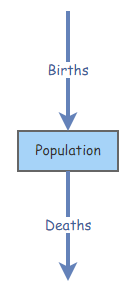
 
7.	Change the **Flow Rate** property of *Births* to 0.16 $*$ [Population]. This represents the total number of individuals entering [Population] in each time step.

8.	Change the **Flow Rate** property of *Deaths* to 0.10 $*$ [Population]. This represents the total number of individuals leaving [Population] in each time step.

Can you already tell whether this is a growing or declining population? (just a quick thought question, not part of the written lab!)

9.	Run the model by clicking the **Simulate** button.  We can change how the simulation is run by clicking the **Settings** button (left of Save).  We can also change the settings of how the plot is created by clicking the **Configure** button within the simulation results window.

### Exercise 3 (InsightMaker problems)

Please provide short answers to the following questions, and (when prompted) provide your "Insights" to back up your answers (easiest would just be to share them with me using InsightMaker- we will go over this in class).

First, tweak the above model so that per-capita birth rate (b) and death rate (d) are separate elements of the model (using the "Variable" primitive). Your Insight should look something like this:

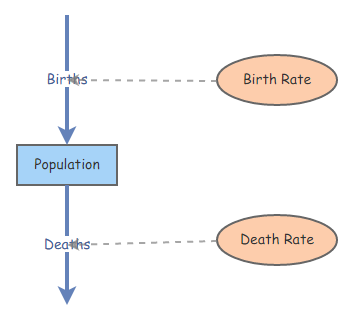

To enable easy manipulation of these variables, change the **Show Value** Slider option of *Birth Rate* (in the properties window) to Yes.  Change the **Slider Max value** to 1, the **Slider Min value** to 0, and the **Slider Step value** to 0.01.  Do the same for *Death Rate* and *Population* (initial abundance $N_0$). For abundance, set the step size to 1 so we don't have fractional individuals! Now click on the white space of your model; you should now see the Birth Rate, Population and Death Rate sliders on the info tab. Change the slider values of the rates a few times, re-running the simulation each time. When you are confident that your model is working right, share it with me (username "kevintshoemaker") and Margarete (username "Margarete"). 

*  ***Short answer (3a.)*** Starting with a growing population, can you come up with two different scenarios in which *Population* is neither growing nor declining, by only changing one of the sliders from the starting conditions? Explain your answer. 

The simulations that you ran above produced population growth curves that were very smooth, but we all know that populations don't grow in this manner because of **stochasticity** (randomness).  Let's add some randomness to our vital rates! Change the **Show Value Slider** option of the Birth Rate primitive to No.  Change the Equation to 0.1 + RandNormal(0, 0.1).  The RandNormal()  function generates a normally distributed random number with _mean (average) equal to the first argument_ and _standard deviation equal to the second argument_. This means that in each time step we have a slightly different birth rate. Since we specified a *mean* of zero, we are not actually changing the average birth rate! Do the same for *Death Rate*. Run multiple simulations (at least 10) and look for patterns. Use the **Compare Results** tool to compare and provide output. When you are confident the model is right, send it to your instructor/TA. 

*  ***Short answer (3b.)*** Is it possible to have a declining population even when *Birth Rate* and *Death Rate* are the same on average? Is it possible to have a declining population when *Birth Rate* is greater than *Death Rate* on average? Explain your reasoning!


##Checklist for Lab 1 completion
*Please bundle the Word, Excel, and R code files into one Zip file and email to Professor Shoemaker and Margarete Walden. The InsightMaker models can be shared directly in InsightMaker (preferred) or you can take screenshots and bundle those pictures into the Zip file.

***Due Feb. 3 at 11 am.***

*  Word document with short answers
    +  **Exercise 1**
        -  *Short answer (1a.)*
        -  *Short answer (1b.)*
        -  *Short answer (1c.)*

    +  **Exercise 2**
        -  *Short answer (2a.)*
        -  *Short answer (2b.)*
        -  *Short answer (2c.)*
        -  *Short answer (2d.)*

    +  **Exercise 3**
        -  *Short answer (3a.)*
        -  *Short answer (3b.)*

*  Excel file
    +  **Exercise 1**
        -  Your Excel file should show that you were able to successfully use formulas to calculate $N_t$ for each time step and show a plot of $N$ by Time.

*  R file
    +  **Exercise 2**
        -  Your R code should show that you were able to (a) adapt the given code to run for 100 years, and can display a plot of the results;
        -  (b) change $r$ to 0.5 and run for 100 years and plot the results;
        -  (c) find the value of $r$  that gives a population size of 1000 after 100 years; and
        -  (d) change $r$ to -0.1 and run until the population goes extinct.

*  InsightMaker models
    +  **Exercise 3**
        -  Your first model should show that you were able to alter the given model as instructed so that the simulation runs correctly. This should be shared with "kevintshoemaker" and "Margarete".

        -  Your second model should include the Rand() function for the *Birth Rate* and *Death Rate*. This should be shared with "kevintshoemaker" and "Margarete".


 


<!--chapter:end:LAB1.Rmd-->

---
title: "Lab 2: Density-dependence and more!"
author: "NRES 470/670"
date: "Jan 24, 2017"
output: 
  html_document: 
    theme: spacelab
    toc: yes
    toc_float: yes
---

```{r setup, include=FALSE}
knitr::opts_chunk$set(echo = TRUE, cache = TRUE)
```

In this lab we will have an opportunity to build more complex population models in InsightMaker. Among the concepts we will play around with are *density dependence*, *chaos* and *time delays*.  

First let's do some math!

## Mathematics of Density-Dependent population regulation

Recall the basic population growth equation:

$\Delta N = (b - d) \cdot N_t \qquad \text{(Eq. 1)}$

Previously we considered *b* and *d* to be constants. Now we want them to be functions of abundance! In particular, as abundance goes up, *b* goes down:

$b = b_{max}-a*N_t \qquad \text{(Eq. 2)}$

For the death rate *d* we might expect it to go up as abundance goes up:

$d = d_{min}+c*N_t \qquad \text{(Eq. 3)}$

The above equations nicely illustrate the meaning of density dependence. That is, the vital rates are *dependent* on density!

**thought Q**: what do the *a* and *c* constants in the above equations really represent? You will have a chance to think more about this in the first exercise. 

Okay, now we can substitute the above equations into **Eq. 1**:

$\Delta N = (b_{max}-a*N_t - d_{min}+c*N_t) \cdot N_t \qquad \text{(Eq. 4)}$

Using some tricks of algebra (see the Gotelli book), we can simplify this to:

$\Delta N = r \cdot N_t \left [ 1 - \frac{a+c}{b-d} \cdot N_t  \right ]  \qquad \text{(Eq. 5)}$

Which, if we define $\frac{b-d}{a+c}$ as a constant, $K$, we can re-write like this!

$\Delta N = r \cdot N_t \cdot \left ( 1 - \frac{N}{K}  \right )  \qquad \text{(Eq. 6)}$

This is probably the second most important equation of population ecology, and it is called the **Logistic growth equation**. This lab will give us an opportunity to get to know this equation and its implications for population ecology!


## Exercise 1: hypothetical mechanisms of density dependence

Please provide short answers to the following questions:

1a. Describe two possible density-dependence mechanisms -- that is, tell a plausible story about two hypothetical wildlife populations, one of which experiences *lower survival* (higher mortality) as densities increase and another that experiences *lower reproduction*.  Have fun and be creative- we will not grade these on whether these mechanisms actually occur in nature- we just want to give you a chance to think about the many possible mechanisms that could potentially regulate wild populations. You can use real-world examples if you would rather- that is up to you.   

1b. For one of the above mechanisms, draw (on paper or electronically) two graphs to illustrate how this hypothetical mechanism might manifest at a population level:     

  i. Abundance (Y axis) over time (X axis). Start the abundance well below carrying capacity.    
  ii. Vital rate (*b* or *d*) (Y axis) over abundance (X axis).    
  
For each graph, provide a short (1-2 sentences) description of why you think your hypothetical D-D mechanism would result in this relationship!  

NOTE: you can use a web app like ["A web whiteboard"](https://awwapp.com/) to quickly and easily make and download sketches! I encourage you to use this method, and to embed your sketches in your submitted MS Word document.


## Exercise 2: Determining Peruvian anchovy optimal harvest levels!

Let's use InsightMaker to create a logistic growth model based on the collapse of the Peruvian anchovy fisheries (pages 45-47 in Gotelli).

As you develop the logistic growth model for the Peruvian anchovy stock in InsightMaker, you might want to refer to the in-class example for [the logistic growth lecture](LECTURE4.html).

**The Goal**: find the level of harvest that maximizes the total quantity harvested while maintaining a sustainable population!

1.   In InsightMaker, open your basic exponential growth model and choose "Clone Insight" in the upper right corner to create a copy that you can edit for this exercise. It should look something like this (except for anchovies, not rabbits!): (note that it is not strictly necessary to have [Links] -- e.g., going from *Population* to the [Flows] (*Births* and *Deaths*). But it makes your models more visually explicit- you know which parts of the system are interacting!)

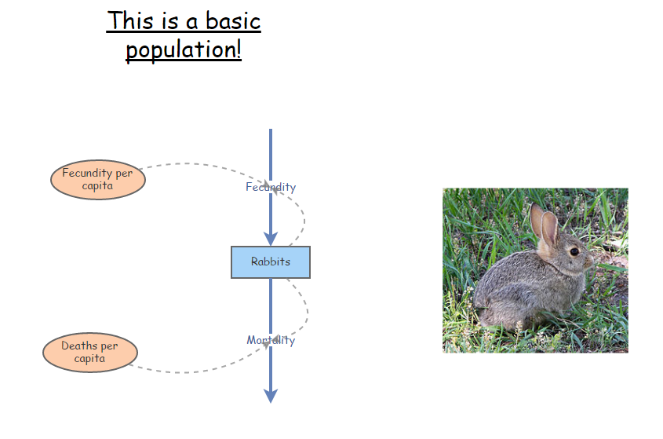

2.  Now add the density-dependent components! Remember, the density-dependent birth and death rates in the logistic growth model can be expressed as the following: 

$b = b_{max} - aN$, aka density-dependent birth rate = ideal (maximum) birth rate - (strength of density dependence * N)

$d = d_{min} + cN$, aka density-dependent death rate = ideal (minimum) death rate + (strength of density dependence * N) 

"Ideal" in this case means the birth and death rates in the absence of the effects of density.  So, make new [Variables] (Click on **Add Primitive** >> **Add Variable**) for *Ideal Birth Rate* and *Ideal Death Rate*.

In addition, we need to add variables for the strength of density dependence (terms *a* and *c* in the equations).  Make sure the **Links** button is activated, and click and drag your mouse to create links from the new variables to the appropriate per-capita vital rates. Your final model should look something like this (except for anchovies, not box turtles!):

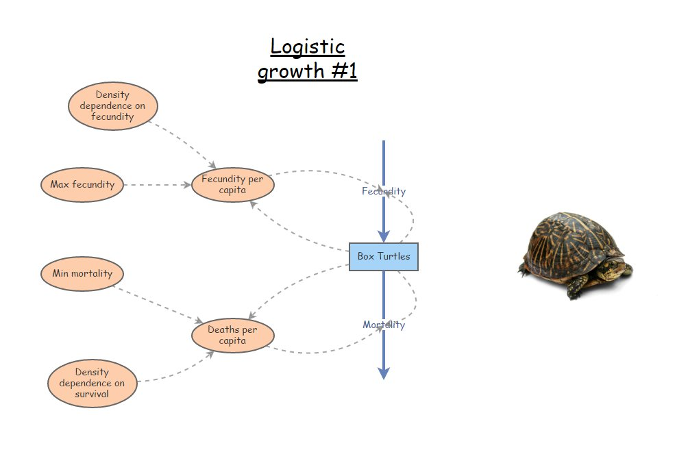


```{r eval=FALSE, echo=FALSE}

Density <- seq(0,10000,1)  # create a sequence of numbers from 0 to 500, representing a range of population densities

## CONSTANTS

b_max <- 1  # maximum reproduction (at low densities)
d_min <- 0.4  # minimum mortality 

a <- 0.00005    # D-D terms
c <- 0.00001

b <- b_max - a*Density
d <- d_min + c*Density

plot(Density,b,type="l",col="green",lwd=2,ylim=c(0,2),main="Density-Dependence!")
points(Density,d,type="l",col="red",lwd=2)
legend("bottomleft",col=c("green","red"),lty=c(1,1),legend=c("per-capita birth rate","per-capita mortality"),bty="n")

  

```

4.  Next, you'll need to update the equations to calculate the per-capita birth and death rates.  Click on the **=** sign in the corner of each variable, and enter the appropriate equations for the appropriate rates (see above):

5.  Enter starting values for your variables. Let's use 10,000 for the initial *Anchovy Population*, 1 for the *Ideal Birth Rate*, 0.00005 for *Density Dependence* for birth rate, 0.4 for *Ideal Death Rate*, and 0.00001 for *Density Dependence* for death rate.

6.  Use the **Settings** button to change the **Simulation Length** to 24 and the timescale to "Months". Click **Simulate**. You may need to click **Configure** in order to clean up your plot to just show **Time** on the x-axis and **Anchovy Population** on the y-axis. Run the model to see if it is working. Since the abundance is initialized at carrying capacity, abundance should not change over time. Change the initial abundance to a small number (e.g., 10) temporarily to make sure that you see an "S-shaped" logistic growth curve. 

7.  Next, let's add an additional source of mortality (right now, we have natural baseline mortality (40% per year) and density-dependent effects). This new source of mortality is commercial fishing! This source of mortality should be a new [Flow Out] from the Anchovy population. For now, let's assume harvest is constant -- that is, a given number are harvested, regardless of the size of the population (no feedback!).

8. One last thing before we play around with harvest rates: in the properties menu for the anchovy stock, set the property **Only Positive Rates** to "Yes". We don't want to harvest the population into negative numbers!!!

9.  Finally, try to find the **maximum sustainable yield**. That is, find the maximum harvest rate that yields a sustainable (non-declining) population. To do this, try different rates of harvest- I recommend using increments of 200 at first, then narrowing down to smaller increments. Otherwise you might be here a while!! [Optional: I encourage you to play around with the "Sensitivity Analysis tool", which you could use to automate this process- that is, have Insightmaker run lots of different values for harvest rate at the same time! We will go over how to use this tool in lab next week or the week after]

### QUESTIONS, Exercise 2:

2a. What is the (approximate) MSY for this population?

2b. Does the harvest process change the **carrying capacity** for the Peruvian sardines? Explain your reasoning. 

2c. Does the MSY change if you reduce the initial population size down to 1,000 instead of 10,000? If so, what is the new MSY? 

2d. Does the MSY point represent a **stable equilibrium**? That is, does it return to that equilibrium even if you perturb the system? Why? Why not? 

2e. If you were managing this Peruvian anchovy system, would you recommend that catch limits be set at the MSY? Why or why not? (More generally, is the MSY really sustainable?)  

2f. Think back to your Wildlife Ecology course (or refer to the Gotelli book!). If you know $K$ and $r$, how can you analytically solve for **Maximum Sustainable Yield**? Show your calculation. Does your computed MSY match the MSY you found by trial-and-error? (note that $r$ in this case is the difference between the maximum birth rate and the minimum death rate!) 


## Exercise 3: fun with logistic growth

For this exercise we will set up a simpler model in InsightMaker- this time, we will replicate the second-most important equation of population ecology (**Eq. 6**, above.

1. Starting from a blank canvas, add a [Stock] called *Population*. This population should be initialized at 10 individuals, and the *Allow Negatives* field in the properties window should be set to "No". Set *Show Value Slider* to "Yes", and set the *Slider Min* to 0 and *Slider Max* to 1000. 

2. Make a new [Flow] coming out of *Population*, called *Delta N*. In the properties window, set *Only Positive Rates* to "No". You should now see that the flow has an arrow on both ends. That is, this flow can either represent a [Flow In] or a [Flow Out]. It represents the change in *Population* each time step, which can either be positive or negative!

3. Make a new [Variable] called *Max growth rate* (also known as $r_{max}$), and set it at 0.1. Make a link from *Max growth rate* to *Delta N*. Set *Show Value Slider* to "Yes", and set the *Slider Min* to 0 and *Slider Max* to 5. 

4. Make a new [Variable] called *Carrying capacity* (also known as $K$), and set it at 500. Make a link from *Carrying Capacity* to *Delta N*.

5. Finally, open the equation editor for *Delta N* and type in the logistic growth equation (**Eq. 6**). 

6. Run the simulation for 100 years (1 year time step) and make sure it behaves as expected- that is, it should exhibit logistic (S-shaped) growth and should level off at carrying capacity. 


### QUESTIONS, Exercise 3:

3a. What happens if you initialize the *Population* at above carrying capacity? Do you still see "S-shaped" (logistic) growth? What if you initialize abundance **at** carrying capacity? Is carrying capacity a **stable equilibrium**? Explain your reasoning. 

3b. Return the initial abundance to 10. Now start adjusting the value of *Max Growth Rate*. What do you notice as the maximum growth rate increases? Focus on the time series of population abundance over time. Can you identify different major changes as the growth rate increases from 1 to 5. You should be able to identify at least four unique patterns! Describe the patterns and the approximate thresholds at which change-overs occur from one pattern to the next. One of these patterns is known as **Chaos** (yes, that is the technical name)!! Can you figure out which pattern is known as chaos??

3c. Try changing the **Simulation Time Step** in the **Settings** menu. Note that you can set the simulation time step to fractional values- for example, try setting it to 0.1. What if you change it to 2, or 5? Does this change the patterns and thresholds from the previous question? Can you figure out why these patterns emerge?

3d. Think of at least two hypothetical or real-world cases where **chaos** could emerge as a result of density-dependence. Explain your reasoning!


## Exercise 4: delayed density-dependence!

What happens when the effects of resource competition are delayed? In this case, the effects of competition (reduction in fitness) will not manifest immediately- but emerge later down the road!

Let's build on the previous model...

1. First, add a new [Variable] to the system, called *Delayed Abundance*, which will store a previous abundance value. Draw a new link from *Population* to *Delayed abundance* and from *Delayed abundance* to *Delta N*. 

2. Add a new [Variable] to the system, called *Time Delay*. Set *Show Value Slider* to "Yes", and set the *Slider Min* to 0 and *Slider Max* to 5, and *Slider Step* to 1. Make a new link from *Time Delay* to *Delayed Abundance*

3. Open the equation window for *Delayed abundance*. This variable will store a previous value of *Abundance*, with the time delay set by *Time Delay*. To do this, use the following syntax:

```
Delay([Population], [Time delay], 100)
```
The "100" in this function is there just to help the simulation get started (at the first time step(s), there are no previous values of *Abundance*, so InsightMaker will use this value instead).

4. Finally, modify the equation for *Delta N* so that *Delayed abundance* (not *Population*) is used in the density-dependent portion of the equation. Your equation should now look something like this:

```
[Max growth rate]*[Population]*(1-[Delayed abundance]/[Carrying Capacity])
```


### QUESTIONS, Exercise 4:

4a. Run the model with different values for the time delay. How does the system behave with a time delay? Do you see any similarities with exercise 3? 

4b. Parasitoid wasps help to keep many lepidopteran populations in check. The wasps lay their eggs in caterpillars, and the caterpillars end up dying a horrific death as the wasp larva grows. Wasp-regulation on caterpillars often exhibits delayed density-dependence, resulting in oscillations in caterpillar populations. Can you think of why this might be the case?  


##Checklist for Lab 2 completion

* Please package the materials into one Word document and email to Professor Shoemaker and Margarete Walden.

To share your InsightMaker models: The first step (of course) is to save your model! After you save the model you should see a link on the top left-hand corner, "Insight Access". Click on that link, and a new window will pop up. Under "allow update access", add a username (i.e., kevintshoemaker or waldenTA). click on the "Add User" button, and then click on "Submit". Finally, embed the URL for your InsightMaker model(s) in your Word document!

***Due Feb. 10 at 11 am.***

*  Word document with short answers
    +  **Exercise 1**
        -  *Short answer (1a.)*   
        -  *Short answer (1b.)*   
 
    +  **Exercise 2**
        -  *Short answer (2a.)*
        -  *Short answer (2b.)*
        -  *Short answer (2c.)*
        -  *Short answer (2d.)* 
        -  *Short answer (2e.)*
        -  *Short answer (2f.)*
 
    +  **Exercise 3**
        -  *Short answer (3a.)*
        -  *Short answer (3b.)*
        -  *Short answer (3c.)*
        -  *Short answer (3d.)*
        
    +  **Exercise 4**
        -  *Short answer (4a.)*
        -  *Short answer (4b.)*

*  InsightMaker models
    +  **Exercises 2,3 and 4**
        -  Your models should show that you were able to create and specify your models correctly. This should be shared with "kevintshoemaker" and "Margarete", and the URLs should be shared via email.


 


<!--chapter:end:LAB2.Rmd-->

---
title: "Lab 3: Age-structured populations"
author: "NRES 470/670"
date: "Feb 9, 2017"
output: 
  html_document: 
    theme: spacelab
    toc: yes
    toc_float: yes
---

```{r setup, include=FALSE}
knitr::opts_chunk$set(echo = TRUE, cache = TRUE)
```

In this lab we will have an opportunity to build more complex population models in InsightMaker. Among the concepts we will play around with are *age structure*, *life tables*, and *age/stage matrices*.  

First let's do some math!

## Mathematics of Age-structured populations

### Life tables

Let's start with some notation- population ecology, and life tables in particular, are full of notation. We should at least be aware of the major terms used in population ecology!

**Survivorship:** $l(x) = \frac{S_x}{S_0}  \qquad \text{(Eq. 1)}$ , where $S_x$ is the number of survivors from the original cohort at year $x$

**Survival rate:** $g(x) = \frac{S_{x+1}}{S_x}  \qquad \text{(Eq. 2)}$ , where $S_x$ is the number of survivors from the original cohort at year $x$

**Birth rate:** $b(x)$ is simply the per-capita number of offspring produced by a given age class.

**Lifetime reproductive potential:** $R_0 = \sum_{x=0}^k l(x)\cdot b(x)  \qquad \text{(Eq. 3)}$, where $k$ is the maximum age.

**Average lifespan** is defined as: $L = \frac{\sum_{x=0}^{k}l(x)\cdot x}{\sum_{x=0}^{k}l(x)}  \qquad \text{(Eq. 4)}$ 

**Generation time** is defined as the _Average age of the parents of all the offspring produced by a single cohort_. This can be computed as: $G = \frac{\sum_{x=0}^{k}l(x)\cdot b(x)\cdot x}{\sum_{x=0}^{k}l(x)\cdot b(x)}  \qquad \text{(Eq. 5)}$

**Intrinsic rate of growth,** $r$ is defined (to a first-order approximation) as: $r = \frac{ln(R_0)}{G}  \qquad \text{(Eq. 6)}$ 

One more concept I want to introduce here is **reproductive value**, or V(x). This represents the expected present and future reproductive output of an individual of age x: $V(x) = b(x) + \sum_{t=x+1}^{k} \frac{l(t+1)}{l(t)} \cdot b(t)   \qquad \text{(Eq. 7)}$. This could also be expressed as: $V(x) = b(x) + \sum_{t=x+1}^{k} g(t) \cdot b(t)$. 

## Exercise 1: basic life table analysis

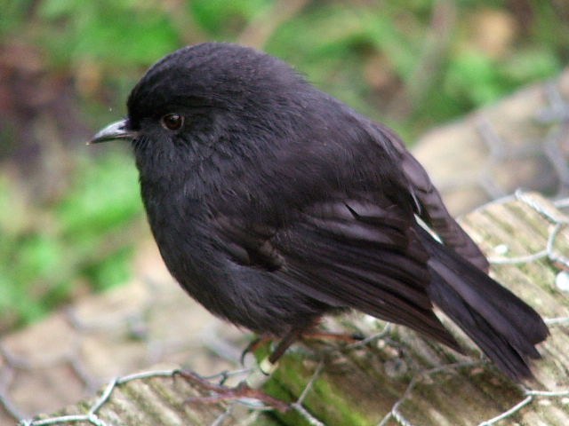

Let's imagine that we are following a *cohort* of reintroduced Chatham Island robins on a small island through time. 

- First, we establish fake nests and place 350 captive-laid eggs in them. 
- All individuals are given a unique marking as soon as they hatch. These markings are permanent and not affected by tag loss!
- We visit the island once per year, and we count all the individuals with tags who still exist in the population. We can assume that if the individual is alive then we will observe it. If we do not see the individual we know with certainty that it is dead!
- We record the following numbers of robins over 5 years revisiting the island (starting with 350 at year 0): 50, 25, 10, 2, and 0.
- We record the following reproductive rates for each age: 0, 5.2, 5.5, 4.7, 3.3, and 0

You can load these data in [this handy CSV file](life_table2.csv). It should look something like this:

```{r include=FALSE}
lifetable <- read.csv("life_table2.csv")
```

```{r results='asis', echo=FALSE}
knitr::kable(lifetable,caption="",col.names = c("x","S(x)","b(x)"))

```

### QUESTIONS, Exercise 1 (basic life tables):

1a. Plot the survivorship curve (survivorship over age) in two ways: (1) raw survivorship vs. age, and (2) log (base 10) transformed survivorship vs. age (this is the "correct" way!). Does this population most closely resemble type I, II, or III survivorship? Explain your reasoning. Does the log-transformation change your answer? 

1b. Describe *Equation 3* above in plain English in a way that makes sense to you. What is the net reproductive output, $R_0$ for this population? Is this population growing, declining or stable?    

1c. What is the mean lifespan, $L$, and generation time, $G$ for this population? What happens to your generation time estimate if "age 1" individuals do not reproduce -- that is, if b(1) is set to zero?

1d. What is the reproductive value($V$) for each age (x) in this population? Which age has the highest reproductive value? If you were to remove some of this population to translocate to another island (to start a new population), why might you select individuals at this age (that is, the age with highest reproductive value)?  

1e. Are the vital rates in this population **Density-dependent**? If so, explain your reasoning. If not, explain what additional information you would need to evaluate this question.


## Exercise 2: more complex life table analysis

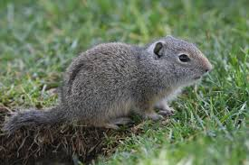

Let's take the Uinta ground squirrel example from the Gotelli book. Take a minute to read the description in Gotelli (end of Ch. 3)... 

This is *real data* from a long-term experimental study. 

The first life table (on the left) represents a cohort of ground squirrels in a population at typical densities.

The second life table (right) represents a cohort of ground squirrels in a population at lower-than-average densities (many conspecifics removed prior to the start of the experiment). 

Load up the [Uinta ground squirrel life table data](life_table3.csv) given to us by Gotelli (reproduced from Slade and Balph 1974). 

### QUESTIONS, Exercise 2 (more advanced life table analysis):

2a. Compare the two life tables using the following major life-table metrics: $R0$, $G$, $r$, and $V$. What changes do you notice between these two life tables? 

2b. Is generation time ($G$) an intrinsic trait of a species, or can it vary as a function of factors like forage quality? How could you test this in Excel? What l(x) or b(x) entries might change in the Excel spreadsheet if the population experienced a substantial improvement in forage quality? Try it- describe what you changed, and how it affected generation time.  

2c. [return to the black robin example] Imagine you have the following initial population of black robins: 10 individuals of age 2, 10 individuals of age 3 and 10 individuals of age 4. How would you **simulate** the abundance of robins in each of the 6 age classes next year? Try it, and explain how you got your answer! 


## Exercise 3: age-structured models in InsightMaker

Let's build an age-structured model from scratch. To do this, you can follow these steps:

1. Open a blank workspace and save it. 

2. Make three new stocks: *Age 1*, *Age 2* and *Age 3*. 

3. Make a new flow called *Recruitment*. This should represent new *Age 1* individuals. We will ignore immigration for now, so new recruiment into the "Age 1" stock represents the only way new individuals can be added to the population. We will assume that *Age 2* and *Age 3* are the only reproductive ages. Therefore, draw links from *Age 2* and *Age 3* to *Recruitment*. 

4. Make new flows from _Age 1 to Age 2_ and from _Age 2 to Age 3_, called *Transition to Age 2* and *Transition to Age 3*, respectively. These flows represent **growth**, or advancement from *Age 1* to *Age 2* is dependent on the number of individuals in *Age 1*. Therefore, draw a link from *Age 1* to *Transition to Age 2*. Do the same for *Transition to Age 3*.   
5. Make three new flows representing, emerging respectively from each stock and called *Age 1 mortality*, *Age 2 mortality*, and *Age 3 mortality*. The total number of deaths is dependent on the numbers in each stock, so draw links from each stock to the respective *mortality* outflow.  

Your new insight should look something like this: 

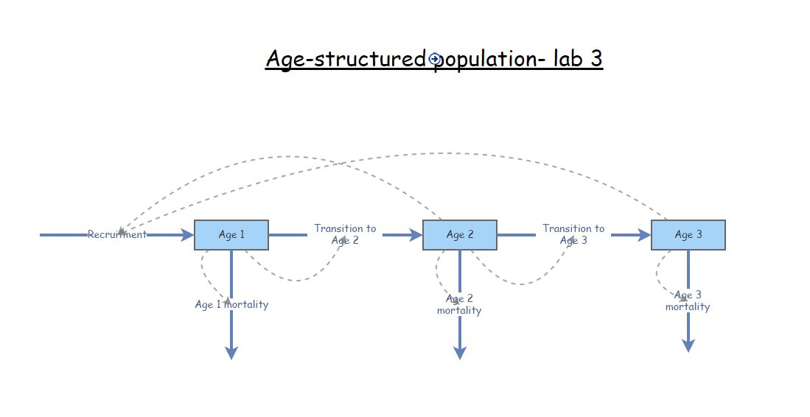

6. Parameterize your new age-structured population!
    6a. For recruitment, make new variables called *Recruitment rate, age 2* and *Recruitment rate, age 3*, representing the per-capita recruitment rate for age 2 and age 3, respectively. Draw links from these variables to *Recruitment*, and set these variables at 1.1 and 1.8, respectively. Click on the equation editor for *Recruitment* and set the equation appropriately (see questions below)
    6b. For the transitions, make new variables representing the per-capita transition rates, called *Transition rate, Age 1 to 2* and *Transition rate, Age 2 to 3*. Set these rates at 0.4 and 0.3, respectively. Now click on the equation editors for the transition rates, and specify the transition rates appropriately.   
    6c. For the mortality rates, note that all individual in the *Age 1* stock must either transition to *Age 2* or die. In addition, all individuals in the *Age 3* stock must die- there is no *Age 4* class! Now click on the equation editors for the mortality rates, and specify the mortality rates appropriately. 

7. Explore the model- make sure you understand how it works! 


### QUESTIONS, Exercise 3 (age-structured model in InsightMaker):

3a. What is the equation for *Recruitment* in the above model? Copy and paste your equation from InsightMaker. Now explain this equation in plain english!

3b. What is the equation for *Age 1 Mortality* in the above model? Copy and paste the equation from InsightMaker. Now explain this equation in plain english! What about *Age 3 mortality*? 

3c. Initialize the population like the spadefoot toad example from lecture- so that the population consists of only individuals in the first (*Age 1*) age class. What population dynamics occur at the beginning of the simulation? What about the end of the simulation? How do the dynamics change if you change the simulation time step to 0.1? 

3d. Can you tweak the initial abundances so that the population exhibits smooth exponential growth/decline for all three age classes? What is the **Stable Age Distribution** for this population? Would the stable age distribution change if you changed the vital rates (recruitment rates, transition rates etc.)?

3e. Is this a growing or declining population? Imagine you could enact a predator-control program and reduce the mortality of *Age 1* individuals. How much would you have to reduce mortality of this age class to make a growing population? What if you could only reduce *Age 2* mortality? 
    

## Exercise 4: more complex age-structured models in InsightMaker!

Try to implement the following model (adding onto the previous age-structured model in InsightMaker). _If the total population (all three age classes combined!) exceeds 75 individuals, then recruitment rates drop to 25% of normal rates._ 

4a. Please provide your full InsightMaker model (share with instructors and send as a link).   
    
4b. Change the Age 1 mortality rate to 0.3. Run the simulation starting with 75 individuals, all in Age class 1. What happens? Is this a **stochastic** model? If not, why does it look like it has a random component?  


##Checklist for Lab 3 completion

* Please bundle the materials into one Word document and submit to Professor Shoemaker and Margarete Walden _using WebCampus_!

***Due Feb. 17 at 11 am.***

*  Word document with short answers
    +  **Exercise 1**
        -  *Short answer (1a.)*   
        -  *Short answer (1b.)* 
        -  *Short answer (1c.)*
        -  *Short answer (1d.)*
        -  *Short answer (1e.)*
 
    +  **Exercise 2**
        -  *Short answer (2a.)*
        -  *Short answer (2b.)*
        -  *Short answer (2c.)*
 
    +  **Exercise 3**
        -  *Short answer (3a.)*
        -  *Short answer (3b.)*
        -  *Short answer (3c.)*
        -  *Short answer (3d.)*
        -  *Short answer (3e.)*
        
    +  **Exercise 4**
        -  *InsightMaker model (4a.)*
        -  *Short answer (4b.)*


 


<!--chapter:end:LAB3.Rmd-->

---
title: "Lab 4: Matrix population models"
author: "NRES 470/670"
date: "Feb 10, 2017"
output: 
  html_document: 
    theme: spacelab
    toc: yes
    toc_float: yes
---

```{r setup, include=FALSE}
knitr::opts_chunk$set(echo = TRUE, cache = TRUE)
```

In this lab we will get back to age-structured populations: specifically, we will play with **matrix projection models**! Rememeber that while matrix population models may look complicated, they are just a fancy, age/stage structured version of basic exponential growth!

## Mathematics of matrix population models: 

We all remember the finite-population-growth equation:

$N_{t+1}=\lambda \cdot N_t   \qquad \text{(Eq. 1)}$,

where $N$ is abundance (as always), $t$ is time, often in years but could be any time units, and $\lambda$ is the multipicative growth rate over the time period $t \rightarrow t+1$

The matrix population growth equation looks pretty much the same!

$\mathbf{N}_{t+1} = \mathbf{A} \cdot \mathbf{N}_{t}   \qquad \text{(Eq. 2)}$,

where $\mathbf{N}$ is a **vector** of abundances (abundance for all stages), and $\mathbf{A}$ is the **transition matrix**, which we have seen before.

We can be more explicit about this if we re-write the above equation this way:

$\begin{bmatrix}N_1\\ N_2\\N_3 \end{bmatrix}_{t+1}=\begin{bmatrix}0 & F_2 & F_3\\ P_{1 \rightarrow 2} & P_{2 \rightarrow 2} & 0\\ 0 & P_{2 \rightarrow 3} & P_{3 \rightarrow 3}\end{bmatrix} \cdot \begin{bmatrix}N_1\\ N_2\\N_3 \end{bmatrix}_{t}    \qquad \text{(Eq. 3)}$

Where $P_{1 \rightarrow 2}$ is the probability of advancing from stage 1 to 2, and $F_2$ is the **fecundity** of stage 2.

NOTE: _fecundity is NOT the same thing as birth rate_, $b$. What's the difference?

Birth rate, $b_t$, is the _per-capita rate of offspring production_ for stage $t$  

Fecundity, $F_t$, is the _per-capita rate by which an individual of stage $t$ contributes new offspring to the population at time $t+1$. Sounds pretty similar, right? What's the difference??

Fecundity also takes into account the survival rate from $t$ to $t+1$!!  For an adult of stage $t$ to contribute to the next generation, _it must both survive and reproduce_!.

$F_t = P_{1 \rightarrow 2} \cdot  b_{t+1}    \qquad \text{(Eq. 4)}$

### Matrix operations:

There is a lot we can do with matrix population models. The most obvious one is *projection*:

#### Projection:

We have already seen the projection equation (Eq. 2, above). Here is how we can implement this in R:

```{r eval=FALSE}

Year1 <- projection_matrix %*% Abundance_year0  # matrix multiplication!
  
```

Let's try it:

First, build a projection matrix:

```{r}

projection_matrix <- matrix(
  c(
    0,     1.2,   3.1,
    0.4,   0,     0,
    0,     0.75,   0
  )
  ,nrow=3,ncol=3,byrow=T
)

projection_matrix

```

Next, let's build an initial abundance vector:

```{r}
Abundance_year0 <- c(1000,0,0)
Abundance_year0
```

Now we can run the code for real!


```{r}
Year1 <- projection_matrix %*% Abundance_year0  # matrix multiplication!
Year1
```

Now we have 300 individuals in stage 2!

Let's project one more year:

```{r}
Year2 <- projection_matrix %*% Year1  # matrix multiplication!
Year2
```

Finally, here is some code to project many years into the future! You may want to re-use some of this code for the exercises below. 

```{r}
nYears <- 20                                            # set the number of years to project
TMat <- projection_matrix                               # define the projection matrix
InitAbund <- Abundance_year0                            # define the initial abundance

  ## NOTE: the code below can be re-used without modification:
allYears <- matrix(0,nrow=nrow(TMat),ncol=nYears+1)     # build a storage array for all abundances!
allYears[,1] <- InitAbund  # set the year 0 abundance                                    
for(t in 2:(nYears+1)){   # loop through all years
  allYears[,t] <-  TMat %*% allYears[,t-1]
}
plot(1,1,pch="",ylim=c(0,max(allYears)),xlim=c(0,nYears+1),xlab="Years",ylab="Abundance",xaxt="n")  # set up blank plot
cols <- rainbow(3)    # set up colors to use
for(s in 1:3){
  points(allYears[s,],col=cols[s],type="l",lwd=2)     # plot out each life stage abundance, one at a time
}
axis(1,at=seq(1,nYears+1),labels = seq(0,nYears))   # label the axis
legend("topleft",col=cols,lwd=rep(2,3),legend=paste("Stage ",seq(1:nrow(TMat))))  # put a legend on the plot
```


#### Compute lambda

Clearly this is a growing population. But let's see exactly what $\lambda$ is!

```{r}
library(popbio)

lambda(projection_matrix)
```

Pretty easy right?

NOTE: we are using a "package" in R to make these analyses super easy! So if you don't already have the "popbio" package, go to the "Packages" tab in R studio (should be at the top of the lower right panel), click on "Install", and then type "popbio" in the "Packages" field in the pop-up window, then click on the "Install" button. 

Or just use the following code:

```{r eval=FALSE}
install.packages("popbio")

```


#### Compute stable-age distribution (S.A.D.)

Clearly the population doesn't reach a stable age distribution until a few years into our simulation. What exactly is the stable age distribution here?  We can do this in R:

```{r}
stable.stage(projection_matrix)
```

And that is really all we need to know to get started with matrix-based population models!


## Exercise 1: play with matrix projection models!

In this exercise, you will have a chance to play around with a very simple matrix population model. But first, you need to translate a life table into a transition matrix!

Here is a life table you may remember.

```{r echo=FALSE}
lifetable <- read.csv("life_table4.csv")
lifetable
```

1a. Translate the above *life table* into a five-age-class transition matrix. In your written lab report, provide the transition matrix and describe the formulae used to compute the following two elements: (1) row 1 column 4 and (2) row 4 column 3. This is a bit harder than it sounds! 

Keep the following points in mind: 

- Individuals are in "age class 1" if they are between the ages of 0 and 1. They transition to "age-class 2" ($P_{1 \rightarrow 2}$) if they survive to age 1 (at which point they are now entering age class two!). Yes this can be confusing!     
- For individuals of "Age class 1" to contribute new offpring (individuals of age-class 1) to the population in the next time step ($F_1$), they have to survive their first year of life ($P_{1 \rightarrow 2}$) AND produce offspring when they are exactly 1 year of age (which they do at the rate of $b$ at age 1).    

- No individual ever stays in the same age-class two time steps in a row- they either transition to the next age-class or they die.     

1b. Use R to compute the finite rate of growth for the population ($\lambda$). Is this a growing or declining population? Show your R code!   

1c. Use R to compute the stable-age distribution for the population (S.A.D.). Show your R code! Now imagine you have a total population size of 671. Assuming this population is at S.A.D., how many individuals are in each age-class?   

1d. Use R to project this population for 30 years, starting with the S.A.D. population you computed in part 1c. Show your R code. What is the total abundance after 30 years? Re-do the calculation using Eq. 1 and the "Lambda" value you computed in 1b. Do you get the same answer? Finally, run your simulation again, this time starting with all 671 individuals in age-class 1. 

1e. Why is the final abundance estimate different from your previous calculations? 


## Exercise 2: translate InsightMaker to projection matrix!

Return to the InsightMaker model you created in Lab 3 (exercise 3 -- that is, the original model, without the carrying capacity component you implemented in Exercise 4 of Lab 3). Your model should look something like this:

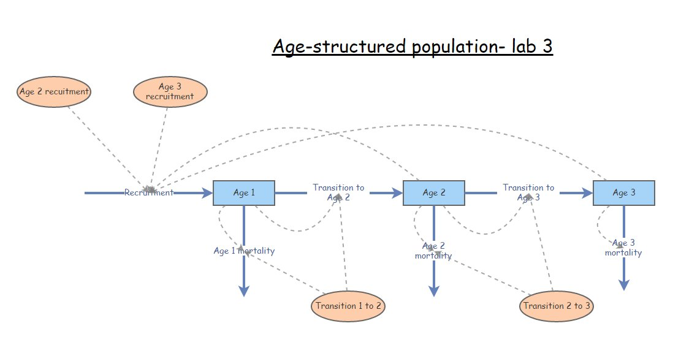

Make sure the parameters are at the original values specified in Exercise 3 of Lab 3 (before altering mortality rates as part of lab 3 question 3e.)

2a. Translate this InsightMaker model into a projection matrix. This is not quite as straightforward as it might sound. Pay close attention to the difference between survival (transition to the next stage class) and mortality. In your write-up please provide your transition matrix.   

2b. Starting with 75 individuals, all in Age class 1, project the population 20 years into the future, using both InsightMaker and R. You don't need to show your R code or the InsightMaker model this time- just provide graphical evidence (that is, provide two plots- one showing the results of the R simulation and the other showing the results of the InsightMaker simulation). These plots should look essentially the same!   

2c. Now let's go the other way around. Build an InsightMaker model that represents the same population as the stage matrix below. Share your InsightMaker model with your instructors and provide the URL in your write-up.  

2d. Use this stage matrix to project the population 20 years into the future, starting with 100 individuals at S.A.D. No need to show your R code- simply provide a plot of projected abundance of each stage over the 20 year simulation. Do the same in InsightMaker (project the population 20 years into the future), and make sure the population dynamics look the same in R and InsightMaker. Provide the InsightMaker plot to show that the two models are identical.    

In this class we have stressed the importance of density dependence in determining and regulating the dynamics of wild populations. Were any of the population models in this lab density-dependent? NO! Let's build a density-dependent vital rate into our model. BUT instead of doing what we have done before (birth and death rates are density-dependent), let's build a model where *growth* (transition from one stage to the next) is density dependent but stage-specific survival does not change! Here is the scenario:   

> The stage matrix in this exercise is representative of a population at very low abundance (near 0). If abundance increases above the carrying capacity of 100 individuals, no individuals can transition from stage 2 to stage 3 (grow to full maturity)- however, overall survival rates and stage-specific fecundity rates remain unchanged.    

2e. Provide the URL for your new, density-dependent InsightMaker model. Describe briefly what components and equations you added to the model to implement density-dependent growth from stage 2 to stage 3. Run the model for 20 years and provide a plot of abundance over time. Is this population *regulated*? Explain your reasoning.     

#### Use the following stage matrix to answer questions 2c-e

```{r}
stmat <- read.csv("stage_matrix1.csv")
stmat <- as.matrix(stmat[,-1])
rownames(stmat) <- colnames(stmat)
stmat

```

## Exercise 3. Translate plain English to projection matrix!

This should be quick and relatively painless! As a test of your understanding, try to implement the following passage as a matrix projection model:


> We assumed that the Red-tailed hawk life history could be described in terms of three major life stages: hatchling, juvenile, and adult (generally the third year of life and beyond). Adults are the primary reproductive stage, and produce an average of 3 new hatchlings each year. Juveniles tend to produce only 1 new hatchling per year on average. We assumed that adults experienced an average of 18% mortality each year. Juvenile mortality was set at 30% per year. Approximately 5% of juveniles fail to transition to adults, remaining in the juvenile phase. Finally, hatchlings had a 20% chance of surviving and transitioning to become juveniles. We initialized the population with 1000 hatchlings, 150 juveniles, and 5 adults. 

3a. Provide your transition matrix in your write-up.     

3b. Is this population at S.A.D. at time 0? If not, provide an example of an initial population structure that IS at S.A.D.     

3c. What is the finite growth rate, Lambda, for this population (at S.A.D.)?     


##Checklist for Lab 4 completion

* Please bundle all your responses into a single Word document and submit _using WebCampus_!

* URLs for your InsightMaker models should be pasted in your lab submission (MS Word document). See details below...  

    * After you save the model you should see a link on the top left-hand corner, "Insight Access". Click on that link, and a new window will pop up. Under "allow update access", add a username (i.e., kevintshoemaker or waldenTA). click on the "Add User" button, and then click on "Submit". Finally, copy and paste the URL into the Word document.

***Due Mar. 3 at 11 am.***

*  Word document with short answers
    +  **Exercise 1**
        -  *Short answer (1a.)*    
        -  *Short answer (1b.)*  
        -  *Short answer (1c.)* 
        -  *Short answer (1d.)* 
        -  *Short answer (1e.)* 
 
    +  **Exercise 2**
        -  *Short answer (2a.)* 
        -  *Short answer (2b.)* 
        -  *Short answer (2c.)* 
        -  *Short answer (2d.)*  
        -  *Short answer (2e.)*  

    +  **Exercise 3**
        -  *Short answer (3a.)* 
        -  *Short answer (3b.)* 
        -  *Short answer (3c.)* 
        
        
  


 


<!--chapter:end:LAB4.Rmd-->

---
title: "Lab 5: Intro to stochastic models"
author: "NRES 470/670"
date: "Feb 15, 2017"
output: 
  html_document: 
    theme: spacelab
    toc: yes
    toc_float: yes
---

```{r setup, include=FALSE}
knitr::opts_chunk$set(echo = TRUE, cache = TRUE)
```


Now we are going to shift focus from age-structured population models for now! 

In this lab we will continue to add complexity (and biological realism) to our population models in InsightMaker. Among the concepts we will play around with are *parameter uncertainty*, *demographic stochasticity* and *environmental stochasticity*. we have already covered this topic at length in lecture, but I wanted you to have a chance to start playing around with these concepts in greater depth. 

Here are the concepts we need for this lab (review!):

1. What if we don't have enough data to specify our model (always the case!)? Another way of saying this is that we *lack sufficient knowledge* to parameterize our model. We can characterize this type of uncertainty as a **confidence interval** or simply upper and lower bounds. Some ways this uncertainty could be represented include:

$b = [1.1,1.9]$   --or--

$b = 1.5 \pm 0.4$

The tool we use to deal with this type of uncertainty is called **uncertainty analysis** (also known as *sensitivity analysis*). Basically, we run the model for the extreme possible values (lower and upper bounds) and see what happens to our study system (e.g., does the population go extinct? decline?). 

2. Second, we usually can't predict whether an individual will live or die, breed or not breed, have females or males, have twins or triplets. In other words, we can't predict whether an _individual_ will "get lucky" or "get unlucky"! We might know (with absolute certainty!) the per-capita *probability* of breeding, or the *probability* of dying, or the per-capita *rate* of offspring production, or the probability of a given offspring being female. But when it comes to projecting exactly who lives and dies, who gives birth and who doesn't, how many females are born, we _just can't know for sure_. In population ecology this type of uncertainty is called **demographic stochasticity**. In this case, the way we deal with this is we make the total number of births and deaths **stochastic** (that is, we use a random-number generator!).

For the number of births in a population, we usually use a **Poisson distribution**. The Poisson random number generator only produces whole numbers (we don't like fractional individuals anyway) and doesn't produce negative numbers. This makes it a good way to model births. 

$Births = Poisson(b*N_t)      \qquad \text{(Eq. 1)}$

For example, let's imagine population size is 100 and the birth rate is 0.8. Here is the *distribution* of Births (total number of births in the population):

```{r}
hist(rpois(10000,(100*0.8)),main="",xlab="Births")
```


Deaths are usually modeled using a **Binomial distribution**. The Binomial random number generator only produced whole numbers (which we like) and can only produce numbers that are greater than 0 and less than the total population size. These properties make it good for esimating mortalities!

$Deaths = Binomial(size=N_t,prob=d)     \qquad \text{(Eq. 2)}$

Let's imagine population size is 100 and death rate is 0.2. Here is the *distribution* of possible values for the total deaths in this population:

```{r}
hist(rbinom(10000,100,0.2),main="",xlab="Deaths")
```


3. Third, we usually can't predict whether next year or the year after will be a good one or a bad one- that is, whether the **vital rates** will be more or less optimal year-to-year (whether a _population_ will "get lucky", so to speak). In population ecology this is called **environmental stochasticity**. The term **catastrophe** is reserved for stochastic environmental events that cause major population crashes or extinction. The term **bonanza** is sometimes used to describe stochastic environmental events that cause rapid population growth!  

To model environmental stochasticity, _we make the vital rates **stochastic** _ (i.e., using a random number generator).

For this type of variability, we often use a **Normal distribution** or a **uniform distribution**. These random number generators are not constrained to be whole integers, nor are they constrained to be positive. 

For example, let's imagine birth rate $b$ varies between 0.8 and 1.7. Here is the distribution of birth rates from a uniform random number generator:

```{r}
hist(runif(10000,0.8,1.7),main="",xlab="Per-capita birth rate")
```


Or what if our mean birth rate is 1.1, with a standard deviation of 0.4:


```{r}
hist(rnorm(10000,1.1,0.4),main="",xlab="Per-capita birth rate")
```

In general, we use a normal distribution if we want our random numbers to have a *central tendency* (humped or peaked distribution) or if we want all possibilities to be equally probable (uniform distribution).

Okay now let's get to the actual lab activity!

## Exercise 1: Uncertainty!   

Start with a basic exponentially growing population that looks something like this:


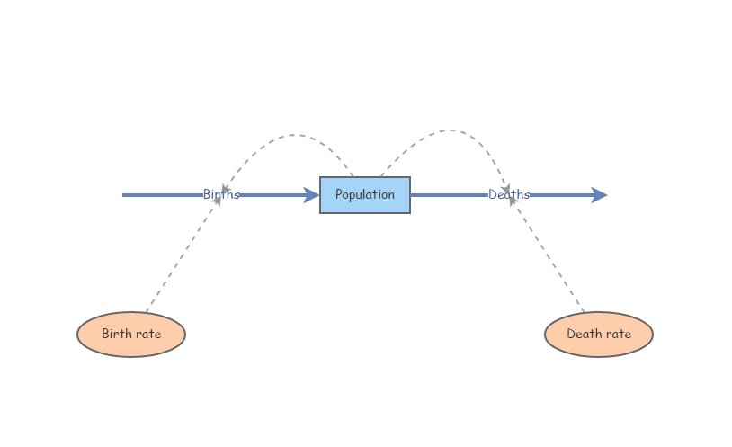

This should look familiar!

Set *Birth rate* equal to 0.4 and *Death rate* equal to 0.3 (just like we did in class). *Set initial abundance to 10*. Under the "Settings" menu set the model to run for 10 years. Make sure your *Population* stock can not go negative (this is a setting in the configurations panel). Hit "Simulate"- you should see *exponential growth*! 

What if we have imperfect knowledge about birth rate? The data we have are consistent with a birth rate $b$ as low as 0.2 and as high as 0.5. Run the model with the lowest and the highest possible birth rate. Now use the "Compare Results" tool (under the "Tools" menu in the upper right corner...) to visualize the range of possible population growth trajectories that would be possible given our *uncertainty* about the per-capita birth rate.   

1a. Provide the plot you just made in your write-up. What is the range of possible final abundances after 10 years? Can we conclude that the population growth rate is positive in this population?    

1b. Another way to do *uncertainty analysis* is to use a *uniform distribution* to represent the range of uncertainty about the parameter value -- in this case, we define Birth rate as a **uniformly distributed** random variable with minimum of 0.2 and maximum of 0.5. We can do this in InsightMaker in one of two ways. One is to define birth rate like this:

```
Rand(0.2, 0.5)
```

and the other is to define birth rate like this:

```
Fix(Rand(0.2, 0.5))
```
The next three questions relate to comparing these two methods: 

1c. Try both of these methods a few times. What difference(s) do you notice between these two methods? Explain your answer.

1d. Use the "Sensitivity Testing" tool (in the "Tools" menu, upper right corner) to run the model 50 times using each of the two methods described above. Choose [Population] as the "Monitored Primitive" (otherwise use the default settings). Run the sensitivity testing module (using the "Run Analysis" button) and provide these two resulting plots as part of your write-up (one plot for each of the two methods). Look at the range of final abundances in the two plots. Which method results in the greatest uncertainty about the final abundance (after 10 years)? Can you explain this difference? (this last part is challenging, but give it a try!).  

1e. Let's think through the problem one more time- we are uncertain about the *true* value of the per-capita birth rate, $b$, for a rare species. The birth rate could be anything from 0.2 to 0.5 - we really can't say! Given this uncertainty, we want to know _what the abundance will be after 10 years_. If you were tasked with evaluating this question, which of the two plots you generated in (1d) would be most appropriate for answering this question? Why? 


## Exercise 2: Demographic and Environmental Stochasticity  

#### _Demographic Stochasticity_ 

Set *Birth rate* in your model back to 0.4. Make sure initial abundance is set at 10 individuals. Hit "Simulate"- make sure you still see exponential growth!     

We will use a *Binomial distribution* to represent the total number of mortalities in the population. That is, we flip a coin the same number of times as there are individuals in the population. If the coin comes up heads, then the individual dies. In this case we are using a biased coin- it only comes up heads 30% of the time! The *Binomial distribution* essentially represents the number of times heads came up. To do this in InsightMaker, use the following formula for the *Deaths* flow:

```
RandBinomial([Population], [Death rate])
```
In plain English: the number of deaths is equal to the number of "coin flips" that come out heads if the probability of getting heads is equal to [Death rate]. 

For the total number of births, we will use the *Poisson* distribution. The Poisson distribution is often use to represent births, because there could feasibly be more births than there are individuals currently in the population (e.g., if all individuals have two offspring!). However, the maximum number of "heads" is the total number of individuals. To do this in InsightMaker, use the following formula for the *Births* flow:

```
RandPoisson([Population]*[Birth rate])
```
In plain English: the number of births is a Poisson-distributed random number with mean equal to [Population]*[Birth rate].

2a. Provide a link to your InsightMaker model with demographic stochasticity, with settings changed to _run for 50 years_. 

2b. Use the "Sensitivity Testing" tool (in the "Tools" menu, upper right corner) to run the model 50 times for 50 years with a starting abundance of 10 individuals. Choose [Population] as the "Monitored Primitive". Provide the resulting plot in your write-up. Change the initial abundance to 500 and re-run the "Sensitivity Testing" tool. Provide the resulting plot in your write-up. (note: you need both sensitivity analysis plots to fully answer the question!)

2c. Use the plots from (2b) above to evaluate the following question (*and you should ALL get this one right!*): For which of the following is _demographic stochasticity_ a more important driver of population dynamics and extinction risk: higher initial abundance or lower initial abundance? Explain your answer.

#### _Environmental Stochasticity_  

Set *Births* back to what it was before ([Population]*[Birth rate]), and do the same for *Deaths*. Set initial abundance back to 10.    

We will use a *Normal distribution* to represent how the birth rate changes each year. This could represent climatic variablity -- "good years" and "bad years". The *Normal distribution* is commonly used for this type of variability- it is characterized by an average value (**mean**) and a measure of variability or spread (**standard deviation**). To do this in InsightMaker, you can use the following formula for the *Birth Rate* variable:

```
RandNormal(0.4, 0.4)
```

Similarly, you can use the following formula for the *Death Rate* variable:

```
RandNormal(0.3, 0.3)
```

2d. Follow the instructions from lecture to ensure that birth rate does not ever go below 0, and that death rate stays between 0 and 1. Embed the link to your InsightMaker model in your write-up. 

2e. Use the "Sensitivity Testing" tool (in the "Tools" menu, upper right corner) to run the model 50 times. Provide the resulting plot in your write-up. Choose [Population] as the "Monitored Primitive". Change the initial abundance to 500 and re-run the "Sensitivity Testing" tool. Provide the resulting plot in your write-up. (note: you need both sensitivity analysis plots to fully answer the question!)

2f. Use the plots from (2e) above to evaluate the following question (*and you should ALL get this one right!*): For which of the following is _environmental stochasticity_ a more important driver of population dynamics and extinction risk: higher initial abundance or lower initial abundance? Explain your answer. 

## Exercise 3: Minimum Viable Population

The aruba island rattlesnake, or Cascabel (*Crotalus durissus unicolor*), is the top predator on the island of Aruba, and primarily consumes rodents. 


The Aruba island rattlenake, as you might expect, occurs only on the island of Aruba.

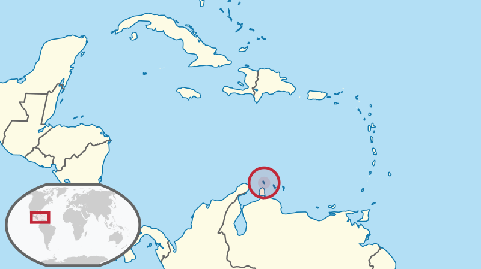

The Aruba rattlesnake is listed as *Critically Endangered* by IUCN, and has several attributes that make it particularly susceptible to falling into the **extinction vortex**:

- Range is limited to the small island of Aruba   
- Total abundance is estimated as 250 individuals   
- Population has been declining due to:   
    - loss and degradation of habitat (overgrazing, human encroachment, forest clearing)    
    - human persecution     

Consider the following scenario: you are tasked with determining the minimum viable population size (MVP) for the Aruba Island rattlesnake. We define the *minimum viable population* (MVP) as:   

> That abundance below which the probability of extinction is 5% or greater over the next 50 years.

Here are the key model parameters! (note that much of this is simplified and/or made up entirely!)

- The starting abundance is 250 individuals.
- No age/stage structure!
- Mean birth rate $b$ is 0.70 (per-capita birth rate)
- Mean death rate $d$ is 0.69 (per-capita death rate)
- Density dependence:   
    - Carrying capacity is 500 individuals.
    - Above carrying capacity, per-capita birth rate drops to 0.35
- Environmental stochasticity:   
    - birth rate is approximately normally distributed with standard deviation of 0.15
    - death rate does not change year to year.
- Demographic stochasticity:   
    - total births are Poisson-distributed
    - total deaths are Binomially distributed

3a. Set up an InsightMaker model to represent the above scenario. Embed a link to your InsightMaker model in your write-up.    

3b. Is the current population **viable**, under the criteria listed above? That is, is there a less than 5% risk of extinction over a 50-year time frame?
    **Hint**: use the *Sensitivity Testing* tool to run 500 replicates. Visualize the 95% quantile. For a viable population the 95% quantile should stay above 0 (extinction) up to at least year 50 of the simulation.    
    
3c. Find the **minimum viable population (MVP)**. (Note: refer to the "small population paradigm" lecture for more detail on the concept of Minimum Viable Population). Explain your reasoning, and provide plot(s) to back up your answer.  

*Congratulations, you have run your first PVA model!!*

3d. (thought question) The Aruba island rattlesnake is limited to the small island of Aruba. This fact alone is one of the main reasons this species is listed as *Critically Endangered* under the IUCN Red List (the major global ranking of conservation status). Explain why small range size might generally be associated with high extinction risk. 


##Checklist for Lab 5 completion

* Please bundle all your responses into a single Word document and submit _using WebCampus_!

* Where appropriate, URLs for your InsightMaker models should be pasted in your lab submission (MS Word document). See details below...  

    * After you save the model you should see a link on the top left-hand corner, "Insight Access". Click on that link, and a new window will pop up. Under "allow update access", add a username (i.e., kevintshoemaker or waldenTA). click on the "Add User" button, and then click on "Submit". Finally, copy and paste the URL into the Word document.

***Due Mar. 10 at 11 am.***

*  Word document with short answers, model URLs, and figures (where appropriate)
    +  **Exercise 1**
        -  *Short answer (1a.)*   
        -  *Short answer (1b.)*   
        -  *Short answer (1e.)*
        -  *Short answer (1d.)*
        -  *Short answer (1e.)*
 
    +  **Exercise 2**
        -  *Short answer (2a.)*
        -  *Short answer (2b.)*
        -  *Short answer (2c.)*
        -  *Short answer (2d.)* 
        -  *Short answer (2e.)*
        -  *Short answer (2f.)*
 
    +  **Exercise 3**
        -  *Short answer (3a.)*
        -  *Short answer (3b.)*
        -  *Short answer (3c.)*
        -  *Short answer (3d.)*
        


 


<!--chapter:end:LAB5.Rmd-->

---
title: "Lab 6: Metapopulation modeling"
author: "NRES 470/670"
date: "March 13, 2017"
output: 
  html_document: 
    theme: spacelab
    toc: yes
    toc_float: yes
---

```{r setup, include=FALSE}
knitr::opts_chunk$set(echo = TRUE, cache = TRUE)
```

## Some definitions

In this lab we will have an opportunity to build spatially structured population models for the first time. The simplest type of spatially structured population model is the **classical metapopulation model**. In this model, we have a **landscape** with a certain number of habitable **patches**. Patches are either **occupied** (coded as 1) or not (coded as 0). We are not keeping track of abundance ($N$) any more- we are just keeping track of whether each population is occupied or not, and how many total occupied populations we have in our metapopulation.   

A metapopulation is best considered **a population of populations**. If a population is composed of individuals, a metapopulation is composed of populations!

**colonization** is the process of a population going from unoccupied to occupied!

How can a metapopulation become colonized? The answer is **immigration** of course. That part of the "BIDE" equation that we have been ignoring up until now! 

**extirpation** (or extinction) is the process of a patch going from occupied to unoccupied.

**regional extinction** represents extinction of all patches in the metapopulation. 

More formally, here are some terms we will consider:

$I$ is the total fraction of patches that are colonized by immigrants per time period (colonization rate, or "immigration" rate) 

$E$ is the total fraction of patches that go extinct per time period (extirpation rate)

$f_t$ is the fraction, or proportion, of patches that are occupied at time $t$. This is also known as the **occupancy rate**

Therefore, the change in occupancy can be expressed as:

$\Delta f = I - E  \qquad \text{(Eq. 1)}$

$p_i$ is the probability of colonization for any given (unoccupied) patch.

$p_e$ is the probability of extinction for any given (occupied) patch.

## A basic metapopulation model:

The more sites are available for colonization, the higher the rate of colonization! 

$I = p_i\cdot (1-f)  \qquad \text{(Eq. 2)}$  

The more sites are occupied, the higher the rate of extinction!

$E = p_e\cdot f  \qquad \text{(Eq. 3)}$


Combining equation 1 with the above equations, we get a metapopulation model:

$\Delta f = p_i(1-f)-p_ef  \qquad \text{(Eq. 4)}$

This model assumes the following:   

- Homogeneous patches (all patches are created equal)
- No spatial dependence of extinction and colonization (spatial context does not affect extinction and colonization parameters)
- No time lags
- Constant extinction and colonization rates across time (extinction and colonization parameters do not change over time)
- Very large number of patches


### Variant #1: island-mainland model

Colonization occurs via immigration from a constant external source -- a constant **propagule rain**

This is the simplest metapopulation model. $p_i$ and $p_e$ are fixed, totally constant.

### Variant #2: internal colonization

Now, colonization can only happen via immigration from within the metapopulation itself. So when few populations are colonized, colonization is low because of a lack of potential immigrants in the metapopultion. 

$p_i = if   \qquad \text{(Eq. 5)}$

$i$ represents the strength of internal immigration (how much the probability of colonization increases with each new occupied patch in the metapopulation.

### Variant #3: rescue effect. 

Now, the extinction rate can be reduced by immigration from other populations in the metapopulation!

$p_e = e(1-f)   \qquad \text{(Eq. 6)}$

$e$ represents the strength of the rescue effect.


### Variant #4: both internal colonization AND rescue effect!

This one is pretty self-explanatory!

## What is a metapopulation?

The term *metapopulation* is often used to refer to models where we don't care about abundance, we only care about occupancy- as in the model described above. However, a metapopulation is simply a *population of populations*. We can keep track of patch abundance in a metapopulation model. In fact, if we want, each patch can contain a stage-structured, density dependent population if we really want! 

Just as we can use metapopulation models to study the probability of **regional extinction**, we can also study **regional abundance** and regional abundance trends. 

## Exercise 1: play with metapopulation terms and concepts!

HINT: _use the Gotelli book!!!_

1a. An endangered frog population of 100 frogs lives in a single pond. One proposal for conserving the frog population is to split it into three populations of 33 frogs, each in a separate pond. You know from your demographic studies that decreasing the frog population from 100 to 33 individuals will increase the annual risk of extinction from 10 to 50% In the short run, is it a better strategy to retain the single population or to split it into three? Show your calculations, and explain your reasoning! 

1b. Consider the simplest (island-mainland) metapopulation model. Under what conditions is the occupancy rate $f$ constant? Explain your reasoning. 

1c. Build an InsightMaker model for the basic island-mainland metapopulation model. The total fraction of occupied populations $f$ should be represented as a [Stock] (this stock can not go negative, nor can it go above 1!) and there should be two [Flows]: one for *colonization* and one for *extinction*. Initialize $f$ at 0.9. The extinction and colonization probabilities ($p_e$ and $p_i$) should be represented as [Variables]. Set $p_e$ to 0.15 and $p_i$ to 0.4. Provide a link to your InsightMaker model as part of your lab write-up.

1d. On the basis of your Insightmaker model, what happens to $f$ over the course of the simulation? Does the metapopulation go extinct (regional extinction)? Does $f$ reach an equilibrium? If so, is this equilibrium **stable** or **unstable**? Explain your reasoning. 

1e. Compare your InsightMaker results (provide a plot) with the results from applying Equation 4.4 from Gotelli. Show your work. Do the two answers match?

1f. Change your InsightMaker model to reflect *internal colonization*. Set the parameter $i$ to 0.1. Provide a link to your InsightMaker model as part of your lab write-up. 

1g. Compare your InsightMaker results (provide a plot) with the results from applying Equation 4.6 from Gotelli. Show your work. Do the two answers match?

1h. Change your InsightMaker model to reflect the *rescue effect*. Restore the colonization model to represent "propagule rain". Set the parameter $e$ to 0.25. Provide a link to your InsightMaker model as part of your lab write-up. 

1i. Compare your InsightMaker results (provide a plot) with the results from applying Equation 4.8 from Gotelli. Show your work. Do the two answers match?

1j. Change your InsightMaker model to reflect the *rescue effect* AND *internal colonization*. Set the parameter $i$ to 0.1. Set the parameter $e$ to 0.25. Provide a link to your InsightMaker model as part of your lab write-up. 

1k. Is this model *stable*? explain your reasoning. Under what conditions do you get perfect 100% occupancy? 


## Exercise 2: a spatial metapopulation model!

As we already know, agent-based models are well-suited for considering spatial context. 

I have already prepared an agent-based metapopulation model for you. You can access and clone this model [here](https://insightmaker.com/insight/74948/Agent-based-metapopulation-model).

Each population/patch in the metapopulation is represented by an "individual", or "agent". These individuals cannot move (they are patches of land, after all), but they can influence each other via immigration and emigration!

The landscape is 200 km by 200 km. Each simulation run, patches are initialized randomly in the landscape. The **metapopulation size** (total number of patches) is initialized at 10. 

Each patch potentially contains a population of animals. If it has >= 2 individuals living in it, it is considered "occupied".

Each patch has its own carrying capacity (K)- some patches have very low carrying capacity, and some have very high carrying capacity. The distribution of K among populations is approximately *lognormal*. This means that there are usually a few very large populations in the landscape. The minimum K is 2 (minimum to support an "occupied" population). 

Abundance dynamics are density-dependent, and population growth is computed as a function of **r_max**, **local carrying capacity**, and previous-year local abundance using the **Ricker** growth model:

$N_{t+1} = N_t e^{r_{max}(1-\frac{N_t}{K})}$

This is one of the most commonly used models for discrete logistic population growth (very analogous to the logistic growth model we have already seen!).

Population growth in each patch is also driven by migration to and from nearby populations. A fixed proportion of each population disperses each year (**dispersal rate**, set to 25% initially), and the **maximum dispersal distance** is set initially at 50 kilometers. If no neighboring population exists within that distance, all dispersers perish. 

There is, of course, demographic stochasticity in this model!

Graphical summaries are available, which illustrate the spatial configuration of the patches, the total metapopulation occupancy, the Total metapopulation abundance, and the total numbers of immigrants/emigrants.

Take some time to open the model (clone it!) and get familiar with the parameters and model behavior. If you don't understand something, ask your instructor! Make sure you have the following starting parameters:

Metapopulation size: 10 patches
r_max: 0.11
maxdist (maximum dispersal distance): 50 kilometers
dispersal rate: 0.25

NOTE: there is one parameter (max dispersal distance, maxdist) you will need to pay attention to, but it is not represented by a value slider (I couldn't get it to work that way, unfortunately). To alter the maximum dispersal distance, you need to open the equation editor for the [Immigrants] variable, and change the value in the top line, which should look something like this:

```
maxdist <- 60
```

2a. Use InsightMaker's *sensitivity testing tool* to run the model 50 times. What is the approximate risk of regional extinction of this metapopulation? What is the abundance trend (that is, overall regional, or metapopulation, abundance) over time? What is the trend in occupancy over time? Provide plots to justify your answer. 

2b. Change the dispersal rate to zero. Run a few simulations to examine the model behavior. Re-run the sensitivity testing tool to examine expected patterns in occupancy and abundance over time. How did the trend in abundance and occupancy change relative to the scenario with 25% dispersal? What about the probability of regional extinction? Justify your answer, including figures. Do these results match with your expectation of what would happen? Why or why not? 

2c. Change the dispersal rate back to 25 % and change the number of patches to 25. Run a few simulations to examine the model behavior. Re-run the sensitivity testing tool (note that InsightMaker will run slower with more patches!) to examine expected patterns in occupancy and abundance over time. How did the trend in abundance and occupancy change relative to the scenario with 10 patches? What about the probability of regional extinction? Justify your answer, including figures. Do these results match with your expectation of what would happen? Why or why not?

2d. Change the metapopulation size back to 10 patches and change the maximum dispersal distance (maxdist) to 100 km (remember you need to open the equation editor for the [Immigrants] variable to do this). Run a few simulations to examine the model behavior. Re-run the sensitivity testing tool to examine expected patterns in occupancy and abundance over time. How did the trend in abundance and occupancy change relative to the scenario with a dispersal distance of 50 km? What about the probability of regional extinction? Justify your answer, including figures. Do these results match with your expectation of what would happen? Why or why not?

2e. Imagine that this metapopulation represents the last remaining patches of habitat for an endangered butterfly. You have identified three possible management strategies: You could:    
      
i. Improve the intervening, or "matrix", habitat, effectively doubling the maximum dispersal distance (individuals are able to disperse more effectively over longer distances). 
ii. Improve existing habitats, doubling the mean per-population carrying capacity.   
iii. Restore habitat, effectively doubling the number of patches.    
     
Which management strategy would be most effective for ensuring that the metapopulation does not go exinct (prevent regional extinction)? Justify your answer with supporting figures.    

2f. [thought question] Is it possible for $r_{max}$ to be positive and yet for the total regional abundance to exhibit a persistent declining trend? Explain your reasoning, using at least one biologically realistic example. You can use the agent-based metapopulation model in InsightMaker to help test your ideas, but this is not required.   


##Checklist for Lab 6 completion

* Please bundle all your responses into a single Word document and submit _using WebCampus_!

* Where appropriate, URLs for your InsightMaker models should be pasted in your lab submission (MS Word document). See details below...  

    * After you save the model you should see a link on the top left-hand corner, "Insight Access". Click on that link, and a new window will pop up. Under "allow update access", add a username (i.e., kevintshoemaker or waldenTA). click on the "Add User" button, and then click on "Submit". Finally, copy and paste the URL into the Word document.

***Due Mar. 31 at 11 am.***

*  Word document with short answers, model URLs, and figures (where appropriate)
    +  **Exercise 1**
        -  *Short answer (1a.)*   
        -  *Short answer (1b.)*   
        -  *InsightMaker model (1c.)*
        -  *Short answer (1d.)*
        -  *Short answer (1e.)*
        -  *Short answer (1f.)*   
        -  *Short answer (1g.)*
        -  *Short answer (1h.)*
        -  *Short answer (1i.)*
        -  *Short answer (1k.)*
 
    +  **Exercise 2**
        -  *Short answer (2a.)*
        -  *Short answer (2b.)*
        -  *Short answer (2c.)*
        -  *Short answer (2d.)* 
        -  *Short answer (2e.)*
        -  *Short answer (2f.)*
 
        


 


<!--chapter:end:LAB6.Rmd-->

---
title: "Lab 7: Parameter estimation: mark-recapture analysis!"
author: "NRES 470/670"
date: "April 4, 2017"
output: 
  html_document: 
    theme: spacelab
    toc: yes
    toc_float: yes
---

```{r setup, include=FALSE}
knitr::opts_chunk$set(echo = TRUE, cache = TRUE)
```

## Open versus closed populations

**Closed population** – a population in which there is no recruitment (birth or immigration) or losses (death or emigration) during the period of study. Geographic and demographic closure.

**Open population** – a population that changes in size and composition due to births, deaths, and movements.


## Overview of capture-recapture models:

### Closed-population models

- *two samples* – Lincoln-Petersen model

- *several samples* (k>2) – Schnabel (Schumacher-Eschmeyer) model and models in program CAPTURE (which can be run through Program MARK.

#### LINCOLN-PETERSEN MODEL (L-P) (2-sample closed-population model)

Basic underlying concept:

A sample of $M$ animals is caught, marked, and released. Later a sample of $C$ animals is Captured, of which $R$ animals are *Recaptures* that were previously Marked. 

If capture probability (*p*) is independent of marking status, then the proportion of marked animals in the second sample should be equivalent to the proportion of marked animals in the total population (*N*) so that

$\frac{R}{C} = \frac{M}{N}$

where $N$ is the total catchable population size. Solving for $N$ yields the estimator:

$\hat N=\frac{C*M}{R}  \qquad \text{(Eq. 1)}$ 

If sample size is small, the above estimator is biased. For example, what happens if the number of recaptures is zero? 

A modified version with less bias was originally developed by Chapman (1951) and is commonly called the modified Petersen estimate in fisheries:

$\hat N=\frac{(M+1)(C+1)}{R+1}-1   \qquad \text{(Eq. 2)}$

This formula is a **statistic** estimating total population size on the basis of a **sample**. 

We still need to make inference about the **parameter**, $N$, on the basis of the statistic, $\hat N$.

To do this, we need to understand the **sampling variability**. That is, if we collected a different sample from the *same population*, we might get a very different answer for $\hat N$. If we took 100 or 1000 different samples, we might get 100 or 1000 different estimates for $\hat N$!! The variation among these estimates is the **sampling variability**.

For the Lincoln-Peterson estimator, the sampling variability (variance) can be estimated as:

$Var(\hat N)=\frac{(M+1)(C+1)(M-R)(C-R)}{(R+1)^2(R+2)}   \qquad \text{(Eq. 3)}$

The standard deviation of the sampling variance is just the square root of the sampling variance:

$StDev(\hat N) = \sqrt[]{Var(\hat N)}    \qquad \text{(Eq. 4)}$

Finally, the 95% confidence interval for $\hat N$ is approximately 2 standard deviations from the value of $\hat N$.

$\hat N \pm 1.965 * StDev(\hat N)   \qquad \text{(Eq. 5)}$

#### Fundamental Assumptions of Lincoln-Petersen estimator:

- The population is closed (geographically and demographically).
- All animals are equally likely to be captured in each sample.
- Capture and marking do not affect catchability.
- Each sample is random.
- Marks are not lost between sampling occasions.
- All marks are recorded correctly and reported on recovery in the second sample.

**Q** What is the estimate of per-capita capture probability in the Peterson estimator?? 

**Q** For the L-P estimator, is it critical that all individuals are *uniquely* marked??

#### SCHNABEL ESTIMATOR (k-sample closed-pop'n model)

Schnabel 1938, Schumacher and Eschmeyer 1943

This method extends the Lincoln-Peterson method to a series of samples in which there are 2, 3, 4,..., k samples. Individuals caught at each sample are first examined for marks, then marked and released. 

Only a single type of mark need be used because we just need to distinguish 2 types of individuals: marked, caught in one or more prior samples; and unmarked, never caught before. For each sample t, the following is determined:

$C_t$ = Total number of individuals caught in sample $t$

$R_t$ = Number of individuals already marked (Recaptures) when caught in sample $t$

$M_t$ = Number of marked animals in the population just before the $t$th sample is taken.

Schnabel treated the multiple samples as a series of Lincoln-Peterson (L-P) samples and obtained a population estimate as a weighted average of the L-P estimates which is an approximation to the maximum likelihood estimate of N:

$\hat N = \frac{\sum{M_tC_t}}{\sum{R_t}+1} \qquad \text{(Eq. 6)}$

What about the sampling variance? It can be computed as:

$Var(\frac{1}{\hat N})=\frac{\sum{R_t}}{(\sum{(C_tM_t))^2}}   \qquad \text{(Eq. 7)}$ 

Note that this formula gives you the sampling variance on the *inverse* of N! How do we compute a confidence interval around $\hat N$??

One way is to compute a confidence interval on the inverse of N, then take the inverse of the lower and upper bounds (limits) of this confidence interval!

#### Assumptions of the Schnabel method

Same as Lincoln-Petersen estimator but assumptions apply to all sampling periods. In other words, every individual in the population is assumed to have the same capture probability for a given sampling occasion (although capture probabilities can vary among sampling periods).

##### Advantage of k-sample methods

The major advantage of multiple sampling is that it is possible to evaluate the data for violations of assumptions, such as unequal capture probabilities.

## Exercise 1: Working with closed populations!

Let's use the following example from the ["gentle introduction to program mark"](http://www.phidot.org/software/mark/docs/book/pdf/chap14.pdf). This example represents a closed population that has been surveyed 6 times. 

```{r eval=FALSE, echo=FALSE}

temp <- read.table("E:\\MARK\\Examples\\markdata\\simple_closed1.inp",colClasses = "character",header=FALSE)
temp2 <- as.data.frame(matrix(unlist(strsplit(temp[,1],split="")),ncol=6,byrow=T))
temp2$times <- as.numeric(gsub(";","",temp$V2))
temp3 <- temp2[rep(c(1:nrow(temp2)),times=as.numeric(temp2$times)),]
temp3 <- temp3[,-c(ncol(temp3))]
names(temp3) <- c("sample1","sample2","sample3","sample4","sample5","sample6")

setwd("E:\\GIT\\NRES-470")

write.table(temp3,file="simple_closed.csv",row.names=FALSE,col.names=TRUE,sep=",")

```


Load up the CSV file [here](simple_closed.csv). The first few lines should look something like this:

```{r echo=FALSE}

head(read.csv("simple_closed.csv"))


```


1a. First, let's imagine that we only have samples 1 and 2! Using this data, compute the L-P estimate of abundance using Eq. 2. Also compute the confidence interval for your abundance estimate. Show your work! I recommend using EXCEL for this!


1b. Now, use the Schnabel method to estimate abundance (and confidence interval). Show your work! Again, I recommend using EXCEL for this!


### Open-population models in Program MARK

(note: geographic closure is still a critical assumption)

*Cormack-Jolly-Seber* model is the most basic model in Program MARK.

See the [parameter estimation lecture](LECTURE15.html) for more information about open-population mark-recapture analysis! 

#### TUTORIAL: working with open populations!

For this exercise, we will use the classic European Dipper data!

These data should look like this! Here it is in R (just the first 15 lines)!

```{r echo=FALSE}
library(mra)

data(dipper.histories)
head(dipper.histories,15)
```

Program MARK wants a particular type of input file (.INP). For the dipper data, it should look something like [this](ed_males.txt)

NOTE: if this doesn't work, load the example files from the ["gentle introduction" link](http://www.phidot.org/software/mark/docs/book/)! 

1. Open Program MARK! You can download the software [here](http://www.phidot.org/software/mark/downloads/index.html)

2. Mark automatically creates an output file when you open a data file so move the dipper data file to your personal folder to prevent existing examples from being overwritten.  

3. Double-click the Mark icon to open Program Mark.  Click the spreadsheet icon in the upper left corner to open a menu for Specifications for Mark Analysis.  This menu allows you to specify the kind of analysis you will conduct (Select Data Type).  Today we will start with a data set that includes live recaptures only so be sure this Data Type is selected (Cormack-Jolly-Seber model).  

4. Look to the right and you will see a button: Click to Select File.  Click this button and browse to find the "ed_males.inp"" file.  Double click this file to open this file in Program Mark.  Now click the view this file button, which will allow you to see the data file.  You will see some file information at the top enclosed in //, which tells Mark this information is not part of the data.  Below, you will see encounter histories followed by a space pairs of 1s and 0s, also separated by a space, all of this followed by a ;.  The encounter history indicates the occasions when each individual was encountered (actually observed), indicated by a 1, or not ed, indicated by a 0.  The column to the right indicate how many individuals in the population exhibit this particular capture history. The ; at the end indicates the end of the record.  Note that in this encounter history each individual has its own record (the value in the final colummn is always 1).  However, it is possible to specify only the unique observed encounter histories and indicate the number of individuals with each history.

5. We now have to provide Mark some information about the data.  You should provide a title for the data to keep you results organized.  Below the data file selection area you will find some buttons and counters to provide additional information.  Encounter occasions needs information about the number of possible times an individual was encountered.  Count the number of columns in the dipper encounter history (there are 7) and enter this number for encounter occasions. Once you have completed these tasks click OK; Mark has the basic information it needs to perform an analysis.

6.  A window will open entitled “apparent survival  parameter (phi) males of live recaptures”.  Before we discuss this window we need to open an additional window.  Click on the PIM button on the top toolbar, then click on “open parameter index matrix”.  Click select all then OK.  Click on the Window button on the top toolbar then click on Tile. You should see 2 similar appearing windows all with the upper diagonal of a matrix.  Look more closely and you’ll see that the window for male survival has numbers ranging from 1 to 6 as columns go from left to right.  The encounter probability matrices have numbers 7 to 12.  These numbers specify the model structure by defining the number of survival and capture probabilities we wish to estimate! The model you have specified allows survival and encounter probabilities to vary annually.

7. Another useful way to visualize the parameters you wish to estimate is the "Parameter Index Chart". Click on the PIM button on the top toolbar, then click on “open parameter index chart”.  Here you see all parameters in one window- six different survival parameters and six different encounter probability parameters.

**Q**: Why are there only 6 survival parameters, when there are seven surveys??

**Q**: Why are there only 6 capture probabilities, when there are seven surveys?? 

8. To run this model click on the small button with the green arrow (third from left).  A new window will open asking for the title for the analysis and the model name. Use 'dippertest' or another descriptive name for the analysis.  Identify the model as: "{phi(t),p(t)}", which indicates that survival and encounter probabilities can each vary across time, independently.  This model is among the most general we can run for this data set.  

9. Click OK, and a new window will ask you if you want to use the identity matrix because no design matrix was specified.  Click yes (or OK) we’ll learn more about the design matrix later.  A new black window with scrolling text will open indicating that MARK is doing calculations (the numerical methods to maximize the likelihood for the data and specified model).  

10. When Mark is finished a new window will open asking you if you want to append the model to the database.  Click yes and a new table (The Results Browser) will open.  The model is identified on the left based on the notation you provided, AIC, AIC weight, number of parameters and deviances are all reported.  For now you can consider AIC as a ranking of the quality of the models from best (low AIC) to worst (high AIC). "Deviance" is a measure of how well the model fits the data.

11. Re-open the PIMs for survival and capture probability. Use the minus button to reduce the numbers in survival windows to 1 for both males and females and 2 for the both the windows for encounter probabilities (for the latter reduce all matrix entries to 1 then use the plus button to increase them to 2).  Use the green arrow to run this model and follow the same procedure as for the earlier model to run this model.  Identify the model as {phi(.),p(.)}, which indicates that both parameters are constant across both groups and time.  This is the simplest model we can run for these data.  Again, use the identity matrix and append the results to the Results Browser.  The “dot” model performs better (lower AIC) and has fewer parameters so it is the best of the two models run so far!

12. **Examine Parameter Estimates**: To examine parameter estimates click on the model, then move the cursor to the top tool bar and click on 'Retrieve'.  Then click on current model.  To see the parameter estimates for the retrieved model return the curser to the Results Browser and click the fourth icon from the left (the third minipage from the left).  A text file will open with a list of parameters and their estimates ("view estimates of real parameters in notepad window").  For the 'dot' model you will only see one survival estimate and one encounter probability because you specified that both parameters would be constant across time.

Now retrieve the {phi(g*t),p(g*t)} model and examine parameter estimates for this model.  You will see 6 survival estimates and 6 estimates for detection probability.  These are indexed using the numbers you provided in the PIMs.  Notice that the 6th estimates for both phi and p have standard error that are either very large or zero.  *These are the estimates for the last survival and encounter probability for each group, which cannot be estimated*; only their product can be estimated.  

## Exercise 2- CJS models in Program MARK

2a. In the CJS model with time-constant survival and capture probability, write out the *likelihood* of the following capture history:

```
1 1 1 1
```

2b. In the CJS model with time-constant survival and capture probability, write out the *likelihood* of the following capture history:

```
1 0 0 1
```

2c. In the CJS model with time-constant survival and capture probability, write out the *likelihood* of the following capture history:

```
1 0 0 0
```

2d. [building off the demonstration in Program MARK]. Build and run the following model: capture probability varies by year, but survival is constant across time. Is this model better than the current top model? What are the parameter estimates for this model? What are the *confidence intervals* for these parameters?


2e. Build and run the following model: capture probability is constant across time, but survival exhibits temporal variability. Is this model better than the current top model? What are the parameter estimates for this model? What are the *confidence intervals* for these parameters?

2f. Use your results to estimate *environmental stochasticity* in survival for European dippers. Explain how you obtained your answer, and show your work!


##Checklist for Lab 7 completion

* Please bundle all your responses into a single Word document and submit _using WebCampus_!

* Where appropriate, Excel files should be included as part of your lab submission. See details below...  

***Due Mar. 31 at 11 am.***

*  Word document with short answers, and and Excel document
    +  **Exercise 1**
        -  *Short answer (1a.)*   
        -  *Short answer (1b.)*   
 
    +  **Exercise 2**
        -  *Short answer (2a.)*
        -  *Short answer (2b.)*
        -  *Short answer (2c.)*
        -  *Short answer (2d.)* 
        -  *Short answer (2e.)*
        -  *Short answer (2f.)*
 
        


 


<!--chapter:end:LAB7.Rmd-->

---
title: "A whole-systems approach to population ecology"
author: "NRES 470/670"
date: "Jan 19, 2018"
output: 
  html_document: 
    theme: spacelab
    toc: yes
    toc_float: yes
---

```{r setup, include=FALSE}
knitr::opts_chunk$set(echo = TRUE, cache = TRUE)
```

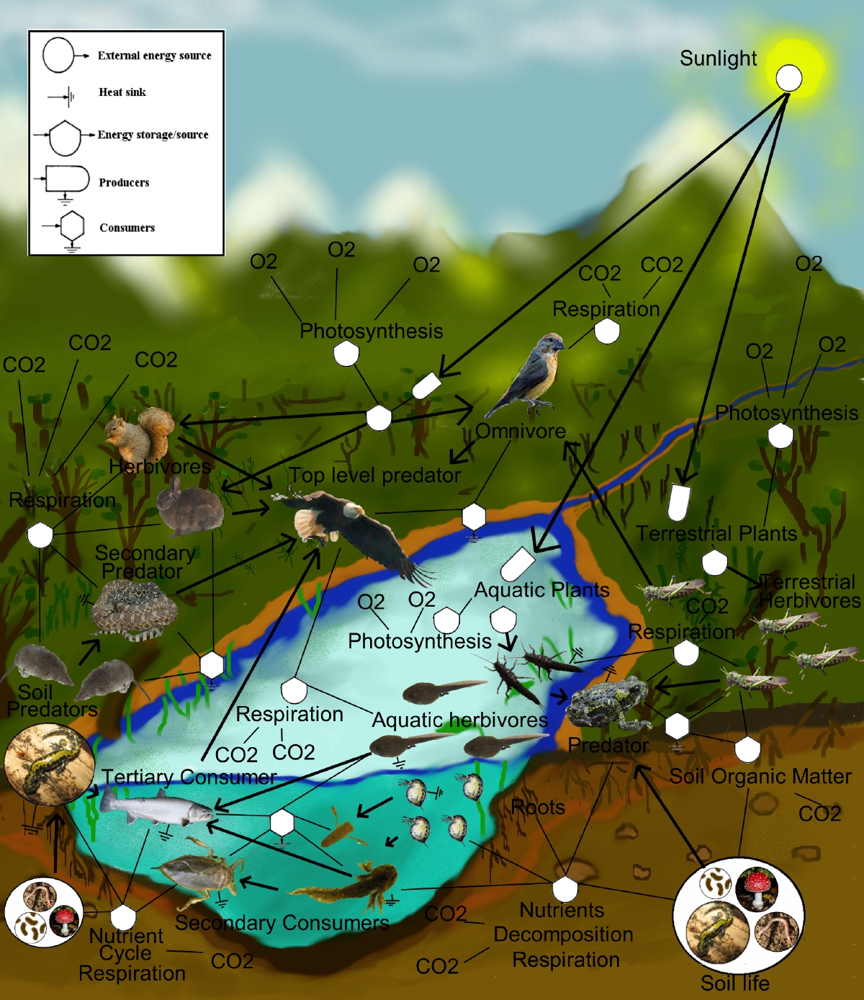

## Systems ecology: a way of thinking   
Ecology is messy. When we work in nature, we are dealing with *inherently complex systems*. _All elements in a natural system are connected_, full of dynamic interactions. Interactions among organisms, between organisms and their environment to meet basic needs -- these linkages are what makes ecology messy, but also endlessly fascinating. 

We can think of humans as just another element in these complex systems. And wildlife conservation and mangement is the task of manipulating or tweaking these linkages to meet societal objectives for natural systems.  

This is not a systems ecology class! 

BUT, systems ecology provides a great framework for thinking about natural populations, understanding how linkages (abiotic and biotic environments) might affect them, and how to manage natural populations most effectively. 

## Emergent properties
This is one of the most powerful ideas in whole-systems thinking -- when you put many interacting, linked parts together, systems often behave in interesting and unexpected ways! 

Take a classic predator-prey system...

[Insightmaker Lynx-Hare example](https://insightmaker.com/insight/68437/)  

This is a classic example in population ecology, which we will revisit in great detail in this course - but for now it serves as an example of an interacting system that exhibits an emergent property -- regular oscillations!

And here's a more abstract example that illustrates some really cool and complex emergent properties.

[Lorenz attractor](https://insightmaker.com/insight/1829/Lorenz-Attractor)

## *InsightMaker*: a modeling framework for systems thinking!

[InsightMaker](insightmaker.com) is a flexible web-based software for defining interacting systems and for modeling the behavior of inter-connected systems. 

Both of the above examples were constructed in InsightMaker.

We will make extensive use of InsightMaker, both during class and in lab- this will give you a chance to play around with complex and dynamic systems without needing a background in computer programming!

## Computer programming and systems thinking

Modern computers have reduced or eliminated many of the barriers to understanding how complex systems behave, and as a result **specialized software and computer programming** are a critical component to modern whole-systems analysis, including **ecosystems** analyses. Armed with basic facility with computer programming, ecologists and natural resource professionals can formalize their understanding of the natural systems in which they work, accounting for complex biological realities that may have been ignored if these tools were not available.  **In this course, we will learn to harness the power of computer simulations for understanding and managing natural populations**.  

By the end of this course, students will have the ability to program their own *whole-systems models* in InsightMaker, and use specialized software for parameterizing these models (e.g., Program MARK, various **R** packages)

**The course motto**: *Get messy*! This might sound funny for a computer-based class. But just as ecological systems are complex and messy, models sometimes get messy. 
Don't be afraid to model messy systems. And above all, **don't be afraid to be wrong** (especially at first)- that attitude is the enemy of successful computer programming, and of good wildlife management! When we build our own algorithms, we can be entering uncharted territory. And this can be difficult and dangerous, but ultimately rewarding! Keep trying, and stay positive!

Of course, getting messy means not just reading and listening to lectures, it means *learning by doing*! Instructor-led lectures will be kept short, and we will spend significant class time (and pretty much all of lab time) on our computers, working through problems.

## In-class Exercise: InsightMaker

A [Stock] of stuff increases over time via what [Flows] in. Imagine our stock represents *Moose*! *Moose Births* would then be the input [Flow] to the population of *Moose* over time. 

A [Stock] of stuff decreases over time via what [Flows] out. For example, *Moose Deaths* could represent the [Flow] out of the population of *Moose*.

If the [Flow] in is larger than the [Flow] out then the [Stock] increases over time. 

If the [Flow] out is larger than the [Flow] in then the [Stock] decreases over time.

If the [Flow] in equals the [Flow] out then the amount in the [Stock] will not change over time.

The important takeaway is that a [Stock] represents a quantity of something. The [Stock] only changes over time via [Flows In] or [Flows Out]. A [Stock] doesn't change instantaneously, with hand waving, magic, or smoke and mirrors.

1. Open up [InsightMaker](https://insightmaker.com/). If you have never used it before you need to sign up first with a username and password. *InsightMaker is free!*

2. Create a new Insight (the button to do this should be obvious!) and clear the demo model. 

3. Right click in the center of the screen and select **Create Stock** from the popup. Notice that the name is *New Stock* and is selected. Type in a name for what this is an accumulation of. Note the **Configuration Panel** on the right is now for a [Stock]. In the configuration panel, set the *Initial Value* to 50. That is, there will be 50 moose at the start of the simulation! 

4. Select [Flow] in the upper left corner of your screen under [Connections]. Now notice that when you mouse over the [Stock] a small right-arrow displays. Click on the right-arrow and drag a couple inches to the left of the [Stock] and release. This is how you create a [Flow] out of a [Stock]. To create a [Flow] into a [Stock] click the **Reverse** button in the **Connections** menu. Please do that now. You can name the [Flow] as you wish. Also in the **Configuration Panel** set **Flow Rate** = 1.

5. Now click **Run Simulation** and you have just finished your first simulation model.

6. Can you figure out how to change the settings to run the model for 50 years? Try this and click **Run Simulation**.

7. Use the same methods as *step 4* to create a [Flow Out], representing moose deaths. Re-run the model. Is the population increasing or declining? Why? 

8. Change the **Configuration Panel** for the [Stock] and for the [Flow In] and [Flow Out] so that "Show Value Slider" is set to "Yes". You can change the model parameterization easily using these sliders. Try it a couple times, re-running the simulation after each change. 

**Q**: Is this Moose model realistic? What is the first thing you would like to change to make the model more realistic?

9. Take a few minutes to check out "Insights" made by others using the "explore insights" link at the top of the webpage. You can search the database of Insights. We can (and will) add to this database as part of this class!


Finally, just for fun, here is a cool video of the Lorenz Attractor, which we saw earlier!

[Lorenz attractor video!](https://www.youtube.com/watch?v=iu4RdmBVdps)


[--go to next lecture--](LECTURE2.html)


 


<!--chapter:end:LECTURE1.Rmd-->

---
title: "Intro to individual-based models (IBM)"
author: "NRES 470/670"
date: "Mar 6, 2017"
output: 
  html_document: 
    theme: spacelab
    toc: yes
    toc_float: yes
---

```{r setup, include=FALSE}
knitr::opts_chunk$set(echo = TRUE, cache = TRUE)
```


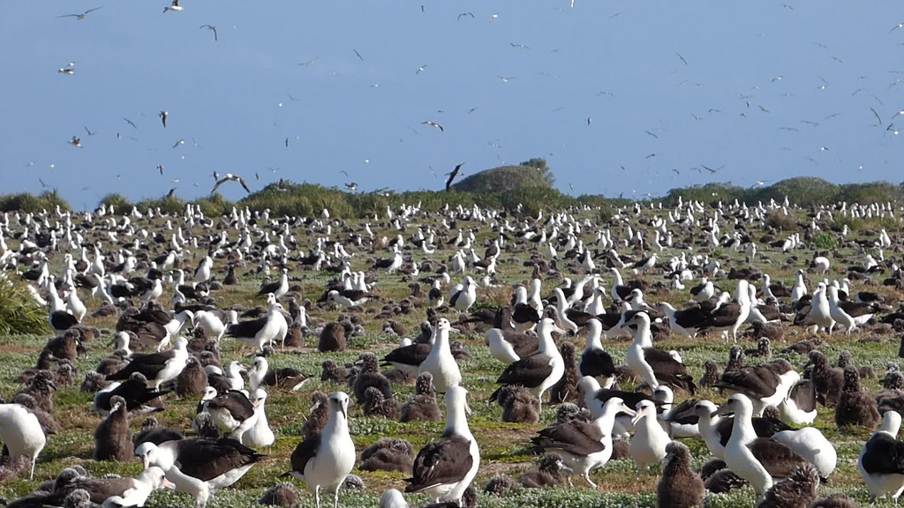

So far in this class we have looked at the **population** as the fundamental unit that we are interested in modeling. This makes sense for a population ecology class! But we are all aware that populations consist of **individuals** that are semi-autonomous. Sometimes the questions we want to ask in ecology and conservation biology require us to zoom in on the processes that are occurring at the *individual level*. 

In some ways a population is hard to define- it can be a bit of an artificial concept. The individual is (mostly) a straightforward, biologically meaningful concept. 

Before we define how individual-based models differ from the population-level stock-flow models we have already been using, let's first point out the similarities. 

First of all, the basic modeling workflow is ALWAYS the same, no matter what kind of model we want to use!

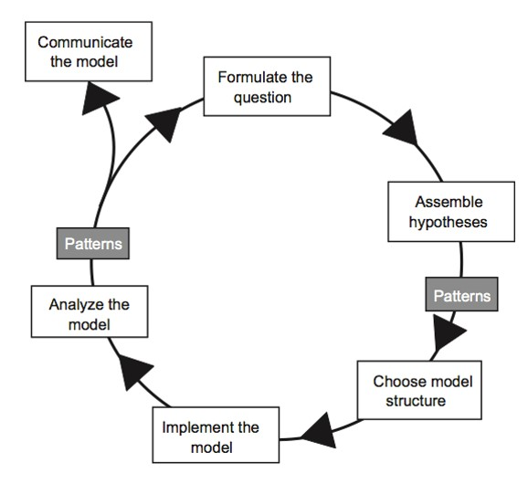

All models are a way to **formalize our understanding about our study system**. 

**Population-based models** (PBM; i.e., models of $N$) are the main type of model we consider in this class- because it is the most direct way to think about population dynamics: $N$ is our main variable of interest, and it is controlled by intrinsic (e.g., density-dependence, demographic stochasticity) and extrinsic (e.g., environmental stochasticity, harvest) factors. 

**Age/stage structured population-based models** and **sex structured population models** (i.e., models of $\mathbf{N}$, i.e., vector-structured $N$) are a type of population model in which individuals are grouped together according to important traits like sex and age, with distinct population vital rates assigned to each group.

**Individual-based models** (IBM; also known as "agent-based" models) is a way of modeling populations such that all individuals are considered explicitly! We no longer need to put individuals into groups- each individual can potentially have a different survival probability, or chance of breeding, or movement propensity! In this case, we don't model $N$ directly at all -- in fact, $N$ is an **emergent property** of individual organisms interacting with each other, with predators and competitors, and with their abiotic environment.

### Which model structure should I use? IBM or PBM??

In general, models are tools- you should use the model structure that best fits with the questions you are asking and your understanding of the study system!

And also, if two different model structures are equally appropriate, you should usually use the **simplest approach**! This idea is often called the *Principle of Parsimony* (or, *Occam's Razor*). 

Both IBM and PBM can be used to address questions at the population or metapopulation level

#### Rules of thumb

- In general, you should use IBM if your *primary information at the individual level* (e.g., telemetry data)-- allowing you to build informed models of how individuals interact with members of their own species, possibly other species, and their local environment -- in which case the principle of parsimony dictates that you should build models at the individual level!

- You should use PBM if your *primary information is at the population level* (e.g., the results of most mark-recapture analyses) -- in which case the principle of parsimony dictates that you should build models at the population level!

**Q**: All populations are composed of individuals. Why then don't we always model populations using individual-based models? (this could be a good exam question...)


**Q**: What are some questions that might be best addressed using **individual-based models (IBM)**?

**Q**: What are some questions that might be best addressed using **population-based models (PBM)**?


_Individual-based models are powerful- but with power comes great responsibility!_


## Demo: Individual-based models!

The goal of this activity is to build a mechanistic, individual-based model (IBM) of a (real, not made-up by my postdoc I swear!) ecological system. 

### The scenario
The *laphlag island* archipelago is famous for its dramatic slopes, lush green grass, and its native sheep, the laphlag island bighorn. About 50 years ago, the native island wolf population was hunted to extinction by ranchers, to prevent any wolf predation on their precious livestock. 

However, without wolves, populations of the native sheep skyrocketed, and the famous laphlagian lush green grass is quickly being lost to overgrazing by the native sheep. 

The locals now realize: *They need to reintroduce wolves to the islands*!

You have been hired as a research ecologist to help the locals and biologists address the following questions:

- How are reintroduced wolves likely to affect grass biomass and distribution? 

- How many wolves are needed to effectively restore that characteristic lush green grass to the islands?

The local management agency is about to start an experimental wolf reintroduction, but they want to know what to expect before making the final decision to go ahead with it.  

They give you some information to get a first guess but they promise that you’ll be able to come study the experimental setup once it’s underway.

The hypothesis is that presence of wolves affects sheep populations in such a way that grass growth is promoted.


### The details!

The enclosure is deployed after the breeding season and the experiment is run for 365 days. 

#### Sheep

- There are a total of 50 sheep in the experimental enclosure
- Each sheep eats 0.2 units of grass per day
- Each sheep gives birth to 3 lambs approximately every 100 days of the experiment.
- Sheep tend to stay in place unless either they run out of food to eat or there is a wolf in the vicinity

#### Wolves

- There are a total of 5 wolves in the experimental enclosure
- Wolves are solitary hunters, at least on this imaginary island!
- Wolves have a 10% probability of finding and killing any sheep within 500 m of its location in any given day.
- Wolves tend to move approximately 500 m per day on average. 
- Wolves can kill a maximum of one sheep a day.
- Wolves give birth with a probability of 1% per day. 

#### Grass

- The experimental enclosure is one large grassy pasture. For the purposes of this exercise, we will turn this pasture into a grid of approximately 100 equivalent plots. Each plot starts off with 10 units of grass (enough to support 50 sheep for a day). 
- Each grass plot can have a maximum of 15 units of grass. 
- Each plot can grow approximately 0.1 units of grass per day. 


### In-class exercise:

First, go to InsightMaker and load up the demo individual-based model! [Here is the link!](https://insightmaker.com/insight/74158/ICE-Individual-based-model).

1) Make sure you can run the model and interpret the resulting figures. 

2) Try to adjust the number of sheep and wolves to meet your management goals: 
    - Maintain viable populations of both sheep and wolves
    - Maintain lush grass!

3) Does the model behave realistically?  Test it! What happens if you start with lots of sheep and no wolves? What happens if you start with no sheep, and a bunch of wolves? 

4) Is it possible for the experimental plot to support sheep, wolves, and grass indefinitely?

5) What if wolves were more efficient at killing sheep? Try doubling the "Prob of kill" variable and see how your answer changes.

6) What if grass were more productive? Try doubling the "Grass Growth Rate" and see if more sheep can be supported sustainably. 

7) What if the wolves don't actually kill the sheep, but just scare them (make them move)?? Does the presence of wolves affect grass growth in this case? (hint- you might need to set sheep birth rate to 0 to see an effect)


**Q**: is there any stochasticity in this model? If so, what kind of stochasticity is there? Take an educated guess!


[--go to next lecture--](LECTURE11.html)


<!--chapter:end:LECTURE10.Rmd-->

---
title: "Declining-population paradigm"
author: "NRES 470/670"
date: "Mar 6, 2017"
output: 
  html_document: 
    theme: spacelab
    toc: yes
    toc_float: yes
---

```{r setup, include=FALSE}
knitr::opts_chunk$set(echo = TRUE, cache = TRUE)
```


**Q**: Is the intrinsic rate of growth $r_{max}$ positive or negative for most species on earth? Why???

**Q**: Given that most species are capable of sustained growth and attaining large population size under favorable conditions, how do populations get small in the first place? Why are some populations declining despite their intrinsic ability to grow?

## Threats to populations

The answer of course is that the intrinsic ability to grow under ideal conditions is not the whole story. Populations are stocks with inflows and outflows- and if mortalities exceed births *under present conditions* the population will decline. 

In the "small-population paradigm" lecture we discussed several **stochastic threats** to populations, including loss of genetic diversity (genetic drift), demographic stochasticity, catastrophic environmental events. These threats only really affect small populations. Large populations are mostly resilient to stochastic threats.

Large populations can be threatened though! Factors that threaten large populations are usually **deterministic**! 

The **declining population paradigm** focuses on the factors that make large populations small -- that is, it is the *study of those deterministic processes that cause population decline, and how these processes may be reversed through effective conservation management*. 

What are some factors that can *tip the balance* so to speak- so that growing or stable populations become declining populations? 

### Harvest


### Habitat loss


### Disease


### Climate change

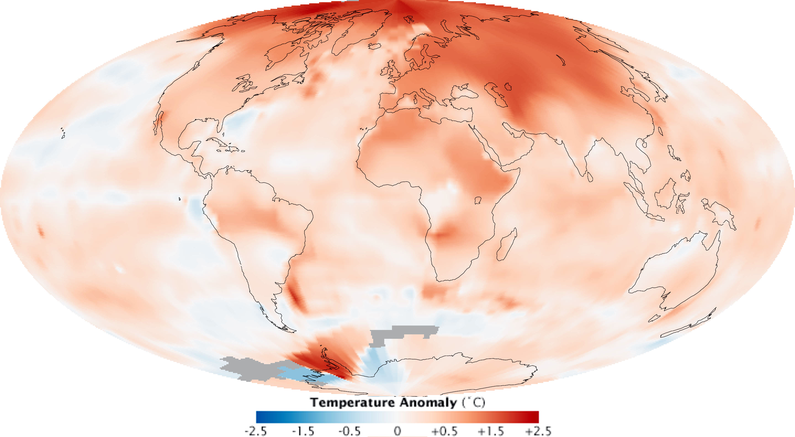

### Invasive species


### Pollution


## The controversy in Conservation Biology!

So, which one is more important for conservation? The declining-population paradigm or the small-population paradigm??

This "controversy" was ignited by a [very influential paper by Graeme Caughley](caughley1.pdf) in *Journal of Animal Ecology* in 1994.


In this paper, Caughley defines the two competing paradigms, and expresses a bias towards one paradigm and against the other...

> Conservation biology has two threads: the small-population paradigm which deals with the effect of smallness on the persistence of a population, and the declining- population paradigm which deals with the cause of smallness and its cure.

**Q**: Can you detect Caughley's bias in the above quote? 

**Q**: What do you think? Do you agree with Caughley?

### In-Class Exercise: Deterministic threats

Let's try a worked example to illustrate the above points.

Let's start with a basic scalar, density-dependent population -- should look something like this:

You can clone this model by clicking [here](https://insightmaker.com/insight/74417/ICE-declining-population-paradigm)


You should see logistic growth if you hit the simulate button.  

For this exercise, let's change the initial population to 200 (near K).

Also, make sure that the time step is 1 year, and the model should run for 30 years.

Before adding any threats, let's add **demographic stochasticity** into this model!

**Let's add a harvest process!**

- Assume that harvest is limited to 10% of the population each year. However, the true harvest rate is stochastic- occasionally harvest goes as high as 15%, and occasionally as low as 5%.    

**Q**: is the variation in harvest rates best considered a type of *demographic stochasticity*, or a type of *environmental stochasticity*?    

**Q**: why doesn't the population decline to extinction? What has the harvest process done in this case?    

**Let's add a habitat loss process!**

- Assume that habitat loss results in larger density-dependence terms- that is, because there is less habitat, the effects of crowding are more pronounced.   

- Let's model the case where both density dependence terms are multiplied by 1.1 each year (simulating 10% habitat loss each year). You can do this in InsightMaker using the following formula (for both density dependence terms):    

```
0.001 * 1.1^Years()
```

- Add a new variable to represent carrying capacity. Recall that K is defined as:

$\frac{b-d}{a+c}$

- Run the simulation to visually track K along with population dynamics! Does it look right?  

- Try running the model with only habitat loss (no harvest - set harvest to zero).    

- Try changing the harvest process to be 10 individuals per year instead of 10% of the population per year. How does this change the results?    

- What would happen if the habitat loss process were better represented by a *linear* versus *exponential* decline in K??     


[--go to next lecture--](LECTURE12.html)


<!--chapter:end:LECTURE11.Rmd-->

---
title: "Population Viability Analysis"
author: "NRES 470/670"
date: "Mar 6, 2017"
output: 
  html_document: 
    theme: spacelab
    toc: yes
    toc_float: yes
---

```{r setup, include=FALSE}
knitr::opts_chunk$set(echo = TRUE, cache = TRUE)
```

## Population Viability Analysis (PVA)

Population Viability Analysis (PVA) integrates everything we have studied so far and more. At its most basic level, PVA is the _process of building and running a formal predictive population model for the purpose of gaining insight about present and future conservation status, or ranking alternative management options_.

**Q:** Does PVA belong to the small-population paradigm?

**Q:** Does PVA belong to the declining-population paradigm?

**Q:** Are PVA models always stochastic?

**Q:** Are PVA models always density-dependent?

**Q:** Are PVA models always age-structured?

**Q**: Are PVA models always spatially-explicit?

### The PVA process (recipe for PVA!)

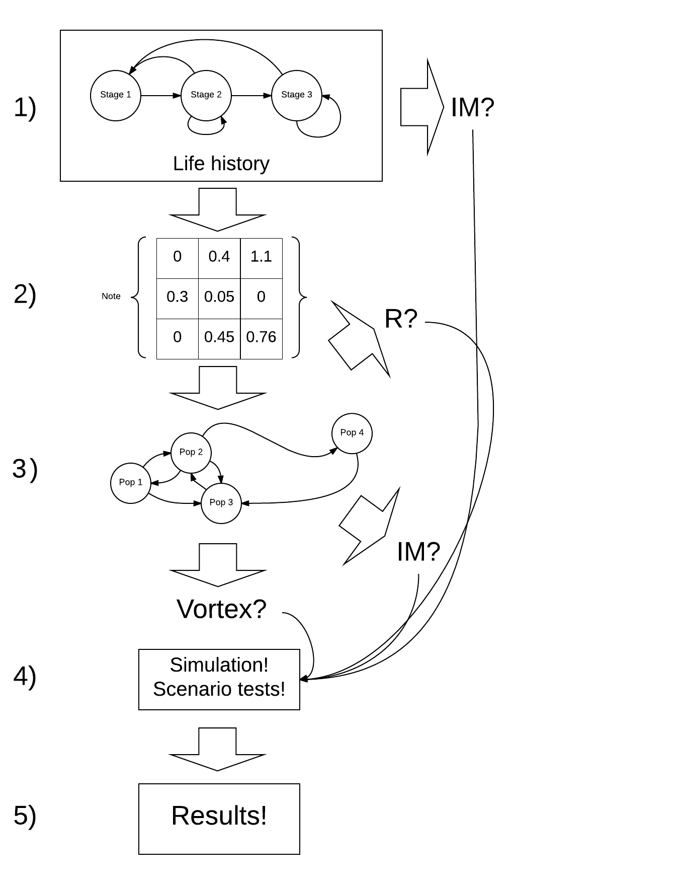 

NOTE: The process of building a PVA model is **iterative** and **non-linear**. 

For example -- after running your model (step 4) you might realize that your results (step 5) are totally unrealistic. This might prompt you to go back and change your conceptual model of the life history (step 1), and re-parameterize your model (step 2).   

#### Step 1: Life history

The first step is to conceptualize the life history for your species of interest. This is where you might put together a life history diagram, and think about the following questions:

- How many life stages should I include?
- Which life stages are reproductive?
- Which vital rates are density-dependent?
- Which vital rates are subject to environmental stochasticity?
- Which vital rates could be altered by management activities?
- Are there any important catastrophes that can affect the system?

**Q**: is there ever a case where you *WON'T* include demographic stochasticity in your model?

#### Step 2: Parameterize the demographic model! 

This is where you attach real numbers to the stocks and flows in your conceptual life history diagram. Remember that these parameters are more than just survival and fecundity. It's also:

- Annual variation in survival and fecundity (environmental stochasticity).
- Initial abundances
- Density dependence functions and parameters (including K)
- Allee thresholds
- Catastrophe effect sizes and probabilities
- Effects of management actions.
- And more...

#### Step 3: Spatial structure!

If you want to ask spatial questions, your model needs to be spatially explicit, or at least consider spatial structure in some way. The kinds of questions you might think about include:

- How many discrete populations? 
- At what rate do individuals move among these populations?
- Can connectivity be enhanced via management?
- Are dispersal rates density-dependent?

#### Step 4: Simulate!

You know how to simulate populations now- you can choose whether it makes sense to use R, InsightMaker, Vortex, or some other software or programming platform for your simulations!

Either way, you can be creative- set up the simulations so that they can help you answer your key research questions! You are in control- you can set up the simulations so that they give you the data you need!!  (when can you say that in, e.g., experimental or field biology?)

What scenarios do you want to test?


#### Step 5: Results

Finally, you need to make sense of all the simulations you just ran. 

There are two types of data analysis tools that you will need to be able to use the simulation results to answer your questions: **graphical visualization** and **statistical analysis**.

These tools- visualization and statistical analysis - are diverse, and there is no one-size-fits-all way that you should visualize and analyze your simulation results. It really depends on your question!! 

I will to give you some ideas here about graphical representations - but just remember you are not limited to these ideas- be creative! 

Since this class is not a statistics class, I don't necessarily expect you to do any sophisticated stats as part of your project- but Margarete and I can work with your groups individually to figure out some simple stats that make sense for your project. 


[stone soup analogy!]

## A Simple Demonstration PVA

To illustrate some of these concepts, let's build ourselves a very simple PVA model in R.

We are using R because of its flexible and powerful visualization tools. 

For simplicity, let's ignore age structure - that is, let's build a *scalar* PVA model 

Also let's ignore parameter uncertainty for now. 

Here is the basic model parameterization:

```{r}

####
# Basic simulation parameters
####

nyears <- 100     # number of years
nreps <- 500      # number of replicates

####
# Basic life history parameters
####

R_max <- 1.15       # Maximum rate of growth
Init_N <- 51        # Initial abundance
K <- 175            # Carrying capacity

####
# Environmental stochasticity
####

SD_lambda <- 0.11  # standard deviation of lambda

####
# Density-dependence (Ricker model)
####

Ricker <- function(prev_abund){       # this is a function for computing next-year abundance -- includes env stochasticity
  prev_abund * exp(log(rnorm(1,R_max,SD_lambda))*(1-(prev_abund/K)))
}

####
# Catastrophe
####

Flood_prob <- 0.05     # 5% chance of major flood
Flood_lambda <- 0.25    # 25% of population can survive a flood 


```


Now we can use these parameters to build a simple PVA model:

```{r}

## Set up data structures to store simulation results!

PVAdemo <- function(nreps,nyears,Init_N,R_max,K,Flood_prob,Flood_lambda){
  #browser()
  PopArray2 <- array(0,dim=c((nyears+1),nreps))
  
  ## start looping through replicates
  
  for(rep in 1:nreps){
    
    # set initial abundance
    PopArray2[1,rep] <- Init_N     # initial abundance
    
    ### loop through years
    for(y in 2:(nyears+1)){
      ### stochasticity and d-d
      nextyear <- max(0,trunc(Ricker(PopArray2[y-1,rep])))
      
      ### catastrophe
      if(runif(1)<Flood_prob) nextyear <- nextyear*Flood_lambda
      PopArray2[y,rep] <- nextyear 
    }
  }
  
  return(PopArray2)
}

### Run the PVA!

Default <- PVAdemo(nreps,nyears,Init_N,R_max,K,Flood_prob,Flood_lambda)

```


### Graphical visualization

There are several types of visualizations that you might want to use for your PVA models:

The first is to look at the "cloud" of abundance trajectories. This is the same type of figure we have seen in InsightMaker using the "Sensitivity testing" tool. 


```{r}
PlotCloud <- function(simdata){
  plot(c(1:101),simdata[,1],col=gray(0.7),type="l",ylim=c(0,max(simdata)),xlab="Years",ylab="Abundance")
  
  for(r in 2:ncol(simdata)){
    lines(c(1:101),simdata[,r],col=gray(0.7),type="l")
  }
}

PlotCloud(Default)

```

Okay, what do we learn from this? Really, it's a mess!!! 

If our question is about extinction risk, maybe we want to plot extinction risk by time... 

```{r}
Extinction_byyear <- function(simdata){
  apply(simdata,1,function(t)  length(which(t==0)))/ncol(simdata)
}

plot(c(1:101),Extinction_byyear(Default),type="l",lwd=2,xlab="year",ylab="extinction risk")
abline(h=0.05,col="red",lwd=2)


```


Maybe our question is about the probability of decline over 100 years ... 

In that case maybe we should present a histogram of final abundances...

```{r}
hist(Default[nrow(Default),],xlab="Final abundance after 100 years",ylab="Number of replicates",main="")
abline(v=Init_N,col="green",lwd=2)
```


Or we could plot the extent of decline vs the probability of falling below that threshold at year 100. 

```{r}

declines <- seq(0,100,by=1)
declineprob <- numeric(length(declines))

for(s in 1:length(declines)){
  declineprob[s] <- length(which(Default[nrow(Default),]<(Init_N-(declines[s]/100)*Init_N)))/ncol(Default)
}

plot(declines,declineprob,type="l",lwd=2,xlab="Decline threshold (percent)",ylab="Probability of falling below threshold")

abline(v=25,col="red",lwd=2)

```


What if our question is about the effect of flooding on extinction risk. Let's imagine that the probability of flooding is not expected to change with climate change, but that the intensity of the flood damage is likely to increase substantially!

Currently, floods generally result in a 10% population reduction. But climate change could increase this number to as much as 90%. Let's look at how much this could increase extinction risk!

```{r}
Exctinction_risk <- function(simdata){
  length(which(simdata[nrow(simdata),]==0))/ncol(simdata)
}

flood_lambdas <- seq(0.9,0.1,by=-0.05)

all_scenarios <- numeric(length(flood_lambdas))
for(scenario in 1:length(flood_lambdas)){
  PVA <- PVAdemo(nreps,nyears,Init_N,R_max,K,Flood_prob,flood_lambdas[scenario])
  all_scenarios[scenario] <- Exctinction_risk(PVA)
}

plot(flood_lambdas,all_scenarios,type="p",cex=2,xlab="flood impact (lambda in flood year)",ylab="extinction risk")
abline(h=0.05,col="red",lwd=2)

```


[--go to next lecture--](LECTURE13.html)


<!--chapter:end:LECTURE12.Rmd-->

---
title: "Metapopulations!"
author: "NRES 470/670"
date: "Mar 15, 2017"
output: 
  html_document: 
    theme: spacelab
    toc: yes
    toc_float: yes
---

```{r setup, include=FALSE}
knitr::opts_chunk$set(echo = TRUE, cache = TRUE)
```


### Upcoming midterm exam

**when and where** The second midterm exam (out of two) is coming up on **April 6**. You will have the whole 50 minute class period to take the exam. The exam will take place in our regular classroom, unless you make prior arrangements. 

**what** The exam will cover:

- Everything from the first midterm
- Stochasticity and Uncertainty, including [Lande 1992](lande.pdf), [Regan 2002](Regan_2002.pdf) and all material covered in lecture and lab.
- Small-population paradigm and declining-population paradigm, including [Beissinger and Westphal 1998](beissinger1.pdf), [Caughley 1988](caughley1.pdf), and and all material covered in lecture and lab.  
- Individual-based models (IBM), inlcluding Ch. 10 of "Beyond Connecting the Dots" and all material covered in lecture and lab.
- Metapopulations, including Chapter 4 of the Gotelli book, and all material covered in lecture and lab. Suggested reading: [Griffin et al. 2008](griffin1.pdf).   
    
*The exam will consist of a mixture of multiple-choice and short-answer questions.*  

### Final projects:

Just a heads up about [final projects](FINAL_PROJECTS.html). Working PVA and document justifying decisions is *due next Monday, April 3*!

Any questions? 

## Metapopulations

Metapopulation ecology remains one of the most dynamic and active areas of population ecology - both applied and theoretical!

A **metapopulation** is a *spatially structured* population. What does that mean??

1. Just like with an age-structured population, in which vital rates can vary by age or stage, _vital rates can vary over space_. Some areas might have better habitat, with higher overall population growth rates! On the other hand, some areas might have poor habitat- and these areas may be associated with lower vital rates...

2. Now that we are thinking about animals living in particular areas in space, we need to start thinking about **movements** as well! In a metapopulation, we often think about **dispersal** among populations. This dispersal process allows us (finally!) to think about the whole "BIDE" equation!

$\Delta N = B + I - D - E$

## What is a metapopulation?

In *metapopulation ecology*, we are generally considering a **landscape** with a certain number of habitable **patches**.  


A metapopulation is simply a *population of populations*. Generally these populations are connected via **dispersal**. 

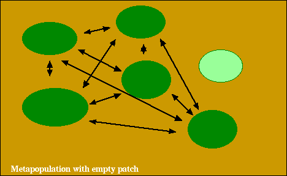

Metapopulation ecology generally focuses on the case where there is *some* dispersal, but not complete **panmyxia**. For our purposes, the island-mainland model is a type of metapopulation model (following Gotelli).  

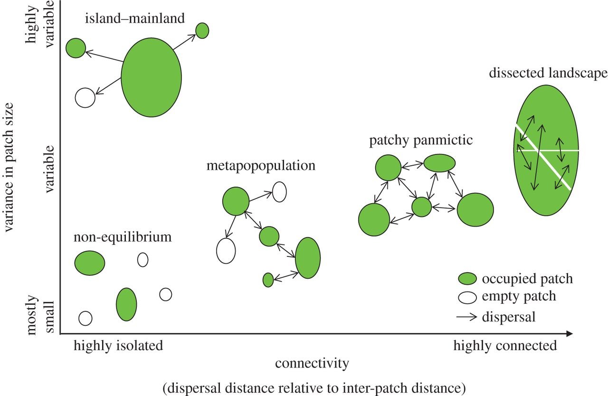

Although the term "metapopulation" is often used to refer to models where we don't care about abundance (we only care about **occupancy**), we can keep track of patch abundance in a metapopulation model if we really want to! In fact, if we want, each patch can contain a stage-structured, density dependent population. Or it can contain an assemblage of individuals, as in an individual-based model. 

We played around with such a metapopulation model in lab!

[Link to metapopulation model with explicit abundance](https://insightmaker.com/insight/74948/Agent-based-metapopulation-model)

Just as we can use metapopulation models to study the probability of **regional extinction**, we can also study **regional abundance** and regional abundance trends. 

**Q**: Is it still a metapopulation if there is no dispersal among patches? 

**Q**: Is it still a metapopulation if there are no local extinctions?


## "Classical" metapopulation

The simplest type of spatially structured population model is the "classical" metapopulation model. 

The metapopulation concept was first introduced by ecologist [Richard Levins](https://en.wikipedia.org/wiki/Richard_Levins) in 1969, and further developed by [Ilkka Hanski](https://en.wikipedia.org/wiki/Ilkka_Hanski).  

In a classical metapopulation, patches are either **occupied** (coded as 1) or not (coded as 0). We are not keeping track of abundance ($N$) any more- we are just keeping track of whether each patch is occupied or not, and how many total occupied patches we have in our metapopulation.   

In a classical metapopulation, we don't think about population dynamics any more -- instead we think only about **metapopulation dynamics**. That is, how the number of occupied patches (or the fraction of patches occupied) changes over time.

**Q**: how does a metapopulation grow?

**Q**: how does a metapopulation shrink?

**colonization** is the process of a patch transitioning from unoccupied to occupied!

**Q**: How can a patch become colonized? The answer is **immigration** of course. That part of the "BIDE" equation that we have been ignoring up until now! 

**extirpation** (or extinction) is the process of a patch transitioning from occupied to unoccupied.

**regional extinction** represents extinction of all populations in the metapopulation. 

More formally, here are some terms we will consider:

$I$ is the total fraction of patches that are colonized by immigrants per time period (colonization rate, or "immigration" rate) 

$E$ is the total fraction of patches that go extinct per time period (extirpation rate)

$f_t$ is the fraction, or proportion, of patches that are occupied at time $t$. This is also known as the **occupancy rate**

Therefore, the change in occupancy can be expressed as:

$\Delta f = I - E$

$p_i$ is the probability of colonization for any given (non-occupied) population.

$p_e$ is the probability of extinction for any given (occupied) population.

Now that we have the basic terms defined, we can build a basic model of metapopulation dynamics! Refer to the [metapopulation lab](LAB6.html) for more details!

### Dynamic stability

In the classical metapopulation model, extinction is not necessarily uncommon. Patches go extinct -- small patches can be highly vulnerable to demographic stochasiticity as we know! -- but as long as patches can get re-colonized, we can reach an equlibrium, where extinctions and colonizations cancel each other out. In a classical metapopulation model, this is a *stable equilibrium*, and a stable metapopulation in which local extinctions are possible ($p_e > 0$) is called **dynamically stable**. That is, any given patch could be extinct at any given time, but on the whole, the metapopulation is stable and not at risk of **regional extinction**!

Really, there is no fundamental difference between the concept of metapopulation stability- in which extinctions and colonizations balance out - and the dynamic stability of a single population at carrying capacity - in which deaths and births balance out! 

### Assumptions of the classical metapopulation model:

- Homogeneous patches (basic model parameters do not vary among patches)
- Time-invarying extinction and colonization rates across time (basic model parameters are constant across time).
- No spatial dependence of extinction and colonization (spatial context, or "neighborhood effects", do not affect $p_e$ and $p_i$).
- No time lags (metapopulation growth responds instantaneously to any changes in $f$, $p_e$ and $p_i$).
- Very large number of patches (even when the fraction of occupied patches is infinitely small, the classical metapopulation still persists!)

#### Variant #1: island-mainland model

Colonization occurs via immigration from a constant external source -- a constant **propagule rain**.

This is the simplest metapopulation model. $p_i$ and $p_e$ are fixed, totally constant.

#### Variant #2: internal colonization

Now, colonization can only happen via immigration from within the metapopulation itself. So when few populations are colonized, colonization is low because of a lack of potential immigrants in the metapopulation. 

$p_i = if$

$i$ represents the strength of internal immigration (how much the probability of colonization increases with each new occupied patch in the metapopulation.

#### Variant #3: rescue effect. 

Now, the extinction rate can be reduced by immigration from other populations in the metapopulation!

$p_e = e(1-f)$

$e$ represents the strength of the rescue effect.

### Spreading the risk!

Let's consider a system in which a species occupies only a single patch, and there is a probability of extinction $p_e$ of 0.15 per year. 

What is the probability of regional extinction after 10 years? The probability of persistence for 1 year is $1-p_e$, so the probability of persistence for 10 years is $(1-p_e)^{10}$ and the probability of regional extinction is $1-((1-p_e)^{10})$

which works out to be about 80%. There is a substantial probability of regional extinction over 10 years!

What if there were two patches instead of just one? 

Let's assume that the patches are **independent** -- that is, the extinction of one patch doesn't influence whether or not the other patch goes extinct!

Regional extirpation therefore depends upon both populations going extinct- which can be computed as $p_e^2$. So the probability of persistence for one year is $1-p_e^2$. The probability of persisting for 10 years is $(1-p_e^2)^{10}$. Finally, the probability of regional extinction is $1-((1-p_e^2)^{10})$. 

Which works out to about 20%. So the chance of regional extirpation is far reduced now!!

This is an example of **spreading the risk**. 

What if there are 5 independent populations instead of two? Then what is the chance of regional extirpation over 10 years?

$(1-p_e^5)^{10}$ 

_This works out to be effectively zero!!!_

**Q**: What if the extinction of one patch was *perfectly correlated* with the extinction of all other patches. If one goes extinct, all go extinct. 


## Sources and sinks!

One important concept related to metapopulations is that of **source-sink dynamics**

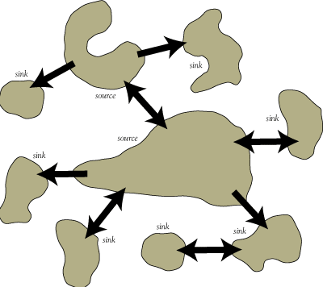

In the real world, patches vary in size and quality. That is, the assumption of homogeneity (inherent to the classical metapopulation framework) is unlikely to be met in most real metapopulations! 

In fact, some patches may be so resource-poor or afford such bad protection from predators that population growth is negative (i.e., $r$ below zero, or $\lambda$ less than 1). Other patches may represent perfect conditions, in which population growth is highly positive, at least at low densities!

A **source population** is defined as a patch that provides a *net donation of immigrants** to nearby patches with poor-quality habitat (sink populations). A source population should persist indefinitely as a solitary, isolated patch. 

A **sink population** is defined as a patch that would go exinct if it were not for the constant input of immigrants from nearby **source populations**.

**Q**: how is the concept of a sink population related to the *rescue effect*?

A **pseudo-sink population** is defined as a patch that is *artifically augmented* by immigrants from nearby source populations. In isolation (in the absence of a nearby source population) a psuedo-sink would not go extinct (a true sink would go extinct!), but would settle down at a much lower equilibrium abundance. 

## In-class exercise: sources and sinks!

In this exercise, we will explore source-sink dynamics!

1. First click on this [link](https://insightmaker.com/insight/75973/Source-Sink-1) and clone a population-based source-sink model in InsightMaker. This model represents four different patches- one source population, and three sink populations. The sink populations are located at various distances from the source population. You can imagine the following spatial configuration:

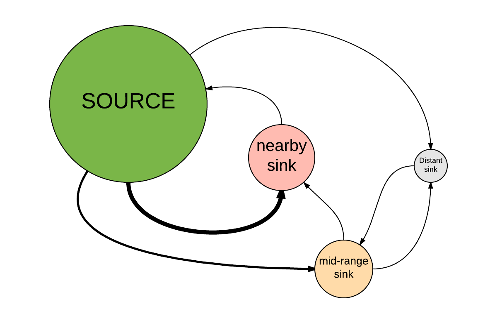


2. Make sure the model parameters are at default values. The default parameters should be:

Initial abundance in source: 100     
Initial abundance in nearby sink: 10     
Initial abundance in mid-range sink: 10     
Initial abundance in distant sink: 10    
Lambda (discrete growth rate) for sink populations: 0.8     
Lambda for source population: 2.1      
Dispersal rate: 10% per year       
K for source population: 100    
K for nearby sink: 50    
K for mid-range sink: 25    
K for distant sink: 15    

3. Run the model, view the results and make sure you understand how the model works.

4. Change the dispersal rate to zero and run the model. What happens? 

NOTE: you will notice that the stochasticity in the model disappears when the metapopulation reaches an equilibrium in this scenario- this is because demographic stochasticity affects the inflows and outflows. When the inflows and outflows are zero, then demographic stochasticity disappears (okay this isn't terribly realistic, but it's just a demo!). 

5. Change the dispersal rate to 0.01 (1%). What happens now? Does the distant sink still function as a sink population? That is, is it occupied continuously? If not, what is the lowest dispersal rate that generally ensures that the distant sink is consistently occupied? 

6. Change the dispersal rate back to 10%. Now change the population growth rate in the source population to 1.1. What happens now? Does the source population still operate as an effective source? What if the growth rate in the source patch was set to 1? 

#### A pseudo-sink!

7. Change the source lambda back to 2.1. Now change the sink lambda to 1.1. Also, change the max dispersal rate to 25%. What is the approximate equilibrium abundance of the distant sink? How does this relate to its carrying capacity? Make a figure (using InsightMaker) that illustrates the abundance of the distant sink vs. carrying capacity. How does this illustrate the concept of a **pseudo-sink**. 

#### An ecological trap!

8. Change all params back to their default values. Now consider the following scenario:

> The nearby sink patch is now extremely attractive to our species- since it contains abundant food resources and what seems like good shelter! However, in this habitat there is also a novel, introduced disease that the species is unable to detect. Therefore, dispersal rates to the sink habitat are very high, but mortality rates are also very high.    

To force a disproportionate number of individuals into the nearby sink, open the equation editor for the flow from the source to the nearby sink. Change the first line to read:

```
disp <- 0.01*[nearby sink] - 0.5*[SOURCE]
```

This will force 50% of the source population to try to move to the sink habitat each year! Those that are in the sink habitat try to stay. 

Also, change the lambda for the nearby sink to 0.25, (meaning 75% of the sink population dies each year due to disease). To do this, replace the [lambda bad] term in the births/deaths flow for the nearby sink to 0.25. Open the equation editor for this flow- after you change, it should look something like this:

```
growth <- [nearby sink]*Ln(0.25)

If [lambda bad]>=1 Then
  growth <- [nearby sink]*Ln(0.25)*(1-([nearby sink]/[K sink1]))
End If

If growth>=0 Then
  RandPoisson(growth+0.0001)
Else
  -1*RandPoisson(-1*growth)
End If
```

**Q**: in what way is the nearby sink now an *ecological trap*?

**Q**: are all sink populations really *ecological traps*?

**Q**: are metapopulations better off without sink populations?

**Q**: in this scenario, a fixed percentage of each population disperses to each other population each year. Is this biologically realistic? Can you think of biologically realistic scenarios that would lead to different dispersal patterns? 

**Q**: what data sources might be helpful in understanding dispersal rates in a metapopulation?

#### Benefits of sink populations!

Sink populations may not always be so bad for conservation! Consider the following scenario:

> A large source population is able to maintain a set of 3 satellite populations, each of which would not persist in the absence of dispersal from the source population. Very occasionally, a catastrophic fire eradicates the source population. However, the source population is then colonized by individuals migrating from the satellite (sink) populations. In the absence of the sink populations, the entire metapopulation would go extinct!

**Q** could it ever be *desirable* to remove a sink population to improve the conservation status of a metapopulation? Under what circumstances? How does this relate to the concept of *density-dependence?


[--go to next lecture--](LECTURE14.html)


<!--chapter:end:LECTURE13.Rmd-->

---
title: "Example: parameterizing a PVA model"
author: "NRES 470/670"
date: "Mar 26, 2017"
output: 
  html_document: 
    theme: spacelab
    toc: yes
    toc_float: yes
---

```{r setup, include=FALSE}
knitr::opts_chunk$set(echo = TRUE, cache = TRUE)
```

# PVA case study- Modeling the recovery of the black-footed ferret in a linked predator-prey-disease system

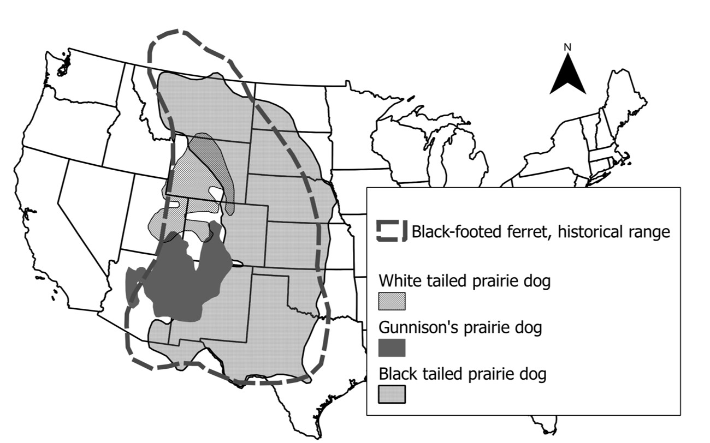

## An obligate predator
- Approximately 90% of the diet of black-footed ferret consists of prairie dogs (obligate predator). 
- Ferrets give birth in prairie dog burrows. 
- The historic range of the black-footed ferret coincides with the three prairie dog species that constitute its prey. 
- *You can’t know what’s going on with BFF populations without knowing what’s going on with prairie dogs.* 


## Ferret facts!

- Extinct in the wild by 1987 
- In 1987, last 18 individuals were removed for captive breeding
- Over 3,500 released into the wild at 19 locations in US, Mexico and Canada (Livieri 2011) 
- Four reintroduction sites considered self-sustaining


## Study site: Conata Basin
- As part of black-footed ferret reintroduction efforts, 150 captive-born ferret kits were released over a 4-year period to prairie dog colonies in Conata Basin beginning in 1996. 


- This effort resulted in a self-sustaining population with an annual total of approximately 200 animals by 2000 (Livieri 2006). 
- Plague-free, rapid establishment of ferrets, _among the most successful ferret reintroduction sites_. 
- Declined dramatically since *sylvatic plague* was detected in 2008, falling from 335 individuals documented in 2007 to only 71 in 2012 (Livieri 2012).
- Plague mitigation efforts have been implemented, including 
    - dusting of prairie dog burrows (insecticide treatment) 
    - experimental vaccination of black-footed ferrets (Abbott and Rocke 2012).

## Prairie dogs in Conata Basin and surrounding region


### Spatial structure of study region 

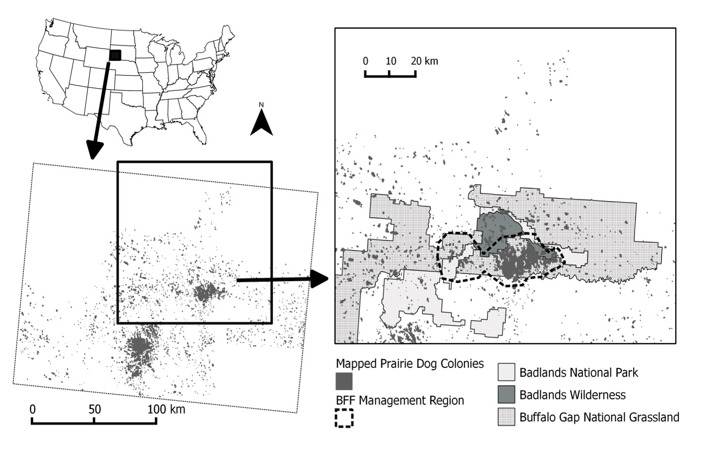

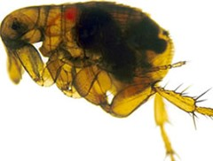

## Sylvatic plague
- Exotic flea borne disease 
- Highly fatal to prairie dogs (and ferrets)
- Continued eastward expansion of plague threatens to undermine ferret recovery efforts
- Plague was first observed at our study site (Conata Basin) in 2008

## A "metamodel"!
- PVA is typically focused on a single species. 
- Species interactions are not typically included explicitly!

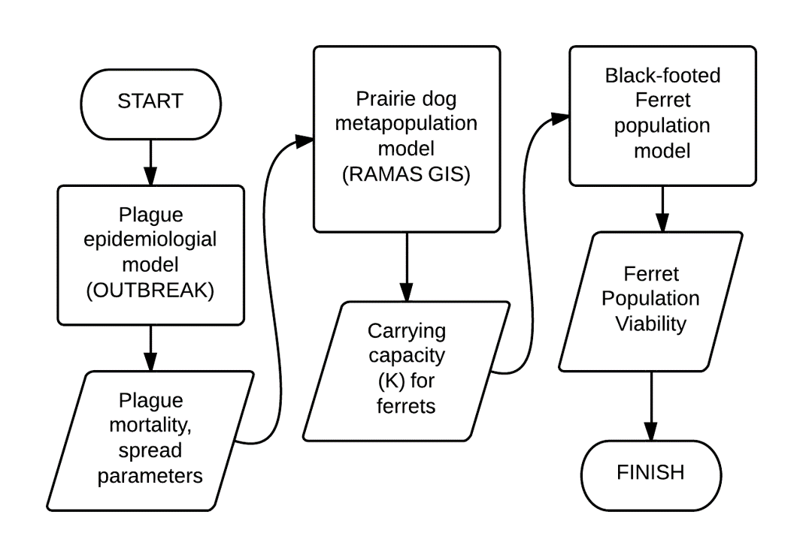

## Prairie dog submodel
- Metapopulation of 1591 colonies
- Wide range of abundance, connectivity among colonies
- RAMAS GIS

This is what the prairie dog model looks like in the absence of plague. Robust population with essentially no risk of prairie dog extinction.

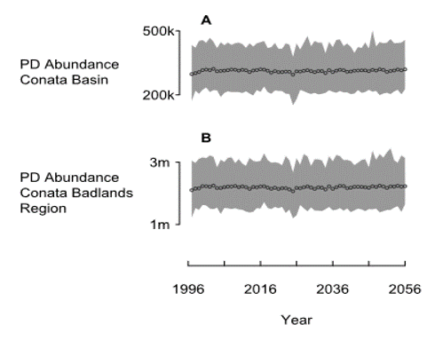

## Ferret submodel

In the absence of plague...

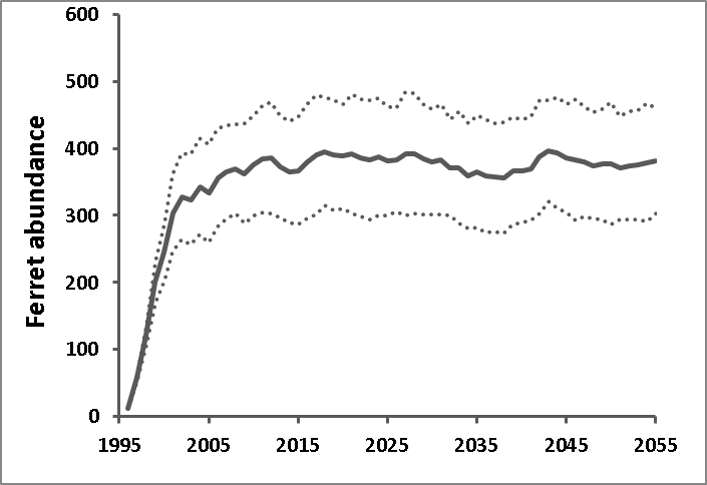

## The linked predator-prey-disease model...

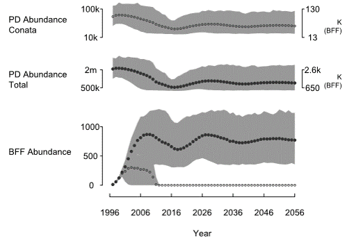

- The prairie dog population declines and settles at a new lower equilibrium. 
- The minimum abundance of Pdogs is around 12k for the Conata Basin, which really is insufficient for supporting ferrets. 
- The ferret population quickly goes extinct if they can only access those Pdog colonies in the Conata Basin area. 
- However, the reintroduced Ferret population in Conata is likely to be sustainable (given the presence of Plague) _if the ferrets can access prey outside the region currently managed for ferrets (Conata basin)_. 

## An emergent property!

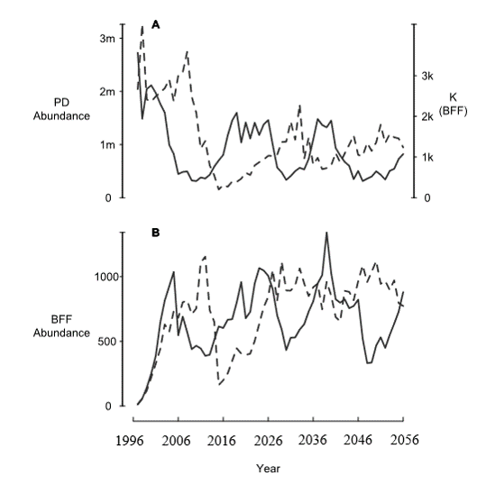

BFF population and PD populations are now cycling due to PD plague dynamics!   

[Link to video of simulation results](https://www.youtube.com/watch?v=4hCBK_JZ-Mg)

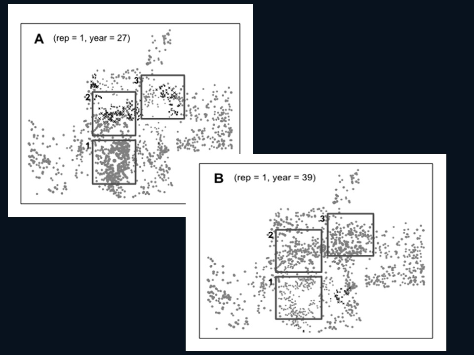

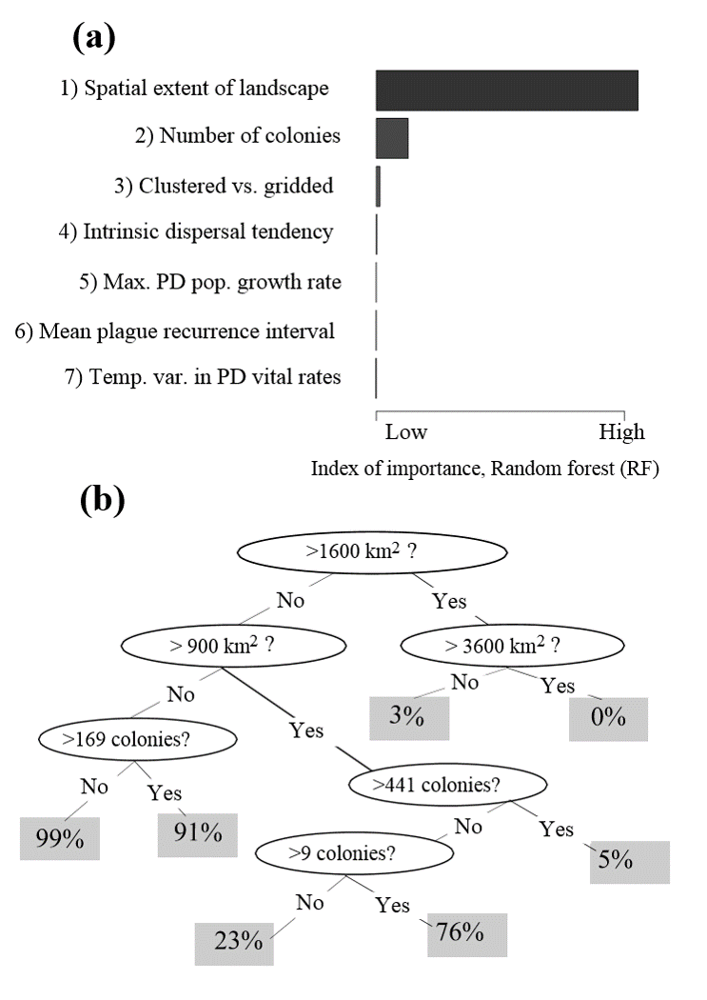

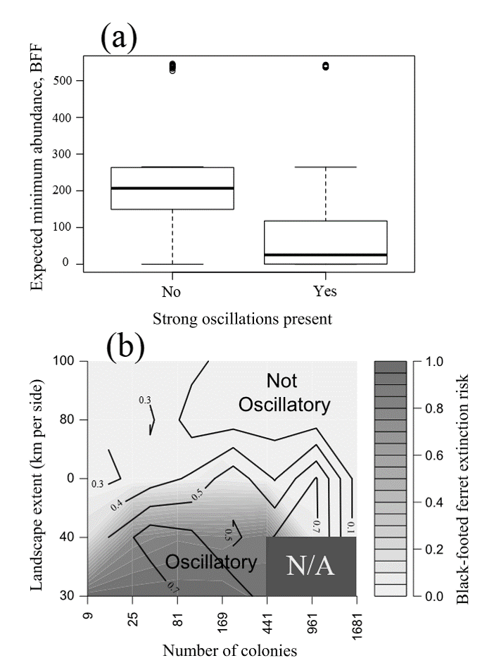

## Conclusions
- Ferrets may require _vast prairie landscapes_ to persist through plague epizootics
- Observed rates of plague spread (or synchronicity of plague outbreaks) may be used to define the spatial scale at which ferrets are likely to persist.

# Detailed parameterization: a metapopulation model of prairie dogs and black-footed ferrets!

Here I will take you through a detailed parameterization of the prairie dog and ferret models (see the paper [here](shoemaker1.pdf)).

This model is more complex than the models you will be doing for your final project, but hopefully it serves as a useful illustration of how you can justify your decisions about how to build and parameterize your models. 


### Spatial structure of study region 


The spatial structure of the metapopulation was based on the distribution of prairie dogs in the *Conata Basin*, a subset of 71 prairie dog populations within the Conata/Badlands region in South Dakota and covering ca. 500 km2 (Fig. 2; delineated based on Biggins et al. 2011) is a portion of the Buffalo Gap National Grasslands directly south of Badlands National Park and is administered by the US Forest Service (Fig. 2). This area was chosen in the early 1990’s for reintroduction of black-footed ferrets due to the extensive network of high-density prairie dog colonies located on public lands (Livieri 2006).

Prairie dog colonies in Conata Basin, Badlands National Park, and Buffalo Gap National Grasslands in southwestern South Dakota, USA (hereafter, Conata/Badlands region) were *mapped biennially by the US Forest Service* from 1996-2009 using differentially corrected Global Positioning Systems (GPS) units to connect the outermost prairie dog burrows into a polygon (Biggins et al. 2006a). 

Prairie dog colonies in the surrounding areas were mapped in 2004 using aerial transects and digital imaging (Sidle et al. 2001, Cooper and Gabriel 2005). We converted prairie dog colony maps to binary (0=non-habitat, 1=habitat) raster maps with 50m cell size. We re-imposed barriers (e.g., roads, pipelines) that were lost in the rasterization process. 

We used the union of all years to define potential habitat. We used neighborhood distance of 1 cell (50m) to define the population structure (see Akçakaya 2002 for details of how RAMAS GIS determines spatial structure). Thus, we assumed each colony is a distinct biological population, which may be connected to other such populations (see section on dispersal below). Excluding very small colonies with carrying capacity (K) <100 (see below), this resulted in 1591 PD populations ranging from about 5 ha to 10,000 ha, with a median size of 16 ha and covering ca. 20,000 km2 (Fig. 3).

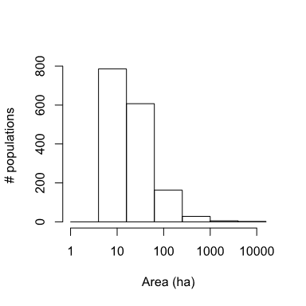
 

### Carrying capacity and density-dependence

Reproduction in prairie dogs is often limited by resources (Hoogland 2001), suggesting a Ricker-type (scramble) density-dependent effect on fecundities. We therefore used this type of density dependence, and estimated the maximum growth rate ($R_{max}$) based on the average of exponential growth rates exhibited by several populations following crashes. Three of these rates were following crashes due to plague: 1.466 (Biggins et al. 2006a, Fig 6.4), 2.024 (Cully and Williams 2001, Fig 4, years 1989-1991) and 3.806 (Cully and Williams 2001, Fig 4, years 1995-1997). We combined these rates with four growth rates following crashes due to other causes, including shooting, toxicants and removal and translocation (Reeve and Vosburgh 2006, Table 10-3, excluding the lowest and highest rates, which were from populations that had not undergone a recent population reduction). The average of these 7 exponential growth rates was 2.44. For sensitivity analysis, we used the quartiles, giving a range of 1.8 to 2.8. These values coincided with an independent estimate based on the intercept of the regression of population growth rate ($R$) on population size ($N$) from the data of Hoogland (1995, Table 16.1), which gave us estimates of 2.4 to 3.7, depending on the type of regression. Given that regression of R on N often overestimates $R_{max}$, this range is consistent with the estimate based on exponential growth phases of the two populations mentioned above.

We assumed each mapped colony (see above) represented a distinct biological population, with carrying capacity (K) defined as a function of colony area and average densities of prairie dogs. At Conata Basin, the average density of prairie dogs prior to the arrival of plague was 28.7/ha (Livieri 2006). Thus, we multiplied the number of cells in each patch with 7.175 (=28.7x0.25) to calculate the carrying capacity of that patch (because under the Ricker-type density dependence we used, average abundance would approximately equal the equilibrium abundance or carrying capacity). Colonies with K<100 were excluded from analysis, to decrease the number of populations and because very small populations do not contribute substantially to population dynamics. We assumed initial abundances were equal to K for each population, and we ran a 10-year burn-in period for all simulations to ensure that all colonies were at equilibrium with their environment and had reached a *stable age distribution* (S.A.D.).

### Demographic structure and vital rates
We developed an age- and sex-structured matrix model for prairie dogs using RAMAS Metapop software (v. 6.0; Akçakaya and Root 2013), with eight female and six male age classes, parameterized using survival rates and fecundities drawn from Hoogland (2001). We parameterized the matrix according to a pre-breeding census. We used survival rates based on Hoogland (2001, Figs. 1a and 2a), and fitted a polynomial regression of survival rate vs. age for each sex to obtain a smooth function of age (Fig. 4). We calculated litter size as 3.1 (from Hoogland 2001, figure 3a). Combining this value with proportion of females breeding (0.43; Hoogland 2001), and survival rate of zero-year olds, we estimated fecundity as 0.418 daughters and 0.379 sons per adult female (age 2+) and 0.209 daughters and 0.189 sons per yearling female (age 1). We assumed polygynous mating system with each male mating with up to 4 females. Because the density dependence function modifies the stage matrix as a function of population size, the model results would be sensitive to the $R_{max}$ value of the density-dependence function, not to the exact vales of survival rates and fecundities. Therefore, the sensitivity to vital rates was modeled through the $R_{max}$ sensitivity (see section on sensitivity analysis, below).  All colonies were initialized at $K$ and at stable age distribution, and all simulations were run with a 10 year burn-in period (to reach approximate equilibrium in the prairie dog metapopulation).

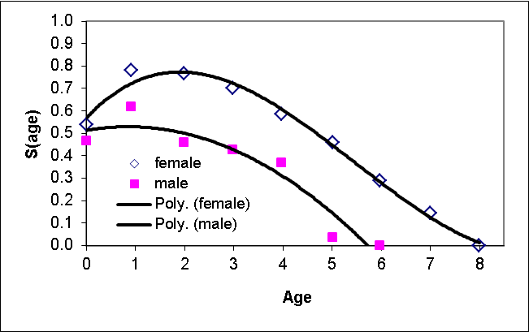 
 
### Variability
The temporal variation in vital rates is based on 14 years of age and sex-specific census data from Hoogland (1995, Table 16.1, page 377). It is important to note that the censused population has fluctuated between 150 and 250 individuals and does not seem to have crashed because of plague or other reasons during the study period (otherwise, adding disease dynamics would overestimate variability). In order to obtain environmental variability, we removed demographic variance from observed variance of survival rates and fecundities, based on expected binomial and Poisson variance (Akçakaya 2002), and calculated coefficients of variation (Table A1-1). For sensitivity analysis, we used minimum and maximum values based on bootstrapping (Table A1-1).


```{r echo=F}
df <- data.frame(
  Vital_Rate = c("Surv","Surv","Fec","Fec"),
  sex = c("F","M","F (daughters)","M (sons)"),
  CV = c(0.111,0.185,0.350, 0.291),
  min_CV = c(0.102,0.136,0.303,0.268),	
  max_CV = c(0.119,0.201,0.376,0.331)
)

df

```


### Plague
We modeled plague dynamics within the prairie dog metapopulation as catastrophes spread by dispersers, with virulence (overall survival) and per-disperser probability of initiating an outbreak  estimated from the Outbreak epidemiological model described below (n = 1000 replicates). We calculated the probability that a disperser initiates a catastrophe in the target population by multiplying the year-averaged probability that an individual (in a population that is experiencing an outbreak) is in disease state E (infected but not yet infectious), with the probability that a single individual in disease state E initiates an plague epizootic that kills at least half of the population.  Specifically, the OUTBREAK model indicated a 9.3% chance of an individual disperser being capable of initiating plague in a new colony (averaged over an entire year, a prairie dog capable of dispersal from an infected colony had a 9.3% chance of being an exposed carrier), and a 97% chance that such a disperer would initiate a catastrophe, resulting in a 9% per-disperser chance of initiating a catastrophe. When a catastrophe does get initiated in a population, the survival rate is determined, according to the Outbreak results, as 2.9% survival (97.1% mortality) in the year that plague is initiated (with no long-term effects). We initiated the plague outbreak in year 11, following a 10-year plague-free period (in turn, following the 10-year burn-in period). reflecting ca. ten plague-free years at Conata Basin following the first ferret introductions (sylvatic plague was first detected in the Conata Basin in May 2008; Abbott and Rocke 2012). Plague was initiated in the prairie dog metapopulation assuming either (1) plague was initiated in a single randomly selected prairie dog population (selected from among mid size or larger populations in the Conata Basin), or (2) plague outbreaks arise spontaneously with a probability of 0.005 per year per colony (effectively resulting in spontaneous plague initiation events somewhere in the metapopulation nearly every other year). Because RAMAS Metapop computes the number of dispersers based on post-plague abundances, we also computed the mean number of infected (exposed) dispersers as a function of the final colony abundance, resulting in an estimate of 118% (SE 28%). Therefore, we set the "probability of infection per disperser" parameter in Ramas Metapop at its maximum value of 100% (thereby potentially underestimating the rate of spread).

### Dispersal
Dispersal rates (proportion of individuals dispersing between each pair of defined populations) were modeled as a function of centre to edge distances between populations, in order to avoid very large populations flooding small populations around them. Dispersing prairie dogs traveled a mean straight-line distance of 2.4 km (Garrett and Franklin 1988). Maximum dispersal distance is 10 km (Knowles 1985 cited in Knowles et al. 2002; Lomolino and Smith 2001). Thus, we used a dispersal-distance function 

$a*e^{\frac{−D}{b}} = 0.083 e^{\frac{−D}{2.4}}$

where D is distance from the centre of the source population to the closest edge of the target population, with a maximum dispersal distance of Dmax = 10 km. We calculated the intercept (the a parameter) as follows. Based on the spatial structure of populations, we calculated the average number of neighbors at distances of 0-0.5 km, 0.5-1 km, 1-2.5 km, 2.5-5 km and 5-10 km. We set the intercept such that the total expected rate of dispersal from this average population was about 0.37, which was calculated as the product of two numbers: (1) 59% of yearling males dispersing from a study population (based on data reported in Tables 1 and 2 in Garrett and Franklin 1988), and (2) relative survival rate of dispersers (calculated as 0.62, based on survival rate of 0.9 and 0.56 of residents and dispersers as reported by Garrett and Franklin 1988). For the spatial sensitivity analysis, we used a range of 0.061 to 0.105 for the a parameter, based on ± 0.10 for the total expected rate of dispersal from the average population.

The above calculation refers to dispersal rate of yearling males. We calculated the relative dispersal of other age/sex classes as 0.46 for yearling females, 0.1 for adult males and 0.39 for adult females (based on data reported in Tables 1 and 2 in Garrett and Franklin 1988). These numbers are consistent with general observations of age- and sex-specific dispersal: Hoogland (1995) reported that female prairie dogs usually remain with their natal coterie, or they disperse long distance to other colonies, but "short-distance dispersal of females within the home colony almost never occurs" (p.383); male prairie dogs, on the other hand, disperse either long-distance to new colonies (mostly as yearlings, rarely as adults) or short-distance within the home colony.

### Spatial correlation
Correlation of population dynamics among populations was based on a function of center-to-center distances between populations. Because annual fluctuations in vital rates are likely a function of weather conditions, we used temporal correlation in weather conditions as a proxy for describing correlation of population fluctuations.  Specifically, spatial autocorrelation in vital rates was modeled as a function of inter-colony distances based on 30 years of summer rainfall data from 15 sites randomly drawn from within the range of the black-tailed prairie dog. We fitted a negative exponential model using 30 years of summer rainfall data drawn from 15 random locations in the southwestern quarter of South Dakota (PRISM dataset; PRISM Climate Group, Oregon State University, http://prism.oregonstate.edu). The resulting equation, correlation= exp(−D/601), where D is the distance between populations, was used for all model runs and was not modified as part of spatial sensitivity analyses (Fig. 5).
 
 
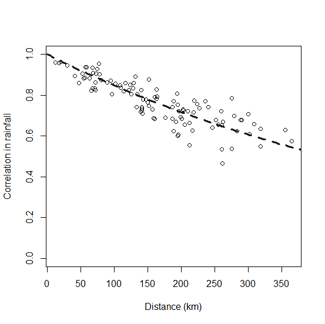

 
## Black-footed Ferret Population Model


### Demographic structure and vital rates

We developed an age- and sex-structured matrix model, with 5 female and 5 male age classes. We parameterized the matrix according to a post-breeding census, with survival rates drawn from a Wyoming mark recapture study (Grenier 2008). Juvenile (first year) and adult (yearling and above) survival rates were set at 0.39 (SE 0.17) and 0.67 (SE 0.15), respectively. For sensitivity analysis, we used a range of 0.22 to 0.56 for juvenile survival rate, and 0.52 to 0.82 for adult survival rate, representing one standard error from the mean. Juvenile and adult fecundity were set at 0.73 and 1.25, respectively, based on observations of kits produced from 2004-2006 (Grenier 2008). For sensitivity analysis, we used a range of 0.36 to 0.92 for juvenile fecundity and 0.86 to 1.35 for adult fecundity.

### Density dependence, carrying capacity, and initial abundances 

The strong dependence of Black-footed Ferrets on Prairie Dogs as prey suggests density dependence based on resource limitation and linked to resource (prey) dynamics. We therefore modeled Black-footed Ferret density dependence with a Ricker-type density dependence, corresponding to a scramble competition model (Brannstrom and Sumpter 2005).

We ran the black-footed ferret population model assuming either (1) ferrets could only access prairie dog colonies within the Conata Basin, or (2) ferrets could access all 1591 prairie dog colonies within the Conata/Badlands region. In the former case, we assumed the ferrets could only access PD colonies within the Conata Basin, a region of approximately 13,000 ha which we delineated as the aggregate of the three ferret subunits identified in Biggins et al. (2011). Thus, although the PD/plague model (see above) covered a larger area of southwestern South Dakota, only those populations in the Conata Basin were linked to the black-footed ferret model. Because ferret populations were rapidly extirpated by plague if limited to the Conata Basin proper, and because the maximum possible spatial extent for black-footed ferret populations is unclear (see main text), we also ran scenarios in which all prairie dog populations in the Conata-Badlands region were assumed to be available to the ferrets as prey.

We calculated the black-footed ferret functional response based on the energy balance model of Stromberg et al. (1983), who concluded (via maximum sustainable yield computations) that a habitat area capable of supporting ca. 766 black-tailed prairie dogs  was necessary to support the minimum energy requirements of a single black-footed ferret. We thereby equate a per-capita prey availability of 766 prairie dogs per ferret with a stable long-term ferret population growth rate (R = 1, corresponding to the carrying capacity in the scramble/Ricker density dependence function in RAMAS Metapop). Thus, carrying capacity (K) of the black-footed ferret population was calculated as 1/766 of the PD population size in Conata Basin at each time step. However, in years of high prairie dog abundance, ferrets typically maintain territories supporting more prairie dogs than they need to survive (Biggins et al. 2006b). In other words, the linear relationship between prairie dog density and black-footed ferret carrying capacity breaks down at high prairie dog densities. We capped the value of K at 462 for the Conata region based on the maximum ferret density of 0.04 ferrets per ha suggested by Biggins et al. (2006b). For global sensitivity analysis, we similarly capped the value of K to maintain a maximum density of 0.04 ferrets per ha (therefore, K varied based on landscape extent). Thus, even in years when prairie dog abundance is very high, the carrying capacity of the simulated ferret population does not exceed the maximum limit dictated by territoriality. 

The energy balance model of Stromberg et al. (1983), upon which we based the functional linkage between ferret carrying capacity and prairie dog abundance (see above), assumed that ferrets fed exclusively on prairie dogs. However, a small but non-negligible component (ca. 10%) of the diet of the black-footed ferret is believed to comprise alternate prey items such as mice and lagomorphs (Campbell et al. 1987). The existence of alternate prey species raises the possibility that our models may overestimate the per-capita prey availability necessary to accommodate stable ferret population growth. However, prairie dogs are consumed by many species aside from the black-footed ferret (including badgers, bobcats, and coyotes; Hoogland 1995), raising the possibility that our model may underestimate the number of prairie dogs necessary to support a population of ferrets. Clearly, there is a great deal of uncertainty around this estimate, and we are planning a follow-up study to test the sensitivity of the ferret/prairie dog system to alternative characterizions of the functional and numerical response. Nonetheless, an estimated ferret carrying capacity of 485 at Conata Basin, computed as 1/766 of estimated total prairie dog carrying capacity, is consistent with the observed growth of the reintroduced ferret population at Conata Basin, which was beginning to plateau at abundances ca. 350 prior to the arrival of plague in 2007 (Livieri 2006; Fig. 6).      
    
    


 
We set the maximum growth rate (Rmax) to 1.48, based on the average of two estimates of the rate of (exponential) growth in a Wyoming population (Grenier et al. 2007). One estimate is 1.35, the eigenvalue of the matrix fitted to mark-recapture data, and the other estimate is 1.60, the (scalar) rate of growth in the minimum number of live ferrets from 2000 to 2006. For sensitivity analysis, we used these two values.

Black-footed ferret abundance for each iteration was initialized using  known reintroduction events in the Conata Basin , as described by Livieri (2006; i.e., dates and ages of releases were modeled explicity).  Ferret population viability was summarized using three metrics: quasi-extinction risk (defined as the proportion of simulation runs falling below 5 individuals at year 60 of the simulation), expected minimum abundance (defined as the minimum abundance after year 10 of the trajectory averaged over all 1000 simulations; McCarthy and Thompson 2001), and mean final abundance (at year 60).

### Variability
We estimated temporal variability in ferret vital rates (i.e., variability not due to fluctuations in the prey base, which was modeled explicitly via variation in K) by running the linked ferret/prairie dog metamodel for Conata basin under plague-free conditions and adjusting the ferret temporal variability parameter  to match the observed annual variability from the re-established ferret population in the Conata Basin (Livieri 2006; Fig. 6). Although most of the variability in black-footed ferret populations is likely due to variation in the prey base (here translated into variation in K), variability in other environmental factors may contribute to variability in black-footed ferret vital rates. To estimate the magnitude of this contribution, we created a retrospective model of the growth of the Conata Basin black-footed ferret population from 1996 (shortly after its introduction) until 2007 (before the first plague outbreak) based on Livieri (2006). We reconstructed the Conata reintroduction effort using RAMAS Metapop, using management events (introduction and harvest) to schedule the history of ferret introductions and translocations described by Livieri (2006). We ran the simulations with demographic stochasticity, vital rates specified as above, and carrying capacity linked to natural temporal variability in plague-free prairie dog population density (see above). Variability in black-footed ferret population growth in the early years of the Conata reintroduction program was likely related to different release strategies and predator exclusion measures (Livieri 2006). Ferret releases largely ended in 1999, and therefore we assumed that population variability observed from 2001 through 2007 (prior to sylvatic plague epizootic) were due primarily to natural variability. Holding all other sources of variability constant (demographic stochasticity and variability in prey abundance), we adjusted the coefficient of variation for environmental variation in black-footed ferret vital rates so that the median simulated population variance (computed as the variance of (Nt+1/Nt), n = 1000 simulations) matched the observed variability in the Conata time series. The CV value that best fit the observed Conata time series (Fig. 6) was 11.5%, and this value was used to compute temporal process variation for all vital rates. For sensitivity analysis, the CV for ferret vital rates varied between 5 and 16%, which was the range of CV values for which the observed variability fell within the interquartile range from the simulations. 


[--go to next lecture--](LECTURE15.html)


<!--chapter:end:LECTURE14.Rmd-->

---
title: "Parameterizing models: estimation!"
author: "NRES 470/670"
date: "Apr 3, 2017"
output: 
  html_document: 
    theme: spacelab
    toc: yes
    toc_float: yes
---

```{r setup, include=FALSE}
knitr::opts_chunk$set(echo = TRUE, cache = TRUE)
```

# Parameter estimation for PVA!

We have now gone through the basic mechanics of population modeling. But we have barely discussed where the parameters come from!

This is the focus of the current lecture!


## Data requirements

### Scalar models
- Abundance (population size)
- Population growth rate 
- Temporal variation in population growth rate (environmentally induced fluctuations among years)
- Maximum rate of population growth
- Carrying capacity of the population (equilibrium abundance)

### Stage-structured (life history) models
- Abundance (population size)
- Vital rates (fecundity, survival, dispersal) 
- Temporal variation in vital rates (environmentally induced fluctuations among years) 
- Dependence of vital rates on density (e.g., how fecundity decreases as population gets more crowded)
- Maximum rate of population growth
- Carrying capacity of the population (equilibrium abundance)

### Metapopulation (spatial) models
- Spatial variation in vital rates (variation in different areas, subpopulations, or habitat patches)
- Dispersal rates among habitat patches
- Habitat requirements of different life stages
- Spatial distributions of suitable habitat, local populations or individuals
- Patterns of occupancy and extinction in habitat patches, or presence-absence data

## Data sources!

### Life tables

As you recall, life tables represent a single cohort that has been followed over time until the last one has died. 

NOTE: in practice, it is nearly impossible to follow a single cohort over time in the wild (although life tables are commonly available for captive populations). Therefore, in practice, most published life tables for wild populations use the **static life table**, which compares population size from multiple different cohorts, across the entire range of ages, at a single point in time. Static tables assume the population has a stable age structure —- that is, the proportion of individuals in each age class does not change from generation to generation,


```{r echo=FALSE}
lifetable <- read.csv("life_table.csv")
```

```{r results='asis', echo=FALSE}
knitr::kable(lifetable,caption="",col.names = c("x","S(x)","b(x)","l(x)","g(x)"))

```

**PROS**
- Summary of survival and fecundity, often available in the literature. Be careful when using data from captive populations!

**CONS**
- Makes unrealistic assumptions (especially the *static life table* method).
- Can not estimate environmental stochasticity
- Can not estimate density dependence
- Ignores **imperfect detection** (assumes perfect detection)
- (remember, it's not always perfectly straightforward to translate into population model- but it can be done!)

### Census data!

Census data is ultimately what we all **wish** we had! It means we follow a population over time, and we know exactly how many individuals of each stage are in the population each year. We have *perfect detection!!!!*

In this case, computing survival and fecundity (and variation in these parameters, and density-dependence) is relatively straightforward!

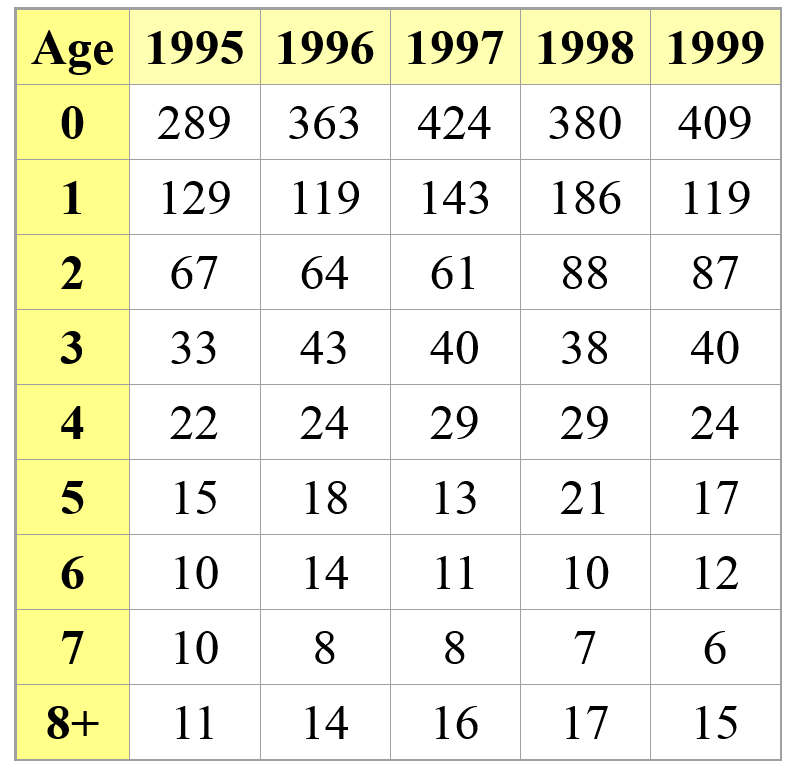

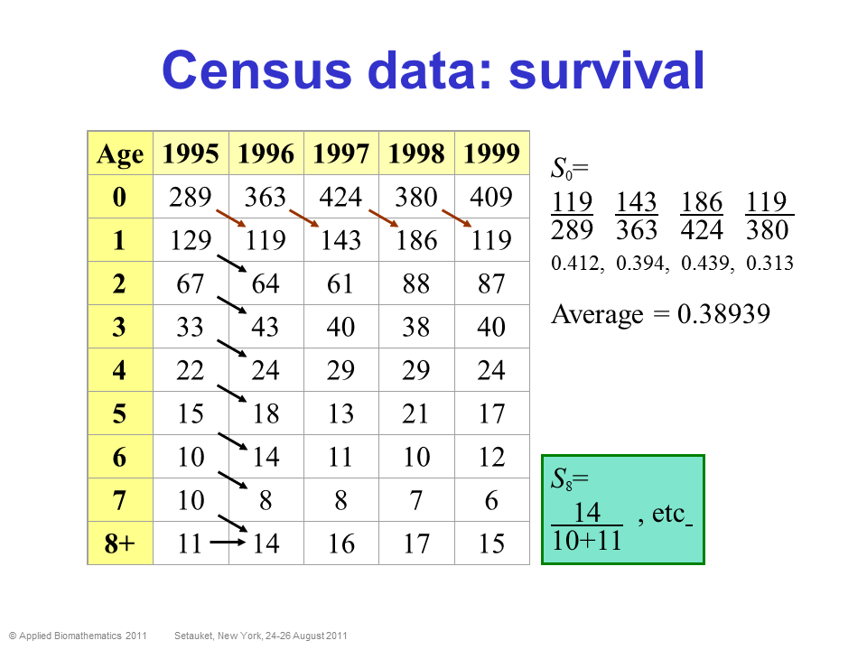

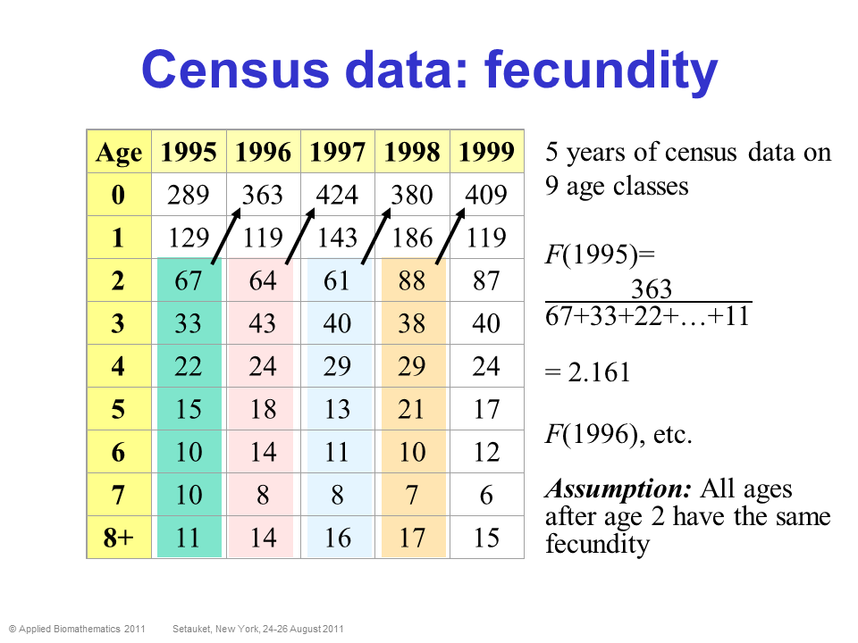

**PROS**
- Can estimate survival and fecundity, env. stochasticity, density dependence- pretty much everything we want!

**CONS**
- Very rarely if ever available!
- Ignores **imperfect detection** (assumes perfect detection), which is probably not realistic.

### Capture-mark-recapture (CMR)

**PROS**
- Can estimate survival, variation in survival, lambda, dispersal rates. 
- Probably the most widely used source of data for population models!


**CONS**
- Few downsides, although the analytical techniques can be difficult to master
- Emigration and survival can be difficult to tease apart

See below for more! Also this is the main focus of the Population Dynamics course (the next course in the wildlife ecology and management sequence!)

### Data on spatial structure/habitat
- See [links](FINAL_PROJECTS.html) on Final projects page

### What if there's "no data"?

Remember the ["Stone Soup" analogy!](https://en.wikipedia.org/wiki/Stone_Soup)

- Use algebra to construct a full life table from available information
    - E.g., we are missing information on hatchling survival. We only know: 
        - Juvenile and adult survival rates 
        - Nesting success
        - Population growth (lambda) is 1.09
        - Now we can solve for hatchling survival!
- Simplify! (Models are always simplified representations of reality)
    - Ignore age structure? (i.e., use scalar model)
    - Ignore density-dependence?
    - Ignore trophic interactions (we usually make this simplification anyway!)
- Conservative strategies!
    - Density-independent is conservative
    - Under uncertainty, use the *worst case*
    - Under decline trends, use the worst case
- Use data from similar species!
   - E.g., tamarin species have similar life histories, so use data on golden lion tamarins to model golden-headed lion tamarins.
- Expert Opinion
    - See below... 
- National Databases
    - See [links](FINAL_PROJECTS.html) on Final projects page
- [Allometries](https://www.astronomyclub.xyz/maternal-effect/does-ecology-have-laws.html)
    - e.g., Fenchel's allometry
    - (also known as "Macroecology")
    
    
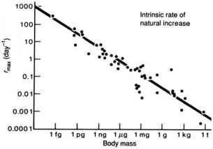

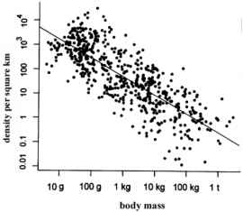

## Aside- is expert opinion okay to use???

- Not ideal, because it is hard or impossible to validate, and hard to document, but …
- That is what will be done in any case!
- And it is better to use it than to do nothing
- And it is better to document that expert opinion was used than to proceed with conservation planning in the absence of stating sources and assumptions
- It is a starting point (and sometimes a good one)


## Capture-mark-recapture (CMR) analysis


### PVA Parameters estimable from CMR data

- Survival rate
- Birth rate
- Abundance
- Lambda (rate of growth)
- Environmental effects on survival rate and fecundity
- Temporal process variance

### The data needed for CMR analysis: capture histories

Consider a project designed to monitor a population of alligators. These alligators were monitored for four years, from 1976 to 1979. 

Each row in the following table represents a unique possible history of captures:

A "1" indicates that an animal was successfully captured in a given year, and subsequently released. 

A "0" indicates that an animal was not successfully captured in a given year.

A "2" indicates that an animal was successfully captured in a given year but was not released back into the population.

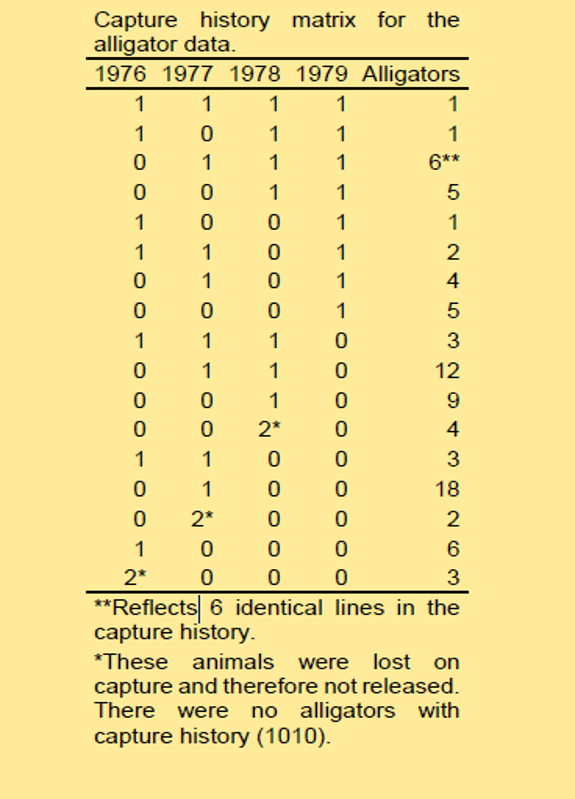

### Two main types of CMR analyses

#### Closed population models
We assume that the population is closed to BIDE processes. That is, abundance does not change!
We attempt to estimate abundance!

- No mortality
- No births
- No immigration
- No emigration
- All individuals are observable

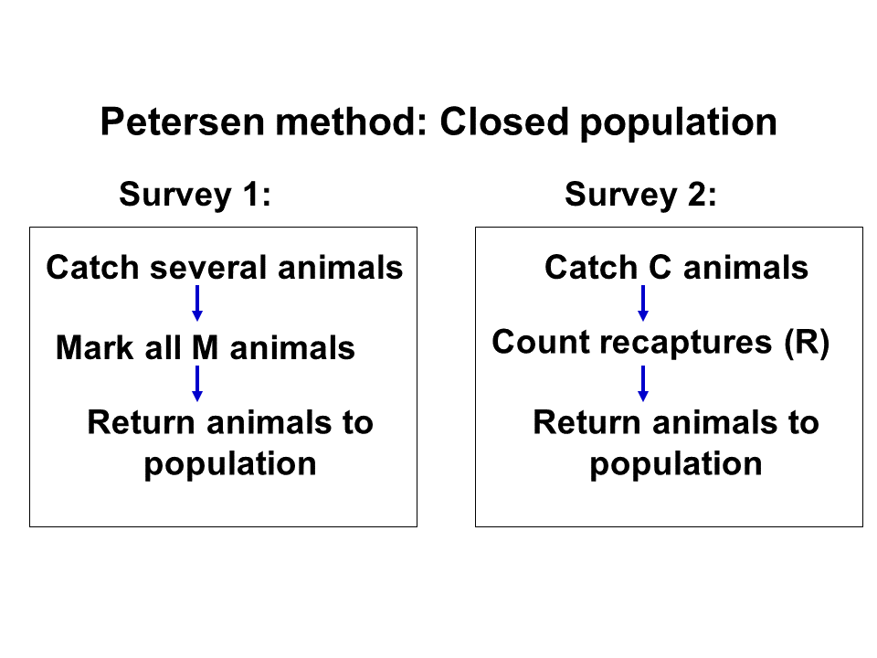

Parameters estimated:

- Abundance
- Capture probability 

M = the number of individuals marked in the first sample   
C = total number of individuals captured in 2nd sample   
R = number of individuals in 2nd sample that are marked   

We can use the following formula to estimate abundance (the **lincoln-peterson estimator**): 

$N = \frac{C*M}{R}$


#### Open population models
We assume that the population is open to one or more of the BIDE processes. That is, abundance CAN change! 
We attempt to estimate the processes driving abundance change (often, survival rates)

- Populations open to birth, death, and migration (abundance can change during the study).
- Enables estimation of the drivers of population dynamics over extended time periods 
- Often of great interest to ecologists and managers.


### Maximum likelihood: a framework for statistical inference!

**IN GENERAL**:
- Given an underlying *data-generating model*, what values of the model **parameters** maximize the probability of producing the observed data?
- To find the maximum likelihood estimate (MLE) for an unknown **parameter** we usually take a starting value (e.g. survival=25%), and keep trying new values until the likelihood function is maximized (numerical optimization).

**FOR CMR ANALYSIS**:
- What value of survival maximizes the probability of generating the observed capture histories?

EXAMPLE:

Consider the following capture history for a single individual: 

```
1 0 1 1
```

This individual was marked and released upon initial capture. It was not captured in the next survey, but then was captured in each of the next two subsequent surveys.  

What is the probability of observing this capture history?

> [(Probability of surviving from time 1 to 2) X (Probability of not being seen at time 2)] X [(Probability of surviving from time 2 to 3) X (Probability of being seen at time 3)] X [(Probability of surviving from time 3 to 4) X (Probability of being seen at time 4)]

This can be written:

$L_1 = \phi_1(1-p_2) \cdot \phi_2p_3 \cdot \phi_3p_4$


How about the following capture history for a single individual: 

```
1 0 1 0
```

This individual was marked and released upon initial capture. It was then captured in the next survey, but was not detected in either of the final two surveys.  

What is the probability of observing this capture history?

> [(Probability of surviving from time 1 to 2) X (Probability of not being seen at time 2)] X [(Probability of surviving from time 2 to 3) X (Probability of being seen at time 3)] X

-- either -- 

>  [(Probability of surviving from time 3 to 4) X (Probability of not being seen at time 4)]

-- or --

>  [(Probability of NOT surviving from time 3 to 4) 

This can be written:

$L_1 = \phi_1(1-p_2) \cdot \phi_2p_3 \cdot \left \{(1-\phi_3)+\phi_3(1-p_4)  \right \}$

**Q**: if survival were 100% and capture probability were 100%, what is the probability of observing the above capture histories?

**Q**: what about if survival were 100% and capture probability were 75%? 

Maximum likelihood estimation is the process of finding those values of the parameters $\phi$ and $p$ that would be most *likely* to generate the observed capture histories!

This model is known as the *Cormack-Jolly-Seber* model (CJS), and is the basic analysis performed by Program MARK. 


**Q**: Why is $\phi$ also known as "apparent" survival? Why is it not "true" survival???

#### Assumptions of the CJS model

- All animals in population equally catchable at each sampling occasion (each sampling bout is a random sample from the population)
- All animals have same survival probability at each sampling occasion ($\phi_t$)
- Marks are not lost or missed by surveyors
- All emigration is permanent (equivalent to a mortality)

### Program MARK

MARK is a numerical maximum-likelihood engine designed for mark-recapture analysis. You input a capture history dataset and MARK will output results such as survival rate and capture probability!! 


## Example of an open-population mark-recapture analysis!


The European dipper data is THE classic example of a CMR dataset. Let's look at it!


```{r}
library(mra)
data("dipper.data")
head(dipper.data,10)

```


Here we use the "mra" package in R to do the ML parameter estimation!

```{r}
data(dipper.histories)
ct <- as.factor( paste("T",1:ncol(dipper.histories), sep=""))
attr(ct,"nan")<-nrow(dipper.histories)
dipper.cjs <- F.cjs.estim( ~tvar(ct,drop=c(1,2)), ~tvar(ct,drop=c(1,6,7)), dipper.histories )
cat("survival estimates!\n")
dipper.cjs$s.hat[1,] 

cat("\n\n detection probability estimates!\n")
dipper.cjs$p.hat[1,] 
```

What is our estimate for mean survival?

```{r}
mean(dipper.cjs$s.hat[1,],na.rm=T)
```

What is the environmental stochasticity?

```{r}
sd(dipper.cjs$s.hat[1,],na.rm=T)
```

### Program MARK!

MARK is free software, and can be downloaded from [here](http://warnercnr.colostate.edu/~gwhite/mark/mark.htm)


[--go to next lecture--](LECTURE16.html)


<!--chapter:end:LECTURE15.Rmd-->

---
title: "Species interactions: competition!"
author: "NRES 470/670"
date: "Apr 13, 2017"
output: 
  html_document: 
    theme: spacelab
    toc: yes
    toc_float: yes
---

```{r setup, include=FALSE}
knitr::opts_chunk$set(echo = TRUE, cache = TRUE)
```

## Species interactions

PVA, as you may recall, tends to be very single-species focused. 

BUT population ecology doesn't have to be single-species focused. There are many cases where we would do well to think about species interactions specifically.

From a modeling standpoint, this is where things really get interesting! That is, with species interactions, we really start to see some unexpected emergent properties!

## Competition

### What is competition?

Competition is defined a type of inter-species interaction by which the *population vital rates of each species is negatively influenced by the presence of the other*. 

There is not much essential difference between within-species competition and among-species competition for resources!

#### Exploitation
This is the kind of competition we probably think about first- all individuals are competing for resources and all have similar competitive abilities. It's a free-for-all: everyone gets some piece of a limited pie!  

Competition for resources within species is often the mechanism behind the density-dependent processes that we have already discussed in detail! Within species, this is often called "*scramble competition*". 

#### Interference
Sometimes the negative effect of one actor (individual of the same or another species) on another actor is due to direct behavioral exclusion. This is the case with birds that maintain territories and keep other birds off the territory. 

Some plants engage in interference competition in a process called "allelopathy".


### Modeling competition: extending the logistic growth equations to more than one species!

If *intra-species competition* and *inter-species competition* are essentially the same, maybe we can model these processes the same!!

1. Recall the logistic growth equation!

$\Delta N = r\cdot N_t \cdot (1-\frac{N}{K})$

2. Now consider the case where we have two species that experience logistic growth:

Species 1: $\Delta N1 = r\cdot N1_t \cdot (1-\frac{N1}{K1})$      

Species 2: $\Delta N2 = r\cdot N2_t \cdot (1-\frac{N2}{K2})$

3. Now imagine that population growth for each species is further depressed by the presence of the other! We can envision a scenario where (e.g.,) the presence of one species helps to *fill up* the carrying capacity for the other species, and vice versa!

Species 1: $\Delta N1 = r\cdot N1_t \cdot (1-\frac{N1+\alpha N2}{K1})$      

Species 2: $\Delta N2 = r\cdot N2_t \cdot (1-\frac{N2+\beta N1}{K2})$

The constants $\alpha$ and $\beta$ are measures of the effect of one species on the growth of the other species. 

**Q**: what does it mean if $\alpha$ is equal to 1?

**Q**: what does it mean if $\alpha$ is equal to 5?

**Q**: what does it mean if $\alpha$ is equal to $\frac{1}{5}$?

**Q**: what does it mean if $\alpha$ is equal to zero?

### Let's explore this model in InsightMaker!

**Step 1**: clone a basic (non-interacting) two-species model [here](https://insightmaker.com/insight/77729/Base-2-species-model). Try some different parameter settings, to make sure the model is doing what you expect!

**Step 2**: Now add the "alpha" and "beta" terms to represent the degree to which species 1 competes with species 2, and vice versa. Put slider bars on these parameters, with bounds of 0 to 10.  *What should "alpha" and "beta" link to??*

**NOTE** I ran into some strange error where the term "alpha" means something to InsightMaker, and so naming a variable "alpha" generated an error. Took me like an hour to figure this out. So maybe name it "Alpha1" instead...

**Step 3**: Change the parameter values around and see how the model behaves. 

This model is known as *Lotka-Volterra competition*! The model is named after mathematicians Alfred Lotka and Vito Volterra 

**Q**: what happens if one species is a superior competitor? Can one species go extinct?

**Q**: what conditions are necessary for coexistence in this model?

**Q**: what if you change the time step? Less than 1? Greater than 1?

**Q**: can you identify any equilibria?


## Phase plane!

In the study of dynamic systems (such as the lotka-volterra competition system) it can be very useful to visualize the system on the **phase plane**.

To do this, we first envision the abundance of each interacting species as a dimension, forming a 2-D surface (phase plane). 

Then, each time step in the model, we plot out where we are in the phase plane. 

For example:

Let's build the basic lotka-volterra competion model in R. 

```{r}
##### LOTKA VOLTERRA COMPETITION EXAMPLE

## Params

Alpha <- 1.1
Beta <- 0.5
InitN1 <- 100
InitN2 <- 300
K1 <- 1000
K2 <- 450
Rmax1 <- 0.05
Rmax2 <- 0.3
Nyears <- 1000

System <- data.frame(n1 = rep(InitN1,(Nyears+1)),n2 = InitN2)

doYear <- function(prevyear){
  n1 <- prevyear[1] + prevyear[1] * Rmax1 * (1-((prevyear[1]+Alpha*prevyear[2])/(K1)))
  n2 <- prevyear[2] + prevyear[2] * Rmax2 * (1-((prevyear[2]+Beta*prevyear[1])/(K2)))
  return(c(n1,n2))
}

## Do simulation
for(i in 1:(Nyears+1)){
  System[1+i,] <- doYear(System[i,])
}


```


Now let's visualize year zero in *phase space*:

```{r}
plot(1,1,pch="",ylim=c(0,K2*1.5),xlim=c(0,K1*1.5),xlab="species 1",ylab="species 2")
points(System[1,],col="green",pch=20,cex=2)

```


How about the first 5 years...

```{r}
plot(1,1,pch="",ylim=c(0,K2*1.5),xlim=c(0,K1*1.5),xlab="species 1",ylab="species 2")
points(System[1:6,],col="green",pch=20,cex=2)

```

And the entire simulation?

```{r}
plot(1,1,pch="",ylim=c(0,K2*1.5),xlim=c(0,K1*1.5),xlab="species 1",ylab="species 2")
points(System,col="green",pch=20,cex=2)
```


Okay, so species 1 is outcompeting species 2. As abundance of species 1 goes up, the abundance of species 2 declines, and we end up with just species 1! 


Here is another example...

```{r}
##### LOTKA VOLTERRA COMPETITION EXAMPLE

## Params

Alpha <- 0.3
Beta <- 0.2
InitN1 <- 100
InitN2 <- 300
K1 <- 1000
K2 <- 450
Rmax1 <- 0.05
Rmax2 <- 0.3
Nyears <- 1000

System <- data.frame(n1 = rep(InitN1,(Nyears+1)),n2 = InitN2)

doYear <- function(prevyear){
  n1 <- prevyear[1] + prevyear[1] * Rmax1 * (1-((prevyear[1]+Alpha*prevyear[2])/(K1)))
  n2 <- prevyear[2] + prevyear[2] * Rmax2 * (1-((prevyear[2]+Beta*prevyear[1])/(K2)))
  return(c(n1,n2))
}

## Do simulation
for(i in 1:(Nyears+1)){
  System[1+i,] <- doYear(System[i,])
}


```


With these new parameters, phase space looks like this (with jittering to indicate concentration of points:

```{r}
plot(1,1,pch="",ylim=c(0,K2*1.5),xlim=c(0,K1*1.5),xlab="species 1",ylab="species 2")
points(jitter(System[,1],500),jitter(System[,2],500),col="brown",pch=20,cex=0.3)
abline(h=K2,v=K1,col="gray",lwd=2,lty=2)
```

You can see that this sytem has arrived at an equilibrium at the end, just below the carrying capacity for species 1. 

Finally, let's consider multiple starting points and see how the system behaves!

```{r}
##### LOTKA VOLTERRA COMPETITION EXAMPLE

## Params


InitN1 <- 1200
InitN2 <- 25
System1 <- data.frame(n1 = rep(InitN1,(Nyears+1)),n2 = InitN2)
## Do simulation
for(i in 1:(Nyears+1)){
  System1[1+i,] <- doYear(System1[i,])
}

InitN1 <- 500
InitN2 <- 100
System2 <- data.frame(n1 = rep(InitN1,(Nyears+1)),n2 = InitN2)
## Do simulation
for(i in 1:(Nyears+1)){
  System2[1+i,] <- doYear(System2[i,])
}


InitN1 <- 800
InitN2 <- 600
System3 <- data.frame(n1 = rep(InitN1,(Nyears+1)),n2 = InitN2)
## Do simulation
for(i in 1:(Nyears+1)){
  System3[1+i,] <- doYear(System3[i,])
}


```


Now, phase space looks like this (with jittering to indicate concentration of points:

```{r}
plot(1,1,pch="",ylim=c(0,K2*1.5),xlim=c(0,K1*1.5),xlab="species 1",ylab="species 2")
points(jitter(System[,1],500),jitter(System[,2],500),col="brown",pch=20,cex=0.3)
points(jitter(System1[,1],500),jitter(System1[,2],500),col="green",pch=20,cex=0.3)
points(jitter(System2[,1],500),jitter(System2[,2],500),col="red",pch=20,cex=0.3)
points(jitter(System3[,1],500),jitter(System3[,2],500),col="blue",pch=20,cex=0.3)
abline(h=K2,v=K1,col="gray",lwd=2,lty=2)
```

**Q**: Does this two-species system have a stable equilibrium?


```{r echo=FALSE}

## Paul Hurtado code

## Shiny version was based on code from the following page, sourced 20 July 2016. 
## http://grrrraphics.blogspot.com/2013/01/shiny-desolve-and-ggplot-play-nicely.html

#library(shiny)
library(deSolve) 

#######################################################################################
## Functions for pplane actions.

# Modified from the original script pplane.r written by Daniel Kaplan,
# Dept. of Mathematics, Macalester College, kaplan@macalester.edu 

# Modifications by S. Ellner for use in connection with the textbook
# Dynamic Models in Biology by S.P. Ellner and J. Guckenheimer,
# Princeton University Press (2006)  

# Early modifications of SPE's code by Paul Hurtado:
#   * Removed noisy phase arrow placement
#   * Changed the colors of some of the curves
#   * Relace odesolve package dependency with updated package deSolve.
#
# Later modifications by Paul Hurtado:
#   * Overhaul as a shiny app: http://shiny.rstudio.com/gallery/widget-gallery.html 
#      + Modified functions so that all use input functions of the form: fun(x,y,parms)
#
# Missing Features (TTD):
#
#   * A mechanism to "reset" following an equation or parameter change, 
#     that erases all fixed points, S/U manifolds of saddles, trajectories, etc.
#
#   * Better time step size and integration length controls.
#
#   * Allow user defined labels and colors...  E.g. default colors should 
#     match colors from the matlab version of pplane (personal preference!) 
#
#   * Legend on GUI for fixed point symbols (saddle, source, node, etc.)
#
#   * Do these revised functions work as "command line" tools like SPE's version? 
#     If not, go back and implement wrappers so we can have a unified package!
#      + Ultimately, aim for a shiny/GUI version and command line version.
#      + Once that exists, write documentation, put it all in an R package.
#
#   Inspired by pplane (for Matlab) at http://math.rice.edu/~dfield/
#

##########################################################################################
## These functions assume a function of the form 
##    fun <- function(x,y,p) { with(as.list(p), { c(dx,dy) } ) }
## When we need to use fun with deSolve::ode() we must first convert it via this function:
as.ode.func = function(FUN) { return(function(t,y,parms){list(FUN(y[1],y[2],parms))}) }


##########################################################################################
## Functions for drawing 2D state space / vector field / phase plane plots
## Documentation will be coming soon!! :-)

## Split this into phasearrows.calc() and phasearrows.draw() 
phasearrows <- compiler::cmpfun(function(fun,xlims,ylims,resol=25, col='black', add=F,parms=NULL) {
  if (add==F) {
    plot(1,xlim=xlims, ylim=ylims, type='n',xlab="x",ylab="y");
  }
  x <- matrix(seq(xlims[1],xlims[2], length=resol), byrow=T, resol,resol);
  y <- matrix(seq(ylims[1],ylims[2], length=resol),byrow=F, resol, resol);
  npts <- resol*resol;
  # Removed by PJH so drawing phase arrows twice doesn't change the figure...
  #  xspace <- abs(diff(xlims))/(resol*10);
  #  yspace <- abs(diff(ylims))/(resol*10);
  #  x <- x + matrix(runif(npts, -xspace, xspace),resol,resol);
  #  y <- y + matrix(runif(npts, -yspace, yspace),resol,resol);
  z <- fun(x,y,parms);
  z1 <- matrix(z[1:npts], resol, resol);
  z2 <- matrix(z[(npts+1):(2*npts)], resol, resol);
  maxx <- max(abs(z1));
  maxy <- max(abs(z2));
  dt <- min( abs(diff(xlims))/maxx, abs(diff(ylims))/maxy)/resol;
  lens <- sqrt(z1^2 + z2^2);
  lens2 <- lens/max(lens); ## Can this next line be more robust? Change .1 to ???
  arrows(c(x), c(y), c(x+dt*z1/((lens2)+.1)), c(y+dt*z2/((lens2)+.1)),length=.04, col=col);
})

vec.data<<-list()
phasearrows.calc <- compiler::cmpfun(function(fun,xlims,ylims,resol=25,parms=NULL) {
  #if (add==F) { 
  #  plot(1,xlim=xlims, ylim=ylims, type='n',xlab="x",ylab="y");
  #}
  x <- matrix(seq(xlims[1],xlims[2], length=resol), byrow=T, resol,resol);
  y <- matrix(seq(ylims[1],ylims[2], length=resol),byrow=F, resol, resol);
  npts <- resol*resol;
  z <- fun(x,y,parms);
  z1 <- matrix(z[1:npts], resol, resol);
  z2 <- matrix(z[(npts+1):(2*npts)], resol, resol);
  maxx <- max(abs(z1));
  maxy <- max(abs(z2));
  dx <- min( abs(diff(xlims))/maxx, abs(diff(ylims))/maxy)/resol;
  lens <- sqrt(z1^2 + z2^2);
  lens2 <- lens/max(lens); 
  return(list(x,y,z1,z2,lens2,dx)) # save as vec.data
})

phasearrows.draw <- compiler::cmpfun(function(vfdat=vec.data, col="black") {
  x <- vfdat[[1]]
  y <- vfdat[[2]]
  z1<- vfdat[[3]]
  z2<- vfdat[[4]]
  lens2<- vfdat[[5]]
  dx <- vfdat[[6]]
  ## Can this next line be more robust? Change .1 to 1e-6? Change 0.04 to ???
  arrows(c(x), c(y), c(x+dx*z1/((lens2)+.1)), c(y+dx*z2/((lens2)+.1)),length=.04, col=col);
})


## REMOVE THIS OR NOT???
showcontours <- compiler::cmpfun(function(fun,xlims, ylims,resol=250,add=F, colors=c('red', 'blue'),parms=NULL) {
  x <- matrix(seq(xlims[1],xlims[2], length=resol), byrow=F, resol,resol);
  y <- matrix(seq(ylims[1],ylims[2], length=resol),byrow=T, resol, resol);
  npts = resol*resol;
  z <- fun(x,y,parms);
  z1 <- matrix(z[1:npts], resol, resol);
  z2 <- matrix(z[(npts+1):(2*npts)], resol, resol);
  contour(x[,1],y[1,],z1, add=add, col=colors[1]);
  contour(x[,1],y[1,],z2, add=T, col=colors[2]); 
})

##  Split into nullclines.calc() and nullclines.draw()
nullclines <- compiler::cmpfun(function(fun,xlims, ylims, resol=250, add=F,parms=NULL) {
  x <- matrix(seq(xlims[1],xlims[2], length=resol), byrow=F, resol,resol);
  y <- matrix(seq(ylims[1],ylims[2], length=resol),byrow=T, resol, resol);
  npts = resol*resol;
  z <- fun(x,y,parms);
  z1 <- matrix(z[1:npts], resol, resol);
  z2 <- matrix(z[(npts+1):(2*npts)], resol, resol);
  contour(x[,1],y[1,],z1,levels=c(0), drawlabels=F,add=add, col="orange");
  contour(x[,1],y[1,],z2,levels=c(0), drawlabels=F,add=T, col="magenta"); 
  title(main="Orange = x nullcline, Magenta = y nullcline",cex=0.35); 
})

nullclines.data <- list()
nullclines.calc <- compiler::cmpfun(function(fun,xlims,ylims,resol=250,parms=NULL) {
  x <- matrix(seq(xlims[1],xlims[2], length=resol), byrow=F, resol,resol);
  y <- matrix(seq(ylims[1],ylims[2], length=resol),byrow=T, resol, resol);
  npts = resol*resol;
  z <- fun(x,y,parms);
  z1 <- matrix(z[1:npts], resol, resol);
  z2 <- matrix(z[(npts+1):(2*npts)], resol, resol);
  return(list(x,y,z1,z2)) # return nullclines.data
})

nullclines.draw <- compiler::cmpfun(function(ndat=nullclines.data,add=T){
  x <- ndat[[1]]
  y <- ndat[[2]]
  z1<- ndat[[3]]
  z2<- ndat[[4]]
  contour(x[,1],y[1,],z1,levels=c(0), drawlabels=F,add=add, col="orange");
  contour(x[,1],y[1,],z2,levels=c(0), drawlabels=F,add=T, col="magenta"); 
  #title(main="Orange = x nullcline, Magenta = y nullcline",cex=0.35); 
})

## We need something like an array or list for each trajectory, that we can add to.
## BETA VERSION: Don't track time. Add that in later once it all works?
##
## 1. Structure to save curves: traj.data   
traj.data=list() # each element will be an Mx3 matrix like cbind(time,x,y)
## 2. Function to plot them all. Allow ability to pass args to ode() via ...
traj.draw = function(tdat=traj.data,col="blue",lwd=2) {
  #print(unlist(tdat[[1]]))
  for(i in 1:length(tdat)) { 
    lines(tdat[[i]][,2:3], lwd=lwd, col=col)}
}

## 3. grid.calc()    
grid.calc <- compiler::cmpfun(function(fun,xlim,ylim,parms,ngrid,maxtime=50) {
  xvals=seq(xlim[1],xlim[2],length=ngrid); 
  yvals=seq(ylim[1],ylim[2],length=ngrid); 
  ts <- list()
  for(i in 1:ngrid) {
    for(j in 1:ngrid) {
      out1=ode(times=  seq(0,maxtime,length=500),y=c(xvals[i],yvals[j]),func=as.ode.func(fun),parms=parms); 
      out2=ode(times= -seq(0,maxtime,length=500),y=c(xvals[i],yvals[j]),func=as.ode.func(fun),parms=parms); 
      ts[[length(ts)+1]] <- rbind(out2[nrow(out2):2 , ],out1)
    }}
  return(ts)
})

## 4. traj.forward() and traj.backward()    
traj.forward  = compiler::cmpfun(function(x0,fun,parms,maxtime,Tlen=500,...){
  out=ode(times=seq(0,maxtime,length=Tlen),y=c(x0[1],x0[2]),func=as.ode.func(fun),parms=parms,...); 
  return(out);
})

traj.backward = compiler::cmpfun(function(x0,fun,parms,maxtime,Tlen=500,...){
  out=ode(times=seq(0,-maxtime,length=Tlen),y=c(x0[1],x0[2]),func=as.ode.func(fun),parms=parms,...); 
  return(out[nrow(out):1,]);
})

## 5. traj.continue()
traj.continue <- compiler::cmpfun(function(fun, parms, tdat, maxtime, Tlen=500, backward=FALSE, ...){
  if(length(tdat)==0) { cat("WARNING: No trajectories have been calculate yet!\n")}
  out.curr <- tdat[[length(tdat)]]
  if(backward) {
    X0=head(out.curr,1); 
    t0=X0[1];
    x0=X0[-1];
    times=t0+seq(0,-maxtime,length=Tlen); 
    out=ode(times=times,y=x0,func=as.ode.func(fun),parms=parms,...); 
    return(rbind(out[nrow(out):2,],out.curr));
  } else {
    X0=tail(out.curr,1); 
    t0=X0[1]
    x0=X0[-1]
    times=t0+seq(0,maxtime,length=Tlen); 
    out=ode(times=times,y=x0,func=as.ode.func(fun),parms=parms,...); 
    return(rbind(out.curr,out[-1,]));
  }
})

## original grid() function
grid=compiler::cmpfun(function(fun,xlim,ylim,parms,ngrid,maxtime=50,Tlen=500,add=F,color="blue") {
  if (add==F) {
    plot(1,xlim=xlim, ylim=ylim, type='n',xlab="x",ylab="y");
  }
  xvals=seq(xlim[1],xlim[2],length=ngrid); 
  yvals=seq(ylim[1],ylim[2],length=ngrid); 
  for(i in 1:ngrid) {
    for(j in 1:ngrid) {
      out=ode(times=seq(0,maxtime,length=Tlen),y=c(xvals[i],yvals[j]),func=as.ode.func(fun),parms=parms); 
      points(out[,2],out[,3],type="l",lwd=2,col=color);
      out=ode(times=-seq(0,maxtime,length=Tlen),y=c(xvals[i],yvals[j]),func=as.ode.func(fun),parms=parms); 
      points(out[,2],out[,3],type="l",lwd=2,col=color);
    }}
})

# Newton's method to find equilibria of vector field.
# func() must have the same input arguments and returns as for ode/rk4.  
# Inputs: 
#   x0 = intial guess at equilibrium. If x0 is not supplied in the call, 
#        the user chooses it from the current graphics device via locator()
#         and the equilibrium is plotted to the same device. Plotting
#         symbol is closed/open=stable/unstable, circle/triangle=eigenvalues imaginary/real.   
#   tol= Convergence tolerance 
#   niter = Maximum number of iterations
#   inc = finite-difference increment for derivative estimates 
# Coded 5/25/06 by SPE based on Matlab toggle.m by JG 
# MODIFIED 7/2016 by PJH to take functions fun(x,y,parms)

newton=compiler::cmpfun(function(fun,x0=NULL,parms=NULL,tol=1e-16,niter=40,inc=1e-6,plotit=TRUE) {
  x=x0; #initial x  
  if (is.null(x0)) {
    warning("Oops! newton() was called without x0 specified!");#{x = locator(n=1); x=c(x$x,x$y)};
    return(list(x=c(NA,NA,df=matrix(NA,2,2),pch=NA)))
  }
  nx = length(x); # length of state vector
  ######### Newton iteration loop: start  
  for(i in 1:niter){  
    y = as.ode.func(fun)(0,x,parms)[[1]] 
    df = matrix(0,nx,nx); # Compute df
    for(j in 1:nx) {
      #Increment vector for estimating derivative wrt jth coordinate
      v=rep(0,nx); 
      v[j] = inc; 
      df[,j]=  (as.ode.func(fun)(t,x+v,parms)[[1]] - as.ode.func(fun)(t,x-v,parms)[[1]])/(2*inc) 
    }
    if (sum(y^2) < tol){  #check for convergence 
      if(plotit){
        ev=eigen(df)$values; pch1=1+as.numeric(Im(ev[1])!=0); pch2=1+as.numeric(max(Re(ev))<0);
        pchs=matrix( c(2,17,1,16),2,2,byrow=T); 	
        #points(x[1],x[2],type="p",pch=pchs[pch1,pch2],cex=1.5)
      }
      cat("Fixed point (x,y) = ",x,"\n"); 
      cat("Jacobian Df=","\n"); print(df);cat("Eigenvalues","\n"); print(eigen(df)$values)
      return(list(x=x,df=df,pch=pchs[pch1,pch2]))   
    } # end convergence check	
    x = x - solve(df,y) # one more step if needed 
    cat(i, x, "\n") #print out the next iterate 
  }
  ######### Newton iteration loop: end  
  cat("Convergence failed"); 
})

## to draw fixed points 
fixed.points.draw <- compiler::cmpfun(function(FPs) {
  for(i in 1:length(FPs)) { points(FPs[[i]]$x[1], FPs[[i]]$x[2], cex=1.5, type="p",pch=FPs[[i]]$pch)} 
})

manifolds.calc <- compiler::cmpfun(function(fun,parms,FPs,maxtime=250, Tlen=500) {
  ms = list()
  for(i in 1:length(FPs)) { if(!any(is.na(FPs[[i]]$x))) {
  x=FPs[[i]]$x; df=FPs[[i]]$df; V=eigen(df)$vectors; ev=eigen(df)$values; 
  
  if (sign(Re(ev[1])) != -sign(Re(ev[2])) | Im(ev[1]) != 0) {
    # if not a saddle...
    ms[[i]] <- list(S=matrix(NA,nrow=1,ncol=2),U=matrix(NA,nrow=1,ncol=2))
  }else{
    i1=which(Re(ev)>0); i2=which(Re(ev)<0); 
    v1=V[,i1]; v2=V[,i2]; eps=1e-3;  
    out1=ode(y=x+eps*v1,times=seq(0,maxtime,length=Tlen),func=as.ode.func(fun),parms=parms); 
    out2=ode(y=x-eps*v1,times=seq(0,maxtime,length=Tlen),func=as.ode.func(fun),parms=parms); 
    out3=ode(y=x+eps*v2,times=-seq(0,maxtime,length=Tlen),func=as.ode.func(fun),parms=parms); 
    out4=ode(y=x-eps*v2,times=-seq(0,maxtime,length=Tlen),func=as.ode.func(fun),parms=parms); 
    
    S = rbind(out3,out4[1,]*NA,out4)[,-1]
    U = rbind(out1,out2[1,]*NA,out2)[,-1]
    
    ms[[i]] <- list(S=S,U=U)
  }} else { # if x[1] is NA...
  ms[[i]] <- list(S=matrix(NA,nrow=1,ncol=2),U=matrix(NA,nrow=1,ncol=2))
  }
  }
 return(ms) 
})

manifolds.draw=compiler::cmpfun(function(ms) {
  for(i in 1:length(ms)){
    S=ms[[i]]$S
    U=ms[[i]]$U
    title(sub="Black=stable manifold, Red=unstable manifold"); 
    points(S[,1],S[,2],type="l",lwd=2,col="black");
    points(U[,1],U[,2],type="l",lwd=2,col="red");
  }
})
    
# Compute Jacobian of a planar vector field at a point (x,y),
# either input or chosen with locator().
jacobianAtXY <- compiler::cmpfun(function(fun,x=NULL, y=NULL,inc=1e-7){
  if (is.null(x)|is.null(y)) {
    x0 <- locator(n=1); x <- x0$x; y <- x0$y;  
  }
  foo <- fun(x,y); h = inc; 
  foox <- fun(x+h,y); fooy <- fun(x,y+h);
  A <- (foox[1] - foo[1])/h;
  B <- (fooy[1] - foo[1])/h;
  C <- (foox[2] - foo[2])/h;
  D <- (fooy[2] - foo[2])/h;
  return(matrix( c(A,B,C,D ),2,2,byrow=T))
})


```


### Working in phase space!

There is a lot you can do with phase space. 

First of all, it is useful to imagine that each point in phase space is associated with an arrow, indicating where the system is expected to go from that point in phase space. 

So, imagine we start at the initial abundance in the above figures. Where does the arrow point in phase space? 

The *length* of the arrow represents the speed at which the system will move in the direction of the arrow. 

Now imagine we draw arrows throughout phase space, representing where the system would be expected to go. 

Note: this example uses R code from [Paul Hurtado](http://www.pauljhurtado.com/)

```{r echo=FALSE}
#######################################################################################
## SPECIFY MODEL AND INITIALIZE
#
## toggle switch function for phase arrow and nullcline plotting 

toggle = compiler::cmpfun(function(u,v,parms) {
  c( u*parms[1]*(1-(u+(parms[2]*v))/parms[3]), v*parms[4]*(1-(v+(parms[5]*u))/parms[6]) )
})

fun=toggle ## Our generic name for the system of equations to look at! ;-)
#
## toggle switch function for computing solution trajectories with deSolve::ode()

#Toggle = as.ode.func(toggle)
#
## parameter values?

Rmax1 <- 0.05
Alpha <- 0.3
K1 <- 1000
Rmax2 <- 0.3
Beta <- 0.2
K2 <- 450

parms=c(Rmax1,Alpha,K1,Rmax2,Beta,K2)

# toggle(100,100,parms)

xlim = c(5,2000)
ylim = c(5,1000)
new <- phasearrows.calc(toggle,xlim,ylim,resol=25,parms=parms)

plot(1,1,pch="",xlim=xlim,ylim=ylim,xlab="N1",ylab="N2")
phasearrows.draw(new)

#
## END MODEL SPECIFICATION AND INITIALIZATION
#######################################################################################
```

Take any arbitrary starting point. Now we can trace the trajectory that the system will take in phase space. 

Try it!!


You will see that there are some key thresholds in phase space that we should consider. For example, arrows can reverse direction!


### Isoclines!

Isoclines help to delineate those key features in phase space - kind of like ridgetops on mountains. The place beyond which up arrows turn to down arrows!

Here is one example:

#### Species 1 isocline...

```{r}
plot(1,1,pch="",xlim=xlim,ylim=ylim,xlab="N1",ylab="N2")
phasearrows.draw(new)
abline(K1/Alpha,-(K1/Alpha)/K1,col="red",lwd=3)   # species 1
abline(K2,-K2/(K2/Beta),col="blue",lwd=3)   # species 1

```

The red line represents the conditions under which the growth rate of species 1 is zero.

**Q**: how many equilibrium solutions are there for species 1?

**Q**: under what conditions is carrying capacity "used up" for species 1??

That is, it represents that case where carrying capacity is "filled up", by either species 1 or species 2.

Below the red line, species 1 will tend to increase. 

Above the red line, species 1 will tend to decrease.

The blue line represents the conditions under which carrying capacity is used up for species 2!

**Q**: under what conditions is carrying capacity "used up" for species 2??

Below the red line, species 2 will tend to increase. 

Above the red line, species 2 will tend to decrease.

**Q**: consider the point where the two isoclines cross. What does this point represent?

Let's consider the following case...


```{r}
Rmax1 <- 0.2
Alpha <- 1.1
K1 <- 1000
Rmax2 <- 0.2
Beta <- 0.9
K2 <- 500

parms=c(Rmax1,Alpha,K1,Rmax2,Beta,K2)

# toggle(100,100,parms)

xlim = c(5,1500)
ylim = c(5,1000)
new <- phasearrows.calc(toggle,xlim,ylim,resol=25,parms=parms)

plot(1,1,pch="",xlim=xlim,ylim=ylim,xlab="N1",ylab="N2")
phasearrows.draw(new)
abline(K1/Alpha,-(K1/Alpha)/K1,col="red",lwd=3)   # species 1
abline(K2,-K2/(K2/Beta),col="blue",lwd=3)   # species 2
```

Follow the trajectories from any point in this phase space. What is the outcome here?

**Q**: Is there a system-wide equilibrium?

**Q**: Is there any point in this phase space where the population growth goes negative for species 1 and positive for species 2? 

**Q**: What happens to the system when carrying capacity is used up for species 2? 


How about this example?

```{r}
Rmax1 <- 0.5
Alpha <- 1.05
K1 <- 890
Rmax2 <- 0.2
Beta <- 0.5
K2 <- 890

parms=c(Rmax1,Alpha,K1,Rmax2,Beta,K2)

# toggle(100,100,parms)

xlim = c(5,1500)
ylim = c(5,1000)
new <- phasearrows.calc(toggle,xlim,ylim,resol=25,parms=parms)

plot(1,1,pch="",xlim=xlim,ylim=ylim,xlab="N1",ylab="N2")
phasearrows.draw(new)
abline(K1/Alpha,-(K1/Alpha)/K1,col="red",lwd=3)   # species 1
abline(K2,-K2/(K2/Beta),col="blue",lwd=3)   # species 2
```

Follow the trajectories from any point in this phase space. What is the outcome here?

**Q**: Is there a system-wide equilibrium?

What about this case(going back to the earlier example...):

```{r}
Alpha <- 0.3
Beta <- 0.2
K1 <- 1000
K2 <- 450
Rmax1 <- 0.05
Rmax2 <- 0.3
Nyears <- 1000
ylim=c(0,K2*1.5)
xlim=c(0,K1*1.5)
plot(1,1,pch="",ylim=ylim,xlim=xlim,xlab="species 1",ylab="species 2")
points(jitter(System[,1],500),jitter(System[,2],500),col="brown",pch=20,cex=0.4)
points(jitter(System1[,1],500),jitter(System1[,2],500),col="green",pch=20,cex=0.4)
points(jitter(System2[,1],500),jitter(System2[,2],500),col="red",pch=20,cex=0.4)
points(jitter(System3[,1],500),jitter(System3[,2],500),col="blue",pch=20,cex=0.4)

parms=c(Rmax1,Alpha,K1,Rmax2,Beta,K2)
xlim = c(5,1500)
ylim = c(5,1000)
new <- phasearrows.calc(toggle,xlim,ylim,resol=15,parms=parms)
phasearrows.draw(new)
abline(h=K2,v=K1,col="gray",lwd=2,lty=2)
abline(K1/Alpha,-(K1/Alpha)/K1,col="red",lwd=2)   # species 1
abline(K2,-K2/(K2/Beta),col="blue",lwd=2)   # species 2

```

**Q**: Where in this figure does the system "move" the fastest? (Magnetic field analogy: strongest repulsion)


Finally consider this example:

```{r}
Rmax1 <- 0.2
Alpha <- 1.5
K1 <- 1000
Rmax2 <- 0.2
Beta <- 2
K2 <- 1500

parms=c(Rmax1,Alpha,K1,Rmax2,Beta,K2)

# toggle(100,100,parms)

xlim = c(5,1500)
ylim = c(5,1000)
new <- phasearrows.calc(toggle,xlim,ylim,resol=25,parms=parms)

plot(1,1,pch="",xlim=xlim,ylim=ylim,xlab="N1",ylab="N2")
phasearrows.draw(new)
abline(K1/Alpha,-(K1/Alpha)/K1,col="red",lwd=3)   # species 1
abline(K2,-K2/(K2/Beta),col="blue",lwd=3)   # species 2
```

**Q**: is the point where the two isoclines cross an *equilibrium*?

**Q**: is the point where the two isoclines cross a *stable equilibrium*?

**Q**: in nature, what would happen in this case?

### Phase space in InsightMaker

You can visualize populations moving through the phase plane in InsightMaker! To do this, just click on "Add Display" in the graphics window (which comes up automatically when you hit "Simulate") and create a "Scatter Plot". For the "Data" field, select the two stocks (species abundances). 

If you are having trouble, you can load up the basic competition model [here](https://insightmaker.com/insight/77730/Competition-1#)


**Step 1**: Set the key parameters (alpha, beta, K1, K2) to arbitrary values

**Step 2**: Draw out the phase space with isoclines for both competing species.. Also draw out the expected direction of growth in each quadrant/region of the phase space.

**Step 3**: Pick an arbitrary starting value. What do you think the trajectory is going to look like?

**Step 4**: Run this model in InsightMaker. Does the system behave as you expected?

**Step 5**: Evaluate the following statement (from the Gotelli Book):

> "the more similar species are in their use of shared resources, the more precarious their coexistence"

**Q**: imagine that species 1 is an exotic species- a possible invader of an ecosystem dominated by species 2 (which is at carrying capacity). Under what conditions is species 1 successful in invading? Under what conditions does the invader cause the extinction of the native species? 

**Q**: Does $r_{max}$ have any role to play in determining system stability for the lotka-volterra competition model?

[--go to next lecture--](LECTURE17.html)


<!--chapter:end:LECTURE16.Rmd-->

---
title: "Species interactions: prey-predator!"
author: "NRES 470/670"
date: "Apr 24, 2017"
output: 
  html_document: 
    theme: spacelab
    toc: yes
    toc_float: yes
---

```{r setup, include=FALSE}
knitr::opts_chunk$set(echo = TRUE, cache = TRUE)
```


## Predation

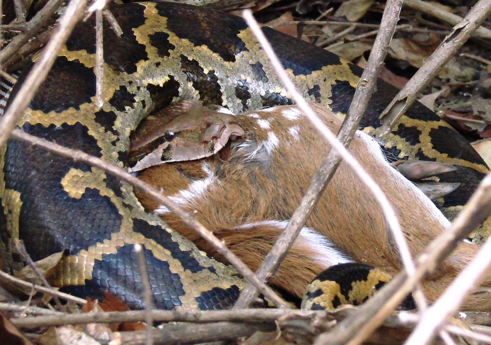


In the case of competition, we saw that each species negatively influenced the other. In the case of prey-predator interactions, one species actually benefits from the interaction and the other species loses out!

Nearly all prey-predator models, even the most state-of-the-art, complex ones, share this common framework:

$\Delta V = rV^* - f(V,P)*P$

AND

$\Delta P = g(V,P)*P - qP^*$

Where

$V$ is the total prey abundance (V for victims!), and 

$P$ is the total predator abundance, and

$rV^*$ represents the growth of the prey population *in the absence of predators* -- usually, this is some form of the standard single-species population growth models we have considered throughout most of this course (possibly density-dependent),

$qP^*$ represents the growth of the predator population *in the absence of prey* -- usually this is simply exponential decline!,

AND

$f(V,P)$ is known as the **functional response** -- that is, the rate of prey consumption per predator, usually a function of the prey and possibly predator densities.

AND

$g(V,P)$ is known as the **numerical response** -- that is, the per-capita rate of predator population growth, usually as a function of the prey and possibly predator densities.

There are many different types of possible functional response curves and numerical response curves. Let's start simple!

### The classical prey-predator model

Let's look at predation mathematically, starting with the simplest possible model...

#### The victims...

We will consider the prey, or "victims" first:

In the absence of predators, let's assume that the victim population grows according to the basic equation of population ecology:

$\Delta V = rV$

We will assume that the intrinsic rate of growth, $r$, is positive! In the absence of predators, the population grows exponentially.

If predators are present, the population growth rate of the victims will go down... 

What expression could define the rate at which prey are consumed by predators?

First of all, let's assume that predators and prey walk randomly through their common environment, bumping into each other randomly. Every time the predator bumps into a prey item, the predator has some chance of consuming that prey item. 

This is analogous to molecules moving randomly in a solution, occasionally causing reactions whenever they bump into other molecule(s) in the right way. 

Under such circumstances, the predators do NOT interfere with one another. Each predator consumes a constant amount of prey in a given time period, depending on prey availability. 

Consider the case where there are $V$ prey and only a single predator.  

**Q**: Imagine there are 100 prey and a single predator, and 3 prey are consumed today. What is the constant rate of prey consumption in this example ($\alpha$)? 

**Q** what is the shape of the functional response in this case?

$f(V)=\alpha \cdot V$

```{r}
LVfuncresp <- function(V,alpha){
  alpha*V
}

curve(LVfuncresp(x,0.03),0,200,xlab="Victim abundance",ylab="Total prey eaten per predator",col="red",lwd=3)

```

Note the intercept- does the functional response need to have an intercept of zero?

...Of course, this *alpha* term has a different meaning from the *alpha* in the competition models! 

Now consider the case where there is more than one predator -- that is, there are $P$ predators and there are $V$ prey. Recall that each predator has *no influence* on the consumption rates of other predators. The predators are just randomly bumping into prey. 

The *total rate of predation* now is:

$f(V) \cdot P = \alpha VP$

Does this make sense?

The term $\alpha$ is also known as the **capture efficiency**. Does this make sense? Consider a case where every predator "bumps into" all prey in the landscape each time step, but only consumes 3% of those prey. Now consider a predator that consumes 50% of the available prey per time step? Which predator is more efficient? 

**Q** what are the units of *alpha*?

**Q** Can *alpha* go above 1?

**Q** Can *alpha* go below 0?

Now, the (instantaneous) prey growth rate can be defined by the following equation:

$\Delta V = rV - \alpha VP$

This model is one half of what is known as the **Lotka-Volterra** prey-predator model. 

The other half is the predator population growth model, of course!!

#### The predators...

In the absence of prey, let's assume that the predator population grows just how we might imagine it grows- BADLY!

$\Delta P = -qP$

In the absence of prey, the predator population declines exponentially.

If prey are present, the population growth rate of the predators will go up... 

Recall that predators and prey walk randomly through their common environment, bumping into each other randomly. Each predator consumes a fixed percentage of the prey population. That is, the functional response is:

$f(V) = \alpha V$

The numerical response is the population-level response of the *predators* given the amount of prey that they have consumed. 

We can think of this as a function of the total prey consumption per predator:

$some.function(f(V))$

The simplest numerical response is that for every increase in prey consumed per capita, predator population growth increases by a fixed amount, $\beta$

**Q** what is the shape of the **numerical response** in this case?

$g(V)=\beta \cdot V$

```{r}
LVnumresp <- function(V,beta){
  beta*V
}

curve(LVnumresp(x,0.001),0,200,xlab="Victim abundance",ylab="Increase in r for predator population",col="blue",lwd=3)

```

Note the intercept- does the numerical response need to have an intercept of zero?

The *predator growth rate due to prey consumption* now is:

$g(V) \cdot P = \beta VP$

Does this make sense?

The term $\beta$ is also known as the **conversion efficiency**. Does this make sense? Consider a case where every predator consumes 100 prey per time step, but the predator population growth increases by only 0.01 relative to a scenario with no prey. Now consider a predator that consumes 1 prey per time step, and growth increases by 0.1... Which predator is more *efficient* at converting prey biomass into population growth? 

**Q** what are the units of *beta*?

**Q** Can *beta* go above 1?

**Q** Can *beta* go below 0?

Now, the (instantaneous) PREDATOR growth rate can be defined by the following equation:

$\Delta P = \beta VP - qP$

This model is the other half of what is known as the **Lotka-Volterra** prey-predator model.

Taken together, the model can be described as follows:

$\Delta P = \beta VP - qP$

$\Delta V = rV - \alpha VP$


### L-V predation model in InsightMaker 

Before we go deeper into predation modeling, let's simulate prey and predator population growth under the L-V predation model. As always, you can work in groups!

**Step 1**: First, clone [this Insight](https://insightmaker.com/insight/78356/Base-prey-predator-model), which provides the skeleton for a basic prey-predator model

**Step 2**: Correctly set up the equations for the variables "functional response"" and "numerical response".  

**Step 3**: Correctly set up the flow equations for "total prey consumed" and "predator mortality", which refer to the the prey lost and the predators gained per time step, respectively.

**Step 4**: In the settings menu, change the simulation length to 200 and make sure that your analysis algorithm is set to "Accurate (RK4)".

**Step 5**: Set the Initial abundance of prey and predators to 100 and 50, respectively. Set the alpha and beta terms to 0.001, and set the r_prey and q_pred terms to 0.1. Run the model and visualize the time series for prey and predators.

**Step 6**: Add a new display to represent **state space**: Choose the "scatter plot" type, and under "Data" select *Prey* first, then *Predator*. What does this system look like in phase space. 

**Q** What happens if you change the initial abundances?

**Q** What happens if you change initial abundance of both species to 100? Is this an **equilibrium**? If so, is it **stable**?

**Step 7**: Try some other parameter values for alpha, beta, r, and q...

**Q** Does the prey or predator ever go extinct?

**Q** Can you find some settings that make very slow oscillations?

**Q** Can you find some settings that make very fast oscillations?

**Q** Can you find some settings that make very shallow oscillations?


## Prey-Predator models on the phase plane!

```{r}
##### LOTKA VOLTERRA PREDATION EXAMPLE

## Params

Alpha <- 0.001
Beta <- 0.001
InitPrey <- 100
InitPred <- 75
r <- 0.1
q <- 0.1
Nyears <- 100
step <- 0.1

System <- data.frame(prey = rep(InitPrey,(Nyears+1)*10),pred = InitPred)

doYear <- function(prevyear){
  n1 <- prevyear[1] + r*prevyear[1]*step - Alpha*prevyear[1]*prevyear[2]*step
  n2 <- prevyear[2] + Beta*prevyear[1]*prevyear[2]*step - q*prevyear[2]*step 
  return(c(n1,n2))
}

## Do simulation
for(i in 1:(Nyears*10+1)){
  System[1+i,] <- doYear(System[i,])
}


```


Now let's visualize this basic L-V system in *phase space*:

```{r}
plot(1,1,pch="",ylim=c(0,200),xlim=c(0,200),xlab="prey",ylab="predators")
points(System[seq(1,1000,10),],col="green",type="p",pch=20,cex=0.85)
points(System[1,],col="blue",pch=20,cex=3)
```


Okay, so as prey get more abundant, predators start increasing, but as predators increase, prey abundance goes down. And repeat!


Here is another example...

```{r}
##### LOTKA VOLTERRA PREDATION EXAMPLE

## Params

Alpha <- 0.005
Beta <- 0.005
InitPrey <- 100
InitPred <- 75
r <- 0.2
q <- 0.1
Nyears <- 100
step <- 0.1

System <- data.frame(prey = rep(InitPrey,(Nyears+1)*10),pred = InitPred)

doYear <- function(prevyear){
  n1 <- prevyear[1] + r*prevyear[1]*step - Alpha*prevyear[1]*prevyear[2]*step
  n2 <- prevyear[2] + Beta*prevyear[1]*prevyear[2]*step - q*prevyear[2]*step 
  return(c(n1,n2))
}

## Do simulation
for(i in 1:(Nyears*10+1)){
  System[1+i,] <- doYear(System[i,])
}


plot(1,1,pch="",ylim=c(0,200),xlim=c(0,200),xlab="prey",ylab="predators")
points(System[seq(1,1000,10),],col="green",type="p",pch=20,cex=0.85)
points(System[1,],col="blue",pch=20,cex=3)

```


With some jittering, we can visualize the amount of time the system spends in various parts of phase space...

```{r}
plot(1,1,pch="",ylim=c(0,200),xlim=c(0,200),xlab="species 1",ylab="species 2")
points(jitter(System[,1],200),jitter(System[,2],200),col="brown",pch=20,cex=0.3)
#abline(h=K2,v=K1,col="gray",lwd=2,lty=2)
```

You can see that this system spends much more time near the origin, where abundances are low for both prey and predator! 

Finally, let's consider multiple starting points and see how the system behaves!

```{r}
##### LOTKA VOLTERRA PREDATION EXAMPLE

## Params


InitN1 <- 120
InitN2 <- 25
System1 <- data.frame(n1 = rep(InitN1,(Nyears*10+1)),n2 = InitN2)
## Do simulation
for(i in 1:(Nyears*10+1)){
  System1[1+i,] <- doYear(System1[i,])
}

InitN1 <- 200
InitN2 <- 100
System2 <- data.frame(n1 = rep(InitN1,(Nyears*10+1)),n2 = InitN2)
## Do simulation
for(i in 1:(Nyears*10+1)){
  System2[1+i,] <- doYear(System2[i,])
}


InitN1 <- 50
InitN2 <- 200
System3 <- data.frame(n1 = rep(InitN1,(Nyears*10+1)),n2 = InitN2)
## Do simulation
for(i in 1:(Nyears*10+1)){
  System3[1+i,] <- doYear(System3[i,])
}


```


Now, phase space looks like this (with jittering to indicate concentration of points:

```{r}
plot(1,1,pch="",ylim=c(0,400),xlim=c(0,400),xlab="species 1",ylab="species 2")
points(jitter(System[,1],500),jitter(System[,2],500),col="brown",pch=20,cex=0.3)
points(jitter(System1[,1],500),jitter(System1[,2],500),col="green",pch=20,cex=0.3)
points(jitter(System2[,1],500),jitter(System2[,2],500),col="red",pch=20,cex=0.3)
points(jitter(System3[,1],500),jitter(System3[,2],500),col="blue",pch=20,cex=0.3)
#abline(h=K2,v=K1,col="gray",lwd=2,lty=2)
```

**Q**: Does this predator-prey system have a stable equilibrium?

**Q**: Does this predator-prey system have an equilibrium at all?

**Q**: How do these dynamics look like when visualized as time series?

```{r}
plot(seq(1,100,length=nrow(System)), System[,1], xlab="Time", ylab="Abundance",type="l",col="orange",lwd=2,ylim=c(0,160),xlim=c(0,95))
points(seq(1,100,length=nrow(System)), System[,2], xlab="Time", ylab="Abundance",type="l",col="green",lwd=2,lty=2)
legend("top",lwd=c(2,2),lty=c(1,2),col=c("orange","green"),legend=c("prey","predator"),bty="n")
```


```{r echo=FALSE}

## Paul Hurtado code

## Shiny version was based on code from the following page, sourced 20 July 2016. 
## http://grrrraphics.blogspot.com/2013/01/shiny-desolve-and-ggplot-play-nicely.html

#library(shiny)
library(deSolve) 

#######################################################################################
## Functions for pplane actions.

# Modified from the original script pplane.r written by Daniel Kaplan,
# Dept. of Mathematics, Macalester College, kaplan@macalester.edu 

# Modifications by S. Ellner for use in connection with the textbook
# Dynamic Models in Biology by S.P. Ellner and J. Guckenheimer,
# Princeton University Press (2006)  

# Early modifications of SPE's code by Paul Hurtado:
#   * Removed noisy phase arrow placement
#   * Changed the colors of some of the curves
#   * Relace odesolve package dependency with updated package deSolve.
#
# Later modifications by Paul Hurtado:
#   * Overhaul as a shiny app: http://shiny.rstudio.com/gallery/widget-gallery.html 
#      + Modified functions so that all use input functions of the form: fun(x,y,parms)
#
# Missing Features (TTD):
#
#   * A mechanism to "reset" following an equation or parameter change, 
#     that erases all fixed points, S/U manifolds of saddles, trajectories, etc.
#
#   * Better time step size and integration length controls.
#
#   * Allow user defined labels and colors...  E.g. default colors should 
#     match colors from the matlab version of pplane (personal preference!) 
#
#   * Legend on GUI for fixed point symbols (saddle, source, node, etc.)
#
#   * Do these revised functions work as "command line" tools like SPE's version? 
#     If not, go back and implement wrappers so we can have a unified package!
#      + Ultimately, aim for a shiny/GUI version and command line version.
#      + Once that exists, write documentation, put it all in an R package.
#
#   Inspired by pplane (for Matlab) at http://math.rice.edu/~dfield/
#

##########################################################################################
## These functions assume a function of the form 
##    fun <- function(x,y,p) { with(as.list(p), { c(dx,dy) } ) }
## When we need to use fun with deSolve::ode() we must first convert it via this function:
as.ode.func = function(FUN) { return(function(t,y,parms){list(FUN(y[1],y[2],parms))}) }


##########################################################################################
## Functions for drawing 2D state space / vector field / phase plane plots
## Documentation will be coming soon!! :-)

## Split this into phasearrows.calc() and phasearrows.draw() 
phasearrows <- compiler::cmpfun(function(fun,xlims,ylims,resol=25, col='black', add=F,parms=NULL) {
  if (add==F) {
    plot(1,xlim=xlims, ylim=ylims, type='n',xlab="x",ylab="y");
  }
  x <- matrix(seq(xlims[1],xlims[2], length=resol), byrow=T, resol,resol);
  y <- matrix(seq(ylims[1],ylims[2], length=resol),byrow=F, resol, resol);
  npts <- resol*resol;
  # Removed by PJH so drawing phase arrows twice doesn't change the figure...
  #  xspace <- abs(diff(xlims))/(resol*10);
  #  yspace <- abs(diff(ylims))/(resol*10);
  #  x <- x + matrix(runif(npts, -xspace, xspace),resol,resol);
  #  y <- y + matrix(runif(npts, -yspace, yspace),resol,resol);
  z <- fun(x,y,parms);
  z1 <- matrix(z[1:npts], resol, resol);
  z2 <- matrix(z[(npts+1):(2*npts)], resol, resol);
  maxx <- max(abs(z1));
  maxy <- max(abs(z2));
  dt <- min( abs(diff(xlims))/maxx, abs(diff(ylims))/maxy)/resol;
  lens <- sqrt(z1^2 + z2^2);
  lens2 <- lens/max(lens); ## Can this next line be more robust? Change .1 to ???
  arrows(c(x), c(y), c(x+dt*z1/((lens2)+.1)), c(y+dt*z2/((lens2)+.1)),length=.04, col=col);
})

vec.data<<-list()
phasearrows.calc <- compiler::cmpfun(function(fun,xlims,ylims,resol=25,parms=NULL) {
  #if (add==F) { 
  #  plot(1,xlim=xlims, ylim=ylims, type='n',xlab="x",ylab="y");
  #}
  x <- matrix(seq(xlims[1],xlims[2], length=resol), byrow=T, resol,resol);
  y <- matrix(seq(ylims[1],ylims[2], length=resol),byrow=F, resol, resol);
  npts <- resol*resol;
  z <- fun(x,y,parms);
  z1 <- matrix(z[1:npts], resol, resol);
  z2 <- matrix(z[(npts+1):(2*npts)], resol, resol);
  maxx <- max(abs(z1));
  maxy <- max(abs(z2));
  dx <- min( abs(diff(xlims))/maxx, abs(diff(ylims))/maxy)/resol;
  lens <- sqrt(z1^2 + z2^2);
  lens2 <- lens/max(lens); 
  return(list(x,y,z1,z2,lens2,dx)) # save as vec.data
})

phasearrows.draw <- compiler::cmpfun(function(vfdat=vec.data, col="black") {
  x <- vfdat[[1]]
  y <- vfdat[[2]]
  z1<- vfdat[[3]]
  z2<- vfdat[[4]]
  lens2<- vfdat[[5]]
  dx <- vfdat[[6]]
  ## Can this next line be more robust? Change .1 to 1e-6? Change 0.04 to ???
  arrows(c(x), c(y), c(x+dx*z1/((lens2)+.1)), c(y+dx*z2/((lens2)+.1)),length=.04, col=col);
})


## REMOVE THIS OR NOT???
showcontours <- compiler::cmpfun(function(fun,xlims, ylims,resol=250,add=F, colors=c('red', 'blue'),parms=NULL) {
  x <- matrix(seq(xlims[1],xlims[2], length=resol), byrow=F, resol,resol);
  y <- matrix(seq(ylims[1],ylims[2], length=resol),byrow=T, resol, resol);
  npts = resol*resol;
  z <- fun(x,y,parms);
  z1 <- matrix(z[1:npts], resol, resol);
  z2 <- matrix(z[(npts+1):(2*npts)], resol, resol);
  contour(x[,1],y[1,],z1, add=add, col=colors[1]);
  contour(x[,1],y[1,],z2, add=T, col=colors[2]); 
})

##  Split into nullclines.calc() and nullclines.draw()
nullclines <- compiler::cmpfun(function(fun,xlims, ylims, resol=250, add=F,parms=NULL) {
  x <- matrix(seq(xlims[1],xlims[2], length=resol), byrow=F, resol,resol);
  y <- matrix(seq(ylims[1],ylims[2], length=resol),byrow=T, resol, resol);
  npts = resol*resol;
  z <- fun(x,y,parms);
  z1 <- matrix(z[1:npts], resol, resol);
  z2 <- matrix(z[(npts+1):(2*npts)], resol, resol);
  contour(x[,1],y[1,],z1,levels=c(0), drawlabels=F,add=add, col="orange");
  contour(x[,1],y[1,],z2,levels=c(0), drawlabels=F,add=T, col="magenta"); 
  title(main="Orange = x nullcline, Magenta = y nullcline",cex=0.35); 
})

nullclines.data <- list()
nullclines.calc <- compiler::cmpfun(function(fun,xlims,ylims,resol=250,parms=NULL) {
  x <- matrix(seq(xlims[1],xlims[2], length=resol), byrow=F, resol,resol);
  y <- matrix(seq(ylims[1],ylims[2], length=resol),byrow=T, resol, resol);
  npts = resol*resol;
  z <- fun(x,y,parms);
  z1 <- matrix(z[1:npts], resol, resol);
  z2 <- matrix(z[(npts+1):(2*npts)], resol, resol);
  return(list(x,y,z1,z2)) # return nullclines.data
})

nullclines.draw <- compiler::cmpfun(function(ndat=nullclines.data,add=T){
  x <- ndat[[1]]
  y <- ndat[[2]]
  z1<- ndat[[3]]
  z2<- ndat[[4]]
  contour(x[,1],y[1,],z1,levels=c(0), drawlabels=F,add=add, col="orange");
  contour(x[,1],y[1,],z2,levels=c(0), drawlabels=F,add=T, col="magenta"); 
  #title(main="Orange = x nullcline, Magenta = y nullcline",cex=0.35); 
})

## We need something like an array or list for each trajectory, that we can add to.
## BETA VERSION: Don't track time. Add that in later once it all works?
##
## 1. Structure to save curves: traj.data   
traj.data=list() # each element will be an Mx3 matrix like cbind(time,x,y)
## 2. Function to plot them all. Allow ability to pass args to ode() via ...
traj.draw = function(tdat=traj.data,col="blue",lwd=2) {
  #print(unlist(tdat[[1]]))
  for(i in 1:length(tdat)) { 
    lines(tdat[[i]][,2:3], lwd=lwd, col=col)}
}

## 3. grid.calc()    
grid.calc <- compiler::cmpfun(function(fun,xlim,ylim,parms,ngrid,maxtime=50) {
  xvals=seq(xlim[1],xlim[2],length=ngrid); 
  yvals=seq(ylim[1],ylim[2],length=ngrid); 
  ts <- list()
  for(i in 1:ngrid) {
    for(j in 1:ngrid) {
      out1=ode(times=  seq(0,maxtime,length=500),y=c(xvals[i],yvals[j]),func=as.ode.func(fun),parms=parms); 
      out2=ode(times= -seq(0,maxtime,length=500),y=c(xvals[i],yvals[j]),func=as.ode.func(fun),parms=parms); 
      ts[[length(ts)+1]] <- rbind(out2[nrow(out2):2 , ],out1)
    }}
  return(ts)
})

## 4. traj.forward() and traj.backward()    
traj.forward  = compiler::cmpfun(function(x0,fun,parms,maxtime,Tlen=500,...){
  out=ode(times=seq(0,maxtime,length=Tlen),y=c(x0[1],x0[2]),func=as.ode.func(fun),parms=parms,...); 
  return(out);
})

traj.backward = compiler::cmpfun(function(x0,fun,parms,maxtime,Tlen=500,...){
  out=ode(times=seq(0,-maxtime,length=Tlen),y=c(x0[1],x0[2]),func=as.ode.func(fun),parms=parms,...); 
  return(out[nrow(out):1,]);
})

## 5. traj.continue()
traj.continue <- compiler::cmpfun(function(fun, parms, tdat, maxtime, Tlen=500, backward=FALSE, ...){
  if(length(tdat)==0) { cat("WARNING: No trajectories have been calculate yet!\n")}
  out.curr <- tdat[[length(tdat)]]
  if(backward) {
    X0=head(out.curr,1); 
    t0=X0[1];
    x0=X0[-1];
    times=t0+seq(0,-maxtime,length=Tlen); 
    out=ode(times=times,y=x0,func=as.ode.func(fun),parms=parms,...); 
    return(rbind(out[nrow(out):2,],out.curr));
  } else {
    X0=tail(out.curr,1); 
    t0=X0[1]
    x0=X0[-1]
    times=t0+seq(0,maxtime,length=Tlen); 
    out=ode(times=times,y=x0,func=as.ode.func(fun),parms=parms,...); 
    return(rbind(out.curr,out[-1,]));
  }
})

## original grid() function
grid=compiler::cmpfun(function(fun,xlim,ylim,parms,ngrid,maxtime=50,Tlen=500,add=F,color="blue") {
  if (add==F) {
    plot(1,xlim=xlim, ylim=ylim, type='n',xlab="x",ylab="y");
  }
  xvals=seq(xlim[1],xlim[2],length=ngrid); 
  yvals=seq(ylim[1],ylim[2],length=ngrid); 
  for(i in 1:ngrid) {
    for(j in 1:ngrid) {
      out=ode(times=seq(0,maxtime,length=Tlen),y=c(xvals[i],yvals[j]),func=as.ode.func(fun),parms=parms); 
      points(out[,2],out[,3],type="l",lwd=2,col=color);
      out=ode(times=-seq(0,maxtime,length=Tlen),y=c(xvals[i],yvals[j]),func=as.ode.func(fun),parms=parms); 
      points(out[,2],out[,3],type="l",lwd=2,col=color);
    }}
})

# Newton's method to find equilibria of vector field.
# func() must have the same input arguments and returns as for ode/rk4.  
# Inputs: 
#   x0 = intial guess at equilibrium. If x0 is not supplied in the call, 
#        the user chooses it from the current graphics device via locator()
#         and the equilibrium is plotted to the same device. Plotting
#         symbol is closed/open=stable/unstable, circle/triangle=eigenvalues imaginary/real.   
#   tol= Convergence tolerance 
#   niter = Maximum number of iterations
#   inc = finite-difference increment for derivative estimates 
# Coded 5/25/06 by SPE based on Matlab toggle.m by JG 
# MODIFIED 7/2016 by PJH to take functions fun(x,y,parms)

newton=compiler::cmpfun(function(fun,x0=NULL,parms=NULL,tol=1e-16,niter=40,inc=1e-6,plotit=TRUE) {
  x=x0; #initial x  
  if (is.null(x0)) {
    warning("Oops! newton() was called without x0 specified!");#{x = locator(n=1); x=c(x$x,x$y)};
    return(list(x=c(NA,NA,df=matrix(NA,2,2),pch=NA)))
  }
  nx = length(x); # length of state vector
  ######### Newton iteration loop: start  
  for(i in 1:niter){  
    y = as.ode.func(fun)(0,x,parms)[[1]] 
    df = matrix(0,nx,nx); # Compute df
    for(j in 1:nx) {
      #Increment vector for estimating derivative wrt jth coordinate
      v=rep(0,nx); 
      v[j] = inc; 
      df[,j]=  (as.ode.func(fun)(t,x+v,parms)[[1]] - as.ode.func(fun)(t,x-v,parms)[[1]])/(2*inc) 
    }
    if (sum(y^2) < tol){  #check for convergence 
      if(plotit){
        ev=eigen(df)$values; pch1=1+as.numeric(Im(ev[1])!=0); pch2=1+as.numeric(max(Re(ev))<0);
        pchs=matrix( c(2,17,1,16),2,2,byrow=T); 	
        #points(x[1],x[2],type="p",pch=pchs[pch1,pch2],cex=1.5)
      }
      cat("Fixed point (x,y) = ",x,"\n"); 
      cat("Jacobian Df=","\n"); print(df);cat("Eigenvalues","\n"); print(eigen(df)$values)
      return(list(x=x,df=df,pch=pchs[pch1,pch2]))   
    } # end convergence check	
    x = x - solve(df,y) # one more step if needed 
    cat(i, x, "\n") #print out the next iterate 
  }
  ######### Newton iteration loop: end  
  cat("Convergence failed"); 
})

## to draw fixed points 
fixed.points.draw <- compiler::cmpfun(function(FPs) {
  for(i in 1:length(FPs)) { points(FPs[[i]]$x[1], FPs[[i]]$x[2], cex=1.5, type="p",pch=FPs[[i]]$pch)} 
})

manifolds.calc <- compiler::cmpfun(function(fun,parms,FPs,maxtime=250, Tlen=500) {
  ms = list()
  for(i in 1:length(FPs)) { if(!any(is.na(FPs[[i]]$x))) {
  x=FPs[[i]]$x; df=FPs[[i]]$df; V=eigen(df)$vectors; ev=eigen(df)$values; 
  
  if (sign(Re(ev[1])) != -sign(Re(ev[2])) | Im(ev[1]) != 0) {
    # if not a saddle...
    ms[[i]] <- list(S=matrix(NA,nrow=1,ncol=2),U=matrix(NA,nrow=1,ncol=2))
  }else{
    i1=which(Re(ev)>0); i2=which(Re(ev)<0); 
    v1=V[,i1]; v2=V[,i2]; eps=1e-3;  
    out1=ode(y=x+eps*v1,times=seq(0,maxtime,length=Tlen),func=as.ode.func(fun),parms=parms); 
    out2=ode(y=x-eps*v1,times=seq(0,maxtime,length=Tlen),func=as.ode.func(fun),parms=parms); 
    out3=ode(y=x+eps*v2,times=-seq(0,maxtime,length=Tlen),func=as.ode.func(fun),parms=parms); 
    out4=ode(y=x-eps*v2,times=-seq(0,maxtime,length=Tlen),func=as.ode.func(fun),parms=parms); 
    
    S = rbind(out3,out4[1,]*NA,out4)[,-1]
    U = rbind(out1,out2[1,]*NA,out2)[,-1]
    
    ms[[i]] <- list(S=S,U=U)
  }} else { # if x[1] is NA...
  ms[[i]] <- list(S=matrix(NA,nrow=1,ncol=2),U=matrix(NA,nrow=1,ncol=2))
  }
  }
 return(ms) 
})

manifolds.draw=compiler::cmpfun(function(ms) {
  for(i in 1:length(ms)){
    S=ms[[i]]$S
    U=ms[[i]]$U
    title(sub="Black=stable manifold, Red=unstable manifold"); 
    points(S[,1],S[,2],type="l",lwd=2,col="black");
    points(U[,1],U[,2],type="l",lwd=2,col="red");
  }
})
    
# Compute Jacobian of a planar vector field at a point (x,y),
# either input or chosen with locator().
jacobianAtXY <- compiler::cmpfun(function(fun,x=NULL, y=NULL,inc=1e-7){
  if (is.null(x)|is.null(y)) {
    x0 <- locator(n=1); x <- x0$x; y <- x0$y;  
  }
  foo <- fun(x,y); h = inc; 
  foox <- fun(x+h,y); fooy <- fun(x,y+h);
  A <- (foox[1] - foo[1])/h;
  B <- (fooy[1] - foo[1])/h;
  C <- (foox[2] - foo[2])/h;
  D <- (fooy[2] - foo[2])/h;
  return(matrix( c(A,B,C,D ),2,2,byrow=T))
})


```

### More with the L-V predator-prey phase space!


Just like before, let's draw arrows throughout phase space, representing where the system would be expected to go from each point in phase space. 

```{r echo=FALSE}
#######################################################################################
## SPECIFY MODEL AND INITIALIZE
#
## toggle switch function for phase arrow and nullcline plotting 

toggle = compiler::cmpfun(function(u,v,parms) {
  c( u*parms[1]-parms[2]*u*v, parms[3]*u*v-parms[4]*v )
})

fun=toggle ## Our generic name for the system of equations to look at! ;-)
#
## toggle switch function for computing solution trajectories with deSolve::ode()

#Toggle = as.ode.func(toggle)
#
## parameter values?

Alpha <- 0.005
Beta <- 0.005
r <- 0.2
q <- 0.1

parms=c(r,Alpha,Beta,q)

# toggle(100,100,parms)

xlim = c(5,200)
ylim = c(5,200)
new <- phasearrows.calc(toggle,xlim,ylim,resol=25,parms=parms)

plot(1,1,pch="",xlim=xlim,ylim=ylim,xlab="Prey",ylab="Predators")
phasearrows.draw(new)

#
## END MODEL SPECIFICATION AND INITIALIZATION
#######################################################################################
```

Are there any other possible outcomes of this simple L-V model?

Well, let's plot out the isoclines then!!

### Isoclines!

Again, it can be helpful to plot out the isoclines in phase space -- that is, the conditions under which the predator and prey populations do NOT grow!

If we set the L-V prey growth equation to zero, we find that the victim population is stable under the following conditions in phase space:

$\hat{P} =\frac{r}{\alpha}$

If we set the L-V predator equation to zero, we find that the victim population is stable under the following conditions in phase space:

$\hat{V} =\frac{q}{\beta}$

That is, the prey population is stable only if there are just enough predators to bump into (and subsequently eat up) any excess individuals produced each year

And the predator population is stable only if there are just enough prey to offset natural mortality.

Let's visualize this in phase space.

```{r}
plot(1,1,pch="",xlim=xlim,ylim=ylim,xlab="Prey",ylab="Predators")
phasearrows.draw(new)
abline(h=r/Alpha,col="red",lwd=3)   # prey
abline(v=q/Beta,col="blue",lwd=3)   # pred

```

## Assumptions of the L-V prey-predator model

- Victim population is limited only by predation
- Predator feeds only on one species of prey
- Individual predators can consume infinity prey items per time step theoretically
- No interference among predators
- Victims have no refuge from predatpors

## More realistic prey-predator models

Let's see what happens if we relax some of these assumptions!

- give the prey a carrying capacity!
- modify the functional response!
- add a refuge for prey!
- add a predator carrying capacity!

We can play around with these scenarios in InsightMaker. But it can be instructive to visualize in phase space first. For example, let's incorporate a victim carrying capacity.

### victim K in phase space

```{r echo=FALSE}
#######################################################################################
## SPECIFY MODEL AND INITIALIZE
#
## toggle switch function for phase arrow and nullcline plotting 

toggle = compiler::cmpfun(function(u,v,parms) {
  c( u*parms[1]-parms[2]*u*v - parms[3]*u^2, parms[4]*u*v-parms[5]*v )
})

fun=toggle ## Our generic name for the system of equations to look at! ;-)
#
## toggle switch function for computing solution trajectories with deSolve::ode()

#Toggle = as.ode.func(toggle)
#
## parameter values?

Alpha <- 0.001
Beta <- 0.005
r <- 0.2
q <- 0.1
c <- 0.008

parms=c(r,Alpha,c,Beta,q)

# toggle(100,100,parms)

xlim = c(5,200)
ylim = c(5,200)
new <- phasearrows.calc(toggle,xlim,ylim,resol=25,parms=parms)

plot(1,1,pch="",xlim=xlim,ylim=ylim,xlab="Prey",ylab="Predators")
phasearrows.draw(new)

#
## END MODEL SPECIFICATION AND INITIALIZATION
#######################################################################################
```

Adding isoclines, it looks something like this:

```{r}
plot(1,1,pch="",xlim=xlim,ylim=ylim,xlab="Prey",ylab="Predators")
phasearrows.draw(new)
abline((r/Alpha),-(c/Alpha),col="red",lwd=3)   # prey
abline(v=q/Beta,col="blue",lwd=3)   # pred

```

Follow the arrows. What do you think the system dynamics will look like?

```{r}
## Params

Alpha <- 0.001
Beta <- 0.005
r <- 0.2
q <- 0.1
c <- 0.008
InitPrey <- 100
InitPred <- 75
Nyears <- 100
step <- 0.1

System <- data.frame(prey = rep(InitPrey,(Nyears+1)*10),pred = InitPred)

doYear <- function(prevyear){
  n1 <- prevyear[1] + r*prevyear[1]*step - Alpha*prevyear[1]*prevyear[2]*step - c*prevyear[1]^2*step
  n2 <- prevyear[2] + Beta*prevyear[1]*prevyear[2]*step - q*prevyear[2]*step 
  return(c(n1,n2))
}

## Do simulation
for(i in 1:(Nyears*10+1)){
  System[1+i,] <- doYear(System[i,])
}

##### LOTKA VOLTERRA PREDATION EXAMPLE

## Params


InitN1 <- 100
InitN2 <- 200
System1 <- data.frame(n1 = rep(InitN1,(Nyears*10+1)),n2 = InitN2)
## Do simulation
for(i in 1:(Nyears*10+1)){
  System1[1+i,] <- doYear(System1[i,])
}

InitN1 <- 100
InitN2 <- 100
System2 <- data.frame(n1 = rep(InitN1,(Nyears*10+1)),n2 = InitN2)
## Do simulation
for(i in 1:(Nyears*10+1)){
  System2[1+i,] <- doYear(System2[i,])
}


InitN1 <- 50
InitN2 <- 20
System3 <- data.frame(n1 = rep(InitN1,(Nyears*10+1)),n2 = InitN2)
## Do simulation
for(i in 1:(Nyears*10+1)){
  System3[1+i,] <- doYear(System3[i,])
}

plot(1,1,pch="",xlim=xlim,ylim=ylim,xlab="Prey",ylab="Predators")
phasearrows.draw(new)
abline((r/Alpha),-(c/Alpha),col="red",lwd=3)   # prey
abline(v=q/Beta,col="blue",lwd=3)   # pred
points(jitter(System[,1],500),jitter(System[,2],500),col="brown",pch=20,cex=0.3)
points(jitter(System1[,1],500),jitter(System1[,2],500),col="green",pch=20,cex=0.3)
points(jitter(System2[,1],500),jitter(System2[,2],500),col="red",pch=20,cex=0.3)
points(jitter(System3[,1],500),jitter(System3[,2],500),col="blue",pch=20,cex=0.3)

```

Now, does the system have a stable equilibrium???

Let's visualize as a time series!

```{r}
plot(seq(1,100,length=nrow(System)), System[,1], xlab="Time", ylab="Abundance",type="l",col="orange",lwd=2,ylim=c(0,160),xlim=c(0,95))
points(seq(1,100,length=nrow(System)), System[,2], xlab="Time", ylab="Abundance",type="l",col="green",lwd=2,lty=2)
legend("top",lwd=c(2,2),lty=c(1,2),col=c("orange","green"),legend=c("prey","predator"),bty="n")
```

### Alternative functional responses

The L-V prey-predator model assumes that prey consumption per predator increases linearly with an increase in prey abundance. Following C.S. "Buzz" Holling, this is known as a **"Type I" functional response**.

The Type I functional response makes several unrealistic assumptions -- for example, that predators never get full and stop eating!

As we have seen before, the type I functional response looks something like this!

$f(V)=\alpha \cdot V$

```{r}
TypeIfuncresp <- function(V,alpha){
  alpha*V
}

curve(TypeIfuncresp(x,0.1),0,500,xlab="Victim abundance",ylab="Total prey eaten per predator",col="red",lwd=3)

```

#### Type II functional response

The **Type II functional response** takes prey saturation into account- the predators will consume more prey with increasing prey densities, but only up to a point! 

The type II functional response is described mathematically as:

$f(V,P) = \frac{\alpha V}{1+\alpha hV}$, 

where *f(V,P)* is the functional response (prey consumed per predator).

Similar to the Type I functional response, $\alpha$ is the "attack rate" (rate at which a predator-prey encounters increase as prey densities increase) 

The new term, *h*, describes the handling time (average time a predator spends processing a single prey item). 

The term *h* is probably best understood as the *inverse of the maximum prey consumption rate*!

Let's visualize it!

```{r}
TypeIIfuncresp <- function(V,alpha,h){
  (alpha*V)/(1+alpha*h*V)
}

curve(TypeIIfuncresp(x,0.1,0.1),0,500,xlab="Victim abundance",ylab="Total prey eaten per predator",col="red",lwd=3)

```

#### Type III functional response

The **Type III functional response** takes predator learning into account- as prey become more abundant (relative to other potential prey) the predators will develop a *search image* and the capture efficiency will increase with increasing prey abundance up to a certain point.

Conversely, as prey densities get really low, predators will stop even bothering to look for the prey, so capture efficiency will be depressed. 

The type III functional response can be described mathematically as:

$f(V,P) = \frac{\alpha V}{1+\alpha hV}$, 

where *f(V,P)* is the functional response (prey consumed per predator).

Similar to the Type I functional response, $\alpha$ is the "attack rate" (rate at which a predator-prey encounters increase as prey densities increase)

The new term, *h*, describes the handling time (average time a predator spends processing a single prey item). 

The term *h* is probably best understood as the *inverse of the maximum prey consumption rate*!

Let's visualize it!

```{r}
TypeIIIfuncresp <- function(V,alpha,h,k){
  (alpha*V^k)/(1+alpha*h*V^k)
}

curve(TypeIIIfuncresp(x,0.0005,0.1,1.6),0,1000,xlab="Victim abundance",ylab="Total prey eaten per predator",col="red",lwd=3)

```

## Final InsightMaker activity (on your own)!!

**Step 1** Add prey density-dependence to your basic predator-prey model, using the equations in the Gotelli book. Visualize the dynamics as time series and in phase space. Do you ever see oscillations with prey density dependence? Is this model more stable than the base L-V model?

**Step 2** Change the functional response to a type-II functional response. Visualize the dynamics as time series and in phase space. Do you ever see oscillations with this model? Is this model more stable than the base L-V model?

**Step 3** Change the model to account for prey refuges. That is, there is a segment of the prey population that is not accessible to predators. How does this change the system dynamics?  

**Step 4** Change the model to include a type II functional response AND prey density-dependence. How does this change the system dynamics? Is this system stable? Under what conditions?

**Step 5** Evaluate the following statement (from the Gotelli Book):

> "the more independent the predator and the prey are of one another, the more stable the interaction"

[--go to next lecture--](LECTURE18.html)


<!--chapter:end:LECTURE17.Rmd-->

---
title: "Final class review"
author: "NRES 470/670"
date: "May 9, 2017"
output: 
  html_document: 
    theme: spacelab
    toc: yes
    toc_float: yes
---

```{r setup, include=FALSE}
knitr::opts_chunk$set(echo = TRUE, cache = TRUE)
```


### Upcoming final exam

**when and where** The final exam is coming up on **April 6**. You will have the whole 50 minute class period to take the exam. The exam will take place in our regular classroom, unless you make prior arrangements. 

**what** The exam will cover all material covered in lectures and lab.

- All material in Chapters 1-6 of the Gotelli book
    - Exponential pop growth
    - Density-dependent pop growth
    - Age-structured pop growth
    - Metapopulations (additional suggested reading: [Griffin et al. 2008](griffin1.pdf))
    - Competition
    - Predation
- *Systems thinking and modeling* (including Ch. 1, 2, and 10 of ["Beyond Connecting the Dots"](http://beyondconnectingthedots.com/))
- *Individual-based models* (IBM) (inlcluding Ch. 10 of "Beyond Connecting the Dots").
- Basic computer programming using *InsightMaker* (e.g., if-then-else statements)
- *Application of matrix population models to conservation and management* (including [Heppell 1998](heppell1.pdf))
- *Stochasticity and Uncertainty*, including [Lande 1992](lande.pdf), [Regan 2002](Regan_2002.pdf) and all material covered in lecture and lab.
- *Small-population paradigm and declining-population paradigm* (including [Beissinger and Westphal 1998](beissinger1.pdf), [Caughley 1988](caughley1.pdf))  
- *Population Viability Analysis*, in theory and practice
- *Parameter estimation for PVA* (including basic use of Program MARK) (helpful reading: [Amstrup et al](amstrup1.pdf))

*The exam will consist of a mixture of multiple-choice and short-answer questions.*

### Final logistics

#### Presentations

- Return student feedback forms
- Please send me a copy of your final project presentation PowerPoint
- (great job by the way!)

#### Final papers

- Should all have received feedback
- Rubric- I was a little harsh, and was meant to help reinforce what to improve for the final draft. The rubric did not count toward your grade (all received full credit for handing in the draft)

#### Extra credit

- Will accept up to two extra credit write-ups. 
- Due when final papers are due (May 17).

#### Office hours/Study session

- Today normal time (1-3)
- Thursday (5/11) 2-4pm 

#### DISCUSSION: Modeling in the bigger context

#### DISCUSSION: The future of NRES 470/670


#### PLEASE fill out your course evaluations!


[--this is the final lecture--]


<!--chapter:end:LECTURE18.Rmd-->

---
title: "Intro to population ecology"
author: "NRES 470/670"
date: "Jan 19, 2017"
output: 
  html_document: 
    theme: spacelab
    toc: yes
    toc_float: yes
---

```{r setup, include=FALSE}
knitr::opts_chunk$set(echo = TRUE, cache = TRUE)
```

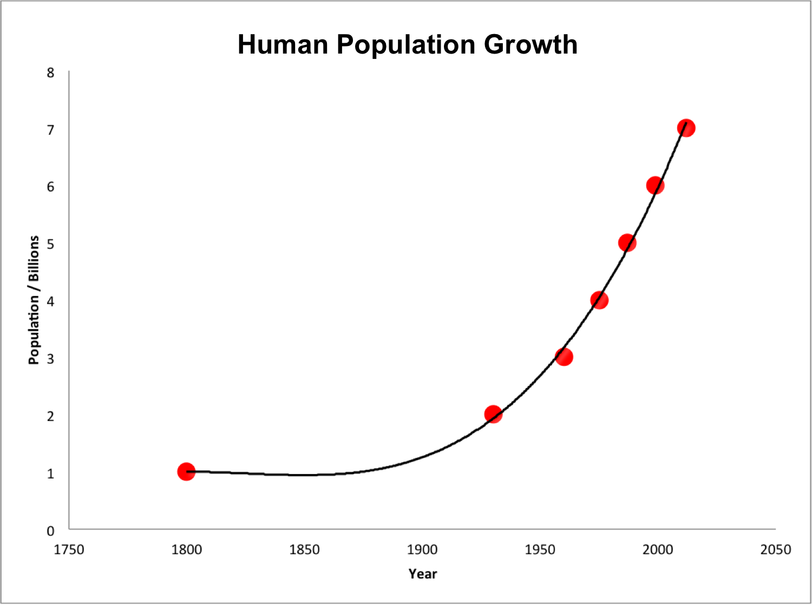

## Central Questions of Population Ecology

### Ecological
  - Why are some species more abundant than others?   
  - What causes population densities to vary in space and time?   
  - What causes populations to become extirpated? Recolonized?  
  - What processes regulate population growth?   
    - Extrinsic vs intrinsic factors (Nicholson vs Andrewartha debate)
  - What prevents predator-prey relationships from collapsing?   
  - What factors allow competitors to coexist?
  - What factors allow metapopulations to be stable?
  


### Conservation and Management
  - What is the conservation status of a focal species or population?
  - How do anthropogenic structures and land uses affect populations?
  - What is the *Maximum Sustainable Yield* for a focal game species?
  - How can pest species be most effectively controlled?
  - What land areas are most important for preserving at-risk populations?

## What is a population?

From Krebs (1972):
“A population is defined as a group of organisms of the same species occupying a particular space at a particular time, with the potential to breed with each other"

Spatial boundaries defining populations sometimes are easily definte, but more typically are vague and difficult to determine.

Population size, or abundance, is often represented as $N$, and is the most basic measurement of a wild population. 

## Exponential growth: the fundamental principle of population ecology


Giant puffballs produce 7 trillion offspring in one reproductive event
... If all of those individuals reached adulthood, the descendants from just two parent puffballs would weigh more than the entire planet in two generations!

The reason? Populations grow geometrically, a process called **exponential growth**. This is the most basic concept in population ecology. We will go over this concept in detail in upcoming in-class activities and labs.  


## Mathematics and Population Ecology

"Mathematics seems to endow one with a new sense."    
  - Charles Darwin   
  
“Like most mathematicians, he takes the hopeful biologist to the edge of the pond, points out that a good swim will help his work, and then pushes him in and leaves him to drown.”   
  - Charles Elton, in reference to a work by Alfred Lotka   
  


The importance of the method is this: if we know certain variables, mostly desired by ecologists and in some cases already determined by them, we can predict certain results which would not normally be predictable or even expected by ecologists. The stage of verification of these mathematical predictions has hardly begun; but their importance cannot be under-estimated, and we look forward to seeing the further volumes of Lotka’s studies.       
  - Charles Elton    
  
## Population ecology is central to many of the most pressing questions in modern day ecology and evolution

This class is mostly about how important Population Ecology is to wildlife conservation and management. But it is worth mentioning that Population Ecology is a very active field of basic science, and that population ecology is at the core of many of the central questions of ecology and evolution. 

These questions are from [Sutherland et al. 2012](http://onlinelibrary.wiley.com/doi/10.1111/1365-2745.12025/full). This paper is on WebCampus (optional). Of course there are many more interesting questions- limited only by your imagination. 

You may not understand all these questions now- we will revisit this list at the end of the semester!


- What are the evolutionary consequences of species becoming less connected through **fragmentation** or more connected through globalization?   

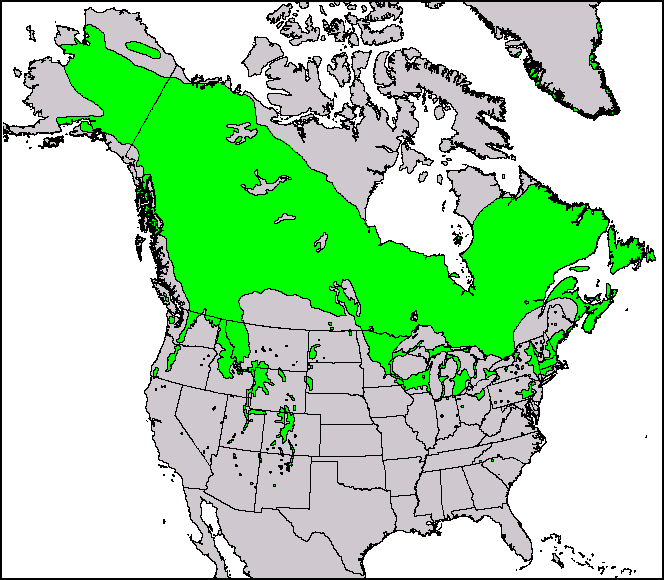

- What are the evolutionary and ecological mechanisms that govern species’ **range margins**?  

- How does **environmental stochasticity** and environmental change interact with density-dependence to generate population dynamics and species distributions?

- How can we upscale detailed processes at the level of individuals (e.g., behavioral interactions) into patterns at the population scale?

- How important is **individual variation** to population, community and ecosystem dynamics?

- How do species and population traits and landscape configuration interact to determine realized **dispersal distances**?  

- To what degree do trans-generational effects on life histories, such as **maternal effects**, impact on population dynamics?

- How does covariance among life-history traits affect their contributions to population dynamics?   


- What is the relative importance of direct (**predation, competition**) vs. indirect (induced behavioural change) interactions in determining the effect of one species on others?    


- What demographic traits determine the **resilience** of natural populations to disturbance and perturbation?  

#### And many more!  

- In what ecological settings are **parasites** key regulators of population dynamics?    
- How does species loss affect the extinction risk of the remaining species?    
- How important are **dynamical extinction-recolonization equilibria** to the persistence of species assemblages in fragmented landscapes?    
- How do **resource pulses** affect resource use and interactions between organisms?    
- How important are rare species in the functioning of ecological communities?    
- What is the magnitude of the **‘extinction debt’** following the loss and fragmentation of natural habitats, and when will it be paid?    
- To what extent will climate change uncouple trophic links due to phenological change?    
- How do natural populations and communities respond to increased frequencies of **extreme weather events** predicted under global climate change?    
- In the face of rapid environmental change, what determines whether species adapt, shift their ranges or go extinct?    
- What determines the rate at which species distributions respond to climate change?    
- Under what circumstances do landscape structures such as **corridors** and **stepping stones** play important roles in the distribution and abundance of species?    
- How do **interspecific interactions** affect species responses to global change?    
- To what extent are widely studied ecological patterns (species-abundance distribution, **species-area relationship**, etc.) the outcomes of statistical rather than ecological processes?    

- How much does modelling **feedbacks** from the observation process, such as the responses of organisms to data collectors, improve our ability to infer ecological processes?    


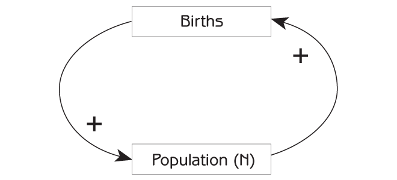

## In-class Exercise: Feedbacks

**Feedbacks** occur when the inflows and outflows (e.g., births and deaths) depend upon the value of the stock (e.g., a wildlife population!). 

Feedbacks are what lead to complex ("interesting") system behaviors.  

A reinforcing, or **positive feedback** (often called a "vicious circle") leads to _exponential growth_, leading often to craziness! If you don't understand this yet, you will see soon enough!

A **negative feedback** is stabilizing, leading to nice, orderly, regulated systems (and homeostasis in organismal biology!).

In the previous in-class exercise the model structure produced linear growth as the [Flow] added to the [Stock].

1. What do the following have in common: snowball, people, rabbits, fire, bacteria, fleas, savings accounts, cancer?  

Let's model this to better understand this process. 

This model adds a **feedback** using a [Link] from the [Stock] to the [Flow]. The [Link] communicates the value of the [Stock] to the [Flow]. A [Link] only communicates value, it doesn't change the value of the [Stock] (that is what a [Flow] does).

2. Open InsightMaker. Create an accumulator with a [Stock] and a [Flow] as you did in the previous model (flow should be an input, not an output) and name them *Stock* and *Flow* for now.  

3. If you mouse over *Stock* or *Flow* a small [$=$ Sign] will appear. If you click this it will open the **Equation** window where you can set values. Open this window for the [Stock], enter a value of 1, then close the window.

4. The value of the [Stock] can be communicated to the [Flow] with a [Link]. To create a [Link], click **Link** in the **Connections** part of the toolbar. When you mouse over the [Stock] click on the right-arrow, drag to the [Flow] and release. You now have a [Link] on top of the [Flow]. Now hold the Shift Key and click in the middle of the [Link] and a little little green node will be created on the [Link]. You can select this node and drag it up so the [Link] isn't directly on the [Flow]. Create a few more nodes on the [Link] and move them to create something more like a curve.

5. Usually there is some type of factor governing the rate the [Stock] influences the [Flow]. Let's introduce a variable named *factor*. To create a variable, right-click on the canvas and select **Variable** from the drop-down. While the [Variable] is still selected rename it *factor*. Now draw a [Link] from *factor* to the [Flow]. Open the [Equation] window for *factor* and set it to 0.5. 

6. Open the **Equation** window for the [Flow] and set it to [Stock] times [factor]. That is, the rate of inflow into the [Stock] is equal to the value of the [Stock] multiplied by the value of *factor*.

7. Now click [Run Simulation] and you have just finished your first reinforcing loop simulation model!

**Q:** If [Stock] is a population -- say, rabbits -- then what is the interpretation of [Flow]? What is the interpretation of [factor]? Rename your variables accordingly and change the parameters to make the more biologically realistic. Run the simulation again. 

10. Just like in the last exercise, set the "Show Value Slider" to Yes for all stocks and flows. Now you can play around with the values, re-running the simulation each time. Think about question 1 while doing this (snowball, people, rabbits, fire, bacteria, fleas, savings accounts, cancer). How would you change the values to represent each of these quantities. Pick 2 or more of these and try it out!

You should notice that the population tends to grow slowly at first and then very rapidly. This is referred to as *exponential growth*. If you've read the first chapter of the Gotelli book, you will recognize this as the _foundational concept of population ecology_!

**Q** Can you model the puffball example from earlier in the lecture? How many giant puffballs are in the population after two generations??

**Q** Can you (approximately) replicate the human population graph at the beginning of this lecture? What is the per-capita growth rate of the human population??

And just for fun, here is a [video](https://www.youtube.com/watch?v=DZCm2QQZVYk) about exponential growth you might want to check out..


[--go to next lecture--](LECTURE3.html)


 


<!--chapter:end:LECTURE2.Rmd-->

---
title: "Malthus and the beginning of Pop Ecol"
author: "NRES 470/670"
date: "Jan 25, 2017"
output: 
  html_document: 
    theme: spacelab
    toc: yes
    toc_float: yes
---

```{r setup, include=FALSE}
knitr::opts_chunk$set(echo = TRUE, cache = TRUE)
```

[Thomas Robert Malthus (1766 – 1834)](https://en.wikipedia.org/wiki/Thomas_Robert_Malthus) was an English cleric who penned one of the most important and influential essays ever written: ***An Essay on the Principle of Population***

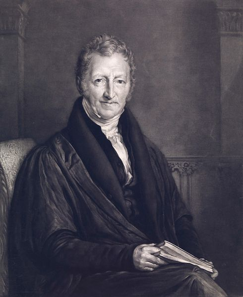

The main point of this essay can be summed up by the following (a direct quote): 

> "The power of population is infinitely greater than the power in the earth to produce subsistence for man" - The Rev. Thomas Malthus

Or in a more verbose form...

> I think I may make fairly two postulata. First, that food is necessary to the existence of man. Secondly, that the passion between the sexes is necessary and will remain nearly in its present state ... Assuming then my postulata as granted, I say, that the power of population is infinitely greater than the power in the earth to produce subsistence for man. Population, when unchecked, increases in a *geometrical ratio*. Subsistence increases only in an *arithmetical ratio*. A slight acquaintance with numbers will show the immensity of the first power in comparison of the second. By the law of our nature which makes food necessary to the life of man, the effects of these two unequal powers must be kept equal. This implies a strong and constantly operating check on population from the difficulty of subsistence. This difficulty must fall somewhere and must necessarily be severely felt by a large portion of mankind...

And his argument can be summed up in this logical argument:

1. That the increase of population is necessarily limited by the means of subsistence,
2. That population does invariably increase when the means of subsistence increase, and,
3. That the superior power of population is repressed by moral restraint, vice and misery

Is this an optimistic message or a pessimistic message?

**Discussion Question:** Was Malthus right? For humans? For wildlife? Can you think of any examples for or against? 


Interestingly, in 1838 (four years after Malthus’ death), Charles Darwin, just back from his trip on HMS Beagle (1831–6), was searching for possible mechanisms to explain the origin of species. On reading Malthus’ *Essay on the principle of population*, he realized the possible implication of the checks that controlled population growth and wrote: 

> “...favourable variations would tend to be preserved, and unfavourable ones to be destroyed ... The result of this would be the formation of a new species. Here, then, I had at last got a theory by which to work.” - Charles Darwin 

Twenty one years later Darwin published his book *On the origin of species by means of natural selection*. It too raised a storm of controversy and protest.

I told you that Mathus' *Essay* was influential!!

## In-class exercise: limits to growth

Malthus was convinced that human population growth would **overshoot** the limit -- that is, populations will grow until they run out of food. What's the result? Starvation, suffering, disease! Let's model this! 

Here is the scenario we will model: if the population exceeds a certain limit, then a famine occurs and 95% of the population dies.

How can we do this in InsightMaker? You already know how to make an exponentially growing population! The new feature we will learn today is a very important programming construct: the **conditional statement**.

Conditional statements are also known as IF-THEN statements. In plain english: *IF some condition is true, THEN do something. ELSE if some other condition is true, THEN do something else. ELSE if none of the previous conditions are true, THEN do something else.*

In today's in-class exercise, we will implement the following conditional statement (the "famine condition"): *IF human population is below the population limit, THEN the annual death rate is 0.01. ELSE if the population exceeds the population limit, a famine arises and the mortality rate jumps to 0.99*

To implement this in InsightMaker, we need to use the following **syntax**:

```
If [Humans]>[Limit] Then
  0.99
Else
  0.01
End If
```

1. Put together a basic exponential-growth model for a new [Stock] named *Humans*. This [Stock] should have two [Flows], one [Flow In] named *Births* and one [Flow Out] named *Deaths*. Both *Births* and *Deaths* should be defined as the product of *Humans* and per-capita rate constants, respectively called *Birth rate* and *Death rate* (each defined on the canvas as [Variables]). This model is identical to the one you made in lab last week. 

2. Initialize the population of *Humans* to 1000. Set the *Birth rate* to 0.1 (humans produced per human per year). Set the *Death rate* to 0.01. Change the settings so that the simulation runs for 100 years.  

3. Run this model, make sure it behaves like you would expect it to (yielding exponential growth!). How many humans are there after 100 years?

4. Now make a new [Stock] called *Limit*, representing the population limit for *Humans*. This could, for instance, represent the *maximum number of humans that could be supported indefinitely if all arable land were cultivated with the most energy-rich crop possible*. 

5. In preparation for implementing the "famine" condition (death rate increases to 99% if *Humans* exceeds *Limit*), create new **Links** from *Humans* to *Death rate* and from *Limit* to *Death rate*. Your canvas should look something like the image below:  

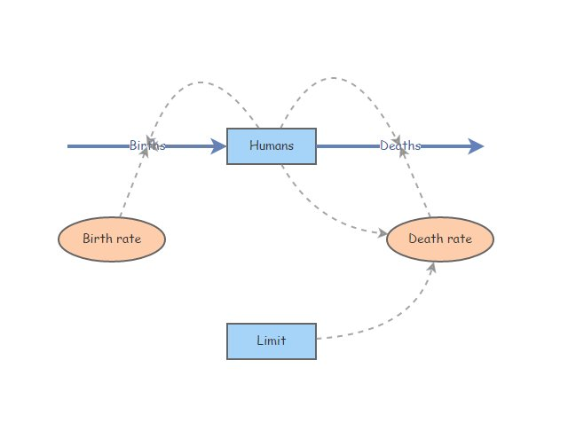

6. Now we can implement the "famine condition"! Open the equation editor window for *Death rate* (click on the equals sign) and type the following: 

```
If [Humans]>[Limit] Then
  0.99
Else
  0.01
End If
```
You don't actually need to type this all in, you can just click on "Programming Functions" in the equation editor, and select "If-Then-Else" from the options.   

7. Run the model and describe what happens.  

**Q** is this population *regulated*?   

**CHALLENGE:** Malthus said that "Population, when unchecked, increases in a *geometrical ratio*. Subsistence increases only in an *arithmetical ratio*." By this he meant that populations grow exponentially, whereas the population limits (food production capacity) grows linearly.   

What happens if the limit were allowed to increase arithmetically? Try to implement this in InsightMaker. That is, can you change the model so that the population limit increases linearly- say, by 1000 per year. What happens then? Can you adjust the parameters to make this simulated human population **sustainable**? Why? Why not?   

Just for fun, here is a [Video](https://www.youtube.com/watch?v=QAkW_i0bDpQ) made by [John Green](https://en.wikipedia.org/wiki/John_Green_(author)) about Malthus and world history!      

... And here's another [video](https://www.youtube.com/watch?v=U7Z6h-U4CmI) about the influential 1972 book, "[Limits to Growth](https://www.amazon.com/Limits-Growth-Donella-H-Meadows/dp/193149858X)", which made the argument that growth is not sustainable- the earth has limits! Does this argument sound familiar?       

[--go to next lecture--](LECTURE4.html)   


 


<!--chapter:end:LECTURE3.Rmd-->

---
title: "Population regulation"
author: "NRES 470/670"
date: "Feb 1, 2017"
output: 
  html_document: 
    theme: spacelab
    toc: yes
    toc_float: yes
---

```{r setup, include=FALSE}
knitr::opts_chunk$set(echo = TRUE, cache = TRUE)
```

## What is density-dependence (D-D)?

Last week we went through the mathematics of exponential growth. This week we will explore basic models of **density dependence**. Exponential growth, as you have seen, leads to craziness. It is not sustainable. As Malthus noted, resources are finite, and at some point or another exponentially growing populations will find their limits. 

**Density**: In D-D, *density* basically refers to the number of con-specific individuals that you are competing with for food. The more you compete with others of your own species, the less favorable your **vital rates** (e.g., per-capita death rate, *d*, increases or per-capita birth rate, *b*, decreases)! As *N* goes up, vital rates take a turn for the worse. 

## Regulation!

First of all, we mentioned in our systems ecology discussion that positive feedbacks are not sustainable, because increase mean faster increases, mean faster increases, etc. (a vicious circle). Density dependence is a kind of feedback, but it is NOT a positive feedback. That's right- it is a *negative feedback*! Which is also known as a *stabilizing feedback*. As we discussed before, negative feedbacks are essential for well-regulated systems. Recall the example of homeostasis in organismal biology. If blood sugar goes up, the body will work to lower it, and vice versa. 

Same with populations. In a regulated population, an increase in abundance will cause a decrease in the population growth rate, and a decrease in abundance will cause an increase in the population growth rate. In population ecology, the latter is often called *compensatory growth*! You can't have a regulated population without some kind of negative feedback. 

**thought Q**: What are some possible mechanisms of density-dependence? That is, why could vital rates become less ideal at higher densities?

**thought Q**: Are all wild populations regulated?

## Logistic growth

Logistic growth can be described mathematically by the following equation: 

$\Delta N = r \cdot N_t \cdot \left ( 1 - \frac{N}{K}  \right )$

This is probably the *second most important equation of population ecology* (after basic exponential growth!). 

We will go into more detail in lab, but Let's break this equation down a bit. 

The first part of this equation looks familiar, right?

$\Delta N = r \cdot N_t$

What about the second part,

$\left ( 1 - \frac{N}{K}  \right )$

You can think about $\frac{N}{K}$ as the *used portion of carrying capacity*

By the same token, you can think about $\left ( 1 - \frac{N}{K}  \right )$ as the *unused portion of carrying capacity*. 

When carrying capacity is mostly unused, _population growth resembles basic exponential growth_! 

When carrying capacity is mostly used up, _population growth resembles_, well..., _no growth at all_!

**Thought Q:** Given the two above statements, can you figure out what population dynamics should look like under logistic growth, starting with a very small population?

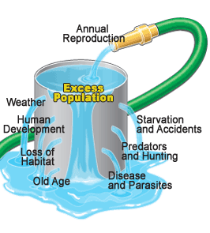

## Carrying capacity is an equilibrium point!

A stock-flow system is at **equilibrium** point is when [Flows In] are equal to [Flows Out]. That is opposing forces cancel each other out.   

As Gotelli shows, and we will go over in detail, you can derive the logistic growth equation by making *b* and *d* (from the standard population growth equation) both linearly dependent on density:

$b=b_{max}-a*[Density]$

where $b_{max}$ is the maximum, or ideal, per-capita birth rate and $a$ is the density dependence term.

Similarly,

$d=d_{min}+c*[Density]$

where $d_{min}$ is the minimum, or ideal, per-capita death rate (1-maximum survival rate) and $c$ is the density dependence term.

We can plot these equations out in R:

```{r}
Density <- seq(0,500,1)  # create a sequence of numbers from 0 to 500, representing a range of population densities

## CONSTANTS

b_max <- 0.8  # maximum reproduction (at low densities)
d_min <- 0.3  # minimum mortality 

a <- 0.001    # D-D terms
c <- 0.0005

b <- b_max - a*Density
d <- d_min + c*Density

plot(Density,b,type="l",col="green",lwd=2,ylim=c(0,1),main="Density-Dependence!")
points(Density,d,type="l",col="red",lwd=2)
legend("bottomleft",col=c("green","red"),lty=c(1,1),legend=c("per-capita birth rate","per-capita mortality"),bty="n")

  
  
  
```

**Thought Q**: What is the equilibrium point in this system? That is, what is the (non-zero) abundance/density at which population growth is equal to zero??

This equilibrium is known as **K**, or **carrying capacity**?

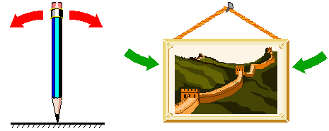

## Stable and non-stable equilibria

A **stable equilibrium**, when perturbed, returns to the equilibrium point

A **non-stable equilibrium**, when perturbed, does NOT return to the equilibrium point 

Is the image on the left a stable or a non-stable equilibrium??

What about the image on the right?

What about **K**, or **carrying capacity**?

Let's find out!

## In-class exercise: logistic growth

First of all, from now on try to start saving your working InsightMaker models, since we will often be building from previous models (so we don't have to start from scratch every class!). To build off of a previous Insight, open a previous Insight (e.g., your basic exponential growth model) and choose "Clone Insight" in the upper right corner to create a copy that you can edit. 

Here is the scenario we will model: both *b* and *d* are **density-dependent**. We will replicate the model from the R code and figure above- this time in InsightMaker! 

```
CONSTANTS
- [Maximum per-capita birth rate] = 0.8 individuals per individual per year   
- [Minimum per-capita death rate] = 0.3 individuals per individual per year    
- [Density dependence on fecundity] (a) = 0.001    
- [Density dependence on mortality] (c) = 0.0005  
```

```
EQUATIONS
- [Per-capita birth rate] = [Maximum per-capita birth rate] - [Density dependence on fecundity] * [Turtles] 
- [Per-capita death rate] = [Minimum per-capita death rate] - [Density dependence on mortality] * [Turtles] 
```

How can we do this in InsightMaker? 

1. Load a basic exponential-growth model. Rename the main [Stock] *Box Turtles*. This [Stock] should have two [Flows], one [Flow In] named *Births* and one [Flow Out] named *Deaths*. Both *Births* and *Deaths* should be defined as the product of *turtles* and per-capita rates, respectively called *Births per capita* and *Deaths per capita* (each defined on the canvas as [Variables]). This model should be very familiar!! 

2. Initialize the population of *Turtles* to 5 (way below carrying capacity).   

3. Make four new [Variables] on the canvas, to represent the four constants in our model.   

4. Set the *Maximum per-capita birth rate* to 0.8 (turtles produced per turtle per year). Set the *Minimum per-capita Death rate* to 0.3. Set the *Density dependence on fecundity* to 0.001.  Set the *Density dependence on mortality* to 0.0005.  

5. Make the appropriate connections, as in the figure above, and use the equation window to make sure the equations are correct.   

6. Change the settings so that the simulation runs for 100 years.   

Your model should look something like this! (if you don't already have a model like this, clone [this model](https://insightmaker.com/insight/70353/Logistic-Growth-1#))


7. Run this model. Does the model behave as you would expect?   

**Q:** What happens if population size starts out *at* carrying capacity?    
**Q:** What happens if population size starts out *above* carrying capacity?     
**Q:** Is this a stable equilibrium?     
**Q:** Can a wild population ever be at a non-stable equilibrium? What about a stable equilibrium?    

8. Consider the basic logistic growth equation:   

$\Delta N = r \cdot N_t \cdot \left ( 1 - \frac{N}{K}  \right )$

Pull up your InsightMaker model for basic logistic growth with an $r_{max}$ term (double-headed arrow). Or you can clone it from [here](https://insightmaker.com/insight/71146/Basic-logistic-growth-rmax). It should look something like this:

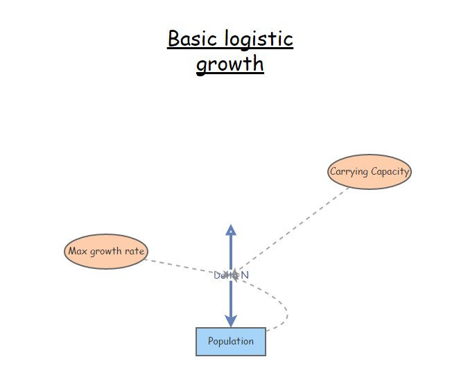

Make your initial population size very small compared to carrying capacity.     

**Q:** What happens if $r$ is zero? What happens to carrying capacity?  
**Q:** Which population is more likely to be found at or near K in nature? A population with very large $r$ or very small $r$?   

**Q:** Is a high value of $r$ good or bad for conservation?


[--go to next lecture--](LECTURE5.html)


<!--chapter:end:LECTURE4.Rmd-->

---
title: "Passenger Pigeon/Allee effect"
author: "NRES 470/670"
date: "Feb 1, 2017"
output: 
  html_document: 
    theme: spacelab
    toc: yes
    toc_float: yes
---

```{r setup, include=FALSE}
knitr::opts_chunk$set(echo = TRUE, cache = TRUE)
```

## Allee Effect


What happens if density dependence goes the other way? What if an decrease in density changes vital rates to produce an *decrease* in the population growth rate *r*? 

Imagine a very social species, like prairie dogs. If the density is high, they can warn each other about predators. If the density is low, the predation rate might go up, resulting in higher *d*. This is a positive feedback, and can result in, well, you should simulate it for yourself! But remember, positive feedbacks generally result in unstable or non-regulated systems!

This effect -- whereby population growth rate may **decrease** when population size decreases -- is called an **Allee effect**, named after ecologist [Warder Clyde Allee](https://en.wikipedia.org/wiki/Warder_Clyde_Allee) (1885-1955). Allee specialized in social behavior and aggregations, and recognized the benefits of social aggregations to individual fitness.

Interestingly, Allee's interest in cooperation and the benefits of social aggregations spilled over into his life in other ways. He was an anti-war activist!


One of the most famous examples of a possible Allee effect involves the passenger pigeon (*Ectopistes migratorius*).  


The [passenger pigeon](https://en.wikipedia.org/wiki/Passenger_pigeon) was one of the most abundant birds in North America. Some estimate that the total species abundance may have been over three *billion*!

Aldo Leopold once said,

> “Men still live who, in their youth, remember pigeons; trees still live who, in their youth, were shaken by a living wind. But a few decades hence only the oldest oaks will remember, and at long last only the hills will know.”   —Aldo Leopold, “On a Monument to the Pigeon,” 1947

What happened to the passenger pigeon? Well, first of all pigeons were hunted on a massive scale using wasteful methods. 

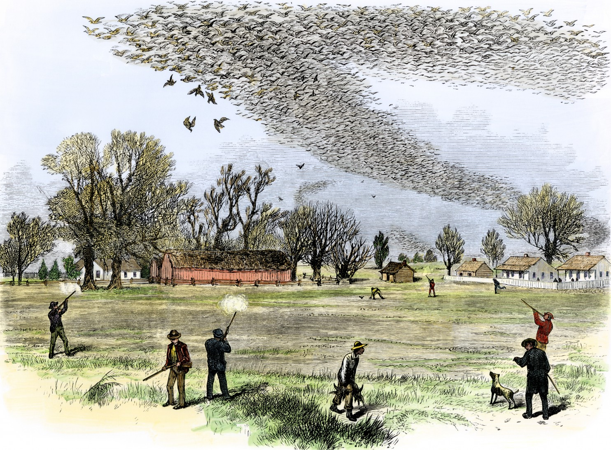

Secondly, hardwood forests were cleared on a massive scale, reducing habitat.   

But what do passenger pigeons have to do with the Allee effect? Well, they were an *extremely* gregarious species. Once their numbers dwindled (due to hunting and clearcutting) their social systems broke down, and they could no longer effectively reproduce or avoid predators.   

## In-class exercise: Allee effect

In this exercise we will explore the implications of **positive density dependence** on vital rates. 

1. In InsightMaker, load up the logistic model with vital rates -- that is, where $b$ and $d$ are each modeled density-dependent.  It should look something like this (or if you don't already have this, load it from [here](https://insightmaker.com/insight/70353/Logistic-Growth-1#)):


2. Now add a new [Variable] called *Allee threshold*. Set this variable equal to 200.

3. As for the other parameters, set them as follows:    

- Initial abundance: 201 (just above the Allee threshold) 
- Density dependence on birth rate: 0.004    
- Density dependence on survival: 0.001   
- Max birth rate: 0.8   
- Min mortality: 0.3   

4. Now let's use a *Conditional (IF-THEN-ELSE) statement* to specify an Allee effect. The population experiences maximum growth rate at the Allee threshold. If the population is above the Allee threshold, the population exhibits (stabilizing) negative density dependence. If the population is below the Allee threshold, then the population experiences positive density dependence- whereby individuals in smaller populations have *lower* overall fitness. 

To do this, define your *Births per Capita* using the following syntax:

```
If [Pigeons]<[Allee threshold] Then
  [Max fecundity]-[Density dependence on fecundity]*([Allee threshold]-[Pigeons])
Else
  [Max fecundity]-[Density dependence on fecundity]*([Pigeons]-[Allee threshold])
End If
```

Similarly, define your *Deaths per capita* using the following syntax:

```
If [Pigeons]<[Allee threshold] Then
  [Min mortality]+[Density dependence on survival]*([Allee threshold]-[Pigeons])
Else
  [Min mortality]+[Density dependence on survival]*([Pigeons]-[Allee threshold])
End If
```

5. If we are running out of time in class (which we probably will be!), load the model (and clone it!) using [this link](https://insightmaker.com/insight/71147/Allee-Effect-1#)!    

Now you can try to answer the following questions:


**Q**: What is the carrying capacity (K) for this population? 

**Q**: Carrying capacity (K) represents one equilibrium point in this model. Try to find another equilibrium point- that is, a point where the population neither grows nor declines.   

**Q**: is this equilibrium a *stable equilibrium* or an *unstable equilibrium*? 

**Q**: if you plot birth and death rates as a function of density in this model, can you identify the two equilibria?

**Q:** Why do Allee effects generally spell bad news for wildlife conservation and management?  


And just for fun, here is an article about [the passenger pigeon and its possible "de-extinction"](http://www.audubon.org/magazine/may-june-2014/why-passenger-pigeon-went-extinct)

**Q:** Do you support bringing back the passenger pigeon? Why or why not??


[--go to next lecture--](LECTURE6.html)


<!--chapter:end:LECTURE5.Rmd-->

---
title: "Age-structured populations"
author: "NRES 470/670"
date: "Feb 8, 2017"
output: 
  html_document: 
    theme: spacelab
    toc: yes
    toc_float: yes
---

```{r setup, include=FALSE}
knitr::opts_chunk$set(echo = TRUE, cache = TRUE)
```

## When $d$ and $b$ depend on more than just density...


Take this Indian elephant for example. How does reproductive rate depend on age in this case?

We might imagine it looks something like this!

```{r}
Elephant_age <- seq(0,60,by=2)

Birth_rate <- c(rep(0,times=7),seq(0,0.3,length=4),rep(0.3,times=15),seq(0.3,0,length=5))

names(Birth_rate) <- Elephant_age

barplot(Birth_rate,xlab="Age",ylab="b, per-capita birth rate",col="blue")

```


What about per-capita death rates for a tortoise? We might imagine something that looks like this...

```{r}
Tortoise_age <- seq(0,120,by=5)

Death_rate <- c(seq(0.7,0.05,length=5),seq(0.05,0.05,length=16),seq(0.05,0.5,length=4))

names(Death_rate) <- Tortoise_age

barplot(Death_rate,xlab="Age",ylab="d, per-capita death rate",col="blue")

```

So, for many species per-capita birth rate and death rate are fundamentally dependent on age!


**Thought Q:** Imagine you were trying to re-establish a population of spadefoot toads. You take 1000 tadpoles from a captive population and place them in a temporary wetland right after a rainstorm. What would population growth look like over the next few years, assuming the reintroduction strategy was successful? 


**Thought Q:** Imagine a population of 100 golden-headed lion tamarins (*Leontopithecus chrysomelas*) that consists of all adult males and post-reproductive females. What is the conservation status of this population?  

## Life table!

Age structured populations are often represented by a table called a **life table**, which looks something like this:

```{r include=FALSE}
lifetable <- read.csv("life_table.csv")
```

```{r results='asis', echo=FALSE}
knitr::kable(lifetable,caption="",col.names = c("x","S(x)","b(x)","l(x)","g(x)"))

```

### Fecundity schedule

The fecundity component of the life table is called the "fedundity schedule"! The term $b(x)$ represents per-capita fecundity rate for females of age x.  

### Survivorship schedule

Fecundity is only half the story! The survival component of the life table is called the "survivorship schedule"! 

The term **cohort** represents a bunch of individuals that were all born at the same time. In the life table, the term S(x) refers to the number of individuals from a particular cohort that are _still alive at age x_. From this raw data, we compute two terms, called **survivorship** and **survival rate**

The term $l(x)$ represents the _probability of survival to age x from age 0_. This is called **survivorship**

The term $g(x)$ represents the _probability of surviving from age x to age x+1_. This is called **survival rate** 

### Types of survivorship schedules...

There are three main types of survivorship schedules, classified as **Type I**, **Type II**, and **Type III**. 

Survivorship curves describe how survivorship ($l(x)$) drops off with age. These three types of **life history** pattern can be illustrated with three real-world examples: humans, songbirds, and frogs. 


#### Type I


#### Type II


#### Type III


**Thought Q:** Which survivorship curve is the most common in nature??


## In-class exercise: age-structured population growth

In this exercise we will explore some facets of **age-stuctured populations**. 

1. Load up the life table from earlier in this lecture, by clicking [here](life_table.csv). Use this table to compute the **net reproductive rate, $R_0$**. This represents the mean number of female offspring produced per female over her entire lifetime. This is also known as *lifetime reproductive potential*! This can be computed as:

$R_0 = \sum_{x=0}^k l(x)\cdot b(x)$

Where $k$ is the maximum age. 

**Q:** Can you implement this formula in Excel? What's the answer?

2. If the net reproductive rate, $R_0$ is positive, then the population is above the **replacement rate** of 1, and therefore the population will grow. If $R_0$ is negative, then the population will decline. This sounds familiar, right? Just like the finite rate of growth, $\lambda$. 

BUT, what is the time frame of $R_0$? What is the timeframe of $\lambda$? They are different right? The difference is that $R_0$ describes growth per **generation**!. 

What is a **generation**? The most common definition (for generation time) is the _Average age of the parents of all the offspring produced by a single cohort_. This can be computed from the life table as:

$G = \frac{\sum_{x=0}^{k}l(x)\cdot b(x)\cdot x}{\sum_{x=0}^{k}l(x)\cdot b(x)}$

See if you can implement this in Excel (or whatever spreadsheet software you use!).

**Q:** What is the *generation time* of the population in the table?

3. Now, can you compute the *intrinsic rate of growth* ($r$) for this age-structured population? 

To a first-order approximation, you can use this equation:

$r = \frac{ln(R_0)}{G}$ 

Just looking at this equation, you see that organisms with longer generation times ($G$) have slower intrinsic rates of growth, all else being equal. 

**Q:** Implement this equation in Excel. Is this an exponentially growing population?

4. Load up an age-structured model in InsightMaker. You can clone [this one,  here](https://insightmaker.com/insight/70809/Age-structured-population). 


    4a. Initialize the population like the spadefoot toad example from above- with only the first (juvenile) age class. What population dynamics occur at the beginning of the simulation? What about the end of the simulation?
    
    4b. Can you tweak the initial abundance of juveniles, subadults and adults so that the population exhibits smooth exponential growth for all three age classes? This is called **Stable Age Distribution**
    
    4c. Now change the vital rates (*Juv mort rate*, *Sub mort rate*, *Transition rate to Subadult*, etc.). Is the population growth still smooth? If not, can you find the *Stable Age Distribution* now??
    
    4d. Now change the **Simulation time step** to 5 years, and return to an initial population with only juveniles. What happens? Is this a **stochastic** model? If not, why does it look like it has a random component?  

[--go to next lecture--](LECTURE7.html)


<!--chapter:end:LECTURE6.Rmd-->

---
title: "Matrix population models"
author: "NRES 470/670"
date: "Feb 11, 2017"
output: 
  html_document: 
    theme: spacelab
    toc: yes
    toc_float: yes
---

```{r setup, include=FALSE}
knitr::opts_chunk$set(echo = TRUE, cache = TRUE)
```

### Upcoming midterm exam

**when and where** The first midterm exam (out of two) is coming up on **February 23**. You will have the whole 50 minute class period to take the exam. Margarete and I will be at a meeting- one of my graduate students will fill in. The exam will be in our regular classroom. 

**what** The exam will cover:

- All material in Chapters 1-3 of the Gotelli book.   
- All material covered in lectures up to the "Stochasticity and Uncertainty" lecture (right after matrix population models).   
- All material covered in labs 1-4.    
- All additional assigned readings, including Ch. 1 of "Beyond Connecting the Dots", Lande 1992, Heppell 1998 and Regan et al. 2002.    

*The exam will consist of a mixture of multiple-choice and short-answer questions.*  

Any questions?

### Final projects:

Just a heads up about [final projects](FINAL_PROJECTS.html)

## Why matrices? 

### Reason 1: simplify!

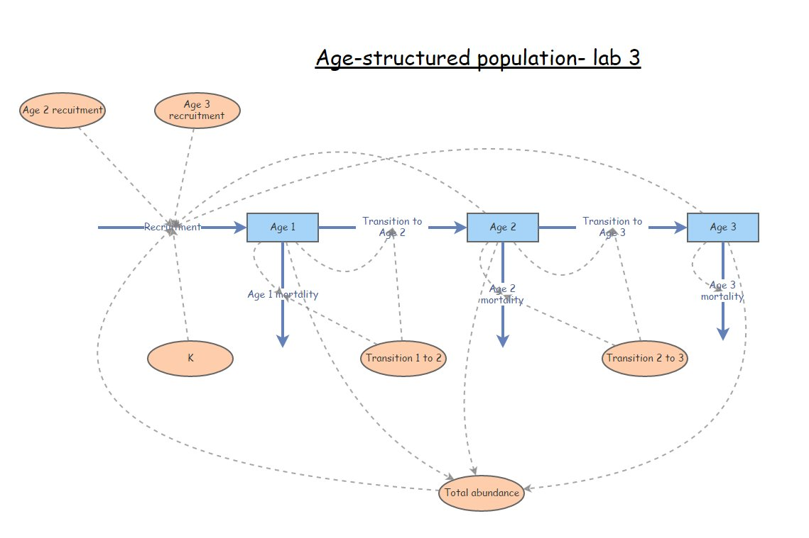

You might recognize this InsightMaker model from Lab 3. This represents an age-structured population with only three age classes. Imagine if there were five age classes, or 10? How many lines would you have to draw, how many equations would you have to put in different flows. It would be tedious, and you could easily run into errors that would be very hard to debug! 


Consider the teasel example from Gotelli. How tedious would this be to implement in InsightMaker? And this is far from the most complicated populations out there (although notice that plants can do some things that animals can't do- for instance go backwards in "age". There MUST be an easier way!

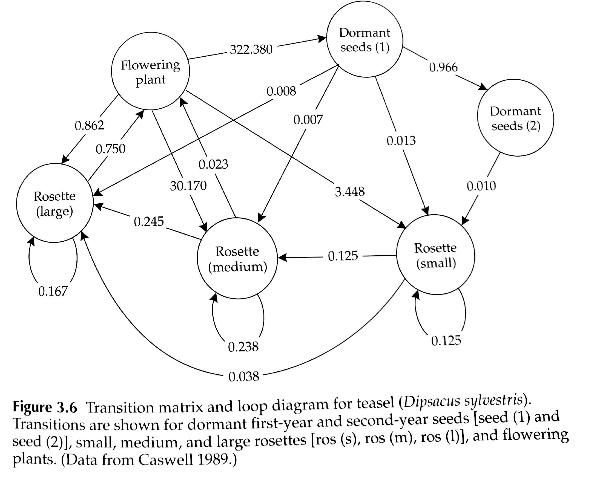

The population vital rates for pretty much any age-structured or stage-structured population can be represented by a **transition matrix**, which summarizes all the information about mortality, birth rates, and transitions between stages! (and the fact that a life history like teasel can be represented by a transition matrix illustrates the generality of this concept!)

For example, the teasel vital rates can be summarized in this matrix:

```{r echo=FALSE}
teasel <- read.csv("teaselmatrix1.csv", header=T)
teasel <- teasel[,-1]
teasel_matrix <- as.matrix(teasel)
colnames(teasel_matrix) <- names(teasel)
rownames(teasel_matrix) <- names(teasel)
teasel_matrix

```

Isn't that *elegant*!!

We'll go into more detail about matrices later!

### Reason 2: projection!

In one of the questions in Lab 3, your were asked to use a life table to project the age structure of a population one time step in the future. Was it simple and straightforward to do this? (no!)

Life tables are great for summarizing the vital rates of age-structured populations. But _life tables are not great for projecting age-structured abundance into the future_!

You know what *is* great for projecting age-structured abundance into the future?  

For example, let's project a teasel population 1 year into the future:

First of all, we need to begin with a teasel population...

```{r echo=F}
Initial_teasel <- matrix(c(1000,1500,200,300,600,25),ncol=1)
rownames(Initial_teasel) <- rownames(teasel_matrix)
colnames(Initial_teasel) <- "Abundance"
Initial_teasel

```

Then all we need to do is matrix-multiply this **vector** of abundances by the **transition matrix** from above! Each time we do this multiplication step, we advance one year!

Here's how we can do this in R!

```{r}

Year1 <- teasel_matrix %*% Initial_teasel
Year1
  
```

How easy is that!

To compute teasel abundance in year 2, we can simply repeat:

```{r}
thisYear <- Year1
nextYear <- teasel_matrix %*% thisYear
nextYear

```

We could use this strategy to simulate for ten years for example...

Notice the use of a **for loop** here!

```{r}
nYears <- 10
tenYears <- matrix(0,nrow=6,ncol=nYears+1)
rownames(tenYears) <- rownames(Initial_teasel)
colnames(tenYears) <- seq(0,10)
tenYears[,1] <- Initial_teasel 

for(t in 2:(nYears+1)){
  tenYears[,t] <-  teasel_matrix %*% tenYears[,t-1]
}

tenYears

```

Finally, we can plot out the abundance of each stage over 10 years!

```{r echo=FALSE}

plot(1,1,pch="",ylim=c(0,60000000),xlim=c(0,11),xlab="Years",ylab="Abundance",xaxt="n")
cols <- rainbow(6)
for(s in 1:6){
  points(tenYears[s,],col=cols[s],type="l",lwd=2)
}
axis(1,at=seq(1,11),labels = seq(0,10))
legend("topleft",col=cols,lwd=rep(2,6),legend=rownames(tenYears))

```

So projection is easy!

### Reason 3: Linear algebra tricks!

There is a clear similarity between the finite population growth equation:

$N_{t+1}=\lambda \cdot N_t$,

where $N$ is abundance (as always), $t$ is time, often in years but could be any time units, and $\lambda$ is the multipicative growth rate over the time period $t \rightarrow t+1$

... and the matrix population growth equation:

$\mathbf{N}_{t+1} = \mathbf{A} \cdot \mathbf{N}_{t}$,

where $\mathbf{N}$ is a **vector** of abundances (abundance for all stages), and $\mathbf{A}$ is the **transition matrix**, which we have seen before.

**Q:** Can you see the similarity between these two equations? 

Both equations describe simple exponential growth or decline!

**Q:** Can you see the difference between these two equations?

Note that $N$ in the first equation is a **scalar** -- that is, it is just a naked number with no additional components. 

WHEREAS,

$\mathbf{N}$ in the second equation is a **vector**, a set of abundances structured by age or stage class.

Similarly, the finite population growth rate, $\lambda$ is a scalar,

WHEREAS,

$\mathbf{A}$ is a **matrix**

#### What about those tricks??

Okay one of the nifty tricks is this:

> In one step, you can compute $\lambda$ from $\mathbf{A}$!!

All you need to do is obtain the _first, or dominant, **eigenvalue** of $\mathbf{A}$_! This number is the finite rate of growth, $\lambda$, for an age or stage-structured population. 

Let's do this in R!

What is the growth rate $\lambda$ for the teasel population. If you recall, it looked like it was growing, so it should be above 1...

```{r}
Lambda <- as.numeric(round(eigen(teasel_matrix)$values[1],2))
Lambda
```

Or we could use the handy "popbio" package in R:

```{r}
library(popbio)
lambda(teasel_matrix)
```


You don't have to understand the math here- but I do want you to understand how simple that was- just one line of code and we computed the annual rate of growth from the teasel transition matrix!

Here's another nifty trick:

> In one step, you can compute **stable age distribution** from $\mathbf{A}$!!

All you need to do is obtain the _right-hand eigenvector of $\mathbf{A}$_! This vector represents the _relative abundances in each age class at the stable age distribution_. 

Let's do this in R!

What is the stable age distribution for the teasel population. If you recall, the first seed stage looked like it dominated in the figure above.

```{r}
SAD <- abs(as.numeric(round(eigen(teasel_matrix)$vectors[,1],3)))
SAD/sum(SAD)
```

Or you can use the 'popbio' package in R:

```{r}
library(popbio)
stable.stage(teasel_matrix)

```

**Q:** Does a stage-structured population grow at the rate of $\lambda$ per time step if it is NOT at stable age distribution? 


For more on this, the bible of matrix population models is [this book by Hal Caswell](https://www.amazon.com/gp/huc/view.html?ie=UTF8&newItems=C1DH1414B1C6AK%2C1).


## Mechanics of matrix population models

Let's take a look at a basic age-structured population -- specifically the in-class example from the last lecture ([this one](https://insightmaker.com/insight/70809/Age-structured-population).). In InsightMaker it looks like this:

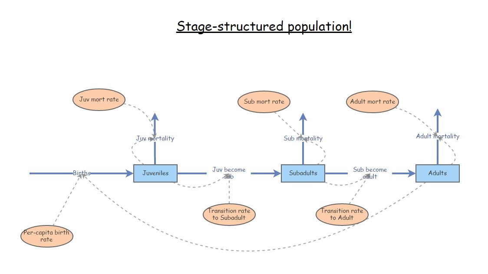

Let's convert the vital rates to a three-stage **projection matrix**.  Projection matrices are **square matrices** where the number of rows and columns are equal to the number of life stages. In this case, that means three! Let's make a blank matrix for now:

```{r}
TMat <- matrix(0,nrow=3,ncol=3)
stagenames <- c("Juveniles","Subadults","Adults")
rownames(TMat) <- stagenames
colnames(TMat) <- stagenames
TMat
```

You can read the **elements** of a transition matrix as follows:

> "The per-capita production of _(row name)_ by _(col name)_ is _(value of element)_"

Now we can start filling in this matrix. Let's begin with the top left **element** of the matrix. This represents the per-capita transition rate from Juveniles (col) to Juveniles (row). What is the value of this? 

Let's update our transition matrix:

```{r}
TMat[1,1] <- 0.1
TMat
```

How about the second row, first column. This represents the per-capita production of Subadults (row) by Juveniles (col). This is the transition rate from juvenile to subadult. The value from our model is 0.3. 

Let's update our transition matrix:

```{r}
TMat[2,1] <- 0.3
TMat
```

If we keep going, we get the following matrix. See if you can understand what this matrix is saying about the transitions from and two the three life stages. 

```{r}
TMat[,1] <- c(0.1,0.3,0)
TMat[,2] <- c(0,0.4,0.1)
TMat[,3] <- c(4,0,0.85)
TMat
```

Now we can run a 40-year projection and compare it with the InsightMaker model. It had better look the same!!

First we must specify the initial abundances in each stage:

```{r}
InitAbund <- c(40,0,0)
names(InitAbund) <- colnames(TMat)
InitAbund
```

So we are starting with only Juveniles...

```{r}
nYears <- 40
allYears <- matrix(0,nrow=nrow(TMat),ncol=nYears+1)
rownames(allYears) <- rownames(TMat)
colnames(allYears) <- seq(0,nYears)
allYears[,1] <- InitAbund 

for(t in 2:(nYears+1)){
  allYears[,t] <-  TMat %*% allYears[,t-1]
}

allYears

```


Now let's plot it out!

```{r}

plot(1,1,pch="",ylim=c(0,50),xlim=c(0,nYears+1),xlab="Years",ylab="Abundance",xaxt="n")
cols <- rainbow(3)
for(s in 1:3){
  points(allYears[s,],col=cols[s],type="l",lwd=2)
}
axis(1,at=seq(1,nYears+1),labels = seq(0,nYears))
legend("topleft",col=cols,lwd=rep(2,3),legend=rownames(allYears))

```

Does this look the same as the InsightMaker results?

## Limitations of matrix population models

Matrix population models are great, but they have some limitations too. 

### What about density-dependence?

In some ways, while introducing a new level of realism in our models -- age-structure -- we have been ignoring another type of realism that we introduced in earlier lectures- **density-dependence**!

Which vital rates are density-dependent? All? Some? It depends? Are the data available?

How do you incorporate density-dependence into a matrix population model?  

How do you incorporate predator-prey dynamics into a matrix population model?

_Whatever you can do with a matrix population model, you can also do in InsightMaker (or other programming platform)_

The reverse is NOT true: **you can not always convert InsightMaker models to matrix population models**

Hmmm....


### In-class exercise: matrix projection models

Translate the following paragraph into a matrix population model. Remember a matrix population model has two components- an **initial abundance vector** and a **transition matrix**.  


> We assumed that the Red-tailed hawk life history could be described in terms of three major life stages: hatchling, juvenile, and adult (generally the third year of life and beyond). Adults are the primary reproductive stage, and produce an average of 3 new hatchlings each year. Juveniles tend to produce only 1 new hatchling per year on average. We assumed that adults experienced an average of 18% mortality each year. Juvenile mortality was set at 30% per year. Approximately 5% of juveniles fail to transition to adults, remaining in the juvenile phase. Finally, hatchlings had a 20% chance of surviving and transitioning to become juveniles. We initialized the population with 1000 hatchlings, 150 juveniles, and 5 adults. 

**Q:** What does the transition matrix look like?

**Q:** What does the initial stage abundance vector look like?

**Q:** Is this at a stable stage-distribution?

**Q:** What is the growth rate of this population? 

And finally, check this out- this is a database of thousands of stage matrices for plants and animals around the world:

[COMADRE and COMPADRE databases](https://compadredb.wordpress.com/2015/10/05/introducing-the-comadre-animal-matrix-database/)


[--go to next lecture--](LECTURE8.html)


<!--chapter:end:LECTURE7.Rmd-->

---
title: "Stochasticity and Uncertainty"
author: "NRES 470/670"
date: "Feb 12, 2017"
output: 
  html_document: 
    theme: spacelab
    toc: yes
    toc_float: yes
---

```{r setup, include=FALSE}
knitr::opts_chunk$set(echo = TRUE, cache = TRUE)
```


## Uncertainty!

All ecological systems are full of uncertainty. We all know it intuitively. But what *exactly* do we mean by that? And how can we deal with it? How can we incorporate it into our models? 

This is one of the most important modules in this course. But it is not in the Gotelli book, nor is it in highlighted in most ecology textbooks.

### A taxonomy of uncertainty

There are two major reasons we can be uncertain. Either we _lack sufficient knowledge_ or the _system itself is variable and unpredictable_. Let's explore these two types of uncertainty.

- **You lack sufficient knowledge**. This is also known variously as *sampling uncertainty*, parameter uncertainty, structural uncertainty, and more. If you collected more data you could in principle make a better model that more closely represents reality.

- **The system is inherently unpredictable**. This is also known as **randomness** or **stochasticity**. No matter how much we study a coin, we will not be able to predict outcome of a coin flip any better than 50-50 (at least let's just say that's the case for now). Ecological systems have inherent variability. We can't predict with certainty whether or not an individual will mate, or die. We can't really even be certain whether next year or the year after that will be a good year or a bad year for offspring production or mortality in general!

## How to deal with uncertainty
The key is to **embrace uncertainty**. As population ecologists, we have three major tools to help us manage and account for uncertainty in our study systems:

### Uncertainty analysis

1. First, what if we simply don't have enough data to build a perfect model? This is an example of *lacking sufficient knowledge*. In this case, the tool we use is called **uncertainty analysis**. Basically, we try all plausible values (or just the minimum and maximum value) and see what happens to our study system (e.g., does the population go extinct? decline?). You should know -- the term "sensitivity analysis" is often used for this concept, but InsightMaker uses this term in a different way (basically referring to multiple replicates of stochastic models) -- so we will refer to this as "uncertainty analysis" to avoid confusion)

### Stochastic models (two main types)

2. Second, we usually can't predict whether an individual will live or die, breed or not breed (whether an individual will "get lucky" so to speak!)? We might know the per-capita *probability* of breeding, or the *probability* of dying, or the per-capita *rate* of offspring production, or the probability of a given offspring being female. But when it comes to projecting who lives and dies, who gives birth and who doesn't, how many females are born, we _just can't know for sure_. This is an example of a system being *inherently unpredictable*. In population ecology this is called **demographic stochasticity**. In this case, the tool we use is **computer-simulated "coin flipping"**.

3. Third, we usually can't predict whether next year or the year after will be a good one or a bad one for a population- that is, whether the per-capita vital rates (e.g., $b$, or $d$ or $r$) will be more or less optimal year-to-year (whether a _population_ will "get lucky", so to speak). This is another example of a system being *inherently unpredictable*. In population ecology this is called **environmental stochasticity**. In this case, the tool we use is **randomly varying vital-rates**. 


## Random number generation
To incorporate uncertainty and randomness into our models, we need to include *stochastic* components so that each model run (replicate) -- or each year of each model run -- is different from one another. That is, we need to include at least one **random number generator** in our models! A random number generator is like a box of (potentially infinite) possible numbers -- a lottery ball machine for example! Each time we want a new number we reach in and pull one out, record the number, put it back in and shake it up again.

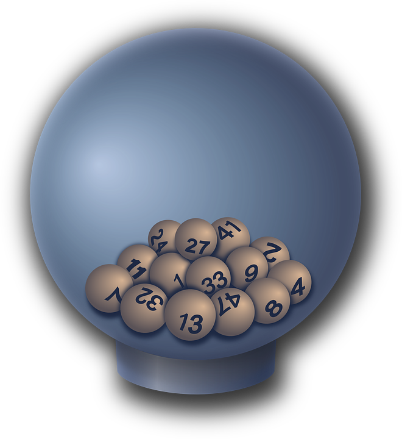


Every random-number generator has a **distribution**. This is a way of defining what exactly is in the box. For example, the box might have 10 "ones", 5 "twos", and 2 "threes". In this case the distribution looks like this (*probability* of each *possibility*):

```{r echo=FALSE}
box <- c(rep(1,10),rep(2,5),rep(3,2))
barplot(table(box)/sum(table(box)),ylab="probability",xlab="possibility")

```


A probability distribution can be pretty much anything you want it to be. However, there are several key distributions that come up again and again in nature, and we should know them!

### Probability distributions

### Discrete vs. continuous
In *discrete distributions*, each outcome has a specific probability (like the probability of flipping a coin 10 times and getting 4 heads). For example, let's consider a *binomial distribution*  

```{r echo=FALSE}
#rbinom(10,10,0.3)    # the random numbers have no decimal component

             # plot a discrete distribution!
xvals <- seq(0,10,1)
probs <- dbinom(xvals,10,prob=0.3)
names(probs) <- xvals
               
barplot(probs,ylab="Probability",xlab="Possibilities",main="Binomial distribution (discrete)")

#barplot(cumsum(probs),ylab="Cumulative Probability",main="Binomial distribution (discrete)")   # cumulative distribution

#sum(probs)   # just to make sure it sums to 1!  Does it??? 

```


Another discrete distribution we will use in this class is the *Poisson distribution*:

```{r echo=FALSE}

             # plot a discrete distribution!
xvals <- seq(0,10,1)
probs <- dpois(xvals,lambda=2.2)
names(probs) <- xvals
               
barplot(probs,ylab="Probability",xlab="Possibilities",main="Poisson distribution (discrete)")


```


In *continuous distributions*, there is an infinite set of possibilities in our random-number box.  

Let's consider the *uniform distribution*: 

```{r}

lower = 0
upper = 10

curve(dunif(x,lower,upper),0,10,ylab="Probability (density)",xlab="Possibilities",main="Uniform distribution (continuous)",ylim=c(0,1))   # probability density

```

This isn't a very intersting looking distribution. All possible numbers from 0 to 10 are equally probable.

Another continuous distribution you should know is called the *Normal distribution*. This distribution has a lower bound of $-\infty$ and an upper bound of $\infty$.

**Q** What population parameter might this distribution be useful for modeling?

```{r}
mean = 7.1
stdev = 1.9

curve(dnorm(x,mean,stdev),0,15,ylab="Probability (density)",xlab="Possibilities",main="Normal distribution (continuous)")   # probability density

```

Another continuous distribution you should know is called the *Lognormal distribution*. This distribution has a lower bound of zero and an upper bound of $\infty$.

**Q** What population parameter might this distribution be useful for modeling?

```{r}
meanlog = 1.4
stdevlog = 0.6

curve(dlnorm(x,meanlog,stdevlog),0,15,ylab="Probability (density)",xlab="Possibilities",main="Lognormal distribution (continuous)")   # probability density

```

Another continuous distribution you should know is called the *Beta distribution*. This distribution has a lower bound of zero and an upper bound of 1.

**Q** What population parameter might this distribution be useful for modeling?

```{r}
shape1 = 10
shape2 = 4

curve(dbeta(x,shape1,shape2),0,1,ylab="Probability (density)",xlab="Possibilities",main="Beta distribution (continuous)")   # probability density

```

### Explore distributions in R

Let's play around with distributions a little using R- you can access a web-based version of R called  [R-fiddle](http://www.r-fiddle.org/#/).

Note that all these distributions are also available to you in InsightMaker. 

Here's some R syntax for you!

Note that R random number generators start with the letter "r" -- for "random".

The first *argument* represents how many random numbers you want R to draw from the specified distribution.

The following arguments represent the *parameters* of the random distribution you wish to draw from. 

```{r eval=F}
### Binomial random number generator
rbinom(1,size=10,prob=0.5)    # note: "size" is the number of coin flips, and "prob" is the probability of coming up heads

### Poisson random number generator
rpois(1,lambda=4.1)     # note: "lambda" represents the poisson mean (and variance!)

### Uniform random number generator
runif(1,min=1,max=3.5)   # "min" and "max" are pretty obvious!

### Normal random number generator
rnorm(1,mean=3,sd=4.1)   # normal distribution is defined by "mean" and "sd" (standard deviation).

### lognormal random number generator (like normal distribution, but can not go below zero)
rlnorm(1,meanlog=0.5,sdlog=0.2)    # lognormal distribution is defined by "meanlog", the mean of the log-transformed random variable and "sd" (standard deviation of the log-transformed random variable).

### beta random number generator (bounded between 0 and 1- just like survival rate!)
rbeta(1,shape1=10,shape2=3)  # beta distribution is defined by "shape1" and "shape2", which together define the mean and spread within the range from 0 to 1.

```

Finally, you can make up your own distribution!

```{r}
distribution <- c(5,3,5,4,3,6,4,5,5,1,6,5,4,3,6,6,4,2,8,4,4,5,2)
hist(distribution,freq = F, ylab="Probability",xlab="Possibilities")  # visualize distribution
sample(distribution,1)  # take one random sample from this distribution!
```


### In-Class Exercise: Stochasticity and Uncertainty

These concepts (like everything in this class) are best understood by worked examples.

Let's start with a basic exponentially growing population that looks something like this:


#### _Parameter Uncertainty_    

1. Set *Birth rate* equal to 0.4 and *Death rate* equal to 0.3. Set initial abundance at 10. Under the "Settings" menu set the model to run for 10 years. Make sure your *Population* stock can not go negative (this is a setting in the configurations panel). Hit "Simulate"- you should see exponential growth! 

2. **Parameter uncertainty:** What if we have imperfect knowledge about birth rate? The birth rate could be anything from 0.2 to 0.5. Run the model with the lowest and the highest possible birth rate. 

3. Now use the "Compare Results" tool (under the "Tools" menu in the upper right corner...) to visualize the range of possible population growth trajectories that would be possible given our *uncertainty* about birth rate. 

**Q** What is the range of possible final abundances after 10 years? 

**Q** Should we study this system more if we want to know whether the population is growing or declining?? 

#### _Demographic Stochasticity_  

1. Set *Birth rate* back to 0.4. Hit "Simulate"- make sure you still see exponential growth!

2. We will use a *Binomial distribution* to represent the number of mortalities. That is, we _flip a coin the same number of times as there are individuals in the population_. If the coin comes up heads, then the individual dies. In this case we are using a biased coin- it only comes up heads 30% of the time! The *Binomial distribution* essentially represents the number of times heads came up. To do this in InsightMaker, use the following formula for the *Deaths* flow:

```
RandBinomial([Population], [Death rate])
```

In plain english: the number of deaths is equal to the number of "coin flips" that come out heads if the probability of getting heads is equal to [Death rate] and the number of flips is equal to [Abundance]. 

For the total births, $B$ we will use the *Poisson* distribution. The Poisson distribution is often use to represent births, because there could feasibly be more births than there are individuals currently in the population (e.g., if all individuals have two offspring!). This would not be possible with a binomial distribution! That is, the maximum number of "heads" (you can always think of binomial distributions as coin-flipping!) is the total number of individuals. 

To do this in InsightMaker, use the following formula for the *Births* flow:

```
RandPoisson([Population]*[Birth rate])
```
In plain english: the number of births is a random draw from a Poisson random number generator with mean equal to the expected number of births ([Population]*[Birth rate]).

3. Run the simulation. What does it look like?

**Correction**, 2/28/2017: I identified a bug with the Poisson distribution in InsightMaker- it doesn't work when the expected number of offspring exceeds about 750! So until they fix the bug, you would need to use an IF-THEN-ELSE statement to use the Poisson only where their algorithm actually works!  

**Correction**, 3/1/2017: The bug has been fixed!

4. Use the "Sensitivity Testing" tool (in the "Tools" menu, upper right corner) to run the model 50 times. Choose [Population] as the "Monitored Primitive".

5. Change the initial abundance to 500 and re-run the "Sensitivity Testing" tool.

**Q** Is the effect of *demographic stochasticity* bigger at low or high abundances?

#### _Environmental Stochasticity_  

1. Set *Births* back to what it was before ([Population]x[Birth rate]), and do the same for *Deaths*.
2. We will use a *Normal distribution* to represent how the birth rate changes each year. This could represent climatic variablity -- "good years" and "bad years". The *Normal distribution* is commonly used for this type of variability- it is characterized by an average value (**mean**) and a variability measure (**standard deviation**). To do this in InsightMaker, use the following formula for the *Birth Rate* variable:

```
RandNormal(0.4, 0.4)
```

Similarly, use the following formula for the *Death Rate* variable:

```
RandNormal(0.3, 0.3)
```

3. Use the "Sensitivity Testing" tool (in the "Tools" menu, upper right corner) to run the model 50 times. Choose [Population] as the "Monitored Primitive".

5. Change the initial abundance to 500 and re-run the "Sensitivity Testing" tool.

**Q** Is the effect of *environmental stochasticity* bigger at low or high abundances?

6. Note that the normal distribution CAN go below zero or above 1, which is not always biologically realistic! As we saw above, you could use a different distribution! OR you could just **truncate** the normal distribution to behave more realistically. That is, if the random number you draw comes out below zero, just make it zero! 

For birth rate, this can be done like this:

```
Max(0,RandNormal(0.4, 0.4))
```

You could also use an IF-THEN-ELSE statement to do this... 

**Q** Can you modify survival rate to constrain the random number between 0 and 1? 

Re-run the model with the modified/constrained random vital rates. 


**Q** (harder question!) Under what circumstances can you envision small populations being more vulnerable to environmental stochasticity than large populations?

[--go to next lecture--](LECTURE9.html)


<!--chapter:end:LECTURE8.Rmd-->

---
title: "Small-population paradigm"
author: "NRES 470/670"
date: "Feb 26, 2017"
output: 
  html_document: 
    theme: spacelab
    toc: yes
    toc_float: yes
---

```{r setup, include=FALSE}
knitr::opts_chunk$set(echo = TRUE, cache = TRUE)
```


The final extinction of a population usually is probabilistic. That is, once the population gets small enough, *demographic stochasticity*, *genetic drift*, and *inbreeding depression* can together deal the final death knell to a population. In conservation biology the study of processes that disproportionately influence small populations is called the *small-population paradigm*. 

That is: the small-population paradigm refers to the tendency in **conservation biology** to study those largely *stochastic* factors that can result in the extinction or degradation of small populations. 

### Demographic stochasticity

We have already been through this concept, which is central to the small population paradigm! 

The simple fact is: _it's much more likely for all 10 individuals in a population to be **unlucky** in a given year than for all 1000 individuals in a population to be **unlucky** in a given year!!_ -- just as it is very unlikely for all coin flips out of 1000 to come up heads...

This illustrates the very important concept, that small populations can go extinct due to demographic stochasticity alone, whereas this possibility is vanishingly small for large populations. 

### Genetic drift

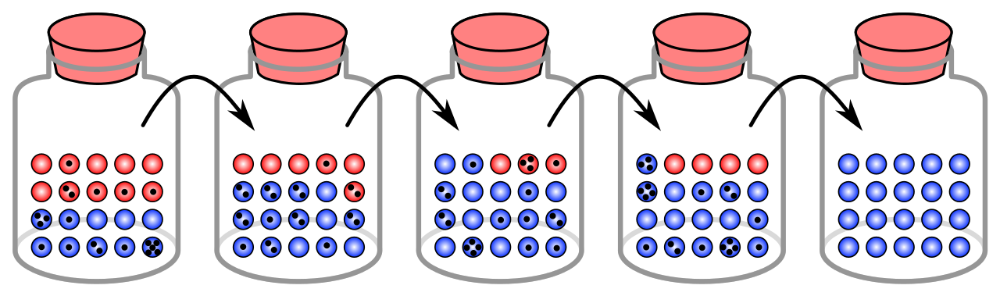

The moral of the story for demographic stochasticity was: weird things (e.g., extinction) can happen in small populations!

Weird things like random extinction just would **never happen** in large populations!

Same goes for *genetic drift*! Genetic drift is a small-population phenomenon!

In large populations, you could never randomly get **fixation** of a particular gene (this could happen via natural selection, but not through random reproductive processes). 

Let's imagine that the balls in the jars in the above figure are individuals. The black dots indicate how many offspring that individual will have (thereby passing on its genes). Finally, let's imagine that the red balls are individuals that are more likely to survive a rare drought (but have no selective advantage or disadvantage under normal circumstances). 

Under these conditions, the number of births is completely random. And if this was a sexually reproducing diploid population, mating would be completely random too. 

Just by random chance, the blue individuals happen to reproduce more than the red individuals- and the red individuals go extinct. Does this sound similar to a process we have already discussed in this class? 

And now, by random chance, this population is now more susceptible to drought!


### Inbreeding depression

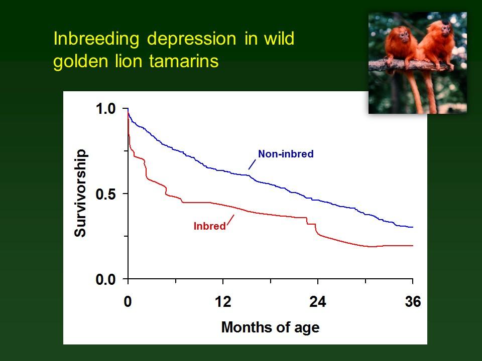

Inbreeding depression is similar to genetic drift, but more specific! Again, inbreeding problems only occur in small populations.

Most diploid populations have some "bad genes" floating around. These are often called **deleterious alleles**. These deleterious alleles usually don't cause problems becuase in general they are **recessive** - that is, the bad effect is only apparent if an individual has _two copies of that allele_! 


Why is it more likely to get two copies of the same allele if your two parents are close relatives? 

The above image of Charles II of Spain indicates what can happen when you inherit too many alleles that are identical by descent!

Why is it more likely for your two parents to be close relatives if you are living in a small population?

## Extinction vortex

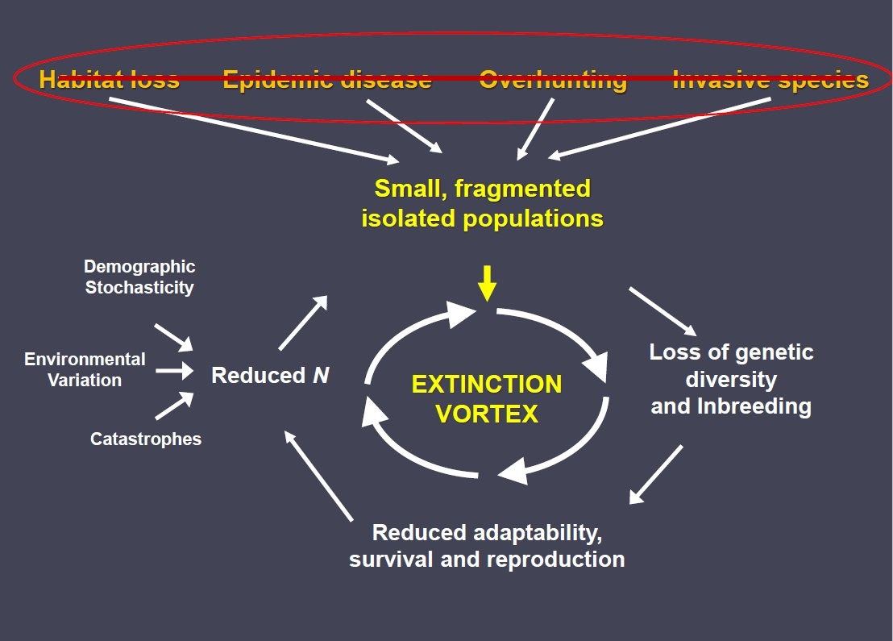


One of the central ideas arising from the small population paradigm is the concept of the **extinction vortex**. This concept is illustrated in the above figure.

Once a population gets small enough, it becomes subject to catastrophic declines due to demographic stochasticity, leading to inbreeding and random loss of useful genes, leading to reduced vital rates, leading to smaller population sizes, leading to further genetic degradation, leading to more possibility of catastrophic declines due to demographic stochasticity, leading to ... EXTINCTION!!

## Minimum Viable Populations (MVP)

We have seen this concept already, in the context of the Allee Effect. However, there is a more general definition, related to the extinction vortex. 

**Minimum Viable Population** is defined as that *population size whereby the extinction vortex can be safely averted*! 

## Population Viability Analysis (PVA)

Population Viability Analysis (PVA) is often used to model the processes in the extinction vortex, including genetic drift. In this class, we won't get into modeling genetics (that's for a different course!)

The most widely-used PVA software, [Vortex](http://www.vortex10.org/Vortex10.aspx), gets its name from the extinction vortex concept. Vortex does allow explicit modeling of inbreeding and loss of genetic diversity in small populations.  


## Example: Aruba island rattlesnake

The aruba island rattlesnake, or Cascabel (*Crotalus durissus unicolor*), is the top predator on the island of Aruba, and primarily consumes rodents. 


The Aruba island rattlenake, as you might expect, occurs only on the island of Aruba.


The Aruba rattlesnake is listed as *Critically Endangered* by IUCN, and has several attributes that make it particularly susceptible to falling into the extinction vortex:

- Range is limited to the small island of Aruba
    **Q**: why does this matter?
- Total abundance is estimated as 250 individuals
- Population has been declining due to:
    - loss and degradation of habitat (overgrazing, human encroachment, forest clearing)
    - human persecution


[--go to next lecture--](LECTURE10.html)


<!--chapter:end:LECTURE9.Rmd-->

---
title: "Links"
author: "NRES 746"
date: "August 23, 2016"
output: 
  html_document: 
    theme: spacelab
    toc: yes
    toc_float: yes
---

```{r setup, include=FALSE}
knitr::opts_chunk$set(echo = TRUE)
```

Please let me know if there are other links that you think should be included on this page!

## Software  

- [InsightMaker- free web-based systems modeling tool](https://insightmaker.com/)    
- [R- free statistical programming language](https://cran.r-project.org/)
- [Program MARK](http://warnercnr.colostate.edu/~gwhite/mark/mark.htm)

[Weekly math/bio "Stats chats"](https://kevintshoemaker.github.io/StatsChats/)


<!--chapter:end:Links.Rmd-->

---
title: "Guest lecture, PVA basics"
author: "NRES 421/621"
date: "Mar 27, 2017"
output: 
  html_document: 
    theme: spacelab
    toc: yes
    toc_float: yes
---

```{r setup, include=FALSE}
knitr::opts_chunk$set(echo = TRUE, cache = TRUE)
```

## Population Viability Analysis (PVA)

For the next three class periods, we will explore the use of **population models** to address conservation questions-- a process known as **population viability analysis (PVA)** 

PVA is essentially a set of practical approaches to problem-solving in conservation, and wildlife management via creative application of *demographic theory*, *simulation models* and *statistics*. 

As much as possible we will use hands-on activities to explore the fundamentals of PVA. We will use [InsightMaker- a free web-based systems modeling tool](https://insightmaker.com/) for running simulation models.  

First we will build a PVA for the grizzly bears of Yellowstone National Park!


We will end this mini-course by building a PVA for the loggerhead turtle, *Caretta caretta*, which is based on a paper by [Crowder et al 1994](Crowder1994.pdf).


*But even before any of that*, let's review some basic population ecology theory and mathematics which are the foundation of PVA!


## What is a population?

From Krebs (1972):

> “A group of organisms of the same species occupying a particular space at a particular time, with the potential to breed with each other"

From Cole (1957): 

> "A biological unit at the level of ecological integration where it is meaningful to speak of birth rate, death rate, sex ratios, and age structure in describing properties or parameters of the unit."

From Gotelli (1998):

> "A group of plants, animals, or other organisms, all of the same species, that live together and reproduce."

From [NOAA website](http://coris.noaa.gov/glossary/glossary_l_z.html): 

> "a group of individuals of the same species living in the same area at the same time and sharing a common gene pool; a group of potentially interbreeding organisms in a geographic area" 

*Defining a population is not always straightforward...*. Spatial boundaries defining populations sometimes are easily defined, but more typically are vague and difficult to determine.

Population size, or abundance, is often represented as $N$, and is the most basic measurement of a wild population. 

## Exponential growth: the fundamental principle of population ecology


Giant puffballs produce 7 trillion offspring in one reproductive event.

... If all of those individuals reached adulthood, the descendants from just *two parent puffballs* would weigh more than the entire planet in two generations!

The reason? Populations grow *geometrically*, in a process called **exponential growth**. This is the foundational concept of population ecology, and this simple model has enormous resonance across all of ecology and evolution.   

## Mathematics and Ecology

"Mathematics seems to endow one with a new sense."    
  - Charles Darwin   
  
“Like most mathematicians, he takes the hopeful biologist to the edge of the pond, points out that a good swim will help his work, and then pushes him in and leaves him to drown.”   
  - Charles Elton, in reference to a work by Alfred Lotka   
  


"The importance of the method is this: if we know certain variables, mostly desired by ecologists and in some cases already determined by them, we can predict certain results which would not normally be predictable or even expected by ecologists. The stage of verification of these mathematical predictions has hardly begun; but their importance cannot be under-estimated."       
  - Charles Elton 


## Nomenclature for Population Ecology

First of all, we need a symbol to represent population size, or *abundance*. This is $N$, for the $N$umber of individuals!

$\Delta N$ represents the change in population size, ${N_{t+1}}-{N_t}$

The famous "BIDE" equation is a way to break down $\Delta N$ into components.

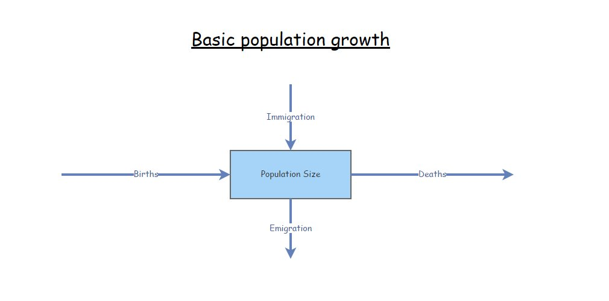

$\Delta N = B + I - D - E \qquad \text{(Eq. 1)}$

where $B$ represents the number of births, $I$ reprents the number of immigrants, $D$ represents the number of deaths, and $E$ represents the number of emigrants.    

If we ignore immigration and emigration, then the BIDE equation simplifies to:

$\Delta N = B - D \qquad \text{(Eq. 2)}$

Now let's focus on $B$ and $D$. The important thing to recognize is that the number of births and deaths in a population is not constant. 

What does the number of births depend on? 

What **is** more likely to be constant is the **per-capita rate** of producing offspring, or dying. Does this make sense? These per-capita rates are often expressed as lower case letters. So $b$  represents per-capita births, and $d$ represents per-capita deaths. 

$b = \frac {B_t}{N_t} \qquad \text{(Eq. 3)}$

--or--

$B_t = b \cdot N_t$

The letter $t$ of course represents time, which could be years, or minutes, or decades, or whatever! So the above equation could be described as follows: "the number of births at a given time is equal to the per-capita birth rate times the total population size at that time"

Similarly, 

$D_t = d \cdot N_t \qquad \text{(Eq. 4)}$

Okay, we're almost there.

If $\Delta N = B - D \qquad \text{(Eq. 5)}$ 

then

$\Delta N = b \cdot N_t - d \cdot N_t\qquad \text{(Eq. 6)}$

which is equal to 

$\Delta N = (b - d) \cdot N_t \qquad \text{(Eq. 7)}$

which could also be written:

$\Delta N = r \cdot N_t\qquad \text{(Eq. 8)}$  

Where $r$ represents the difference between births and deaths. If $r$ is positive, then births are greater than deaths and the population grows. If $r$ is negative then deaths exceed births and the population declines. 

We can use *calculus notation* to consider the instantaneous change in population size:

$\frac{\partial N}{\partial t} = r \cdot N  \qquad \text{(Eq. 9)}$ 

This simple formula represents **exponential growth** and is probably the *most fundamental equation of population ecology*. 

We will have time to explore this model in a few minutes!

A couple more quick notes:

The greek symbol lambda ($\lambda$), represents the *finite rate of growth*, or $\frac {N_{t+1}}{N_t}$. Lambda is what you multiply the current population size by to compute the population size in the next time step. 

$N_{t+1}=N_t + B - D  \qquad \text{(Eq. 11)}$         

$N_{t+1}=N_t + b \cdot N_t - d \cdot N_t  \qquad \text{(Eq. 12)}$ 

$N_{t+1}=N_t + (b - d) \cdot N_t \qquad \text{(Eq. 13)}$       

$N_{t+1}=N_t + r \cdot N_t  \qquad \text{(Eq. 14)}$   

$N_{t+1}=N_t \cdot (1 + r)  \qquad \text{(Eq. 15)}$         

$N_{t+1}=\lambda \cdot N_t  \qquad \text{(Eq. 16)}$ 

## Modeling!!

### Computer programming and systems thinking

Modern computers have reduced or eliminated many of the barriers to understanding how complex systems behave, and as a result **specialized software and computer programming** are a critical component to modern whole-systems analysis, including **ecosystems** analyses. Armed with basic facility with computer programming, ecologists and natural resource professionals can formalize their understanding of the natural systems in which they work, accounting for complex biological realities that may have been ignored if these tools were not available. **In these three classes, we will learn to use computer simulations for understanding and managing natural populations**.  

### *InsightMaker*: a simulation modeling framework for dynamic systems!

[InsightMaker](insightmaker.com) is a web-based visual programming language for modeling the dynamics of inter-connected systems.

A **dynamic system** essentially consists of [Stocks] and [Flows].

A [Stock] represents a quantity of something. The [Stock] only changes over time ONLY via [Flows In] or [Flows Out]. 

A [Stock] of stuff increases over time via what [Flows] in. Imagine our stock represents *Moose*! *Moose Births* would then be the input [Flow] to the population of *Moose* over time. 

A [Stock] of stuff decreases over time via what [Flows] out. For example, *Moose Deaths* could represent the [Flow] out of the population of *Moose*.

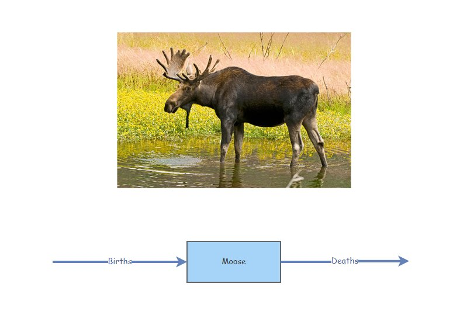

If the [Flow] in is larger than the [Flow] out then the [Stock] increases over time. 

If the [Flow] out is larger than the [Flow] in then the [Stock] decreases over time.

If the [Flow] in equals the [Flow] out then the amount in the [Stock] will not change over time.


## In-class activity: constructing a basic population simulation model

### Simple stock and flow model! 

1. Open up [InsightMaker](https://insightmaker.com/). If you have never used it before you need to sign up first with a username and password. *InsightMaker is free!*

2. Create a new "Insight" and clear the demo model. 

3. Right click in the center of the screen and select **Create Stock** from the pop-up. Notice that the name is *New Stock* and is selected. Type in a name for what this is an accumulation of (e.g., "Moose"!). Note the **Configuration Panel** on the right - where you can alter the settings for your [Stock]. In the configuration panel, set the *Initial Value* to 50. That is, there will be 50 moose at the start of the simulation!

4. Select [Flow] in the upper left corner of your screen under [Connections]. Now notice that when you mouse over the [Stock] a small right-arrow displays. Click on the right-arrow and drag a couple inches to the left of the [Stock] and release. This is how you create a [Flow] out of a [Stock]. To create a [Flow] into a [Stock] click the **Reverse** button in the **Connections** menu. Please do that now. You can name the [Flow] as you wish (e.g., "Births"!). Also in the **Configuration Panel** set **Flow Rate** equal to 1.

5. Now click **Run Simulation** and you have just finished your first simulation model!!

6. Can you figure out how to change the settings to run the model for 50 years? Try this and click **Run Simulation**.

7. Use the same methods as *step 4* to create a [Flow Out], representing moose deaths. Set the death rate to 1 moose per year. Re-run the model. Is the population increasing or declining? Why? 

8. Change the **Configuration Panel** for the [Stock] and for the [Flow In] and [Flow Out] so that "Show Value Slider" is set to "Yes". You can change the model parameterization easily using these sliders. Try it a couple times, re-running the simulation after each change. 

**Q**: Is this Moose model realistic? What is the first thing you would like to change to make the model more realistic?


## A more realistic model!

Now let's consider *per-capita* rates of birth and death in the population. This way, if the population is bigger, the total births will increase! 

9. To create a variable to store per-capita vital rates (per-capita birth and death rate), right-click on the canvas and select **Variable** from the drop-down. While the [Variable] is still selected rename it (per-capita) *birth rate*. Open the [Equation] window for *birth rate* and set it to 0.5 (if you mouse over *Stock* or *Flow* a small [$=$ Sign] will appear. If you click this it will open the **Equation** window where you can set values. 

10. Now draw a [Link] from *birth rate* to the "Births" [Flow]. In InsightMaker, flow of information is represented by a [Link]. To create a [Link], click **Link** in the **Connections** part of the toolbar. When you mouse over the *birth rate* click on the right-arrow, drag to the [Flow] and release. You now have a [Link] on top of the [Flow]. Now hold the Shift Key and click in the middle of the [Link] and a little little green node will be created on the [Link]. You can select this node and drag it to make a visually pleasing curved line! 

Your model should look something like this:

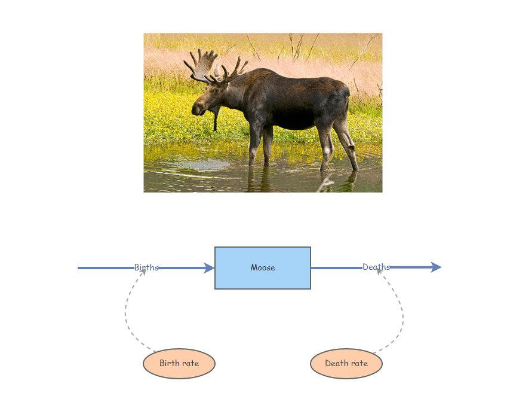

11. Open the *Equation editor window* for the [Flow] and set it to [Moose] times [birth rate]. To make sure you don't make any spelling errors, it's best to click on the variables you want in the right-hand panel of the equation editor. The equation in the equation editor window should look like this:

```
[Moose]*[Birth rate]
```

That is, the rate of inflow into the [Moose] stock is equal to the total number of moose multiplied by the per-capita birth rate.

12. For the [Moose], [Birth rate], and [Death rate], open the configuration panel and set "Show Value Slider" to "Yes". Set the "Slider Max" to 100 for moose, and 1 for birth and death rate. Make sure the number of moose is set to 50, the birth rate is set to 0.5, and the death rate is set to 0.4. 

13. Now click [Run Simulation]. How would you describe the results?

NOTE: If you are running into difficulties, you can always use [this working model](https://insightmaker.com/insight/76064/ICE-stocks-and-flows). Click on this link and then click "Clone Insight" in the top right corner of your screen. This will create a copy of the Insight that you can change as you wish!

**Q**: what happens if you set the birth rate equal to the death rate?

**Q**: what happens if you set the birth rate less than the death rate?

**Q**: is this model realistic?  What is the next thing you would like to change in this model?


## An even more realistic model!!

### Uncertainty!

Which one of these figures is most likely to be from a real wildlife population??

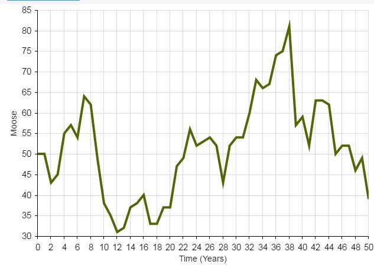

OR

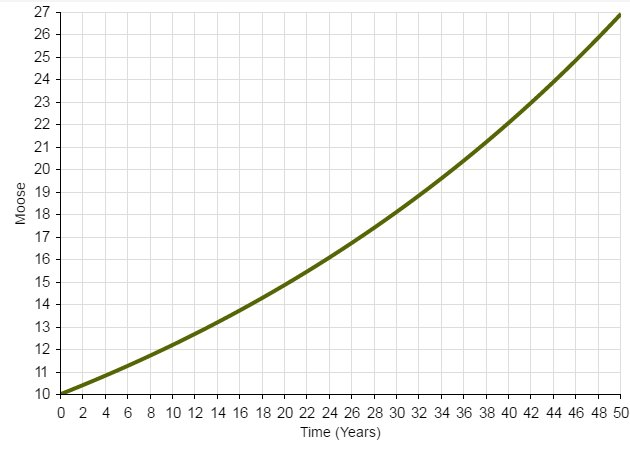

### Wildlife populations fluctuate over time!

... And these fluctuations are often difficult to predict!

That is to say...

### The future is uncertain!

All ecological systems are full of uncertainty. We all know it intuitively. But what *exactly* do we mean by that? And how can we deal with it? How can we incorporate it into our models? 

**Q**: if you were to re-run the basic population model you just made in InsightMaker ten times, how many different results would you get?

When a model outcome is the same every time (when starting with the same input values) we say that the model is **deterministic**.

BUT... ecological systems (e.g., dynamic populations) have inherent variability that is often *not predictable*. 

We can't predict with certainty whether or not an individual will mate, or die. 

We can't be certain whether next year or the year after that will be a good year or a bad year for offspring production or mortality!

The key is to **embrace uncertainty**. As population ecologists, we have some tricks to help us manage and account for unpredictable variation in our study systems:

### How to model uncertainty

When we incorporate **random processes** into models, the result can be different each time we run the model!

These are called **stochastic models**.

When we use stochastic models, we often want to run lots of **replicates**. Each replicate represents a possible future. 

We can then interpret the _cloud of possible futures_ rather than just the results from a single model run!

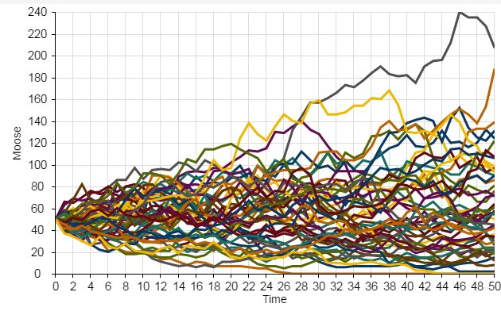
 
Here we see that the population went extinct in three replicates, out of a total of 50 replicates. 

**Q**: What is the extinction risk for this population?


#### Demographic stochasticity

When it comes to projecting who lives and dies, who gives birth and who doesn't, how many females are born to each individual in the population, we _just can't know that for sure_. 

In other words, we can't know whether an *individual* will be "lucky" or "unlucky" so to speak!

In population ecology this is called **demographic stochasticity**. 

#### Environmental Stochasticity

We usually can't predict whether next year or the year after will be a good one or a bad one for a *population*- that is, we don't know whether the per-capita vital rates (e.g., $b$, or $d$) will be more or less optimal year-to-year

In other words, we can't know whether a _population_ will be "lucky" or "unlucky", so to speak! 

In population ecology this is called **environmental stochasticity**.


## Random number generation
To ensure that each model run (replicate) -- or each year of each model run -- is different from one another, we can include at least one **random number generator** in our models! 

A random number generator is like a box of (potentially infinite) possible numbers -- a lottery ball machine for example! Each time we want a new number we reach in and pull one out, record the number, put it back in and shake it up again.


Every random-number generator has a **distribution**. This is a way of defining what exactly is in the box. For example, the box might have 10 "ones", 5 "twos", and 2 "threes". In this case the distribution looks like this (*probability* of each *possibility*):

```{r echo=FALSE}
box <- c(rep(1,10),rep(2,5),rep(3,2))
barplot(table(box)/sum(table(box)),ylab="probability",xlab="possibility")

```


A probability distribution can be pretty much anything you want it to be. However, there are several key distributions that come up again and again in nature, and we should know them, because they end up being major building blocks of PVA!

### Common probability distributions

#### Binomial distribution
Consider the probability of flipping a coin 10 times and getting 4 heads. This quantity would follow a *binomial distribution*  

```{r echo=FALSE}
#rbinom(10,10,0.3)    # the random numbers have no decimal component

             # plot a discrete distribution!
xvals <- seq(0,10,1)
probs <- dbinom(xvals,10,prob=0.3)
names(probs) <- xvals
               
barplot(probs,ylab="Probability",xlab="Possibilities",main="Binomial distribution (discrete)")

#barplot(cumsum(probs),ylab="Cumulative Probability",main="Binomial distribution (discrete)")   # cumulative distribution

#sum(probs)   # just to make sure it sums to 1!  Does it??? 

```

#### Poisson distribution

Another discrete distribution we will use in this PVA mini-course is the *Poisson distribution*:

```{r echo=FALSE}

             # plot a discrete distribution!
xvals <- seq(0,10,1)
probs <- dpois(xvals,lambda=2.2)
names(probs) <- xvals
               
barplot(probs,ylab="Probability",xlab="Possibilities",main="Poisson distribution (discrete)")


```

**Q** What population parameter might this distribution be useful for modeling?

#### Uniform distribution

In *continuous distributions*, there is an infinite set of possibilities in our random-number box between any upper and lower bound.   

Let's consider the *uniform distribution*: 

```{r}

lower = 0
upper = 10

curve(dunif(x,lower,upper),0,10,ylab="Probability (density)",xlab="Possibilities",main="Uniform distribution (continuous)",ylim=c(0,1))   # probability density

```

This isn't a very intersting looking distribution. All possible numbers from 0 to 10 are equally probable.


#### Normal distribution

Another continuous distribution you should know is called the *Normal distribution*. This distribution has a lower bound of $-\infty$ and an upper bound of $\infty$.

**Q** What population parameter might this distribution be useful for modeling?

```{r}
mean = 7.1
stdev = 1.9

curve(dnorm(x,mean,stdev),0,15,ylab="Probability (density)",xlab="Possibilities",main="Normal distribution (continuous)")   # probability density

```

### Return to InsightMaker!

1. Return to your Moose model (hopefully you saved it from last time!). Set *Birth rate* back to 0.5 and *Death rate* back to 0.4. Set initial abundance back to 50. Under the "Settings" menu set the model to run for 10 years. 

Make sure your *Population* stock can NOT go negative (this is a setting in the configurations panel: Allow Negatives = "No"). Hit "Simulate"- you should see *exponential growth*! 

#### Add _Demographic Stochasticity_  

2. We will use a *Binomial distribution* to represent the number of mortalities. That is, we _flip a coin the same number of times as there are individuals in the population_. If the coin comes up heads, then the individual dies. In this case we are using a biased coin- it only comes up heads 40% of the time! Each random draw from the *Binomial distribution* essentially represents the number of times heads came up (or the number of times mortality occurred). 

To do this in InsightMaker, open the equation window for the *Deaths* flow, and use the following formula to define the total number of deaths in the population each year:

```
RandBinomial([Population], [Death rate])
```

For the total births, $B$ we will use the *Poisson* distribution. The Poisson distribution is often use to represent births, because there could feasibly be more births than there are individuals currently in the population (e.g., if all individuals have two offspring!). This would not be possible with a binomial distribution! That is, the maximum number of "heads" (you can always think of binomial distributions as coin-flipping!) is the total number of individuals, period. 

To do this in InsightMaker, use the following formula for the *Births* flow:

```
RandPoisson([Population]*[Birth rate])
```

If you're having trouble, you can clone a working model [here](https://insightmaker.com/insight/76072/ICE-demographic-stochasticity)

3. Run the simulation. What does it look like?

4. Use the "Sensitivity Testing" tool (in the "Tools" menu, upper right corner) to run the model 50 times. Choose [Population] as the "Monitored Primitive". View the results!

5. Change the initial abundance to 500 and re-run the "Sensitivity Testing" tool.

6. Change the initial abundance to 10 and re-run the "Sensitivity Testing" tool.

**Q** Is the effect of *demographic stochasticity* bigger at low or high abundances?

**Q** Is there any risk of extinction in this population? 

**Q** In this model, did the *population vital rates* change at all? If not, why does it look different each time we run the model?


#### Add _Environmental Stochasticity_  

1. For now, set *Births* back to what it was before:

```
[Moose]*[Birth rate]
```

And do the same for *Deaths*!

```
[Moose]*[Death rate]
```

2. We will use a *Normal distribution* to represent how the birth rate changes each year. This could represent climatic variablity -- "good years" and "bad years". The *Normal distribution* is commonly used for this type of variability- it is characterized by an average value (**mean**) and a variability measure (**standard deviation**). To do this in InsightMaker, use the following formula for the *Birth Rate* variable:

```
RandNormal(0.4, 0.4)
```

Similarly, use the following formula for the *Death Rate* variable:

```
RandNormal(0.3, 0.3)
```

3. Use the "Sensitivity Testing" tool (in the "Tools" menu, upper right corner) to run the model 50 times. Choose [Population] as the "Monitored Primitive".

5. Change the initial abundance to 500 and re-run the "Sensitivity Testing" tool.

6. Note that the normal distribution CAN go below zero or above 1, which is often NOT biologically realistic! Let's **truncate** the normal distribution to behave more realistically. That is, if the random number you draw comes out less than zero, just set it to zero! 

For *birth rate*, this can be done like this:

```
Max(0,RandNormal(0.4, 0.4))
```

This forces birth rates to always be greater than or equal to zero.

For *death rate*, this can be done like this:

```
Min(1,Max(0,RandNormal(0.3, 0.3)))
```
This forces death rates to always be greater than or equal to zero.

Re-run the model with the modified/constrained random vital rates.

If you're having trouble, you can clone a working model [here](https://insightmaker.com/insight/77054/ICE-environmental-stochasticity)


**Q** Is the effect of *environmental stochasticity* bigger at low or high abundances? 

**Q** Under what circumstances can you envision small populations being more vulnerable to environmental stochasticity than large populations?

## Population Viability Analysis (PVA)

Before we move on do run some real PVA analysis, let's return to the topic of this mini-course: PVA.

Population Viability Analysis (PVA) is the _process of building and running a formal predictive population models for the purpose of gaining insight about present and future conservation status, or ranking alternative management options_.

### What are some questions you can address with PVA?

In general, we are interested in evaluating population-level risk under various **scenarios**. These scenarios could involve population size, different vital rates, or specific sources of mortality. 

We are often interested in evaluating the factors that threaten the present or future viability of a population. 

Just like population models, population threats can be classified as either deterministic or stochastic.

### Deterministic threats


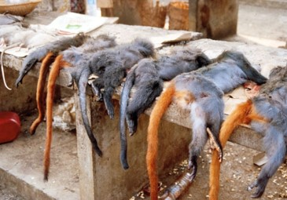

What is the population-level impact of the following? 

- Habitat fragmentation?
- Habitat degradation or loss?
- Direct Harvest?
- Exotic invasive species?
- Environmental toxins?

### Stochastic threats

What is the population-level impact of the following?

- Demographic stochasticity?
- Environmental stochasticity?
- Catastrophes?
- Loss of genetic diversity?

**Q**: which is more likely to cause a large population to become small: stochastic threas or deterministic threats?

**Q**: can you match the above concepts with the two paradigms of conservation biology: the *small-population paradigm* and the *declining-population paradigm*?

## The PVA process (recipe for PVA!)

 

NOTE: The process of building a PVA model is **iterative** and **non-linear**. 

For example -- after running your model (step 4) you might realize that your results (step 5) are totally unrealistic. This might prompt you to go back and change your conceptual model of the life history (step 1), and re-parameterize your model (step 2).   

### Step 1: Life history

*How does your population work?*

The first step is to conceptualize the life history for your species of interest. This can be done by visualized in a *life history diagram* (essentially and stock-and-flow diagram just like we have already been doing!), and think about the following questions:

- What is the maximum age?
- At what age do individuals start reproducing?
- Is it important to include males??

**Q**: Why do most population models ignore males??

### Step 2: Parameterize the demographic model!

This is where you attach *real numbers* to the stocks and flows in your conceptual life history diagram!

### Step 3: Spatial structure!

If you want to ask spatial questions, your model needs to be spatially explicit, or at least consider spatial structure in some way. The kinds of questions you might think about include:

- How many discrete populations? 
- At what rate do individuals move among these populations?

For the grizzly bear and loggerhead examples, we will not consider spatial structure!

### Step 4: Simulate!

You have already simulated simple population dynamics!

There are lots of options for simulation software- R, [InsightMaker](https://insightmaker.com/), [Vortex](http://www.vortex10.org/Vortex10.aspx), [Ramas](http://www.ramas.com/metapop), and much more!

What *scenarios* do you want to test in order to test your original questions?

### Step 5: Results

Finally, you need to make sense of all the simulations you just ran!  

There are two types of data analysis tools that you will need to be able to use the simulation results to answer your questions: **graphical visualization** and **statistical analysis**. 


Before we get into the PVA examples, let's just step back and look at the final stage of the PVA process- visualizing results and making conclusions. 

This is, after all, why we do PVA in the first place!!

## A Simple Demonstration PVA

To illustrate some of these concepts, let's build ourselves a very simple PVA model in R.

For this demo I'm using the *"R" programming language* because of its flexible and powerful visualization tools. You can download R for yourself from [this website](https://cran.r-project.org/): 

For simplicity, let's ignore age structure - that is, let's build a *scalar* PVA model.  

Also let's ignore parameter uncertainty for now. 

Here is the basic model parameterization:

```{r}

####
# Basic simulation parameters
####

nyears <- 100     # number of years
nreps <- 500      # number of replicates

####
# Basic life history parameters
####

R_max <- 1.03       # Maximum rate of growth (max lambda)
Init_N <- 51        # Initial abundance
K <- 175            # Carrying capacity

####
# Environmental stochasticity
####

SD_lambda <- 0.11  # standard deviation of lambda

####
# Density-dependence (Ricker model)
####

Ricker <- function(prev_abund){       # this is a function for computing next-year abundance -- includes env stochasticity
  prev_abund * exp(log(rnorm(1,R_max,SD_lambda))*(1-(prev_abund/K)))
}

####
# Catastrophe
####

Flood_prob <- 0.0     # 0% chance of major flood
Flood_lambda <- 0.25    # 25% of population can survive a flood, should it occur!


```

Now we can use these parameters to build a simple PVA model:

```{r}

## Set up data structures to store simulation results!

PVAdemo <- function(nreps,nyears,Init_N,R_max,K,Flood_prob,Flood_lambda){
  #browser()
  PopArray2 <- array(0,dim=c((nyears+1),nreps))
  
  ## start looping through replicates
  
  for(rep in 1:nreps){
    
    # set initial abundance
    PopArray2[1,rep] <- Init_N     # initial abundance
    
    ### loop through years
    for(y in 2:(nyears+1)){
      ### stochasticity and d-d
      nextyear <- max(0,trunc(Ricker(PopArray2[y-1,rep])))
      
      ### catastrophe
      if(runif(1)<Flood_prob) nextyear <- nextyear*Flood_lambda
      PopArray2[y,rep] <- nextyear 
    }
  }
  
  return(PopArray2)
}

### Run the PVA!

Default <- PVAdemo(nreps,nyears,Init_N,R_max,K,Flood_prob,Flood_lambda)

```


### Graphical visualization

There are several types of visualizations that you might want to use for your PVA models:

The first is to look at the "cloud" of abundance trajectories. This is the same type of figure we have seen in InsightMaker using the "Sensitivity testing" tool. 


```{r}
PlotCloud <- function(simdata){
  plot(c(1:101),simdata[,1],col=gray(0.7),type="l",ylim=c(0,max(simdata)),xlab="Years",ylab="Abundance")
  
  for(r in 2:ncol(simdata)){
    lines(c(1:101),simdata[,r],col=gray(0.7),type="l")
  }
}

PlotCloud(Default)

```

Okay, what do we learn from this? Really, it's a mess!!! 

If our question is about extinction risk, maybe we want to plot extinction risk by time... 

```{r}
Extinction_byyear <- function(simdata){
  apply(simdata,1,function(t)  length(which(t==0)))/ncol(simdata)
}

plot(c(1:101),Extinction_byyear(Default),type="l",lwd=2,xlab="year",ylab="extinction risk")
abline(h=0.05,col="red",lwd=2)


```


Maybe our question is about the probability of decline over 100 years ... 

In that case maybe we should present a histogram of final abundances...

```{r}
hist(Default[nrow(Default),],xlab="Final abundance after 100 years",ylab="Number of replicates",main="")
abline(v=Init_N,col="green",lwd=2)
```

We could compute the probability of decline by computing $\frac{number.declined}{total.simulations}$

```{r}
prob_decline <- round(length(which(Default[nrow(Default),]<Init_N))/ncol(Default),2)
cat("the probability of decline is: ", prob_decline)
```


What if our question is about the effect of flooding on extinction risk?

Let's imagine that the probability of flooding is not expected to change with climate change, but that the intensity of the flood damage is likely to increase substantially!

Currently, floods generally result in a 10% population reduction. But climate change could increase this number to as much as 90%. Let's look at how much this could increase extinction risk!

```{r}

Flood_prob <- 0.1     # 10% chance of major flood

Exctinction_risk <- function(simdata){
  length(which(simdata[nrow(simdata),]==0))/ncol(simdata)
}

flood_lambdas <- seq(0.9,0.1,by=-0.05)

all_scenarios <- numeric(length(flood_lambdas))
for(scenario in 1:length(flood_lambdas)){
  PVA <- PVAdemo(nreps,nyears,Init_N,R_max,K,Flood_prob,flood_lambdas[scenario])
  all_scenarios[scenario] <- Exctinction_risk(PVA)
}

plot(flood_lambdas,all_scenarios,type="p",cex=2,xlab="flood impact (lambda in flood year)",ylab="extinction risk")
abline(h=0.05,col="red",lwd=2)

```

## ASIDE: matrix population models: 

We can present yearly fecundity and survival probabilities compactly in a **projection matrix** [A] which we use to project the population size year to year.

We all remember the finite-population-growth equation:

$N_{t+1}=\lambda \cdot N_t   \qquad \text{(Eq. 1)}$,

where $N$ is abundance (as always), $t$ is time, often in years but could be any time units, and $\lambda$ is the multipicative growth rate over the time period $t \rightarrow t+1$

The matrix population growth equation looks pretty much the same!

$\mathbf{N}_{t+1} = \mathbf{A} \cdot \mathbf{N}_{t}   \qquad \text{(Eq. 2)}$,

where $\mathbf{N}$ is a **vector** of abundances (abundance for all stages), and $\mathbf{A}$ is the **transition matrix**, which we have seen before.

We can be more explicit about this if we re-write the above equation this way:

$\begin{bmatrix}N_1\\ N_2\\N_3 \end{bmatrix}_{t+1}=\begin{bmatrix}0 & F_2 & F_3\\ P_{1 \rightarrow 2} & P_{2 \rightarrow 2} & 0\\ 0 & P_{2 \rightarrow 3} & P_{3 \rightarrow 3}\end{bmatrix} \cdot \begin{bmatrix}N_1\\ N_2\\N_3 \end{bmatrix}_{t}    \qquad \text{(Eq. 3)}$

Where $P_{1 \rightarrow 2}$ is the probability of advancing from stage 1 to 2, and $F_2$ is the **fecundity** of stage 2.

There are three important types of transitions. 

- $F_i$ = Fecundities, or the number of new turtles (hatchlings) produced by an average individual of size-class *i* per year. This is the top row of the transition matrix.
- $S_i$ = Stage Survival, or fraction of size *i* turtles surviving and staying in the same size-class per year. These are the diagonal elements of the matrix
- $G_i$ = fraction of size *i* turtles surviving and growing to size-class *i + 1* per year. These are the subdiagonal elements of the matrix. 

NOTE: _fecundity is NOT the same thing as birth rate_, $b$. What's the difference?

Birth rate, $b_t$, is the _per-capita rate of offspring production_ for stage $t$  

Fecundity, $F_t$, is the _per-capita rate by which an individual of stage $t$ contributes new offspring to the population at time $t+1$. Sounds pretty similar, right? What's the difference??

Fecundity also takes into account the survival rate from $t$ to $t+1$!!  For an adult of stage $t$ to contribute to the next generation, _it must both survive and reproduce_!.

$F_t = P_{1 \rightarrow 2} \cdot  b_{t+1}    \qquad \text{(Eq. 4)}$

There is a lot we can do with matrix population models. The most obvious one is *projection*:

### Projection:

We have already seen the projection equation (*Eq. 2*, above). Here is how we can implement this in R:

```{r eval=FALSE}

Year1 <- projection_matrix %*% Abundance_year0  # matrix multiplication!
  
```

Let's try it!:

First, let's build a *projection matrix*:

```{r}

projection_matrix <- matrix(
  c(
    0,     1.2,   3.1,
    0.4,   0,     0,
    0,     0.75,   0
  )
  ,nrow=3,ncol=3,byrow=T
)

projection_matrix

```

Next, let's build an initial abundance vector:

```{r}
Abundance_year0 <- c(1000,0,0)
Abundance_year0
```

Now we can run the code for real!

```{r}
Year1 <- projection_matrix %*% Abundance_year0  # matrix multiplication!
Year1
```

Now we have 300 individuals in stage 2!

Let's project one more year:

```{r}
Year2 <- projection_matrix %*% Year1  # matrix multiplication!
Year2
```

Here is some R code to project many years into the future!  

```{r}
nYears <- 20                                            # set the number of years to project
TMat <- projection_matrix                               # define the projection matrix
InitAbund <- Abundance_year0                            # define the initial abundance

  ## NOTE: the code below can be re-used without modification:
allYears <- matrix(0,nrow=nrow(TMat),ncol=nYears+1)     # build a storage array for all abundances!
allYears[,1] <- InitAbund  # set the year 0 abundance                                    
for(t in 2:(nYears+1)){   # loop through all years
  allYears[,t] <-  TMat %*% allYears[,t-1]
}
plot(1,1,pch="",ylim=c(0,max(allYears)),xlim=c(0,nYears+1),xlab="Years",ylab="Abundance",xaxt="n")  # set up blank plot
cols <- rainbow(3)    # set up colors to use
for(s in 1:3){
  points(allYears[s,],col=cols[s],type="l",lwd=2)     # plot out each life stage abundance, one at a time
}
axis(1,at=seq(1,nYears+1),labels = seq(0,nYears))   # label the axis
legend("topleft",col=cols,lwd=rep(2,3),legend=paste("Stage ",seq(1:nrow(TMat))))  # put a legend on the plot
```


[--go to grizzly PVA!--](PVA2_421.html)


<!--chapter:end:PVA1_421.Rmd-->

---
title: "Grizzly bear PVA example"
author: "NRES 421/621"
date: "Mar 26, 2017"
output: 
  html_document: 
    theme: spacelab
    toc: yes
    toc_float: yes
---

```{r setup, include=FALSE}
knitr::opts_chunk$set(echo = TRUE, cache = TRUE)
```


## PVA for Yellowstone grizzly bears!

By the time we meet on Tuesday, April 18 be sure that this model is running on your laptop (in InsightMaker) because we will be exploring the model more fully in class together, and use this PVA to do some management-relevant **scenario testing**.


Our goal is to better understand the future of the grizzly bear population in Yellowstone park, and the processes that may regulate this population!

Let's walk through the basic steps in building and running a PVA model: 

#### Step 1: life history diagram

Based on the literature that we have read, we determine that there are four main stages in the grizzly bear life history: cub, yearling, subadult and adult! The adult stage is the only one that is reproductive!

Therefore, our conceptual life history diagram looks something like this!

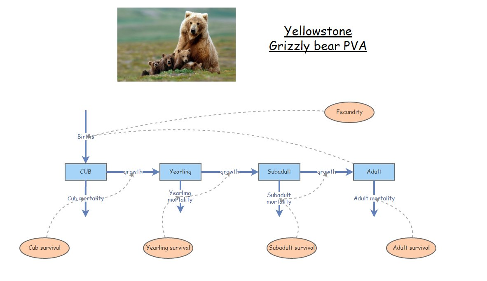

You can clone the base grizzly bear model [here](https://insightmaker.com/insight/77056/Yellowstone-Grizzlies). This model has not yet been parameterized!

#### Step 2: parameterize!

Let's use this table to parameterize the population vital rates in our model!

This table actually has *two alternative parameterizations*, one representing the period from 1983 to 2001, and the other representing the period from 2002-2011. 

Remember that we are not paying any attention to males!

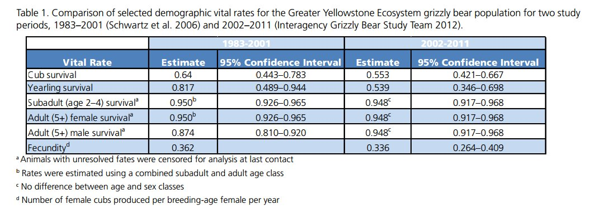

The table is from [this scientific report](YellowstoneScience-BearIssue.pdf) ([alternative link](https://www.nps.gov/yell/learn/upload/YellowstoneScience-BearIssue.pdf))

What about population size? For any simulation we always need to initialize abundance!

From [Schwartz et al 2006](schwarz_grizzly1.pdf) we know that:

1. Adult females represent approximately a quarter (25%) of the (female0.553) population. 
2. Total abundance of adult females in the greater Yellowstone park area was approximately 5 in 1983 and approximately 30 in 2002 

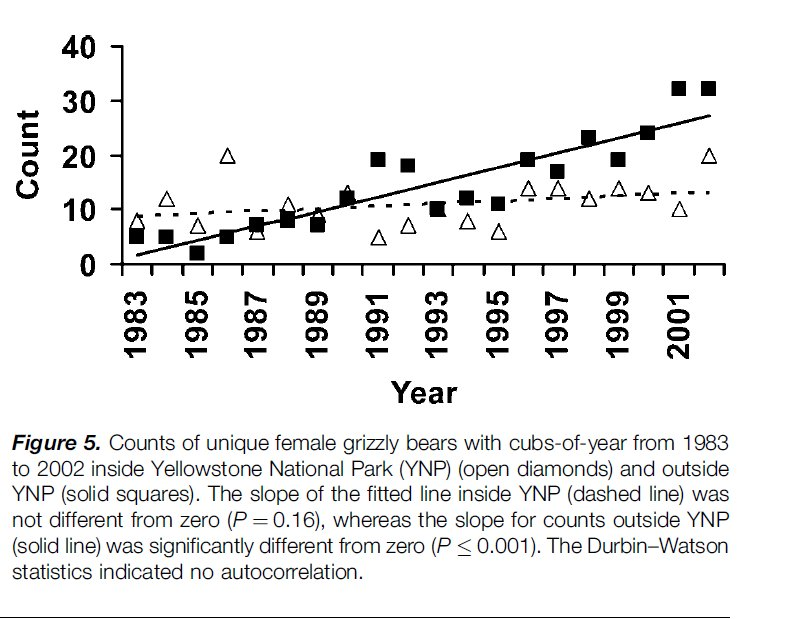

Let's use the initial (1983) abundances (all female!) to initialize our model:

*Cubs:* 5   
*Yearlings:* 5   
*Subadults:*  5   
*Adults:* 5   

Take a moment to parameterize the model!

#### Step 3: Spatial structure

We are ignoring spatial structure for this PVA!

#### Step 4: Simulate!

Okay, let's run the model!

Again, you can clone the base grizzly bear model [here](https://insightmaker.com/insight/77056/Yellowstone-Grizzlies) if you haven't already.

1. Try running the model with the parameterization we discussed above. What do you notice? Is the population growing?


*REALITY CHECK*:       

**Q**: Given that the population of adult females is known to have increased to around 30 individuals by the year 2002, is this model realistic??      

2. What if we configure the model to run for 100 years? What happens now?

**Q**: *NOW* do you think this is biologically realistic? Why or why not?

3. Let's change the parameterization to reflect the vital rates observed for the period 2002 to 2011 in the table:


In 2002 the population was more like 30 females- so let's use the following parameterization!

*Cubs:* 30   
*Yearlings:* 30   
*Subadults:*  30   
*Adults:* 30

**Q**: What do you notice about this model? Is it still growing? What about the overall *rate of growth* of the population?

**Q**: Which vital rates changed the most from 1983 to 2002? 

**Q**: Can you think of any reason for this change?

##### Density-dependence

4. Let's implement a new process into our model- **density-dependence**!

We know that when the adult (female) population size was around 5, yearling survival was around 82%

We also know that when the adult (female) population size was around 30, yearling survival dropped to around 54%

Can you calculate a **linear relationship** between population size and yearling survival? When abundance increased by 25, yearling survival decreased by a little more than 25% (28% to be exact). 

**SLOPE**: For each additional individual in the adult population, yearling survival decreased by 1.12.

**INTERCEPT**: When there were 5 adults, yearling survival was 81.7%. If there were 0 individuals in the adult population, yearling survival would be $81.7 + 1.12\cdot 5$, which is 87.6%. 

To convert back to a fraction, we divide this linear model by 100!

So the linear formula for computing yearling survival as a function of adult female abundance should be:

$Surv_{yearling} = \frac{\left (  87.6 - 1.12*N_{female} \right )}{100}$

Let's implement this *density-dependent process* in Insightmaker!

- Create a [Link] between female abundance and yearling survival.
- Open the *equation editor* for yearling survival, and input the linear equation above! 

Run the model! What do you notice?

**Q**: What is the **carrying capacity** of this population? NOTE: you may need to run the model for longer than 100 years! NOTE: this is an **emergent property** of our new model!

**Q**: Do you notice an *oscillatory pattern* in abundance over time? NOTE: this is also an **emergent property** of our new model!

**Q**: Why is this type of model called **density-dependent**?

NOTE: if necessary, you can clone a density-dependent version of the grizzly model [here](https://insightmaker.com/insight/77058/Yellowstone-Grizzlies-DD)

### Grizzly bear exercise

**Answer the following questions**:

1. Run the grizzly bear PVA with and without the density-dependence process. In each case, what is the *extinction risk* after 100 years? In each case (with and without density-dependence), what is the approximate 95% confidence interval for the total population abundance after 100 years? Under which scenario is the *conservation outlook* best for grizzly bears in Yellowstone park? 

2. For the *density-independent* model, what is the extinction risk if you changed yearling survival to its **lower confidence limit** in the above table (from 2002-2011)? Does the *parameter uncertainty* in the above table make a difference for the conservation outlook for this population?? NOTE: remember to change yearling survival back to 0.539 for the density-independent model!

3. In each case (with and without density-dependence), what is the *extinction risk* if you changed the initial abundance in each stage to 2? Given that a viable population is defined as a risk of extinction of < 10% over 100 years, can you identify a **minimum viable population** for this population? 

**HELPFUL HINTS:**    

- For the *density-independent* scenario, set the yearling survival rate to 0.54 -- the value estimated from 2002 to 2011.
- All parameters aside from yearling survival should be the same between the two scenarios (so that the presence/absence of the density-dependence process is the only difference between the scenarios). I suggest you use all parameters estimated for the period 2002 to 2011, just to be consistent! 
- For both scenarios, set the initial abundance to 5 for each stage (the numbers observed inside the park in 1983). 
- Use the "sensitivity testing" option in the "Tools" menu to run multiple simulations (>100 *replicates*). You can assess extinction risk using the following formula:

$\frac{extinctions}{replicates}$

Where *extinctions* is the total number of replicates where the abundance declined to zero, and *replicates* is the total number of independent simulation replicates you ran. Similarly, you can assess the probability of failing to meet an important conervation criterion (e.g., population remaining above MVP) as the fraction of replicates that failed to meet the specified criterion. 


[--go to loggerhead PVA--](PVA3_421.html)


<!--chapter:end:PVA2_421.Rmd-->

---
title: "Loggerhead PVA example"
author: "NRES 421/621"
date: "Mar 26, 2017"
output: 
  html_document: 
    theme: spacelab
    toc: yes
    toc_float: yes
---

```{r setup, include=FALSE}
knitr::opts_chunk$set(echo = TRUE, cache = TRUE)
```

# PVA for loggerhead turtles!

This PVA example shows the use of demographic data in projecting a population into the future. By the time we meet on Tuesday, April 17 be sure that this model is running on your laptop (in InsightMaker) because we will be exploring the model more fully in class together, and we will use this PVA to do some management-relevant **scenario testing**

NOTE: the Excel exercise below is *optional*! 


## Constructing a demographic (matrix) model data for loggerhead turtles

If you would like more background information on loggerhead turtles, visit these websites:     

[](http://ecos.fws.gov/species_profile/servlet/gov.doi.species_profile.servlets.SpeciesProfile?spcode=C00U)       
[](http://www.nmfs.noaa.gov/prot_res/species/turtles/loggerhead.html)       
[](http://www.tpwd.state.tx.us/huntwild/wild/species/endang/animals/reptiles_amphibians/logghead.phtml)       

### Background


The loggerhead turtle, *C. caretta*, is a large marine turtle that nests along the Atlantic coast from New Jersey to Texas, but is also found along the Pacific coast and in Hawaii.  

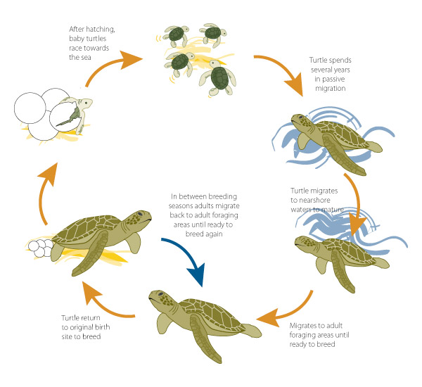

The species has been federally listed as 'threatened' since 1978.  When a species is listed, the Endangered Species Act (ESA) requires that a recovery plan be drafted whose goal is to eventually remove the species from the list.

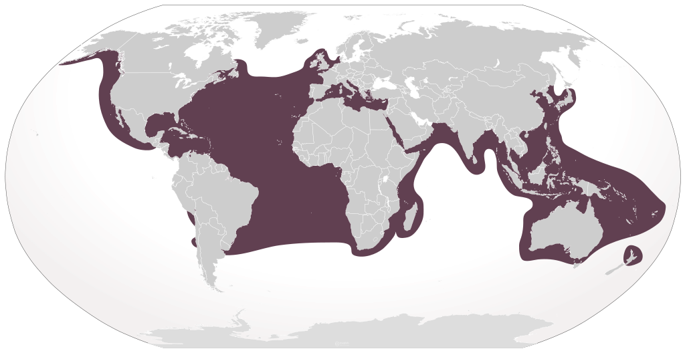

### Threats

Biologists have identified two key types of threats facing loggerheads that stem from a long lifespan (30-55 years) linking terrestrial and marine environments. 

1. **Threats to nesting beaches**


Adult females lay their eggs (ca. three nests every 2-3 years, up to 190 eggs/nest) on sandy beaches between April and September. Eggs incubate under the sand for about 2 months, and juveniles make a mad dash for the water upon hatching.  
Because beaches are popular sites for human recreation and development, arriving female turtles and hatching juveniles face risks including 

- *poaching* (eggs or adults)
- *beach erosion* or beach fortification to prevent erosion
- *artificial lighting*
- *recreational vehicles*
- ... and many others.

2. **Incidental mortality due to marine fisheries**

Once hatchlings reach the ocean, they face different threats as they slowly develop to maturity.  

- Hatchlings and juveniles feed in coastal seagrass mats which are also frequented by shrimp boats and other inshore trawling vessels. Hence *accidental capture ("bycatch")* and subsequent drowning in the nets and traps used by these vessels is common.  

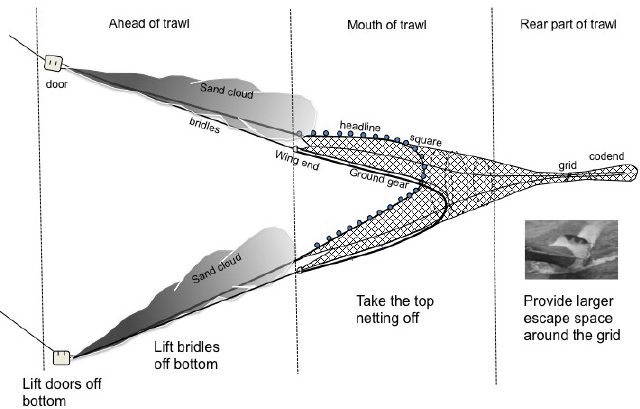

- Moreover, during cold temperatures turtles may go dormant, burying themselves in muddy bays and estuaries.  While dormant they can be killed by periodic *dredging* to maintain bays and waterways.  

- Moreover, human-produced debris (styrofoam peanuts, plastic bags, tar balls, and balloons) may cause *entanglement*, stranding, and drowning.

- In addition to these primary threats, seagoing juveniles and adults face mortality due to *bycatch* in longline, hook-and-line, and trap fisheries targeting tuna and other species.  

- Shallow swimming turtles may also collide with *boat propellers*.  

- Toxins (*pesticides and heavy metals*) and oil spills may harm turtle physiology and decrease fecundity, but their impact has not been quantified.  

- Finally, although rare in the US, *illegal harvest* of eggs  as well as subadults and adults for meat, may occur frequently in the coastal Caribbean (Panama, Honduras).  Turtle eggs are occasionally seen in open-air markets in Panama.

### Step 1: Building a size-structured Model

The loggerhead is a long-lived species -- sexual maturity often doesn't occur until animals are almost 30 years of age! The life cycle of the loggerhead is best described by distinct **stage classes** defined by body size (carapace (shell) length).

Once turtle life-stages with similar vital rates have been identified, three pieces of data (*transition rates*) must be collected to construct the size-structured model:

1.  fraction of turtles surviving each year but not advancing to the next larger size-class;
2.  fraction of turtles surviving each year and advancing to the next larger size-class; and
3.  average number of eggs produced by females of each size-class per year.

### Step 2: parameterize the model

Transition rates for turtles and other species are often estimated on the basis of *capture-mark-recapture* (CMR) data. 

Here are some estimates, from [this paper](crowder1994.pdf):

*Transition from stage 1-2*: 0.675    
*Transition from stage 2-3*: 0.047   
*Transition from stage 3-4*: 0.019      
*Transition from stage 4-5*: 0.061     
*Transition from stage 2-2*: 0.703     
*Transition from stage 3-3*: 0.657      
*Transition from stage 4-4*: 0.682     
*Transition from stage 5-5*: 0.809     
*Transition from stage 4-1*: 4.67     
*Transition from stage 5-1*: 61.90     


```{r echo=FALSE}

projection_matrix <- matrix(
  c(
    0,     1.2,   3.1,
    0.4,   0,     0,
    0,     0.75,   0
  )
  ,nrow=3,ncol=3,byrow=T
)

#projection_matrix

```


```{r echo=FALSE}
Abundance_year0 <- c(1000,0,0)
#Abundance_year0
```

```{r echo=FALSE}
Year1 <- projection_matrix %*% Abundance_year0  # matrix multiplication!
#Year1
```

```{r echo=FALSE}
Year2 <- projection_matrix %*% Year1  # matrix multiplication!
#Year2
```

```{r echo=FALSE}

nYears <- 20                                            # set the number of years to project
TMat <- projection_matrix                               # define the projection matrix
InitAbund <- Abundance_year0                            # define the initial abundance

  ## NOTE: the code below can be re-used without modification:
allYears <- matrix(0,nrow=nrow(TMat),ncol=nYears+1)     # build a storage array for all abundances!
allYears[,1] <- InitAbund  # set the year 0 abundance                                    
for(t in 2:(nYears+1)){   # loop through all years
  allYears[,t] <-  TMat %*% allYears[,t-1]
}
# plot(1,1,pch="",ylim=c(0,max(allYears)),xlim=c(0,nYears+1),xlab="Years",ylab="Abundance",xaxt="n")  # set up blank plot
# cols <- rainbow(3)    # set up colors to use
# for(s in 1:3){
#   points(allYears[s,],col=cols[s],type="l",lwd=2)     # plot out each life stage abundance, one at a time
# }
# axis(1,at=seq(1,nYears+1),labels = seq(0,nYears))   # label the axis
# legend("topleft",col=cols,lwd=rep(2,3),legend=paste("Stage ",seq(1:nrow(TMat))))  # put a legend on the plot
```

### Step 3: spatial structure

We are not modeling spatial structure, so we can skip this one!

### Step 4: simulate!

We can project the loggerhead population into the future using *matrix multiplication* (for more background on matrix projections, look at the [lecture notes](PVA1_421.html) on "PVA basics")!

We can do this using any number of tools- including R, Excel, or Insightmaker. 

Since you probably are most familiar with Excel, let's do it in Excel first! 

## OPTIONAL: population projection in Excel!

You can load the base Excel model [here](Loggerhead2017.xlsx)

#### Build the baseline loggerhead projection matrix [A]

- Your initial spreadsheet should look something like this:

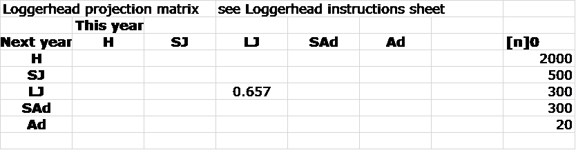

- Use the transition rates to complete the baseline projection matrix for the loggerhead turtles. For example, the yearly transition probability from large juveniles to large juveniles ($S_3$) is 0.657. Recall that the transition rates are:

*Transition from stage 1-2*: 0.675    
*Transition from stage 2-3*: 0.047   
*Transition from stage 3-4*: 0.019      
*Transition from stage 4-5*: 0.061     
*Transition from stage 2-2*: 0.703     
*Transition from stage 3-3*: 0.657      
*Transition from stage 4-4*: 0.682     
*Transition from stage 5-5*: 0.809     
*Transition from stage 4-1*: 4.67     
*Transition from stage 5-1*: 61.90     

- Wherever a transition is not possible, e.g., from hatchlings to large juveniles, enter a zero.

- Make sure you understand what the matrix telling you.  

**Q**: How many  large-juveniles out of 1000 will survive AND grow to be subadults the following year?

**Q**: what is the total survival rate for, e.g., large juveniles?

Your projection matrix should look like this!

```{r}

projection_matrix <- matrix(
  c(
    0,     0,      0,      4.665,      61.896,
    0.675, 0.703,  0,      0,          0,
    0,     0.047,  0.657,  0,          0,
    0,     0,      0.019,  0.682,      0,
    0,     0,      0,      0.061,      0.809
  )
  ,nrow=5,ncol=5,byrow=T
)

projection_matrix

```

```{r echo=FALSE}
Abundance_year0 <- c(2000,500,300,300,20)
Abundance_year0
```


#### Forecast the population into the future in Excel

The projection matrix can be used to project future loggerhead population size assuming the transition probabilities (the $F_i$, $S_i$, and $G_i$) do not change over time. 

**Q**: Is this model *deterministic* or *stochastic*? 

Let's use the following initial densities in our model!

- 2000	size-class 1 (Hatchlings)
- 500	size-class 2 (Sm. juveniles)
- 300	size-class 3 (Lg. juveniles)
- 300	size-class 4 (Subadults)
- 20	size-class 5 (Adults)

So your EXCEL file should look something like the one below (but with the transition rates filled in!):

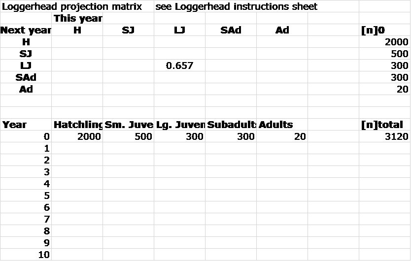

Using the 'size-distribution vector', we can project the population size of each size-class next year using the matrix formula: $\mathbf{N}_{t+1} = \mathbf{A} \cdot \mathbf{N}_{t}$ . 

This formula calculates the size distribution next year (i.e., in year *t + 1*) based on the projection matrix $\mathbf{A}$ and the size distribution this year $\mathbf{N}_{t}$.  

For example, to calculate the first row of [n]t +1, the number of hatchlings:

*hatchlings in year 1 = 2000x0 + 500x0 + 300x0 + 300x4.665 + 20x61.896 = 2637.42*     

We systematically multiply each entry of the first row of [A] by the entries in column [n]0 and sum up these values.  The first entry in row 1 is multiplied by the first entry of the column vector.  The second entry of row 1 is multiplied by the second entry of the column vector, and so forth, until all 5 entries of row 1 have been accounted for.

**Q**: Using actual numbers as for hatchlings above, write out the equation for calculating the number of small juveniles (sm juv) in year 1 based on $\mathbf{A}$ and $\mathbf{N}_{0}$:

**Number of small juveniles in year 1 = **

Now we can enter formulas in Excel to calculate the stage distribution vector for year 1.  

For example, our formula for computing the number of hatchlings in year 1 might look something like this:

```
	= B$4*B12 + C$4*C12 + D$4*D12 + E$4*E12 + F$4*F12
	
```

And the projected number of small juveniles (SJ) in year 1 might look like this:

```
	= B$5*B12 + C$5*C12 + D$5*D12 + E$5*E12 + F$5*F12
```

**Q**: What is the formula for the projected number of large juveniles in year 1?

Finally, create an additional formula in (f) [cells H12-H13] which calculates the total population size in a year (the sum of all size-classes):

In Excel, this will look something like this:
	
```	
=SUM(B12:F12)
```

You should note two things about the formulas:

1. The references to the rows of the [A] matrix should be absolute, i.e., have a '$' in front of the row number.  This is because when we drag these formulas down, we want them to continue to refer to the correct row of the [A] matrix.

2. The references to the size distribution vector should *not* be absolute (should not contain the '$').  

**Q**: Why?  (Hint:  what are we going to do with this model?)

ADDITIONAL NOTE:  If your data are in different columns and rows than described above, you will not be able to copy the above formulas exactly, as they will not be referring to the proper cells in your file.  So make sure your formulas are correct for your particular EXCEL file.

**Q**: Use your [A] matrix and skills in EXCEL to project the loggerhead population 100 years in the future.  This will require dragging formulas down. This is equivalent to iterating (i.e., repeating) the matrix multiplication process 100 times.


Your results should look similar to this (which was done in R):

```{r}
nYears <- 100                                            # set the number of years to project
TMat <- projection_matrix                               # define the projection matrix
InitAbund <- Abundance_year0                            # define the initial abundance

  ## NOTE: the code below can be re-used without modification:
allYears <- matrix(0,nrow=nrow(TMat),ncol=nYears+1)     # build a storage array for all abundances!
allYears[,1] <- InitAbund  # set the year 0 abundance                                    
for(t in 2:(nYears+1)){   # loop through all years
  allYears[,t] <-  TMat %*% allYears[,t-1]
}
plot(1,1,pch="",ylim=c(0,max(allYears)),xlim=c(0,nYears+1),xlab="Years",ylab="Abundance",xaxt="n")  # set up blank plot
cols <- rainbow(5)    # set up colors to use
for(s in 1:5){
  points(allYears[s,],col=cols[s],type="l",lwd=2)     # plot out each life stage abundance, one at a time
}
axis(1,at=seq(1,nYears+1),labels = seq(0,nYears))   # label the axis
legend("topright",col=cols,lwd=rep(2,3),legend=paste("Stage ",seq(1:nrow(TMat))),bty="n")  # put a legend on the plot
```

## Projecting the loggerhead population in InsightMaker

First, clone the baseline loggerhead PVA model [here](https://insightmaker.com/insight/77078/Loggerhead-PVA-base-model)

Hit "Simulate". Make sure that the model results look the same as the above figure! 

Look over the model, and make sure that you understand the inner workings!

### Group exercise (in class!): loggerhead management

Working in groups of 2-3, investigate three management scenarios for the loggerhead turtle population:

1. Improve fecundity via nest-site protection!
    - Improve by 50%
    - Improve by 100%
2. Improve hatchling survival via nest monitoring
    - Improve _to_ 90%
    - Improve _to_ 100%
3. Improve large juvenile survival using Turtle Excluder Devices (TEDs)
    - Improve by 15%
    - Improve by 25%
4. Improve adult/subadult survival by restricting longline fisheries.
    - Improve by 5%
    - Improve by 10%
    
    
    

For each scenario, consider:

- The short-term outlook (4-6 years out)
- The longer-term outlook (25 years out)
- The long-term outlook (100 years out)

**Q**: What is your management recommendation for this population??

**Q**: In the base model, why does the population always seem to grow during the first few years of the simulation, even if it ultimately declines?

**Q**: What is the *stable stage distribution*?

**Q**: In what year is the *stable stage distribution* reached? What if you play around with the initial abundances to make it start closer to stable stage distribution?


#### References

Mills, L. S., S. G. Hayes, C. Baldwin, M. J. Wisdom, J. Michael, J. Citta, D. J. Mattson, and K. Murphy.  1996.  Factors Leading to Different Viability Predictions for a Grizzly Bear Data Set.  Conservation Biology 10 (3), 863-873.  doi: 10.1046/j.1523-1739.1996.10030863.x

Morris, W. F. and D. F. Doak.  2002.  Quantitative conservation biology:  Theory and practice of population viability analysis.  Sinauer, Sunderland, MA.

Morris, W. F., D. F. Doak, M. Groom, P. Kareiva, J Fieberg, L. Gerber, P. Murphy, D. Thomson.  1999. A practical handbook for population viability analysis.  The Nature Conservancy, Wash., DC.


<!--chapter:end:PVA3_421.Rmd-->

---
title: "Schedule, Spring 2018"
author: "NRES 470"
date: "January, 2018"
output: 
  html_document: 
    theme: spacelab
    toc: no
    toc_float: no
---

```{r setup, include=FALSE}
knitr::opts_chunk$set(echo = TRUE)
```

Please check for updates frequently!

```{r include=FALSE}
courseSchedule <- read.csv("CourseSchedule.csv")
```

```{r results='asis', echo=FALSE}
knitr::kable(courseSchedule,caption="")

```

<!--chapter:end:schedule.Rmd-->

